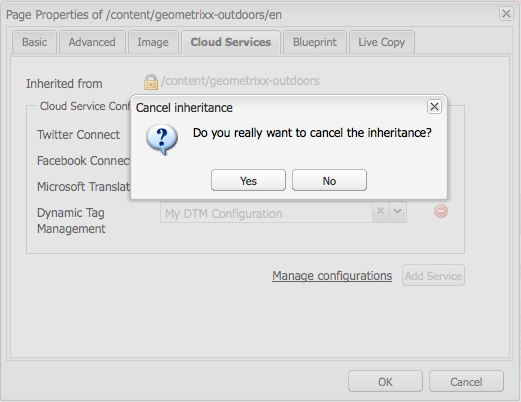

# Adobe 다이내믹 태그 관리 {#integrating-with-adobe-dynamic-tag-management}와 통합

다이내믹 태그 관리 웹 속성을 사용하여 AEM 사이트를 추적할 수 있도록 [Adobe 다이내믹 태그 관리](https://www.adobe.com/solutions/digital-marketing/dynamic-tag-management.html)를 AEM과 통합합니다. 다이내믹 태그 관리를 통해 마케터는 데이터 수집을 위한 태그를 관리하고 디지털 마케팅 시스템에 데이터를 배포할 수 있습니다. 예를 들어 다이내믹 태그 관리를 사용하여 AEM 웹 사이트에 대한 사용 데이터를 수집하고 Adobe Analytics 또는 Adobe Target에서 분석을 위해 데이터를 배포합니다.

통합하기 전에 AEM 사이트의 도메인을 추적하는 다이내믹 태그 관리 [웹 속성](https://microsite.omniture.com/t2/help/en_US/dtm/#Web_Properties)을 만들어야 합니다. 다이내믹 태그 관리 라이브러리에 액세스하도록 AEM을 구성할 수 있도록 웹 속성의 [호스팅 옵션](https://microsite.omniture.com/t2/help/en_US/dtm/#Hosting__Embed_Tab)을 구성해야 합니다.

통합을 구성한 후 다이내믹 태그 관리 배포 도구 및 규칙을 변경해도 AEM에서 다이내믹 태그 관리 구성을 변경할 필요가 없습니다. 변경 사항은 AEM에서 자동으로 사용할 수 있습니다.

>[!NOTE]
>
>사용자 지정 프록시 구성과 함께 DTM을 사용하는 경우, 3.x API를 사용하고 있는 AEM의 일부 기능과 4.x API를 사용하는 다른 DTM을 모두 구성해야 합니다.
>
>* 3.x는 [http://localhost:4502/system/console/configMgr/com.day.commons.httpclient](http://localhost:4502/system/console/configMgr/com.day.commons.httpclient)로 구성됩니다.
>* 4.x는 [http://localhost:4502/system/console/configMgr/org.apache.http.proxyconfigurator](http://localhost:4502/system/console/configMgr/org.apache.http.proxyconfigurator)로 구성됩니다.

>

## 배포 옵션 {#deployment-options}

다음 배포 옵션은 다이내믹 태그 관리와의 통합 구성에 영향을 줍니다.

### {#dynamic-tag-management-hosting}을(를) 호스팅하는 다이내믹 태그 관리

AEM은 클라우드에서 호스팅되거나 AEM에서 호스팅되는 다이내믹 태그 관리를 지원합니다.

* 클라우드 호스팅:다이내믹 태그 관리 javascript 라이브러리는 클라우드에 저장되고 AEM 페이지는 이를 직접 참조합니다.
* AEM 호스팅:다이내믹 태그 관리는 javascript 라이브러리를 생성합니다. AEM에서는 워크플로우 모델을 사용하여 라이브러리를 가져와 설치합니다.

구현에서 사용하는 호스팅 유형에 따라 수행하는 구성 및 구현 작업 중 일부가 결정됩니다. 호스팅 옵션에 대한 자세한 내용은 다이내믹 태그 관리 도움말의 [호스팅 - 포함 탭](https://microsite.omniture.com/t2/help/en_US/dtm/#Hosting__Embed_Tab)을 참조하십시오.

### 스테이징 및 프로덕션 라이브러리 {#staging-and-production-library}

AEM 작성자 인스턴스에서 다이내믹 태그 관리 스테이징 또는 프로덕션 코드를 사용할지 여부를 결정합니다.

일반적으로 작성자 인스턴스는 다이내믹 태그 관리 스테이징 라이브러리를 사용하고 프로덕션 인스턴스는 프로덕션 라이브러리를 사용합니다. 이 시나리오를 사용하면 작성자 인스턴스를 사용하여 승인되지 않은 다이내믹 태그 관리 구성을 테스트할 수 있습니다.

원하는 경우 작성자 인스턴스에서 프로덕션 라이브러리를 사용할 수 있습니다. 웹 브라우저 플러그인은 라이브러리를 클라우드에 호스팅할 때 테스트 목적으로 스테이징 라이브러리의 사용 간을 전환할 수 있도록 해줍니다.

### 다이내믹 태그 관리 배포 후크 사용 {#using-the-dynamic-tag-management-deployment-hook}

AEM에서 다이내믹 태그 관리 라이브러리를 호스팅하는 경우 다이내믹 태그 관리 배포 후크 서비스를 사용하여 라이브러리 업데이트를 자동으로 AEM에 푸시할 수 있습니다. 다이내믹 태그 관리 웹 속성 속성을 편집할 때와 같이 라이브러리를 변경하면 라이브러리 업데이트가 푸시됩니다.

배포 후크를 사용하려면 다이내믹 태그 관리에서 라이브러리를 호스트하는 AEM 인스턴스에 연결할 수 있어야 합니다. 다이내믹 태그 관리 서버에 대해 [AEM](/help/sites-administering/dtm.md#enabling-access-for-the-deployment-hook-service)에 대한 액세스를 활성화해야 합니다.

AEM이 방화벽 뒤에 있는 경우처럼 어떤 상황에서는 AEM에 연결할 수 없습니다. 이러한 경우 AEM 폴링 가져오기 옵션을 사용하여 라이브러리를 정기적으로 검색할 수 있습니다. cron 작업 표현식은 라이브러리 다운로드 일정을 지정합니다.

## 배포 후크 서비스 {#enabling-access-for-the-deployment-hook-service}에 대한 액세스 활성화

다이내믹 태그 관리 배포 후크 서비스를 활성화하여 서비스가 AEM 호스팅 라이브러리를 업데이트할 수 있도록 AEM에 액세스합니다. 필요에 따라 스테이징 및 프로덕션 라이브러리를 업데이트하는 다이내믹 태그 관리 서버의 IP 주소를 지정합니다.

* 스테이징: `107.21.99.31`
* 제작:`23.23.225.112` 및 `204.236.240.48`

[웹 콘솔](/help/sites-deploying/configuring-osgi.md#osgi-configuration-with-the-web-console) 또는 [`sling:OsgiConfig`](/help/sites-deploying/configuring-osgi.md#osgi-configuration-in-the-repository) 노드를 사용하여 구성을 수행합니다.

* 웹 콘솔에서 구성 페이지의 Adobe DTM 후크 구성 항목을 사용합니다.
* OSGi 구성의 경우 서비스 PID는 `com.adobe.cq.dtm.impl.servlets.DTMDeployHookServlet`입니다.

다음 표에서는 구성할 속성에 대해 설명합니다.

| 웹 콘솔 속성 | OSGi 속성 | 설명 |
|---|---|---|
| 스테이징 DTM IP 허용 목록 | `dtm.staging.ip.whitelist` | 스테이징 라이브러리를 업데이트하는 다이내믹 태그 관리 서버의 IP 주소입니다. |
| 프로덕션 DTM IP 허용 목록 | `dtm.production.ip.whitelist` | 프로덕션 라이브러리를 업데이트하는 다이내믹 태그 관리 서버의 IP 주소입니다. |

## 다이내믹 태그 관리 구성 만들기 {#creating-the-dynamic-tag-management-configuration}

AEM 인스턴스가 다이내믹 태그 관리로 인증하고 웹 속성과 상호 작용할 수 있도록 클라우드 구성을 만듭니다.

>[!NOTE]
>
>DTM 웹 속성에 Adobe Analytics 도구가 포함되어 있고 [Content Insight](/help/sites-authoring/content-insights.md)도 사용하고 있는 경우 2개의 Adobe Analytics 추적 코드가 페이지에 포함되지 않도록 합니다. [Adobe Analytics 클라우드 구성](/help/sites-administering/adobeanalytics-connect.md#configuring-the-connection-to-adobe-analytics)에서 [추적 코드 포함 안 함] 옵션을 선택합니다.

### 일반 설정 {#general-settings}

<table>
 <tbody>
  <tr>
   <th>속성</th>
   <th>설명</th>
  </tr>
  <tr>
   <td>API 토큰</td>
   <td>다이내믹 태그 관리 사용자 계정의 API 토큰 속성 값입니다. AEM에서는 이 속성을 사용하여 다이내믹 태그 관리에 인증합니다.</td>
  </tr>
  <tr>
   <td>회사</td>
   <td>로그인 ID가 연결된 회사입니다.</td>
  </tr>
  <tr>
   <td>속성</td>
   <td>AEM 사이트의 태그를 관리하기 위해 만든 웹 속성의 이름입니다.</td>
  </tr>
  <tr>
   <td>작성자에 대한 프로덕션 코드 포함</td>
   <td>
AEM 작성자 및 게시 인스턴스가 다이내믹 태그 관리 라이브러리의 제작 버전을 사용하도록 하려면 이 옵션을 선택합니다. 
 
이 옵션을 선택하지 않으면 스테이징 설정이 작성자 인스턴스에 적용되고 프로덕션 설정이 게시 인스턴스에 적용됩니다.
 </td>
  </tr>
 </tbody>
</table>

### 자체 호스팅 속성 - 스테이징 및 프로덕션 {#self-hosting-properties-staging-and-production}

다이내믹 태그 관리 구성의 다음 속성은 AEM에서 다이내믹 태그 관리 라이브러리를 호스팅할 수 있도록 합니다. 속성을 통해 AEM에서 라이브러리를 다운로드하고 설치할 수 있습니다. 선택적으로 다이내믹 태그 관리 애플리케이션에서 수행한 변경 사항을 반영하도록 라이브러리를 자동으로 업데이트할 수 있습니다.

일부 속성은 다이내믹 태그 관리 웹 속성에 대한 포함 탭의 라이브러리 다운로드 섹션에서 가져오는 값을 사용합니다. 자세한 내용은 다이내믹 태그 관리 도움말의 [라이브러리 다운로드](https://microsite.omniture.com/t2/help/en_US/dtm/#Library_Download)를 참조하십시오.

>[!NOTE]
>
>AEM에서 다이내믹 태그 관리 번들을 호스팅하는 경우 구성을 만들기 전에 다이내믹 태그 관리에서 라이브러리 다운로드를 활성화해야 합니다. 또한 Akamai가 다운로드할 라이브러리를 제공하므로 Akamai를 활성화해야 합니다.

AEM에서 다이내믹 태그 관리 라이브러리를 호스팅하면 AEM은 구성에 따라 웹 속성의 일부 속성을 자동으로 구성합니다. 다음 표의 설명을 참조하십시오.

<table>
 <tbody>
  <tr>
   <th>속성</th>
   <th>설명</th>
  </tr>
  <tr>
   <td>자체 호스팅 사용</td>
   <td>AEM에서 다이내믹 태그 관리 라이브러리 파일을 호스팅하는 시기를 선택합니다. 이 옵션을 선택하면 이 테이블의 다른 속성이 표시됩니다.</td>
  </tr>
  <tr>
   <td>DTM 번들 URL</td>
   <td>다이내믹 태그 관리 라이브러리를 다운로드하는 데 사용할 URL입니다. 다이내믹 태그 관리의 라이브러리 다운로드 페이지의 URL 다운로드 섹션에서 이 값을 얻습니다. 보안상의 이유로 이 값은 수동으로 구성해야 합니다.</td>
  </tr>
  <tr>
   <td>다운로드 워크플로우</td>
   <td>
다이내믹 태그 관리 라이브러리를 다운로드하고 설치하는 데 사용할 워크플로우 모델입니다. 기본 모델은 기본 DTM 번들 다운로드입니다. 사용자 지정 모델을 만들지 않은 경우 이 모델을 사용합니다.
 
기본 다운로드 워크플로우는 라이브러리를 다운로드할 때 라이브러리를 자동으로 활성화합니다.
 </td>
  </tr>
  <tr>
   <td>도메인 힌트</td>
   <td>
(선택 사항) 다이내믹 태그 관리 라이브러리를 호스팅하는 AEM 서버의 도메인입니다. <a href="/help/sites-developing/externalizer.md">Day CQ Link Externalizer 서비스</a>에 대해 구성된 기본 도메인을 재정의할 값을 지정합니다.
 
다이내믹 태그 관리에 연결되면 AEM에서는 이 값을 사용하여 다이내믹 태그 관리 웹 속성에 대한 라이브러리 다운로드 속성의 스테이징 HTTP 경로 또는 프로덕션 HTTP 경로를 구성합니다.
 </td>
  </tr>
  <tr>
   <td>보안 도메인 힌트</td>
   <td>
(선택 사항) HTTPS를 통해 다이내믹 태그 관리 라이브러리를 호스팅하는 AEM 서버의 도메인입니다. <a href="/help/sites-developing/externalizer.md">Day CQ Link Externalizer 서비스</a>에 대해 구성된 기본 도메인을 재정의할 값을 지정합니다.
 
다이내믹 태그 관리에 연결되면 AEM은 이 값을 사용하여 다이내믹 태그 관리 웹 속성에 대한 라이브러리 다운로드 속성의 스테이징 HTTPS 경로 또는 프로덕션 HTTPS 경로를 구성합니다.
 </td>
  </tr>
  <tr>
   <td>공유 비밀</td>
   <td>
(선택 사항) 다운로드를 해독하는 데 사용할 공유 암호입니다. 다이내믹 태그 관리의 라이브러리 다운로드 페이지의 공유 암호 필드에서 이 값을 얻습니다.
 
<strong>참고:</strong> AEM이 다운로드한 라이브러리의   암호를 해독할 수 있도록 AEM이 설치된 컴퓨터에 OpenSSL 라이브러리가 설치되어 있어야 합니다.
 </td>
  </tr>
  <tr>
   <td>폴링 가져오기 활성화</td>
   <td>
(선택 사항) 업데이트된 버전을 사용하고 있는지 확인하기 위해 다이내믹 태그 관리 라이브러리를 주기적으로 다운로드 및 설치하려면 선택합니다. 이 옵션을 선택하면 다이내믹 태그 관리는 HTTP POST 요청을 배포 후크 URL로 보내지 않습니다.
 
AEM은 다이내믹 태그 관리 웹 속성에 대한 라이브러리 다운로드 속성의 후크 URL 배포 속성을 자동으로 구성합니다. 이 옵션을 선택하면 값이 없는 상태로 속성이 구성됩니다. 선택하지 않으면 속성은 다이내믹 태그 관리 구성의 URL로 구성됩니다.
 
다이내믹 태그 관리 배포 후크를 AEM에 연결할 수 없는 경우(예: AEM이 방화벽 뒤에 있는 경우) 폴링 가져오기를 활성화합니다.
 </td>
  </tr>
  <tr>
   <td>예약 표현식</td>
   <td>(나타나며 [투표 가져오기 사용]을 선택하면 필요합니다.) 다이내믹 태그 관리 라이브러리가 다운로드될 때 제어하는 cron 표현식.</td>
  </tr>
 </tbody>
</table>

### 클라우드 호스팅 속성 - 스테이징 및 프로덕션 {#cloud-hosting-properties-staging-and-production}

다이내믹 태그 구성이 클라우드를 통해 호스팅될 때 다이내믹 태그 관리 구성에 대해 다음 속성을 구성합니다.

<table>
 <tbody>
  <tr>
   <th>속성</th>
   <th>설명</th>
  </tr>
  <tr>
   <td>자체 호스팅 사용</td>
   <td>다이내믹 태그 관리 라이브러리 파일이 클라우드에 호스팅되면 이 옵션을 지우십시오.</td>
  </tr>
  <tr>
   <td>헤더 코드</td>
   <td>
호스트에 대한 다이내믹 태그 관리에서 얻은 스테이징용 머리글 코드입니다. 이 값은 다이내믹 태그 관리에 연결할 때 자동으로 채워집니다.
 
 다이내믹 태그 관리의 코드를 보려면 포함 탭을 클릭한 다음 호스트 이름을 클릭합니다. 머리글 코드 섹션을 확장하고 필요에 따라 스테이징 포함 코드의 포함 코드 복사 또는 프로덕션 포함 코드 영역을 클릭합니다.
 </td>
  </tr>
  <tr>
   <td>바닥글 코드</td>
   <td>
호스트의 다이내믹 태그 관리에서 가져온 스테이징용 바닥글 코드입니다. 이 값은 다이내믹 태그 관리에 연결할 때 자동으로 채워집니다.
 
다이내믹 태그 관리의 코드를 보려면 포함 탭을 클릭한 다음 호스트 이름을 클릭합니다. 바닥글 코드 섹션을 확장하고 필요에 따라 스테이징 포함 코드의 포함 코드 복사 또는 프로덕션 포함 코드 영역을 클릭합니다.
 </td>
  </tr>
 </tbody>
</table>

다음 절차에서는 터치에 적합한 UI를 사용하여 다이내믹 태그 관리와의 통합을 구성합니다.

1. 레일에서 도구 > 작업 > 클라우드 > Cloud Services을 클릭합니다.
1. 다이내믹 태그 관리 영역에서 구성을 추가하기 위한 다음 링크 중 하나가 나타납니다.

   * 추가하려는 첫 번째 구성인 경우 지금 구성을 클릭합니다.
   * 하나 이상의 구성이 생성된 경우 구성 표시를 클릭한 다음 사용 가능한 구성 옆에 있는 + 링크를 클릭합니다.

   

1. 구성의 제목을 입력한 다음 만들기를 클릭합니다.
1. API 토큰 필드에 다이내믹 태그 관리 사용자 계정의 API 토큰 속성 값을 입력합니다.

   API 토큰의 값을 가져오려면 DTM 클라이언트 지원팀에 문의하십시오.

   >[!NOTE]
   >
   >API 토큰은 다이내믹 태그 관리 사용자가 명시적으로 요청할 때까지 만료되지 않습니다.

   

1. DTM에 연결을 클릭합니다. AEM은 다이내믹 태그 관리를 사용하여 인증하고 계정과 연결된 회사 목록을 검색합니다.
1. 회사를 선택한 다음 AEM 사이트를 추적하는 데 사용할 속성을 선택합니다.
1. 작성 인스턴스에서 스테이징 코드를 사용하는 경우 [작성자에 프로덕션 코드 포함]을 선택 해제합니다.
1. 필요한 경우 [스테이징 설정] 탭 및 [제작 설정] 탭에서 속성 값을 제공한 다음 [확인]을 클릭합니다.

## 다이내믹 태그 관리 라이브러리 수동으로 다운로드 {#manually-downloading-the-dynamic-tag-management-library}

다이내믹 태그 관리 라이브러리를 수동으로 다운로드하여 AEM에서 즉시 업데이트합니다. 예를 들어 폴링 가져오기가 라이브러리를 자동으로 다운로드하도록 예약하기 전에 업데이트된 라이브러리를 테스트하려는 경우 수동으로 다운로드할 수 있습니다.

1. 레일에서 도구 > 작업 > 클라우드 > Cloud Services을 클릭합니다.
1. 다이내믹 태그 관리 영역에서 구성 표시를 클릭한 다음 구성을 클릭합니다.
1. [스테이징 설정] 영역 또는 [프로덕션 설정] 영역에서 [다운로드 워크플로우 트리거] 단추를 클릭하여 라이브러리 번들을 다운로드하고 배포합니다.

   

>[!NOTE]
>
>다운로드한 파일은 `/etc/clientlibs/dtm/my config/companyID/propertyID/servertype` 아래에 저장됩니다.
>
>다음은 [DTM 구성](#creating-the-dynamic-tag-management-configuration)에서 직접 가져옵니다.
>
>* `myconfig`
>* `companyID`
>* `propertyID`
>* `servertype`

>

## 다이내믹 태그 관리 구성을 사이트 {#associating-a-dynamic-tag-management-configuration-with-your-site}에 연결

다이내믹 태그 관리 구성을 웹 사이트의 페이지와 연계하여 AEM이 페이지에 필요한 스크립트를 추가합니다. 사이트의 루트 페이지를 구성과 연결합니다. 해당 페이지의 모든 하위 멤버는 연결을 상속합니다. 필요한 경우 하위 페이지의 연결을 재정의할 수 있습니다.

다음 절차를 사용하여 페이지 및 하위 항목을 다이내믹 태그 관리 구성과 연결합니다.

1. 클래식 UI에서 사이트의 루트 페이지를 엽니다.
1. 사이드킥을 사용하여 페이지 속성을 엽니다.
1. Cloud Services 탭에서 서비스 추가를 클릭하고 다이내믹 태그 관리를 선택한 다음 확인을 클릭합니다.

   

1. 다이내믹 태그 관리 드롭다운 메뉴를 사용하여 구성을 선택한 다음 확인을 클릭합니다.

페이지에 대한 상속된 구성 연결을 재정의하려면 다음 절차를 사용하십시오. 재정의 옵션은 페이지와 모든 페이지 하위 항목에 영향을 줍니다.

1. 클래식 UI에서 페이지를 엽니다.
1. 사이드킥을 사용하여 페이지 속성을 엽니다.
1. Cloud Services 탭에서 상속된 항목 속성 옆에 있는 자물쇠 아이콘을 클릭한 다음 확인 대화 상자에서 예를 클릭합니다.

   

1. 다른 다이내믹 태그 관리 구성을 제거하거나 선택한 다음 확인을 클릭합니다.

