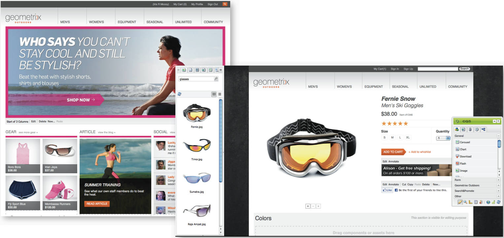
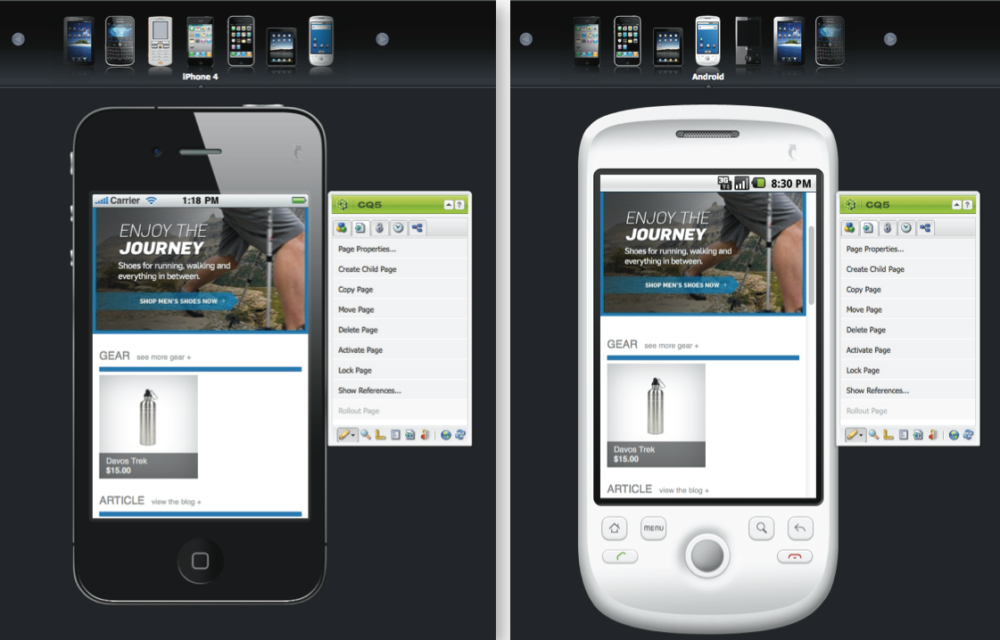

# eCommerce{#ecommerce}

* [개념](/help/sites-administering/concepts.md)
* [관리(일반)](/help/sites-administering/generic.md)

Adobe은 두 가지 버전의 Commerce Integration Framework를 제공합니다.

<table>
 <tbody>
  <tr>
   <th>
 
 </th>
   <th>
CIF on-prem
 </th>
   <th>
CIF Cloud
 </th>
  </tr>
  <tr>
   <td>
지원되는 AEM 버전
 </td>
   <td>
AEM on-prem 또는 AMS 6.x
 </td>
   <td>AEM AMS 6.4 및 6.5</td>
  </tr>
  <tr>
   <td>
백엔드
 </td>
   <td>
    <ul>
     <li>AEM, Java</li>
     <li>모놀리식 통합, 빌드 전 매핑(템플릿)</li>
     <li>JCR 저장소</li>
    </ul> </td>
   <td>
    <ul>
     <li>Magento</li>
     <li>Java 및 Javascript</li>
     <li>JCR 저장소에 저장된 상거래 데이터 없음</li>
    </ul> </td>
  </tr>
  <tr>
   <td>
프런트 엔드
 </td>
   <td>
AEM 서버측에서 렌더링된 페이지
 </td>
   <td>혼합 페이지 애플리케이션(혼합 렌더링)</td>
  </tr>
  <tr>
   <td>
제품 카탈로그
 </td>
   <td>
    <ul>
     <li>AEM에서 제품 가져오기, 편집기, 캐싱</li>
     <li>AEM 또는 프록시 페이지가 있는 일반 카탈로그</li>
    </ul> </td>
   <td>
    <ul>
     <li>제품 가져오기 없음</li>
     <li>일반 템플릿</li>
     <li>커넥터를 통한 온디맨드 데이터</li>
    </ul> </td>
  </tr>
  <tr>
   <td>
확장성
 </td>
   <td>
    <ul>
     <li>최대 몇 백만 개의 제품을 지원할 수 있음(사용 사례에 따라 다름)</li>
     <li>발송자에 캐싱</li>
    </ul> </td>
   <td>
    <ul>
     <li>볼륨 제한 없음</li>
     <li>발송자 또는 CDN에서 캐싱</li>
    </ul> </td>
  </tr>
  <tr>
   <td>표준화된 데이터 모델</td>
   <td>아니오</td>
   <td>예, Magento GraphQL 스키마</td>
  </tr>
  <tr>
   <td>사용 가능</td>
   <td>
예. SAP Commerce Cloud(AEM 6.4 및 Hybris 5(기본값)를 지원하도록 업데이트되었으며 Hybris 4와의 호환성을 유지합니다.
 
Salesforce Commerce Cloud(AEM 6.4를 지원하는 커넥터
 </td>
   <td>예. GitHub를 통해 오픈 소스를 통해 가능합니다. Magento Commerce(Magento 2.3.2(기본값)를 지원하며 Magento 2.3.1과 호환됩니다.)</td>
  </tr>
  <tr>
   <td>사용 시기</td>
   <td>제한된 사용 사례:예를 들어 작은 정적 카탈로그를 가져와야 하는 경우</td>
   <td>대부분의 사용 사례에서 선호하는 솔루션</td>
  </tr>
 </tbody>
</table>

eCommerce는 PIM(제품 정보 관리)과 함께 온라인 스토어를 통해 제품을 판매하는 데 주력하는 웹 사이트의 활동을 처리합니다.

* 제품의 생성, 수명 및 노후화
* 가격 관리
* 거래 관리
* 전체 카탈로그 관리
* 중앙 집중식 라이브 스토리지 기록
* 웹 인터페이스

AEM eCommerce를 통해 마케터는 웹, 모바일 및 소셜 접점에서 브랜드화되고 개인화된 쇼핑 경험을 전달할 수 있습니다. AEM 작성 환경을 사용하면 타겟 방문자 컨텍스트 및 머천다이징 전략에 따라 페이지 및 구성 요소를 사용자 정의할 수 있습니다.예를 들면 다음과 같습니다.

* 제품 페이지
* 장바구니 구성 요소
* 체크아웃 구성 요소

이 구현을 통해 제품 정보에 실시간으로 액세스할 수 있습니다. 다음을 적용하는 데 사용할 수 있습니다.

* 제품 정보 무결성
* 가격
* 재고 관리
* 장바구니 상태 변형

>[!NOTE]
>
>외부 e커머스 공급자와 통합 프레임워크를 사용하려면 먼저 필요한 패키지를 설치해야 합니다. 자세한 내용은 [eCommerce 배포](/help/sites-deploying/ecommerce.md)를 참조하십시오.
>
>전자 상거래 기능 확장에 대한 자세한 내용은 [eCommerce 개발](/help/sites-developing/ecommerce.md)을 참조하십시오.

## 기본 기능 {#main-features}

AEM eCommerce는 다음을 제공합니다.

* 프로젝트에 사용할 수 있는 사항을 설명하기 위한 **기본 AEM 구성 요소** 수:

   * 제품 표시
   * 장바구니
   * 체크아웃
   * 최근에 본 제품
   * 바우처
   * 및 기타

   

   >[!NOTE]
   >
   >AEM에서 제공하는 통합 프레임워크를 사용하면 특정 eCommerce 엔진과 독립적인 상거래 기능을 위한 AEM 구성 요소를 추가로 구축할 수도 있습니다.

* **검색**  - 다음 중 하나를 사용합니다.

   * aem 검색
   * 전자 상거래 시스템 검색
   * 타사 검색(예: Search &amp; Promote)
   * 또는 그 조합입니다.

   

* AEM 기능을 사용하여 전체 브라우저 창 또는 모바일 장치가 되도록 여러 채널&#x200B;**에 컨텐트를 표시합니다.** 이렇게 하면 방문자가 필요로 하는 형식으로 컨텐츠가 제공됩니다.

   

* **AEM eCommerce framework](#the-framework)**&#x200B;에 따라 고유한 통합 구현을 개발하는 기능[

   현재 사용 가능한 두 구현은 모두 일반 API(프레임워크)를 기반으로 한 동일한 기반으로 구축됩니다. 새 통합 구현은 통합에 필요한 기능을 구현하는 경우에만 포함됩니다. 프런트 엔드 구성 요소는 인터페이스를 사용할 때(구현과 독립적) 모든 새로운 구현에서 사용할 수 있습니다.

* 쇼핑 데이터 및 활동&#x200B;**에 따라**&#x200B;경험 중심의 상거래를 개발할 수 있습니다. 이를 통해 다음과 같은 다양한 시나리오를 실현할 수 있습니다.

   * 한 가지 예는 총 주문량이 특정 금액을 초과하는 경우 운송 비용을 줄이는 것입니다.
   * 프로필 데이터(예: 위치)를 사용하는 계절별 오퍼를 제공할 수도 있습니다. 그런 다음 필요할 때 다른 요소에 따라 다시 강조할 수 있습니다.

   아래의 예에서 장바구니의 컨텐츠가 $75 미만이면 티저가 표시됩니다.

   

   장바구니의 내용이 $75를 초과할 경우 이 값을 변경할 수 있습니다.

   

* 기타 기능:

   * 장바구니 컨텐츠는 세션 간에 유지됩니다.
   * 전체 주문 내역
   * 빠른 카탈로그 업데이트

## 프레임워크 {#the-framework}

[Concepts](/help/sites-administering/concepts.md) 섹션에서는 프레임워크를 보다 자세히 다루지만, 다음은 프레임워크에 대한 높은 수준의 고속 보기를 제공합니다.

### 뭐?{#what}

* 통합 프레임워크는 기능을 설명하는 다양한 구성 요소 및 연결 방법의 예를 제공하는 여러 확장 기능인 API를 제공합니다.
* 프레임워크는 프로젝트 구현에 필요한 기본 구조를 제공합니다.
* 프레임워크는 확장 가능합니다.
* 프레임워크는 즉시 사용할 수 있는 사이트를 제공하지 않습니다. 프레임워크를 사양에 맞게 조정하기 위해서는 특정 양의 개발 작업이 항상 필요합니다.

### 왜?{#why}

* 사용자 지정 e커머스 사이트를 신속하게 구현하는 데 필요한 기본 메커니즘을 제공하기 위해.
* Tp는 실제 e커머스 사이트를 개발하는 데 필요한 유연성을 제공합니다.
* 모범 사례를 보여줍니다.