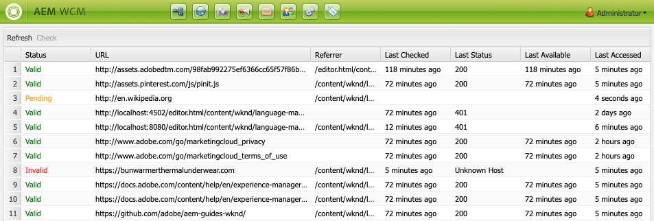

# 링크 확인 {#the-link-checker}

컨텐츠 작성자는 컨텐츠 페이지에 포함되는 모든 링크의 유효성을 검사하는 데 관여하지 않아도 됩니다.

링크 확인 은 컨텐츠 작성자가 다음과 같은 링크를 자동으로 지원합니다.

* 링크가 컨텐츠에 추가되면 링크의 유효성 검사
* 컨텐츠의 모든 외부 링크 목록 표시
* 링크 변환 수행

링크 확인 기능에는 유효성 검사 내부 정의, 특정 링크 또는 링크 패턴을 유효성 검사에서 생략하고 링크 재작성 규칙을 다시 작성하는 등의 여러 [구성 옵션](#configuring)이 있습니다.

링크 검사기는 [내부 링크](#internal)와 [외부 링크의 유효성을 모두 확인합니다.](#external)

>[!NOTE]
>
>링크 확인 기능은 모든 컨텐츠 페이지의 링크를 확인하므로 링크 확인 기능은 큰 저장소의 성능에 영향을 줄 수 있습니다. 이러한 경우, 링크 검사기가](#configuring) 또는 [를 실행하는 빈도를 [구성해야 할 수 있습니다.](#disabling)

## 내부 링크 확인 {#internal}

내부 링크는 AEM 저장소의 다른 컨텐츠에 대한 링크입니다. RTE의 경로 선택기 또는 사용자 지정 구성 요소를 사용하여 내부 링크를 추가할 수 있습니다. 예:

* 페이지 `/content/wknd/us/en/adventures/ski-touring.html`
* [텍스트 구성 요소의 `/content/wknd/us/en/adventures/extreme-ironing.html`에 대한 링크를 포함합니다.](https://experienceleague.adobe.com/docs/experience-manager-core-components/using/components/text.html)

컨텐츠 작성자가 페이지에 내부 링크를 추가하는 즉시 내부 링크의 유효성이 검사됩니다. 링크가 유효하지 않은 경우:

* 게시자에서 제거됩니다. 링크의 텍스트가 남아 있지만 링크 자체는 제거됩니다.
* 작성 인터페이스에 끊어진 링크로 표시됩니다.

## 외부 링크 확인 {#external}

외부 링크는 AEM 저장소 외부의 컨텐츠에 대한 링크입니다. RTE를 사용하거나 사용자 지정 구성 요소를 사용하여 외부 링크를 추가할 수 있습니다. 예:

* 페이지 `/content/wknd/us/en/adventures/ski-touring.html`
* [텍스트 구성 요소의 `https://bunwarmerthermalunderwear.com`에 대한 링크를 포함합니다.](https://experienceleague.adobe.com/docs/experience-manager-core-components/using/components/text.html)

외부 링크는 구문에 대해 확인되고 사용 가능성을 확인하여 검증됩니다. 이 확인은 구성 가능한 내부 위치에서 비동기식으로 수행됩니다. 링크 확인 시 잘못된 외부 링크가 발견되면:

* 게시자에서 제거됩니다. 링크의 텍스트가 남아 있지만 링크 자체는 제거됩니다.
* 작성 인터페이스에 끊어진 링크로 표시됩니다.

또한 [외부 링크 확인](#external-link-checker) 인터페이스는 컨텐츠 페이지의 모든 외부 링크에 대한 개요를 제공합니다.

### 외부 링크 확인 {#external-link-checker} 사용

외부 링크 확인 기능을 사용하려면

1. **탐색**&#x200B;을 사용하여 **도구**&#x200B;를 선택한 다음 **사이트**&#x200B;를 선택합니다.
1. **외부 링크 확인**&#x200B;을 선택하면 모든 외부 링크 목록이 표시됩니다.

다음 정보가 표시됩니다.

* **상태**  - 링크의 유효성 검사 상태는 다음 중 하나일 수 있습니다.
   * **유효한**  - 링크 검사기에서 외부 링크에 연결할 수 있습니다
   * **보류 중**  - 외부 링크가 사이트 컨텐츠에 추가되었지만 아직 링크 검사기에 의해 확인되지 않았습니다
   * **잘못된**  - 링크 검사기에서 외부 링크에 연결할 수 없습니다
* **URL**  - 외부 링크
* **레퍼러**  - 외부 링크가 포함된 컨텐츠 페이지
   * 구성된 경우 [만 채워집니다.](#configuring)
* **마지막으로 확인됨**  - 링크 검사기가 외부 링크의 유효성을 마지막으로 확인한 시간
   * 링크를 확인하는 빈도를 [구성할 수 있습니다.](#configuring)
* **마지막 상태**  - 링크가 마지막으로 외부 링크를 확인했을 때 반환되는 마지막 HTML 상태 코드입니다
* **마지막 사용 가능**  - 링크 확인 페이지에서 링크를 마지막으로 사용할 수 있었던 이후 시간
* **마지막 액세스**  - 외부 링크가 있는 페이지가 작성 인터페이스에서 마지막으로 액세스된 이후 시간

링크 목록 맨 위에 있는 두 개의 단추를 사용하여 창의 내용을 조작할 수 있습니다.

* **새로 고침**  - 목록의 내용을 새로 고치려면
* **확인**  - 목록에서 선택한 개별 외부 링크를 확인하려면

### 외부 링크 확인 작동 방식 {#how-it-works}

사용하기 쉽지만 외부 링크 확인 기능은 많은 서비스를 사용하고 있으며, 이러한 기능이 작동하는 방식을 이해하는 데 도움이 됩니다. [링크 확인](#configuring)을 구성하여 사용자의 요구 사항을 충족하는 방법을 이해할 수 있습니다.

1. 컨텐츠 작성자가 페이지에 대한 링크를 저장할 때마다 이벤트 핸들러가 트리거됩니다.
1. 이벤트 처리기는 `/content` 아래의 모든 컨텐츠를 트래버스하고 새 링크나 업데이트된 링크를 확인하고 링크 검사기의 캐시에 추가합니다.
1. 그런 다음 **일 CQ 링크 확인 서비스**&#x200B;를 정기적으로 실행하여 캐시에 있는 항목에서 올바른 구문을 확인합니다.
1. 구문 유효성 검사된 링크가 [외부 링크 확인](#external-link-checker) 창에 나타납니다. 하지만 **보류 중** 상태에 있게 됩니다.
1. 그런 다음 **일 CQ 링크 확인 작업**&#x200B;을 정기적으로 실행하여 GET 호출을 수행하여 링크의 유효성을 검사합니다.
1. 그러면 **일 CQ 링크 확인 작업**&#x200B;이 외부 링크 확인 창의 항목을 GET 호출 결과로 업데이트합니다.

## 링크 확인 구성 {#configuring}

AEM에서 링크 확인 을 기본적으로 사용할 수 있습니다. 그러나 동작을 변경하기 위해 수정할 수 있는 많은 OSGi 구성이 있습니다.

* **Day CQ Link Checker Info Storage Service**  - 이 서비스는 저장소의 링크 확인 캐시 크기를 정의합니다.
* **Day CQ Link Checker Service**  - 이 서비스는 외부 링크의 구문을 비동기식으로 검사합니다. 확인 기간과 다른 옵션 중에서 검사기에서 건너뛴 링크 유형을 정의할 수 있습니다.
* **일별 CQ 링크 확인 작업**  - 이 서비스는 외부 링크에 대한 GET 유효성 검사를 수행합니다. 이를 통해 간격의 별도 정의를 통해 다른 옵션 간에 잘못된 링크와 좋은 링크를 확인할 수 있습니다.
* **Day CQ Link Checker Transformer**  - 사용자 정의 규칙 세트를 기반으로 링크를 변환할 수 있습니다.

OSGi 설정을 변경하는 방법에 대한 자세한 내용은 [OSGi 구성 설정](/help/sites-deploying/osgi-configuration-settings.md) 문서를 참조하십시오.

## 링크 확인 비활성화 {#disabling}

링크 확인 기능을 완전히 비활성화하도록 선택할 수 있습니다. 방법은 다음과 같습니다.

1. OSGi 콘솔을 엽니다.
1. **Day CQ Link Checker Transformer** 편집
1. 비활성화할 옵션을 선택합니다.
   * **확인 비활성화**  - 링크의 유효성 검사를 비활성화합니다
   * **재작성 비활성화**  - 링크 변형을 비활성화합니다

>[!NOTE]
>
>컨텐츠 만들기를 시작한 후 링크 확인을 비활성화하면 [외부 링크 확인 창](#external-link-checker)에 여전히 항목이 표시될 수 있지만 더 이상 업데이트되지 않습니다.
