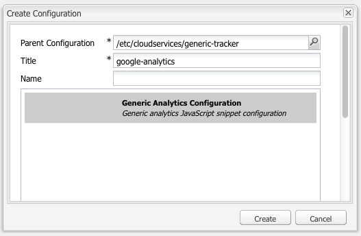

# 외부 공급자의 Analytics {#analytics-with-external-providers}

Analytics에서는 웹 사이트 사용 방식에 대한 중요하고도 흥미로운 정보를 제공할 수 있습니다.

적절한 서비스와 통합할 때 다음과 같은 다양한 기본 구성을 사용할 수 있습니다.

* [Adobe Analytics](/help/sites-administering/adobeanalytics.md)
* [Adobe Target](/help/sites-administering/target.md)

또한 의 고유한 인스턴스를 구성할 수 있습니다 **일반 Analytics 코드 조각** 새 서비스 구성을 정의합니다.

그런 다음 웹 페이지에 추가되는 작은 코드 조각을 통해 정보를 수집합니다. 예:

>[!CAUTION]
>
>스크립트를 `script` 태그 사이에 Analytics JavaScript 코드를 배치했습니다.

```
var _gaq = _gaq || [];
_gaq.push(['_setAccount', 'UA-XXXXX-X']);
_gaq.push(['_trackPageview']);

(function() {
    var ga = document.createElement('script'); ga.type = 'text/javascript'; ga.async = true;
    ga.src = ('https:' == document.location.protocol ? 'https://ssl' : 'https://www') + '.google-analytics.com/ga.js';
    var s = document.getElementsByTagName('script')[0]; s.parentNode.insertBefore(ga, s);
})();
```

이러한 코드 조각을 사용하면 데이터를 수집하고 보고서를 생성할 수 있습니다. 수집된 실제 데이터는 사용되는 공급자 및 실제 코드 조각에 따라 다릅니다. 통계 예는 다음과 같습니다.

* 시간에 따른 방문자 수
* 방문한 페이지 수
* 사용된 검색어
* 랜딩 페이지

>[!CAUTION]
>
>Geometrixx-Outdoors 데모 사이트는 페이지 속성에 제공된 속성이 html 소스 코드(바로 위)에 추가되도록 구성됩니다 `</html>` endtag)를 채울 수 있습니다. `js` 스크립트.
>
>만약 당신이 `/apps` 기본 페이지 구성 요소에서 상속되지 않습니다( `/libs/foundation/components/page`) 사용자(또는 개발자)가 `js` 스크립트는 포함됩니다. 예를 들어 다음을 포함합니다 `cq/cloudserviceconfigs/components/servicescomponents`또는 유사한 메커니즘을 사용 중입니다.
>
>이렇게 하지 않으면 서비스(일반, Analytics, Target 등)가 작동하지 않습니다.

## 일반 코드 조각을 사용하여 새 서비스 만들기 {#creating-a-new-service-with-a-generic-snippet}

기본 구성의 경우:

1. 를 엽니다. **도구** 콘솔.
1. 왼쪽 창에서 **Cloud Services 구성**.
1. 두 번 클릭 **일반 Analytics 코드 조각** 페이지를 열려면 다음을 수행하십시오.

   

1. 대화 상자를 사용하여 새 구성을 추가하려면 + 를 클릭합니다. 최소한 이름(예: google analytics)을 할당합니다.

   

1. 클릭 **만들기**&#x200B;로 코드 조각 대화 상자가 즉시 열립니다. 적절한 javascript 조각을 필드에 붙여 넣습니다.

   

1. **확인**&#x200B;을 클릭하여 저장합니다.

## 페이지에서 새 서비스 사용 {#using-your-new-service-on-pages}

서비스 구성을 만들었으면 이제 이 구성을 사용하도록 필요한 페이지를 구성해야 합니다.

1. 페이지로 이동합니다.
1. 를 엽니다. **페이지 속성** 사이드킥에서 **Cloud Services** 탭.
1. 클릭 **서비스 추가**&#x200B;를 선택한 다음 필수 서비스를 선택합니다. 예 **일반 Analytics 코드 조각**:

   

1. **확인**&#x200B;을 클릭하여 저장합니다.
1. 그러면 로 돌아갑니다. **Cloud Services** 탭. 다음 **일반 Analytics 코드 조각** 이제 이(가) 메시지와 함께 나열됩니다. `Configuration reference missing`. 드롭다운 목록을 사용하여 특정 서비스 인스턴스를 선택합니다. 예를 들면 google-analytics입니다.

   

1. **확인**&#x200B;을 클릭하여 저장합니다.

   이제 페이지에 대한 페이지 소스를 볼 경우 코드 조각을 볼 수 있습니다.

   적절한 시간이 경과하면 수집된 통계를 볼 수 있습니다.

   >[!NOTE]
   >
   >구성이 하위 페이지가 있는 페이지에 첨부된 경우 해당 서비스도 상속됩니다.
