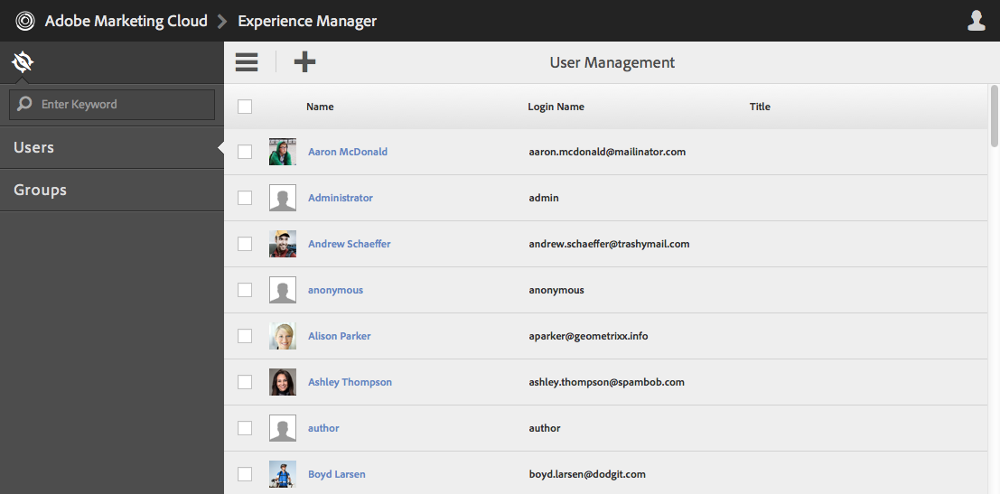
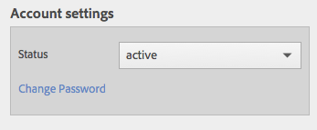

# Granite Operations - 사용자 및 그룹 관리{#granite-operations-user-and-group-administration}

As Granite는 JCR API 사양의 CRX 저장소 구현을 자체 사용자 및 그룹 관리를 가지고 있습니다.

이러한 계정은 [AEM 계정](/help/sites-administering/security.md)의 기본 기반이며, [AEM 사용자 콘솔](/help/sites-administering/security.md#accessing-user-administration-with-the-security-console)에서 계정에 액세스하면 [granite] 관리에서 수행된 모든 계정 변경 사항이 반영됩니다(예:`http://localhost:4502/useradmin`). AEM 사용자 콘솔에서 권한 및 기타 AEM 세부 사항을 관리할 수도 있습니다.

Granite user and group administration 콘솔은 터치에 적합한 UI의 **[도구](/help/sites-administering/tools-consoles.md)** 콘솔에서 모두 사용할 수 있습니다.

도구 콘솔에서 **사용자** 또는 **그룹**&#x200B;을 선택하면 적절한 콘솔이 열립니다. 두 가지 방법 모두에서 클릭 상자를 사용한 다음 도구 모음의 작업을 사용하거나, 또는 **이름** 아래의 링크를 통해 계정 세부 정보를 열어 조치를 취할 수 있습니다.

* [사용자 관리](#user-administration)

   

   **사용자** 콘솔에는 다음이 나열됩니다.

   * 사용자 이름
   * 사용자 로그인 이름(계정 이름)
   * 계정에 부여된 모든 제목

* [그룹 관리](#group-administration)

   

   **그룹** 콘솔에는 다음이 나열됩니다.

   * 그룹 이름
   * 그룹 설명
   * 그룹의 사용자/그룹 수

## 사용자 관리 {#user-administration}

### 새 사용자 {#adding-a-new-user} 추가

1. **사용자 추가** 아이콘을 사용합니다.

   

1. **사용자 만들기** 양식이 열립니다.

   

   여기에서 계정의 사용자 세부 정보를 입력할 수 있습니다(대부분 표준 및 자체 설명).

   * **ID**

      사용자 계정의 고유 ID입니다. 필수 항목이며 공백을 포함할 수 없습니다.

   * **이메일 주소**
   * **암호**

      암호는 필수입니다.

   * **암호 재입력**

      암호를 확인하는 데 필요하므로 이것은 필수입니다.

   * **이름**
   * **성**
   * **전화 번호**
   * **직함**
   * **상세 주소**
   * **모바일**
   * **도시**
   * **우편 번호**
   * **국가**
   * **상태**
   * **제목**
   * **성별**
   * **정보**
   * **계정 설정**

      * ****
상태계정을 
**** 활성 또는  **비활성**.
   * **사진**

      여기에서 사진을 업로드하여 아바타로 사용할 수 있습니다.

      허용되는 파일 형식: `.jpg .png .tif .gif`

      기본 크기:`240x240px`

   * **그룹에 사용자 추가**

      선택 드롭다운을 사용하여 사용자가 구성원인 그룹을 선택합니다. 선택한 후에는 저장하기 전에 이름 옆에 **X**&#x200B;을 사용하여 선택 해제합니다.

   * **그룹**

      사용자가 현재 구성원으로 있는 그룹 목록입니다. 저장하기 전에 이름을 사용하여 **X**&#x200B;을 선택 해제합니다.

1. 사용자 계정을 정의한 경우:

   * **등록을** 중단하려면 취소하십시오.
   * **등록** 을 완료하기 위해 저장합니다. 사용자 계정 만들기가 메시지와 함께 확인됩니다.

### 기존 사용자 {#editing-an-existing-user} 편집

1. 사용자 콘솔의 사용자 이름 아래에 있는 링크에서 사용자 세부 정보에 액세스합니다.

1. 이제 [새 사용자 추가](#adding-a-new-user)에서와 같이 세부 사항을 편집할 수 있습니다.

1. 사용자 콘솔의 사용자 이름 아래에 있는 링크에서 사용자 세부 정보에 액세스합니다.

1. 이제 [새 사용자 추가](#adding-a-new-user)에서와 같이 세부 사항을 편집할 수 있습니다.

### 기존 사용자 {#changing-the-password-for-an-existing-user}의 암호 변경

1. 사용자 콘솔의 사용자 이름 아래에 있는 링크에서 사용자 세부 정보에 액세스합니다.

1. 이제 [새 사용자 추가](#adding-a-new-user)에서와 같이 세부 사항을 편집할 수 있습니다. **계정 설정**&#x200B;에는 **암호 변경**&#x200B;에 대한 링크가 있습니다.

   

1. **암호 변경** 대화 상자가 열립니다. 암호와 함께 새 암호를 입력하고 다시 입력합니다. **OK**&#x200B;을 사용하여 변경 내용을 확인합니다.

   

   암호가 변경되었음을 확인하는 메시지가 나타납니다.

### 빠른 그룹 할당 {#quick-group-assignment}

1. 클릭 상자를 사용하여 하나 이상의 사용자에게 플래그를 지정합니다.
1. **그룹** 아이콘을 사용합니다.

   

   그룹 선택 드롭다운을 열려면 다음을 수행합니다.

   

1. 선택 상자에서 사용자 계정이 속해야 하는 그룹을 선택하거나 선택 취소할 수 있습니다.

1. 필요에 따라 그룹을 할당하거나 할당을 해제한 경우:

   * **변경** 사항을 중단하려면 취소됨
   * **** 저장을 클릭하여 변경 사항 확인

### 기존 사용자 세부 정보 삭제 중 {#deleting-existing-user-details}

1. 클릭 상자를 사용하여 하나 이상의 사용자에게 플래그를 지정합니다.
1. **삭제** 아이콘을 사용하여 사용자 세부 정보를 삭제합니다.

   

1. 삭제를 확인하는 메시지가 표시되면 실제 삭제가 이루어졌는지 확인하는 메시지입니다.

## 그룹 관리 {#group-administration}

### 새 그룹 {#adding-a-new-group} 추가

1. 그룹 추가 아이콘을 사용합니다.

   

1. **그룹 만들기** 양식이 열립니다.

   

   여기에서 그룹 세부 사항을 입력할 수 있습니다.

   * **ID**

      그룹의 고유 식별자입니다. 필수 항목이며 공백을 포함할 수 없습니다.

   * **이름**

      그룹 이름;그룹 콘솔에 표시됩니다.

   * **설명**

      그룹에 대한 설명입니다.

   * **구성원을 그룹에 추가**

      선택 드롭다운을 사용하여 그룹에 추가할 사용자를 선택합니다. 선택한 후에는 저장하기 전에 이름 옆에 **X**&#x200B;을 사용하여 선택 해제합니다.

   * **그룹 구성원**

      그룹의 사용자 목록입니다. 저장하기 전에 이름을 사용하여 **X**&#x200B;을 선택 해제합니다.

1. 그룹을 정의했으면 다음을 사용합니다.

   * **등록을** 중단하려면 취소하십시오.
   * **등록** 을 완료하기 위해 저장합니다. 그룹 만들기가 메시지와 함께 확인됩니다.

### 기존 그룹 {#editing-an-existing-group} 편집

1. 그룹 콘솔의 그룹 이름 아래에 있는 링크에서 그룹 세부 사항에 액세스합니다.

1. 이제 [새 그룹 추가](#adding-a-new-group)에서와 같이 세부 정보를 편집하고 저장할 수 있습니다.

### 기존 그룹 {#copying-an-existing-group} 복사

1. 클릭 상자를 사용하여 그룹에 플래그를 지정합니다.
1. **복사** 아이콘을 사용하여 그룹 세부 사항을 복사합니다.

   

1. **그룹 설정 편집** 양식이 열립니다.

   그룹 ID는 원본과 동일하지만 `Copy of` 접두사가 붙습니다. ID에는 공백이 포함될 수 없으므로 이 값을 편집해야 합니다. 다른 모든 세부 사항은 원본과 같습니다.

   이제 [새 그룹 추가](#adding-a-new-group)에서와 같이 세부 정보를 편집하고 저장할 수 있습니다.

### 기존 그룹 {#deleting-an-existing-group} 삭제

1. 클릭 상자를 사용하여 하나 이상의 그룹에 플래그를 지정합니다.
1. **삭제** 아이콘을 사용하여 그룹 세부 사항을 삭제합니다.

   

1. 삭제를 확인하는 메시지가 표시되면 실제 삭제가 이루어졌는지 확인하는 메시지입니다.
