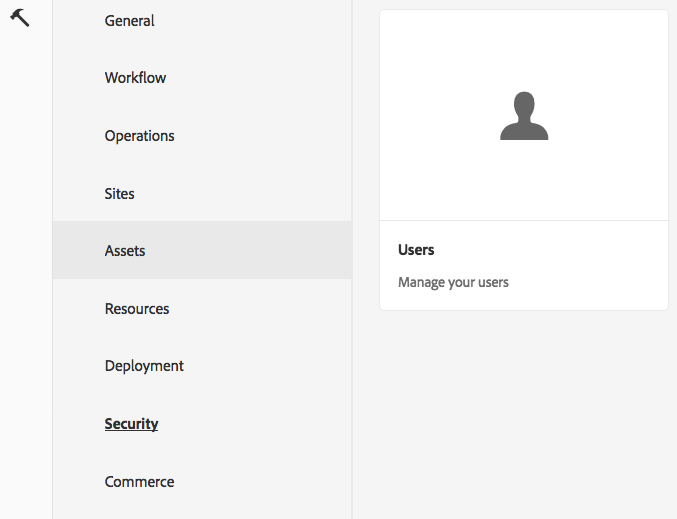

# AEM(Adobe Experience Manager) Foundation에 대한 GDPR 요청 처리{#handling-gdpr-requests-for-the-aem-foundation}

>[!IMPORTANT]
>
>아래 섹션에서는 GDPR이 예로 사용되지만, 포함된 세부 사항은 GDPR, CCPA 등과 같은 모든 데이터 보호 및 개인 정보 보호 규정에 적용됩니다.

## AEM Foundation GDPR 지원 {#aem-foundation-gdpr-support}

AEM Foundation 수준에서 저장되는 개인 데이터는 사용자 프로필입니다. 따라서 이 문서의 정보는 주로 사용자 프로필에 액세스하고 삭제하는 방법, GDPR 액세스 및 삭제 요청을 처리하는 방법에 대해 각각 다룹니다.

## 사용자 프로필에 액세스 {#accessing-a-user-profile}

### 설명서 단계 {#manual-steps}

1. 을 찾아 사용자 관리 콘솔을 엽니다. **[!UICONTROL 설정 - 보안 - 사용자]** 또는 을 바로 탐색하여 `https://<serveraddress>:<serverport>/libs/granite/security/content/useradmin.html`

   

1. 그런 다음 페이지 상단의 검색 창에서 해당 사용자의 이름을 입력하여 검색합니다.

   

1. 마지막으로 사용자 프로필을 클릭하여 연 다음 **[!UICONTROL 세부 정보]** 탭을 선택합니다.

   

### HTTP API {#http-api}

앞에서 언급한 바와 같이 Adobe는 용이한 자동화를 위해 사용자 데이터 액세스에 대한 API를 제공합니다. 다음은 사용할 수 있는 여러 유형의 API입니다.

**UserProperties API**

```shell
curl -u user:password http://localhost:4502/libs/granite/security/search/profile.userproperties.json\?authId\=cavery
```

**Sling API**

*사용자 홈 탐색:*

```xml
curl -g -u user:password 'http://localhost:4502/libs/granite/security/search/authorizables.json?query={"condition":[{"named":"cavery"}]}'
     {"authorizables":[{"type":"user","authorizableId_xss":"cavery","authorizableId":"cavery","name_xss":"Carlene Avery","name":"Carlene Avery","home":"/home/users/we-retail/DSCP-athB1NYLBXvdTuN"}],"total":1}
```

*사용자 데이터 검색 중*

위 명령에서 반환된 JSON 페이로드의 홈 속성에서 노드 경로 사용:

```shell
curl -u user:password  'http://localhost:4502/home/users/we-retail/DSCP-athB1NYLBXvdTuN/profile.-1.json'
```

```shell
curl -u user:password  'http://localhost:4502/home/users/we-retail/DSCP-athB1NYLBXvdTuN/profiles.-1.json'
```

## 사용자 비활성화 및 관련 프로필 삭제 {#disabling-a-user-and-deleting-the-associated-profiles}

### 사용자 비활성화 {#disable-user}

1. 위에서 설명한 대로 사용자 관리 콘솔을 연 다음 해당 사용자를 검색합니다.
1. 해당 사용자에 마우스를 가져다 대고 [선택] 아이콘을 클릭합니다. 해당 프로필이 회색으로 바뀌고 선택되었음이 표시됩니다.

1. 사용자를 비활성화하려면 상단 메뉴의 비활성화 버튼을 누릅니다.

   

1. 마지막으로 다음 작업을 확인합니다.

   

   사용자 인터페이스는 사용자가 회색으로 표시되고 프로필 카드에 잠금을 추가하여 비활성화되었음을 나타냅니다.

   

### 사용자 프로필 정보 삭제 {#delete-user-profile-information}

1. CRXDE Lite에 로그인한 다음 `[!UICONTROL userId]`:

   

1. 아래에 있는 사용자 노드를 엽니다. `[!UICONTROL /home/users]` 기본적으로:

   

1. 프로필 노드 및 모든 하위 항목을 삭제합니다. 프로필 노드에는 AEM 버전에 따라 두 가지 형식이 있습니다.

   1. 아래의 기본 개인 프로필 `[!UICONTROL /profile]`
   1. `[!UICONTROL /profiles]`AEM 6.5를 사용하여 만든 새 프로필의 경우.

   

### HTTP API {#http-api-1}

다음 절차는 `curl` 를 사용하여 사용자를 비활성화하는 방법을 보여 주는 명령줄 도구 **[!UICONTROL 은폐]** `userId` 및 프로필 삭제 `cavery` 기본 위치에서 사용할 수 있습니다.

* *사용자 홈 탐색*

```shell
curl -g -u user:password 'http://localhost:4502/libs/granite/security/search/authorizables.json?query={"condition":[{"named":"cavery"}]}'
     {"authorizables":[{"type":"user","authorizableId_xss":"cavery","authorizableId":"cavery","name_xss":"Carlene Avery","name":"Carlene Avery","home":"/home/users/we-retail/DSCP-athB1NYLBXvdTuN"}],"total":1}
```

* *사용자 비활성화*

위 명령에서 반환된 JSON 페이로드의 홈 속성에서 노드 경로 사용:

```shell
curl -X POST -u user:password -FdisableUser="describe the reasons for disabling this user (GDPR in this case)" 'http://localhost:4502/home/users/we-retail/DSCP-athB1NYLBXvdTuN.rw.userprops.html'
```

* *사용자 프로필 삭제*

계정 탐색 명령에서 반환된 JSON 페이로드의 홈 속성에서 노드 경로 및 알려진 맞춤형 프로필 노드 위치 사용:

```shell
curl -X POST -u user:password -H "Accept: application/json,**/**;q=0.9" -d ':operation=delete' 'http://localhost:4502/home/users/we-retail/DSCP-athB1NYLBXvdTuN/profile'
```

```shell
curl -X POST -u user:password -H "Accept: application/json,**/**;q=0.9" -d ':operation=delete' 'http://localhost:4502/home/users/we-retail/DSCP-athB1NYLBXvdTuN/profile'
```
