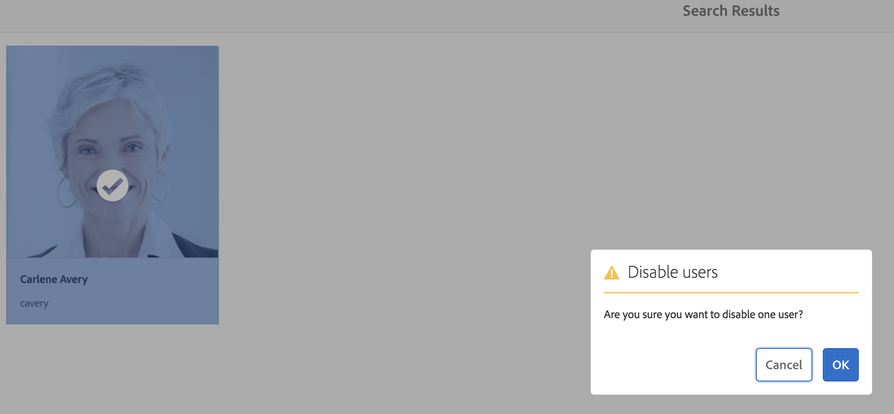
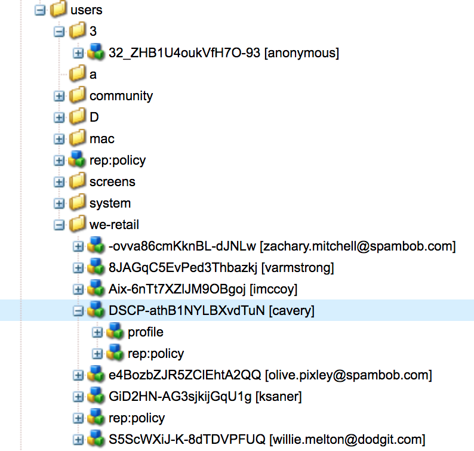
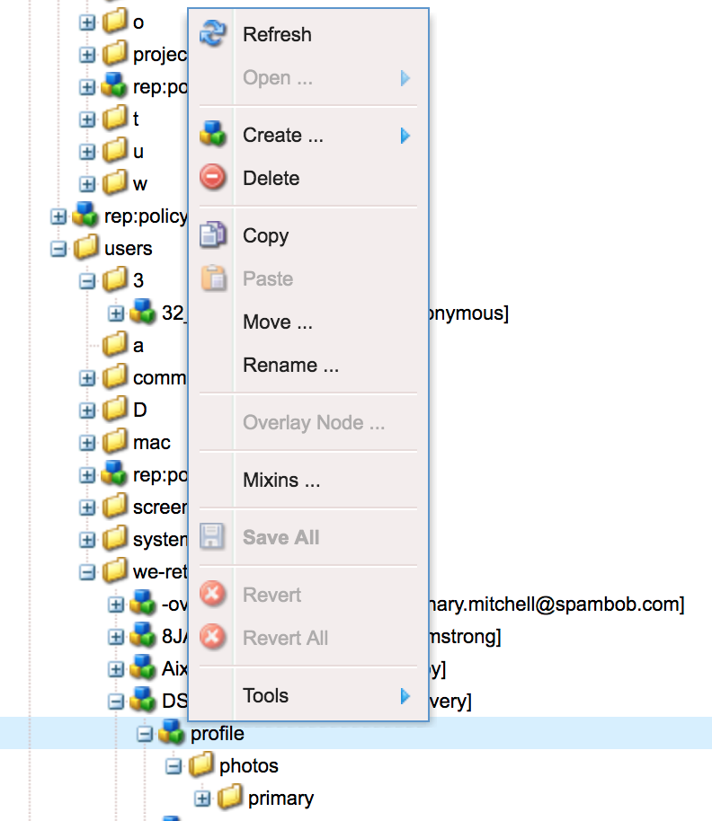

# AEM Foundation에 대한 GDPR 요청 처리{#handling-gdpr-requests-for-the-aem-foundation}

>[!IMPORTANT]
>
>아래 섹션에서는 GDPR이 예로 사용되지만, 포함된 세부 사항은 GDPR, CCPA 등 모든 데이터 보호 및 개인 정보 보호 규정에 적용됩니다.

## AEM Foundation GDPR 지원 {#aem-foundation-gdpr-support}

AEM Foundation 수준에서 저장된 개인 데이터는 사용자 프로필입니다. 따라서 이 문서의 정보에서는 GDPR 액세스 및 삭제 요청을 각각 처리하기 위해 사용자 프로필에 액세스하고 삭제하는 방법에 대해 다룹니다.

## 사용자 프로필 {#accessing-a-user-profile} 액세스

### 수동 단계 {#manual-steps}

1. **[!UICONTROL 설정 - 보안 - 사용자]**&#x200B;로 이동하거나 `https://<serveraddress>:<serverport>/libs/granite/security/content/useradmin.html`로 직접 이동하여 사용자 관리 콘솔을 엽니다.

   

1. 그런 다음 페이지 상단의 검색 표시줄에 다음 이름을 입력하여 해당 사용자를 검색합니다.

   

1. 마지막으로 사용자 프로필을 클릭하여 연 다음 **[!UICONTROL 세부 사항]** 탭에서 선택합니다.

   

### HTTP API {#http-api}

앞에서 언급했듯이 Adobe은 자동화를 용이하게 하기 위해 사용자 데이터에 액세스하기 위한 API를 제공합니다. 사용할 수 있는 API 유형에는 다음과 같은 것이 있습니다.

**사용자 속성 API**

```shell
curl -u user:password http://localhost:4502/libs/granite/security/search/profile.userproperties.json\?authId\=cavery
```

**Sling API**

*사용자 홈 찾기:*

```xml
curl -g -u user:password 'http://localhost:4502/libs/granite/security/search/authorizables.json?query={"condition":[{"named":"cavery"}]}'
     {"authorizables":[{"type":"user","authorizableId_xss":"cavery","authorizableId":"cavery","name_xss":"Carlene Avery","name":"Carlene Avery","home":"/home/users/we-retail/DSCP-athB1NYLBXvdTuN"}],"total":1}
```

*사용자 데이터 검색*

위의 명령에서 반환된 JSON 페이로드의 홈 속성에서 노드 경로 사용:

```shell
curl -u user:password  'http://localhost:4502/home/users/we-retail/DSCP-athB1NYLBXvdTuN/profile.-1.json'
```

```shell
curl -u user:password  'http://localhost:4502/home/users/we-retail/DSCP-athB1NYLBXvdTuN/profiles.-1.json'
```

## 사용자 비활성화 및 연결된 프로필 {#disabling-a-user-and-deleting-the-associated-profiles} 삭제

### 사용자 {#disable-user} 비활성화

1. 위에 설명된 대로 사용자 관리 콘솔을 열고 해당 사용자를 검색합니다.
1. 사용자를 마우스로 가리키고 선택 아이콘을 클릭합니다. 프로파일이 선택되어 있음을 나타내는 회색으로 바뀝니다.

1. 상단 메뉴에서 비활성화 단추를 눌러 사용자를 비활성화합니다.

   

1. 작업을 확인합니다.

   

   그러면 사용자 인터페이스에 프로필 카드에 잠금이 추가되고 로그아웃하여 사용자가 비활성화되었음을 알립니다.

   

### 사용자 프로필 정보 삭제 {#delete-user-profile-information}

1. CRXDE Lite에 로그인한 다음 `[!UICONTROL userId]`:

   

1. 기본적으로 `[!UICONTROL /home/users]` 아래에 있는 사용자 노드를 엽니다.

   

1. 프로필 노드 및 모든 하위 항목을 삭제합니다. AEM 버전에 따라 프로필 노드에는 두 가지 형식이 있습니다.

   1. `[!UICONTROL /profile]` 아래의 기본 개인 프로필
   1. `[!UICONTROL /profiles]`를 클릭합니다.

   

### HTTP API {#http-api-1}

다음 절차에서는 `curl` 명령줄 도구를 사용하여 **[!UICONTROL cavery]** `userId`로 사용자를 비활성화하고 기본 위치에서 사용할 수 있는 프로필을 삭제하는 방법을 보여 줍니다.

* *사용자 홈 찾기*

```shell
curl -g -u user:password 'http://localhost:4502/libs/granite/security/search/authorizables.json?query={"condition":[{"named":"cavery"}]}'
     {"authorizables":[{"type":"user","authorizableId_xss":"cavery","authorizableId":"cavery","name_xss":"Carlene Avery","name":"Carlene Avery","home":"/home/users/we-retail/DSCP-athB1NYLBXvdTuN"}],"total":1}
```

* *사용자 비활성화*

위의 명령에서 반환된 JSON 페이로드의 홈 속성에서 노드 경로 사용:

```shell
curl -X POST -u user:password -FdisableUser="describe the reasons for disabling this user (GDPR in this case)" 'http://localhost:4502/home/users/we-retail/DSCP-athB1NYLBXvdTuN.rw.userprops.html'
```

* *사용자 프로필 삭제*

계정 검색 명령 및 알려진 기본 프로필 노드 위치에서 반환된 JSON 페이로드의 홈 속성에서 노드 경로 사용:

```shell
curl -X POST -u user:password -H "Accept: application/json,**/**;q=0.9" -d ':operation=delete' 'http://localhost:4502/home/users/we-retail/DSCP-athB1NYLBXvdTuN/profile'
```

```shell
curl -X POST -u user:password -H "Accept: application/json,**/**;q=0.9" -d ':operation=delete' 'http://localhost:4502/home/users/we-retail/DSCP-athB1NYLBXvdTuN/profile'
```

