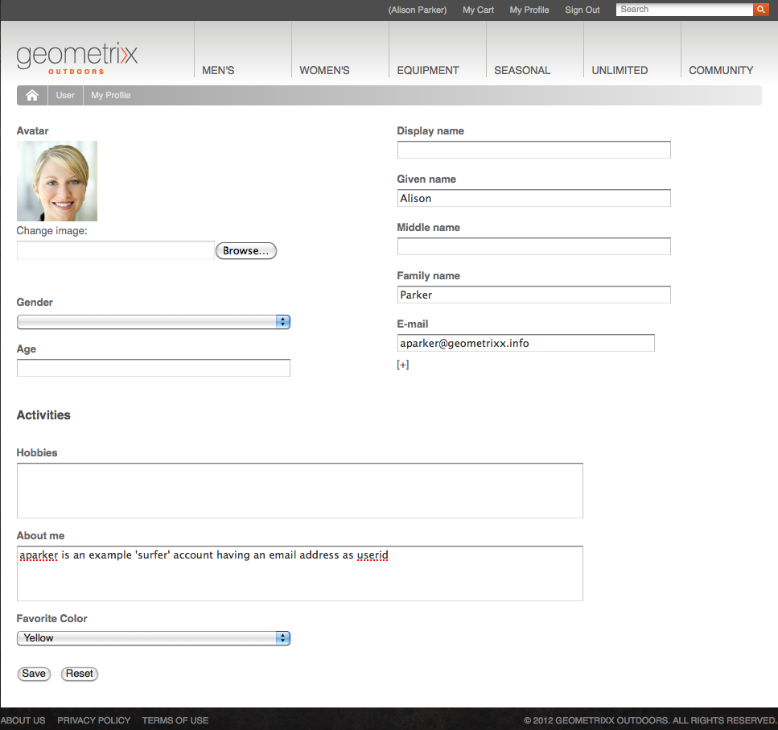

# ID 관리{#identity-management}

웹 사이트의 개별 방문자는 로그인할 수 있는 기능을 제공할 때만 식별됩니다. 로그인 기능을 제공해야 하는 이유는 다양합니다.

* [AEM ](/help/communities/overview.md)Communities사이트 방문자는 커뮤니티에 컨텐츠를 게시하기 위해 로그인해야 합니다.
* [닫힌 사용자 그룹](/help/sites-administering/cug.md)

   웹 사이트(또는 웹 사이트의 섹션)에 대한 액세스를 특정 방문자로 제한해야 할 수 있습니다.

* [개인화방문자가 웹 사이트에 액세스하는 방법을 구성할 수 있도록 해줍니다. ](/help/sites-administering/personalization.md) 

로그인(및 종료) 기능은 등록된 방문자(사용자)에 대한 추가 정보를 포함하는 **프로필**](#profiles-and-user-accounts)&#x200B;의 [ 계정에서 제공합니다. 등록 및 인증에 대한 실제 프로세스는 다음과 같이 다를 수 있습니다.

* 웹 사이트에서 직접 등록

   방문자가 Facebook 또는 Twitter 계정으로 직접 등록하거나 로그인할 수 있도록 [커뮤니티 사이트](/help/communities/sites-console.md)를 구성할 수 있습니다.

* 웹 사이트에서 등록 요청

   폐쇄된 사용자 그룹의 경우 방문자가 등록을 요청할 수 있지만 워크플로우의 방법으로 권한을 강제 적용할 수 있습니다.

* 작성 환경에서 각 계정 등록

   인증이 필요한 프로필의 수가 적은 경우 각 프로파일을 직접 등록하기로 결정할 수 있습니다.

방문자가 등록할 수 있도록 하려면 일련의 구성 요소와 양식을 사용하여 필요한 식별 정보를 수집한 다음 추가(종종 선택 사항) 프로필 정보를 수집할 수 있습니다. 등록한 후 제출한 세부 사항을 확인하고 업데이트할 수도 있습니다.

추가 기능을 구성하거나 개발할 수 있습니다.

* 필요한 역방향 복제를 구성합니다.
* 사용자가 워크플로우와 함께 양식을 개발하여 프로필을 제거할 수 있도록 허용합니다.

>[!NOTE]
>
>프로필에 지정된 정보를 사용하여 [세그먼트](/help/sites-administering/campaign-segmentation.md) 및 [캠페인](/help/sites-classic-ui-authoring/classic-personalization-campaigns.md)을 통해 타깃팅된 컨텐츠를 사용자에게 제공할 수도 있습니다.

## 등록 Forms {#registration-forms}

[양식](/help/sites-authoring/default-components.md#form-component)을 사용하여 등록 정보를 수집한 다음 새 계정과 프로필을 생성할 수 있습니다.

예를 들어 사용자가 Geometrixx 페이지를 사용하여 새 프로필을 요청할 수 있습니다
`http://localhost:4502/content/geometrixx-outdoors/en/user/register.html`


요청을 제출하면 사용자가 개인 정보를 제공할 수 있는 프로필 페이지가 열립니다.


새 계정은 [사용자 콘솔](/help/sites-administering/security.md)에도 표시됩니다.

## 로그인 {#login}

로그인 구성 요소를 사용하여 로그인 정보를 수집한 다음 로그인 프로세스를 활성화할 수 있습니다.

자격 증명을 입력할 때 로그인 프로세스를 활성화하는 **로그인** 단추와 함께 방문자에게 **사용자 이름** 및 **암호**&#x200B;의 표준 필드를 제공합니다.

예를 들어 사용자는 페이지를 사용하는 Geometrixx 도구 모음의 **로그인** 옵션을 사용하여 로그인하거나 새 계정을 만들 수 있습니다.

`http://localhost:4502/content/geometrixx-outdoors/en/user/sign-in.html`


## {#logging-out} 로그아웃

로그인 메커니즘이 있으므로 로그아웃 메커니즘도 필요합니다. Geometrixx에서 **로그아웃** 옵션으로 사용할 수 있습니다.

## 프로필 {#viewing-and-updating-a-profile} 보기 및 업데이트

등록 양식에 따라 방문자는 프로필에 등록 정보를 보유할 수 있습니다. 이후 단계에서 이를 보거나 업데이트할 수 있어야 합니다. 이와 비슷한 형태로 수행할 수 있습니다.예를 들어 Geometrixx에서 다음을 수행합니다.

```
http://localhost:4502/content/geometrixx-outdoors/en/user/profile.html
```

프로필에 대한 세부 정보를 보려면 페이지의 오른쪽 위 모서리에 있는 **내 프로필**&#x200B;을 클릭합니다.예를 들어 `admin` 계정이 있는 경우:
`http://localhost:4502/home/users/a/admin/profile.form.html/content/geometrixx-outdoors/en/user/profile.html.`

작성 환경에서 충분한 권한으로 [클라이언트 컨텍스트](/help/sites-administering/client-context.md)를 사용하여 다른 프로필을 볼 수 있습니다.

1. 페이지를 엽니다.예: Geometrixx 페이지:

   `http://localhost:4502/cf#/content/geometrixx/en.html`

1. 오른쪽 상단 모서리에서 **내 프로필**&#x200B;을 클릭합니다. 현재 계정의 프로필이 표시됩니다.(예: 관리자).
1. 클라이언트 컨텍스트를 열려면 **control-alt-C**&#x200B;을 누릅니다.
1. 클라이언트 컨텍스트의 왼쪽 위 모서리에서 **프로필 로드** 단추를 클릭합니다.

   

1. 대화 상자 창의 드롭다운 목록에서 다른 프로파일을 선택합니다.예: **Alison Parker**
1. **확인**&#x200B;을 클릭합니다.
1. **내 프로필**&#x200B;에서 다시 클릭합니다. 그 양식은 앨리슨의 세부 사항과 함께 갱신될 것이다.

   

1. 이제 **프로필 편집** 또는 **암호 변경**&#x200B;을 사용하여 세부 정보를 업데이트할 수 있습니다.

## 프로필 정의 {#adding-fields-to-the-profile-definition}에 필드 추가

프로필 정의에 필드를 추가할 수 있습니다. 예를 들어 Geometrixx 프로필에 &quot;즐겨찾기 색상&quot; 필드를 추가하는 방법은 다음과 같습니다.

1. 웹 사이트 콘솔에서 Geometrixx Outdoors 사이트 > 영어 > 사용자 > 내 프로필로 이동합니다.
1. **내 프로필** 페이지를 두 번 클릭하여 편집을 위해 엽니다.
1. 사이드 킥의 **구성 요소** 탭에서 **양식** 섹션을 확장합니다.
1. 사이드킥의 **드롭다운 목록**&#x200B;을 **정보** 필드 바로 아래에 있는 양식으로 드래그합니다.
1. **드롭다운 목록** 구성 요소를 두 번 클릭하여 구성 대화 상자를 열고 다음을 입력합니다.

   * **요소 이름** - `favoriteColor`
   * **제목** - `Favorite Color`
   * **항목**  - 여러 색상을 항목으로 추가

   **확인**&#x200B;을 클릭하여 저장합니다.

1. 페이지를 닫고 **웹 사이트** 콘솔로 돌아가서 내 프로필 페이지를 활성화합니다.

   다음에 프로필을 보면 즐겨찾기 색상을 선택할 수 있습니다.

   

   필드는 관련 사용자 계정의 **프로필** 섹션 아래에 저장됩니다.

   

## 프로필 상태 {#profile-states}

사용자(또는 사용자의 프로필)가 *특정 상태*&#x200B;인지 여부를 알아야 하는 많은 사용 사례가 있습니다.

여기에는 다음과 같은 방식으로 사용자 프로필에서 적절한 속성을 정의하는 작업이 포함됩니다.

* 이 표시되고 사용자가 액세스할 수 있습니다.
* 각 속성에 대해 2개의 상태를 정의합니다.
* 정의된 두 상태 간 전환 허용

이 작업은 다음을 통해 수행됩니다.

* [상태 공급자](#state-providers)

   특정 속성의 두 상태와 두 속성 사이의 전환을 관리하려면

* [워크플로우](#workflows)

   상태와 관련된 작업을 관리하려면

여러 상태를 정의할 수 있습니다.예를 들어 다음과 같습니다.

* 뉴스레터 또는 댓글 스레드의 알림 구독(또는 가입 해지)
* 친구에게 연결 추가 및 제거

### 상태 공급자 {#state-providers}

상태 공급자는 가능한 두 상태 간의 전환과 함께 해당 속성의 현재 상태를 관리합니다.

상태 공급자는 구성 요소로 구현되므로 프로젝트에 맞게 사용자 정의할 수 있습니다. Geometrixx에는 다음이 포함됩니다.

* 포럼 주제 탈퇴/가입
* 친구 추가/삭제

### 워크플로우 {#workflows}

상태 공급자는 프로필 속성 및 상태를 관리합니다.

상태와 관련된 작업을 구현하려면 워크플로우가 필요합니다. 예를 들어, 알림을 구독하면 워크플로우에서 실제 구독 작업을 처리합니다.알림에서 가입 해지를 해제하면 워크플로우에서 가입 목록에서 사용자를 제거하는 작업을 처리합니다.

## 프로필 및 사용자 계정 {#profiles-and-user-accounts}

프로필은 [사용자 계정](/help/sites-administering/user-group-ac-admin.md)의 일부로 컨텐츠 저장소에 저장됩니다.

프로필은 `/home/users/geometrixx`에서 찾을 수 있습니다.


표준 설치(작성자 또는 게시)에서는 모든 사용자가 모든 사용자의 전체 프로필 정보에 대한 읽기 권한을 갖습니다. 모든 사용자는 기존 사용자 및 그룹을 모두 자동으로 포함하는 &quot;*기본 제공 그룹입니다. 구성원 목록을 편집할 수 없습니다*&quot;.

이러한 액세스 권한은 다음 와일드카드 ACL로 정의됩니다.

모든 사용자가 jcr:read rep:glob = */profile*을 허용합니다.

이를 통해 다음을 수행할 수 있습니다.

* 포럼, 댓글 또는 블로그 게시물을 통해 해당 프로필의 정보(아이콘 또는 전체 이름 등)를 표시할 수 있습니다.
* geometrixx 프로필 페이지에 대한 링크

이러한 액세스가 설치에 적합하지 않은 경우 이러한 기본 설정을 변경할 수 있습니다.

이 작업은 **[액세스 제어](/help/sites-administering/user-group-ac-admin.md#access-right-management)** 탭을 사용하여 수행할 수 있습니다.


## 프로필 구성 요소 {#profile-components}

사이트의 프로필 요구 사항을 정의하는 데에도 다양한 프로필 구성 요소를 사용할 수 있습니다.

### 확인된 암호 필드 {#checked-password-field}

이 구성 요소는 다음과 같은 두 필드를 제공합니다.

* 암호 입력
* 암호를 정확히 입력했는지 확인

기본 설정을 사용하면 구성 요소가 다음과 같이 표시됩니다.


### 프로파일 아바타 사진 {#profile-avatar-photo}

이 구성 요소는 사용자가 아바타 사진 파일을 선택하여 업로드하는 메커니즘을 제공합니다.


### 프로파일 세부 이름 {#profile-detailed-name}

이 구성 요소는 사용자가 이름을 자세히 입력하도록 합니다.


### 프로파일 성별 {#profile-gender}

이 구성 요소를 사용하면 사용자가 성별을 입력할 수 있습니다.


