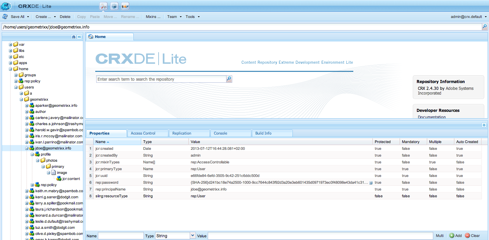

# ID 관리{#identity-management}

웹 사이트의 개별 방문자는 로그인할 수 있는 기능을 제공할 때만 식별될 수 있습니다. 로그인 기능을 제공하려는 이유는 다양합니다.

* [AEM Communities](/help/communities/overview.md)사이트 방문자는 커뮤니티에 콘텐츠를 게시하기 위해 로그인해야 합니다.
* [폐쇄된 사용자 그룹](/help/sites-administering/cug.md)

   웹 사이트(또는 웹 사이트의 섹션)에 대한 액세스를 특정 방문자로 제한해야 할 수 있습니다.

* [개인화](/help/sites-administering/personalization.md) 방문자가 웹 사이트에 액세스하는 방식에 대한 특정 측면을 구성할 수 있도록 해줍니다.

로그인(및 아웃) 기능은 [이 **프로필**](#profiles-and-user-accounts)&#x200B;에는 등록된 방문자(사용자)에 대한 추가 정보가 들어 있습니다. 등록 및 권한 부여에 대한 실제 프로세스는 다를 수 있습니다.

* 웹 사이트에서 자체 등록

   A [커뮤니티 사이트](/help/communities/sites-console.md) 방문자가 자신의 Facebook 또는 Twitter 계정으로 자체 등록하거나 로그인할 수 있도록 구성할 수 있습니다.

* 웹 사이트에서 등록 요청

   폐쇄된 사용자 그룹의 경우 방문자가 등록을 요청할 수 있지만 워크플로우를 통해 인증을 적용합니다.

* 작성 환경에서 각 계정을 등록합니다

   프로필의 수가 적은 경우 어쨌든 승인이 필요한 경우 각 프로필을 직접 등록하도록 결정할 수 있습니다.

방문자가 등록할 수 있도록 하기 위해 일련의 구성 요소와 양식을 사용하여 필요한 식별 정보를 수집한 다음, 추가(종종 선택 사항) 프로필 정보를 수집할 수 있습니다. 등록한 후에는 제출한 세부 사항을 확인하고 업데이트할 수도 있어야 합니다.

추가 기능은 구성하거나 개발할 수 있습니다.

* 필요한 역방향 복제를 구성합니다.
* 사용자가 워크플로우와 함께 양식을 개발하여 프로필을 제거할 수 있도록 허용합니다.

>[!NOTE]
>
>프로필에 지정된 정보를 사용하여 를 통해 타깃팅된 컨텐츠를 사용자에게 제공할 수도 있습니다 [세그먼트](/help/sites-administering/campaign-segmentation.md) 및 [캠페인](/help/sites-classic-ui-authoring/classic-personalization-campaigns.md).

## 등록 Forms {#registration-forms}

A [양식](/help/sites-authoring/default-components.md#form-component) 등록 정보를 수집한 다음 새 계정과 프로필을 생성하는 데 사용할 수 있습니다.

예를 들어 사용자가 Geometrixx 페이지를 사용하여 새 프로필을 요청할 수 있습니다
`http://localhost:4502/content/geometrixx-outdoors/en/user/register.html`


요청을 제출하면 사용자가 개인 세부 사항을 제공할 수 있는 프로필 페이지가 열립니다.


새 계정은 [사용자 콘솔](/help/sites-administering/security.md).

## 로그인 {#login}

로그인 구성 요소를 사용하여 로그인 정보를 수집한 다음 로그인 프로세스를 활성화할 수 있습니다.

방문자에게 다음과 같은 표준 필드를 제공합니다 **사용자 이름** 및 **암호**, **로그인** 자격 증명을 입력할 때 로그인 프로세스를 활성화하는 단추.

예를 들어, 사용자는 **로그인** 페이지를 사용하는 Geometrixx 도구 모음의 옵션:

`http://localhost:4502/content/geometrixx-outdoors/en/user/sign-in.html`


## 로그아웃 {#logging-out}

로그인 메커니즘이 있으므로 로그아웃 메커니즘도 필요합니다. 이 기능은 **로그아웃** Geometrixx 옵션.

## 프로필 보기 및 업데이트 {#viewing-and-updating-a-profile}

등록 양식에 따라 방문자가 자신의 프로필에 등록 정보를 등록했을 수 있습니다. 이후 단계에서 이를 보거나 업데이트할 수 있어야 합니다. 이 작업은 유사한 형식으로 수행할 수 있습니다. 예를 들어 Geometrixx에서:

```
http://localhost:4502/content/geometrixx-outdoors/en/user/profile.html
```

프로필의 세부 사항을 보려면 **내 프로필** 페이지의 오른쪽 위 모서리에서 을(를) 클릭합니다. 예를 들어 `admin` 계정:
`http://localhost:4502/home/users/a/admin/profile.form.html/content/geometrixx-outdoors/en/user/profile.html.`

를 사용하여 다른 프로필을 볼 수 있습니다 [클라이언트 컨텍스트](/help/sites-administering/client-context.md) (작성 환경에서 충분한 권한이 있는 경우):

1. 페이지를 엽니다. 예: Geometrixx 페이지:

   `http://localhost:4502/cf#/content/geometrixx/en.html`

1. 클릭 **내 프로필** 오른쪽 상단 모서리에서 현재 계정의 프로필이 표시됩니다. 예를 들면 관리자 입니다.
1. 누르기 **control-alt-C** 클라이언트 컨텍스트를 열려면 다음을 수행하십시오.
1. 클라이언트 컨텍스트의 왼쪽 위 모서리에서 **프로필 로드** 버튼을 클릭합니다.

   

1. 대화 상자 창의 드롭다운 목록에서 다른 프로파일을 선택합니다. 예 **앨리슨 파커**.
1. **확인**&#x200B;을 클릭합니다.
1. 을(를) 다시 클릭합니다. **내 프로필**. 앨리슨의 세부 정보로 양식을 업데이트할 것이다.

   

1. 이제 다음을 사용할 수 있습니다 **프로필 편집** 또는 **암호 변경** 세부 사항을 업데이트하려면

## 프로필 정의에 필드 추가 {#adding-fields-to-the-profile-definition}

프로필 정의에 필드를 추가할 수 있습니다. 예를 들어 Geometrixx 프로필에 &quot;Favorite Color&quot; 필드를 추가하려면 다음을 수행합니다.

1. 웹 사이트 콘솔에서 Geometrixx Outdoors 사이트 > 영어 > 사용자 > 내 프로필로 이동합니다.
1. 을(를) 두 번 클릭합니다. **내 프로필** 페이지를 열어 편집할 수 있습니다.
1. 에서 **구성 요소** 사이드 킥의 탭 확장 **양식** 섹션을 참조하십시오.
1. 드래그 **드롭다운 목록** 사이드킥에서 폼으로, 바로 아래에 **내 정보** 필드.
1. 를 두 번 클릭합니다. **드롭다운 목록** 구성 요소를 사용하여 구성 대화 상자를 열고 다음을 입력합니다.

   * **요소 이름** - `favoriteColor`
   * **제목** - `Favorite Color`
   * **항목** - 여러 색상을 항목으로 추가

   **확인**&#x200B;을 클릭하여 저장합니다.

1. 페이지를 닫고 로 돌아갑니다. **웹 사이트** 내 프로필 페이지를 활성화하고 활성화합니다.

   다음에 프로필을 볼 때 즐겨찾는 색상을 선택할 수 있습니다.

   

   필드는 **프로필** 관련 사용자 계정의 섹션:

   

## 프로필 상태 {#profile-states}

사용자(또는 해당 프로필)가 *특정 상태* 아님 아님

여기에는 사용자 프로필에서 다음과 같은 방식으로 적절한 속성을 정의하는 작업이 포함됩니다.

* 이 표시되고 사용자가 액세스할 수 있습니다
* 각 속성에 대해 두 가지 상태 정의
* 정의된 두 상태 간을 전환할 수 있습니다.

이 작업은 다음으로 수행됩니다.

* [상태 공급자](#state-providers)

   특정 속성의 두 상태와 두 가지 전환 상태를 관리하려면

* [워크플로](#workflows)

   상태와 관련된 작업을 관리하려면

여러 상태를 정의할 수 있습니다. 예를 들어 다음과 같은 Geometrixx이 있습니다.

* 뉴스레터 또는 댓글 스레드의 알림에 구독(또는 구독 취소)
* 친구에게 연결 추가 및 제거

### 상태 공급자 {#state-providers}

상태 공급자는 문제가 있는 속성의 현재 상태와 함께 가능한 두 상태 간의 전환을 관리합니다.

상태 공급자는 구성 요소로 구현되므로 프로젝트에 맞게 사용자 지정할 수 있습니다. Geometrixx에는 다음이 포함됩니다.

* 포럼 주제 탈퇴/가입
* 친구 추가/삭제

### 워크플로 {#workflows}

상태 공급자는 프로필 속성 및 해당 상태를 관리합니다.

상태와 관련된 작업을 구현하려면 워크플로우가 필요합니다. 예를 들어 알림을 구독하면 워크플로우에서 실제 구독 작업을 처리합니다. 알림에서 가입을 해지하면 워크플로우는 구독 목록에서 사용자를 제거하는 작업을 처리합니다.

## 프로필 및 사용자 계정 {#profiles-and-user-accounts}

프로필은 컨텐츠 리포지토리의 일부로 저장됩니다[사용자 계정](/help/sites-administering/user-group-ac-admin.md).

프로필은 `/home/users/geometrixx`:



표준 설치(작성자 또는 게시)에서는 모든 사용자가 모든 사용자의 전체 프로필 정보에 대한 읽기 권한을 갖습니다. 모두가 &quot;*기존 사용자 및 그룹을 자동으로 포함하는 기본 제공 그룹입니다. 구성원 목록을 편집할 수 없습니다.*&quot;.

이러한 액세스 권한은 다음 와일드카드 ACL로 정의됩니다.

/home 모든 사용자가 jcr:read rep:glob = 를 허용합니다. &#42;/profile&#42;

이를 통해 다음을 수행할 수 있습니다.

* 해당 프로필의 정보(예: 아이콘 또는 전체 이름)를 표시할 포럼, 댓글 또는 블로그 게시물
* geometrixx 프로필 페이지에 링크

이러한 액세스가 설치에 적합하지 않은 경우 이러한 기본 설정을 변경할 수 있습니다.

이 작업은 를 사용하여 수행할 수 있습니다. **[액세스 제어](/help/sites-administering/user-group-ac-admin.md#access-right-management)** 탭:


## 프로필 구성 요소 {#profile-components}

다양한 프로필 구성 요소를 사용하여 사이트에 대한 프로필 요구 사항을 정의할 수도 있습니다.

### 확인된 암호 필드 {#checked-password-field}

이 구성 요소는 다음과 같은 두 필드를 제공합니다.

* 암호 입력
* 암호를 정확히 입력했는지 확인

기본 설정을 사용하면 구성 요소가 다음과 같이 표시됩니다.


### 프로필 아바타 사진 {#profile-avatar-photo}

이 구성 요소는 사용자가 아바타 사진 파일을 선택하여 업로드하는 메커니즘을 제공합니다.


### 프로필 세부 이름 {#profile-detailed-name}

이 구성 요소는 사용자가 이름을 자세히 입력하도록 합니다.


### 프로파일 성별 {#profile-gender}

이 구성 요소로 사용자는 성별을 입력할 수 있습니다.


