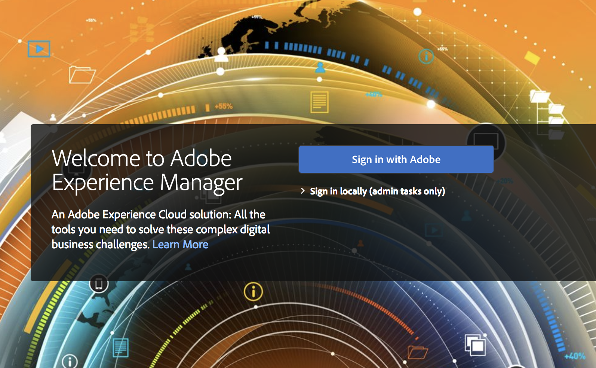

# AEM Managed Services에 대한 Adobe IMS 인증 및 [!DNL Admin Console] 지원 {#adobe-ims-authentication-and-admin-console-support-for-aem-managed-services}

>[!NOTE]
>
>이 기능은 Managed Services 고객에게만 Adobe을 제공할 수 있습니다.

## 소개 {#introduction}

AEM 6.4.3.0에서는 **AEM Managed Services** 고객을 위해 AEM 인스턴스 및 Adobe IMS(Identity Management System) 기반 인증에 대한 [!DNL Admin Console] 지원을 도입했습니다.

[!DNL Admin Console]에 대한 AEM 온보딩을 사용하면 AEM Managed Services 고객이 하나의 콘솔에서 모든 Experience Cloud 사용자를 관리할 수 있습니다. AEM 인스턴스와 연결된 제품 프로필에 사용자를 할당하여 특정 인스턴스에 로그인할 수 있도록 할 수 있습니다.

## 주요 내용 {#key-highlights}

* AEM IMS 인증 지원은 AEM 작성자, 관리자 또는 개발자만을 위한 것이며 사이트 방문자와 같은 고객 사이트의 외부 최종 사용자를 위한 것이 아닙니다
* [!DNL Admin Console]은(는) AEM Managed Services 고객을 IMS 조직으로, 해당 인스턴스를 제품 컨텍스트로 표시합니다. 고객 시스템 및 제품 관리자는 인스턴스에 대한 액세스를 관리할 수 있습니다.
* AEM Managed Services은 고객 토폴로지를 [!DNL Admin Console]과(와) 동기화합니다. [!DNL Admin Console]의 인스턴스당 AEM Managed Services 제품 컨텍스트의 인스턴스가 한 개 있습니다.
* [!DNL Admin Console]의 제품 프로필이 사용자가 액세스할 수 있는 인스턴스를 결정합니다.
* 고객의 자체 SAML 2 호환 ID 공급자를 사용하는 페더레이션 인증이 지원됩니다
* Enterprise ID 또는 Federated ID(고객 Single Sign-On의 경우)만 지원되며 개인 Adobe ID는 지원되지 않습니다.
* [!DNL User Management](Adobe [!DNL Admin Console]에서)은(는) 고객 관리자가 계속 소유합니다.

## 아키텍처 {#architecture}

IMS 인증은 AEM과 Adobe IMS 끝점 간 OAuth 프로토콜을 사용하여 작동합니다. 사용자가 IMS에 추가되고 Adobe ID가 있으면 IMS 자격 증명을 사용하여 AEM Managed Services 인스턴스에 로그인할 수 있습니다.

사용자 로그인 흐름은 아래에 표시되어 있고, 사용자는 IMS로 리디렉션되고, 원할 경우 SSO 유효성 검사를 위해 고객 IDP로 리디렉션된 다음 AEM으로 다시 리디렉션됩니다.

## 설정 방법 {#how-to-set-up}

### [!DNL Admin Console]에 조직 온보딩 {#onboarding-organizations-to-admin-console}

[!DNL Admin Console]에 대한 고객 온보딩은 AEM 인증에 Adobe IMS를 사용하기 위한 전제 조건입니다.

첫 번째 단계로, 고객은 Adobe IMS에서 조직이 프로비저닝되어 있어야 합니다. Adobe 엔터프라이즈 고객은 [Adobe [!DNL Admin Console]](https://helpx.adobe.com/kr/enterprise/using/admin-console.html)에서 IMS 조직으로 표시됩니다.

AEM Managed Services 고객은 이미 조직이 프로비저닝되어 있어야 하며 IMS 프로비저닝의 일부로 사용자 권한 및 액세스 관리에 고객 인스턴스를 [!DNL Admin Console]에서 사용할 수 있습니다.

사용자 인증을 위해 IMS로 전환하는 것은 AMS와 고객 간의 공동 작업이며 각 고객은 완료할 워크플로우를 갖게 됩니다.

고객이 IMS 조직으로 존재하고 AMS가 IMS에 대한 고객의 프로비저닝이 완료되면 이는 필요한 구성 워크플로의 요약입니다.

1. 지정된 시스템 관리자가 [!DNL Admin Console]에 로그인하라는 초대를 받습니다.
1. 시스템 관리자는 도메인을 클레임하여 도메인의 소유권을 확인합니다(이 예에서는 acme.com).
1. 시스템 관리자가 사용자 디렉터리를 설정합니다
1. 시스템 관리자가 SSO 설정을 위해 [!DNL Admin Console]에서 IDP(ID 공급자)를 구성합니다.
1. AEM 관리자는 평소대로 로컬 그룹, 권한 및 권한을 관리합니다. 사용자 및 그룹 동기화 보기

>[!NOTE]
>
>IDP 구성을 포함한 Identity Management 기본 Adobe에 대한 자세한 내용은 [ID 및 SSO(Single Sign-On) 설정](https://helpx.adobe.com/kr/enterprise/using/set-up-identity.html)에 대한 문서를 참조하십시오.
>
>Enterprise 관리 및 [!DNL Admin Console]에 대한 자세한 내용은 [Enterprise 및 Teams 관리 가이드 시작](https://helpx.adobe.com/kr/enterprise/managing/user-guide.html)을 참조하십시오.

### [!DNL Admin Console]에 사용자 온보딩 {#onboarding-users-to-the-admin-console}

고객의 규모와 선호도에 따라 사용자를 온보딩하는 방법에는 세 가지가 있습니다.

1. [!DNL Admin Console]에서 사용자 및 그룹 수동으로 만들기
1. 사용자와 함께 CSV 파일 업로드
1. 고객의 엔터프라이즈 Active Directory에서 사용자 및 그룹을 동기화합니다.

#### [!DNL Admin Console] UI를 통한 수동 추가 {#manual-addition-through-admin-console-ui}

[!DNL Admin Console] UI에서 사용자 및 그룹을 수동으로 만들 수 있습니다. 관리할 사용자가 많지 않은 경우 이 방법을 사용할 수 있습니다. 예를 들어 AEM 사용자가 50명 미만입니다.

고객이 이미 Adobe Analytics, Adobe Target 또는 Adobe Creative Cloud 애플리케이션과 같은 다른 Adobe 제품을 관리하기 위해 이 방법을 사용하고 있는 경우 사용자를 수동으로 만들 수도 있습니다.

#### [!DNL Admin Console] UI에서 파일 업로드 {#file-upload-in-the-admin-console-ui}

사용자 생성을 쉽게 처리하기 위해 사용자를 일괄 추가할 수 있도록 CSV 파일을 업로드할 수 있습니다.

#### 사용자 동기화 도구 {#user-sync-tool}

기업 고객은 UST(사용자 동기화 도구)를 사용하여 Active Directory 또는 기타 테스트된 OpenLDAP 디렉터리 서비스를 사용하는 Adobe 사용자를 생성하거나 관리할 수 있습니다. 대상 사용자는 도구를 설치 및 구성할 수 있는 IT ID 관리자(Enterprise Directory 및 시스템 관리자)입니다. 오픈 소스 도구는 고객이 개발자에게 특정 요구 사항에 맞게 수정할 수 있도록 사용자 지정할 수 있습니다.

사용자 동기화가 실행되면 조직의 Active Directory(또는 기타 호환되는 데이터 원본)의 사용자 목록을 가져와서 [!DNL Admin Console] 내의 사용자 목록과 비교합니다. 그런 다음 [!DNL Admin Console]이(가) 조직의 디렉터리와 동기화되도록 Adobe [!DNL User Management] API를 호출합니다. 변경 흐름은 완전히 한 가지 방식입니다. [!DNL Admin Console]에서 편집한 내용은 디렉터리에 푸시되지 않습니다.

시스템 관리자는 이 도구를 사용하여 고객 디렉터리에 있는 사용자 그룹을 [!DNL Admin Console]의 제품 구성 및 사용자 그룹과 매핑할 수 있으며, 새 UST 버전을 사용하여 [!DNL Admin Console]에서 사용자 그룹을 동적으로 만들 수도 있습니다.

사용자 동기화를 설정하려면 조직에서 [[!DNL User Management] API](https://www.adobe.io/apis/cloudplatform/usermanagement/docs/setup.html)를 사용하는 것과 같은 방식으로 자격 증명 집합을 만들어야 합니다.

사용자 동기화는 다음 위치에서 Adobe Github 저장소를 통해 배포됩니다.

[https://github.com/adobe-apiplatform/user-sync.py/releases/latest](https://github.com/adobe-apiplatform/user-sync.py/releases/latest)

베타 버전 2.4RC1은 동적 그룹 생성 지원과 함께 사용 가능하며 [https://github.com/adobe-apiplatform/user-sync.py/releases/tag/v2.4rc1](https://github.com/adobe-apiplatform/user-sync.py/releases/tag/v2.4rc1)에서 찾을 수 있습니다.

이 릴리스의 주요 기능은 [!DNL Admin Console]의 사용자 멤버십에 대한 새 LDAP 그룹을 동적으로 매핑하는 기능과 동적 사용자 그룹 만들기입니다.

새 그룹 기능에 대한 자세한 내용은 여기에서 확인하십시오.

[https://adobe-apiplatform.github.io/user-sync.py/en/user-manual/advanced_configuration.html#additional-group-options](https://adobe-apiplatform.github.io/user-sync.py/en/user-manual/advanced_configuration.html#additional-group-options)

>[!NOTE]
>
>자세한 내용은 다음을 참조하십시오.
>
>* [사용자 동기화 도구 - 사용자 동기화 Adobe](https://adobe-apiplatform.github.io/user-sync.py/en/)
>
>* 사용자 동기화 도구는 [API 액세스에 대한 인증](https://adobe-apiplatform.github.io/umapi-documentation/en/UM_Authentication.html)에 설명된 절차를 사용하여 Adobe I/O 클라이언트 UMAPI로 등록해야 합니다.
>
>* [Adobe Developer Console 설명서](https://developer.adobe.com/developer-console/docs/guides/).
>
>* [사용자 관리 API 설명서](https://adobe-apiplatform.github.io/umapi-documentation/en/).
>

>[!NOTE]
>
>AEM IMS 구성은 Adobe Managed Services 팀에서 처리합니다. 그러나 고객 관리자는 요구 사항에 따라 수정할 수 있습니다(예: 자동 그룹 멤버십 또는 그룹 매핑). IMS 클라이언트도 Managed Services 팀에 의해 등록됩니다.

## 사용 방법 {#how-to-use}

### [!DNL Admin Console]에서 제품 및 사용자 액세스 관리 {#managing-products-and-user-access-in-admin-console}

고객 제품 관리자가 [!DNL Admin Console]에 로그인하면 아래와 같이 AEM Managed Services 제품 컨텍스트의 여러 인스턴스가 표시됩니다.

이 예에서는 조직 *AEM-MS-Onboard*&#x200B;에 단계, 프로덕션 등과 같은 다양한 토폴로지 및 환경에 걸쳐 32개의 인스턴스가 있습니다.

인스턴스 세부 사항을 확인하여 인스턴스를 식별할 수 있습니다.

각 제품 컨텍스트 인스턴스에는 관련 제품 프로필이 있습니다. 이 제품 프로필은 사용자에게 액세스 권한을 할당하는 데 사용됩니다.

이 제품 프로필에 추가된 모든 사용자는 아래 예와 같이 해당 인스턴스에 로그인할 수 있습니다.

### AEM에 로그인 {#logging-into-aem}

#### 로컬 관리자 로그인 {#local-admin-login}

로그인 화면에는 로컬로 로그인할 수 있는 옵션이 있으므로 AEM은 Admin 사용자의 로컬 로그인을 계속 지원할 수 있습니다.

#### IMS 기반 로그인 {#ims-based-login}

다른 사용자의 경우 인스턴스에 IMS가 구성되어 있으면 IMS 기반 로그인을 사용할 수 있습니다. 사용자는 아래와 같이 **Adobe으로 로그인**&#x200B;을 처음 클릭합니다.

그러면 IMS 로그인 화면으로 리디렉션되고 자격 증명을 입력합니다.

초기 [!DNL Admin Console] 설정 중에 Federated IDP가 구성된 경우 사용자는 SSO용 고객 IDP로 리디렉션됩니다.

아래 예에서 IDP는 확인됩니다.

인증이 완료되면 사용자는 다시 AEM으로 리디렉션되고 로그인됩니다.

### 기존 사용자 마이그레이션 {#migrating-existing-users}

다른 인증 방법을 사용하고 있으며 현재 IMS로 마이그레이션되고 있는 기존 AEM 인스턴스의 경우 마이그레이션 단계가 필요합니다.

AEM 저장소( LDAP 또는 SAML을 통해 로컬로 소싱)의 기존 사용자는 사용자 마이그레이션 유틸리티를 사용하여 IMS를 IDP로 가리키도록 마이그레이션할 수 있습니다.

이 유틸리티는 IMS 프로비저닝의 일부로 AMS 팀에서 실행됩니다.

### AEM에서 권한 및 ACL 관리 {#managing-permissions-and-acls-in-aem}

액세스 제어 및 권한은 AEM에서 계속 관리되며, 이는 IMS의 사용자 그룹(예: 아래 예에서 AEM-GRP-008)과 권한 및 액세스 제어가 정의된 로컬 그룹을 분리하여 수행할 수 있습니다. IMS에서 동기화된 사용자 그룹은 로컬 그룹에 할당하고 권한을 상속할 수 있습니다.

아래 예에서는 동기화된 그룹을 로컬 *Dam_Users* 그룹에 추가하겠습니다.

[!DNL Admin Console]의 일부 그룹에도 사용자가 할당되었습니다. (사용자 동기화 도구를 사용하여 LDAP에서 사용자 및 그룹을 동기화하거나 로컬에서 만들 수 있습니다. **이전[!DNL Admin Console]**&#x200B;에 대한 사용자 온보딩 참조).

>[!NOTE]
>
>사용자 그룹은 사용자가 인스턴스에 로그인할 때만 동기화됩니다.

사용자는 IMS에서 다음 그룹의 일부입니다.

사용자가 로그인하면 그룹 멤버십이 아래와 같이 동기화됩니다.

IMS에서 동기화된 사용자 그룹은 AEM에서 기존 로컬 그룹(예: DAM 사용자)에 구성원으로 추가될 수 있습니다.

아래 그림과 같이 *AEM-GRP_008* 그룹은 DAM 사용자의 권한 및 권한을 상속합니다. 이는 동기화된 그룹에 대한 권한을 관리하는 효과적인 방법이며 LDAP 기반 인증 방법에서도 일반적으로 사용됩니다.

