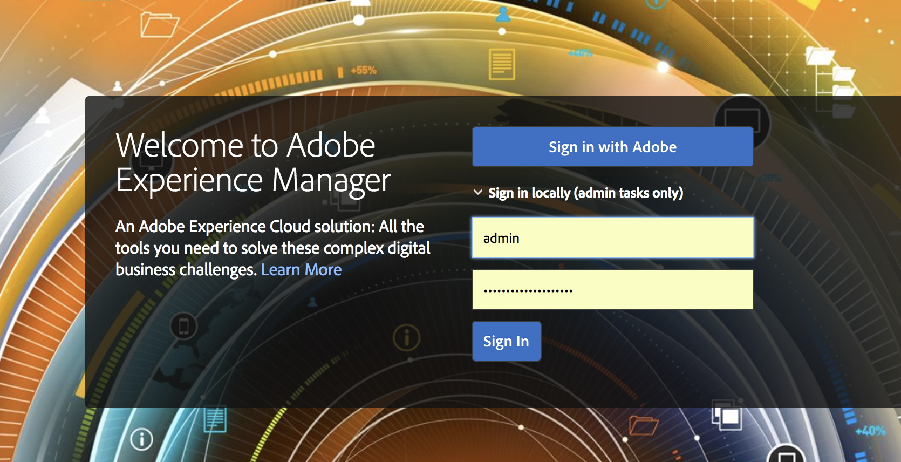

# Adobe IMS 인증 및 [!DNL Admin Console] AEM Managed Services 지원 {#adobe-ims-authentication-and-admin-console-support-for-aem-managed-services}

>[!NOTE]
>
>이 기능은 Adobe Managed Services 고객만 사용할 수 있습니다.

>[!NOTE]
>
>현재 AEM에서는 프로필에 그룹을 할당할 수 없습니다.  대신 사용자를 개별적으로 추가해야 합니다.

## 소개 {#introduction}

AEM 6.4.3.0은 [!DNL Admin Console] AEM 인스턴스 및 Adobe IMS(Identity Management 시스템) 기반 인증을 지원합니다 **AEM Managed Services** 고객.

AEM 온보딩 [!DNL Admin Console] 을 사용하면 AEM Managed Services 고객이 하나의 콘솔에서 모든 Experience Cloud 사용자를 관리할 수 있습니다. 사용자 및 그룹을 AEM 인스턴스와 연결된 제품 프로필에 지정하여 특정 인스턴스에 로그인할 수 있도록 할 수 있습니다.

## 주요 내용 {#key-highlights}

* AEM IMS 인증 지원은 사이트 방문자와 같은 고객 사이트의 외부 최종 사용자가 아니라 AEM 작성자, 관리자 또는 개발자에게만 해당됩니다
* 다음 [!DNL Admin Console] 은 AEM Managed Services 고객을 IMS 조직으로, 인스턴스를 제품 컨텍스트로 표시합니다. 고객 시스템 및 제품 관리자는 인스턴스에 대한 액세스를 관리할 수 있습니다
* AEM Managed Services은 고객 토폴로지를 [!DNL Admin Console]. 에는 인스턴스당 AEM Managed Services 제품 컨텍스트의 인스턴스가 하나씩 있습니다 [!DNL Admin Console].
* 의 제품 프로필 [!DNL Admin Console] 은 사용자가 액세스할 수 있는 인스턴스를 결정합니다
* 고객의 자체 SAML 2 호환 ID 공급자를 사용한 페더레이션 인증이 지원됩니다
* 고객 단일 사인온의 경우 Enterprise ID 또는 Federated ID만 지원되며 개인 Adobe ID는 지원되지 않습니다.
* [!DNL User Management] (Adobe에서) [!DNL Admin Console])은 고객 관리자가 계속 소유하게 됩니다.

## 아키텍처 {#architecture}

IMS 인증은 AEM과 Adobe IMS 엔드포인트 간 OAuth 프로토콜을 사용하여 작동합니다. 사용자가 IMS에 추가되고 Adobe ID가 있으면 IMS 자격 증명을 사용하여 AEM Managed Services 인스턴스에 로그인할 수 있습니다.

사용자 로그인 흐름은 아래에 표시되어 있고, 사용자는 IMS로 리디렉션되고, 원할 경우 SSO 유효성 검사를 위한 고객 IDP로 리디렉션된 다음 AEM으로 다시 리디렉션됩니다.

## 설정 방법 {#how-to-set-up}

### 조직에 온보딩 [!DNL Admin Console] {#onboarding-organizations-to-admin-console}

에 대한 고객 온보딩 [!DNL Admin Console] 는 AEM 인증에 Adobe IMS를 사용하기 위한 전제 조건입니다.

첫 번째 단계로, 고객은 Adobe IMS에서 조직이 프로비저닝되어 있어야 합니다. Adobe 엔터프라이즈 고객은 [Adobe [!DNL Admin Console]](https://helpx.adobe.com/kr/enterprise/using/admin-console.html).

AEM Managed Services 고객은 이미 조직이 프로비저닝되어 있어야 하며 IMS 프로비저닝의 일부로서, 고객 인스턴스는 [!DNL Admin Console] 사용자 권한 및 액세스 관리를 위해

사용자 인증을 위해 IMS로 이동하는 것은 AMS와 고객 간의 공동 작업이 되며 각 고객은 워크플로우를 완료할 수 있습니다.

고객이 IMS 조직 및 AMS로 존재하면 IMS에 대한 고객 프로비저닝을 완료하면 필요한 구성 워크플로우에 대한 요약입니다.

1. 지정된 시스템 관리자는 [!DNL Admin Console]
1. 시스템 관리자 클레임 도메인은 도메인의 소유권을 확인합니다(이 예에서 acme.com).
1. 시스템 관리자가 사용자 디렉토리를 설정합니다.
1. 시스템 관리자는 [!DNL Admin Console] SSO 설정
1. AEM 관리자는 평소대로 로컬 그룹, 권한 및 권한을 관리합니다. 사용자 및 그룹 동기화 를 참조하십시오.

>[!NOTE]
>
>IDP 구성을 포함한 Adobe Identity Management 기본 사항에 대한 자세한 내용은 문서를 참조하십시오 [이 페이지.](https://helpx.adobe.com/kr/enterprise/using/set-up-identity.html)
>
>엔터프라이즈 관리에 대한 자세한 정보 및 [!DNL Admin Console] 문서 보기 [이 페이지](https://helpx.adobe.com/kr/enterprise/managing/user-guide.html).

### 사용자에게 온보딩 [!DNL Admin Console] {#onboarding-users-to-the-admin-console}

사용자를 온보딩하는 방법은 고객의 규모와 선호에 따라 세 가지가 있습니다.

1. 에서 사용자 및 그룹을 수동으로 만들기 [!DNL Admin Console]
1. 사용자를 사용하여 CSV 파일 업로드
1. 고객의 엔터프라이즈 Active Directory에서 사용자와 그룹을 동기화합니다.

#### 수동 추가 [!DNL Admin Console] UI {#manual-addition-through-admin-console-ui}

사용자 및 그룹은 [!DNL Admin Console] UI. 이 방법은 관리할 사용자가 많지 않은 경우에 사용할 수 있습니다. 예를 들어 AEM 사용자가 50명 미만입니다.

고객이 Analytics, Target 또는 Creative Cloud 애플리케이션과 같은 다른 Adobe 제품을 관리하기 위해 이 방법을 이미 사용하고 있는 경우에도 사용자를 수동으로 만들 수 있습니다.

#### 에서 파일 업로드 [!DNL Admin Console] UI {#file-upload-in-the-admin-console-ui}

사용자 생성을 쉽게 처리하기 위해 사용자를 일괄 추가할 수 있도록 CSV 파일을 업로드할 수 있습니다.

#### 사용자 동기화 도구 {#user-sync-tool}

UST(User Sync Tool)를 사용하면 기업 고객은 Active Directory 또는 기타 테스트된 OpenLDAP 디렉토리 서비스를 사용하여 Adobe 사용자를 생성하거나 관리할 수 있습니다. 대상 사용자는 도구를 설치 및 구성할 수 있는 IT ID 관리자(Enterprise Directory 및 시스템 관리자)입니다. 오픈소스 도구는 개발자가 특정 요구 사항에 맞게 수정할 수 있도록 사용자 지정할 수 있습니다.

사용자 동기화가 실행되면 이 기능은 조직의 Active Directory(또는 기타 호환되는 데이터 소스)의 사용자 목록을 가져와서 조직 내의 사용자 목록과 비교합니다 [!DNL Admin Console]. 그런 다음 Adobe을 호출합니다 [!DNL User Management] API에 대해 설정된 [!DNL Admin Console] 조직의 디렉토리와 동기화됩니다. 변경 흐름은 완전히 일방향입니다. 에서 편집한 모든 사항 [!DNL Admin Console] 디렉토리에 푸시되지 않습니다.

시스템 관리자는 이 도구를 사용하여 고객 디렉토리에 있는 사용자 그룹을 [!DNL Admin Console]새 UST 버전에서는 [!DNL Admin Console].

사용자 동기화를 설정하려면 조직에서는 사용자 동기화를 사용하는 것과 같은 방식으로 자격 증명 세트를 만들어야 합니다 [[!DNL User Management] API](https://www.adobe.io/apis/cloudplatform/usermanagement/docs/setup.html).

사용자 동기화는 다음 위치에서 Adobe Github 저장소를 통해 배포됩니다.

[https://github.com/adobe-apiplatform/user-sync.py/releases/latest](https://github.com/adobe-apiplatform/user-sync.py/releases/latest)

시험판 버전 2.4RC1 은 동적 그룹 생성 지원과 함께 사용 가능하며 여기에서 찾을 수 있습니다. [https://github.com/adobe-apiplatform/user-sync.py/releases/tag/v2.4rc1](https://github.com/adobe-apiplatform/user-sync.py/releases/tag/v2.4rc1)

이 릴리스의 주요 기능은 [!DNL Admin Console]및 동적 사용자 그룹 만들기

새 그룹 기능에 대한 자세한 내용은 다음을 참조하십시오.

[https://github.com/adobe-apiplatform/user-sync.py/blob/v2/docs/en/user-manual/advanced_configuration](https://github.com/adobe-apiplatform/user-sync.py/blob/v2/docs/en/user-manual/advanced_configuration.md#additional-group-options)

>[!NOTE]
>
>사용자 동기화 도구에 대한 자세한 내용은 [설명서 페이지](https://adobe-apiplatform.github.io/user-sync.py/en/).
>
>
>사용자 동기화 도구는 설명된 절차를 사용하여 Adobe I/O 클라이언트 UMAPI로 등록해야 합니다 [여기](https://adobe-apiplatform.github.io/umapi-documentation/en/UM_Authentication.html).
>
>Adobe I/O 콘솔 설명서를 찾을 수 있습니다 [여기](https://www.adobe.io/apis/cloudplatform/console.html).
>
>
>다음 [!DNL User Management] 사용자 동기화 도구에서 사용하는 API는 여기에서 다룹니다 [위치](https://www.adobe.io/apis/cloudplatform/umapi-new.html).

>[!NOTE]
>
>AEM IMS 구성은 Adobe Managed Services 팀이 처리합니다. 그러나 고객 관리자는 요구 사항에 따라 수정할 수 있습니다(예: 자동 그룹 멤버십 또는 그룹 매핑). IMS 클라이언트도 Managed Services 팀에 의해 등록됩니다.

## 사용 방법 {#how-to-use}

### 에서 제품 및 사용자 액세스 관리 [!DNL Admin Console] {#managing-products-and-user-access-in-admin-console}

고객 제품 관리자가 [!DNL Admin Console]로 설정되면 아래와 같이 AEM Managed Services 제품 컨텍스트의 여러 인스턴스가 표시됩니다.

이 예에서는 조직 *AEM-MS-Onboard* 는 단계, 제품 등과 같은 다양한 토폴로지 및 환경에 걸쳐 32개의 인스턴스를 포함합니다.

인스턴스 세부 사항을 확인하여 인스턴스를 식별할 수 있습니다.

각 제품 컨텍스트 인스턴스에는 관련 제품 프로필이 존재하게 됩니다. 이 제품 프로필은 사용자 및 그룹에 대한 액세스 권한을 지정하는 데 사용됩니다.

이 제품 프로필로 추가된 모든 사용자와 그룹은 아래 예와 같이 해당 인스턴스에 로그인할 수 있습니다.

### AEM에 로그인 {#logging-into-aem}

#### 로컬 관리자 로그인 {#local-admin-login}

로그인 화면에는 로컬로 로그인할 수 있는 옵션이 있으므로 AEM은 관리 사용자에 대한 로컬 로그인을 계속 지원할 수 있습니다.

#### IMS 기반 로그인 {#ims-based-login}

다른 사용자의 경우 인스턴스에 IMS가 구성되어 있으면 IMS 기반 로그인을 사용할 수 있습니다. 사용자가 먼저 **Adobe으로 로그인** 아래와 같이 버튼을 클릭합니다.

그러면 IMS 로그인 화면으로 리디렉션되고 자격 증명을 입력합니다.

페더레이션 IDP가 초기 중에 구성된 경우 [!DNL Admin Console] 설정을 지정하면 사용자가 SSO용 고객 IDP로 리디렉션됩니다.

아래 예에서 IDP는 Okta입니다.

인증이 완료되면 사용자는 다시 AEM으로 리디렉션되고 로그인됩니다.

### 기존 사용자 마이그레이션 {#migrating-existing-users}

다른 인증 방법을 사용하고 현재 IMS로 마이그레이션되고 있는 기존 AEM 인스턴스의 경우 마이그레이션 단계가 있어야 합니다.

LDAP 또는 SAML을 통해 로컬로 가져온 AEM 저장소의 기존 사용자는 사용자 마이그레이션 유틸리티를 사용하여 IMS를 IDP로 가리키도록 마이그레이션할 수 있습니다.

이 유틸리티는 IMS 프로비저닝의 일부로서 AMS 팀이 실행합니다.

### AEM의 권한 및 ACL 관리 {#managing-permissions-and-acls-in-aem}

액세스 제어 및 권한은 AEM에서 계속 관리되며, 이 작업은 IMS(예: 아래 예에서 AEM-GRP-008)와 권한 및 액세스 제어가 정의된 로컬 그룹을 분리하여 수행할 수 있습니다. IMS에서 동기화된 사용자 그룹은 로컬 그룹에 할당하고 권한을 상속할 수 있습니다.

아래 예에서는 동기화된 그룹을 로컬 *Dam_Users* 그룹에 추가하겠습니다.

여기에서 사용자는 [!DNL Admin Console]. ( 사용자 동기화 도구를 사용하여 LDAP에서 사용자 및 그룹을 동기화하거나 로컬로 만들 수 있습니다. 섹션을 참조하십시오 **사용자에게 온보딩[!DNL Admin Console]** ).

>[!NOTE]
>
>사용자 그룹은 사용자가 인스턴스에 로그인할 때만 동기화됩니다.

사용자는 IMS에서 다음 그룹의 일부입니다.

사용자가 로그인하면 그룹 멤버십이 아래와 같이 동기화됩니다.

IMS에서 동기화된 사용자 그룹은 AEM에서 기존 로컬 그룹(예: DAM 사용자)의 구성원으로 추가될 수 있습니다.

아래와 같이 그룹 *AEM-GRP_008* 는 DAM 사용자의 권한 및 권한을 상속합니다. 이는 동기화된 그룹에 대한 권한을 관리하는 효과적인 방법이며 LDAP 기반 인증 방법에서도 일반적으로 사용됩니다.

