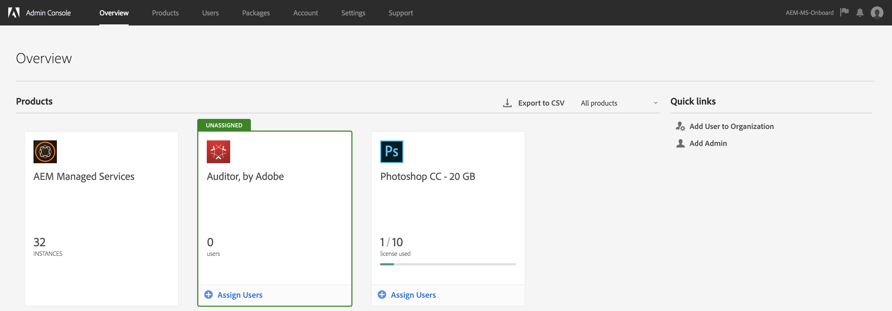

# AEM Managed Services IMS 인증 및 [!DNL Admin Console] 지원 {#adobe-ims-authentication-and-admin-console-support-for-aem-managed-services}

>[!NOTE]
>
>이 기능은 Adobe Managed Services 고객에게만 제공됩니다.

## 소개 {#introduction}

AEM 6.4.3.0은 [!DNL Admin Console] AEM Managed Services **** 고객을 위한 AEM 인스턴스 및 Adobe IMS(Identity Management 시스템) 기반 인증을 지원합니다.

AEM Managed Services 고객이 AEM의 [!DNL Admin Console] 모든 Experience Cloud 사용자를 하나의 콘솔에서 관리할 수 있습니다. AEM 인스턴스와 연관된 제품 프로필에 사용자 및 그룹을 할당하여 특정 인스턴스에 로그인할 수 있습니다.

## 주요 특징 {#key-highlights}

* AEM IMS 인증 지원은 AEM 작성자, 관리자 또는 개발자에게만 해당되며 사이트 방문자와 같은 고객 사이트의 외부 최종 사용자에게는 해당되지 않습니다
* 이 [!DNL Admin Console] 는 AEM Managed Services 고객을 IMS 조직 및 해당 인스턴스를 제품 컨텍스트로 나타냅니다. 고객 시스템 및 제품 관리자는 인스턴스에 대한 액세스를 관리할 수 있습니다.
* AEM Managed Services은 고객 토폴로지와 동기화할 예정입니다 [!DNL Admin Console]. 인스턴스당 AEM Managed Services 제품 컨텍스트의 인스턴스가 하나 있습니다 [!DNL Admin Console].
* Product Profiles in [!DNL Admin Console] will determine which instances a user can access
* 고객의 고유 SAML 2 호환 ID 공급자를 사용한 통합 인증이 지원됩니다.
* 고객 SSO용 Enterprise ID 또는 Federated ID만 지원되며 개인 Adobe ID는 지원되지 않습니다.
* [!DNL User Management] (Adobe [!DNL Admin Console])는 고객 관리자가 계속 소유하게 됩니다.

## 아키텍처 {#architecture}

IMS 인증은 AEM과 Adobe IMS 끝점 간에 OAuth 프로토콜을 사용하여 작동합니다. 사용자가 IMS에 추가되고 Adobe ID가 있으면 IMS 자격 증명을 사용하여 AEM Managed Services 인스턴스에 로그인할 수 있습니다.

아래에 사용자 로그인 흐름이 표시되면, 사용자는 IMS로 리디렉션되고, 원할 경우 SSO를 위한 고객 IDP로 리디렉션된 후 AEM으로 다시 리디렉션됩니다.

## How To Set Up {#how-to-set-up}

### 온보딩 조직에서 [!DNL Admin Console] {#onboarding-organizations-to-admin-console}

The customer onboarding to [!DNL Admin Console] is a pre-requisite to using Adobe IMS for AEM authentication.

첫 번째 단계로 고객은 Adobe IMS에서 프로비저닝된 조직을 가져야 합니다. Adobe 기업 고객은 [Adobe에서 IMS 조직으로 표시됩니다 [!DNL Admin Console]](https://helpx.adobe.com/kr/enterprise/using/admin-console.html).

AEM Managed Services customers should already have an organization provisioned, and as part of the IMS provisioning, the customer instances will be made available in the [!DNL Admin Console] for managing user entitlements and access.

사용자 인증을 위해 IMS로 전환하는 것은 AMS와 고객 간의 공동 작업으로 진행되며 각각의 워크플로우는 완료됩니다.

고객이 IMS 조직 및 AMS로 존재하면 IMS에 대한 고객을 프로비저닝으로 완료하면 필요한 구성 워크플로우의 요약입니다.

1. The designated System Admin receives an invite to log in to the [!DNL Admin Console]
1. 시스템 관리자가 도메인 소유권을 확인하기 위해 도메인 요청(이 예 acme.com)
1. 시스템 관리자가 사용자 디렉토리를 설정합니다.
1. 시스템 관리자는 SSO용 설정에 IDP(ID 공급자) [!DNL Admin Console] 를 구성합니다.
1. AEM 관리자는 로컬 그룹, 권한 및 권한을 평소대로 관리합니다. 사용자 및 그룹 동기화 참조

>[!NOTE]
>
>IDP 구성을 포함하여 Adobe Identity Management 기본 사항에 대한 자세한 내용은 [이 페이지를 참조하십시오.](https://helpx.adobe.com/kr/enterprise/using/set-up-identity.html)
>
>Enterprise Administration에 대한 자세한 내용은 [!DNL Admin Console] 이 페이지 를 참조하십시오.

### 사용자에게 [!DNL Admin Console] {#onboarding-users-to-the-admin-console}

고객의 규모와 선호도에 따라 사용자가 가입할 수 있는 방법에는 세 가지가 있습니다.

1. 수동으로 [!DNL Admin Console]
1. 사용자와 함께 CSV 파일 업로드
1. 고객의 엔터프라이즈 Active Directory에서 사용자 및 그룹을 동기화합니다.

#### Manual Addition through [!DNL Admin Console] UI {#manual-addition-through-admin-console-ui}

Users and Groups can be manually created in the [!DNL Admin Console] UI. 이 메서드는 관리할 사용자 수가 많지 않은 경우에 사용할 수 있습니다. 예를 들어 AEM 사용자가 50명 미만인 경우

고객이 Analytics, Target 또는 Creative Cloud 애플리케이션과 같은 다른 Adobe 제품을 관리하기 위해 이 방법을 이미 사용하고 있는 경우 사용자를 수동으로 만들 수도 있습니다.

#### UI에서 파일 [!DNL Admin Console] 업로드 {#file-upload-in-the-admin-console-ui}

사용자 작성을 쉽게 처리하기 위해 사용자를 일괄 추가하기 위해 CSV 파일을 업로드할 수 있습니다.

#### 사용자 동기화 도구 {#user-sync-tool}

UST(User Sync Tool)를 통해 기업 고객은 Active Directory 또는 기타 테스트를 거친 OpenLDAP 디렉토리 서비스를 사용하여 Adobe 사용자를 생성하거나 관리할 수 있습니다. 대상 사용자는 도구를 설치하고 구성할 수 있는 IT ID 관리자(Enterprise Directory 및 시스템 관리자)입니다. 오픈 소스 툴은 고객이 고유한 요구 사항에 맞게 개발자가 수정할 수 있도록 사용자 정의할 수 있습니다.

When User Sync runs, it fetches a list of users from the organization’s Active Directory (or any other compatible data source) and compares it with the list of users within the [!DNL Admin Console]. It then calls the Adobe [!DNL User Management] API so that the [!DNL Admin Console] is synchronized with the organization’s directory. 변경 흐름은 모두 한 방향입니다.에서 편집한 내용은 디렉터리로 푸시되지 [!DNL Admin Console] 않습니다.

시스템 관리자는 이 도구를 사용하여 고객 디렉토리의 사용자 그룹을 제품 구성 및 사용자 그룹으로 매핑할 수 있으며, 새 UST 버전을 사용하면 [!DNL Admin Console], 사용자 그룹의 동적 생성을 허용할 수 [!DNL Admin Console]있습니다.

To set up User Sync, the organization needs to create a set of credentials in the same way they would use the [[!DNL User Management] API](https://www.adobe.io/apis/cloudplatform/usermanagement/docs/setup.html).

사용자 동기화는 다음 위치의 Adobe Github 리포지토리를 통해 배포됩니다.

[https://github.com/adobe-apiplatform/user-sync.py/releases/latest](https://github.com/adobe-apiplatform/user-sync.py/releases/latest)

시험판 버전 2.4RC1은 동적 그룹 생성 지원과 함께 사용할 수 있으며 다음 자료를 참조하십시오. [https://github.com/adobe-apiplatform/user-sync.py/releases/tag/v2.4rc1](https://github.com/adobe-apiplatform/user-sync.py/releases/tag/v2.4rc1)

The major features for this release are the ability to dynamically map new LDAP groups for user membership in the [!DNL Admin Console], as well as dynamic user group creation.

새 그룹 기능에 대한 자세한 내용은 다음 링크를 참조하십시오.

[https://github.com/adobe-apiplatform/user-sync.py/blob/v2/docs/en/user-manual/advanced_configuration](https://github.com/adobe-apiplatform/user-sync.py/blob/v2/docs/en/user-manual/advanced_configuration.md#additional-group-options)

>[!NOTE]
>
>사용자 동기화 도구에 대한 자세한 내용은 [설명서 페이지를 참조하십시오](https://adobe-apiplatform.github.io/user-sync.py/en/).
>
>
>The User Sync Tool needs to register as an Adobe I/O client UMAPI using the procedure described [here](https://adobe-apiplatform.github.io/umapi-documentation/en/UM_Authentication.html).
>
>The Adobe I/O Console Documentation can be found [here](https://www.adobe.io/apis/cloudplatform/console.html).
>
>
>사용자 [!DNL User Management] 동기화 도구가 사용하는 API는 이 [위치에서 다룹니다](https://www.adobe.io/apis/cloudplatform/umapi-new.html).

>[!NOTE]
>
>AEM IMS 구성은 Adobe Managed Services 팀에서 처리합니다. 그러나 고객 관리자는 요구 사항에 따라 수정할 수 있습니다(예: 자동 그룹 구성원 자격 또는 그룹 매핑). IMS 클라이언트는 Managed Services 팀에서도 등록됩니다.

## 사용 방법 {#how-to-use}

### Managing Products and User Access in [!DNL Admin Console] {#managing-products-and-user-access-in-admin-console}

When the customer Product Administrator logs in to [!DNL Admin Console], they will see multiple instances of the AEM Managed Services Product Context as shown below:

In this example, the org *AEM-MS-Onboard* has 32 instances spanning different topologies and environments like Stage, Prod, etc.

인스턴스 세부 사항을 확인하여 인스턴스를 식별할 수 있습니다.

각 제품 컨텍스트 인스턴스 아래에 관련 제품 프로필이 있습니다. 이 제품 프로필은 사용자 및 그룹에 대한 액세스 권한을 할당하는 데 사용됩니다.

이 제품 프로필에 추가된 모든 사용자 및 그룹은 아래 예와 같이 해당 인스턴스에 로그인할 수 있습니다.

### AEM 로그인 {#logging-into-aem}

#### 로컬 관리자 로그인 {#local-admin-login}

로그인 화면에 로컬로 로그인할 수 있는 옵션이 있기 때문에 AEM은 관리 사용자의 로컬 로그인을 계속 지원할 수 있습니다.

#### IMS 기반 로그인 {#ims-based-login}

다른 사용자의 경우 인스턴스에 IMS가 구성되어 있으면 IMS 기반 로그인을 사용할 수 있습니다. The user will first click on the **Sign in with Adobe** button as shown below:

그러면 IMS 로그인 화면으로 리디렉션되고 자격 증명을 입력합니다.

If a federated IDP is configured during initial [!DNL Admin Console] setup, then the user will be redirected to the customer IDP for SSO.

IDP는 아래 예에서 Okta입니다.

인증이 완료되면 사용자는 다시 AEM으로 리디렉션되고 로그인됩니다.

### 기존 사용자 마이그레이션 {#migrating-existing-users}

다른 인증 방법을 사용하고 현재 IMS로 마이그레이션되고 있는 기존 AEM 인스턴스의 경우 마이그레이션 단계가 있어야 합니다.

AEM 저장소(로컬에서 LDAP 또는 SAML을 통해 소스)의 기존 사용자는 사용자 마이그레이션 유틸리티를 사용하여 IMS를 가리키도록 마이그레이션할 수 있습니다.

이 유틸리티는 IMS 프로비저닝의 일부로 AMS 팀에서 실행합니다.

### AEM에서 권한 및 ACL 관리 {#managing-permissions-and-acls-in-aem}

액세스 제어 및 권한은 AEM에서 계속 관리되며, IMS에서 오는 사용자 그룹(예: 아래 예제의 AEM-GRP-008)과 권한 및 액세스 컨트롤이 정의된 로컬 그룹을 분리하여 이를 달성할 수 있습니다. IMS에서 동기화된 사용자 그룹은 로컬 그룹에 할당되고 권한을 상속할 수 있습니다.

아래 예에서는 동기화된 그룹을 로컬 *Dam_Users* 그룹에 추가하겠습니다.

여기에서 사용자는 그룹의 일부 그룹에도 할당되었습니다 [!DNL Admin Console]. ( 사용자 동기화 도구를 사용하여 LDAP에서 사용자 및 그룹을 동기화하거나 로컬로 만들 수 있습니다. 위 **의 온보딩 사용자 섹션을[!DNL Admin Console]** 참조하십시오.)

&amp;ast;사용자 그룹은 사용자가 인스턴스에 로그인할 때에만 동기화됩니다. 많은 사용자와 그룹이 있는 고객의 경우, 위에서 설명한 액세스 제어 및 권한 관리를 위해 그룹 동기화 유틸리티를 AMS에서 실행하여 그룹을 미리 가져올 수 있습니다.

사용자는 IMS에서 다음 그룹의 일부입니다.

사용자가 로그인하면 그룹 멤버십이 아래와 같이 동기화됩니다.

AEM에서는 IMS에서 동기화된 사용자 그룹을 기존 로컬 그룹(예: DAM 사용자)에 구성원으로 추가할 수 있습니다.

아래에 표시된 것처럼 그룹 *은 AEM-GRP_008* DAM 사용자의 권한 및 권한을 상속받습니다. 동기화된 그룹에 대한 권한을 효과적으로 관리하는 방법이며 LDAP 기반 인증 방법에서도 일반적으로 사용됩니다.

