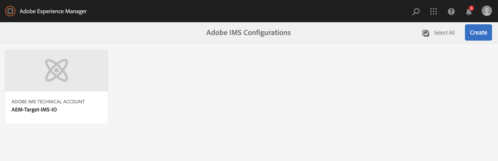

# Adobe I/O을 사용하여 Adobe Target과 통합{#integration-with-adobe-target-using-adobe-i-o}

Target Standard API를 통해 AEM과 Adobe Target을 통합하려면 Adobe IMS(Identity Management 시스템) 및 Adobe I/O을 구성해야 합니다.

>[!NOTE]
>
>Adobe Target Standard API에 대한 지원은 AEM 6.5에서 새로 추가되었습니다. Target Standard API에서는 IMS 인증을 사용합니다.
>
>AEM에서 Adobe Target Classic API를 사용하는 것은 여전히 이전 버전과의 호환성을 위해 지원됩니다. 다음 [Target Classic API는 사용자 자격 증명 인증을 사용합니다](/help/sites-administering/target-configuring.md#manually-integrating-with-adobe-target).
>
>API 선택은 AEM/Target 통합에 사용되는 인증 방법에 의해 수행됩니다.
>다음을 참조하십시오. [테넌트 ID 및 클라이언트 코드](#tenant-client) 섹션을 참조하십시오.

## 전제 조건 {#prerequisites}

이 절차를 시작하기 전에:

* [Adobe 지원](https://helpx.adobe.com/kr/contact/enterprise-support.ec.html) 다음에 대한 계정을 프로비저닝해야 합니다.

   * Adobe 콘솔
   * Adobe I/O
   * Adobe Target 및
   * Adobe IMS(Identity Management 시스템)

* 조직의 시스템 관리자는 Admin Console을 사용하여 조직의 필수 개발자를 관련 제품 프로필에 추가해야 합니다.

   * 이렇게 하면 특정 개발자에게 Adobe I/O 내의 통합을 활성화할 수 있는 권한이 제공됩니다.
   * 자세한 내용은 [개발자 관리](https://helpx.adobe.com/enterprise/admin-guide.html/enterprise/using/manage-developers.ug.html).

## IMS 구성 구성 - 공개 키 생성 {#configuring-an-ims-configuration-generating-a-public-key}

구성의 첫 번째 단계는 AEM에서 IMS 구성을 만들고 공개 키를 생성하는 것입니다.

1. AEM에서 **도구** 메뉴 아래의 제품에서 사용할 수 있습니다.
1. 에서 **보안** 섹션 선택 **Adobe IMS 구성**.
1. 선택 **만들기** 열다 **Adobe IMS 기술 계정 구성**.
1. 아래의 드롭다운을 사용합니다. **클라우드 구성**, 선택 **Adobe Target**.
1. 활성화 **새 인증서 만들기** 새 별칭을 입력합니다.
1. 다음으로 확인 **인증서 만들기**.

   

1. 선택 **다운로드** 또는 **공개 키 다운로드**)를 클릭하여 파일을 로컬 드라이브에 다운로드하므로 [AEM과 Adobe Target 통합을 위한 Adobe I/O 구성](#configuring-adobe-i-o-for-adobe-target-integration-with-aem).

   >[!CAUTION]
   >
   >이 구성을 열어 두면 [AEM에서 IMS 구성 완료](#completing-the-ims-configuration-in-aem).

   

## AEM과 Adobe Target 통합을 위한 Adobe I/O 구성 {#configuring-adobe-i-o-for-adobe-target-integration-with-aem}

AEM에서 사용할 Adobe Target과 Adobe I/O 프로젝트(통합)를 만든 다음 필요한 권한을 지정해야 합니다.

### 프로젝트 만들기 {#creating-the-project}

AEM에서 사용할 Adobe Target으로 I/O 프로젝트를 만들려면 Adobe I/O 콘솔을 엽니다.

>[!NOTE]
>
>다음을 참조하십시오. [Adobe I/O 자습서](https://www.adobe.io/apis/experienceplatform/home/tutorials/alltutorials.html).

1. 프로젝트용 Adobe I/O 콘솔을 엽니다.

   [https://console.adobe.io/projects](https://console.adobe.io/projects)

1. 보유한 모든 프로젝트가 표시됩니다. 선택 **새 프로젝트 만들기** - 위치 및 사용법은 다음과 같이 달라집니다.

   * 아직 프로젝트가 없다면 **새 프로젝트 만들기** 중심입니다, 아래쪽입니다.
      
   * 이미 기존 프로젝트가 있는 경우 이러한 프로젝트가 나열되고 **새 프로젝트 만들기** 오른쪽 위에 있습니다.
      

1. 선택 **프로젝트에 추가** 후 **API**:

   

1. 선택 **Adobe Target**, 그런 다음 **다음**:

   >[!NOTE]
   >
   >Adobe Target을 구독했지만 목록에 표시되지 않으면 [사전 요구 사항](#prerequisites).

   

1. **공개 키 업로드**, 그리고 완료되면 **다음**:

   

1. 자격 증명을 검토하고 계속 **다음**:

   

1. 필요한 제품 프로필을 선택하고 계속 **구성된 API 저장**:

   >[!NOTE]
   >
   >와 함께 표시되는 제품 프로필은 다음 조건을 충족하는지에 따라 다릅니다.
   >
   >* Adobe Target Standard - 전용 **기본 작업 공간** 사용 가능
   >* Adobe Target Premium - 사용 가능한 모든 작업 공간이 아래와 같이 나열됩니다

   

1. 그 창조는 확인될 것이다.

<!--
1. The creation will be confirmed, you can now **Continue to integration details**; these are needed for [Completing the IMS Configuration in AEM](#completing-the-ims-configuration-in-aem).

   
-->

### 통합에 권한 지정 {#assigning-privileges-to-the-integration}

이제 통합에 필요한 권한을 할당해야 합니다.

1. Adobe 열기 **Admin Console**:

   * [https://adminconsole.adobe.com](https://adminconsole.adobe.com/)

1. 다음으로 이동 **제품** (위쪽 도구 모음)를 선택한 다음 **Adobe Target - &lt;*your-tenant-id*>** (왼쪽 패널에서)
1. 선택 **제품 프로필**&#x200B;그런 다음 제공된 목록에서 필요한 작업 공간을 만듭니다. 예를 들어, 기본 작업 영역입니다.
1. 선택 **통합**, 그런 다음 필요한 통합 구성을 선택합니다.
1. 선택 **편집자** 로서의 **제품 역할**; 대신 **관찰자**.

## Adobe I/O 통합 프로젝트에 대해 저장된 세부 사항 {#details-stored-for-the-adobe-io-integration-project}

Adobe I/O 프로젝트 콘솔에서 모든 통합 프로젝트 목록을 볼 수 있습니다.

* [https://console.adobe.io/projects](https://console.adobe.io/projects)

선택 **보기** (특정 프로젝트 항목 오른쪽에 있음)를 클릭하여 구성에 대한 세부 정보를 표시합니다. 여기에는 다음이 포함됩니다.

* 프로젝트 개요
* 인사이트
* 자격 증명
   * 서비스 계정(JWT)
      * 자격 증명 세부 사항
      * JWT 생성
* API
   * 예: Adobe Target

이러한 중 일부는 AEM에서 Target을 위한 Adobe I/O 통합을 완료해야 합니다.

## AEM에서 IMS 구성 완료 {#completing-the-ims-configuration-in-aem}

AEM으로 돌아가면 Target을 위한 Adobe I/O 통합에서 필수 값을 추가하여 IMS 구성을 완료할 수 있습니다.

1. 로 돌아갑니다. [AEM에서 열린 IMS 구성](#configuring-an-ims-configuration-generating-a-public-key).
1. **다음**&#x200B;을 선택합니다.

1. 여기에서 을 사용할 수 있습니다 [Adobe I/O 세부 정보](#details-stored-for-the-adobe-io-integration-project):

   * **제목**: 텍스트.
   * **인증 서버**: 에서 이 복사/붙여넣기 `aud` 라인 **페이로드** 섹션을 참조하십시오. `https://ims-na1.adobelogin.com` 아래 예에서
   * **API 키**: 다음에서 이 복사 [개요](#details-stored-for-the-adobe-io-integration-project) Target에 대한 Adobe I/O 통합 섹션
   * **클라이언트 암호**: 에서 이 필드를 생성합니다. [개요](#details-stored-for-the-adobe-io-integration-project) Target에 대한 Adobe I/O 통합 섹션 및 복사
   * **페이로드**: 다음에서 이 복사 [JWT 생성](#details-stored-for-the-adobe-io-integration-project) Target에 대한 Adobe I/O 통합 섹션

   

1. 다음으로 확인 **만들기**.

1. Adobe Target 구성이 AEM 콘솔에 표시됩니다.

   

## IMS 구성 확인 {#confirming-the-ims-configuration}

구성이 예상대로 작동하는지 확인하려면:

1. 열기:

   * `https://localhost<port>/libs/cq/adobeims-configuration/content/configurations.html`

   예:

   * `https://localhost:4502/libs/cq/adobeims-configuration/content/configurations.html`

1. 구성을 선택합니다.
1. 선택 **상태 확인** 도구 모음에서 를 차례로 클릭합니다. **확인**.

   

1. 성공하면 다음 메시지가 표시됩니다.

   

## Adobe Target Cloud Service 구성 {#configuring-the-adobe-target-cloud-service}

이제 Cloud Service이 Target Standard API를 사용하도록 구성을 참조할 수 있습니다.

1. 를 엽니다. **도구** 메뉴 아래의 제품에서 사용할 수 있습니다. 그런 다음 **Cloud Services** 섹션, **기존 Cloud Services**.
1. 아래로 스크롤하여 **Adobe Target** 을(를) 선택합니다. **지금 구성**.

   다음 **구성 만들기** 대화 상자가 열립니다.

1. 을(를) 입력합니다. **제목** 원한다면 **이름** (비워 두면 제목에서 생성됩니다).

   필요한 템플릿을 선택할 수도 있습니다(둘 이상의 템플릿을 사용할 수 있는 경우).

1. 다음으로 확인 **만들기**.

   다음 **구성 요소 편집** 대화 상자가 열립니다.

1. 에 세부 사항을 입력합니다. **Adobe Target 설정** 탭:

   * **인증**: IMS

   * **테넌트 ID**: adobe IMS 테넌트 ID입니다. 다음을 참조하십시오. [테넌트 ID 및 클라이언트 코드](#tenant-client) 섹션을 참조하십시오.

      >[!NOTE]
      >
      >IMS의 경우 이 값을 Target 자체에서 가져와야 합니다. Target에 로그인하고 URL에서 테넌트 ID를 추출할 수 있습니다.
      >
      >예를 들어 URL이 다음과 같은 경우:
      >
      >`https://experience.adobe.com/#/@yourtenantid/target/activities`
      >
      >그러면 `yourtenantid`.

   * **클라이언트 코드**: 자세한 내용은 [테넌트 ID 및 클라이언트 코드](#tenant-client) 섹션을 참조하십시오.

   * **IMS 구성**: ims 구성 이름을 선택합니다.

   * **API 유형**: REST

   * **A4T Analytics Cloud 구성**: Target 활동 목표 및 지표에 사용되는 Analytics 클라우드 구성을 선택합니다. 컨텐츠를 타깃팅할 때 Adobe Analytics을 보고 소스로 사용하는 경우 이 작업이 필요합니다. 클라우드 구성이 표시되지 않으면 [A4T Analytics Cloud 구성 구성](/help/sites-administering/target-configuring.md#configuring-a-t-analytics-cloud-configuration).

   * **정확한 타겟 지정 사용**: 기본적으로 이 확인란은 선택되어 있습니다. 이 옵션을 선택하면 클라우드 서비스 구성이 컨텍스트를 로드한 후 컨텐츠를 로드합니다. 다음을 참조하십시오.

   * **Adobe Target에서 세그먼트 동기화**: AEM에서 사용할 Target에 정의된 세그먼트를 다운로드하려면 이 옵션을 선택합니다. 인라인 세그먼트는 지원되지 않으며 항상 Target의 세그먼트를 사용해야 하므로 API 유형 속성이 REST일 때 이 옵션을 선택해야 합니다. (&#39;세그먼트&#39;의 AEM 용어는 &#39;대상&#39; Target과 같습니다.)

   * **클라이언트 라이브러리**: AT.js 클라이언트 라이브러리나 mbox.js(더 이상 사용되지 않음)를 원하는지 선택합니다.

   * **Tag Management System을 사용하여 클라이언트 라이브러리를 제공합니다**: DTM(더 이상 사용되지 않음), Launch 또는 기타 태그 관리 시스템을 사용합니다.

   * **사용자 지정 AT.js**: 태그 관리 상자를 선택했거나 기본 AT.js를 사용하려면 비워 둡니다. 또는 사용자 지정 AT.js를 업로드합니다. AT.js를 선택한 경우에만 나타납니다.
   >[!NOTE]
   >
   >[Target Classic API를 사용할 Cloud Service 구성](/help/sites-administering/target-configuring.md#manually-integrating-with-adobe-target) 은 더 이상 사용되지 않습니다(Adobe Recommendations 설정 탭 사용).

1. 클릭 **Target에 연결** 를 눌러 Adobe Target과의 연결을 초기화합니다.

   연결에 성공하면 메시지가 나타납니다 **연결 성공** 이 표시됩니다.

1. 선택 **확인** 메시지 다음에 **확인** 대화 상자에서 구성을 확인합니다.

1. 이제 다음을 수행할 수 있습니다 [Target 프레임워크 추가](/help/sites-administering/target-configuring.md#adding-a-target-framework) Target으로 전송할 ContextHub 또는 ClientContext 매개 변수를 구성하려면 다음을 수행하십시오. AEM 경험 구성요소를 Target으로 내보내는 데에는 필요하지 않을 수 있습니다.

### 테넌트 ID 및 클라이언트 코드 {#tenant-client}

사용 [Adobe Experience Manager 6.5.8.0](/help/release-notes/release-notes.md)클라이언트 코드 필드가 Target 구성 창에 추가되었습니다.

테넌트 ID 및 클라이언트 코드 필드를 구성할 때는 다음 사항에 유의하십시오.

1. 대부분의 고객의 경우 테넌트 ID와 클라이언트 코드는 동일합니다. 즉, 두 필드 모두 동일한 정보를 포함하고 있으며 동일합니다. 두 필드에 테넌트 ID를 입력해야 합니다.
2. 기존 목적으로 테넌트 ID 및 클라이언트 코드 필드에 다른 값을 입력할 수도 있습니다.

두 경우 모두 다음 사항에 유의하십시오.

* 기본적으로 클라이언트 코드(처음 추가된 경우)도 테넌트 ID 필드에 자동으로 복사됩니다.
* 기본 테넌트 ID 세트를 변경할 수 있는 옵션이 있습니다.
* 따라서 Target에 대한 백엔드 호출은 테넌트 ID를 기반으로 하며, Target에 대한 클라이언트측 호출은 클라이언트 코드를 기반으로 합니다.

앞에서 설명한 바와 같이, 첫 번째 사례는 AEM 6.5에서 가장 일반적으로 사용됩니다. 어느 쪽이든, **둘 다** 필드에는 요구 사항에 따라 올바른 정보가 포함됩니다.

>[!NOTE]
>
> 기존 Target 구성을 변경하려면:
>
> 1. 테넌트 ID를 다시 입력합니다.
> 2. Target에 다시 연결합니다.
> 3. 구성을 저장합니다.

