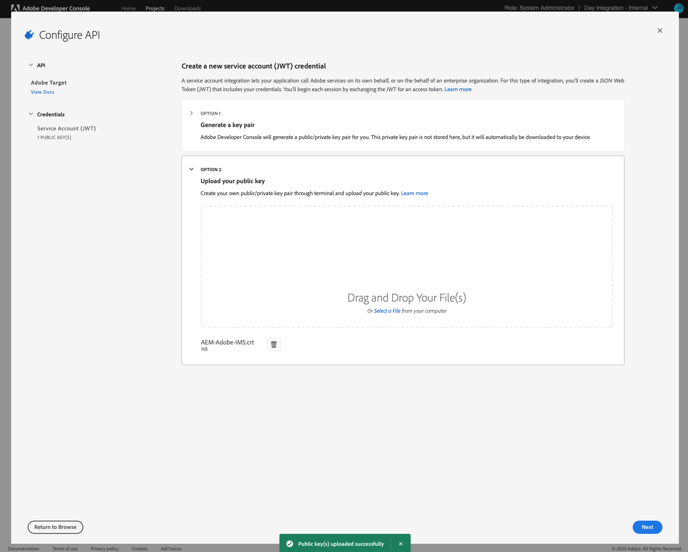

# IMS를 사용하여 Adobe Target과 통합{#integration-with-adobe-target-using-ims}

Target Standard API를 통해 AEM과 Adobe Target을 통합하려면 Adobe Developer 콘솔을 사용하여 Adobe IMS(Identity Management 시스템)를 구성해야 합니다.

>[!NOTE]
>
>Adobe Target Standard API에 대한 지원은 AEM 6.5의 새로운 기능입니다. Target Standard API는 IMS 인증을 사용합니다.
>
>이전 버전과의 호환성을 위해 AEM에서 Adobe Target Classic API를 사용하는 것이 여전히 지원됩니다. 다음 [Target Classic API가 사용자 자격 증명 인증을 사용합니다.](/help/sites-administering/target-configuring.md#manually-integrating-with-adobe-target).
>
>API 선택은 AEM/Target 통합에 사용되는 인증 방법에 따라 결정됩니다.
>다음 항목도 참조하십시오. [테넌트 ID 및 클라이언트 코드](#tenant-client) 섹션.

## 사전 요구 사항 {#prerequisites}

이 절차를 시작하기 전에:

* [Adobe 지원 팀](https://helpx.adobe.com/kr/contact/enterprise-support.ec.html)은 다음에 대한 계정을 프로비저닝해야 합니다.

   * Adobe Console
   * Adobe Developer Console
   * Adobe Target 및
   * Adobe IMS(ID 관리 시스템)

* 조직의 시스템 관리자는 Admin Console을 사용하여 필요한 조직 개발자를 관련 제품 프로필에 추가해야 합니다.

   * 이렇게 하면 특정 개발자에게 Adobe Developer 콘솔 내에서 통합을 활성화할 수 있는 권한이 제공됩니다.
   * 자세한 내용은 [개발자 관리](https://helpx.adobe.com/kr/enterprise/admin-guide.html/enterprise/using/manage-developers.ug.html)를 참조하십시오.

## IMS 구성 - 공개 키 생성 {#configuring-an-ims-configuration-generating-a-public-key}

구성의 첫 단계는 AEM에서 IMS 구성을 만들고 공개 키를 생성하는 것입니다.

1. AEM에서 **도구** 메뉴를 엽니다.
1. **보안** 섹션에서 **Adobe IMS 구성**&#x200B;을 선택합니다.
1. **만들기**&#x200B;를 선택하여 **Adobe IMS 기술 계정 구성**&#x200B;을 엽니다.
1. **클라우드 구성** 아래의 드롭다운을 사용하여 **Adobe Target**&#x200B;을 선택합니다.
1. **새 인증서 만들기**&#x200B;를 활성화한 다음 새 별칭을 입력합니다.
1. **인증서 만들기**&#x200B;를 사용하여 확인합니다.

   

1. **다운로드**(또는 **공개 키 다운로드**)를 선택하여 [AEM과의 Adobe Target 통합에 대해 IMS를 구성](#configuring-ims-for-adobe-target-integration-with-aem)할 때 사용할 수 있도록 파일을 로컬 드라이브에 다운로드합니다.

   >[!CAUTION]
   >
   >[AEM에서 IMS 구성을 완료](#completing-the-ims-configuration-in-aem)할 때 다시 필요하므로 이 구성을 열어 두십시오.

   

## AEM과의 Adobe Target 통합에 대해 IMS 구성 {#configuring-ims-for-adobe-target-integration-with-aem}

Adobe Developer 콘솔을 사용하여 AEM에서 사용할 Adobe Target으로 프로젝트(통합)를 만든 다음 필요한 권한을 할당해야 합니다.

### 프로젝트 만들기 {#creating-the-project}

Adobe Developer Console을 열고 AEM이 사용할 Adobe Target을 사용하여 프로젝트를 만듭니다.

1. 프로젝트용 Adobe Developer Console을 엽니다.

   [https://developer.adobe.com/console/projects](https://developer.adobe.com/console/projects)

1. 보유 중인 모든 프로젝트가 표시됩니다. **새 프로젝트 만들기**&#x200B;를 선택합니다. 위치 및 사용량은 다음에 따라 달라집니다.

   * 보유 중인 프로젝트가 없는 경우 **새 프로젝트 만들기**는 중앙 하단에 표시됩니다.
     
   * 기존 프로젝트가 있는 경우 이들 프로젝트가 나열되며 **새 프로젝트 만들기**는 오른쪽 상단에 표시됩니다.
     

1. **프로젝트에 추가**&#x200B;를 선택한 다음 **API**&#x200B;를 선택합니다.

   

1. **Adobe Target**&#x200B;을 선택하고 **다음**&#x200B;을 선택합니다.

   >[!NOTE]
   >
   >Adobe Target을 구독하지만 나열되지 않는 경우 [전제 조건](#prerequisites).

   

1. **공개 키를 업로드**&#x200B;한 다음 완료되면 **다음**&#x200B;을 사용하여 계속합니다.

   

1. 자격 증명을 검토하고 **다음**&#x200B;을 사용하여 계속합니다.

   

1. 필요한 제품 프로필을 선택한 다음 **구성된 API 저장**&#x200B;을 사용하여 계속합니다.

   >[!NOTE]
   >
   >표시되는 제품 프로필은 다음을 보유하고 있는지 여부에 따라 달라집니다.
   >
   >* Adobe Target Standard - **기본 작업 영역**&#x200B;만 사용할 수 있습니다.
   >* Adobe Target Premium - 아래와 같이 사용할 수 있는 모든 작업 영역이 나열됩니다.

   

1. 생성이 확인됩니다.

<!--
1. The creation will be confirmed, you can now **Continue to integration details**; these are needed for [Completing the IMS Configuration in AEM](#completing-the-ims-configuration-in-aem).

   
-->

### 통합에 권한 할당 {#assigning-privileges-to-the-integration}

이제 필요한 권한을 통합에 할당해야 합니다.

1. Adobe **Admin Console**&#x200B;을 엽니다.

   * [https://adminconsole.adobe.com](https://adminconsole.adobe.com/)

1. **제품**&#x200B;으로 이동한 다음(상단 도구 모음) 왼쪽 패널에서 **Adobe Target - &lt;*테넌트 ID*>**&#x200B;을(를) 선택합니다.
1. **제품 프로필**&#x200B;을 선택한 다음 표시되는 목록에서 필요한 작업 영역을 선택합니다. (예: 기본 작업 영역)
1. **API 자격 증명**&#x200B;을 선택한 다음 필요한 통합 구성을 선택합니다.
1. **제품 역할**&#x200B;을 **관찰자**&#x200B;가 아닌 **편집자**&#x200B;로 선택합니다.

## 저장된 Adobe Developer Console 통합 프로젝트 세부 정보 {#details-stored-for-the-ims-integration-project}

[Adobe Developer Console - 프로젝트]에서 모든 통합 프로젝트 목록을 볼 수 있습니다.

* [https://developer.adobe.com/console/projects](https://developer.adobe.com/console/projects)

구성에 대한 세부 정보를 표시하려면 **보기**&#x200B;를 선택합니다(특정 프로젝트 항목 오른쪽). 여기에는 다음이 포함됩니다.

* 프로젝트 개요
* 인사이트
* 자격 증명
   * 서비스 계정(JWT)
      * 자격 증명 세부 정보
      * JWT 생성
* API
   * (예: Adobe Target)

이 중 일부는 AEM에서 IMS를 기반으로 Adobe Target 통합을 완료해야 합니다.

## AEM에서 IMS 구성 완료 {#completing-the-ims-configuration-in-aem}

AEM으로 돌아가면 Target을 위해 Adobe Developer 콘솔 통합에서 필요한 값을 추가하여 IMS 구성을 완료할 수 있습니다.

1. [AEM에서 열려 있는 IMS 구성](#configuring-an-ims-configuration-generating-a-public-key)으로 돌아갑니다.
1. **다음**&#x200B;을 선택합니다.

1. 여기에서 [Adobe Developer Console의 프로젝트 구성에서 세부 정보](#details-stored-for-the-ims-integration-project)를 사용할 수 있습니다.

   * **제목**: 텍스트를 입력하십시오.
   * **인증 서버**: 아래 **페이로드** 섹션의 `aud` 줄에서 이 인증 서버를 복사하여 붙여넣습니다(아래 예에서 `https://ims-na1.adobelogin.com`).
   * **API 키**: 다음에서 이 복사: [개요](#details-stored-for-the-ims-integration-project) 섹션
   * **클라이언트 암호**: 다음에서 이 생성: [개요](#details-stored-for-the-ims-integration-project) 섹션 및 복사
   * **페이로드**: [JWT 생성](#details-stored-for-the-ims-integration-project) 섹션에서 이 페이로드를 복사합니다.

   

1. **만들기**&#x200B;를 사용하여 확인합니다.

1. AEM 콘솔에 Adobe Target 구성이 표시됩니다.

   

## IMS 구성 확인 {#confirming-the-ims-configuration}

구성이 예상대로 작동하는지 확인하려면 다음 작업을 수행하십시오.

1. 열기:

   * `https://localhost<port>/libs/cq/adobeims-configuration/content/configurations.html`

   예:

   * `https://localhost:4502/libs/cq/adobeims-configuration/content/configurations.html`

1. 구성을 선택합니다.
1. 도구 모음에서 **상태 확인**&#x200B;을 선택한 다음 **확인**&#x200B;을 선택합니다.

   

1. 성공하면 다음과 같은 메시지가 표시됩니다.

   

## Adobe Target Cloud Service 구성 {#configuring-the-adobe-target-cloud-service}

이제 Cloud Service이 Target Standard API를 사용하도록 구성을 참조할 수 있습니다.

1. 를 엽니다. **도구** 메뉴 아래의 제품에서 사용할 수 있습니다. 그런 다음 **Cloud Services** 섹션, 선택 **이전 Cloud Services**.
1. 아래로 스크롤하여 **Adobe Target** 및 선택 **지금 구성**.

   다음 **구성 만들기** 대화 상자가 열립니다.

1. 입력 **제목** 그리고, 원한다면 **이름** (비워 두면 제목에서 생성됩니다.)

   필요한 템플릿을 선택할 수도 있습니다(둘 이상의 템플릿을 사용할 수 있는 경우).

1. **만들기**&#x200B;를 사용하여 확인합니다.

   다음 **구성 요소 편집** 대화 상자가 열립니다.

1. 다음에 세부 정보를 입력합니다. **Adobe Target 설정** 탭:

   * **인증**: IMS

   * **임차인 ID**: Adobe IMS 테넌트 ID입니다. 다음 항목도 참조하십시오. [테넌트 ID 및 클라이언트 코드](#tenant-client) 섹션.

     >[!NOTE]
     >
     >IMS의 경우 이 값은 Target 자체에서 가져와야 합니다. Target에 로그인하고 URL에서 테넌트 ID를 추출할 수 있습니다.
     >
     >예를 들어 URL이 다음과 같은 경우:
     >
     >`https://experience.adobe.com/#/@yourtenantid/target/activities`
     >
     >그런 다음 `yourtenantid`.

   * **클라이언트 코드**: 다음을 참조하십시오. [테넌트 ID 및 클라이언트 코드](#tenant-client) 섹션.

   * **IMS 구성**: IMS 구성의 이름을 선택합니다

   * **API 유형**: REST

   * **A4T Analytics 클라우드 구성**: 타겟 활동 목표 및 지표에 사용되는 Analytics 클라우드 구성을 선택합니다. 이는 콘텐츠를 타겟팅할 때 보고 소스로서의 Adobe Analytics를 사용하는 경우 필요합니다. 클라우드 구성이 표시되지 않으면 의 참고 사항을 참조하십시오. [A4T Analytics Cloud 구성](/help/sites-administering/target-configuring.md#configuring-a-t-analytics-cloud-configuration).

   * **정확한 타겟팅 사용**: 기본적으로 이 확인란은 선택되어 있습니다. 이 확인란을 선택하면 클라우드 서비스 구성은 콘텐츠를 로드하기 전에 컨텍스트가 로드될 때까지 대기합니다. 다음 사항에 주의하십시오.

   * **Adobe Target의 세그먼트 동기화**: AEM에서 사용하기 위해 Target에 정의된 세그먼트를 다운로드하려면 이 옵션을 선택합니다. API 유형 속성이 REST인 경우 인라인 세그먼트가 지원되지 않아 항상 Target의 세그먼트를 사용해야 하므로 이 옵션을 선택해야 합니다. (AEM 용어인 “세그먼트”는 Target에서의 “대상자”와 동일합니다.)

   * **클라이언트 라이브러리**: AT.js 클라이언트 라이브러리를 원하는지 mbox.js(더 이상 사용되지 않음)를 원하는지 선택합니다.

   * **Tag Management 시스템을 사용하여 클라이언트 라이브러리 전달**: DTM(더 이상 사용되지 않음), Tag Launch 또는 기타 Adobe 관리 시스템을 사용합니다.

   * **사용자 정의 AT.js**: Tag Management 상자를 선택하거나 기본 AT.js를 사용하려면 비워 둡니다. 또는 사용자 지정 AT.js를 업로드합니다. AT.js를 선택한 경우에만 나타납니다.

   >[!NOTE]
   >
   >[Target Classic API를 사용하기 위한 Cloud Service 구성](/help/sites-administering/target-configuring.md#manually-integrating-with-adobe-target) 더 이상 사용되지 않습니다(Adobe Recommendations 설정 탭 사용).

1. 클릭 **Target에 연결** Adobe Target에 대한 연결을 초기화합니다.

   정상적으로 연결되면 **연결 성공**&#x200B;이라는 메시지가 표시됩니다.

1. 선택 **확인** 메시지, 다음 메시지 **확인** 대화 상자에서 구성을 확인합니다.

1. 이제 다음으로 진행할 수 있습니다. [Target 프레임워크 추가](/help/sites-administering/target-configuring.md#adding-a-target-framework) Target으로 전송할 ContextHub 또는 ClientContext 매개 변수를 구성합니다. AEM Experience Fragments를 Target으로 내보내는 데는 이 작업이 필요하지 않을 수 있습니다.

### 테넌트 ID 및 클라이언트 코드 {#tenant-client}

포함 [Adobe Experience Manager 6.5.8.0](/help/release-notes/release-notes.md)Target 구성 창에 클라이언트 코드 필드가 추가되었습니다.

테넌트 ID 및 클라이언트 코드 필드를 구성할 때는 다음 사항에 유의하십시오.

1. 대부분의 고객은 테넌트 ID와 클라이언트 코드가 같습니다. 즉, 두 필드에는 동일한 정보가 포함되어 있으며 이 두 필드는 동일합니다. 두 필드 모두에 테넌트 ID를 입력하십시오.
2. 또한 레거시 목적으로 테넌트 ID와 클라이언트 코드 필드에 서로 다른 값을 입력할 수도 있습니다.

두 경우 모두 다음 사항에 주의하십시오.

* 기본적으로 클라이언트 코드(먼저 추가된 경우)도 테넌트 ID 필드에 자동으로 복사됩니다.
* 기본 테넌트 ID 설정을 변경할 수 있는 옵션이 있습니다.
* 이렇게 하면 Target에 대한 백엔드 호출은 테넌트 ID를 기반으로 하고 Target에 대한 클라이언트측 호출은 클라이언트 코드를 기반으로 하게 됩니다.

앞에서 설명한 대로 AEM 6.5에서는 첫 번째 경우가 가장 일반적입니다. 어느 쪽이든, **모두** 필드에는 요구 사항에 따라 올바른 정보가 포함됩니다.

>[!NOTE]
>
>기존 Target 구성을 변경하고자 하는 경우:
>
>1. 테넌트 ID를 다시 입력합니다.
>2. Target에 다시 연결합니다.
>3. 구성을 저장합니다.
