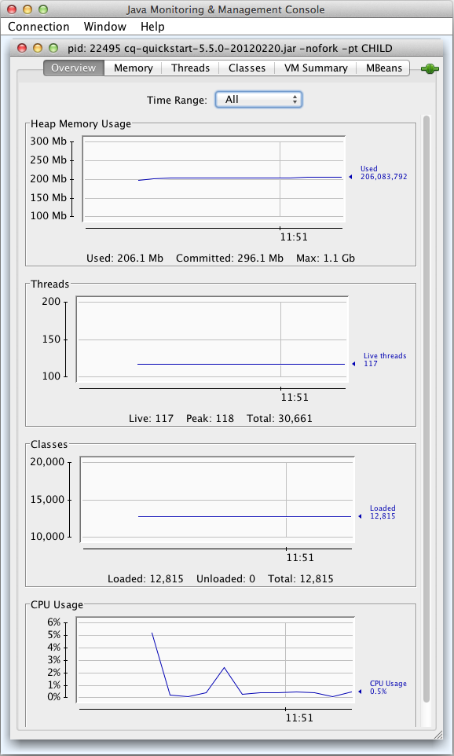

# JMX 콘솔을 사용한 모니터링 서버 리소스{#monitoring-server-resources-using-the-jmx-console}

JMX 콘솔을 사용하여 CRX 서버에서 서비스를 모니터링하고 관리할 수 있습니다. 다음에 나오는 섹션에서는 JMX 프레임워크를 통해 노출되는 속성 및 작업에 대한 간략한 설명을 제공합니다.

콘솔 컨트롤 사용 방법에 대한 자세한 내용은 [JMX 콘솔 사용](#using-the-jmx-console)을 참조하십시오. JMX에 대한 배경 정보는 Oracle 웹 사이트의 [JMX(Java Management Extensions) 기술](https://www.oracle.com/technetwork/java/javase/tech/javamanagement-140525.html) 페이지를 참조하십시오.

JMX 콘솔을 사용하여 서비스를 관리할 MBean 만들기에 대한 자세한 내용은 [JMX 콘솔](/help/sites-developing/jmx-integration.md)과 서비스 통합을 참조하십시오.

## 워크플로 유지 관리 {#workflow-maintenance}

실행, 완료, 부실 및 실패한 워크플로우 인스턴스를 관리하기 위한 작업입니다.

* 도메인:com.adobe.granite.workflow
* 유형:유지 관리

>[!NOTE]
>
>추가 워크플로우 관리 도구 및 가능한 워크플로우 인스턴스 상태에 대한 설명은 [워크플로우 콘솔](/help/sites-administering/workflows-administering.md)을 참조하십시오.

### 작업 {#operations}

**listRunningWorkflowsPerModel각** 워크플로 모델에 대해 실행 중인 워크플로 인스턴스 수를 나열합니다.

* 인수:none
* 반환된 값:Count 및 ModelId 열이 포함된 표 형식 데이터입니다.

**listCompletedWorkflowsPerModel각 워크플로 모델에 대해 완료된 워크플로 인스턴스 수를 나열합니다.** 

* 인수:none
* 반환된 값:Count 및 ModelId 열이 포함된 표 형식 데이터입니다.

**** returnWorkflowQueueInfo처리된 워크플로 항목 및 처리를 위해 큐에 있는 워크플로 항목에 대한 정보를 나열합니다.

* 인수:none
* 반환된 값:다음 열을 포함하는 표 데이터:

   * 작업
   * 큐 이름
   * 활성 작업
   * 평균 처리 시간
   * 평균 대기 시간
   * 취소된 작업
   * 실패한 작업
   * 완료된 작업
   * 처리된 작업
   * 큐에 있는 작업

**워크플로 작업에 대한** returnWorkflowJobTopicInfo항목별로 구성된 처리 정보를 나열합니다.

* 인수:none
* 반환된 값:다음 열이 포함된 표 형식 데이터:

   * 항목 이름
   * 평균 처리 시간
   * 평균 대기 시간
   * 취소된 작업
   * 실패한 작업
   * 완료된 작업
   * 처리된 작업

**returnFailedWorkflowCount** 실패한 워크플로 인스턴스의 수를 표시합니다. 모든 워크플로우 모델에 대한 정보를 쿼리하거나 검색할 워크플로우 모델을 지정할 수 있습니다.

* 인수:

   * 모델:쿼리할 모델의 ID. 모든 워크플로우 모델에 대해 실패한 워크플로우 인스턴스 수를 보려면 값을 지정하지 마십시오. ID는 모델 노드의 경로입니다. 예를 들면 다음과 같습니다.

      `/conf/global/settings/workflow/models/dam/update_asset/jcr:content/model`

* 반환된 값:실패한 워크플로 인스턴스 수입니다.

**returnFailedWorkflowCountPerModel** 각 워크플로 모델에 대해 실패한 워크플로 인스턴스 수를 표시합니다.

* 인수:없음.
* 반환된 값:개수 및 모델 ID 열이 포함된 표 형식 데이터입니다.

**실패한** terminateFailedInstancesTerminate 워크플로 인스턴스. 실패한 모든 인스턴스를 종료하거나 특정 모델에 대해 실패한 인스턴스만 종료할 수 있습니다. 원할 경우, 인스턴스가 종료된 후 인스턴스를 다시 시작할 수 있습니다. 작업을 실제로 수행하지 않고 결과를 보기 위해 작업을 테스트할 수도 있습니다.

* 인수:

   * 인스턴스를 다시 시작합니다.(선택 사항) 인스턴스가 종료된 후 인스턴스를 다시 시작하려면 `true` 값을 지정합니다. 기본값 `false`을(를) 사용하면 종료된 워크플로우 인스턴스를 다시 시작하지 않습니다.
   * 드라이 런:(선택 사항) 작업을 실제로 수행하지 않고 작업의 결과를 보려면 `true` 값을 지정합니다. 기본값 `false`은(는) 작업을 수행합니다.
   * 모델:(선택 사항) 작업이 적용되는 모델의 ID입니다. 모든 워크플로우 모델의 실패한 인스턴스에 작업을 적용할 모델을 지정하지 않습니다. ID는 모델 노드의 경로입니다. 예를 들면 다음과 같습니다.

      `/conf/global/settings/workflow/models/dam/update_asset/jcr:content/model`

* 반환된 값:종료되는 인스턴스에 대한 표 데이터는 다음 열을 포함합니다.

   * 개시자
   * InstanceId
   * ModelId
   * 페이로드
   * StartComment
   * WorkflowTitle

**** retryFailedWorkItems실패한 작업 항목 단계를 실행하려고 시도합니다. 실패한 모든 작업 항목 또는 특정 작업 흐름 모델에 대해 실패한 작업 항목만 다시 시도할 수 있습니다. 작업을 실제로 수행하지 않고 결과를 보려면 작업을 선택적으로 테스트합니다.

* 인수:

   * 드라이 런:(선택 사항) 작업을 실제로 수행하지 않고 작업의 결과를 보려면 `true` 값을 지정합니다. 기본값 `false`은(는) 작업을 수행합니다.
   * 모델:(선택 사항) 작업이 적용되는 모델의 ID입니다. 모든 워크플로우 모델의 실패한 작업 항목에 작업을 적용할 모델을 지정하지 않습니다. ID는 모델 노드의 경로입니다. 예를 들면 다음과 같습니다.

      `/conf/global/settings/workflow/models/dam/update_asset/jcr:content/model`

* 반환된 값:다음 열을 포함하여 재시도된 실패한 작업 항목에 대한 일반 데이터:

   * 개시자
   * InstanceId
   * ModelId
   * 페이로드
   * StartComment
   * WorkflowTitle

**** PurgeActive특정 페이지의 활성 워크플로우 인스턴스를 제거합니다. 모든 모델에 대해 활성 인스턴스를 삭제하거나 특정 모델에 대한 인스턴스만 삭제할 수 있습니다. 작업을 실제로 수행하지 않고 결과를 보도록 작업을 테스트할 수도 있습니다.

* 인수:

   * 모델:(선택 사항) 작업이 적용되는 모델의 ID입니다. 모든 워크플로우 모델의 워크플로우 인스턴스에 작업을 적용할 모델을 지정하지 않습니다. ID는 모델 노드의 경로입니다. 예를 들면 다음과 같습니다.

      `/conf/global/settings/workflow/models/dam/update_asset/jcr:content/model`
   * 워크플로우가 시작된 이후 일수:삭제할 워크플로우 인스턴스의 기간(일)입니다.
   * 드라이 런:(선택 사항) 작업을 실제로 수행하지 않고 작업의 결과를 보려면 `true` 값을 지정합니다. 기본값 `false`은(는) 작업을 수행합니다.

* 반환된 값:다음 열을 포함하여 삭제된 활성 워크플로우 인스턴스에 대한 표 형식의 데이터:

   * 개시자
   * InstanceId
   * ModelId
   * 페이로드
   * StartComment
   * WorkflowTitle

**count** StexedWorkflows오래된 워크플로 인스턴스 수를 반환합니다. 모든 워크플로우 모델 또는 특정 모델에 대한 오래된 인스턴스 수를 검색할 수 있습니다.

* 인수:

   * 모델:(선택 사항) 작업이 적용되는 모델의 ID입니다. 모든 워크플로우 모델의 워크플로우 인스턴스에 작업을 적용할 모델을 지정하지 않습니다. ID는 모델 노드의 경로입니다. 예를 들면 다음과 같습니다.

      `/conf/global/settings/workflow/models/dam/update_asset/jcr:content/model`

* 반환된 값:오래된 워크플로 인스턴스 수입니다.

**** restart오래된 워크플로 인스턴스 다시 시작 모든 오래된 인스턴스 또는 특정 모델에 대한 오래된 인스턴스만 다시 시작할 수 있습니다. 작업을 실제로 수행하지 않고 결과를 보기 위해 작업을 테스트할 수도 있습니다.

* 인수:

   * 모델:(선택 사항) 작업이 적용되는 모델의 ID입니다. 모든 워크플로우 모델의 오래된 인스턴스에 작업을 적용할 모델을 지정하지 않습니다. ID는 모델 노드의 경로입니다. 예를 들면 다음과 같습니다.

      `/conf/global/settings/workflow/models/dam/update_asset/jcr:content/model`
   * 드라이 런:(선택 사항) 작업을 실제로 수행하지 않고 작업의 결과를 보려면 `true` 값을 지정합니다. 기본값 `false`은(는) 작업을 수행합니다.

* 반환된 값:다시 시작되는 워크플로 인스턴스 목록입니다.

**** fetchModelList모든 워크플로 모델을 나열합니다.

* 인수:none
* 반환된 값:ModelId 및 ModelName 열을 비롯한 워크플로우 모델을 식별하는 표 데이터.

**count** RunningWorkflows실행 중인 워크플로 인스턴스의 수를 반환합니다. 모든 워크플로우 모델 또는 특정 모델에 대해 실행 중인 인스턴스 수를 검색할 수 있습니다.

* 인수:

   * 모델:(선택 사항) 실행 중인 인스턴스 수가 반환되는 모델의 ID. 모든 워크플로우 모델의 실행 중인 인스턴스 수를 반환하려면 모델을 지정하지 마십시오. ID는 모델 노드의 경로입니다. 예를 들면 다음과 같습니다.

      `/conf/global/settings/workflow/models/dam/update_asset/jcr:content/model`

* 반환된 값:실행 중인 워크플로 인스턴스 수입니다.

**countCompletedWorkflows완료된 워크플로 인스턴스 수를** 반환합니다. 모든 워크플로우 모델 또는 특정 모델에 대해 완료된 인스턴스 수를 검색할 수 있습니다.

* 인수:

   * 모델:(선택 사항) 완료된 인스턴스 수가 반환되는 모델의 ID. 모든 워크플로우 모델의 완료된 인스턴스 수를 반환하려면 모델을 지정하지 마십시오. ID는 모델 노드의 경로입니다. 예를 들면 다음과 같습니다.

      `/conf/global/settings/workflow/models/dam/update_asset/jcr:content/model`

* 반환된 값:완료된 워크플로 인스턴스 수입니다.

**** purgeCompleted저장소에서 특정 페이지의 완료된 워크플로우 레코드를 제거합니다. 워크플로우를 많이 사용할 때 이 작업을 정기적으로 사용하여 저장소 크기를 최소화할 수 있습니다. 모든 모델에 대해 완료된 인스턴스를 삭제하거나 특정 모델에 대한 인스턴스만 삭제할 수 있습니다. 작업을 실제로 수행하지 않고 결과를 보도록 작업을 테스트할 수도 있습니다.

* 인수:

   * 모델:(선택 사항) 작업이 적용되는 모델의 ID입니다. 모든 워크플로우 모델의 워크플로우 인스턴스에 작업을 적용할 모델을 지정하지 않습니다. ID는 모델 노드의 경로입니다. 예를 들면 다음과 같습니다.

      `/conf/global/settings/workflow/models/dam/update_asset/jcr:content/model`
   * 워크플로우가 완료된 이후 일 수:워크플로우 인스턴스가 완료 상태에 있는 일 수입니다.
   * 드라이 런:(선택 사항) 작업을 실제로 수행하지 않고 작업의 결과를 보려면 `true` 값을 지정합니다. 기본값 `false`은(는) 작업을 수행합니다.

* 반환된 값:다음 열을 포함하여 삭제된 완료된 워크플로우 인스턴스에 대한 표 형식의 데이터입니다.

   * 개시자
   * InstanceId
   * ModelId
   * 페이로드
   * StartComment
   * WorkflowTitle

## 저장소 {#repository}

CRX 저장소에 대한 정보

* 도메인:com.adobe.granite
* 유형:저장소

### 속성 {#attributes}

**** 이름JCR 리포지토리 구현의 이름입니다. 읽기 전용.

**버전** 저장소 구현 버전입니다. 읽기 전용.

**** HomeDir저장소가 있는 디렉토리입니다. 기본 위치는 &lt;QuickStart_Jar_Location>/crx-quickstart/repository입니다. 읽기 전용.

**고객** 이름소프트웨어 라이센스가 발급된 고객의 이름입니다. 읽기 전용.

**LicenseKey저장소 설치에 대한 고유 라이센스 키입니다.** 읽기 전용.

**AvailableDiskSpace저장소의 이 인스턴스에 사용할 수 있는 디스크 공간(MB)입니다.** 읽기 전용.

**** MaximumNumberOfOpenFiles한 번에 열 수 있는 파일 수입니다. 읽기 전용.

**** SessionTrackercrx.debug.sessions 시스템 변수의 값입니다. true는 디버그 세션을 나타냅니다. false는 일반 세션을 나타냅니다. 읽기/쓰기

**설명자** 저장소 속성을 나타내는 키-값 쌍 집합입니다. 모든 속성은 읽기 전용입니다.

<table>
 <tbody>
  <tr>
   <th>키</th>
   <th>값</th>
  </tr>
  <tr>
   <td>option.node.and.property.with.same.name.supported</td>
   <td>노드 및 노드의 속성이 같은 이름을 가질 수 있는지 여부를 나타냅니다. 같은 이름이 지원됨을 나타내고, false는 지원되지 않음을 나타냅니다. </td>
  </tr>
  <tr>
   <td>identifier.stability</td>
   <td>참조가 불가능한 노드 식별자의 안정성을 나타냅니다. 다음 값을 사용할 수 있습니다.
    <ul>
     <li>identifier.stability.unfinally.duration:식별자는 변경되지 않습니다.</li>
     <li>identifier.안정성.method.duration:식별자는 메서드 호출 간에 변경할 수 있습니다.</li>
     <li>identifier.안정성.save.duration:식별자는 저장/새로 고침 주기 내에서 변경되지 않습니다.</li>
     <li>identifier.안정성.session.duration:식별자는 세션 중에 변경되지 않습니다.</li>
    </ul> </td>
  </tr>
  <tr>
   <td>query.xpath.pos.index</td>
   <td>JCR 1.0 XPath 쿼리 언어가 지원되는지 여부를 나타냅니다. true는 지원을 나타내고, false는 지원이 없음을 나타냅니다.</td>
  </tr>
  <tr>
   <td>crx.repository.systemid</td>
   <td>system.id 파일에 있는 시스템 식별자입니다.</td>
  </tr>
  <tr>
   <td>option.query.sql.supported</td>
   <td>JCR 1.0 XPath 쿼리 언어가 지원되는지 여부를 나타냅니다. true는 지원을 나타내고, false는 지원이 없음을 나타냅니다.</td>
  </tr>
  <tr>
   <td>jcr.repository.version</td>
   <td>저장소 구현의 버전입니다.</td>
  </tr>
  <tr>
   <td>option.update.primary.node.type.supported</td>
   <td>노드의 기본 노드 유형을 변경할 수 있는지 여부를 나타냅니다. true는 주 노드 유형을 변경할 수 있음을 나타내고, false는 변경이 지원되지 않음을 나타냅니다.</td>
  </tr>
  <tr>
   <td>option.node.type.management.supported</td>
   <td>노드 유형 관리가 지원되는지 여부를 나타냅니다. true이면 지원됨을 나타내고, false는 지원되지 않음을 나타냅니다.</td>
  </tr>
  <tr>
   <td>node.type.management.overrides.supported</td>
   <td>노드 유형의 상속된 속성 또는 자식 노드 정의를 재정의할 수 있는지 여부를 나타냅니다. true는 재정의가 지원됨을 나타내고, false는 재정의가 없음을 나타냅니다.</td>
  </tr>
  <tr>
   <td>option.observation.supported</td>
   <td>true는 저장소 변경 사항에 대한 비동기 관찰이 지원됨을 나타냅니다. 비동기 관찰 지원을 통해 애플리케이션은 변경 사항이 발생할 때마다 알림을 수신하고 응답할 수 있습니다.</td>
  </tr>
  <tr>
   <td>query.jcrscore</td>
   <td><p>true는 jcr:score pseudo-property를 전체 텍스트 검색을 수행하는 jcrfn:contains(in XPath) 또는 CONTAINS(in SQL) 함수를 포함하는 XPath 및 SQL 쿼리에서 사용할 수 있음을 나타냅니다.</p> </td>
  </tr>
  <tr>
   <td>option.simple.versioning.supported</td>
   <td>true는 저장소가 단순 버전 지정을 지원함을 나타냅니다. 저장소는 간단한 버전 관리를 통해 일련의 노드 버전을 순서대로 유지합니다.</td>
  </tr>
  <tr>
   <td>option.workspace.management.supported</td>
   <td>true는 저장소가 API를 사용하여 작업 영역 만들기 및 삭제를 지원함을 나타냅니다.</td>
  </tr>
  <tr>
   <td>option.update.mixin.node.types.supported</td>
   <td>true는 저장소가 기존 노드의 mixin 노드 유형의 추가 및 제거를 지원함을 나타냅니다.</td>
  </tr>
  <tr>
   <td>node.type.management.primary.item.name.supported</td>
   <td>true는 저장소가 노드 정의를 1차 항목을 1차 항목으로 포함할 수 있음을 나타냅니다. 기본 항목은 항목 이름을 알지 못하고 API를 사용하여 액세스할 수 있습니다.</td>
  </tr>
  <tr>
   <td>level.2.supported</td>
   <td>true는 LEVEL_1_SUPPORTED 및 OPTION_XML_IMPORT_SUPPORTED가 모두 true임을 나타냅니다.</td>
  </tr>
  <tr>
   <td>write.supported</td>
   <td>true는 저장소가 API를 사용하여 쓰기 액세스를 제공함을 나타냅니다. false는 읽기 전용 액세스를 나타냅니다.</td>
  </tr>
  <tr>
   <td>node.type.management.update.in.use.supported</td>
   <td>true는 기존 노드에서 사용 중인 노드 정의를 변경할 수 있음을 나타냅니다.</td>
  </tr>
  <tr>
   <td>jcr.specification.version</td>
   <td>저장소가 구현하는 JCR 사양의 버전.</td>
  </tr>
  <tr>
   <td>option.journaled.observation.supported</td>
   <td>true는 응용 프로그램이 저장소에 대한 저널된 관찰을 수행할 수 있음을 나타냅니다. 저널된 관찰을 통해 특정 기간 동안 변경 알림 세트를 받을 수 있습니다. </td>
  </tr>
  <tr>
   <td>query.languages</td>
   <td>저장소가 지원하는 쿼리 언어입니다. 값이 없으면 쿼리 지원이 없음을 나타냅니다.</td>
  </tr>
  <tr>
   <td>option.xml.export.supported</td>
   <td>true는 저장소가 노드를 XML 코드로 내보내기를 지원함을 나타냅니다.</td>
  </tr>
  <tr>
   <td>node.type.management.multiple.binary.properties.supported</td>
   <td>true는 저장소가 여러 이진 속성이 있는 노드 유형의 등록을 지원함을 나타냅니다. false는 노드 유형에 대해 단일 이진 속성이 지원됨을 나타냅니다.</td>
  </tr>
  <tr>
   <td>option.access.control.supported</td>
   <td>true는 저장소가 노드 액세스에 대한 사용자 권한을 설정 및 결정하기 위해 액세스 제어를 지원함을 나타냅니다.</td>
  </tr>
  <tr>
   <td>option.baselines.supported</td>
   <td>true는 저장소가 구성 및 기준선을 모두 지원함을 나타냅니다.</td>
  </tr>
  <tr>
   <td>option.shareable.nodes.supported</td>
   <td>true는 저장소가 공유 가능한 노드 생성을 지원함을 나타냅니다.</td>
  </tr>
  <tr>
   <td>crx.cluster.id</td>
   <td>저장소 클러스터의 식별자입니다.</td>
  </tr>
  <tr>
   <td>query.stored.queries.supported</td>
   <td>true는 저장소가 저장된 쿼리를 지원함을 나타냅니다.</td>
  </tr>
  <tr>
   <td>query.full.text.search.supported</td>
   <td>true는 저장소가 전체 텍스트 검색을 지원함을 나타냅니다.</td>
  </tr>
  <tr>
   <td>node.type.management.inheritance</td>
   <td><p>노드 유형 상속에 대한 저장소 지원 수준을 나타냅니다. 다음 값을 사용할 수 있습니다.</p> <p>node.type.management.inheritance.minimal:기본 노드 유형의 등록은 수퍼 유형으로 nt:base만 있는 노드 유형으로 제한됩니다. mixin 노드 유형의 등록은 상위 유형이 없는 것으로 제한됩니다.</p> <p>node.type.management.inheritance.single:기본 노드 유형의 등록은 하나의 상위 유형을 가진 것으로 제한됩니다. mixin 노드 유형의 등록은 둘 이상의 수퍼 유형이 있는 것으로 제한됩니다.</p> <p><br /> node.type.management.inheritance.multiple:기본 노드 유형은 하나 이상의 수퍼 유형으로 등록할 수 있습니다. 혼합 노드 유형은 0개 이상의 상위 유형으로 등록할 수 있습니다.</p> </td>
  </tr>
  <tr>
   <td>crx.cluster.preferredMaster</td>
   <td>true는 이 클러스터 노드가 클러스터의 기본 마스터 중 하나임을 나타냅니다.</td>
  </tr>
  <tr>
   <td>option.transactions.supported</td>
   <td>저장소가 트랜잭션을 지원함을 나타냅니다.</td>
  </tr>
  <tr>
   <td>jcr.repository.vendor.url</td>
   <td>저장소 공급업체의 URL.</td>
  </tr>
  <tr>
   <td>node.type.management.value.constraints.supported</td>
   <td>true는 저장소가 노드 속성에 대한 값 제약 조건을 지원함을 나타냅니다.</td>
  </tr>
  <tr>
   <td>node.type.management.property.types</td>
   <td>등록된 노드 유형이 지정할 수 있는 속성 유형을 나타내는 javax.jcr.PropertyType 상수의 배열입니다. 인덱스 배열은 등록된 노드 유형이 속성 정의를 지정할 수 없음을 나타냅니다. 속성 유형은 STRING, URI, BOOLEAN, LONG, DOUBLE, DECIMAL, BINARY, DATE, NAME, PATH, WEAKREFERENCE, REFERENCE 및 UNDEFINED(지원되는 경우)입니다.</td>
  </tr>
  <tr>
   <td>node.type.management.orderable.child.nodes.supported</td>
   <td>true는 저장소가 하위 노드의 순서를 유지할 수 있도록 지원함을 나타냅니다.</td>
  </tr>
  <tr>
   <td>jcr.repository.vendor</td>
   <td>저장소 공급업체의 이름입니다.</td>
  </tr>
  <tr>
   <td>query.joins</td>
   <td><p>쿼리에서 조인 지원 수준. 다음 값을 사용할 수 있습니다.</p>
    <ul>
     <li>query.joins.none:조인에 대한 지원이 없습니다. 쿼리는 하나의 선택기를 사용할 수 있습니다.</li>
     <li>query.joins.inner:내부 조인에 대한 지원.</li>
     <li>query.joins.inner.outer:내부 및 외부 조인에 대한 지원.</li>
    </ul> </td>
  </tr>
  <tr>
   <td>org.apache.jackrabbit.spi.commons.AdditionalEventInfo</td>
   <td> </td>
  </tr>
  <tr>
   <td>query.xpath.doc.order</td>
   <td>저장소가 XPath 1.0 쿼리 언어를 지원함을 나타냅니다.</td>
  </tr>
  <tr>
   <td>query.jcrpath</td>
   <td> </td>
  </tr>
  <tr>
   <td>option.xml.import.supported</td>
   <td>저장소가 컨텐츠로 가져오는 XML 코드를 지원함을 나타냅니다.</td>
  </tr>
  <tr>
   <td>node.type.management.same.name.siblings.supported</td>
   <td>true는 같은 이름의 동기 노드(상위가 같은 노드)를 리포지토리에서 지원함을 나타냅니다.</td>
  </tr>
  <tr>
   <td>node.type.management.residual.definitions.supported</td>
   <td>true는 저장소가 잔존 정의가 있는 이름 속성을 지원함을 나타냅니다. 지원되는 경우 항목 정의의 이름 속성은 별표("*")일 수 있습니다.</td>
  </tr>
  <tr>
   <td>node.type.management.autocreated.definitions.supported</td>
   <td>true는 노드가 생성될 때 저장소가 노드의 자식 항목(노드 또는 속성)을 자동으로 생성할 수 있도록 지원함을 나타냅니다.</td>
  </tr>
  <tr>
   <td>crx.cluster.master</td>
   <td>true는 이 저장소 노드가 클러스터의 마스터 노드임을 나타냅니다.</td>
  </tr>
  <tr>
   <td>level.1.supported</td>
   <td>true이면 option.xml.export.support가 true이고 query.languages가 0이 아닌 길이를 나타냅니다.</td>
  </tr>
  <tr>
   <td>option.unfiled.content.supported</td>
   <td>true로 설정하면 저장소가 정리되지 않은 컨텐츠를 지원합니다. 정리되지 않은 노드는 저장소 계층 구조의 일부가 아닙니다.</td>
  </tr>
  <tr>
   <td>jcr.specification.name</td>
   <td>저장소가 구현하는 JCR 사양의 이름입니다.</td>
  </tr>
  <tr>
   <td>option.versioning.supported</td>
   <td>true로 설정하면 저장소가 전체 버전 지정을 지원함을 나타냅니다.</td>
  </tr>
  <tr>
   <td>jcr.repository.name</td>
   <td>저장소의 이름입니다.</td>
  </tr>
  <tr>
   <td>option.locking.supported</td>
   <td>true는 저장소가 노드 잠금을 지원함을 나타냅니다. 잠금기를 사용하면 다른 사용자가 변경을 수행하지 못하도록 일시적으로 할 수 있습니다.</td>
  </tr>
  <tr>
   <td>jcr.repository.version.display</td>
   <td> </td>
  </tr>
  <tr>
   <td>option.activities.supported</td>
   <td>저장소가 활동을 지원함을 나타냅니다. 활동은 다른 작업 영역으로 병합된 작업 공간에서 수행되는 변경 사항 세트입니다.</td>
  </tr>
  <tr>
   <td>node.type.management.multivalued.properties.supported</td>
   <td>true는 저장소가 0개 이상의 값을 가질 수 있는 노드 속성을 지원함을 나타냅니다.</td>
  </tr>
  <tr>
   <td>option.retention.supported</td>
   <td>true는 저장소가 컨텐츠에 보존 정책을 적용하고 보류 및 릴리스를 지원하는 외부 보존 관리 애플리케이션 사용을 지원함을 나타냅니다.</td>
  </tr>
  <tr>
   <td>option.lifecycle.supported</td>
   <td>저장소가 라이프사이클 관리를 지원함을 나타냅니다.</td>
  </tr>
 </tbody>
</table>

**작업** 공간 이름저장소의 작업 영역의 이름입니다. 읽기 전용.

**** DataStoreGarbageCollectionDelay10 노드마다 스캔한 후 가비지 수집이 절전 모드로 전환되는 시간(밀리초)입니다. 읽기/쓰기

**BackupDelay** 백업 프로세스의 각 단계에서 백업 프로세스가 절전 모드로 전환되는 시간(밀리초)입니다. 읽기/쓰기

**** BackupInProgressA 값은 백업 프로세스가 실행 중임을 나타냅니다. 읽기 전용.

**백업** 진행 현재 백업의 경우 백업된 모든 파일의 백분율입니다. 읽기 전용.

**** CurrentBackupTarget현재 백업을 위해 백업 파일이 저장되는 ZIP 파일입니다. 백업이 진행 중이 아니면 값이 표시되지 않습니다. 읽기 전용.

**** BackupWasSuccessfulA 값은 현재 백업 중에 오류가 발생하지 않았거나 백업이 진행 중임을 나타냅니다. false는 현재 백업 중에 오류가 발생했음을 나타냅니다. 읽기 전용.

**** BackupResult현재 백업의 상태입니다. 다음 값을 사용할 수 있습니다.

* 백업 진행 중:백업이 현재 실행 중입니다.
* 백업 취소:백업이 취소되었습니다.
* 백업 완료 오류:백업 중에 오류가 발생했습니다. 오류 메시지는 원인에 대한 정보를 제공합니다.
* 백업 완료:백업이 완료되었습니다.
* 지금까지 실행된 백업 없음:진행 중인 백업이 없습니다.

읽기 전용.

**TarOptimization** RunningSince현재 TAR 파일 최적화 프로세스가 시작된 시간입니다. 읽기 전용.

**TarOptimizationDelayTAR 최적화 프로세스가 프로세스의 각 단계 사이에 절전 모드로 전환되는 시간(밀리초)입니다.** 읽기/쓰기

**** ClusterProperties클러스터 속성과 값을 나타내는 키-값 쌍 집합입니다. 테이블의 각 행은 클러스터 속성을 나타냅니다. 읽기 전용.

**** ClusterNodes저장소 클러스터의 멤버입니다.

**** ClusterId이 저장소 클러스터의 식별자입니다. 읽기 전용.

**** ClusterMasterId이 저장소 클러스터의 마스터 노드의 식별자입니다. 읽기 전용.

**** ClusterNodeId저장소 클러스터의 이 노드의 식별자입니다. 읽기 전용.

### 작업 {#operations-1}

**** createWorkspace이 저장소에 작업 공간을 만듭니다.

* 인수:

   * 이름:새 작업 영역의 이름을 나타내는 문자열 값입니다.

* 반환된 값:none

**** runDataStoreGarbageCollection저장소 노드에서 가비지 컬렉션을 실행합니다.

* 인수:

   * 삭제:사용하지 않은 저장소 항목을 삭제할 것인지 여부를 나타내는 부울 값입니다. true 값을 지정하면 사용되지 않은 노드 및 속성이 삭제됩니다. false 값을 지정하면 모든 노드가 검색되지만 삭제되지 않습니다.

* 반환된 값:none

**** stopDataStoreGarbageCollection실행 중인 데이터 저장소 가비지 컬렉션을 중지합니다.

* 인수:none
* 반환된 값:현재 상태를 나타내는 문자열

**** startBackup저장소 데이터를 ZIP 파일로 백업합니다.

* 인수:

   * `target`:(선택 사항)  `String` 저장소 데이터를 보관할 ZIP 파일 또는 디렉토리의 이름을 나타내는 값입니다. ZIP 파일을 사용하려면 ZIP 파일 이름 확장자를 포함합니다. 디렉토리를 사용하려면 파일 이름 확장자를 포함하지 않습니다.

      증분 백업을 수행하려면 이전에 백업에 사용한 디렉토리를 지정합니다.

      절대 또는 상대 경로를 지정할 수 있습니다. 상대 경로는 crx-quickstart 디렉토리의 상위에 상대적입니다.

      값을 지정하지 않으면 `backup-currentdate.zip`의 기본값이 사용됩니다. 여기서 `currentdate` 형식은 `yyyyMMdd-HHmm`입니다.

* 반환된 값:none

**** cancelBackup현재 백업 프로세스를 중지하고 데이터를 보관하기 위해 프로세스가 만든 임시 아카이브를 삭제합니다.

* 인수:none
* 반환된 값:none

**blockRepositoryWritesBlocks를** 저장소 데이터에 대한 변경 사항입니다. 모든 저장소 백업 리스너에 블록에 대한 알림이 표시됩니다.

* 인수:none
* 반환된 값:none

**** 차단 해제 repositoryWrites저장소에서 블록을 제거합니다. 모든 저장소 백업 리스너에 블록 제거에 대한 알림이 표시됩니다.

* 인수:none
* 반환된 값:none

**** startTarOptimizationDelay의 기본값을 사용하여 TAR 파일 최적화 프로세스를 시작합니다.

* 인수:none
* 반환된 값:none

**** stopTarOptimizationTAR 파일 최적화를 중지합니다.

* 인수:none
* 반환된 값:none

**tarIndexMerge모든 TAR** 세트의 상위 인덱스 파일을 병합합니다. 상위 인덱스 파일은 다른 주요 버전의 파일입니다. 예를 들어 다음 파일은 index_3_1.tar 파일로 병합됩니다.index_1_1.tar, index_2_0.tar, index_3_0.tar. 병합된 파일이 삭제됩니다(이전 예에서 index_1_1.tar, index_2_0.tar 및 index_3_0.tar는 삭제됨).

* 인수:

   * `background`:실행하는 동안 웹 콘솔을 사용할 수 있도록 백그라운드에서 작업을 실행할지 여부를 나타내는 부울 값입니다. true 값은 백그라운드에서 작업을 실행합니다.

* 반환된 값:none

**** beeClusterMaster이 저장소 노드를 클러스터의 마스터 노드로 설정합니다. 아직 마스터하지 않은 경우 이 명령은 현재 마스터 인스턴스의 리스너를 중지하고 현재 노드에서 마스터 리스너를 시작합니다. 그러면 이 노드가 마스터 노드로 설정되고 다시 시작되어 클러스터의 다른 모든 노드(즉, 마스터에서 제어하는 노드)가 이 인스턴스에 연결됩니다.

* 인수:none
* 반환된 값:none

**** joinCluster 이 저장소를 클러스터 마스터에 의해 제어되는 노드로 클러스터에 추가합니다. 인증을 위해 사용자 이름과 암호를 입력해야 합니다. 연결에 기본 인증이 사용됩니다. 보안 자격 증명은 서버로 전송되기 전에 기본-64로 인코딩됩니다.

* 인수:

   * `master`:마스터 저장소 노드를 실행하는 컴퓨터의 IP 주소 또는 컴퓨터 이름을 나타내는 문자열 값입니다.
   * `username`:클러스터에 인증하는 데 사용할 이름입니다.
   * `password`:인증에 사용할 암호입니다.

* 반환된 값:none

**** transferalCheckTravases를 사용하고 선택적으로 특정 노드에서 시작하는 하위 트리에서 불일치를 수정합니다. 지속성 관리자에 대한 설명서에서 자세한 내용을 다룹니다.

**** consistencyCheckChecks를 표시하고 선택적으로 데이터 저장소의 일관성을 수정합니다. 이 내용은 데이터 저장소의 설명서에서 자세히 설명합니다.

## 저장소 통계(TimeSeries) {#repository-statistics-timeseries}

`org.apache.jackrabbit.api.stats.RepositoryStatistics`이 정의하는 각 통계 유형에 대한 TimeSeries 필드의 값입니다.

* 도메인: `com.adobe.granite`
* 유형: `TimeSeries`
* 이름:`org.apache.jackrabbit.api.stats.RepositoryStatistics.Type` Enum 클래스의 다음 값 중 하나:

   * BUNDLE_CACHE_ACCESS_COUNTER
   * BUNDLE_CACHE_MISS_AVERAGE
   * BUNDLE_CACHE_MISS_COUNTER
   * BUNDLE_CACHE_MISS_DURATION
   * BUNDLE_CACHE_SIZE_COUNTER
   * BUNDLE_COUNTER
   * BUNDLE_READ_COUNTER
   * BUNDLE_WRITE_AVERAGE
   * BUNDLE_WRITE_COUNTER
   * BUNDLE_WRITE_DURATION
   * BUNDLE_WS_SIZE_COUNTER
   * QUERY_AVERAGE
   * QUERY_COUNT
   * QUERY_DURATION
   * SESSION_COUNT
   * SESSION_LOGIN_COUNTER
   * SESSION_READ_AVERAGE
   * SESSION_READ_COUNTER
   * SESSION_READ_DURATION
   * SESSION_WRITE_AVERAGE
   * SESSION_WRITE_COUNTER
   * SESSION_WRITE_DURATION

### 속성 {#attributes-1}

보고되는 각 통계 유형에 대해 다음 속성이 제공됩니다.

* ValuePerSecond:마지막 분 동안 측정된 초당 값입니다. 읽기 전용.
* ValuePerMinute:지난 한 시간 동안 측정된 분당 값입니다. 읽기 전용.
* ValuePerHour:지난 주 동안의 시간 단위 측정값입니다. 읽기 전용.
* ValuePerWeek:지난 3년 동안 주 단위로 측정된 값입니다. 읽기 전용.

## 저장소 쿼리 통계 {#repository-query-stats}

저장소 쿼리에 대한 통계 정보입니다.

* 도메인:com.adobe.granite
* 유형:QueryStat

### 속성 {#attributes-2}

**SlowQueries** 완료하는 데 가장 오랜 시간이 걸린 저장소 쿼리에 대한 정보입니다. 읽기 전용.

**** SlowQueriesQueueSizeSlowQueries 목록에 포함할 최대 쿼리 수입니다. 읽기-쓰기.

**** PopularQueries가장 많이 발생한 저장소 쿼리에 대한 정보입니다. 읽기 전용.

**** PopularQueriesQueueSizePopularQueries 목록의 최대 쿼리 수입니다. 읽기-쓰기.

### 작업 {#operations-2}

**clearSlowQueriesQueueSlowQueries 목록에서 모든 쿼리를** 제거합니다.

* 인수:none
* 반환된 값:none

**clearPopularQueriesQueuePopularQueries 목록에서 모든 쿼리를** 제거합니다.

* 인수:none
* 반환된 값:none

## 복제 에이전트 {#replication-agents}

각 복제 에이전트에 대한 서비스를 모니터링합니다. 복제 에이전트를 만들면 서비스가 JMX 콘솔에 자동으로 나타납니다.

* **도메인:** com.adobe.granite.replication
* **유형:** 에이전트
* **이름:** 값 없음
* **속성:** {id=&quot;*Name*&quot;}. 여기서  ** Name은 에이전트 이름 속성의 값입니다.

### 속성 {#attributes-3}

**** Id 복제 에이전트 구성의 식별자를 나타내는 문자열 값입니다. 여러 에이전트가 동일한 구성을 사용할 수 있습니다. 읽기 전용.

**Valid** 에이전트가 올바르게 구성되었는지 여부를 나타내는 부울 값입니다.

* `true`:올바른 구성입니다.
* `false` :구성에 오류가 있습니다.

읽기 전용.

**** 활성화에이전트가 활성화되었는지 여부를 나타내는 부울 값입니다.

* `true`: 활성화됨.
* `false`: 비활성화.

**QueueBlocked** 큐가 존재하며 차단되었는지 여부를 나타내는 부울 값입니다.

* `true`: 차단됨. 자동 재시도가 보류 중입니다.
* `false`:차단되지 않았거나 존재하지 않습니다.

읽기 전용.

**작업** 큐가 일시 중지되었는지 여부를 나타내는 부울 값입니다.

* `true`:일시 중지됨(일시 중지됨)
* `false`:일시 중지되지 않았거나 존재하지 않습니다.

읽기-쓰기.

**QueueNumEntries** 에이전트 큐에 있는 작업 수를 나타내는 int 값입니다. 읽기 전용.

**** QueueStatusTime표시된 상태 값을 받은 서버의 시간을 나타내는 날짜 값입니다. 이 값은 페이지를 로드한 시간에 해당합니다. 읽기 전용.

**QueueNextRetryTime차단된** 큐에 대해 다음 자동 재시도가 발생하는 시기를 나타내는 날짜 값입니다. 시간이 표시되지 않으면 큐가 차단되지 않습니다. 읽기 전용.

**** QueueProcessingSince현재 작업에 대한 처리가 시작된 시기를 나타내는 날짜 값입니다. 시간이 표시되지 않으면 큐가 차단되거나 유휴 상태가 됩니다. 읽기 전용.

**QueueLastProcessTime** 이전 작업이 완료된 날짜를 나타내는 날짜 값입니다. 읽기 전용.

### 작업 {#operations-3}

**** queueForceRetryFor blocked 큐에 대해 다시 시도 명령을 큐에 발행합니다.

* 인수:none
* 반환된 값:none

**queue** Clear대기열에서 모든 작업을 제거합니다.

* 인수:none
* 반환된 값:none

## Sling 엔진 {#sling-engine}

SlingRequestProcessor 서비스의 성능을 모니터링할 수 있도록 HTTP 요청에 대한 통계를 제공합니다.

* 도메인:org.apache.sling
* 유형:엔진
* 속성:{service=RequestProcessor}

### 속성 {#attributes-4}

**** RequestsCount통계를 마지막으로 재설정한 이후 발생한 요청 수입니다.

**** MinRequestDurationMsec통계가 마지막으로 재설정된 이후 요청을 처리하는 데 필요한 가장 짧은 시간(밀리초)입니다.

**** MaxRequestDuratioMsec통계가 마지막으로 재설정된 이후 요청을 처리하는 데 필요한 가장 긴 시간(밀리초)입니다.

**** StandardDeviationDurationMsec요청을 처리하는 데 필요한 시간의 표준 편차입니다. 통계가 마지막으로 재설정된 이후 모든 요청을 사용하여 표준 편차가 계산됩니다.

**** MeanRequestDurationMsec요청을 처리하는 데 필요한 평균 시간입니다. 평균은 통계가 마지막으로 재설정된 이후 모든 요청을 사용하여 계산됩니다

### 작업 {#operations-4}

**** resetStatistics모든 통계를 0으로 설정합니다. 특정 기간 동안 요청 처리 성능을 분석해야 할 때 통계를 재설정합니다.

* 인수:none
* 반환된 값:none

**id** 패키지 ID의 문자열 표현입니다.

**** installed패키지가 설치되어 있는지 여부를 나타내는 부울 값입니다.

* `true`: 설치됨.
* `false`: 설치되지 않음.

**** installedBy패키지를 마지막으로 설치한 사용자의 ID입니다.

**** installedDate 패키지가 마지막으로 설치된 날짜입니다.

**** 크기패키지의 크기를 바이트 단위로 유지하는 긴 값입니다.


## Quickstart Launcher {#quickstart-launcher}

시작 프로세스 및 Quickstart 실행 프로그램에 대한 정보입니다.

* 도메인:com.adobe.granite.quickstart
* 유형:런처

### 작업 {#operations-5}

**로그**

빠른 시작 창에 메시지를 표시합니다.

인수:

* p1:표시할 메시지를 나타내는 `String` 값입니다.
* 반환된 값:none

**startupFinished**

서버 실행 프로그램의 startupFinished 메서드를 호출합니다. 이 메서드는 웹 브라우저에서 시작 페이지를 열려고 합니다.

* 인수:none
* 반환된 값:none

**startupProgress**

서버 시작 프로세스의 완료 값을 설정합니다. 빠른 시작 창의 진행률 표시줄은 완료 값을 나타냅니다.

* 인수:
   * p1:시작 프로세스가 완료된 양을 분수 값으로 나타내는 부동 소수점 값입니다. 값은 0과 1 사이여야 합니다. 예를 들어 0.3은 30%가 완료되었음을 나타냅니다.
* 반환된 값:없음.

## 타사 서비스 {#third-party-services}

여러 타사 서버 리소스가 특성 및 작업을 JMX 콘솔에 표시하는 MBean을 설치합니다. 다음 표는 제3자 리소스를 나열하고 추가 정보에 대한 링크를 제공합니다.

<table>
 <tbody>
  <tr>
   <th>도메인</th>
   <th>유형</th>
   <th>MBean 클래스</th>
  </tr>
  <tr>
   <td>JMImplementation</td>
   <td>MBeanServerDelegate</td>
   <td><a href="https://docs.oracle.com/javase/8/docs/api/javax/management/MBeanServerDelegate.html">javax.management.MBeanServerDelegate</a></td>
  </tr>
  <tr>
   <td>com.sun.management</td>
   <td>HotSpotDiagnostic</td>
   <td><a href="https://docs.oracle.com/javase/8/docs/jre/api/management/extension/com/sun/management/HotSpotDiagnosticMXBean.html">com.sun.management.HotSpotDiagnosticMXBean</a></td>
  </tr>
  <tr>
   <td>java.lang</td>
   <td>
    <ul>
     <li>클래스 로드</li>
     <li>컴파일</li>
     <li>가비지 수집기</li>
     <li>메모리</li>
     <li>MemoryManager</li>
     <li>메모리 풀</li>
     <li>운영 체제</li>
     <li>런타임</li>
     <li>스레딩</li>
    </ul> </td>
   <td><a href="https://docs.oracle.com/javase/8/docs/api/javax/management/package-summary.html">javax.</a> management 패키지</td>
  </tr>
  <tr>
   <td>java.util.logging</td>
   <td> </td>
   <td><a href="https://docs.oracle.com/javase/8/docs/api/java/util/logging/LoggingMXBean.html">java.util.logging.LoggingMXBean</a></td>
  </tr>
  <tr>
   <td>osgi.core</td>
   <td>
    <ul>
     <li>bundleState</li>
     <li>프레임워크</li>
     <li>packageState</li>
     <li>serviceState</li>
    </ul> </td>
   <td><a href="https://osgi.org/specification/osgi.enterprise/7.0.0/service.jmx.html#d0e42567">org.osgi.jmx.</a> frameworkpackage</td>
  </tr>
 </tbody>
</table>

## JMX 콘솔 사용 {#using-the-jmx-console}

JMX 콘솔에는 서버에서 실행 중인 여러 서비스에 대한 정보가 표시됩니다.

* 속성:구성 또는 런타임 데이터와 같은 서비스 속성입니다. 속성은 읽기 전용 또는 읽기-쓰기가 될 수 있습니다.
* 작업:서비스에서 호출할 수 있는 명령입니다.

OSGi 서비스와 함께 배포된 MBean은 서비스 속성 및 작업을 콘솔에 노출합니다. MBean은 노출된 속성 및 작업과 속성이 읽기 전용인지 읽기-쓰인지를 결정합니다.

JMX 콘솔의 기본 페이지에는 서비스 테이블이 포함되어 있습니다. 테이블의 각 행은 MBean으로 노출되는 서비스를 나타냅니다.

1. 웹 콘솔을 열고 JMX 탭을 클릭합니다. ([http://localhost:4502/system/console/jmx](http://localhost:4502/system/console/jmx))
2. 서비스의 속성 및 작업을 보려면 서비스에 대한 셀 값을 클릭합니다.
3. 속성 값을 변경하려면 값을 클릭하고 나타나는 대화 상자에서 값을 지정한 다음 저장을 클릭합니다.
4. 서비스 작업을 호출하려면 작업 이름을 클릭하고 나타나는 대화 상자에서 인수 값을 지정한 다음 [호출]을 클릭합니다.

## 외부 JMX 응용 프로그램을 사용하여 모니터링 {#using-external-jmx-applications-for-monitoring}

CRX를 사용하면 외부 애플리케이션이 [Java Management Extensions(JMX)](https://docs.oracle.com/javase/6/docs/technotes/guides/management/overview.html)을 통해 관리되는 Beans(MBeans)와 상호 작용할 수 있습니다. [JConsole](https://java.sun.com/developer/technicalArticles/J2SE/jconsole.html) 또는 도메인별 모니터링 응용 프로그램과 같은 일반 콘솔을 사용하여 CRX 구성 및 속성을 가져오거나 설정할 수 있을 뿐만 아니라 성능 및 리소스 사용량 모니터링을 수행할 수 있습니다.

### JConsole을 사용하여 CRX {#using-jconsole-to-connect-to-crx}에 연결

JConsole을 사용하여 CRX에 연결하려면 다음 단계를 수행합니다.

1. 터미널 창을 엽니다.
1. 다음 명령을 입력합니다.

   `jconsole`

JConsole이 시작되고 JConsole 창이 나타납니다.

### 로컬 CRX 프로세스 {#connecting-to-a-local-crx-process}에 연결

JConsole은 로컬 Java 가상 컴퓨터 프로세스 목록을 표시합니다. 목록에는 두 개의 빠른 시작 프로세스가 포함됩니다. 로컬 프로세스 목록(일반적으로 PID가 높은 프로세스)에서 quickstart &quot;CHILD&quot; 프로세스를 선택합니다.


### 원격 CRX 프로세스 {#connecting-to-a-remote-crx-process}에 연결

원격 CRX 프로세스에 연결하려면 원격 CRX 프로세스를 호스팅하는 JVM이 원격 JMX 연결을 수락하도록 활성화되어야 합니다.

원격 JMX 연결을 활성화하려면 JVM을 시작할 때 다음 시스템 속성을 설정해야 합니다.

`com.sun.management.jmxremote.port=portNum`

위의 속성에서 `portNum`은 JMX RMI 연결을 활성화할 포트 번호입니다. 사용하지 않은 포트 번호를 지정해야 합니다. 로컬 액세스를 위해 RMI 커넥터를 게시하는 것 외에도 이 속성을 설정하면 &quot;jmxrmi&quot;라는 잘 알려진 이름을 사용하여 지정된 포트의 개인 읽기 전용 레지스트리에 추가 RMI 커넥터를 게시합니다.

기본적으로 원격 모니터링용 JMX 에이전트를 활성화하면 Java VM을 시작할 때 다음 시스템 속성을 사용하여 지정해야 하는 암호 파일을 기반으로 암호 인증을 사용합니다.

`com.sun.management.jmxremote.password.file=pwFilePath`

암호 파일 설정에 대한 자세한 내용은 [관련 JMX 설명서](https://docs.oracle.com/javase/6/docs/technotes/guides/management/agent.html)를 참조하십시오.

예:

```shell
$ java
  -Dcom.sun.management.jmxremote.password.file=pwFilePath
  -Dcom.sun.management.jmxremote.port=8463
  -jar ./cq-quickstart.jar
```

### CRX {#using-the-mbeans-provided-by-crx}에서 제공하는 MBean 사용

빠른 시작 프로세스에 연결한 후 JConsole은 CRX가 실행 중인 JVM에 대한 다양한 일반 모니터링 도구를 제공합니다.



CRX의 내부 모니터링 및 구성 옵션에 액세스하려면 [MBeans] 탭으로 이동하고 왼쪽의 계층 컨텐츠 트리에서 원하는 속성 또는 작업 섹션을 선택합니다. 예: com.adobe.granite/Repository/Operations 섹션.

해당 섹션 내에서 왼쪽 창에서 원하는 속성 또는 작업을 선택합니다.


