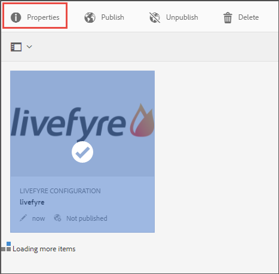

# Livefyre{#integrating-with-livefyre}과 통합

Livefyre의 업계 선도적인 큐레이션 기능을 AEM 6.5 인스턴스와 통합하여 소셜 네트워크에서 사이트에 중요한 UGC(사용자 생성 콘텐츠)를 신속하게 게시하는 방법을 살펴볼 수 있습니다.

## 시작하기 {#getting-started}

### AEM {#install-livefyre-package-for-aem}용 Livefyre 패키지 설치

AEM 6.5에는 사전 설치된 Livefyre 기능 패키지 1.2.6이 포함되어 있습니다. 이 패키지는 AEM Sites와의 제한된 Livefyre 통합만 포함되며 업데이트된 패키지를 설치하기 전에 제거해야 합니다. 최신 패키지를 사용하면 사이트, 자산, 상거래 등 AEM과 Livefyre의 완벽한 통합을 경험할 수 있습니다.

>[!NOTE]
>
>AEM-LF 패키지의 일부 기능은 SCF(소셜 구성 요소 프레임워크)에 따라 다릅니다. 커뮤니티가 아닌 사이트의 일부로 Livefyre 기능 팩을 사용하는 경우 웹 사이트의 작성자 클라이언트에 종속성으로 *cq.social.scf*&#x200B;을(를) 선언해야 합니다. LF 기능 팩을 커뮤니티 웹 사이트의 일부로 사용하는 경우 이 종속성은 이미 선언되어야 합니다.

1. AEM 홈 페이지에서 왼쪽 레일에 있는 **도구** 아이콘을 클릭합니다.
1. **배포 > 패키지**&#x200B;로 이동합니다.
1. 패키지 관리자에서 사전 설치된 Livefyre 기능 패키지가 나타날 때까지 스크롤한 다음 패키지 제목 **cq-social-livefyre-pkg-1.2.6.zip**&#x200B;을 클릭하여 옵션을 확장합니다.
1. **자세히 > 제거**&#x200B;를 클릭합니다.

   

1. [소프트웨어 배포](https://experience.adobe.com/#/downloads/content/software-distribution/en/aem.html)에서 Livefyre 패키지를 다운로드합니다.

1. 패키지 관리자에서 다운로드한 패키지를 설치합니다. AEM에서 소프트웨어 배포 및 패키지 사용에 대한 자세한 내용은 [패키지 사용 방법](/help/sites-administering/package-manager.md)을 참조하십시오.

   

   이제 Livefyre-AEM 패키지가 설치되어 있습니다. 통합 기능을 사용하기 전에 Livefyre를 사용하도록 AEM을 구성해야 합니다.

   기능 팩에 대한 자세한 내용 및 릴리스 노트는 [기능 팩](https://helpx.adobe.com/experience-manager/6-3/release-notes/feature-packs-release-notes.html)을 참조하십시오.

### Livefyre를 사용하도록 AEM 구성:구성 폴더 {#configure-aem-to-use-livefyre-create-a-configuration-folder} 만들기

1. AEM 홈 페이지에서 왼쪽 레일의 **도구** 아이콘을 클릭한 다음 **일반 > 구성 브라우저**&#x200B;로 이동합니다.
   * 자세한 내용은 [구성 브라우저](/help/sites-administering/configurations.md) 설명서를 참조하십시오.
1. **만들기**&#x200B;를 클릭하여 구성 만들기 대화 상자를 엽니다.
1. 구성의 이름을 지정하고 **클라우드 구성** 확인란을 선택합니다.

   이렇게 하면 **도구 > 배포 > Livefyre 구성** 아래에 제공된 이름의 폴더가 생성됩니다.

   

### Livefyre를 사용하도록 AEM 구성:Livefyre 구성 {#configure-aem-to-use-livefyre-create-a-livefyre-configuration} 만들기

조직의 Livefyre 라이선스 자격 증명을 사용하도록 AEM을 구성하여 Livefyre와 AEM 간에 통신을 허용합니다.

1. AEM 홈 페이지에서 왼쪽 레일의 **도구** 아이콘을 클릭한 다음 **배포 > Livefyre 구성**&#x200B;으로 이동합니다.
1. 새 Livefyre 구성을 만들 구성 폴더를 선택한 다음 **만들기**&#x200B;를 클릭합니다.

   

   >[!NOTE]
   >
   >폴더에 Livefyre 구성을 추가하려면 먼저 폴더에서 클라우드 구성을 활성화해야 합니다. 구성 폴더는 [구성 브라우저에서 만들고 관리됩니다.](/help/sites-administering/configurations.md)
   >
   >구성 이름은 만들 수 없습니다. 구성 이름은 해당 구성 요소가 있는 폴더의 경로로 참조됩니다. 폴더당 하나의 구성만 가질 수 있습니다.

1. 새로 만든 Livefyre 구성 카드를 선택한 다음 **속성**&#x200B;을 클릭합니다.

   

1. 조직의 Livefyre 자격 증명을 입력한 다음 **확인**&#x200B;을 클릭합니다.

   

   이 정보에 액세스하려면 Livefyre 스튜디오를 열고 **설정 > 통합 설정 > 자격 증명**&#x200B;으로 이동합니다.

   이제 AEM 인스턴스가 Livefyre를 사용하도록 구성되었으며 통합 기능을 사용할 수 있습니다.

### 단일 사인온 통합 사용자 지정 {#customize-single-sign-on-integration}

AEM용 Livefyre 패키지에는 AEM Communities 프로필과 Livefyre의 SSO 서비스 간에 즉시 통합되어 있습니다.

사용자가 AEM 사이트에 로그인하면 Livefyre 소셜 구성 요소에도 로그인됩니다. 로그아웃 사용자가 인증이 필요한 Livefyre 구성 요소 기능(예: 사진 업로드)을 사용하려고 하면 Livefyre 구성 요소가 사용자 인증을 시작합니다.

기본 인증 통합은 모든 사이트에 적합하지 않을 수 있습니다. 사이트 템플릿에서 인증 흐름을 가장 잘 맞추기 위해 기본 Livefyre 인증 위임을 무시하여 필요에 맞게 처리할 수 있습니다. 다음 단계를 따르십시오.

1. CRXDE Lite을 사용하여 */libs/social/integrations/livefyre/components/authorizableomponent/authclientlib*&#x200B;을 */apps/social/integrations/livefyre/components/authorizableappenent/authclientlib*&#x200B;로 복사합니다.
1. */apps/social/integrations/livefyre/components/authorizablecomponent/authclientlib/auth.js*&#x200B;을(를) 편집하고 저장하여 필요에 따라 Livefyre 인증 위임을 구현합니다.

   인증 위임 사용자 지정에 대한 자세한 내용은 [ID 통합](https://answers.livefyre.com/developers/identity-integration/)을 참조하십시오.

   AEM Clientlibs에 대한 자세한 내용은 [클라이언트측 라이브러리 사용](https://helpx.adobe.com/experience-manager/6-3/sites/developing/using/clientlibs.html)을 참조하십시오.

## AEM Sites {#use-livefyre-with-aem-sites}에 Livefyre 사용

### Livefyre 구성 요소를 페이지에 {#add-livefyre-components-to-a-page} 추가

Livefyre 구성 요소를 사이트 내의 페이지에 추가하기 전에 상위 페이지에서 Livefyre 클라우드 구성을 상속하거나 페이지에 직접 구성을 추가하여 페이지에 대해 Livefyre를 활성화해야 합니다. 사이트에 클라우드 서비스를 포함하는 방법은 구현을 참조하십시오.

페이지에 대해 Livefyre가 활성화되면 Livefyre 구성 요소를 허용하도록 컨테이너를 구성해야 합니다. 다른 구성 요소를 활성화하는 방법에 대한 자세한 내용은 [디자인 모드에서 구성 요소 구성을 참조하십시오.](https://helpx.adobe.com/experience-manager/6-3/sites/authoring/using/default-components-designmode.html)

>[!NOTE]
>
>Single Sign-on 통합 사용자 지정에서 인증이 구성될 때까지 게시하려면 인증이 필요한 앱이 작동하지 않습니다.

1. 디자인 모드의 **구성 요소** 사이드 패널에서 메뉴에서 **Livefyre**&#x200B;를 선택하여 목록을 사용 가능한 Livefyre 구성 요소로 제한합니다.

   

1. Livefyre 구성 요소를 선택하고 페이지에서 원하는 위치로 드래그합니다.
1. 새 Livefyre 앱을 만들지, 기존 앱을 포함할지 여부를 선택합니다.

   기존 앱을 포함하면 AEM에서 앱을 선택하라는 메시지가 표시됩니다. 새 앱을 만드는 경우 콘텐츠가 표시되기 전에 앱을 채워야 합니다. 페이지에 대해 Livefyre 클라우드 구성이 활성화되면 선택한 Livefyre 사이트와 네트워크에서 앱이 생성됩니다.

   구성 요소 삽입에 대한 자세한 내용은 [페이지 컨텐츠 편집](https://helpx.adobe.com/experience-manager/6-3/sites/authoring/using/editing-content.html)을 참조하십시오.

### AEM 페이지에 대한 Livefyre 구성 요소를 편집합니다.{#edit-a-livefyre-component-for-an-aem-page}

Livefyre 스튜디오에서만 Livefyre 구성 요소를 구성하고 편집할 수 있습니다. AEM에서:

1. 구성할 Livefyre 구성 요소를 클릭합니다.
1. **구성** 아이콘(공구 모양)을 클릭하여 구성 대화 상자를 엽니다.
1. **이 구성 요소를 편집하려면 Livefyre 스튜디오**&#x200B;로 이동하십시오.
1. Livefyre 스튜디오에서 앱을 편집합니다.

## AEM Assets {#use-livefyre-with-aem-assets}에 Livefyre 사용

### 권한 요청 및 AEM Assets {#request-rights-and-import-ugc-into-aem-assets}에 UGC 가져오기

UGC Importer를 사용하여 Twitter 및 Instagram 사용자 생성 콘텐츠(UGC)를 Livefyre 스튜디오에서 AEM Assets으로 가져올 수 있습니다. 가져올 내용을 선택한 후 가져오기를 완료하기 전에 콘텐츠에 대한 권한을 요청해야 합니다.

>[!NOTE]
>
>자산을 사용하여 UGC를 가져오기 전에 Livefyre Studio에서 소셜 계정 및 권한 요청 계정을 설정해야 합니다. [설정 참조:권한 요청](https://docs.adobe.com/content/help/en/livefyre/using/rights-requests/c-how-requesting-rights-works.html)을 참조하십시오.

AEM Assets으로 UGC를 가져오려면 다음을 수행하십시오.

1. AEM 홈 페이지에서 **자산 > 파일**&#x200B;으로 이동합니다.
1. **만들기**&#x200B;를 클릭한 다음 **UGC 가져오기**&#x200B;를 클릭합니다.

   

1. 컨텐츠 찾기:

   * Livefyre에서 UGC 라이브러리 탭을 클릭합니다. 필터 및 검색을 사용하여 UGC 라이브러리에서 컨텐츠를 찾습니다.
   * Twitter 또는 Instagram 탭을 클릭하여 Twitter 및 Instagram에서 검색 또는 필터를 사용하여 컨텐츠를 찾습니다.

1. 가져올 자산을 선택합니다. 선택한 자산은 자동으로 계산되어 **선택한** 탭 아래에 저장됩니다.
1. **옵션**:[ **** 선택] 탭을 클릭하고 가져올 선택한 UGC 컨텐츠를 검토합니다.
1. **다음**&#x200B;을 클릭합니다.

   

1. 권한 요청에 대해 각 자산에 대해 다음 옵션 중 하나를 선택합니다.

   Instagram의 경우:

   * **수동으로 요청** 권한을 부여하여 복사하여 Instagram을 통해 컨텐츠 소유자에게 수동으로 전송할 수 있는 메시지를 받을 수 있습니다.
   * **콘텐츠 권한 수동** 으로 속성을 지정하여 개별 자산에 대한 권한을 재정의할 수 있습니다.

   >[!NOTE]
   >
   >비비즈니스 사용자 계정의 컨텐츠 집계에 영향을 주는 업데이트로 인해 더 이상 사용자를 대신하여 댓글을 게시하거나 작성자의 답글을 자동으로 확인할 수 없습니다. [자세한](https://developers.facebook.com/blog/post/2018/04/04/facebook-api-platform-product-changes/) 내용을 보려면 여기를 클릭하십시오.

   

   Twitter의 경우:

   * **메시지** 자산에 대한 권한을 요청하는 콘텐츠 소유자에게 메시지를 보낼 수 있습니다.
   * **콘텐츠 권한 수동** 으로 속성을 지정하여 개별 자산에 대한 권한을 재정의할 수 있습니다.

1. **가져오기**&#x200B;를 클릭합니다. 

   Twitter 권한 요청을 보낸 경우 컨텐츠 소유자는 자신의 계정에 권한 요청 메시지를 보게 됩니다.

   

   >[!NOTE]
   >
   >Twitter는 동일한 계정에서 들어오는 동일한 요청에 대해 제한을 갖습니다. 두 개 이상의 자산을 가져올 때 플래그가 지정되지 않도록 메시지를 개별적으로 수정합니다.

1. 오른쪽 위 모서리에서 **완료**&#x200B;를 클릭하여 권한 요청 워크플로우를 완료합니다.

   Livefyre Studio에서 자산에 대해 보류 중인 권한 요청의 상태를 볼 수 있습니다. 콘텐츠가 권한 요청을 보류 중인 경우 권한이 부여될 때까지 자산이 AEM Assets에 표시되지 않습니다. 권한 요청이 승인되면 자산이 AEM Assets에 자동으로 표시됩니다.

   Instagram의 경우 컨텐츠 소유자의 응답을 추적하고 해당 컨텐츠에 대한 권한이 있는 경우 수동으로 권한을 부여해야 합니다.

## AEM Commerce {#use-livefyre-with-aem-commerce}에 Livefyre 사용

### AEM Commerce를 사용하여 제품 카탈로그를 Livefyre로 가져오기 {#import-product-catalogs-into-livefyre-with-aem-commerce}

AEM Commerce 사용자는 기존 제품 카탈로그를 Livefyre에 완벽하게 통합하여 Livefyre의 시각화 앱에서 사용자 참여를 높일 수 있습니다.

제품 카탈로그를 가져온 후 Livefyre 인스턴스에서 제품이 실시간으로 표시됩니다. AEM Commerce 제품 카탈로그에서 항목을 편집하거나 삭제하면 변경 내용이 Live View에서 자동으로 업데이트됩니다.

1. AEM 인스턴스에 최신 Livefyre for AEM 패키지가 설치되어 있는지 확인합니다.
1. AEM 홈 페이지에서 **AEM Commerce**&#x200B;로 이동합니다.
1. 새 컬렉션을 만들거나 기존 컬렉션을 사용합니다.
1. 컬렉션 위로 마우스를 가져간 다음 **컬렉션 속성**(연필 아이콘)을 클릭합니다.
1. **Livefyre**&#x200B;에 동기화를 선택합니다.
1. 이 컬렉션을 AEM의 특정 페이지에 연결하려면 **Livefyre 페이지 접두사**&#x200B;를 입력합니다.

   페이지 접두사는 제품 페이지 검색이 시작되는 환경에서 루트 경로를 정의합니다. Livefyre는 연결된 해당 제품이 있는 첫 번째 페이지를 선택합니다. 다른 제품에 대해 다른 페이지를 가져오려면 여러 개의 컬렉션이 필요합니다.

## Livefyre 앱에 대한 AEM 지원 매트릭스 {#aem-support-matrix-for-livefyre-apps}

| Livefyre 앱 | AEM 6.1 | AEM 6.2 | AEM 6.3 | AEM 6.4 |
|---|---|---|---|---|
| 회전판 | X | X | X | X |
| 채팅 | X | X | X | X |
| 댓글 | X | X | X | X |
| 필름스트립 |  | X | X | X |
| LiveBlog | X | X | X | X |
| 맵 | X | X | X | X |
| 미디어 벽 | X | X | X | X |
| 모자이크 | X | X | X | X |
| 투표 |  | X | X | X |
| 검토 |  | X | X | X |
| 단일 카드 | X | X | X | X |
| Storify 2 |  | X | X | X |
| 트렌드 |  | X | X | X |
| 업로드 버튼 |  | X | X | X |

