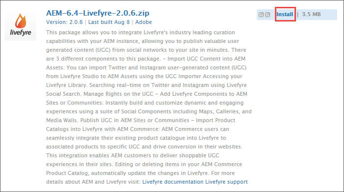

# Livefyre와 통합하기{#integrating-with-livefyre}

Livefyre의 업계 선도적인 큐레이션 기능을 AEM 6.5 인스턴스와 통합하여 소셜 네트워크에서 몇 분 안에 사이트에 중요한 사용자 생성 콘텐츠(UGC)를 게시하는 방법을 알아봅니다.

## 시작하기 {#getting-started}

### AEM용 Livefyre 패키지 설치 {#install-livefyre-package-for-aem}

AEM 6.5에는 Livefyre 기능 패키지 1.2.6이 사전 설치되어 있습니다. 이 패키지에는 AEM Sites과의 제한된 Livefyre 통합만 포함되며 업데이트된 패키지를 설치하기 전에 제거해야 합니다. 최신 패키지를 사용하면 Sites, Assets 및 Commerce 등 AEM과 Livefyre의 전체 통합을 경험할 수 있습니다.

>[!NOTE]
>
>AEM-LF 패키지의 일부 기능은 SCF(소셜 구성 요소 프레임워크)에 따라 다릅니다. Livefyre 기능 팩을 비커뮤니티 사이트의 일부로 사용하는 경우 선언해야 합니다 *cq.social.scf* 웹 사이트의 작성자 clientlibs에 대한 종속으로서. LF 기능 팩을 커뮤니티 웹 사이트의 일부로 사용하는 경우 이 종속성은 이미 선언되어야 합니다.

1. AEM 홈페이지에서 **도구** 아이콘을 클릭합니다.
1. 다음으로 이동 **배포 > 패키지**.
1. 패키지 관리자에서 사전 설치된 Livefyre 기능 패키지가 표시될 때까지 스크롤한 다음 패키지 제목을 클릭합니다 **cq-social-livefyre-pkg-1.2.6.zip** 옵션을 확장하려면 다음을 수행하십시오.
1. 클릭 **자세히 > 제거**.

   

1. Livefyre 패키지 다운로드 위치 [소프트웨어 배포](https://experience.adobe.com/#/downloads/content/software-distribution/en/aem.html).

1. 패키지 관리자에서 다운로드한 패키지를 설치합니다. 자세한 내용은 [패키지 작업 방법](/help/sites-administering/package-manager.md) AEM에서 소프트웨어 배포 및 패키지 사용에 대한 자세한 정보

   

   이제 Livefyre-AEM 패키지가 설치되었습니다. 통합 기능을 사용하기 전에 Livefyre를 사용하도록 AEM을 구성해야 합니다.

   기능 팩에 대한 자세한 내용 및 릴리스 정보는 [기능 팩](https://experienceleague.adobe.com/docs/experience-manager-65/release-notes/home.html).

### Livefyre를 사용하도록 AEM 구성: 구성 폴더 만들기 {#configure-aem-to-use-livefyre-create-a-configuration-folder}

1. AEM 홈페이지에서 **도구** 왼쪽 레일의 아이콘을 클릭한 다음 **일반 > 구성 브라우저**.
   * 자세한 내용은 [구성 브라우저](/help/sites-administering/configurations.md) 설명서 를 참조하십시오.
1. 클릭 **만들기** 구성 만들기 대화 상자를 엽니다.
1. 구성에 이름을 지정하고 을(를) 확인합니다. **클라우드 구성** 확인란을 선택합니다.

   이 옵션을 선택하면 **도구 > 배포 > Livefyre 구성** 사용할 수 있습니다.

   

### Livefyre를 사용하도록 AEM 구성: Livefyre 구성 만들기 {#configure-aem-to-use-livefyre-create-a-livefyre-configuration}

조직의 Livefyre 라이선스 자격 증명을 사용하도록 AEM을 구성하여 Livefyre와 AEM 간에 통신할 수 있습니다.

1. AEM 홈페이지에서 **도구** 왼쪽 레일의 아이콘을 클릭한 다음 **배포 > Livefyre 구성**.
1. 새 Livefyre 구성을 만들 구성 폴더를 선택한 다음 를 클릭합니다 **만들기**.

   

   >[!NOTE]
   >
   >폴더에 Livefyre 구성을 추가하기 전에 폴더에는 해당 속성에서 클라우드 구성이 활성화되어 있어야 합니다. 구성 폴더는 [구성 브라우저.](/help/sites-administering/configurations.md)
   >
   >구성에 대한 이름을 만들 수 없습니다. 이 이름은 구성 폴더가 있는 폴더의 경로에 의해 참조됩니다. 폴더당 하나의 구성만 가질 수 있습니다.

1. 새로 만든 Livefyre 구성 카드를 선택한 다음 를 클릭합니다 **속성**.

   

1. 조직의 Livefyre 자격 증명을 입력하고 **확인**.

   

   이 정보에 액세스하려면 Livefyre Studio를 열고 다음 위치로 이동하십시오 **설정 > 통합 설정 > 자격 증명**.

   이제 AEM 인스턴스가 Livefyre를 사용하도록 구성되었으며 통합 기능을 사용할 수 있습니다.

### 단일 사인온 통합 사용자 지정 {#customize-single-sign-on-integration}

Livefyre for AEM 패키지에는 AEM Communities 프로필과 Livefyre의 SSO 서비스 간에 기본 통합이 포함되어 있습니다.

사용자가 AEM 사이트에 로그인하면 Livefyre 소셜 구성 요소에도 기록됩니다. 로그아웃한 사용자가 인증이 필요한 Livefyre 구성 요소 기능(예: 사진 업로드)을 사용하려고 하면 Livefyre 구성 요소가 사용자 인증을 시작합니다.

모든 사이트에 기본 인증 통합이 완벽하지는 않을 수 있습니다. 사이트 템플릿의 인증 흐름과 가장 잘 일치하도록 기본 Livefyre 인증 위임을 무시해도 됩니다. 다음 단계를 사용합니다.

1. CRXDE Lite 사용, 복사 */libs/social/integrations/livefyre/components/authorizablecomponent/authclientlib* to */apps/social/integrations/livefyre/components/authorizableconent/authclientlib*.
1. 편집 및 저장 */apps/social/integrations/livefyre/components/authorizablecomponent/authclientlib/auth.js* 요구 사항을 충족하는 Livefyre 인증 위임을 구현하려면 다음을 수행하십시오.

   인증 위임 사용자 지정에 대한 자세한 내용은 [ID 통합](https://answers.livefyre.com/developers/identity-integration/).

   AEM Clientlibs에 대한 자세한 내용은 [클라이언트측 라이브러리 사용](https://experienceleague.adobe.com/docs/experience-manager-65/developing/introduction/clientlibs.html).

## AEM Sites과 Livefyre 사용 {#use-livefyre-with-aem-sites}

### 페이지에 Livefyre 구성 요소 추가 {#add-livefyre-components-to-a-page}

Livefyre 구성 요소를 Sites 내의 페이지에 추가하기 전에 상위 페이지에서 Livefyre 클라우드 구성을 상속하거나 구성을 페이지에 직접 추가하여 페이지에 대해 Livefyre를 활성화해야 합니다. 사이트에 클라우드 서비스를 포함하는 방법이 필요하면 구현 을 참조하십시오.

페이지에 대해 Livefyre가 활성화되면 Livefyre 구성 요소를 허용하도록 컨테이너를 구성해야 합니다. 자세한 내용은 [디자인 모드에서 구성 요소 구성](https://experienceleague.adobe.com/docs/experience-manager-65/authoring/siteandpage/default-components-designmode.html) 를 참조하십시오.

>[!NOTE]
>
>Single Sign-on 통합 사용자 지정에 인증이 구성되어 있을 때까지 게시하기 위해 인증이 필요한 앱은 작동하지 않습니다.

1. 에서 **구성 요소** 디자인 모드에서 사이드 패널 을 선택합니다. **Livefyre** 목록을 사용 가능한 Livefyre 구성 요소로 제한하려면 메뉴에서 를 선택합니다.

   

1. Livefyre 구성 요소를 선택하고 페이지에서 위치로 드래그합니다.
1. 새 Livefyre 앱을 만들지 기존 앱을 포함할지 선택합니다.

   기존 앱을 포함하는 경우 AEM에서 앱을 선택하라는 메시지를 표시합니다. 새 앱을 만들 경우, 컨텐츠가 표시되기 전에 앱을 채워야 합니다. 페이지에 대해 Livefyre 클라우드 구성이 활성화되면 선택한 Livefyre 사이트 및 네트워크에 앱이 만들어집니다.

   구성 요소 삽입에 대한 자세한 내용은 [페이지 컨텐츠 편집](https://experienceleague.adobe.com/docs/experience-manager-65/authoring/authoring/editing-content.html).

### AEM 페이지에 대한 Livefyre 구성 요소 편집. {#edit-a-livefyre-component-for-an-aem-page}

Livefyre Studio에서 Livefyre 구성 요소만 구성하고 편집할 수 있습니다. AEM에서:

1. 구성할 Livefyre 구성 요소를 클릭합니다.
1. 을(를) 클릭합니다. **구성** 아이콘(공구모양)을 클릭하여 구성 대화 상자를 엽니다.
1. 클릭 **이 구성 요소를 편집하려면 Livefyre Studio로 이동합니다**.
1. Livefyre Studio에서 앱을 편집합니다.

## AEM Assets과 Livefyre 사용 {#use-livefyre-with-aem-assets}

### 권한 요청 및 AEM Assets으로 UGC 가져오기 {#request-rights-and-import-ugc-into-aem-assets}

UGC 가져오기를 사용하여 Livefyre Studio에서 AEM Assets으로 Twitter 및 Instagram 사용자 생성 콘텐츠(UGC)를 가져올 수 있습니다. 가져올 컨텐츠를 선택한 후 가져오기를 완료하기 전에 콘텐츠에 대한 권한을 요청해야 합니다.

>[!NOTE]
>
>Assets를 사용하여 UGC를 가져오기 전에 Livefyre Studio에서 Social 계정 및 권한 요청 계정을 설정해야 합니다. 자세한 내용은 [설정: 권한 요청](https://experienceleague.adobe.com/docs/livefyre/using/rights-requests/c-how-requesting-rights-works.html) 추가 정보.

UGC를 AEM Assets에 가져오려면 다음을 수행하십시오.

1. AEM 홈페이지에서 **자산 > 파일**.
1. 클릭 **만들기**&#x200B;를 클릭한 다음 **UGC 가져오기**

   

1. 컨텐츠 찾기:

   * Livefyre에서 UGC 라이브러리 탭을 클릭합니다. 필터 및 검색을 사용하여 UGC 라이브러리에서 콘텐츠를 찾습니다.
   * twitter 및 Instagram에서 Twitter 또는 Instagram 탭을 클릭하여 선택합니다. 검색 또는 필터를 사용하여 콘텐츠를 찾습니다.

1. 가져올 자산을 선택합니다. 선택하는 자산은 자동으로 계산되고 아래에 저장됩니다 **선택됨** 탭.
1. **선택 사항입니다**: 을(를) 클릭합니다. **선택됨** 가져올 선택한 UGC 컨텐츠를 탭 및 검토합니다.
1. **다음**&#x200B;을 클릭합니다.

   

1. 권한 요청에 대해 각 자산에 대해 다음 옵션 중 하나를 선택합니다.

   instagram의 경우:

   * **수동으로 권한 요청** instagram을 통해 복사하여 붙여넣고 컨텐츠 소유자에게 수동으로 전송할 수 있는 메시지를 받으려면 다음을 수행하십시오.
   * **수동으로 속성 컨텐츠 권한** 개별 자산에 대한 권한을 재정의합니다.

   >[!NOTE]
   >
   >비비즈니스 사용자 계정의 콘텐츠 집계에 영향을 주는 업데이트로 인해 Adobe에서는 더 이상 사용자를 대신하여 댓글을 게시하거나 작성자의 답글을 자동으로 확인할 수 없습니다. [자세한 내용을 보려면 여기를 클릭하십시오.](https://developers.facebook.com/blog/post/2018/04/04/facebook-api-platform-product-changes/).

   

   twitter:

   * **메시지 작성자** 자산에 대한 권한을 요청하는 컨텐츠 소유자에게 메시지를 보내려면
   * **수동으로 속성 컨텐츠 권한** 개별 자산에 대한 권한을 재정의합니다.

1. **가져오기**&#x200B;를 클릭합니다. 

   twitter 권한 요청을 보낸 경우 콘텐츠 소유자는 해당 계정에 권한 요청 메시지를 보게 됩니다.

   

   >[!NOTE]
   >
   >Twitter은 동일한 계정에서 발생하는 동일한 요청에 대해 제한을 갖습니다. 두 개 이상의 자산을 가져올 때 플래그가 지정되지 않도록 메시지를 개별적으로 수정합니다.

1. 클릭 **완료** 오른쪽 상단 모서리에서 권한 요청 워크플로우를 완료합니다.

   Livefyre Studio에서 자산에 대한 보류 중인 권한 요청 상태를 볼 수 있습니다. 컨텐츠가 권한 요청을 보류 중인 경우 권한이 부여될 때까지 자산이 AEM Assets에 표시되지 않습니다. 권한 요청이 부여되면 자산이 AEM Assets에 자동으로 표시됩니다.

   instagram의 경우 컨텐츠 소유자의 응답을 추적하고 해당 컨텐츠에 대한 권한이 제공된 경우 수동으로 권한을 부여해야 합니다.

## Livefyre와 AEM Commerce 사용 {#use-livefyre-with-aem-commerce}

### AEM Commerce를 사용하여 Livefyre에 제품 카탈로그 가져오기 {#import-product-catalogs-into-livefyre-with-aem-commerce}

AEM Commerce 사용자는 기존 제품 카탈로그를 Livefyre에 원활하게 통합하여 Livefyre의 시각화 앱에서 사용자 참여를 유도할 수 있습니다.

제품 카탈로그를 가져오면 제품이 Livefyre 인스턴스에 실시간으로 표시됩니다. AEM Commerce 제품 카탈로그에서 항목을 편집하거나 삭제하면 변경 사항이 Livefyre에서 자동으로 업데이트됩니다.

1. AEM 인스턴스에 최신 Livefyre for AEM 패키지가 설치되어 있는지 확인합니다.
1. AEM 홈페이지에서 **AEM Commerce**.
1. 새 컬렉션을 만들거나 기존 컬렉션을 사용합니다.
1. 마우스를 컬렉션 위로 가져간 다음 를 클릭합니다. **컬렉션 속성** (연필 아이콘).
1. 확인 **Livefyre에 동기화**.
1. 채우기 **Livefyre 페이지 접두사** 이 컬렉션을 AEM의 특정 페이지에 연결하려면

   페이지 접두사는 제품 페이지 검색이 시작되는 환경의 루트 경로를 정의합니다. Livefyre에서 연결된 해당 제품이 있는 첫 번째 페이지를 선택합니다. 다른 제품에 대해 다른 페이지를 가져오려면 여러 개의 컬렉션이 필요합니다.

## Livefyre 앱에 대한 AEM 지원 매트릭스 {#aem-support-matrix-for-livefyre-apps}

| Livefyre 앱 | AEM 6.1 | AEM 6.2 | AEM 6.3 | AEM 6.4 |
|---|---|---|---|---|
| 슬라이드 | X | X | X | X |
| 채팅 | X | X | X | X |
| 댓글 | X | X | X | X |
| 필름 스트립 |  | X | X | X |
| LiveBlog | X | X | X | X |
| 맵 | X | X | X | X |
| 미디어 월 | X | X | X | X |
| 모자이크 | X | X | X | X |
| 투표 |  | X | X | X |
| 검토 |  | X | X | X |
| 단일 카드 | X | X | X | X |
| Storify 2 |  | X | X | X |
| 트렌드 |  | X | X | X |
| 업로드 버튼 |  | X | X | X |
