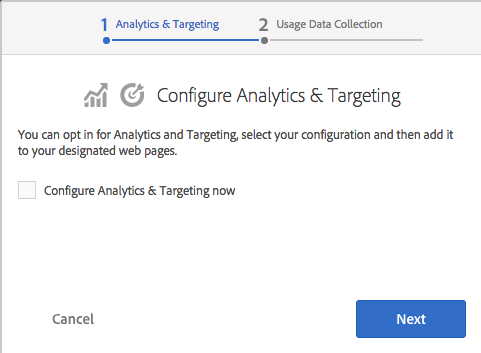

# Adobe Marketing Cloud와 통합{#integrating-with-the-adobe-marketing-cloud}

Adobe [Marketing Cloud에는](https://www.adobe.com/solutions/digital-marketing.html)강력한 웹 분석 및 웹 사이트 최적화 제품이 포함되어 있으므로 성공적인 온라인 캠페인을 전개할 수 있는 실행 가능한 실시간 데이터와 통찰력을 제공합니다. 온라인 비즈니스 최적화를 위한 통합 개방형 플랫폼을 제공합니다. Cloud는 고객 확보, 전환 및 유지 노력뿐만 아니라 컨텐츠 제작 및 배포를 최적화하기 위한 고객 통찰력을 수집하고 제공하는 통합 애플리케이션으로 구성되어 있습니다.

Adobe Experience Manager(AEM)를 사용하면 다음 Adobe Marketing Cloud 제품과 원활하게 통합할 수 있습니다.

* Adobe Analytics는 마케터에게 온라인 전략 및 마케팅 이니셔티브에 대한 실행 가능한 실시간 인텔리전스를 제공합니다.
* Adobe Target을 사용하면 마케터는 고객과 연관성 높은 온라인 컨텐츠를 지속적으로 제작할 수 있습니다. 전환율 향상
* Adobe Scene7은 호스팅 환경에서 미디어 관리를 자동화하고 웹 퍼블리싱을 간소화하며 웹 경험을 향상시켰습니다.
* Adobe 다이내믹 태그 관리는 마케터에게 Adobe 및 타사 태그를 제한 없이 빠르고 손쉽게 관리할 수 있는 직관적인 툴을 제공합니다.
* Adobe Search&amp;Promote를 통해 마케터는 자신의 사이트에서 검색 결과를 제어하고 최적화할 수 있습니다.
* Adobe Campaign을 사용하면 Adobe Experience Manager에서 바로 이메일 전달 콘텐츠를 관리할 수 있습니다.

또한 AEM을 [Creative Cloud](/help/assets/aem-cc-folder-sharing-best-practices.md) 및 [타사 서비스와](/help/sites-administering/third-party-services.md)통합할 수 있습니다.

## Adobe Analytics와 통합 {#integrating-with-adobe-analytics}

[Adobe](https://www.omniture.com/en/products/analytics/sitecatalyst) Analytics는 디지털 마케터에게 다양한 마케팅 채널에서 모든 온라인 이니셔티브의 통합 데이터를 측정, 분석 및 최적화할 수 있는 업계 선도적인 솔루션입니다. 마케터는 디지털 전략 및 마케팅 이니셔티브에 대한 실행 가능한 실시간 웹 분석 인텔리전스를 제공합니다. Adobe Analytics를 사용하면 마케터는 웹 사이트를 통해 가장 수익성이 높은 경로를 신속하게 식별하고, 트래픽을 세분화하여 고부가가치 웹 방문자를 식별하고, 방문자가 사이트에서 이동하는 위치를 확인하고, 온라인 마케팅 캠페인에 대한 중요한 성공 지표를 식별할 수 있습니다.

Adobe Analytics를 사용하여 사이트의 데이터를 분석할 수 있습니다.

Adobe Analytics와 통합하면 다음을 수행할 수 있습니다.

* Analytics 사용자 추적을 활성화합니다.
* 실행 모드(예: 작성자, 게시)를 다른 보고서 세트에 매핑합니다.
* 클라이언트 컨텍스트 변수를 전환 변수 또는 트래픽 속성으로 제출합니다.
* 사전 정의된 변수 매핑을 사용합니다.
* 한 번에 전체 사이트 섹션을 구성합니다.
* 사용자 정의 이벤트를 추적합니다.

AEM과 Analytics 통합에 대한 자세한 내용은 Adobe [Analytics와 통합을 참조하십시오](/help/sites-administering/adobeanalytics.md).

옵트인 마법사를 [사용하여](/help/sites-administering/opt-in.md) 쉽게 통합을 수행할 수도 있습니다.

## Adobe Target과 통합 {#integrating-with-adobe-target}

[Adobe](https://www.omniture.com/en/products/conversion/test-and-target) Target은 마케터가 온라인 테스트를 디자인 및 실행하고, 행동에 따라 고객 세그먼트를 생성하고, 컨텐츠 및 온라인 경험 타깃팅을 자동화하는 데 사용됩니다.

오늘날 온라인 소비자는 끊임없이 변화하는 요구 사항을 충족하고 다양한 사이트 및 컨텐츠 소스를 통해 개인화된 콘텐츠를 기대합니다. 온라인 고객의 참여를 유도하려면 온라인 마케터가 고객과 연관성 있고 매력적인 제안 및 컨텐츠를 신속하게 파악하는 것이 중요합니다. 이러한 지식을 바탕으로 마케터는 사이트를 지속적으로 발전시키고 다양한 고객에게 적합한 컨텐츠를 타깃팅할 수 있는 기능이 필요합니다.

[Adobe Target과](/help/sites-administering/target.md) 통합에서는 사이트를 Target과 통합하는 방법을 설명합니다.

옵트인 마법사를 [사용하여](/help/sites-administering/opt-in.md) 쉽게 통합을 수행할 수도 있습니다.

## Analytics 및 Target에 선택 {#opting-in-to-analytics-and-target}

AEM에서는 Adobe Analytics 및 Adobe Target과 통합하기 위한 간단한 옵트인 절차를 제공합니다. 관리자로 로그인하고 프로젝트 콘솔을 방문하면 옵트인 마법사가 표시됩니다.

Analytics 및/또는 Target과의 통합을 선택하여 페이지 추적 및 분석 기능, 개인화 기능을 사용할 수 있도록 합니다. 옵트인하면 사용자 계정 정보를 제공하고 추적되는 페이지를 지정해야 합니다.

자세한 내용은 Adobe Analytics 및 [Adobe Target에 선택을 참조하십시오.](/help/sites-administering/opt-in.md)

## Scene7과 통합 {#integrating-with-scene}

[Adobe Scene7은](https://www.adobe.com/products/scene7.html) 다이내믹한 마케팅 자산을 게시, 관리, 향상 및 전달하는 호스팅 솔루션으로, 웹, 모바일, 이메일, 소셜 미디어, 인터넷에 연결된 디스플레이 및 인쇄에 대한 풍부한 시각적 머천다이징을 제공합니다.

AEM에서 디지털 자산을 AEM에서 Scene7으로 직접 게시할 수 있으며 Scene7에서 AEM으로 디지털 자산을 게시할 수 있습니다.

또한 다양한 뷰어에서 Scene7에 게시된 AEM 자산을 볼 수 있습니다.

* 기본 확대/축소
* DHTML 플라이아웃 확대/축소
* Flash 플라이아웃 확대/축소
* 비디오
* Flash 템플릿
* 이미지 템플릿

AEM과 Scene7의 통합 방법에 대한 자세한 내용은 Scene7 [과 통합 설명서를](/help/sites-administering/scene7.md)참조하십시오.

## Adobe 다이내믹 태그 관리와의 통합 {#integrating-with-adobe-dynamic-tag-management}

[Adobe 다이내믹 태그](https://www.adobe.com/solutions/digital-marketing/dynamic-tag-management.html) 관리는 마케터에게 Adobe 및 타사 태그를 제한 없이 빠르고 손쉽게 관리할 수 있는 직관적인 툴을 제공합니다. IT 리소스에 대한 의존도를 줄이면서 온라인에서 거의 모든 것을 보다 효과적으로 최적화할 수 있는 유연성과 제어 기능을 제공합니다.

[다이내믹 태그 관리](/help/sites-administering/dtm.md) 웹 속성을 사용하여 AEM 사이트를 추적할 수 있도록 Adobe 다이내믹 태그 관리를 AEM과 통합합니다.

## Adobe Audience Manager와 통합 {#integrating-with-adobe-audience-manager}

AEM 6.3에서 Audience Manager 통합이 제거되었습니다.

## Search&amp;Promote와 통합 {#integrating-with-search-promote}

[Adobe Search&amp;Promote](https://www.omniture.com/en/products/conversion/search-and-promote) 를 통해 마케터는 방문자가 웹 및 모바일 사이트에서 관련 제품과 컨텐츠를 검색하고 비교 및 선택하는 방법을 최적화할 수 있습니다. 기업은 비즈니스 목표 및 방문자 의도를 기반으로 우선 순위 항목을 손쉽게 홍보할 수 있을 뿐만 아니라 KPI 기반 트리거 또는 지표를 통해 상품 판매 및 홍보 활동을 자동화할 수 있습니다.

Adobe Search&amp;Promote는 안정적이고 확장 가능한 호스팅 사이트 검색 애플리케이션으로, 소매 매장, 뉴스 사이트 등 방문자가 많이 방문하는 온라인 비즈니스를 위해 수백만 페이지 또는 제품으로 확장할 수 있습니다. 탁월한 수준의 마케터 제어 기능과 지표 기반의 연관성을 제공합니다.

AEM 및 Search&amp;Promote 통합에 대한 자세한 내용은 Adobe Search&amp; [Promote와 통합을 참조하십시오](/help/sites-administering/search-and-promote.md).

## Adobe Campaign과 통합 {#integrating-with-adobe-campaign}

[Adobe Campaign](https://www.adobe.com/solutions/campaign-management.html) 을 사용하면 Adobe Experience Manager에서 바로 이메일 전달 콘텐츠를 관리할 수 있습니다.

AEM과 Adobe Campaign의 통합 방법에 대한 자세한 내용은 Adobe [Campaign과 통합을 참조하십시오](/help/sites-administering/campaignstandard.md).

## Livefyre와 통합 {#integrating-with-livefyre}

AEM 및 Livefyre에 대한 자세한 내용:

* [Livefyre 시작하기](https://answers.livefyre.com/developers/getting-started)

* [Livefyre 및 AEM](https://answers.livefyre.com/product/livefyre-for-adobe-experience-manager-aem/livefyre-for-adobe-experience-manager/)

