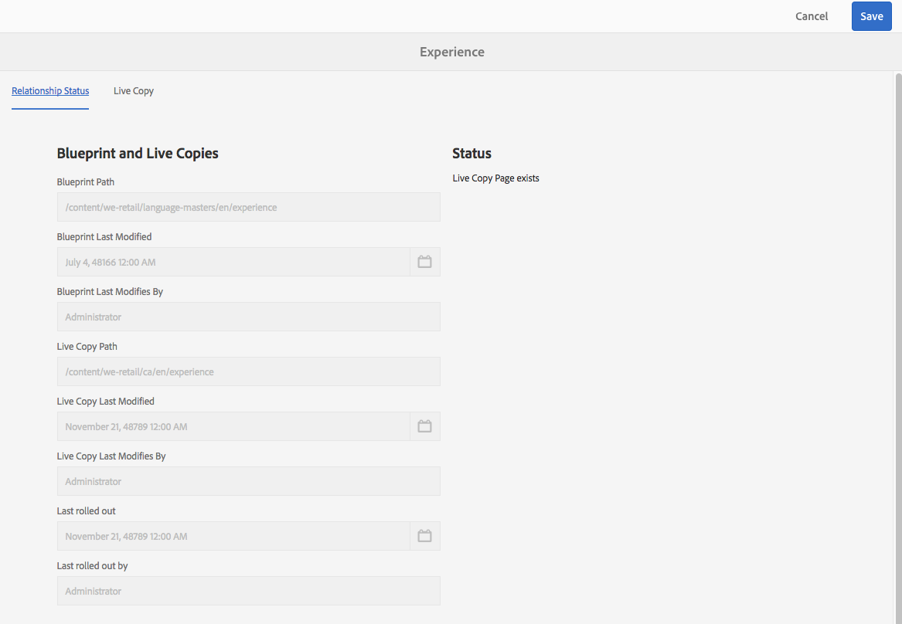

# Live Copy 개요 콘솔{#live-copy-overview-console}

**Live Copy 개요**&#x200B;를 통해 다음을 수행할 수 있습니다.

* 사이트 간 상속 보기/관리:

   * 블루프린트 트리 및 해당 라이브 카피 구조를 상속 상태와 함께 조회합니다.
   * 상속 상태를 변경합니다(예: 일시 중단, 다시 시작).
   * 블루프린트 및 라이브 카피 속성 보기

* 롤아웃 작업 수행

## Live Copy 개요 열기 {#opening-the-live-copy-overview}

다음 위치에서 Live Copy 개요를 열 수 있습니다.

* [블루프린트 페이지의 참조 측면 패널(Sites 콘솔)](#opening-live-copy-overview-references-for-a-blueprint-page)
* [블루프린트 페이지 속성](#opening-live-copy-overview-properties-of-a-blueprint-page)

### 라이브 카피 개요 열기 - 블루프린트 페이지에 대한 참조 {#opening-live-copy-overview-references-for-a-blueprint-page}

**사이트** 콘솔의 **참조** 측면 패널에서 **Live Copy 개요**&#x200B;를 열 수 있습니다.

1. **사이트** 콘솔에서 [블루프린트 페이지를 검색한 다음 선택합니다](/help/sites-authoring/basic-handling.md#viewing-and-selecting-resources).
1. **[참조](/help/sites-authoring/basic-handling.md#references)** 패널을 열고 **라이브 카피**&#x200B;를 선택합니다.

   

   >[!NOTE]
   >
   >먼저 참조 를 연 다음 블루프린트를 선택할 수도 있습니다.

1. **라이브 카피 개요**&#x200B;를 선택하여 선택한 블루프린트와 관련된 모든 라이브 카피의 개요를 표시하고 사용합니다.
1. 종료하고 **사이트** 콘솔로 돌아가려면 **닫기**&#x200B;를 사용합니다.

### 라이브 카피 개요 열기 - 블루프린트 페이지 속성 {#opening-live-copy-overview-properties-of-a-blueprint-page}

블루프린트 페이지 속성을 볼 때 **Live Copy 개요**&#x200B;를 열 수 있습니다.

1. 적절한 블루프린트 페이지에 대한 **속성**&#x200B;을 엽니다.
1. **블루프린트** 탭을 열면 **Live Copy 개요** 옵션이 상단 도구 모음에 표시됩니다.

   

1. **라이브 카피 개요**&#x200B;를 선택하여 현재 블루프린트와 관련된 모든 라이브 카피의 개요를 표시하고 사용합니다.

1. 종료하고 **사이트** 콘솔로 돌아가려면 **닫기**&#x200B;를 사용합니다.

## Live Copy 개요 사용 {#using-the-live-copy-overview}

**라이브 카피 개요**&#x200B;를 사용하여 라이브 카피에서 작업을 수행할 수도 있습니다.

1. **Live Copy 개요**&#x200B;를 엽니다.
1. 필요한 블루프린트 또는 라이브 카피 페이지를 선택합니다. 사용 가능한 작업을 표시하도록 도구 모음이 업데이트됩니다. 사용 가능한 [작업](/help/sites-administering/msm.md#terms-used)은(는) [블루프린트](#actions-for-a-blueprint-page) 또는 [라이브 카피](#actions-for-a-live-copy-page) 페이지 선택 여부에 따라 다릅니다.

### 블루프린트 페이지에 대한 작업 {#actions-for-a-blueprint-page}

블루프린트 페이지를 선택하면 다음과 같은 작업을 사용할 수 있습니다.

* 편집

   * 편집할 블루프린트 페이지를 엽니다.

* [롤아웃](/help/sites-administering/msm.md#rollout-and-synchronize)

   * 롤아웃을 수행하여 소스에서 라이브 카피로 변경 내용을 푸시합니다.

### Live Copy 페이지에 대한 작업 {#actions-for-a-live-copy-page}

라이브 카피 페이지를 선택하면 다음 작업을 사용할 수 있습니다.

* 편집

   * 편집할 라이브 카피 페이지를 엽니다.

* [관계 상태](#relationship-status)

   * 상태 및 상속에 대한 정보를 봅니다.

* [동기화](/help/sites-administering/msm.md#rollout-and-synchronize)

   * 라이브 카피를 동기화하여 소스에서 라이브 카피로 변경 내용을 가져올 수 있습니다.

* [재설정](/help/sites-administering/msm-livecopy.md#resetting-a-live-copy-page)

   * 라이브 카피 페이지를 재설정하여 모든 상속 취소를 제거하고 페이지를 소스 페이지와 동일한 상태로 되돌립니다.

* [일시 중단](/help/sites-administering/msm.md#suspending-and-cancelling-inheritance-and-synchronization)

   * 라이브 카피와 블루프린트 페이지 간의 라이브 관계를 일시적으로 비활성화합니다.

* [다시 시작](/help/sites-administering/msm-livecopy.md#resuming-inheritance-for-a-page)

   * 다시 시작을 사용하면 일시 중단된 관계를 복원할 수 있습니다.

* [분리](/help/sites-administering/msm.md#detaching-a-live-copy)

   * 라이브 카피와 블루프린트 페이지 간의 라이브 관계를 영구적으로 제거합니다.

## 관계 상태 {#relationship-status}

**관계 상태** 콘솔에는 다양한 기능을 제공하는 두 개의 탭이 있습니다.

* [관계 상태 정보](#relationship-status-information)
* [Live Copy 정보](#live-copy-information)

### 관계 상태 정보 {#relationship-status-information}

이 탭은 블루프린트와 라이브 카피 간의 관계 상태에 대한 자세한 정보를 제공합니다.

### Live Copy 정보 {#live-copy-information}

이 탭에서는 라이브 카피 구성을 보고 편집할 수 있습니다.

