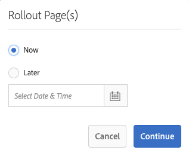
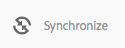
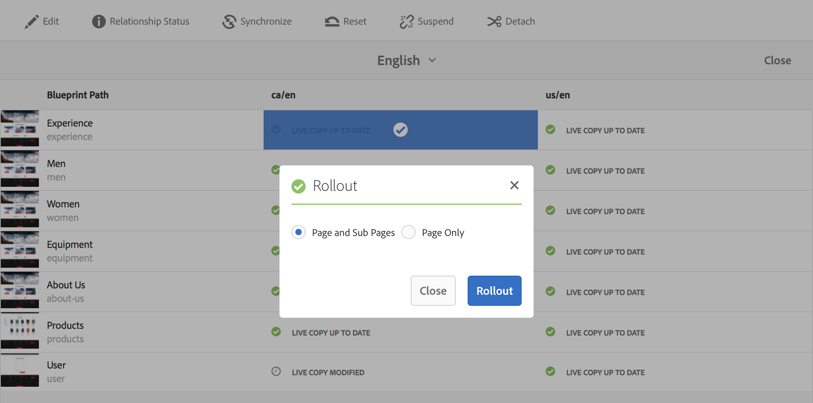
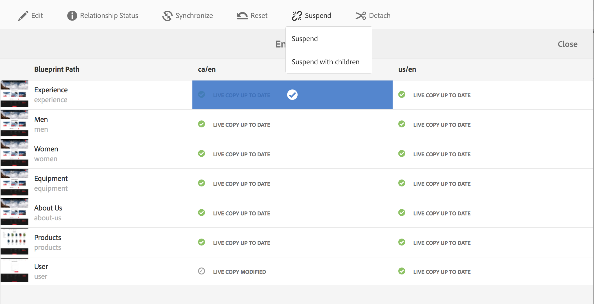
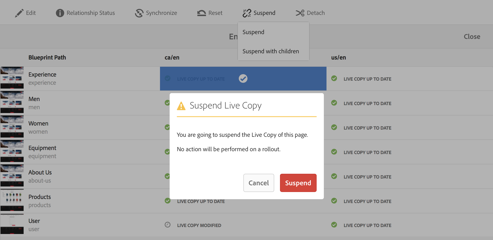
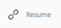
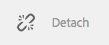

# Live Copy 만들기 및 동기화{#creating-and-synchronizing-live-copies}

페이지 또는 블루프린트 구성에서 Live Copy를 만든 다음 상속과 동기화를 관리할 수 있습니다.

## 블루프린트 구성 관리 {#managing-blueprint-configurations}

블루프린트 구성은 하나 이상의 Live Copy 페이지의 소스로 사용할 기존 웹 사이트를 식별합니다.

>[!NOTE]
>
>블루프린트 구성을 사용하면 컨텐츠 변경 사항을 Live Copy에 푸시할 수 있습니다. [Live Copy - 소스, Blueprint 및 Blueprint 구성](/help/sites-administering/msm.md#source-blueprints-and-blueprint-configurations)을 참조하십시오.

블루프린트 구성을 만들 때 블루프린트의 내부 구조를 정의하는 템플릿을 선택합니다. 기본 블루프린트 템플릿은 소스 웹 사이트에 다음과 같은 특성이 있다고 가정합니다.

* 웹 사이트에는 루트 페이지가 있습니다.
* 루트의 직계 하위 페이지는 웹 사이트의 언어 분기입니다. Live Copy를 만들 때 해당 언어는 복사본에 포함할 선택적 컨텐츠로 표시됩니다.
* 각 언어 분기의 루트에 하나 이상의 하위 페이지가 있습니다. Live Copy를 만들 때 하위 페이지가 Live Copy에 포함할 수 있는 장으로 표시됩니다.

>[!NOTE]
>
>구조가 다르면 다른 블루프린트 템플릿이 필요합니다.

블루프린트 구성을 만든 후 다음 속성을 구성합니다.

* **이름**:블루프린트 구성의 이름입니다.
* **소스 경로**:소스(블루프린트)로 사용 중인 사이트의 루트 페이지의 경로입니다.
* **설명**. (선택 사항)블루프린트 구성에 대한 설명입니다. 설명은 사이트를 만들 때 선택할 블루프린트 구성 목록에 나타납니다.

블루프린트 구성을 사용하면 소스/블루프린트의 Live Copy 동기화 방법을 결정하는 롤아웃 구성에 블루프린트 구성을 연결할 수 있습니다. [사용할 롤아웃 구성 지정을 참조하십시오](/help/sites-administering/msm-sync.md#specifying-the-rollout-configurations-to-use).

### 블루프린트 구성 만들기 {#creating-a-blueprint-configuration}

블루프린트 구성을 만들려면

1. [도구 메뉴](/help/sites-authoring/basic-handling.md#global-navigation) 로  **** 이동한 다음 사이트  **** 메뉴를 선택합니다.
1. **Blueprint**&#x200B;을 선택하여 **Blueprint Configurations** 콘솔을 엽니다.

   

1. **만들기**&#x200B;를 선택합니다.
1. 블루프린트 템플릿을 선택한 다음 **다음**&#x200B;을 선택합니다.
1. 블루프린트로 사용할 소스 페이지를 선택합니다.그런 다음 **다음**&#x200B;을 계속 진행합니다.
1. 정의:

   * **제목**:블루프린트의 필수 제목
   * **설명**:자세한 내용을 제공하는 선택적 설명입니다.

1. **Create** will create the blueprint configuration based on your specification.

### 블루프린트 구성 편집 또는 삭제 {#editing-or-deleting-a-blueprint-configuration}

기존 블루프린트 구성을 편집하거나 삭제할 수 있습니다.

1. [도구 메뉴](/help/sites-authoring/basic-handling.md#global-navigation) 로  **** 이동한 다음 사이트  **** 메뉴를 선택합니다.
1. **Blueprint**&#x200B;을 선택하여 **Blueprint Configurations** 콘솔을 엽니다.

   

1. 필요한 블루프린트 구성을 선택합니다. 해당 작업은 도구 모음에서 사용할 수 있게 됩니다.

   * **속성**;이를 사용하여 구성 속성을 본 다음 편집할 수 있습니다.
   * **삭제**

   

## Live Copy 생성 {#creating-a-live-copy}

### 페이지 {#creating-a-live-copy-of-a-page}의 Live Copy 만들기

모든 페이지 또는 분기의 Live Copy를 만들 수 있습니다. Live Copy를 만들 때 컨텐츠를 동기화하는 데 사용할 롤아웃 구성을 지정할 수 있습니다.

* 선택한 롤아웃 구성은 Live Copy 페이지와 하위 페이지에 적용됩니다.
* 롤아웃 구성을 지정하지 않으면 MSM에서 사용할 롤아웃 구성을 결정합니다. [사용할 롤아웃 구성 지정을 참조하십시오](/help/sites-administering/msm-sync.md#specifying-the-rollout-configurations-to-use).

모든 페이지의 Live Copy를 만들 수 있습니다.

* [블루프린트 구성](#creating-a-blueprint-configuration)에 의해 참조되는 페이지입니다.
* 구성에 연결되지 않은 페이지입니다.
* 또한 AEM에서는 다른 live copy 페이지 내에서 live copy를 만들 수도 있습니다.

유일한 차이는 소스/블루프린트 페이지에서 **Rollout** 명령의 사용 가능 여부가 블루프린트 구성으로 소스를 참조하는지 여부에 따라 달라진다는 것입니다.

* **이(가) 블루프린트 구성에서 참조되는 소스 페이지에서 Live Copy를 만드는 경우 소스/블루프린트 페이지에서 롤아웃 명령을 사용할 수 있습니다.**
* 소스 페이지에서 **이(가) 블루프린트 구성에서 참조되지 않는**&#x200B;의 Live Copy를 만드는 경우 소스/블루프린트 페이지에서 롤아웃 명령을 사용할 수 없습니다.

Live Copy를 만들려면

1. **사이트** 콘솔에서 **만들기**&#x200B;를 선택한 다음 **Live Copy**&#x200B;를 선택합니다.

   

1. 소스 페이지를 선택한 다음 **다음**&#x200B;을 클릭하거나 탭합니다. 예:

   

1. Live Copy의 대상 경로(Live Copy의 상위 폴더/페이지 열기)를 지정한 다음 **다음**&#x200B;을 클릭하거나 탭합니다.

   

   >[!NOTE]
   >
   >대상 경로는 소스 경로 내에 있을 수 없습니다.

1. Enter:

   * 페이지의 **제목**&#x200B;입니다.
   * URL에 사용되는 **이름**&#x200B;입니다.

   

1. **하위 페이지 제외** 확인란을 사용합니다.

   * 선택됨:선택한 페이지의 Live Copy만 만들기(약식 Live Copy)
   * 선택되지 않음:선택한 페이지의 모든 하위 항목을 포함하는 live copy 만들기(deep live copy)

1. (선택 사항) Live Copy에 사용할 하나 이상의 롤아웃 구성을 지정하려면 **롤아웃 구성** 드롭다운 목록을 사용하여 선택합니다.선택한 구성이 드롭다운 선택기 아래에 표시됩니다.
1. **만들기**&#x200B;를 클릭하거나 탭합니다. 확인 메시지가 표시됩니다. 여기서 **열기** 또는 **완료** 중 하나를 선택할 수 있습니다.

### 블루프린트 구성에서 사이트 Live Copy 만들기 {#creating-a-live-copy-of-a-site-from-a-blueprint-configuration}

블루프린트 구성을 사용하여 Live Copy를 만들어 블루프린트(소스) 컨텐츠를 기반으로 사이트를 만듭니다. 블루프린트 구성에서 Live Copy를 만들 때 블루프린트 소스의 언어 분기를 하나 이상 선택하고 언어 분기에서 복사할 장을 선택합니다. [블루프린트 구성 만들기](/help/sites-administering/msm-livecopy.md#creating-a-blueprint-configuration)를 참조하십시오.

Live Copy에서 일부 언어 분기 또는 장을 생략하면 나중에 추가할 수 있습니다.[Live Copy 내부 Live Copy 만들기(블루프린트 구성)](#creating-a-live-copy-inside-a-live-copy-blueprint-configuration)를 참조하십시오.

>[!CAUTION]
>
>블루프린트 소스에 다른 분기에서 단락을 대상으로 하는 링크 및 참조가 포함되어 있으면, 대상이 Live Copy 페이지에서 업데이트되지 않고 원래 대상을 가리키도록 유지됩니다.

사이트를 만들 때 다음 속성에 대한 값을 제공합니다.

* **초기 언어**:Live Copy에 포함할 블루프린트 소스의 언어 분기입니다.
* **초기 장**:Live Copy에 포함할 블루프린트 언어의 하위 페이지가 분기됩니다.
* **대상 경로**:Live Copy 사이트의 루트 페이지 위치입니다.
* **제목**:Live Copy 사이트의 루트 페이지 제목입니다.
* **이름**:(선택 사항) Live Copy의 루트 페이지를 저장하는 JCR 노드의 이름입니다. 기본값은 제목을 기반으로 합니다.
* **사이트 소유자**:(선택 사항)
* **Live Copy**:소스 사이트와의 라이브 관계를 설정하려면 이 옵션을 선택합니다. 이 옵션을 선택하지 않으면 블루프린트 사본이 생성되지만 나중에 소스와 동기화되지 않습니다.
* **롤아웃 구성**:(선택 사항) Live Copy를 동기화하는 데 사용할 하나 이상의 롤아웃 구성을 선택합니다. 기본적으로 롤아웃 구성은 블루프린트에서 상속됩니다.자세한 내용은 [롤아웃 구성 지정을 참조하십시오.](/help/sites-administering/msm-sync.md#specifying-the-rollout-configurations-to-use)

블루프린트 구성에서 사이트의 Live Copy를 만들려면:

1. **사이트** 콘솔에서 **만들기**&#x200B;를 선택하고 드롭다운 선택기에서 **사이트**&#x200B;를 선택합니다.
1. Live Copy의 소스로 사용할 블루프린트 구성을 선택하고 **다음**&#x200B;으로 계속 진행합니다.

   

1. Live Copy에 사용할 블루프린트 사이트의 언어를 지정하려면 **초기 언어** 선택기를 사용합니다.

   사용 가능한 모든 언어는 기본적으로 선택됩니다. 언어를 제거하려면 언어 옆에 표시되는 **X**&#x200B;을 클릭하거나 탭합니다.

   예:

   

1. **초기 장** 드롭다운을 사용하여 Live Copy에 포함할 블루프린트의 섹션을 선택합니다. 사용 가능한 모든 장은 기본적으로 포함되지만 제거할 수 있습니다.
1. 나머지 속성에 대한 값을 제공한 다음 **만들기**&#x200B;를 선택합니다. 확인 대화 상자에서 **완료**&#x200B;를 선택하여 **사이트** 콘솔로 돌아가거나 **사이트 열기**&#x200B;를 선택하여 사이트의 루트 페이지를 엽니다.

### Live Copy 내부에 Live Copy 만들기(블루프린트 구성) {#creating-a-live-copy-inside-a-live-copy-blueprint-configuration}

기존의 Live Copy(블루프린트 구성을 사용하여 생성)에서 Live Copy를 만들 때 Live Copy를 처음 만들 때 포함되지 않은 언어 복사본이나 장을 삽입할 수 있습니다.

## Live Copy 모니터링 {#monitoring-your-live-copy}

### Live Copy 상태 보기 {#seeing-the-status-of-a-live-copy}

Live Copy 페이지의 속성에는 Live Copy에 대한 다음 정보가 표시됩니다.

* **출처**:Live Copy 페이지의 소스 페이지입니다.
* **상태**:Live Copy의 동기화 상태입니다. 이 상태에는 Live Copy가 소스와 최신 상태인지 여부, 마지막 동기화 발생 시간 및 동기화를 수행한 사용자가 포함됩니다.
* **구성**:

   * 페이지가 Live Copy 상속의 대상이 되는지 여부.
   * 구성이 상위 페이지에서 상속되는지 여부.
   * Live Copy에서 사용하는 모든 롤아웃 구성

속성을 보려면 다음을 수행하십시오.

1. **사이트** 콘솔에서 Live Copy 페이지를 선택하고 속성을 엽니다.
1. **Live Copy** 탭을 선택합니다.

   예:

   

   >[!NOTE]
   >
   >자세한 내용은 기술 자료 문서 [Livecopy 상태 메시지 - 최신/녹색/동기화](https://helpx.adobe.com/experience-manager/kb/livecopy-status-message---up-to-date-green-in-sync.html)를 참조하십시오.

### 블루프린트 페이지의 Live Copy 보기 {#seeing-the-live-copies-of-a-blueprint-page}

블루프린트 페이지(블루프린트 구성에서 참조됨)는 현재(블루프린트) 페이지를 소스로 사용하는 Live Copy 페이지 목록을 제공합니다. 이 목록을 사용하여 Live Copy를 추적할 수 있습니다. 목록이 [페이지 속성](/help/sites-authoring/editing-page-properties.md)의 **블루프린트** 탭에 나타납니다.

## Live Copy 동기화 중 {#synchronizing-your-live-copy}

### 블루프린트 롤아웃 {#rolling-out-a-blueprint}

콘텐츠 변경 사항을 Live Copy로 푸시할 블루프린트 페이지를 롤아웃합니다. **롤아웃** 동작은 [롤아웃 시](/help/sites-administering/msm-sync.md#rollout-triggers) 트리거를 사용하는 롤아웃 구성을 실행합니다.

>[!NOTE]
>
>블루프린트 분기와 종속 Live Copy 분기 모두에서 페이지 이름이 같은 새 페이지가 생성되면 충돌이 발생할 수 있습니다.
>
>이러한 [충돌은 롤아웃](/help/sites-administering/msm-rollout-conflicts.md)에 따라 처리 및 해결되어야 합니다.

#### 페이지 속성에서 블루프린트 롤아웃 {#rolling-out-a-blueprint-from-page-properties}

1. **사이트** 콘솔에서 블루프린트에서 페이지를 선택하고 속성을 엽니다.
1. **블루프린트** 탭을 엽니다.
1. **롤아웃**&#x200B;을 선택합니다.

   

1. 페이지와 하위 페이지를 지정한 다음 확인 표시로 확인합니다.

   

1. 롤아웃 작업을 즉시 실행할지(**지금**) 또는 다른 날짜/시간(**나중에**)에 실행할지를 지정합니다.

   

롤아웃은 비동기 작업으로 처리되며 [**비동기 작업 상태** 대시보드](asynchronous-jobs.md#monitor-the-status-of-asynchronous-operations)전역 탐색&#x200B;**->**&#x200B;도구&#x200B;**->**&#x200B;작업&#x200B;**->**&#x200B;작업&#x200B;**에서 확인할 수 있습니다.**

>[!NOTE]
>
>비동기 롤아웃 처리에는 AEM 6.5.3.0 이상이 필요합니다. 이전 버전에서는 페이지가 즉시 동기식으로 처리되었습니다.

#### 참조 레일 {#roll-out-a-blueprint-from-the-reference-rail}에서 블루프린트 롤아웃

1. **사이트** 콘솔에서 블루프린트의 페이지를 선택하고 도구 모음에서 **[참조](/help/sites-authoring/basic-handling.md#references)** 패널을 엽니다.
1. 목록에서 **블루프린트** 옵션을 선택하여 이 페이지와 관련된 청사진을 표시합니다.
1. 목록에서 필요한 블루프린트를 선택합니다.
1. **롤아웃**&#x200B;을 클릭하거나 탭합니다.
1. 롤아웃 세부 사항을 확인하라는 메시지가 표시됩니다.

   * **롤아웃 범위**:

      범위가 선택한 페이지에만 적용되거나 하위 페이지가 포함되도록 지정합니다.

   * **예약**:

      롤아웃 작업을 즉시 실행해야 하는지(**지금**) 또는 이후 날짜/시간(**이후**)으로 지정합니다.

      

1. 이러한 세부 사항을 확인한 후 **롤아웃**&#x200B;을 선택하여 작업을 수행합니다.

롤아웃은 비동기 작업으로 처리되며 [**비동기 작업 상태** 대시보드](asynchronous-jobs.md#monitor-the-status-of-asynchronous-operations)전역 탐색&#x200B;**->**&#x200B;도구&#x200B;**->**&#x200B;작업&#x200B;**->**&#x200B;작업&#x200B;**에서 확인할 수 있습니다.**

>[!NOTE]
>
>비동기 롤아웃 처리에는 AEM 6.5.3.0 이상이 필요합니다. 이전 버전에서는 **백그라운드 롤아웃** 옵션을 선택하지 않은 경우 페이지가 즉시 동기식으로 처리되었습니다.

#### Live Copy 개요 {#roll-out-a-blueprint-from-the-live-copy-overview}에서 블루프린트 롤아웃

블루프린트 페이지가 선택되면 Live Copy 개요](/help/sites-administering/msm-livecopy-overview.md#using-the-live-copy-overview)에서도 [롤아웃 작업을 사용할 수 있습니다.

1. [Live Copy 개요](/help/sites-administering/msm-livecopy-overview.md#using-the-live-copy-overview)를 열고 블루프린트 페이지를 선택합니다.
1. 도구 모음에서 **롤아웃**&#x200B;을 선택합니다.
1. 페이지와 하위 페이지를 지정한 다음 확인 표시로 확인합니다.

   

1. 롤아웃 작업을 즉시 실행할지(**지금**) 또는 다른 날짜/시간(**나중에**)에 실행할지를 지정합니다.

   

롤아웃은 비동기 작업으로 처리되며 [**비동기 작업 상태** 대시보드](asynchronous-jobs.md#monitor-the-status-of-asynchronous-operations)전역 탐색&#x200B;**->**&#x200B;도구&#x200B;**->**&#x200B;작업&#x200B;**->**&#x200B;작업&#x200B;**에서 확인할 수 있습니다.**

>[!NOTE]
>
>비동기 롤아웃 처리에는 AEM 6.5.3.0 이상이 필요합니다. 이전 버전에서는 페이지가 즉시 동기식으로 처리되었습니다.

### Live Copy 동기화 {#synchronizing-a-live-copy}

Live Copy 페이지를 동기화하여 소스에서 Live Copy로 컨텐츠 변경 사항을 가져옵니다.

#### 페이지 속성에서 Live Copy 동기화 {#synchronize-a-live-copy-from-page-properties}

Live Copy를 동기화하여 소스에서 Live Copy로 변경 내용을 가져옵니다.

>[!NOTE]
>
>동기화는 [롤아웃 시](/help/sites-administering/msm-sync.md#rollout-triggers) 트리거를 사용하는 롤아웃 구성을 실행합니다.

1. **사이트** 콘솔에서 Live Copy 페이지를 선택하고 속성을 엽니다.
1. **Live Copy** 탭을 엽니다.
1. **동기화**&#x200B;를 클릭하거나 탭합니다.

   

   확인이 요청됩니다. 계속하려면 **동기화**&#x200B;를 사용하십시오.

#### Live Copy 개요 {#synchronize-a-live-copy-from-the-live-copy-overview}에서 Live Copy 동기화

Live Copy 페이지가 선택되면 Live Copy 개요](/help/sites-administering/msm-livecopy-overview.md#using-the-live-copy-overview)에서도 [동기화 작업을 사용할 수 있습니다.

1. [Live Copy 개요](/help/sites-administering/msm-livecopy-overview.md#using-the-live-copy-overview)를 열고 Live Copy 페이지를 선택합니다.
1. 도구 모음에서 **동기화**&#x200B;를 선택합니다.
1. 다음을 포함할지 여부를 지정한 후 대화 상자에서 **롤아웃** 작업을 확인합니다.

   * **페이지 및 하위 페이지**
   * **페이지만**

   

## Live Copy 내용 변경 {#changing-live-copy-content}

Live Copy 컨텐츠를 변경하려면 다음을 수행할 수 있습니다.

* 페이지에 단락을 추가합니다.
* 모든 페이지 또는 구성 요소에 대한 Live Copy 상속을 중단하여 기존 컨텐츠를 업데이트합니다.

>[!NOTE]
>
>Live Copy에서 새 페이지를 수동으로 만드는 경우 Live Copy의 로컬 페이지이므로 첨부할 해당 소스 페이지가 없습니다.
>
>관계의 일부인 로컬 페이지를 만드는 가장 좋은 방법은 소스에서 이를 만들고 (깊이) 롤아웃을 하는 것입니다. 그러면 페이지가 Live Copy로 로컬로 만들어집니다.

>[!NOTE]
>
>블루프린트 분기와 종속 Live Copy 분기 모두에서 페이지 이름이 같은 새 페이지가 생성되면 충돌이 발생할 수 있습니다.
>
>이러한 [충돌은 롤아웃](/help/sites-administering/msm-rollout-conflicts.md)에 따라 처리 및 해결되어야 합니다.

### Live Copy 페이지에 구성 요소 추가 {#adding-components-to-a-live-copy-page}

구성 요소를 Live Copy 페이지에 언제든지 추가할 수 있습니다. Live Copy 및 단락 시스템의 상속 상태는 구성 요소를 추가하는 기능을 제어하지 않습니다.

Live Copy 페이지가 소스 페이지와 동기화되면 추가된 구성 요소는 변경되지 않습니다. Live Copy 페이지[에서 구성 요소 순서 변경을 참조하십시오.](#changing-the-order-of-components-on-a-live-copy-page)

>[!NOTE]
>
>컨테이너로 표시된 구성 요소에 로컬로 수행된 변경 사항은 롤아웃 시 블루프린트 컨텐츠로 덮어쓰지 않습니다. 자세한 내용은 [MSM 우수 사례](/help/sites-administering/msm-best-practices.md#components-and-container-synchronization)를 참조하십시오.

### 페이지 {#suspending-inheritance-for-a-page}에 대한 상속 일시 중단

Live Copy를 만들면 Live Copy 구성이 복사된 페이지의 루트 페이지에 저장됩니다. 루트 페이지의 모든 하위 페이지는 Live Copy 구성을 상속합니다. Live Copy 페이지의 구성 요소도 Live Copy 구성을 상속합니다.

페이지 속성과 구성 요소를 변경할 수 있도록 Live Copy 페이지에 대한 Live Copy 상속을 일시 중단할 수 있습니다. 상속을 일시 중단하면 페이지 속성과 구성 요소가 더 이상 소스와 동기화되지 않습니다.

>[!NOTE]
>
>모든 연결을 제거하려면 블루프린트에서 [Live Copy](#detaching-a-live-copy)를 분리할 수도 있습니다. 분리 동작은 영구적이며 되돌릴 수 없습니다.

#### 페이지 속성에서 상속 일시 중단 {#suspending-inheritance-from-page-properties}

페이지의 상속을 일시 중단하려면

1. **사이트** 콘솔의 **속성 보기** 명령을 사용하거나 페이지 도구 모음에서 **페이지 정보**&#x200B;를 사용하여 Live Copy 페이지의 속성을 엽니다.
1. **Live Copy** 탭을 클릭하거나 탭합니다.
1. 도구 모음에서 **일시 중단**&#x200B;을 선택합니다. 그런 다음 다음 다음 중 하나를 선택할 수 있습니다.

   * **일시 중단**:현재 페이지만
   * **하위 포함 일시 중단**:모든 하위 페이지와 함께

1. 확인 대화 상자에서 **일시 중단**&#x200B;을 선택합니다.

#### Live Copy 개요에서 상속 일시 중단 {#suspending-inheritance-from-the-live-copy-overview}

Live Copy 페이지가 선택되면 [일시 중단 작업은 Live Copy 개요](/help/sites-administering/msm-livecopy-overview.md#using-the-live-copy-overview)에서도 사용할 수 있습니다.

1. [Live Copy 개요](/help/sites-administering/msm-livecopy-overview.md#using-the-live-copy-overview)를 열고 Live Copy 페이지를 선택합니다.
1. 도구 모음에서 **일시 중단**&#x200B;을 선택합니다.
1. 다음 중에서 적절한 옵션을 선택합니다.

   * **일시 중단**
   * **하위 일시 중단**

   

1. **Live Copy 일시 중단** 대화 상자에서 **일시 중단** 작업을 확인합니다.

   

### 페이지 {#resuming-inheritance-for-a-page}에 대한 상속 재개

페이지에 대한 Live Copy 상속 일시 중단은 임시 작업입니다. 일시 중단되면 **다시 시작** 작업을 사용할 수 있으므로 라이브 관계를 복원할 수 있습니다.

상속을 다시 활성화하면 페이지가 소스와 자동으로 동기화되지 않습니다. 필요한 경우 동기화를 요청할 수 있습니다.

* **다시 시작**/**되돌리기** 대화 상자에서예를 들면 다음과 같습니다.

   

* 나중에 동기화 작업을 수동으로 선택하여

>[!CAUTION]
>
>상속을 다시 활성화하면 페이지가 소스와 자동으로 동기화되지 않습니다. 필요한 경우 동기화를 수동으로 요청할 수 있습니다.다시 시작할 때 또는 나중에 사용합니다.

#### 페이지 속성에서 상속을 다시 시작하는 중 {#resuming-inheritance-from-page-properties}

[일시 중단](#suspending-inheritance-from-page-properties)되면 **다시 시작** 동작이 페이지 속성의 도구 모음에 있게 됩니다.

선택하면 대화 상자가 표시됩니다. 필요한 경우 동기화를 선택한 다음 작업을 확인할 수 있습니다.

#### Live Copy 개요 {#resume-a-live-copy-page-from-the-live-copy-overview}에서 Live Copy 페이지 다시 시작

Live Copy 페이지가 선택되면 Live Copy 개요](/help/sites-administering/msm-livecopy-overview.md#using-the-live-copy-overview)에서도 [다시 시작 작업을 사용할 수 있습니다.

1. [Live Copy 개요](/help/sites-administering/msm-livecopy-overview.md#using-the-live-copy-overview)를 열고 일시 중단된 Live Copy 페이지를 선택합니다.**상속이 취소됨**&#x200B;으로 표시됩니다.
1. 도구 모음에서 **다시 시작**&#x200B;을 선택합니다.
1. 상속을 되돌린 후 페이지를 동기화할지 여부를 표시한 다음 **Live Copy 다시 시작** 대화 상자에서 **다시 시작** 작업을 확인합니다.

### 상속 깊이 변경(얕은/깊이) {#changing-inheritance-depth-shallow-deep}

기존 Live Copy에서는 페이지의 깊이를 변경할 수 있습니다.하위 페이지가 포함되어 있는지 여부

* 약식 Live Copy로 전환:

   * 즉각적인 효과를 얻을 수 있고 되돌릴 수 없습니다.

      * 하위 페이지는 Live Copy에서 명시적으로 분리됩니다. 실행 취소한 경우에는 하위 항목에 대한 추가 수정 사항을 유지할 수 없습니다.

      * 중첩된 `LiveCopies`이 있어도 하위 `LiveRelationships`이(가) 제거됩니다.

* 심층 Live Copy로 전환:

   * 하위 페이지는 그대로 유지됩니다.
   * 스위치의 효과를 확인하려면 롤아웃을 만들면 모든 컨텐츠 수정이 롤아웃 구성에 따라 적용됩니다.

* 얕은 Live Copy로 전환한 다음 심도로 돌아옵니다.

   * (이전의) 얕은 live copy의 모든 하위 항목은 수동으로 만든 것처럼 취급되므로 `[oldname]_msm_moved name`을 사용하여 제거됩니다.

깊이를 지정하거나 변경하려면

1. **사이트** 콘솔의 **속성 보기** 명령을 사용하거나 페이지 도구 모음에서 **페이지 정보**&#x200B;를 사용하여 Live Copy 페이지의 속성을 엽니다.
1. **Live Copy** 탭을 클릭하거나 탭합니다.
1. **구성** 섹션에서 하위 페이지가 포함되었는지 여부에 따라 **Live Copy 상속** 옵션을 설정하거나 해제합니다.

   * checked - deep live copy(하위 페이지가 포함되어 있음)
   * clear - 약식 live copy(하위 페이지는 제외됨)

   >[!CAUTION]
   >
   >얕은 Live Copy로 전환하면 즉시 효과가 나타나며 되돌릴 수 없습니다.
   >
   >자세한 내용은 [Live Copy - Composition](/help/sites-administering/msm.md#live-copies-composition)을 참조하십시오.

1. **저장**&#x200B;을 클릭하거나 탭하여 업데이트를 유지합니다.

### 구성 요소 {#cancelling-inheritance-for-a-component}에 대한 상속 취소

구성 요소가 더 이상 소스 구성 요소와 동기화되지 않도록 구성 요소에 대한 Live Copy 상속을 취소합니다. 필요한 경우 나중에 상속을 활성화할 수 있습니다.

>[!NOTE]
>
>상속을 다시 활성화하면 구성 요소가 소스와 자동으로 동기화되지 않습니다. 필요한 경우 동기화를 수동으로 요청할 수 있습니다.

상속을 취소하여 구성 요소 컨텐츠를 변경하거나 구성 요소를 삭제합니다.

1. 상속을 취소할 구성 요소를 클릭하거나 탭합니다.

   

1. 구성 요소 도구 모음에서 **상속 취소** 아이콘을 클릭하거나 탭합니다.

   

1. 상속 취소 대화 상자에서 **Yes**&#x200B;로 작업을 확인합니다.

   구성 요소 도구 모음이 모든(적절한) 편집 명령을 포함하도록 업데이트됩니다.

### 구성 요소 {#re-enabling-inheritance-for-a-component}에 대한 상속 다시 활성화

구성 요소에 대한 상속을 활성화하려면 구성 요소 도구 모음에서 **상속 다시 활성화** 아이콘을 클릭하거나 탭합니다.

### Live Copy 페이지의 구성 요소 순서 변경 {#changing-the-order-of-components-on-a-live-copy-page}

Live Copy에 단락 시스템의 일부인 구성 요소가 포함된 경우 해당 단락 시스템의 상속은 다음 규칙을 준수합니다.

* 상속된 단락 시스템의 구성 요소 순서는 상속이 설정된 경우에도 수정할 수 있습니다.
* 롤아웃 시 구성 요소의 순서가 블루프린트에서 복원됩니다. 새 구성 요소가 롤아웃 전에 live copy에 추가된 경우, 구성 요소가 추가된 위에 있는 구성 요소와 함께 순서가 다시 지정됩니다.
* 단락 시스템의 상속이 취소되면 구성 요소의 순서가 롤아웃 시 복원되지 않고 Live Copy에서와 같이 유지됩니다.

>[!NOTE]
>
>단락 시스템에서 취소된 상속을 되돌리면 구성 요소 **의 순서가 블루프린트에서 자동으로 복원되지 않습니다.** 필요한 경우 동기화를 수동으로 요청할 수 있습니다.

단락 시스템의 상속을 취소하려면 다음 절차를 따르십시오.

1. Live Copy 페이지를 엽니다.
1. 기존 구성 요소를 페이지의 새 위치로 드래그합니다.
1. **상속 취소** 대화 상자에서 **Yes**&#x200B;로 작업을 확인합니다.

### Live Copy 페이지 {#overriding-properties-of-a-live-copy-page} 속성 재정의

Live Copy 페이지의 페이지 속성은 기본적으로 소스 페이지에서 상속되고 편집할 수 없습니다.

Live Copy의 속성 값을 변경해야 할 때 속성의 상속을 취소할 수 있습니다. 링크 아이콘은 속성에 대한 상속이 활성화되었음을 나타냅니다.

상속을 취소하면 속성 값을 변경할 수 있습니다. 끊어진 링크 아이콘은 상속이 취소되었음을 나타냅니다.

필요할 경우 나중에 속성에 대한 상속을 다시 활성화할 수 있습니다.

>[!NOTE]
>
>상속을 다시 활성화하면 Live Copy 페이지 속성이 소스 속성과 자동으로 동기화되지 않습니다. 필요한 경우 동기화를 수동으로 요청할 수 있습니다.

1. 페이지 도구 모음에서 **사이트** 콘솔의 **속성 보기** 옵션 또는 **페이지 정보** 아이콘을 사용하여 Live Copy 페이지의 속성을 엽니다.
1. 속성의 상속을 취소하려면 속성 오른쪽에 표시되는 링크 아이콘을 클릭하거나 탭합니다.

   

1. **상속 취소** 확인 대화 상자에서 **예**&#x200B;를 클릭하거나 탭합니다.

### Live Copy 페이지의 속성 되돌리기 {#revert-properties-of-a-live-copy-page}

속성에 대한 상속을 활성화하려면 속성 옆에 표시되는 **상속 되돌리기** 아이콘을 클릭하거나 탭합니다.

### Live Copy 페이지 재설정 {#resetting-a-live-copy-page}

Live Copy 페이지를 다음으로 재설정:

* 모든 상속 취소 및
* 소스 페이지와 동일한 상태로 페이지를 돌아갑니다.

재설정은 페이지 속성, 단락 시스템 및 구성 요소에 수행한 변경 사항에 영향을 줍니다.

#### 페이지 속성 {#reset-a-live-copy-page-from-the-page-properties}에서 Live Copy 페이지 재설정

1. **사이트** 콘솔에서 Live Copy 페이지를 선택하고 **속성 보기**&#x200B;를 선택합니다.
1. **Live Copy** 탭을 엽니다.
1. 도구 모음에서 **재설정**&#x200B;을 선택합니다.

   

1. **Live Copy 재설정** 대화 상자에서 **재설정**&#x200B;으로 확인합니다.

#### Live Copy 개요 {#reset-a-live-copy-page-from-the-live-copy-overview}에서 Live Copy 페이지 재설정

Live Copy 페이지가 선택되면 Live Copy 개요](/help/sites-administering/msm-livecopy-overview.md#using-the-live-copy-overview)에서도 [재설정 작업을 사용할 수 있습니다.

1. [Live Copy 개요](/help/sites-administering/msm-livecopy-overview.md#using-the-live-copy-overview)를 열고 Live Copy 페이지를 선택합니다.
1. 도구 모음에서 **재설정**&#x200B;을 선택합니다.
1. **Live Copy 재설정** 대화 상자에서 **재설정** 작업을 확인합니다.

   

## Live Copy 페이지와 블루프린트 페이지 비교 {#comparing-a-live-copy-page-with-a-blueprint-page}

변경 내용을 추적하려면 **References**&#x200B;에서 블루프린트 페이지를 보고 Live Copy 페이지와 비교할 수 있습니다.

1. **사이트** 콘솔에서 [블루프린트 또는 Live Copy 페이지로 이동하여 ](/help/sites-authoring/basic-handling.md#viewing-and-selecting-resources)을 선택합니다.
1. **[참조](/help/sites-authoring/basic-handling.md#references)** 패널을 열고 다음을 선택합니다.

   * **블루프린트** (Live Copy 페이지를 선택한 경우)
   * **Live Copy** (블루프린트 페이지를 선택한 경우)

1. 특정 Live Copy를 선택한 다음,

   * **블루프린트와**  비교(Live Copy 페이지를 선택한 경우)
   * **Live Copy와**  비교(블루프린트 페이지를 선택한 경우)

   예:

   

1. 두 페이지(Live Copy 및 블루프린트)가 나란히 열립니다.

   이 기능의 사용에 대한 자세한 내용은 [페이지 비교](/help/sites-authoring/page-diff.md)를 참조하십시오.

## Live Copy 분리 {#detaching-a-live-copy}

분리는 Live Copy와 해당 소스/블루프린트 페이지 간의 라이브 관계를 영구적으로 제거합니다. 모든 MSM 관련 속성은 Live Copy에서 제거되고 Live Copy 페이지는 독립형 복사본이 됩니다.

>[!CAUTION]
>
>Live Copy를 분리한 후에는 Live 관계를 복원할 수 없습니다.
>
>나중에 다시 설치하는 옵션과의 라이브 관계를 제거하려면 페이지에 대해 [live copy inheritance](#suspending-inheritance-for-a-page)를 취소할 수 있습니다.

트리 내에서 **Detach**&#x200B;을(를) 사용하는 위치에 영향을 줍니다.

* **LiveCopy의 루트 페이지에서 분리**

   Live Copy의 루트 페이지에서 이 작업을 수행하면 블루프린트와 Live Copy의 모든 페이지 간의 라이브 관계가 제거됩니다.

   블루프린트(있는 그대로) **의 페이지에 대한 추가 변경 사항은 livecopy(있는 그대로)에 영향을 주지 않습니다.**

* **LiveCopy의 하위 페이지에서 분리**

   Live Copy 내의 하위 페이지(또는 분기)에서 이 작업을 수행하는 경우:

   * 해당 하위 페이지(또는 분기)에 대해 라이브 관계가 제거됩니다.
   * 및 live copy 분기의 (하위) 페이지는 수동으로 만든 것처럼 처리됩니다.

   *하지만* 하위 페이지는 여전히 상위 분기의 라이브 관계를 따르므로 더 많은 블루프린트 페이지 롤아웃이 둘 다 됩니다.

   1. 분리된 페이지의 이름 변경:

      * 이것은 MSM이 만들고자 하는 Live Copy 페이지와 동일한 이름을 갖는 것과 충돌이 발생하는 수동으로 만들어진 페이지로 간주하기 때문입니다.
   1. 롤아웃의 변경 사항을 포함하는 원래 이름으로 새(livecopy) 페이지를 만듭니다.

   >[!NOTE]
   >
   >이러한 상황에 대한 자세한 내용은 [MSM 롤아웃 충돌](/help/sites-administering/msm-rollout-conflicts.md)을 참조하십시오.

### 페이지 속성 {#detach-a-live-copy-page-from-the-page-properties}에서 Live Copy 페이지 분리

Live Copy를 분리하려면

1. **사이트** 콘솔에서 Live Copy 페이지를 선택하고 **속성 보기**&#x200B;를 클릭하거나 탭합니다.
1. **Live Copy** 탭을 엽니다.
1. 도구 모음에서 **분리**&#x200B;를 선택합니다.

   

1. 확인 대화 상자가 표시되면 **분리**&#x200B;를 선택하여 작업을 완료합니다.

### Live Copy 개요 {#detach-a-live-copy-page-from-the-live-copy-overview}에서 Live Copy 페이지 분리

Live Copy 페이지가 선택되면 Live Copy 개요](/help/sites-administering/msm-livecopy-overview.md#using-the-live-copy-overview)에서도 [분리 작업을 사용할 수 있습니다.

1. [Live Copy 개요](/help/sites-administering/msm-livecopy-overview.md#using-the-live-copy-overview)를 열고 Live Copy 페이지를 선택합니다.
1. 도구 모음에서 **분리**&#x200B;를 선택합니다.
1. **Live Copy 분리** 대화 상자에서 **분리** 작업을 확인합니다.

   
