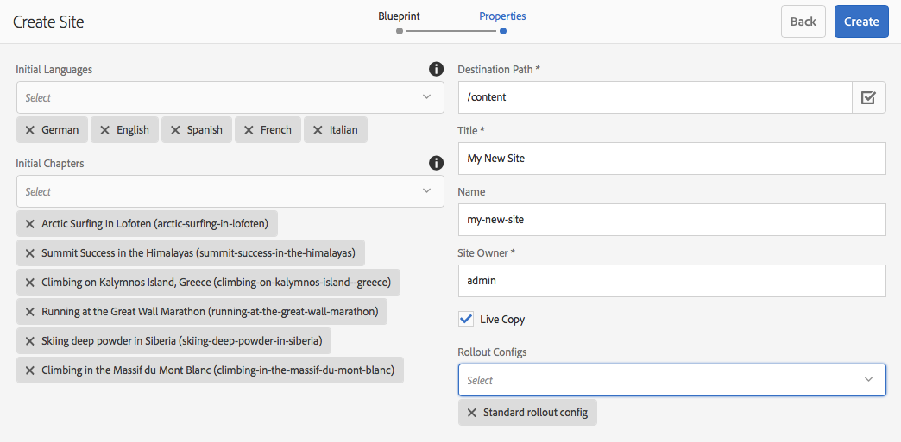
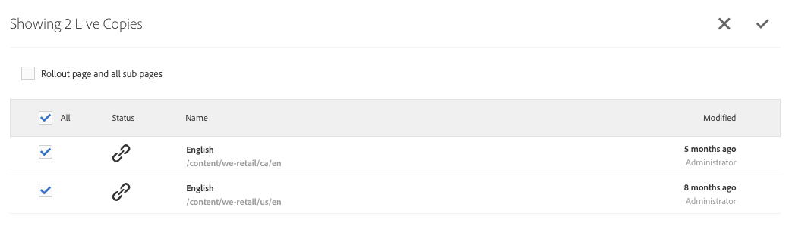

# Live Copy 만들기 및 동기화{#creating-and-synchronizing-live-copies}

페이지 또는 블루프린트 구성에서 Live Copy를 만든 다음 상속과 동기화를 관리할 수 있습니다.

## 블루프린트 구성 관리 {#managing-blueprint-configurations}

블루프린트 구성은 하나 이상의 Live Copy 페이지에 대한 소스로 사용할 기존 웹 사이트를 식별합니다.

>[!NOTE]
>
>블루프린트 구성을 사용하면 컨텐츠 변경 사항을 Live Copy에 푸시할 수 있습니다. [Live Copy - 소스, 블루프린트 및 블루프린트 구성](/help/sites-administering/msm.md#source-blueprints-and-blueprint-configurations)을 참조하십시오.

블루프린트 구성을 만들 때 블루프린트의 내부 구조를 정의하는 템플릿을 선택합니다. 기본 블루프린트 템플릿은 소스 웹 사이트에 다음과 같은 특성이 있다고 가정합니다.

* 웹 사이트에 루트 페이지가 있습니다.
* 루트의 직계 하위 페이지는 웹 사이트의 언어 분기입니다. Live Copy를 만들 때 언어는 복사본에 포함할 선택적 컨텐츠로 표시됩니다.
* 각 언어 분기의 루트에 하나 이상의 하위 페이지가 있습니다. Live Copy를 만들 때 하위 페이지가 Live Copy에 포함할 수 있는 장으로 표시됩니다.

>[!NOTE]
>
>다른 구조에는 다른 블루프린트 템플릿이 필요합니다.

블루프린트 구성을 만든 후 다음 속성을 구성합니다.

* **이름**:블루프린트 구성의 이름입니다.
* **소스 경로**:소스(블루프린트)로 사용 중인 사이트의 루트 페이지의 경로입니다.
* **설명**. (선택 사항)블루프린트 구성에 대한 설명입니다. 설명은 사이트를 만들 때 선택할 블루프린트 구성 목록에 나타납니다.

블루프린트 구성을 사용할 때 소스/블루프린트의 Live Copy 동기화 방법을 결정하는 롤아웃 구성에 블루프린트 구성을 연결할 수 있습니다. [사용할 롤아웃 구성 지정을 참조하십시오](/help/sites-administering/msm-sync.md#specifying-the-rollout-configurations-to-use).

### 블루프린트 구성 만들기 {#creating-a-blueprint-configuration}

블루프린트 구성을 만들려면

1. [도구 메뉴](/help/sites-authoring/basic-handling.md#global-navigation) 로  **** 이동한 다음 사이트 메뉴를  **** 선택합니다.
1. **Blueprint**&#x200B;을 선택하여 **블루프린트 구성** 콘솔을 엽니다.

   

1. **만들기**&#x200B;를 선택합니다.
1. 블루프린트 템플릿을 선택한 다음 **다음**&#x200B;을 선택합니다.
1. 블루프린트로 사용할 소스 페이지를 선택합니다.그런 다음 **다음**&#x200B;을(를) 계속 진행합니다.
1. 정의:

   * **제목**:블루프린트의 필수 제목
   * **설명**:자세한 내용을 제공하는 선택적 설명입니다.

1. **Createdone** 은 사양을 기반으로 블루프린트 구성을 만듭니다.

### 블루프린트 구성 편집 또는 삭제 {#editing-or-deleting-a-blueprint-configuration}

기존 블루프린트 구성을 편집하거나 삭제할 수 있습니다.

1. [도구 메뉴](/help/sites-authoring/basic-handling.md#global-navigation) 로  **** 이동한 다음 사이트 메뉴를  **** 선택합니다.
1. **Blueprint**&#x200B;을 선택하여 **블루프린트 구성** 콘솔을 엽니다.

   

1. 필요한 블루프린트 구성을 선택합니다. 해당 작업은 도구 모음에서 사용할 수 있게 됩니다.

   * **속성**;이 구성 속성을 보고 편집할 수 있습니다.
   * **삭제**

## Live Copy 생성 {#creating-a-live-copy}

### 페이지 {#creating-a-live-copy-of-a-page} Live Copy 만들기

모든 페이지 또는 분기의 Live Copy를 만들 수 있습니다. Live Copy를 만들 때 컨텐츠를 동기화하는 데 사용할 롤아웃 구성을 지정할 수 있습니다.

* 선택한 롤아웃 구성은 Live Copy 페이지와 해당 하위 페이지에 적용됩니다.
* 롤아웃 구성을 지정하지 않으면 MSM에서 사용할 롤아웃 구성을 결정합니다. [사용할 롤아웃 구성 지정을 참조하십시오](/help/sites-administering/msm-sync.md#specifying-the-rollout-configurations-to-use).

모든 페이지의 Live Copy를 만들 수 있습니다.

* [블루프린트 구성](#creating-a-blueprint-configuration)에 의해 참조되는 페이지입니다.
* 구성에 연결되지 않은 페이지입니다.
* 또한 AEM에서는 다른 live copy 페이지 내에서 live copy를 만들 수도 있습니다.

유일한 차이점은 소스/블루프린트 페이지에서 **롤아웃** 명령의 사용 가능 여부가 블루프린트 구성에서 소스를 참조하는지 여부에 따라 달라진다는 것입니다.

* **이(가) 블루프린트 구성에서 참조되는 소스 페이지에서 Live Copy를 만드는 경우 소스/블루프린트 페이지에서 롤아웃 명령을 사용할 수 있습니다.**
* **이(가) 블루프린트 구성에서 참조되지 않는 소스 페이지에서 Live Copy를 만드는 경우 소스/블루프린트 페이지에서 롤아웃 명령을 사용할 수 없습니다.**

Live Copy를 만들려면:

1. **사이트** 콘솔에서 **만들기**&#x200B;를 선택한 다음 **Live Copy**&#x200B;를 선택합니다.

   

1. 소스 페이지를 선택한 다음 **다음**&#x200B;을 클릭하거나 탭합니다. 예:

   

1. Live Copy의 대상 경로(Live Copy의 상위 폴더/페이지 열기)를 지정한 다음 **다음**&#x200B;을 클릭하거나 탭합니다.

   

   >[!NOTE]
   >
   >대상 경로는 소스 경로 내에 있을 수 없습니다.

1. 입력:

   * 페이지에 대한 **제목**.
   * URL에 사용되는 **이름**.

   

1. **하위 페이지 제외** 확인란을 사용합니다.

   * 선택됨:선택한 페이지의 Live Copy만 만들기(약식 live copy)
   * 선택되지 않음:선택한 페이지의 모든 하위 항목을 포함하는 live copy 만들기(deep live copy)

1. (선택 사항) Live Copy에 사용할 하나 이상의 롤아웃 구성을 지정하려면 **롤아웃 구성** 드롭다운 목록을 사용하여 선택합니다.선택한 구성이 드롭다운 선택기 아래에 표시됩니다.
1. **만들기**&#x200B;를 클릭하거나 탭합니다. 확인 메시지가 표시됩니다. 여기서 **열기** 또는 **완료** 중 하나를 선택할 수 있습니다.

### 블루프린트 구성에서 사이트 Live Copy 만들기 {#creating-a-live-copy-of-a-site-from-a-blueprint-configuration}

블루프린트 구성을 사용하여 Live Copy를 만들어 블루프린트(소스) 컨텐츠를 기반으로 사이트를 만듭니다. 블루프린트 구성에서 Live Copy를 만들 때 블루프린트 소스의 언어 분기를 하나 이상 선택한 다음 언어 분기에서 복사할 장을 선택합니다. [블루프린트 구성 만들기](/help/sites-administering/msm-livecopy.md#creating-a-blueprint-configuration)를 참조하십시오.

Live Copy에서 일부 언어 분기 또는 장을 생략하면 나중에 추가할 수 있습니다.[Live Copy 내부에 Live Copy 만들기(블루프린트 구성)](#creating-a-live-copy-inside-a-live-copy-blueprint-configuration)를 참조하십시오.

>[!CAUTION]
>
>블루프린트 소스에 다른 분기에서 단락을 대상으로 하는 링크 및 참조가 포함되어 있으면, 대상이 Live Copy 페이지에서 업데이트되지 않고 원래 대상을 가리키도록 유지됩니다.

사이트를 만들 때 다음 속성에 대한 값을 제공합니다.

* **초기 언어**:Live Copy에 포함할 블루프린트 소스의 언어 분기입니다.
* **초기 장**:블루프린트 언어의 하위 페이지가 Live Copy에 포함할 분기입니다.
* **대상 경로**:Live Copy 사이트의 루트 페이지 위치입니다.
* **제목**:Live Copy 사이트의 루트 페이지 제목입니다.
* **이름**:(선택 사항) Live Copy의 루트 페이지를 저장하는 JCR 노드의 이름입니다. 기본값은 제목을 기반으로 합니다.
* **사이트 소유자**:(선택 사항)
* **Live Copy**:소스 사이트와 라이브 관계를 설정하려면 이 옵션을 선택합니다. 이 옵션을 선택하지 않으면 블루프린트 복사본이 생성되지만 나중에 소스와 동기화되지 않습니다.
* **롤아웃 구성**:(선택 사항) Live Copy를 동기화하는 데 사용할 하나 이상의 롤아웃 구성을 선택합니다. 기본적으로 롤아웃 구성은 블루프린트에서 상속됩니다.자세한 내용은 [롤아웃 구성을 사용하여 ](/help/sites-administering/msm-sync.md#specifying-the-rollout-configurations-to-use) 지정을 참조하십시오.

블루프린트 구성에서 사이트의 Live Copy를 만들려면:

1. **사이트** 콘솔에서 **만들기**&#x200B;를 선택하고 드롭다운 선택기에서 **사이트**&#x200B;를 선택합니다.
1. Live Copy의 소스로 사용할 블루프린트 구성을 선택하고 **다음**&#x200B;으로 진행합니다.

   

1. Live Copy에 사용할 블루프린트 사이트의 언어를 지정하려면 **초기 언어** 선택기를 사용합니다.

   사용 가능한 모든 언어는 기본적으로 선택됩니다. 언어를 제거하려면 언어 옆에 나타나는 **X**&#x200B;을 클릭하거나 탭합니다.

   예:

   

1. **초기 장** 드롭다운을 사용하여 Live Copy에 포함할 블루프린트의 섹션을 선택합니다. 사용 가능한 모든 장은 기본적으로 포함되지만 제거할 수 있습니다.
1. 나머지 속성에 대한 값을 제공한 다음 **만들기**&#x200B;를 선택합니다. 확인 대화 상자에서 **완료**&#x200B;를 선택하여 **사이트** 콘솔로 돌아가거나 **사이트 열기**&#x200B;를 선택하여 사이트의 루트 페이지를 엽니다.

### Live Copy 내 Live Copy 만들기(블루프린트 구성) {#creating-a-live-copy-inside-a-live-copy-blueprint-configuration}

Live Copy 내부에 Live Copy를 만들 때(블루프린트 구성을 사용하여 제작) Live Copy를 처음 만들 때 포함되지 않은 언어 복사본이나 장을 삽입할 수 있습니다.

## Live Copy 모니터링 {#monitoring-your-live-copy}

### Live Copy 상태 보기 {#seeing-the-status-of-a-live-copy}

Live Copy 페이지의 속성에는 Live Copy에 대한 다음 정보가 표시됩니다.

* **출처**:Live Copy 페이지의 소스 페이지입니다.
* **상태**:Live Copy의 동기화 상태입니다. 이 상태에는 Live Copy가 소스와 최신 상태인지 여부, 마지막 동기화 발생 시간 및 동기화를 수행한 사용자가 포함됩니다.
* **구성**:

   * 페이지가 Live Copy 상속의 대상이 되는지 여부.
   * 구성이 상위 페이지에서 상속되는지 여부.
   * Live Copy에서 사용하는 모든 롤아웃 구성.

속성을 보려면:

1. **사이트** 콘솔에서 Live Copy 페이지를 선택하고 속성을 엽니다.
1. **Live Copy** 탭을 선택합니다.

   예:

   

   >[!NOTE]
   >
   >자세한 내용은 기술 자료 문서 [Livecopy 상태 메시지 - 최신/녹색/동기화 시작](https://helpx.adobe.com/experience-manager/kb/livecopy-status-message---up-to-date-green-in-sync.html)을 참조하십시오.

### 블루프린트 페이지의 Live Copy 보기 {#seeing-the-live-copies-of-a-blueprint-page}

블루프린트(블루프린트 구성에서 참조되는 블루프린트 페이지)는 현재(블루프린트) 페이지를 소스로 사용하는 Live Copy 페이지 목록을 제공합니다. 이 목록을 사용하여 Live Copy를 추적할 수 있습니다. 이 목록은 [페이지 속성](/help/sites-authoring/editing-page-properties.md)의 **블루프린트** 탭에 표시됩니다.

## Live Copy 동기화 중 {#synchronizing-your-live-copy}

### 블루프린트 롤아웃 {#rolling-out-a-blueprint}

콘텐츠 변경 사항을 Live Copy로 푸시할 블루프린트 페이지를 롤아웃합니다. **롤아웃** 동작은 [롤아웃 시](/help/sites-administering/msm-sync.md#rollout-triggers) 트리거를 사용하는 롤아웃 구성을 실행합니다.

>[!NOTE]
>
>블루프린트 분기 및 종속 Live Copy 분기 모두에서 페이지 이름이 같은 새 페이지가 작성되면 충돌이 발생할 수 있습니다.
>
>이러한 [충돌 사항은 롤아웃 시 처리 및 해결되어야 합니다](/help/sites-administering/msm-rollout-conflicts.md).

#### 페이지 속성에서 블루프린트 롤아웃 {#rolling-out-a-blueprint-from-page-properties}

1. **사이트** 콘솔에서 블루프린트에서 페이지를 선택하고 속성을 엽니다.
1. **블루프린트** 탭을 엽니다.
1. **롤아웃**&#x200B;을 선택합니다.

   

1. 페이지와 하위 페이지를 지정한 다음 확인 표시로 확인합니다.

   

1. 롤아웃 작업을 즉시 실행할지(**지금**) 또는 다른 날짜/시간(**이후**)에 실행할지를 지정합니다.

   

롤아웃은 비동기 작업으로 처리되며 [**비동기 작업 상태** 대시보드](asynchronous-jobs.md#monitor-the-status-of-asynchronous-operations), **전역 탐색** -> **도구** -> **작업** -> **작업**

>[!NOTE]
>
>비동기 롤아웃 처리에는 AEM 6.5.3.0 이상이 필요합니다. 이전 버전에서는 페이지가 즉시 동기적으로 처리되었습니다.

#### 참조 레일 {#roll-out-a-blueprint-from-the-reference-rail}에서 블루프린트를 롤아웃합니다.

1. **사이트** 콘솔에서 블루프린트에서 페이지를 선택하고 도구 모음에서 **[참조](/help/sites-authoring/basic-handling.md#references)** 패널을 엽니다(도구 모음).
1. 이 페이지와 관련된 청사진을 표시하려면 목록에서 **블루프린트** 옵션을 선택합니다.
1. 목록에서 필요한 블루프린트를 선택합니다.
1. **롤아웃**&#x200B;을 클릭하거나 탭합니다.
1. 롤아웃 세부 사항을 확인하는 메시지가 표시됩니다.

   * **롤아웃 범위**:

      범위가 선택한 페이지만 적용되는지 아니면 하위 페이지를 포함할지 지정합니다.

   * **예약**:

      롤아웃 작업을 즉시(**지금**) 또는 이후 날짜/시간(**이후**)에 실행해야 하는지 지정합니다.

      

1. 이러한 세부 사항을 확인한 후 **롤아웃**&#x200B;을 선택하여 작업을 수행합니다.

롤아웃은 비동기 작업으로 처리되며 [**비동기 작업 상태** 대시보드](asynchronous-jobs.md#monitor-the-status-of-asynchronous-operations), **전역 탐색** -> **도구** -> **작업** -> **작업**

>[!NOTE]
>
>비동기 롤아웃 처리에는 AEM 6.5.3.0 이상이 필요합니다. 이전 버전에서는 **백그라운드 롤아웃** 옵션이 선택되어 있지 않으면 페이지가 즉시 동기적으로 처리되었습니다.

#### Live Copy 개요 {#roll-out-a-blueprint-from-the-live-copy-overview}에서 블루프린트를 롤아웃합니다.

블루프린트 페이지가 선택되면 Live Copy 개요](/help/sites-administering/msm-livecopy-overview.md#using-the-live-copy-overview)에서도 [롤아웃 작업을 사용할 수 있습니다.

1. [Live Copy 개요](/help/sites-administering/msm-livecopy-overview.md#using-the-live-copy-overview)를 열고 블루프린트 페이지를 선택합니다.
1. 도구 모음에서 **롤아웃**&#x200B;을 선택합니다.
1. 페이지와 하위 페이지를 지정한 다음 확인 표시로 확인합니다.

   

1. 롤아웃 작업을 즉시 실행할지(**지금**) 또는 다른 날짜/시간(**이후**)에 실행할지를 지정합니다.

   

롤아웃은 비동기 작업으로 처리되며 [**비동기 작업 상태** 대시보드](asynchronous-jobs.md#monitor-the-status-of-asynchronous-operations), **전역 탐색** -> **도구** -> **작업** -> **작업**

>[!NOTE]
>
>비동기 롤아웃 처리에는 AEM 6.5.3.0 이상이 필요합니다. 이전 버전에서는 페이지가 즉시 동기적으로 처리되었습니다.

### Live Copy 동기화 중 {#synchronizing-a-live-copy}

Live Copy 페이지를 동기화하여 소스에서 Live Copy로 컨텐츠 변경 사항을 가져올 수 있습니다.

#### 페이지 속성 {#synchronize-a-live-copy-from-page-properties}에서 Live Copy 동기화

Live Copy를 동기화하여 소스에서 Live Copy로 변경 내용을 가져옵니다.

>[!NOTE]
>
>동기화는 [롤아웃 시](/help/sites-administering/msm-sync.md#rollout-triggers) 트리거를 사용하는 롤아웃 구성을 실행합니다.

1. **사이트** 콘솔에서 Live Copy 페이지를 선택하고 속성을 엽니다.
1. **Live Copy** 탭을 엽니다.
1. **동기화**&#x200B;를 클릭하거나 탭합니다.

   

   확인이 요청됩니다. 계속하려면 **동기화**&#x200B;를 사용하십시오.

#### Live Copy 개요 {#synchronize-a-live-copy-from-the-live-copy-overview}에서 Live Copy 동기화

Live Copy 페이지가 선택되면 Live Copy 개요](/help/sites-administering/msm-livecopy-overview.md#using-the-live-copy-overview)에서도 [동기화 작업을 사용할 수 있습니다.

1. [Live Copy 개요](/help/sites-administering/msm-livecopy-overview.md#using-the-live-copy-overview)를 열고 Live Copy 페이지를 선택합니다.
1. 도구 모음에서 **동기화**&#x200B;를 선택합니다.
1. 다음을 포함할지 여부를 지정한 후 대화 상자에서 **롤아웃** 작업을 확인합니다.

   * **페이지 및 하위 페이지**
   * **페이지만**

   

## Live Copy 내용 변경 중 {#changing-live-copy-content}

Live Copy 컨텐츠를 변경하려면 다음을 수행할 수 있습니다.

* 페이지에 단락을 추가합니다.
* 모든 페이지 또는 구성 요소에 대한 Live Copy 상속을 분할하여 기존 컨텐츠를 업데이트합니다.

>[!NOTE]
>
>Live Copy에서 새 페이지를 수동으로 만드는 경우 Live Copy에 로컬로 설정되어 있으므로 첨부할 해당 소스 페이지가 없습니다.
>
>관계의 일부인 로컬 페이지를 만드는 가장 좋은 방법은 소스에서 이를 만들고 (깊이) 롤아웃을 하는 것입니다. 그러면 페이지가 Live Copy로 로컬로 만들어집니다.

>[!NOTE]
>
>블루프린트 분기 및 종속 Live Copy 분기 모두에서 페이지 이름이 같은 새 페이지가 작성되면 충돌이 발생할 수 있습니다.
>
>이러한 [충돌 사항은 롤아웃 시 처리 및 해결되어야 합니다](/help/sites-administering/msm-rollout-conflicts.md).

### Live Copy 페이지에 구성 요소 추가 {#adding-components-to-a-live-copy-page}

구성 요소를 Live Copy 페이지에 언제든지 추가할 수 있습니다. Live Copy 및 해당 단락 시스템의 상속 상태는 구성 요소를 추가하는 기능을 제어하지 않습니다.

Live Copy 페이지가 소스 페이지와 동기화되면 추가된 구성 요소는 변경되지 않은 상태로 유지됩니다. Live Copy 페이지에서 [구성 요소 순서 변경을 참조하십시오](#changing-the-order-of-components-on-a-live-copy-page).

>[!NOTE]
>
>컨테이너로 표시된 구성 요소에 로컬로 수행된 변경 사항은 롤아웃 시 블루프린트의 내용으로 덮어쓰지 않습니다. 자세한 내용은 [MSM 우수 사례](/help/sites-administering/msm-best-practices.md#components-and-container-synchronization)를 참조하십시오.

### 페이지 {#suspending-inheritance-for-a-page}에 대한 상속 일시 중단

Live Copy를 만들 때 Live Copy 구성은 복사한 페이지의 루트 페이지에 저장됩니다. 루트 페이지의 모든 하위 페이지는 Live Copy 구성을 상속합니다. Live Copy 페이지의 구성 요소도 Live Copy 구성을 상속합니다.

페이지 속성 및 구성 요소를 변경할 수 있도록 Live Copy 페이지에 대한 Live Copy 상속을 일시 중단할 수 있습니다. 상속을 일시 중단하면 페이지 속성 및 구성 요소가 더 이상 소스와 동기화되지 않습니다.

>[!NOTE]
>
>모든 연결을 제거하기 위해 블루프린트에서 [Live Copy](#detaching-a-live-copy)를 분리할 수도 있습니다. 분리 동작은 영구적이며 되돌릴 수 없습니다.

#### 페이지 속성에서 상속 일시 중단 {#suspending-inheritance-from-page-properties}

페이지의 상속을 일시 중단하려면:

1. **사이트** 콘솔의 **속성 보기** 명령을 사용하거나 페이지 도구 모음에서 **페이지 정보**&#x200B;를 사용하여 Live Copy 페이지의 속성을 엽니다.
1. **Live Copy** 탭을 클릭하거나 탭합니다.
1. 도구 모음에서 **일시 중단**&#x200B;을 선택합니다. 그런 다음 다음 다음 중 하나를 선택할 수 있습니다.

   * **일시 중단**:현재 페이지만
   * **하위 포함 일시 중단**:모든 하위 페이지와 함께

1. 확인 대화 상자에서 **일시 중단**&#x200B;을 선택합니다.

#### Live Copy 개요에서 상속 일시 중단 {#suspending-inheritance-from-the-live-copy-overview}

Live Copy 페이지가 선택되면 Live Copy 개요](/help/sites-administering/msm-livecopy-overview.md#using-the-live-copy-overview)에서도 [일시 중단 작업을 사용할 수 있습니다.

1. [Live Copy 개요](/help/sites-administering/msm-livecopy-overview.md#using-the-live-copy-overview)를 열고 Live Copy 페이지를 선택합니다.
1. 도구 모음에서 **일시 중단**&#x200B;을 선택합니다.
1. 다음 중에서 적절한 옵션을 선택합니다.

   * **일시 중단**
   * **하위 일시 중단**

   

1. **Live Copy 일시 중단** 대화 상자에서 **일시 중단** 작업을 확인합니다.

   

### {#resuming-inheritance-for-a-page} 페이지에 대한 상속 다시 시작

페이지에 대한 Live Copy 상속 일시 중단은 임시 작업입니다. 일시 중단된 후에는 **다시 시작** 동작을 사용할 수 있으므로 라이브 관계를 복원할 수 있습니다.

상속을 다시 활성화하면 페이지가 소스와 자동으로 동기화되지 않습니다. 필요할 경우 다음 중 하나를 사용하여 동기화를 요청할 수 있습니다.

* **다시 시작**/**되돌리기** 대화 상자에서;예를 들면 다음과 같습니다.

   

* 나중에 동기화 작업을 수동으로 선택하여

>[!CAUTION]
>
>상속을 다시 활성화하면 페이지가 소스와 자동으로 동기화되지 않습니다. 필요한 경우 수동으로 동기화를 요청할 수 있습니다.다시 시작할 때 또는 나중에 다시 시작할 때.

#### 페이지 속성에서 상속 다시 시작 {#resuming-inheritance-from-page-properties}

[일시 중단](#suspending-inheritance-from-page-properties)되면 **다시 시작** 동작이 페이지 속성의 도구 모음에 있게 됩니다.

선택하면 대화 상자가 표시됩니다. 필요한 경우 동기화를 선택한 다음 작업을 확인할 수 있습니다.

#### Live Copy 개요 {#resume-a-live-copy-page-from-the-live-copy-overview}에서 Live Copy 페이지 다시 시작

Live Copy 페이지가 선택되면 Live Copy 개요](/help/sites-administering/msm-livecopy-overview.md#using-the-live-copy-overview)에서도 [다시 시작 작업을 사용할 수 있습니다.

1. [Live Copy 개요](/help/sites-administering/msm-livecopy-overview.md#using-the-live-copy-overview)를 열고 일시 중단된 Live Copy 페이지를 선택합니다.**상속이 취소됨**&#x200B;으로 표시됩니다.
1. 도구 모음에서 **다시 시작**&#x200B;을 선택합니다.
1. 상속을 되돌린 후 페이지를 동기화할지 여부를 표시한 다음 **Live Copy 다시 시작** 대화 상자에서 **다시 시작** 작업을 확인합니다.

### 상속 깊이 변경(얕은/깊이) {#changing-inheritance-depth-shallow-deep}

기존 Live Copy에서는 페이지의 깊이를 변경할 수 있습니다.하위 페이지가 포함되는지 여부.

* 약식 Live Copy로 전환:

   * 즉각적인 효과를 가지며 되돌릴 수 없습니다.

      * 하위 페이지는 Live Copy에서 명시적으로 분리됩니다. 실행 취소한 경우에는 하위 항목에 대한 추가 수정 내용을 유지할 수 없습니다.

      * 중첩된 `LiveCopies`이(가) 있더라도 하위 항목 `LiveRelationships`을 제거합니다.

* 딥 Live Copy로 전환:

   * 하위 페이지는 변경되지 않습니다.
   * 전환의 효과를 보려면 롤아웃할 수 있으며, 롤아웃 구성에 따라 컨텐츠 수정이 적용됩니다.

* 얕은 Live Copy로 전환한 다음 다시 심도로 돌아옵니다.

   * (이전의) 약식 live copy의 모든 하위 항목은 수동으로 만든 것처럼 취급되므로 `[oldname]_msm_moved name`을 사용하여 제거됩니다.

깊이를 지정하거나 변경하려면:

1. **사이트** 콘솔의 **속성 보기** 명령을 사용하거나 페이지 도구 모음에서 **페이지 정보**&#x200B;를 사용하여 Live Copy 페이지의 속성을 엽니다.
1. **Live Copy** 탭을 클릭하거나 탭합니다.
1. 하위 페이지가 포함되었는지 여부에 따라 **구성** 섹션에서 **Live Copy 상속** 옵션을 설정하거나 해제합니다.

   * checked - deep live copy(하위 페이지가 포함되어 있음)
   * clear - 약식 live copy(하위 페이지는 제외됨)

   >[!CAUTION]
   >
   >얕은 Live Copy로 전환하면 즉시 효과가 나타나며 되돌릴 수 없습니다.
   >
   >자세한 내용은 [Live Copy - 컴포지션](/help/sites-administering/msm.md#live-copies-composition)을 참조하십시오.

1. 업데이트를 유지하려면 **저장**&#x200B;을 클릭하거나 탭하십시오.

### 구성 요소 {#cancelling-inheritance-for-a-component} 상속 취소

구성 요소가 더 이상 소스 구성 요소와 동기화되지 않도록 구성 요소에 대한 Live Copy 상속을 취소합니다. 필요한 경우 나중에 상속을 활성화할 수 있습니다.

>[!NOTE]
>
>상속을 다시 활성화하면 구성 요소가 소스와 자동으로 동기화되지 않습니다. 필요한 경우 동기화를 수동으로 요청할 수 있습니다.

상속을 취소하여 구성 요소 컨텐츠를 변경하거나 구성 요소를 삭제합니다.

1. 상속을 취소하려는 구성 요소를 클릭하거나 탭합니다.

   

1. 구성 요소 도구 모음에서 **상속 취소** 아이콘을 클릭하거나 탭합니다.

   

1. 상속 취소 대화 상자에서 **Yes**&#x200B;로 작업을 확인합니다.

   구성 요소 도구 모음은 모든(적절한) 편집 명령을 포함하도록 업데이트됩니다.

### 구성 요소 {#re-enabling-inheritance-for-a-component}에 대한 상속 다시 활성화

구성 요소에 대한 상속을 활성화하려면 구성 요소 도구 모음에서 **상속 다시 활성화** 아이콘을 클릭하거나 탭합니다.

### Live Copy 페이지에서 구성 요소 순서 변경 {#changing-the-order-of-components-on-a-live-copy-page}

Live Copy에 단락 시스템의 일부인 구성 요소가 포함된 경우 해당 단락 시스템의 상속은 다음 규칙을 따릅니다.

* 상속된 단락 시스템의 구성 요소 순서는 상속이 설정되었더라도 수정할 수 있습니다.
* 롤아웃 시 구성 요소의 순서가 블루프린트에서 복원됩니다. 새 구성 요소가 롤아웃 전에 live copy에 추가된 경우, 구성 요소가 추가된 위의 구성 요소와 함께 순서가 변경됩니다.
* 단락 시스템의 상속이 취소되면 구성 요소 순서는 롤아웃 시 복원되지 않으며 Live Copy에 그대로 유지됩니다.

>[!NOTE]
>
>단락 시스템에서 취소된 상속을 되돌릴 때 **구성 요소의 순서는 블루프린트에서 자동으로 복원되지 않습니다.** 필요한 경우 동기화를 수동으로 요청할 수 있습니다.

단락 시스템의 상속을 취소하려면 다음 절차를 따르십시오.

1. Live Copy 페이지를 엽니다.
1. 기존 구성 요소를 페이지의 새 위치로 드래그합니다.
1. **상속 취소** 대화 상자에서 **예**&#x200B;로 작업을 확인합니다.

### Live Copy 페이지 {#overriding-properties-of-a-live-copy-page} 속성 재정의

Live Copy 페이지의 페이지 속성은 기본적으로 소스 페이지에서 상속되고 편집할 수 없습니다.

Live Copy의 속성 값을 변경해야 할 때 속성의 상속을 취소할 수 있습니다. 링크 아이콘은 속성에 대한 상속이 활성화되었음을 나타냅니다.

상속을 취소하면 속성 값을 변경할 수 있습니다. 끊어진 링크 아이콘은 상속이 취소되었음을 나타냅니다.

필요할 경우 나중에 속성에 대한 상속을 다시 활성화할 수 있습니다.

>[!NOTE]
>
>상속을 다시 활성화하면 Live Copy 페이지 속성이 소스 속성과 자동으로 동기화되지 않습니다. 필요한 경우 동기화를 수동으로 요청할 수 있습니다.

1. 페이지 도구 모음에서 **사이트** 콘솔 또는 **페이지 정보** 아이콘의 **속성 보기** 옵션을 사용하여 Live Copy 페이지의 속성을 엽니다.
1. 속성의 상속을 취소하려면 속성 오른쪽에 표시되는 링크 아이콘을 클릭하거나 탭합니다.

   

1. **상속 취소** 확인 대화 상자에서 **예**&#x200B;를 클릭하거나 탭합니다.

### Live Copy 페이지 {#revert-properties-of-a-live-copy-page} 속성 되돌리기

속성에 대한 상속을 활성화하려면 속성 옆에 나타나는 **상속 되돌리기** 아이콘을 클릭하거나 탭합니다.

### Live Copy 페이지 재설정 {#resetting-a-live-copy-page}

Live Copy 페이지를 다음으로 재설정:

* 모든 상속 취소 및
* 페이지를 소스 페이지와 동일한 상태로 되돌립니다.

재설정은 페이지 속성, 단락 시스템 및 구성 요소에 수행한 변경 사항에 영향을 줍니다.

#### 페이지 속성 {#reset-a-live-copy-page-from-the-page-properties}에서 Live Copy 페이지 재설정

1. **사이트** 콘솔에서 Live Copy 페이지를 선택하고 **속성 보기**&#x200B;를 선택합니다.
1. **Live Copy** 탭을 엽니다.
1. 도구 모음에서 **재설정**&#x200B;을 선택합니다.

   

1. **Live Copy 재설정** 대화 상자에서 **재설정**&#x200B;으로 확인합니다.

#### Live Copy 개요 {#reset-a-live-copy-page-from-the-live-copy-overview}에서 Live Copy 페이지 재설정

Live Copy 페이지가 선택되면 Live Copy 개요](/help/sites-administering/msm-livecopy-overview.md#using-the-live-copy-overview)에서도 [재설정 작업을 사용할 수 있습니다.

1. [Live Copy 개요](/help/sites-administering/msm-livecopy-overview.md#using-the-live-copy-overview)를 열고 Live Copy 페이지를 선택합니다.
1. 도구 모음에서 **재설정**&#x200B;을 선택합니다.
1. **Live Copy 재설정** 대화 상자에서 **재설정** 작업을 확인합니다.

   

## Live Copy 페이지와 블루프린트 페이지 {#comparing-a-live-copy-page-with-a-blueprint-page} 비교

변경 내용을 추적하려면 **참조**&#x200B;에서 블루프린트 페이지를 보고 Live Copy 페이지와 비교할 수 있습니다.

1. **사이트** 콘솔에서 [블루프린트 또는 Live Copy 페이지로 이동하여 ](/help/sites-authoring/basic-handling.md#viewing-and-selecting-resources)을 선택합니다.
1. **[참조](/help/sites-authoring/basic-handling.md#references)** 패널을 열고 다음을 선택합니다.

   * **블루프린트** (Live Copy 페이지를 선택한 경우)
   * **Live Copy** (블루프린트 페이지를 선택한 경우)

1. 특정 Live Copy를 선택한 다음 다음 중 하나를 선택합니다.

   * **블루프린트와 비교** (Live Copy 페이지를 선택한 경우)
   * **Live Copy와 비교** (블루프린트 페이지를 선택한 경우)

   예:

   

1. 두 페이지(Live Copy 및 블루프린트)가 나란히 열립니다.

   이 기능의 사용에 대한 자세한 내용은 [페이지 비교](/help/sites-authoring/page-diff.md)를 참조하십시오.

## Live Copy 분리 {#detaching-a-live-copy}

분리는 Live Copy와 해당 소스/블루프린트 페이지 간의 라이브 관계를 영구적으로 제거합니다. 모든 MSM 관련 속성은 Live Copy에서 제거되고 Live Copy 페이지는 독립형 복사본이 됩니다.

>[!CAUTION]
>
>Live Copy를 분리한 후에는 Live 관계를 복원할 수 없습니다.
>
>나중에 다시 설치하는 옵션과 함께 라이브 관계를 제거하려면 페이지에 대한 [live copy 상속](#suspending-inheritance-for-a-page)을 취소할 수 있습니다.

트리 내에서 **Detach**&#x200B;을(를) 사용하는 위치에 대한 의미가 있습니다.

* **LiveCopy의 루트 페이지에서 분리**

   Live Copy의 루트 페이지에서 이 작업을 수행하면 블루프린트의 모든 페이지와 Live Copy 사이의 라이브 관계가 제거됩니다.

   블루프린트의 페이지에 대한 추가 변경 사항(있는 대로) **은 Live Copy(있는 그대로)에 영향을 주지 않습니다.**

* **LiveCopy의 하위 페이지에서 분리**

   이 작업이 Live Copy 내의 하위 페이지(또는 분기)에서 수행되는 경우:

   * 해당 하위 페이지(또는 분기)에 대한 라이브 관계가 제거됩니다.
   * live copy 분기의 (하위) 페이지는 수동으로 만든 것처럼 처리됩니다.

   *그러나* 하위 페이지는 여전히 상위 분기의 라이브 관계에 적용되므로 블루프린트 페이지의 추가 롤아웃은 모두 다음과 같이 됩니다.

   1. 분리된 페이지의 이름 변경:

      * 이것은 MSM이 만들고자 하는 Live Copy 페이지와 이름이 동일하므로 충돌을 일으키는 수동으로 만들어진 페이지로 간주하기 때문입니다.
   1. 롤아웃의 변경 내용이 포함된 원래 이름으로 새(livecopy) 페이지를 만듭니다.

   >[!NOTE]
   >
   >이러한 상황에 대한 자세한 내용은 [MSM 롤아웃 충돌](/help/sites-administering/msm-rollout-conflicts.md)을 참조하십시오.

### 페이지 속성 {#detach-a-live-copy-page-from-the-page-properties}에서 Live Copy 페이지 분리

Live Copy를 분리하려면:

1. **사이트** 콘솔에서 Live Copy 페이지를 선택하고 **속성 보기**&#x200B;를 클릭하거나 탭합니다.
1. **Live Copy** 탭을 엽니다.
1. 도구 모음에서 **분리**&#x200B;를 선택합니다.

   

1. 확인 대화 상자가 표시되면 **분리**&#x200B;를 선택하여 작업을 완료합니다.

### Live Copy 개요 {#detach-a-live-copy-page-from-the-live-copy-overview}에서 Live Copy 페이지 분리

Live Copy 페이지가 선택되면 Live Copy 개요](/help/sites-administering/msm-livecopy-overview.md#using-the-live-copy-overview)에서도 [분리 작업을 사용할 수 있습니다.

1. [Live Copy 개요](/help/sites-administering/msm-livecopy-overview.md#using-the-live-copy-overview)를 열고 Live Copy 페이지를 선택합니다.
1. 도구 모음에서 **분리**&#x200B;를 선택합니다.
1. **Live Copy 분리** 대화 상자에서 **분리** 작업을 확인합니다.

   
