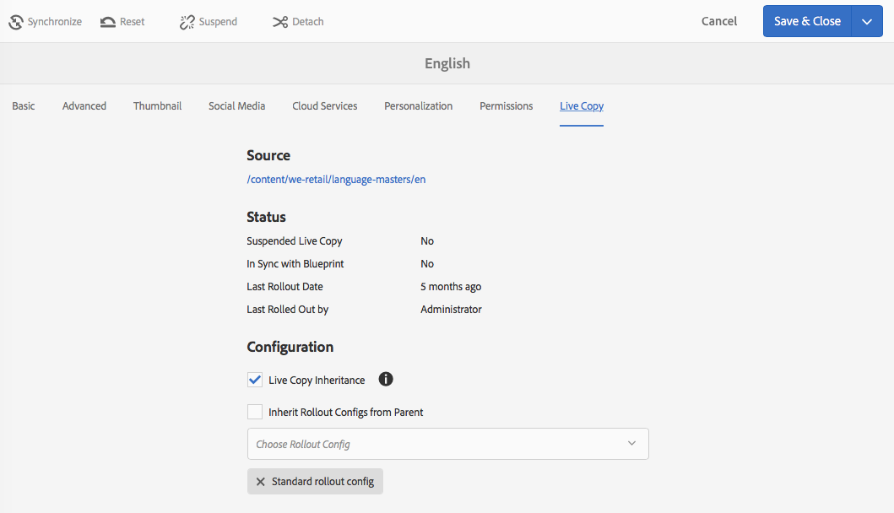
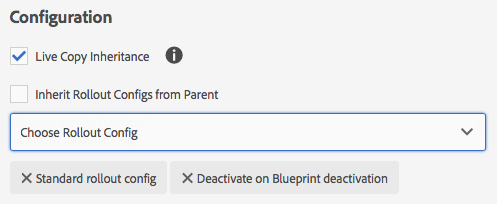

# Live Copy 동기화 구성{#configuring-live-copy-synchronization}

Live Copy가 소스 컨텐츠와 동기화되는 방법 및 시기를 제어하려면 다음 작업을 수행하십시오.

* 기존 롤아웃 구성이 요구 사항을 충족하는지 또는 롤아웃 구성을 한 개 이상 생성해야 하는지 여부를 결정합니다.
* Live Copy에 사용할 롤아웃 구성을 지정합니다.

## 설치된 롤아웃 구성 및 사용자 지정 롤아웃 구성 {#installed-and-custom-rollout-configurations}

이 섹션에서는 설치된 롤아웃 구성 및 롤아웃 구성에서 사용하는 동기화 작업과 필요한 경우 사용자 지정 구성을 생성하는 방법에 대한 정보를 제공합니다.

>[!CAUTION]
>
>기본(설치된) 롤아웃 구성을 업데이트하거나 변경하는 것은 **권장되지 않음**&#x200B;입니다. 사용자 지정 라이브 작업에 대한 요구 사항이 있는 경우 사용자 지정 롤아웃 구성에 추가해야 합니다.

### 롤아웃 트리거 {#rollout-triggers}

각 롤아웃 구성은 롤아웃이 발생하도록 하는 롤아웃 트리거를 사용합니다. 롤아웃 구성은 다음 트리거 중 하나를 사용할 수 있습니다.

* **롤아웃 시**: **롤아웃** 명령이 파란색 인쇄 페이지에서 사용되거나 **동기화** 명령이 Live Copy 페이지에서 사용됩니다.

* **수정 시**: 소스 페이지가 수정됩니다.

* **활성화 시**: 소스 페이지가 활성화됩니다.

* **비활성화 시**: 소스 페이지가 비활성화됩니다.

>[!NOTE]
>
>수정 시 트리거를 사용하면 성능에 영향을 줄 수 있습니다. 자세한 내용은 [MSM 우수 사례](/help/sites-administering/msm-best-practices.md#onmodify)를 참조하십시오.

### 설치된 롤아웃 구성  {#installed-rollout-configurations}

다음 표에는 AEM과 함께 설치된 롤아웃 구성이 나열되어 있습니다. 표에는 각 롤아웃 구성의 트리거 및 동기화 작업이 포함되어 있습니다. 설치된 롤아웃 구성 작업이 요구 사항을 충족하지 않는 경우 [새 롤아웃 구성을 생성](#creating-a-rollout-configuration)할 수 있습니다.

<table>
 <tbody>
  <tr>
   <th>이름</th>
   <th>설명</th>
   <th>트리거</th>
   <th>동기화 작업    <a href="#installed-synchronization-actions">설치된 동기화 작업</a> 참조</th>
  </tr>
  <tr>
   <td>표준 롤아웃 구성</td>
   <td>롤아웃 트리거 및 실행 작업에 대한 롤아웃 프로세스를 시작할 수 있는 표준 롤아웃 구성: 컨텐츠를 생성, 업데이트, 삭제하고 하위 노드의 순서를 지정합니다.</td>
   <td>롤아웃 시</td>
   <td>contentUpdate  contentCopy  contentDelete  referencesUpdate  productUpdate  orderChildren</td>
  </tr>
  <tr>
   <td>블루프린트 활성화에서 활성화</td>
   <td>소스가 게시될 때 Live Copy를 게시합니다.</td>
   <td>활성화 시</td>
   <td>targetActivate</td>
  </tr>
  <tr>
   <td>블루프린트 비활성화에서 비활성화</td>
   <td>소스가 비활성화될 때 Live Copy를 비활성화합니다.</td>
   <td>비활성화 시</td>
   <td>targetDeactivate  </td>
  </tr>
  <tr>
   <td>수정되면 푸시</td>
   <td>
소스가 수정될 때 Live Copy에 컨텐츠를 푸시합니다.
 
이 롤아웃 구성은 수정 시 트리거를 사용하므로 필요한 경우에만 사용하십시오.
 </td>
   <td>수정 시</td>
   <td>contentUpdate  contentCopy  contentDelete  referencesUpdate  orderChildren  </td>
  </tr>
  <tr>
   <td>수정되면 푸시(약식)</td>
   <td>
블루프린트 페이지가 수정될 때 참조를 업데이트하지 않고 컨텐츠를 Live Copy로 푸시합니다(예: 약식 사본의 경우).
 
이 롤아웃 구성은 수정 시 트리거를 사용하므로 필요한 경우에만 사용하십시오.
 </td>
   <td>수정 시</td>
   <td>contentUpdate  contentCopy  contentDelete  orderChildren</td>
  </tr>
  <tr>
   <td>출시 홍보</td>
   <td>시작 페이지를 홍보하기 위한 표준 롤아웃 구성입니다.</td>
   <td>롤아웃 시</td>
   <td>contentUpdate  contentCopy  contentDelete  referencesUpdate  orderChildren  markLiveRelationship</td>
  </tr>
  <tr>
   <td>카탈로그 페이지 컨텐츠 롤아웃 구성</td>
   <td>카탈로그 블루프린트에서 페이지 템플릿을 적용합니다.</td>
   <td>롤아웃 시</td>
   <td>contentUpdate  contentCopy  contentDelete  referencesUpdate  productCreateUpdate  orderChildren</td>
  </tr>
  <tr>
   <td>카탈로그 페이지 업데이트 롤아웃 구성</td>
   <td>카탈로그 블루프린트에서 대상 속성을 적용합니다. 카탈로그 페이지 컨텐츠 롤아웃 구성 후에 실행해야 합니다.</td>
   <td>롤아웃 시</td>
   <td>catalogRolloutHooks</td>
  </tr>
  <tr>
   <td>DPS 발행물 롤아웃 구성</td>
   <td>초기 롤아웃 시 FolioProducer 바인딩 속성을 제외하는 동안 롤아웃 트리거 시 롤아웃 프로세스를 시작할 수 있는 DPS 게시 롤아웃 구성</td>
   <td>롤아웃 시</td>
   <td>contentUpdate  contentCopy  contentDelete  referencesUpdate  orderChildren  dpsMetadataFilter</td>
  </tr>
  <tr>
   <td>기존(5.6.0) 카탈로그 롤아웃 구성</td>
   <td>더 이상 사용되지 않습니다. 카탈로그 롤아웃에 MSM 대신 Catalog Generator를 사용하십시오.</td>
   <td>롤아웃 시</td>
   <td>editProperties</td>
  </tr>
 </tbody>
</table>

### 설치된 동기화 작업  {#installed-synchronization-actions}

다음 표에는 AEM과 함께 설치된 동기화 작업이 나열되어 있습니다. 설치된 작업이 요구 사항을 충족하지 않는 경우 [새 동기화 작업 만들기](/help/sites-developing/extending-msm.md#creating-a-new-synchronization-action)를 수행할 수 있습니다.

<table>
 <tbody>
  <tr>
   <th>작업 이름</th>
   <th>설명</th>
   <th>속성  </th>
  </tr>
  <tr>
   <td>contentCopy</td>
   <td>소스의 노드가 Live Copy에 없는 경우 Live Copy에 노드를 복사합니다. <a href="#excluding-properties-and-node-types-from-synchronization">제외할 노드 유형, 단락 항목 및 페이지 속성을 </a> 지정하도록 CQ MSM 내용 복사 작업 서비스를 구성합니다.    </td>
   <td> </td>
  </tr>
  <tr>
   <td>contentDelete</td>
   <td>
소스에 없는 Live Copy 노드를 삭제합니다. <a href="#excluding-properties-and-node-types-from-synchronization">제외할 노드 유형, 단락 항목 및 페이지 속성을 </a> 지정하도록 CQ MSM 내용 삭제 작업 서비스를 구성합니다. 
 </td>
   <td> </td>
  </tr>
  <tr>
   <td>contentUpdate</td>
   <td>Live Copy 컨텐츠를 소스의 변경 사항으로 업데이트합니다. <a href="#excluding-properties-and-node-types-from-synchronization">제외할 노드 유형, 단락 항목 및 페이지 속성을 </a> 지정하도록 CQ MSM 내용 업데이트 작업 서비스를 구성합니다.    </td>
   <td> </td>
  </tr>
  <tr>
   <td>editProperties</td>
   <td>
Live Copy의 속성을 편집합니다. editMap 속성은 편집되는 속성 및 해당 값을 결정합니다. editMap 속성의 값은 다음 형식을 사용해야 합니다.
 
<code>[property_name_1]#[current_value]#</code>[new_value],  <code>[property_name_2]#[current_value]#</code>[new_value], .. ,  <code>[property_name_n]#[current_value]#</code>[new_value]
 
<code>current_value</code> 및 <code>new_value</code> 항목은 일반 표현식입니다.  
 
예를 들면, editMap에 대해 다음 값을 고려합니다.
 
<code>sling:resourceType#/</code>(콘텐츠 페이지|homepage)#/  mobilecontentpage,  cq:template#/contentpage#/mobilecontentpage
 
이 값은 Live Copy 노드의 속성을 다음과 같이 편집합니다.

    <ul>
     <li><code>contentpage</code> 또는 <code>homepage</code>로 설정된 <code>sling:resourceType</code> 속성은 <code>mobilecontentpage.</code></li>
     <li><code>contentpage</code>로 설정된 <code>cq:template</code> 속성은 <code>mobilecontentpage.</code></li>
    </ul> </td>
   <td>
 
 
editMap: (문자열) 속성, 현재 값 및 새 값을 식별합니다. 자세한 내용은 설명을 참조하십시오.  
 </td>
  </tr>
  <tr>
   <td>notify</td>
   <td>페이지가 롤아웃된 페이지 이벤트를 보냅니다. 알림을 받으려면 먼저 롤아웃 이벤트를 구독해야 합니다.</td>
   <td> </td>
  </tr>
  <tr>
   <td>orderChildren</td>
   <td>Live Copy에서 블루프린트에서의 순서에 따라 하위 노드를 주문합니다.  </td>
   <td> </td>
  </tr>
  <tr>
   <td>referencesUpdate</td>
   <td>
Live Copy에서 이 동기화 작업은 링크와 같은 참조를 업데이트합니다.  블루프린트 내의 리소스를 가리키는 Live Copy 페이지에서 경로를 검색합니다. 경로가 발견되면 Live Copy(블루프린트 대신) 내의 관련 리소스를 가리키도록 업데이트됩니다. 대상이 블루프린트 외부에 있는 참조는 변경되지 않습니다.
 
<a href="#excluding-properties-and-node-types-from-synchronization">제외할 노드 유형, 단락 항목 및 페이지 속성을 </a> 지정하도록 CQ MSM 참조 업데이트 작업 서비스를 구성합니다. 
 </td>
   <td> </td>
  </tr>
  <tr>
   <td>targetVersion</td>
   <td>
Live Copy 버전을 생성합니다.
 
이 작업은 롤아웃 구성에 포함된 유일한 동기화 작업이어야 합니다.
 </td>
   <td> </td>
  </tr>
  <tr>
   <td>targetActivate</td>
   <td>
Live Copy를 활성화합니다.
 
이 작업은 롤아웃 구성에 포함된 유일한 동기화 작업이어야 합니다.
 </td>
   <td> </td>
  </tr>
  <tr>
   <td>targetDeactivate</td>
   <td>
Live Copy를 비활성화합니다.
 
이 작업은 롤아웃 구성에 포함된 유일한 동기화 작업이어야 합니다.
 </td>
   <td> </td>
  </tr>
  <tr>
   <td>workflow</td>
   <td>
대상 속성(페이지에 대해서만)에 정의된 워크플로우를 시작하고 Live Copy를 페이로드로 가져옵니다.
 
대상 경로는 모델 노드의 경로입니다.
 </td>
   <td>대상: (문자열) 워크플로우 모델에 대한 경로입니다.  </td>
  </tr>
  <tr>
   <td>mandatory</td>
   <td>
Live Copy 페이지에서 특정 사용자 그룹에 대한 여러 ACL의 권한을 읽기 전용으로 설정합니다. 다음 ACL이 구성됩니다.

    <ul>
     <li>ActionSet.ACTION_NAME_REMOVE</li>
     <li>ActionSet.ACTION_NAME_SET_PROPERTY</li>
     <li>ActionSet.ACTION_NAME_ACL_MODIFY</li>
    </ul> 
이 작업은 페이지에만 사용합니다.
 </td>
   <td>대상: (문자열) 권한을 설정 중인 그룹의 ID입니다.   </td>
  </tr>
  <tr>
   <td>mandatoryContent</td>
   <td>
Live Copy 페이지에서 특정 사용자 그룹에 대한 여러 ACL의 권한을 읽기 전용으로 설정합니다. 다음 ACL이 구성됩니다.

    <ul>
     <li>ActionSet.ACTION_NAME_SET_PROPERTY</li>
     <li>ActionSet.ACTION_NAME_ACL_MODIFY</li>
    </ul> 
이 작업은 페이지에만 사용합니다.
 </td>
   <td>대상: (문자열) 권한을 설정 중인 그룹의 ID입니다. </td>
  </tr>
  <tr>
   <td>mandatoryStructure</td>
   <td>Live Copy 페이지에서 특정 사용자 그룹에 대한 ActionSet.ACTION_NAME_REMOVE ACL의 권한을 읽기 전용으로 설정합니다. 이 작업은 페이지에만 사용합니다.</td>
   <td>대상: (문자열) 권한을 설정 중인 그룹의 ID입니다. </td>
  </tr>
  <tr>
   <td>VersionCopyAction</td>
   <td>블루프린트/소스 페이지가 한 번 이상 게시된 경우 게시된 버전을 사용하여 Live Copy 페이지를 생성합니다. 참고: 이 작업은 게시된 소스 페이지에 따라 Live Copy 페이지를 생성하는 데에만 사용할 수 있고, 기존 Live Copy 페이지를 업데이트하는 데에는 사용할 수 없습니다. </td>
   <td> </td>
  </tr>
  <tr>
   <td>PageMoveAction</td>
   <td>
페이지를 블루프린트에서 이동한 경우 PageMoveAction이 적용됩니다.
 
이 작업은 이동 전 위치에서 이동 후 위치로 (관련된) Live Copy 페이지를 이동하지 않고 복사합니다.
 
PageMoveAction은 이동 전 위치에서 Live Copy 페이지를 변경하지 않습니다. 따라서 연속적인 RolloutConfigurations의 경우의 블루프린트 없는 LiveRelationhip 상태가 있습니다.
 
제외할 노드 유형, 단락 항목 및 페이지 속성을 지정하도록 <a href="#excluding-properties-and-node-types-from-synchronization">CQ MSM 페이지 이동 작업 서비스를 구성</a>합니다. 
 
이 작업은 롤아웃 구성에 포함된 유일한 동기화 작업이어야 합니다.
 </td>
   <td>
prop_referenceUpdate: (부울) 참조를 업데이트하려면 true로 설정합니다. 기본값은 true입니다.
 
 
 </td>
  </tr>
  <tr>
   <td>productCreateUpdate</td>
   <td>카탈로그 내에서 제품 리소스를 생성하거나 업데이트합니다. 이 작업은 다음 상황 중 하나에서 사용됩니다.
    <ul>
     <li>카탈로그(또는 카탈로그 섹션) 생성 또는 롤아웃</li>
     <li>사용자가 제품 구성 요소에 대한 동기화 상속을 복원합니다.</li>
    </ul> </td>
   <td> </td>
  </tr>
  <tr>
   <td>markLiveRelationship</td>
   <td>launch-created 컨텐츠에 대한 라이브 관계가 존재함을 나타냅니다.</td>
   <td> </td>
  </tr>
  <tr>
   <td>catalogRolloutHook</td>
   <td>catalog-generation-specific 롤아웃 후크를 실행합니다. CatalogGenerator의 executePageRolloutHooks 및 executeProductRolloutHooks 메서드를 호출합니다.  AEM Javadocs에서 com.adobe.cq.commerce.pim.api.CatalogGenerator를 참조하십시오.</td>
   <td> </td>
  </tr>
  <tr>
   <td>productUpdate</td>
   <td>제품 카탈로그의 Live Copy에서 제품 페이지를 업데이트합니다.</td>
   <td> </td>
  </tr>
 </tbody>
</table>

### 롤아웃 구성 만들기 {#creating-a-rollout-configuration}

설치된 롤아웃 구성이 애플리케이션 요구 사항을 충족하지 않을 경우 [롤아웃 구성을 생성](/help/sites-developing/extending-msm.md#creating-a-new-rollout-configuration)할 수 있습니다.

* [롤아웃 구성을 생성](/help/sites-developing/extending-msm.md#create-the-rollout-configuration)합니다.
* [롤아웃 구성에 동기화 작업을 추가](/help/sites-developing/extending-msm.md#add-synchronization-actions-to-the-rollout-configuration)합니다.

그러면 블루프린트 또는 Live Copy 페이지에서 롤아웃 구성을 설정할 때 새 롤아웃 구성을 사용할 수 있습니다.

### 동기화에서 속성 및 노드 유형 제외  {#excluding-properties-and-node-types-from-synchronization}

특정 노드 유형 및 속성에 영향을 주지 않도록 해당 동기화 작업을 지원하는 여러 OSGi 서비스를 구성할 수 있습니다. 예를 들어, AEM의 내부 기능과 관련된 여러 속성 및 하위 노드는 Live Copy에 포함하지 않아야 합니다. 페이지의 사용자와 관련된 컨텐츠만 복사해야 합니다.

AEM으로 작업할 때 이러한 서비스에 대한 구성 설정을 관리하는 방법에는 여러 가지가 있습니다.자세한 내용 및 권장 방법은 [OSGi](/help/sites-deploying/configuring-osgi.md) 구성을 참조하십시오.

다음 표에는 제외할 노드를 지정할 수 있는 동기화 작업이 나열되어 있습니다. 이 표는 웹 콘솔을 사용하여 구성할 서비스의 이름 및 저장소 노드를 사용하여 구성할 PID를 제공합니다.

| 동기화 작업 | 웹 콘솔의 서비스 이름 | 서비스 PID |
|---|---|---|
| contentCopy | CQ MSM 내용 복사 작업 | com.day.cq.wcm.msm.impl.actions.ContentCopyActionFactory |
| contentDelete | CQ MSM 콘텐츠 삭제 작업 | com.day.cq.wcm.msm.impl.actions.ContentDeleteActionFactory |
| contentUpdate | CQ MSM 컨텐츠 업데이트 작업 | com.day.cq.wcm.msm.impl.actions.ContentUpdateActionFactory |
| PageMoveAction | CQ MSM 페이지 이동 작업 | com.day.cq.wcm.msm.impl.actions.PageMoveActionFactory |
| referencesUpdate | CQ MSM 참조 업데이트 작업 | com.day.cq.wcm.msm.impl.actions.ReferencesUpdateActionFactory |

다음 표는 구성할 수 있는 속성을 설명합니다.

<table>
 <tbody>
  <tr>
   <th>웹 콘솔 속성/OSGi 속성</th>
   <th>설명</th>
  </tr>
  <tr>
   <td>
제외된 알림 유형
 
cq.wcm.msm.action.excludednodetypes
 </td>
   <td>동기화 작업에서 제외할 노드 유형과 일치하는 일반 표현식.</td>
  </tr>
  <tr>
   <td>
제외된 단락 항목
 
cq.wcm.msm.action.excludedparagraphitems
 </td>
   <td>동기화 작업에서 제외할 단락 항목과 일치하는 일반 표현식.</td>
  </tr>
  <tr>
   <td>
제외된 페이지 속성
 
cq.wcm.msm.action.excludedprops
 </td>
   <td>동기화 작업에서 제외할 페이지 속성과 일치하는 일반 표현식.</td>
  </tr>
  <tr>
   <td>
NodeTypes 무시됨
 
cq.wcm.msm.action.ignoredMixin
 </td>
   <td>CQ MSM 컨텐츠 업데이트 작업에만 사용할 수 있습니다. 동기화 작업에서 제외할 mixin 노드 유형의 이름과 일치하는 정규식입니다.</td>
  </tr>
 </tbody>
</table>

>[!NOTE]
>
>클래식 UI에서 LiveCopy 페이지에 대한 [페이지 속성] 대화 상자에 표시되는 잠금 아이콘은 [제외된 페이지 속성] 속성의 구성을 반영하지 않습니다. 동기화 작업에서 제외된 속성에 대해서도 잠금 아이콘이 나타납니다.

>[!NOTE]
>
>터치 최적화 UI에서 [페이지 속성에 대한 MSM 잠금 구성(터치 최적화 UI)](/help/sites-developing/extending-msm.md#configuring-msm-locks-on-pagep-roperties-touch-optimized-ui)을 참조하십시오.

#### CQ MSM 컨텐츠 업데이트 작업 - 제외 {#cq-msm-content-update-action-exclusions}

일부 속성 및 노드 유형은 기본적으로 제외되며, 이들은 **제외된 페이지 속성** 아래에 있는 **CQ MSM 컨텐츠 업데이트 작업**&#x200B;의 OSGi 구성에 정의되어 있습니다.

기본적으로 다음 정규식과 일치하는 속성은 롤아웃 시 제외됩니다(즉 업데이트되지 않음).

필요에 따라 제외 목록을 정의하는 표현식을 변경할 수 있습니다.

예를 들어, 페이지 **제목**&#x200B;을 롤아웃 변경 사항에 포함하려면 제외에서 `jcr:title`을 제거합니다. 예를 들어, 정규식은 다음과 같습니다.

`jcr:(?!(title)$).*`

### 참조를 업데이트하도록 동기화 구성 {#configuring-synchronization-for-updating-references}

참조 업데이트와 관련된 해당 동기화 작업을 지원하는 여러 OSGi 서비스를 구성할 수 있습니다.

AEM으로 작업할 때 이러한 서비스에 대한 구성 설정을 관리하는 방법에는 여러 가지가 있습니다.자세한 내용 및 권장 방법은 [OSGi](/help/sites-deploying/configuring-osgi.md) 구성을 참조하십시오.

다음 표에는 참조 업데이트를 지정할 수 있는 동기화 작업이 나열되어 있습니다. 이 표는 웹 콘솔을 사용하여 구성할 서비스의 이름 및 저장소 노드를 사용하여 구성할 PID를 제공합니다.

<table>
 <tbody>
  <tr>
   <th>웹 콘솔 속성/OSGi 속성</th>
   <th>설명</th>
  </tr>
  <tr>
   <td>
중첩된 LiveCopy 간에 참조 업데이트
 
cq.wcm.msm.impl.action.referencesupdate.prop_updateNested
 </td>
   <td>CQ MSM 참조 업데이트 작업에 대해서만 사용할 수 있습니다. 맨 위에 있는 LiveCopy 분기 내에 있는 리소스를 대상으로 하는 참조를 바꾸려면 이 옵션(웹 콘솔)을 선택하거나 이 부울 속성을 true(저장소 구성)로 설정합니다.</td>
  </tr>
  <tr>
   <td>
참조하는 페이지 업데이트
 
cq.wcm.msm.impl.actions.pagemove.prop_referenceUpdate
 </td>
   <td>CQ MSM 페이지 이동 작업에만 사용할 수 있습니다. 이 옵션(웹 콘솔)을 선택하거나 이 부울 속성을 <code>true</code>(리포지토리 구성)로 설정하여 원본 페이지를 사용하는 참조를 업데이트한 대신 LiveCopy 페이지를 참조합니다.</td>
  </tr>
 </tbody>
</table>

## 사용할 롤아웃 구성 지정 {#specifying-the-rollout-configurations-to-use}

MSM을 사용하면 일반적으로 사용되는 롤아웃 구성 집합을 지정할 수 있으며, 필요 시 특정 Live Copy에 대해 이러한 구성을 재정의할 수 있습니다. MSM은 사용할 롤아웃 구성을 지정할 여러 위치를 제공합니다. 위치는 특정 Live Copy에 구성이 적용되는지 여부를 결정합니다.

사용할 롤아웃 구성을 지정할 수 있는 다음 위치 목록은 MSM에서 Live Copy에 사용할 롤아웃 구성을 결정하는 방법을 설명합니다.

* **[Live Copy 페이지 속성](/help/sites-administering/msm-sync.md#setting-the-rollout-configurations-for-a-live-copy-page):** Live Copy 페이지가 하나 이상의 롤아웃 구성을 사용하도록 구성된 경우 MSM에서 그러한 롤아웃 구성을 사용합니다.
* **[블루프린트 페이지 속성](/help/sites-administering/msm-sync.md#setting-the-rollout-configuration-for-a-blueprint-page):** Live Copy가 블루프린트를 기반으로 하고 Live Copy 페이지가 롤아웃 구성으로 구성되지 않은 경우 블루프린트 소스 페이지와 연관된 롤아웃 구성이 사용됩니다.
* **Live Copy 상위 페이지 속성:** Live Copy 페이지나 블루프린트 소스 페이지가 롤아웃 구성으로 구성되지 않으면 Live Copy 페이지의 상위 페이지에 적용되는 롤아웃 구성이 사용됩니다.
* **[시스템 기본값](/help/sites-administering/msm-sync.md#setting-the-system-default-rollout-configuration):** Live Copy 상위 페이지의 롤아웃 구성을 확인할 수 없을 때 시스템 기본 롤아웃 구성이 사용됩니다.

예를 들어, 블루프린트는 We.Retail 참조 사이트를 소스 컨텐츠로 사용합니다. 블루프린트에서 사이트가 생성됩니다. 다음 목록의 각 항목은 롤아웃 구성 사용과 관련된 여러 시나리오를 설명합니다.

* 블루프린트 페이지 또는 Live Copy 페이지가 롤아웃 구성을 사용하도록 구성되지 않았습니다. MSM은 모든 Live Copy 페이지에 시스템 기본 롤아웃 구성을 사용합니다.
* We.Retail 참조 사이트의 루트 페이지는 여러 롤아웃 구성으로 구성되어 있습니다. MSM은 모든 Live Copy 페이지에 대해 이러한 롤아웃 구성을 사용합니다.
* We.Retail 참조 사이트의 루트 페이지는 여러 롤아웃 구성으로 구성되며, Live Copy 사이트의 루트 페이지는 다른 롤아웃 구성 세트로 구성됩니다. MSM은 Live Copy 사이트의 루트 페이지에 구성된 롤아웃 구성을 사용합니다.

### Live Copy 페이지에 대한 롤아웃 구성 설정  {#setting-the-rollout-configurations-for-a-live-copy-page}

소스 페이지가 롤아웃될 때 사용할 롤아웃 구성으로 Live Copy 페이지를 구성합니다. 하위 페이지는 기본적으로 구성을 상속합니다. 사용할 롤아웃 구성을 구성할 때 Live Copy 페이지가 해당 상위에서 상속하는 구성을 재정의합니다.

[Live Copy를 생성](/help/sites-administering/msm-livecopy.md#creating-a-live-copy-of-a-page)할 때 Live Copy 페이지에 대한 롤아웃 구성을 구성할 수도 있습니다.

1. **사이트** 콘솔을 사용하여 Live Copy 페이지를 선택합니다.
1. 도구 모음에서 **속성**&#x200B;을 선택합니다.
1. **Live Copy** 탭을 엽니다.

   **구성** 섹션에는 페이지가 상속하는 롤아웃 구성이 표시됩니다.

   

1. 필요한 경우 **Live Copy 상속** 플래그를 조정합니다. 선택하면 Live Copy 구성이 모든 하위 항목에 적용됩니다.

1. **상위 항목에서 롤아웃 구성 상속** 속성을 지우고 목록에서 롤아웃 구성을 한 개 이상 선택합니다.

   선택한 롤아웃 구성이 드롭다운 목록 아래에 나타납니다.

   

1. **저장**&#x200B;을 클릭하거나 탭합니다.

### 블루프린트 페이지에 대한 롤아웃 구성 설정  {#setting-the-rollout-configuration-for-a-blueprint-page}

블루프린트 페이지가 롤아웃될 때 사용할 롤아웃 구성으로 블루프린트 페이지를 구성합니다.

블루프린트 페이지의 하위 페이지는 구성을 상속합니다. 사용할 롤아웃 구성을 구성할 때 페이지가 상위 항목에서 상속하는 구성을 재정의할 수 있습니다.

1. **사이트** 콘솔을 사용하여 블루프린트의 루트 페이지를 선택합니다.
1. 도구 모음에서 **속성**&#x200B;을 선택합니다.
1. **블루프린트** 탭을 엽니다.
1. 드롭다운 선택기를 사용하여 **롤아웃 구성**&#x200B;을 한 개 이상 선택합니다.
1. **저장**&#x200B;을 사용하여 업데이트를 유지합니다.

### 시스템 기본 롤아웃 구성 설정 {#setting-the-system-default-rollout-configuration}

시스템 기본값으로 사용할 롤아웃 구성을 지정합니다. 기본값을 지정하려면 OSGi 서비스를 구성합니다.

* **Day CQ WCM Live Relationship Manager**  서비스 PID는 입니다. 
`com.day.cq.wcm.msm.impl.LiveRelationshipManagerImpl`

[웹 콘솔](/help/sites-deploying/configuring-osgi.md#osgi-configuration-with-the-web-console) 또는 [저장소 노드](/help/sites-deploying/configuring-osgi.md#osgi-configuration-in-the-repository)를 사용하여 서비스를 구성합니다.

* 웹 콘솔에서 구성할 속성의 이름은 기본 롤아웃 구성입니다.
* 저장소 노드를 사용하는 경우 구성할 속성의 이름은 `liverelationshipmgr.relationsconfig.default`입니다.

시스템 기본값으로 사용할 롤아웃 구성 경로로 이 속성 값을 설정합니다. 기본값은 `/libs/msm/wcm/rolloutconfigs/default`표준 롤아웃 구성&#x200B;**입니다.**
