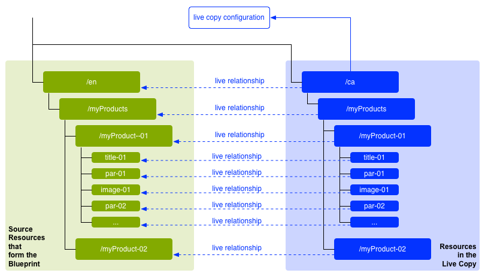
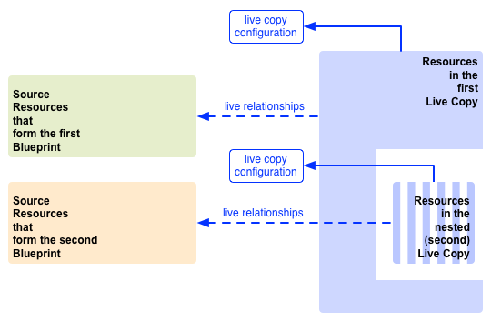

# 콘텐츠 재사용: 다중 사이트 관리자 및 Live Copy{#reusing-content-multi-site-manager-and-live-copy}

MSM(다중 사이트 관리자)을 사용하면 여러 위치에서 동일한 사이트 콘텐츠를 사용할 수 있습니다. MSM은 이를 위해 라이브 카피 기능을 사용합니다.

* MSM을 사용하여 다음과 같은 작업을 수행할 수 있습니다.

   * 콘텐츠를 한 번 만든 다음
   * 이 콘텐츠를 같은 사이트의 다른 영역([라이브 카피](#live-copies))에 복사하고 다시 사용합니다.

* 그런 다음 MSM은 소스 콘텐츠와 해당 라이브 카피 간의 (라이브) 관계를 유지하여 다음 작업을 수행합니다.

   * 소스 콘텐츠를 변경하면 소스 및 라이브 카피가 동기화되어 라이브 카피에도 이러한 변경 사항을 적용합니다.
   * 개별 하위 페이지, 구성 요소 또는 둘 다에 대한 라이브 관계의 연결 해제하여 라이브 카피의 콘텐츠를 조정할 수 있습니다. 이렇게 하면 소스에 대한 변경 사항이 라이브 카피에 더 이상 적용되지 않습니다.

이 페이지와 다음 페이지에서는 관련 문제를 다룹니다.

* [Live Copy 생성 및 동기화](/help/sites-administering/msm-livecopy.md)
* [Live Copy 개요 콘솔](/help/sites-administering/msm-livecopy-overview.md)
* [Live Copy 동기화 구성](/help/sites-administering/msm-sync.md)
* [MSM 롤아웃 충돌](/help/sites-administering/msm-rollout-conflicts.md)
* [MSM 모범 사례](/help/sites-administering/msm-best-practices.md)

## 가능한 시나리오 {#possible-scenarios}

MSM 및 라이브 카피에 대한 많은 사용 사례가 있으며 일부 시나리오는 다음과 같습니다.

* **다국적 - 글로벌 기업에서 로컬 회사까지**

  MSM이 지원하는 대표적인 사용 사례는 여러 다국적 동일 언어 사이트에서 콘텐츠를 재사용하는 것입니다. 이렇게 하면 핵심 콘텐츠를 재사용할 수 있는 동시에 전국적인 변형을 만들 수 있습니다.

  예를 들어 We.Retail 참조 사이트 샘플의 영어 섹션은 미국에 있는 고객을 위해 만들어집니다. 이 사이트의 대부분의 콘텐츠는 다른 국가 및 문화의 영어권 고객을 위한 다른 We.Retail 사이트에도 사용할 수 있습니다. 핵심 콘텐츠는 모든 사이트에 걸쳐 동일하게 유지되는 반면 지역적인 조정을 수행할 수 있습니다.

  다음 구조는 미국, 영국, 캐나다 및 호주의 사이트에 사용할 수 있습니다.

  ```xml
  /content
      |- we.retail
          |- language-masters
              |- en
      |- we.retail
          |- us
              |- en
      |- we.retail
          |- gb
              |- en
      |- we.retail
          |- ca
              |- en
      |- we.retail
          |- au
              |- en
  ```

  >[!NOTE]
  >
  >MSM은 콘텐츠를 번역하지 않습니다. 필요한 구조를 만들고 콘텐츠를 배포하는 데 사용됩니다.
  >
  >
  >이 예제를 확장하려면 [다국어 사이트를 위한 콘텐츠 번역](/help/sites-administering/translation.md)을 참조하세요.

* **국제적 - 본사부터 지역 지사까지**

  또는 대리점 네트워크를 보유한 회사는 본사에서 제공하는 기본 사이트의 변형으로 개별 대리점을 위한 별도의 웹 사이트를 원할 수 있습니다. 이는 여러 지역 사무소가 있는 단일 회사 또는 중앙 프랜차이즈 본사와 여러 지역 프랜차이즈로 구성된 국제적인 프랜차이즈 시스템에 대한 것일 수 있습니다.

  본사는 핵심 정보를 제공할 수 있지만, 지역 엔티티는 여기에 연락처 세부 정보, 영업 시간 및 이벤트와 같은 로컬 정보를 추가할 수 있습니다.

  ```xml
  /content
      |- head-office-Berlin
      |- branch-Hamburg
      |- branch-Stuttgart
      |- branch-Munich
      |- branch-Frankfurt
  ```

* **여러 버전**

  또는 MSM을 사용하여 특정 하위 분기의 버전을 만들 수 있습니다. 예를 들어, 특정 제품의 다른 버전에 대한 세부 정보가 들어 있는 지원 하위 사이트입니다. 여기서 기본 정보는 일정하게 유지되며 업데이트된 기능만 변경해야 합니다.

  ```xml
  /content
      |- support
          |- product X
              |- v5.0
              |- v4.0
              |- v3.0
              |- v2.0
              |- v1.0
  ```

  >[!NOTE]
  >
  >이러한 시나리오에서는 단순 복사본을 만들지 또는 라이브 복사본을 사용할지 여부를 결정해야 합니다.
  >
  >다음과 같은 문제가 있습니다.
  >
  >  * 여러 버전에 걸쳐 업데이트해야 하는 핵심 콘텐츠 양.
  >
  >및
  >
  >  * 조정해야 하는 개별 사본 수입니다.

## UI의 MSM {#msm-from-the-ui}

MSM은 적절한 콘솔에서 다양한 옵션을 사용하여 UI에서 직접 액세스할 수 있습니다. 소개를 받으려면 다음과 같이 주요 위치를 나열합니다.

* **사이트 생성** (**Sites**)

   * MSM은 일반적인 콘텐츠를 공유하는 여러 웹 사이트를 관리하는 데 도움이 됩니다. 예를 들어 웹 사이트는 대부분의 콘텐츠가 모든 국가에 공통적으로 제공되고 각 개별 국가에 특정된 콘텐츠의 하위 집합이 있는 경우가 많습니다. MSM을 사용하면 [원본 사이트를 기반으로 하나 이상의 사이트를 자동으로 업데이트하는 라이브 카피를 만들 수 있습니다](/help/sites-administering/msm-livecopy.md#creating-a-live-copy-of-a-site-from-a-blueprint-configuration). 또한 이를 통해 일반적인 기본 구조를 적용하고, 여러 사이트에서 일반적인 콘텐츠를 사용하고, 일반적인 모양과 느낌을 유지하고, 사이트 간에 실제로 차이가 있는 콘텐츠를 관리하는 데 노력을 기울일 수 있습니다.
   * 소스를 지정하려면 사전 정의된 블루프린트 구성이 필요합니다.
   * (사전 정의된) 소스의 라이브 카피를 만듭니다.
   * 사용자에게 **롤아웃** 단추를 제공합니다.

* **Live Copy 만들기** (**Sites**)

   * MSM을 사용하면 [웹 사이트의 개별 페이지 또는 하위 분기에 대한 임시(일회성) 라이브 카피를 만들 수 있습니다](/help/sites-administering/msm-livecopy.md#creating-a-live-copy-of-a-page). 예를 들어 하위 분기를 복제하여 제품의 새/업데이트 버전에 대한 정보를 제공할 수 있습니다.
   * 애드혹 라이브 카피가 생성됩니다(블루프린트 구성은 필요하지 않음).
   * 페이지/분기의 라이브 카피를 만드는 데 (즉시) 사용할 수 있습니다.
   * **동기화**&#x200B;가 필요합니다(**롤아웃** 버튼은 제공되지 않음).

* **속성 보기** (**Sites**)

   * 필요한 경우 이 옵션은 관련 **Live Copy** y 또는 **블루프린트**&#x200B;에 대한 정보를 제공하여 [Live Copy를 모니터링](/help/sites-administering/msm-livecopy.md#monitoring-your-live-copy)하는 데 도움이 됩니다.

* **참조** (**Sites**)

   * [참조](/help/sites-authoring/basic-handling.md#references) 레일은 적절한 작업에 대한 액세스 권한과 함께 **Live Copy**&#x200B;에 대한 정보를 제공합니다.

* **Live Copy 개요** (**Sites**)

   * 이 콘솔을 통해 [블루프린트 및 해당 라이브 카피를 보고 관리](/help/sites-administering/msm-livecopy-overview.md)할 수 있습니다.

* **블루프린트** (**도구** - **Sites**)

   * 이 콘솔을 통해 [블루프린트 구성을 만들고 관리](/help/sites-administering/msm-livecopy.md#creating-a-blueprint-configuration)할 수 있습니다.

>[!NOTE]
>
>MSM은 경험(페이지)의 일부이므로 페이지와 [경험 조각](/help/sites-authoring/experience-fragments.md) 모두에서 사용할 수 있습니다.

>[!NOTE]
>
>MSM 기능은 여러 다른 AEM(Adobe Experience Manager) 기능(예: 론치, 카탈로그)에 사용됩니다. 이러한 경우 라이브 카피는 해당 기능에 의해 관리됩니다.

### 사용된 용어 {#terms-used}

다음 표에서는 MSM에서 사용되는 주요 용어에 대한 개요를 제공하며, 이에 대해서는 후속 섹션 및 페이지에서 자세히 설명합니다.

<table>
 <tbody>
  <tr>
   <td><strong>용어</strong></td>
   <td><strong>정의</strong></td>
   <td><strong>추가 세부 정보</strong></td>
  </tr>
  <tr>
   <td><strong>소스</strong></td>
   <td>원본 페이지입니다.</td>
   <td>블루프린트 및/또는 블루프린트 페이지의 동의어입니다.</td>
  </tr>
  <tr>
   <td><strong>Live Copy</strong></td>
   <td>롤아웃 구성에서 정의된 동기화 작업에 의해 관리되는 (소스의) 사본. </td>
   <td> </td>
  </tr>
  <tr>
   <td><strong>Live Copy 구성</strong></td>
   <td>라이브 카피에 대한 구성 세부 정보의 정의입니다.</td>
   <td> </td>
  </tr>
  <tr>
   <td><strong>라이브 관계</strong><br /> </td>
   <td>지정된 리소스에 대한 상속의 유효한 정의, 원본 및 라이브 카피 간의 연결.<br /> </td>
   <td>소스에 적용된 변경 내용을 라이브 카피와 동기화할 수 있습니다.</td>
  </tr>
  <tr>
   <td><strong>블루프린트</strong></td>
   <td>Source의 동의어입니다.</td>
   <td>블루프린트 구성으로 정의할 수 있습니다.</td>
  </tr>
  <tr>
   <td><strong>블루프린트 구성</strong></td>
   <td>소스 경로를 지정하는 사전 정의된 구성입니다.</td>
   <td>블루프린트 구성에서 블루프린트 페이지가 참조되면 롤아웃 명령을 사용할 수 있습니다.</td>
  </tr>
  <tr>
   <td><strong>동기화</strong></td>
   <td>소스와 라이브 카피 간의 콘텐츠 동기화를 나타내는 일반 용어입니다(<strong>롤아웃</strong> 및 <strong>동기화</strong> 모두 사용).</td>
   <td> </td>
  </tr>
  <tr>
   <td><strong>롤아웃</strong><br /> </td>
   <td>소스에서 라이브 카피로 동기화합니다.<br /> 블루프린트 페이지의 작성자 또는 시스템 이벤트(롤아웃 구성에서 정의됨)에 의해 트리거될 수 있습니다.</td>
   <td> </td>
  </tr>
  <tr>
   <td><strong>롤아웃 구성</strong></td>
   <td>동기화되는 속성, 방법 및 시기를 결정하는 규칙입니다.</td>
   <td> </td>
  </tr>
  <tr>
   <td><strong>동기화</strong></td>
   <td>라이브 카피 페이지에서 수행된 수동 동기화 요청입니다.</td>
   <td> </td>
  </tr>
  <tr>
   <td><strong>상속</strong></td>
   <td>라이브 카피 페이지/구성 요소는 동기화가 발생할 때 소스 페이지/구성 요소에서 콘텐츠를 상속합니다.</td>
   <td> </td>
  </tr>
  <tr>
   <td><strong>일시 중단</strong></td>
   <td>라이브 카피와 블루프린트 페이지 간의 라이브 관계를 일시적으로 제거합니다.</td>
   <td> </td>
  </tr>
  <tr>
   <td><strong>분리</strong></td>
   <td>라이브 카피와 블루프린트 페이지 간의 라이브 관계를 영구적으로 제거합니다.</td>
   <td> </td>
  </tr>
  <tr>
   <td><strong>재설정</strong></td>
   <td><p>라이브 카피 페이지를 재설정하여 다음 작업을 수행합니다.</p>
    <ul>
     <li>모든 상속 취소 제거 및 <br /> </li>
     <li>페이지를 소스 페이지와 동일한 상태로 되돌리기</li>
    </ul> <p>재설정은 페이지 속성, 단락 시스템 및 구성 요소에 적용한 변경 내용에 영향을 줍니다.</p> </td>
   <td> </td>
  </tr>
  <tr>
   <td><strong>약식</strong></td>
   <td>단일 페이지의 라이브 카피.</td>
   <td> </td>
  </tr>
  <tr>
   <td><strong>딥</strong></td>
   <td>하위 페이지를 포함하는 페이지의 라이브 카피.</td>
   <td> </td>
  </tr>
 </tbody>
</table>

>[!NOTE]
>
>개체 이름은 [Java™ API 개요](/help/sites-developing/extending-msm.md#overview-of-the-java-api)를 참조하십시오.

## Live Copy {#live-copies}

MSM 라이브 카피는 원본 소스와의 라이브 관계가 유지되는 특정 사이트 콘텐츠의 사본입니다.

* 라이브 카피는 소스에서 콘텐츠를 상속합니다.
* 동기화는 소스가 변경될 때 실제 콘텐츠 이전을 수행합니다.
* 라이브 카피는 다음 중 하나로 간주할 수 있습니다.

   * 약식: 단일 페이지
   * 딥: 하위 페이지를 포함하는 페이지

* 동기화 규칙 - 롤아웃 구성은 동기화할 속성 및 동기화 시기를 결정합니다.

이전의 예에서는 `/content/we-retail/language-masters/en`이 영어로 작성된 글로벌 마스터 사이트입니다. 이 사이트의 콘텐츠를 재사용하기 위해 MSM 라이브 카피가 생성됩니다.

* `/content/we-retail/language-masters/en` 아래의 콘텐츠는 소스입니다.

* `/content/we-retail/language-masters/en` 아래의 콘텐츠가 `/content/we-retail/us/en/`, `/content/we-retail/gb/en`, `/content/we-retail/ca/en` 및 `/content/we-retail/au/en` 노드 아래에 복사되었습니다. 라이브 카피입니다.

* 작성자는 `/content/we-retail/language-masters/en` 아래의 페이지를 변경할 수 있습니다.
* 트리거되면 MSM은 이러한 변경 내용을 라이브 카피에 동기화합니다.

### Live Copy - 구성 {#live-copies-composition}

>[!NOTE]
>
>이 섹션의 다이어그램 및 설명은 잠재적 라이브 카피의 스냅샷을 나타냅니다. 이 스냅샷은 포괄적이지는 않지만 특정 특성을 강조하는 개요를 제공합니다.

처음 라이브 카피를 만들 때 선택한 소스 페이지는 라이브 카피에 1:1 기준으로 반영됩니다. 이후 라이브 카피 내에서 직접 새 리소스(페이지 및/또는 단락)를 만들 수도 있으므로, 이러한 변형이 동기화에 미치는 영향을 알아두는 것이 좋습니다. 가능한 구성은 다음과 같습니다.

* [Live Copy가 아닌 페이지를 포함하는 Live Copy](#live-copy-with-non-live-copy-pages)
* [중첩 Live Copy](#nested-live-copies)

라이브 카피의 기본 형식은 다음과 같습니다.

* 선택한 소스 페이지를 1:1 기준으로 반영하는 라이브 카피 페이지.
* 1개의 구성 정의
* 모든 리소스에 대해 정의된 라이브 관계:

   * 라이브 카피 리소스를 해당 블루프린트/소스와 연결합니다.
   * 상속 및 롤아웃을 실현할 때 사용됩니다.

* 변경 내용은 요구 사항에 따라 [동기화](/help/sites-administering/msm-livecopy.md#synchronizing-your-live-copy)될 수 있습니다.



#### Live Copy가 아닌 페이지를 포함하는 Live Copy {#live-copy-with-non-live-copy-pages}

AEM에서 라이브 카피를 만들 때 라이브 카피 분기를 확인하고 탐색할 수 있으며 라이브 카피 분기에 일반 AEM 기능을 사용할 수 있습니다. 즉, 사용자(또는 프로세스)는 라이브 카피 분기 내에 리소스(페이지, 단락 또는 둘 다)를 만들 수 있습니다. 예: `myCanadaOnlyProduct`

* 이러한 리소스는 소스/블루프린트 페이지와 라이브 관계가 없으며 동기화되지 않습니다.
* MSM이 특수 사례로 처리하는 시나리오가 발생할 수 있습니다. 예를 들어 사용자(또는 프로세스)가 소스/블루프린트 및 라이브 카피 분기에 위치 및 이름이 동일한 페이지를 만드는 경우. 이러한 상황에 대한 자세한 내용은 [MSM 롤아웃 충돌](/help/sites-administering/msm-rollout-conflicts.md)을 참조하십시오.


#### 중첩 Live Copy {#nested-live-copies}

사용자(또는 프로세스)가 기존 Live Copy 내에서 [페이지를 만들 때](#live-copy-with-non-live-copy-pages), 이 새 페이지를 다른 블루프린트의 Live Copy로 설정할 수도 있습니다. 이를 중첩 라이브 카피라고 합니다. 두 번째(내부) 라이브 카피의 비헤이비어는 다음과 같은 방식으로 첫 번째(외부) 라이브 카피의 영향을 받습니다.

* 최상위 라이브 카피에 대해 트리거된 딥 롤아웃은 중첩 라이브 카피로 계속 실행될 수 있습니다(예: 트리거가 일치하는 경우).
* 소스 간의 모든 링크는 라이브 카피 내에서 다시 작성됩니다.

  예를 들어 두 번째 블루프린트에서 첫 번째 블루프린트로 연결되는 링크는 중첩된/두 번째 라이브 카피에서 첫 번째 라이브 카피로 연결되는 링크로 다시 작성됩니다.



>[!NOTE]
>
>라이브 카피 분기 내에서 페이지를 이동/이름 변경하는 경우 (내부적으로) 이 페이지는 AEM에서 관계를 추적할 수 있도록 중첩 라이브 카피로 처리됩니다.

#### 누적 Live Copy {#stacked-live-copies}

라이브 카피를 약식 라이브 카피의 하위 항목으로 생성할 때 이를 누적 라이브 카피라고 합니다. [중첩 Live Copy](#nested-live-copies)과(와) 같은 방식으로 동작합니다.

### Source, 블루프린트 및 블루프린트 구성 {#source-blueprints-and-blueprint-configurations}

모든 페이지 또는 페이지 분기를 라이브 카피의 소스로 사용할 수 있습니다.

그러나 MSM을 사용하면 소스 경로를 지정하는 블루프린트 구성을 정의할 수도 있습니다. 블루프린트 구성을 사용할 때의 이점은 다음과 같습니다.

* 작성자는 블루프린트의 **롤아웃** 옵션을 사용하여 이 블루프린트에서 상속되는 라이브 카피에 대한 수정 사항을 (명시적으로) 푸시할 수 있습니다.
* 작성자는 **사이트 만들기**&#x200B;를 사용할 수 있습니다. 이를 통해 사용자는 손쉽게 언어를 선택하고 라이브 카피 구조를 구성할 수 있습니다.
* 블루프린트와 연결된 라이브 카피에 대한 기본 롤아웃 구성을 정의할 수 있습니다.

라이브 카피의 소스는 일반 페이지이거나 블루프린트 구성으로 인해 포함된 페이지일 수 있습니다. 둘 다 유효한 사용 사례입니다.

소스는 라이브 카피의 블루프린트를 형성합니다. 다음의 경우 블루프린트가 정의됩니다.

* [블루프린트 구성 만들기](/help/sites-administering/msm-livecopy.md#creating-a-blueprint-configuration)

  이 구성은 라이브 카피를 만드는 데 사용할 페이지를 미리 정의합니다.

* [페이지의 라이브 카피 만들기](/help/sites-administering/msm-livecopy.md#creating-a-live-copy-of-a-page)

  라이브 카피를 만드는 데 사용되는 페이지(소스 페이지)는 블루프린트 페이지입니다.

  소스 페이지는 블루프린트 구성에서 참조되거나 참조되지 않을 수 있습니다.

### 롤아웃 및 동기화 {#rollout-and-synchronize}

롤아웃은 라이브 카피를 해당 소스와 동기화하는 중앙 집중식 MSM 작업입니다. 롤아웃은 수동으로 수행하거나 자동으로 수행할 수 있습니다.

* [롤아웃 구성](#rollout-configurations)을 정의하여 특정 [이벤트](/help/sites-administering/msm-sync.md#rollout-triggers)가 롤아웃을 자동으로 발생시킬 수 있도록 할 수 있습니다.
* 블루프린트 페이지를 작성할 때 [롤아웃](/help/sites-administering/msm-livecopy.md#rolling-out-a-blueprint) 명령을 사용하여 변경 내용을 라이브 카피로 푸시할 수 있습니다.

  **롤아웃** 명령은 블루프린트 구성에서 참조되는 블루프린트 페이지에서 사용할 수 있습니다.

  

* 라이브 카피 페이지를 작성할 때 [동기화](/help/sites-administering/msm-livecopy.md#synchronizing-a-live-copy) 명령을 사용하여 변경 내용을 소스에서 라이브 카피로 가져올 수 있습니다.

  **동기화** 명령은 원본/블루프린트 페이지가 블루프린트 구성에 포함되는지 여부에 관계없이 항상 Live Copy 페이지에서 사용할 수 있습니다.

  

### 롤아웃 구성 {#rollout-configurations}

롤아웃 구성은 라이브 카피가 소스 콘텐츠와 동기화되는 시기와 방법을 정의합니다. 롤아웃 구성은 트리거와 하나 이상의 동기화 작업으로 구성됩니다.

* **트리거**

  트리거는 소스 페이지 활성화와 같이 라이브 작업 동기화를 발생시키는 이벤트입니다. MSM은 사용할 수 있는 트리거를 정의합니다.

* **동기화 작업**

  라이브 카피에서 수행되어 이를 소스와 동기화합니다. 콘텐츠 복사, 하위 노드 순서 지정, 라이브 카피 페이지 활성화 등의 작업을 예로 들 수 있습니다. MSM은 몇 가지 동기화 작업을 제공합니다.

  >[!NOTE]
  >
  >Java™ API를 사용하여 인스턴스에 대한 사용자 지정 작업을 만들 수 있습니다.

두 개 이상의 라이브 카피가 동일한 롤아웃 구성을 사용할 수 있도록 롤아웃 구성을 재사용할 수 있습니다. 표준 설치에는 여러 [롤아웃 구성](/help/sites-administering/msm-sync.md#installed-rollout-configurations)이 포함되어 있습니다.

### 롤아웃 충돌 {#rollout-conflicts}

특히 작성자가 소스와 라이브 카피의 콘텐츠를 모두 편집할 때 롤아웃이 복잡해질 수 있으므로 AEM에서 롤아웃 중에 발생할 수 있는 [충돌을 처리하는 방법](/help/sites-administering/msm-rollout-conflicts.md)을 알아두는 것이 좋습니다.

### 상속 및 동기화 일시 중단 및 취소 {#suspending-and-cancelling-inheritance-and-synchronization}

라이브 카피의 각 페이지 및 구성 요소는 라이브 관계를 통해 소스 페이지 및 구성 요소와 연결됩니다. 라이브 관계는 소스의 라이브 카피 콘텐츠 동기화를 구성합니다.

페이지 속성 및 구성 요소를 변경할 수 있도록 라이브 카피 페이지에 대한 라이브 카피 상속을 **일시 중단**&#x200B;할 수 있습니다. 상속을 일시 중단하면 페이지 속성 및 구성 요소는 더 이상 소스와 동기화되지 않습니다.

개별 페이지 편집 시 작성자는 구성 요소에 대한 **상속을 취소**&#x200B;할 수 있습니다. 상속이 취소되면 라이브 관계가 일시 중단되고 해당 구성 요소에 대한 동기화가 수행되지 않습니다. 상속 및 동기화 취소는 콘텐츠의 하위 섹션을 사용자 정의해야 할 때 유용합니다.

### Live Copy 분리 {#detaching-a-live-copy}

블루프린트에서 [Live Copy를 분리](/help/sites-administering/msm-livecopy.md#detaching-a-live-copy)하여 모든 연결을 제거할 수도 있습니다.

>[!CAUTION]
>
>분리 작업은 영구적이며 취소가 불가능합니다.

분리 는 라이브 카피와 블루프린트 페이지 간의 라이브 관계를 영구적으로 제거합니다. 모든 MSM 관련 속성이 라이브 카피에서 제거되며 라이브 카피 페이지는 독립형 사본이 됩니다.

>[!NOTE]
>
>하위 페이지 및 상위 페이지에 미치는 영향을 포함한 자세한 내용은 [Live Copy 분리](/help/sites-administering/msm-livecopy.md#detaching-a-live-copy)를 참조하십시오.

## MSM 사용을 위한 표준 단계 {#standard-steps-for-using-msm}

다음 단계에서는 MSM을 사용하여 콘텐츠를 재사용하고 라이브 카피에 대한 변경 사항을 동기화하는 표준 절차를 설명합니다.

1. 소스 사이트의 콘텐츠를 개발합니다.
1. 사용할 롤아웃 구성을 결정합니다.

   1. MSM [다양한 사용 사례를 충족할 수 있는 여러 롤아웃 구성을 설치](/help/sites-administering/msm-sync.md#installed-rollout-configurations)합니다.
   1. 필요한 경우 [롤아웃 구성을 만들](/help/sites-administering/msm-sync.md#creating-a-rollout-configuration)수 있습니다.

1. [사용할 롤아웃 구성을 지정](/help/sites-administering/msm-sync.md#specifying-the-rollout-configurations-to-use)해야 하는 위치를 결정하고 필요에 따라 구성합니다.
1. 필요한 경우 Live Copy의 소스 콘텐츠를 식별하는 [블루프린트 구성을 만듭니다](/help/sites-administering/msm-livecopy.md#creating-a-blueprint-configuration).
1. [Live Copy 만들기](/help/sites-administering/msm-livecopy.md#creating-a-live-copy).
1. 필요에 따라 소스 콘텐츠를 변경합니다. 조직에서 설정한 일반적인 콘텐츠 검토 및 승인 프로세스를 사용합니다.
1. [블루프린트를 롤아웃](/help/sites-administering/msm-livecopy.md#rolling-out-a-blueprint)하거나 변경 내용으로 [Live Copy를 동기화](/help/sites-administering/msm-livecopy.md#synchronizing-a-live-copy)합니다.

## MSM 맞춤화 {#customizing-msm}

MSM은 콘텐츠를 공유할 때 발생할 수 있는 예외적인 복잡성에 맞게 구현을 조정할 수 있는 도구를 제공합니다.

* **사용자 지정 롤아웃 구성**
  설치된 롤아웃 구성이 요구 사항에 맞지 않으면 [롤아웃 구성을 만듭니다](/help/sites-administering/msm-sync.md#creating-a-rollout-configuration). 사용할 수 있는 모든 롤아웃 트리거 및 동기화 작업을 사용할 수 있습니다.

* **사용자 지정 동기화 작업**
  설치된 작업이 특정 응용 프로그램 요구 사항을 충족하지 않는 경우 [사용자 지정 동기화 작업을 만듭니다](/help/sites-developing/extending-msm.md#creating-a-new-synchronization-action). MSM은 사용자 지정 동기화 작업을 생성하기 위한 Java™ API를 제공합니다.

## 모범 사례 {#best-practices}

[MSM 모범 사례](/help/sites-administering/msm-best-practices.md) 페이지에는 구현과 관련된 중요한 정보가 포함되어 있습니다.
