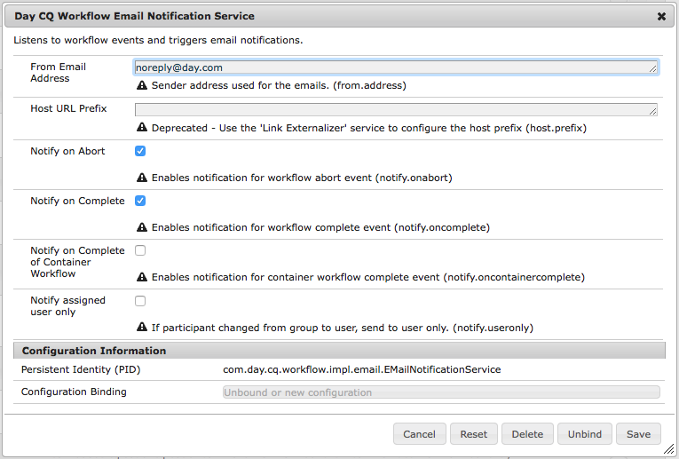

# 전자 메일 알림 구성{#configuring-email-notification}

AEM에서 다음과 같은 사용자에게 이메일 알림을 보냅니다.

* 수정 또는 복제와 같은 페이지 이벤트에 가입했습니다. [알림 받은 편지함](/help/sites-classic-ui-authoring/author-env-inbox.md#subscribing-to-notifications) 섹션에서는 이러한 이벤트에 가입하는 방법을 설명합니다.

* 포럼 이벤트를 구독했습니다.
* 워크플로우에서 단계를 수행해야 합니다. [참가자 단계](/help/sites-developing/workflows-step-ref.md#participant-step) 섹션에서는 워크플로우에서 이메일 알림을 트리거하는 방법을 설명합니다.

전제 조건:

* 사용자의 프로필에 유효한 이메일 주소가 정의되어 있어야 합니다.
* **일 CQ 메일 서비스**&#x200B;를 올바르게 구성해야 합니다.

사용자에게 알림이 전송되면 프로필에 정의된 언어로 이메일을 받게 됩니다. 각 언어에는 사용자 지정할 수 있는 자체 템플릿이 있습니다. 새 언어에 대한 새 이메일 템플릿을 추가할 수 있습니다.

>[!NOTE]
>
>AEM을 사용하여 작업하는 경우 이러한 서비스에 대한 구성 설정을 관리하는 방법에는 몇 가지가 있습니다.자세한 내용 및 권장 방법은 [OSGi](/help/sites-deploying/configuring-osgi.md) 구성 을 참조하십시오.

## 메일 서비스 {#configuring-the-mail-service} 구성

AEM에서 이메일을 보낼 수 있으려면 **일 CQ 메일 서비스**&#x200B;를 올바르게 구성해야 합니다. 웹 콘솔에서 구성을 볼 수 있습니다. AEM을 사용하여 작업하는 경우 이러한 서비스에 대한 구성 설정을 관리하는 방법에는 몇 가지가 있습니다.자세한 내용 및 권장 방법은 [OSGi](/help/sites-deploying/configuring-osgi.md) 구성 을 참조하십시오.

다음 제한 사항이 적용됩니다.

* **SMTP 서버 포트**&#x200B;는 25 이상이어야 합니다.

* **SMTP 서버 호스트 이름**&#x200B;은 비워 둘 수 없습니다.
* **&quot;보낸 사람&quot; 주소**&#x200B;은 비워 둘 수 없습니다.

**일 CQ 메일 서비스**&#x200B;에서 문제를 디버깅하는 데 도움이 되도록 서비스 로그를 볼 수 있습니다.

`com.day.cq.mailer.DefaultMailService`

구성은 웹 콘솔에서 다음과 같습니다.


## 전자 메일 알림 채널 구성 {#configuring-the-email-notification-channel}

페이지 또는 포럼 이벤트 알림을 구독하면 보낸 메일 주소가 기본적으로 `no-reply@acme.com`(으)로 설정됩니다. 웹 콘솔에서 **알림 이메일 채널** 서비스를 구성하여 이 값을 변경할 수 있습니다.

이메일 주소를 구성하려면 `sling:OsgiConfig` 노드를 저장소에 추가합니다. CRXDE Lite을 사용하여 노드를 직접 추가하려면 다음 절차를 따르십시오.

1. CRXDE Lite에서 응용 프로그램 폴더 아래에 `config` 폴더를 추가합니다.
1. 구성 폴더에서 다음 노드를 추가합니다.

   `com.day.cq.wcm.notification.email.impl.EmailChannel` 유형  `sling:OsgiConfig`

1. `String` 속성을 `email.from` 노드에 추가합니다. 값에 사용할 이메일 주소를 지정합니다.

1. **모두 저장**&#x200B;을 클릭합니다.

다음 절차를 사용하여 컨텐츠 패키지 소스 폴더에서 노드를 정의합니다.

1. `jcr_root/apps/*app_name*/config folder`에서 `com.day.cq.wcm.notification.email.impl.EmailChannel.xml` 파일을 만듭니다.

1. 노드를 나타내려면 다음 XML을 추가하십시오.

   `<?xml version="1.0" encoding="UTF-8"?> <jcr:root xmlns:sling="https://sling.apache.org/jcr/sling/1.0" xmlns:jcr="https://www.jcp.org/jcr/1.0" jcr:primaryType="sling:OsgiConfig" email.from="name@server.com"/>`
1. `email.from` 속성( `name@server.com`)의 값을 이메일 주소로 바꿉니다.

1. 파일을 저장합니다.

## 워크플로우 전자 메일 알림 서비스 구성 {#configuring-the-workflow-email-notification-service}

워크플로우 이메일 알림을 받으면 보낸 사람 이메일 주소와 호스트 URL 접두사가 모두 기본값으로 설정됩니다. 웹 콘솔에서 **일 CQ 워크플로우 이메일 알림 서비스**&#x200B;를 구성하여 이러한 값을 변경할 수 있습니다. 이 경우 리포지토리에서 변경 사항을 유지하는 것이 좋습니다.

기본 구성은 웹 콘솔에서 다음과 같습니다.



### 페이지 알림용 이메일 템플릿 {#email-templates-for-page-notification}

페이지 알림용 이메일 템플릿은 아래에 있습니다.

`/etc/notification/email/default/com.day.cq.wcm.core.page`

기본 영어 템플릿( `en.txt`)은 다음과 같이 정의됩니다.

```xml
subject=[CQ Page Event Notification]: Page Event

header=-------------------------------------------------------------------------------------\n \
Time: ${time}\n \
User: ${userFullName} (${userId})\n \
-------------------------------------------------------------------------------------\n\n

message=The following pages were affected by the event: \n \
 \n \
${modifications} \n \
 \n\n
footer=\n \
-------------------------------------------------------------------------------------\n \
This is an automatically generated message. Please do not reply.
```

#### 페이지 알림에 대한 이메일 템플릿 사용자 정의 {#customizing-email-templates-for-page-notification}

페이지 알림에 대한 영어 이메일 템플릿을 사용자 지정하는 방법은 다음과 같습니다.

1. CRXDE에서 파일을 엽니다.

   `/etc/notification/email/default/com.day.cq.wcm.core.page/en.txt`

1. 필요에 따라 파일을 수정합니다.
1. 변경 사항을 저장합니다.

템플릿에는 다음 형식이 있어야 합니다.

```
 subject=<text_1>
 header=<text_2>
 message=<text_3>
 footer=<text_4>
```

여기서 &lt;text_x>는 정적 텍스트와 동적 문자열 변수를 혼합하여 사용할 수 있습니다. 페이지 알림의 이메일 템플릿 내에서 다음 변수를 사용할 수 있습니다.

* `${time}`, 이벤트 날짜 및 시간을 지정합니다.

* `${userFullName}`: 이벤트를 트리거한 사용자의 전체 이름입니다.

* `${userId}`: 이벤트를 트리거한 사용자의 ID입니다.
* `${modifications}`에서는 페이지 이벤트 유형 및 페이지 경로를 형식으로 설명합니다.

   &lt;page event=&quot;&quot; type=&quot;&quot;> =>  &lt;page path=&quot;&quot;>

   예:

   PageModified => /content/geometrixx/en/products

### 포럼 알림용 전자 메일 템플릿 {#email-templates-for-forum-notification}

포럼 알림용 이메일 템플릿은 다음 위치에 있습니다.

`/etc/notification/email/default/com.day.cq.collab.forum`

기본 영어 템플릿( `en.txt`)은 다음과 같이 정의됩니다.

```xml
subject=[CQ Forum Notification]

header=-------------------------------------------------------------------------------------\n \
Time: Time: ${time}\n \
Forum Page Path: ${forum.path}\n \
-------------------------------------------------------------------------------------\n\n

message=Page: ${host.prefix}${forum.path}.html\n

footer=\n \
-------------------------------------------------------------------------------------\n \
This is an automatically generated message. Please do not reply.
```

#### 포럼 알림에 대한 이메일 템플릿 사용자 정의 {#customizing-email-templates-for-forum-notification}

포럼 알림에 대한 영어 이메일 템플릿을 사용자 지정하려면 다음을 수행하십시오.

1. CRXDE에서 파일을 엽니다.

   `/etc/notification/email/default/com.day.cq.collab.forum/en.txt`

1. 필요에 따라 파일을 수정합니다.
1. 변경 사항을 저장합니다.

템플릿에는 다음 형식이 있어야 합니다.

```
 subject=<text_1>
 header=<text_2>
 message=<text_3>
 footer=<text_4>
```

여기서 `<text_x>`은 정적 텍스트와 동적 문자열 변수를 혼합하여 사용할 수 있습니다.

포럼 알림에 대해 이메일 템플릿 내에서 다음 변수를 사용할 수 있습니다.

* `${time}`, 이벤트 날짜 및 시간을 지정합니다.

* `${forum.path}`를 채울 수 있습니다.

### 워크플로우 알림용 이메일 템플릿 {#email-templates-for-workflow-notification}

워크플로우 알림에 대한 이메일 템플릿(영어)은 다음 위치에 있습니다.

`/etc/workflow/notification/email/default/en.txt`

다음과 같이 정의됩니다.

```xml
subject=Workflow notification: ${event.EventType}

header=-------------------------------------------------------------------------------------\n \
Time: ${event.TimeStamp}\n \
Step: ${item.node.title}\n \
User: ${participant.name} (${participant.id})\n \
Workflow: ${model.title}\n \
-------------------------------------------------------------------------------------\n\n

message=Content: ${host.prefix}${payload.path.open}\n

footer=\n \
-------------------------------------------------------------------------------------\n \
View the overview in your ${host.prefix}/aem/inbox\n \
-------------------------------------------------------------------------------------\n \
This is an automatically generated message. Please do not reply.
```

#### 워크플로우 알림에 대한 이메일 템플릿 사용자 정의 {#customizing-email-templates-for-workflow-notification}

워크플로우 이벤트 알림에 대한 영어 이메일 템플릿을 사용자 정의하려면

1. CRXDE에서 파일을 엽니다.

   `/etc/workflow/notification/email/default/en.txt`

1. 필요에 따라 파일을 수정합니다.
1. 변경 사항을 저장합니다.

템플릿에는 다음 형식이 있어야 합니다.

```
subject=<text_1>
 header=<text_2>
 message=<text_3>
 footer=<text_4>
```

>[!NOTE]
>
>여기서 `<text_x>`은 정적 텍스트와 동적 문자열 변수를 혼합하여 사용할 수 있습니다. `<text_x>` 항목의 각 행은 마지막 인스턴스를 제외하고, 백슬래시가 없으면 `<text_x>` 문자열 변수의 끝을 나타내는 경우 백슬래시( `\`)로 끝나야 합니다.
>
>템플릿 형식에 대한 자세한 내용은 Properties.load()](https://docs.oracle.com/javase/8/docs/api/java/util/Properties.html#load-java.io.InputStream-) 메서드의 [javadocs에서 찾을 수 있습니다.

`${payload.path.open}` 메서드는 작업 항목의 페이로드에 대한 경로를 표시합니다. 예를 들어 Sites의 페이지에 대해 `payload.path.open`은 `/bin/wcmcommand?cmd=open&path=…`과 비슷합니다.;서버 이름이 없으므로 템플릿에서 `${host.prefix}` 접두사가 붙습니다.

이메일 템플릿 내에서 다음 변수를 사용할 수 있습니다.

* `${event.EventType}`, 이벤트 유형
* `${event.TimeStamp}`, 이벤트 날짜 및 시간
* `${event.User}`, 이벤트를 트리거한 사용자
* `${initiator.home}`, 개시자 노드 경로

* `${initiator.name}`, 이니시에이터 이름

* `${initiator.email}`, 개시자의 이메일 주소
* `${item.id}`, 작업 항목의 id
* `${item.node.id}`, 이 작업 항목과 연결된 워크플로우 모델의 노드 id
* `${item.node.title}`, 작업 항목의 제목
* `${participant.email}`, 참가자의 이메일 주소
* `${participant.name}`, 참여자의 이름
* `${participant.familyName}`, 참여자의 가족명
* `${participant.id}`, 참여자의 id
* `${participant.language}`, 참가자 언어
* `${instance.id}`, 워크플로우 id
* `${instance.state}`, 워크플로우 상태
* `${model.title}`, 워크플로우 모델의 제목
* `${model.id}`, 워크플로우 모델의 id

* `${model.version}`, 워크플로우 모델의 버전
* `${payload.data}`, 페이로드

* `${payload.type}`, 페이로드 유형
* `${payload.path}`, 페이로드 경로
* `${host.prefix}`, 호스트 접두사, 예:http://localhost:4502

### 새 언어 {#adding-an-email-template-for-a-new-language}에 대한 이메일 템플릿 추가

새 언어의 템플릿을 추가하려면 다음을 수행합니다.

1. CRXDE에서 아래 `<language-code>.txt` 파일을 추가합니다.

   * `/etc/notification/email/default/com.day.cq.wcm.core.page` :페이지 알림용
   * `/etc/notification/email/default/com.day.cq.collab.forum` :포럼 알림용
   * `/etc/workflow/notification/email/default` :워크플로우 알림용

1. 언어에 맞게 파일을 조정합니다.
1. 변경 사항을 저장합니다.

>[!NOTE]
>
>전자 메일 템플릿의 파일 이름으로 사용되는 `<language-code>`은 AEM에서 인식하는 두 글자의 소문자 언어 코드여야 합니다. 언어 코드의 경우 AEM은 ISO-639-1을 사용합니다.

## AEM Assets 이메일 알림 구성 {#assetsconfig}

AEM Assets의 컬렉션이 공유되거나 공유되지 않으면 사용자는 AEM에서 이메일 알림을 받을 수 있습니다. 이메일 알림을 구성하려면 다음 단계를 수행합니다.

1. [메일 서비스 구성](/help/sites-administering/notification.md#configuring-the-mail-service)에 설명된 대로 이메일 서비스를 구성합니다.
1. 관리자로 AEM에 로그인합니다. **도구** > **작업** > **웹 콘솔**&#x200B;을 클릭하여 웹 콘솔 구성을 엽니다.
1. **일 CQ DAM 리소스 컬렉션 서블릿**&#x200B;을 편집합니다. **전자 메일 보내기**&#x200B;를 선택합니다. **저장**&#x200B;을 클릭합니다.
