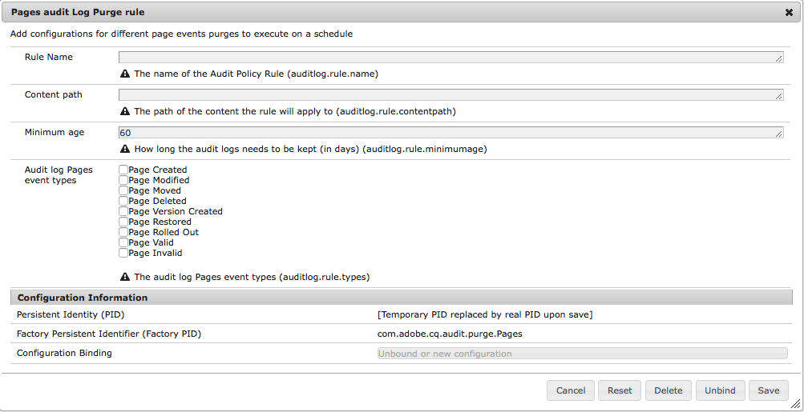

# AEM 6의 감사 로그 유지 관리{#audit-log-maintenance-in-aem}

감사 로깅에 적합한 AEM 이벤트는 많이 보관된 데이터를 생성합니다. 복제, 자산 업로드 및 기타 시스템 작업으로 인해 시간이 지남에 따라 이러한 데이터가 빠르게 증가할 수 있습니다.

감사 로그 유지 관리에는 특정 정책에 따라 감사 로그 유지 관리를 자동화할 수 있는 몇 가지 기능이 포함되어 있습니다.

구성 가능한 주별 유지 관리 작업으로 구현되며 Operations Dashboard 모니터링 콘솔을 통해 액세스할 수 있습니다.

자세한 내용은 [Operations Dashboard 설명서](/help/sites-administering/operations-dashboard.md).

감사 로그 삭제 옵션에는 다음 세 가지 유형이 있습니다.

1. [페이지 감사 로그 삭제](/help/sites-administering/operations-audit-log.md#configure-page-audit-log-purging)
1. [DAM 감사 로그 삭제](/help/sites-administering/operations-audit-log.md#configure-dam-audit-log-purging)
1. [복제 감사 로그 사용](/help/sites-administering/operations-audit-log.md#configure-replication-audit-log-purging)

각 구성 요소는 AEM 웹 콘솔에서 규칙을 만들어 구성할 수 있습니다. 구성된 후에는 **도구 - 작업 - 유지 관리 - 주간 유지 관리 창** 그리고 실행 **감사 로그 유지 관리 작업**.

## 페이지 감사 로그 삭제 구성 {#configure-page-audit-log-purging}

감사 로그 삭제를 구성하려면 다음 단계를 수행합니다.

1. 브라우저를 가리키면 웹 콘솔 관리자로 이동합니다. `http://localhost:4502/system/console/configMgr/`

1. 라는 항목을 검색합니다. **페이지 감사 로그 제거 규칙** 클릭하여 선택합니다.

   

1. 그런 다음 요구 사항에 따라 제거 스케줄러를 구성합니다. 사용 가능한 옵션은 다음과 같습니다.

   * **규칙 이름:** 감사 정책 규칙의 이름
   * **컨텐츠 경로:** 규칙이 적용될 컨텐츠의 경로:
   * **최소 연령:** 감사 로그를 유지해야 하는 시간(일)
   * **감사 로그 유형:** 제거해야 하는 감사 로그 유형입니다.

   >[!NOTE]
   >
   >컨텐츠 경로는 `/var/audit/com.day.cq.wcm.core.page` 노드에 대한 섹션을 참조하십시오.

1. 규칙을 저장합니다.
1. 방금 만든 규칙을 실행하려면 작업 대시보드에 노출되어야 합니다. 이렇게 하려면 **도구 - 작업 - 유지 관리** AEM 시작 화면에서 클릭합니다.

1. 누르기 **주간 유지 관리 기간** 카드.

1. 유지 관리 작업은 **감사 로그 유지 관리 작업** 카드.

   

1. 다음 실행 날짜를 검사하거나, 구성하거나, 재생 단추를 눌러 수동으로 실행할 수 있습니다.

AEM 6.3에서 감사 로그 삭제 작업이 완료되기 전에 예약된 유지 관리 창이 닫히면 작업이 자동으로 중지됩니다. 다음 유지 관리 창이 열리면 다시 시작됩니다.

**AEM 6.5 사용**&#x200B;을 눌러 실행 중인 감사 로그 삭제 작업을 수동으로 중지할 수 있습니다. **정지** 아이콘. 다음 실행 시 작업이 안전하게 재개됩니다.

>[!NOTE]
>
>유지 관리 작업을 중지하려면 이미 진행 중인 작업 추적을 손실하지 않고 실행을 일시 중지해야 합니다.

## DAM 감사 로그 삭제 구성 {#configure-dam-audit-log-purging}

1. 의 시스템 콘솔로 이동합니다. *https://&lt;serveraddress>:&lt;serverport>/system/console/configMgr*
1. 검색 대상 **DAM 감사 로그 제거** 규칙을 선택하고 결과를 클릭합니다.
1. 다음 창에서 그에 따라 규칙을 구성합니다. 옵션은 다음과 같습니다.

   * **규칙 이름:** 감사 정책 규칙의 이름
   * **컨텐츠 경로:** 규칙이 적용될 컨텐츠의 경로
   * **최소 연령:** 감사 로그를 유지해야 하는 시간(일)
   * **감사 로그 Dam 이벤트 유형:** 제거해야 하는 DAM 감사 이벤트 유형입니다.

1. 클릭 **저장** 구성을 저장하려면

## 복제 감사 로그 제거 구성  {#configure-replication-audit-log-purging}

1. 의 시스템 콘솔로 이동합니다. *https://&lt;serveraddress>:&lt;serverport>/system/console/configMgr*
1. 검색 대상 **복제 감사 로그 제거 스케줄러** 결과를 클릭하고
1. 다음 창에서 그에 따라 규칙을 구성합니다. 옵션은 다음과 같습니다.

   * **규칙 이름:** 감사 정책 규칙의 이름
   * **컨텐츠 경로:** 규칙이 적용될 컨텐츠의 경로
   * **최소 연령:** 감사 로그를 유지해야 하는 시간(일)
   * **감사 로그 복제 이벤트 유형:** 제거해야 하는 복제 감사 이벤트 유형

1. 클릭 **저장** 구성을 저장합니다.
