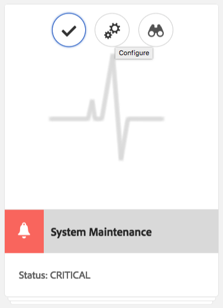
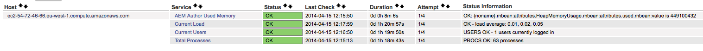
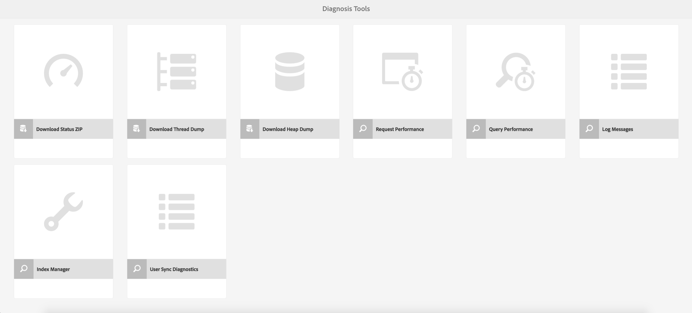
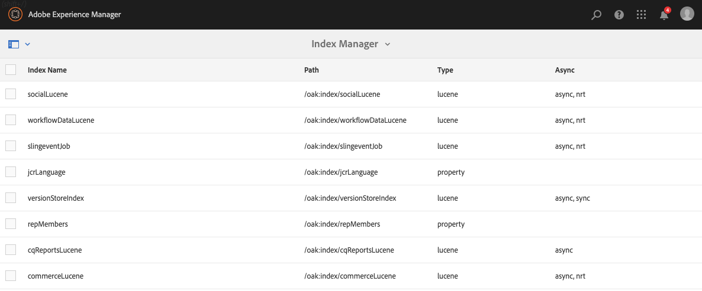
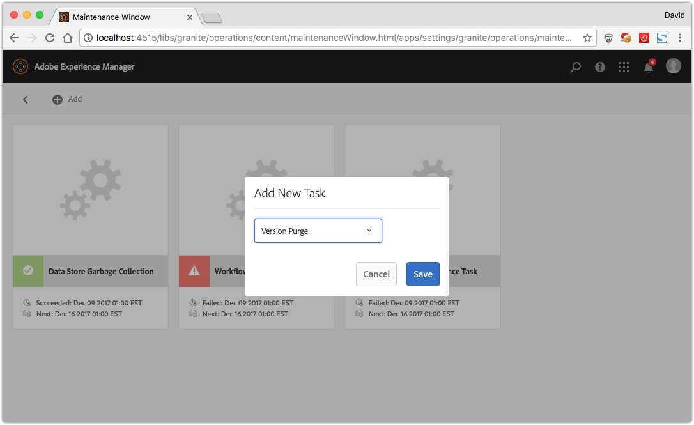

# 작업 대시보드 {#operations-dashboard}

## 소개 {#introduction}

AEM 6의 Operations Dashboard를 사용하면 시스템 운영자가 AEM 시스템 상태를 한 눈에 모니터링할 수 있습니다. 또한 AEM의 관련 측면에 대한 자동 생성된 진단 정보를 제공하고 자체 포함된 유지 관리 자동화를 구성 및 실행하여 프로젝트 작업 및 지원 사례를 크게 줄일 수 있습니다. 작업 대시보드는 사용자 지정 상태 확인 및 유지 관리 작업으로 확장할 수 있습니다. 또한 JMX를 통해 외부 모니터링 도구에서 Operations Dashboard 데이터에 액세스할 수 있습니다.

**작업 대시보드:**

* 한 번의 클릭으로 운영 부서가 효율성을 높일 수 있는 시스템 상태
* 중앙 관리 방식으로 시스템 상태 개요를 제공합니다.
* 문제 찾기, 분석 및 수정 시간 단축
* 프로젝트 작업 비용을 크게 절감할 수 있는 자체 유지 관리 자동화 제공

AEM 시작 화면에서 **도구** - **작업**&#x200B;으로 이동하여 액세스할 수 있습니다.

>[!NOTE]
>
>작업 대시보드에 액세스하려면 로그인한 사용자가 &quot;연산자&quot; 사용자 그룹의 일부여야 합니다. 자세한 내용은 [사용자, 그룹 및 액세스 권한 관리](/help/sites-administering/user-group-ac-admin.md)에 대한 설명서를 참조하십시오.

## 상태 보고서 {#health-reports}

상태 보고서 시스템은 Sling 상태 검사를 통해 AEM 인스턴스의 상태에 대한 정보를 제공합니다. OSGI, JMX, HTTP 요청(JSON을 통해) 또는 터치 UI를 통해 수행할 수 있습니다. 또한 구성 가능한 특정 카운터의 측정값과 임계값을 제공하며 경우에 따라 문제를 해결하는 방법에 대한 정보를 제공합니다.

여기에는 아래에 설명된 몇 가지 기능이 있습니다.

## 상태 검사 {#health-checks}

**상태 보고서**&#x200B;는 특정 제품 영역과 관련하여 좋은 상태 또는 나쁜 상태를 나타내는 카드 시스템입니다. 이러한 카드는 JMX 및 기타 소스의 데이터를 집계하고 처리된 정보를 다시 MBean으로 노출하는 Sling 상태 확인의 시각화입니다. 이러한 MBean은 [JMX 웹 콘솔](/help/sites-administering/jmx-console.md)의 **org.apache.sling.healcheck** 도메인에서 검사할 수도 있습니다.

상태 보고서 인터페이스는 AEM 시작 화면의 **도구** - **작업** - **상태 보고서** 메뉴를 통해 또는 다음 URL을 통해 직접 액세스할 수 있습니다.

`https://<serveraddress>:port/libs/granite/operations/content/healthreports/healthreportlist.html`


카드 시스템은 다음과 같은 세 가지 가능한 상태를 노출합니다.**OK**, **WARN** 및 **CRITICAL**. 상태는 규칙 및 임계값의 결과이며, 마우스로 카드를 가리키고 작업 표시줄에서 톱니바퀴 아이콘을 클릭하여 구성할 수 있습니다.



### 상태 확인 유형 {#health-check-types}

AEM 6에는 두 가지 유형의 건강 검사가 있습니다.

1. 개별 상태 검사
1. 복합 상태 검사

**개별 상태 확인**&#x200B;은 상태 카드에 해당하는 단일 상태 검사입니다. 개별 상태 검사는 규칙이나 임계값으로 구성할 수 있으며 식별된 상태 문제를 해결하기 위한 하나 이상의 힌트 및 링크를 제공할 수 있습니다. &quot;오류 로그&quot; 검사를 예로 들어보겠습니다.인스턴스 로그에 ERROR 항목이 있으면 상태 확인의 세부 정보 페이지에서 해당 항목을 찾을 수 있습니다. 페이지 상단에는 진단 도구 섹션에 &quot;로그 메시지&quot; 분석기에 대한 링크가 표시됩니다. 이 링크를 통해 이러한 오류를 보다 자세히 분석하고 로거를 다시 구성할 수 있습니다.

**복합 상태 검사**&#x200B;는 여러 개별 검사의 정보를 집계하는 검사입니다.

합성 상태 확인은 **필터 태그**&#x200B;의 지원으로 구성됩니다. 기본적으로 동일한 필터 태그가 있는 모든 단일 검사는 합성 상태 확인으로 그룹화됩니다. 집계된 모든 단일 검사가 OK 상태도 있는 경우에만 복합 상태 확인은 OK 상태를 가집니다.

### 상태 검사를 만드는 방법 {#how-to-create-health-checks}

작업 대시보드에서 개별 상태 검사와 합성 상태 검사 결과를 시각화할 수 있습니다.

### 개별 상태 검사 만들기 {#creating-an-individual-health-check}

개별 상태 확인을 만드는 작업에는 2가지 단계가 포함됩니다.Sling 상태 확인 구현 및 대시보드의 구성 노드에서 상태 확인에 대한 항목 추가

1. Sling 상태 확인을 만들려면 Sling HealthCheck 인터페이스를 구현하는 OSGI 구성 요소를 만들어야 합니다. 이 구성 요소를 번들 내에 추가합니다. 구성 요소의 속성은 상태 확인을 완전히 식별합니다. 구성 요소가 설치되면 상태 확인을 위해 JMX MBean이 자동으로 생성됩니다. 자세한 내용은 [Sling 상태 확인 설명서](https://sling.apache.org/documentation/bundles/sling-health-check-tool.html)를 참조하십시오.

   OSGI 서비스 구성 요소 주석으로 작성된 Sling 상태 확인 구성 요소의 예:

   ```java
   @Component(service = HealthCheck.class,
   property = {
       HealthCheck.NAME + "=Example Check",
       HealthCheck.TAGS + "=example",
       HealthCheck.TAGS + "=test",
       HealthCheck.MBEAN_NAME + "=exampleHealthCheckMBean"
   })
    public class ExampleHealthCheck implements HealthCheck {
       @Override
       public Result execute() {
           // health check code
       }
    }
   ```

   >[!NOTE]
   >
   >`MBEAN_NAME` 속성은 이 상태 확인을 위해 생성할 mbean의 이름을 정의합니다.

1. 상태 확인을 만든 후 작업 대시보드 인터페이스에서 액세스할 수 있도록 새 구성 노드를 만들어야 합니다. 이 단계를 수행하려면 상태 확인의 JMX Mbean 이름(`MBEAN_NAME` 속성)을 알아야 합니다. 상태 확인에 대한 구성을 만들려면 CRXDE를 열고 다음 경로 아래에 새 노드(예: **nt:unstructured** 유형)를 추가합니다.`/apps/settings/granite/operations/hc`

   새 노드에서 다음 속성을 설정해야 합니다.

   * **이름:** `sling:resourceType`

      * **유형:** `String`
      * **값:** `granite/operations/components/mbean`
   * **이름:** `resource`

      * **유형:** `String`
      * **값:** `/system/sling/monitoring/mbeans/org/apache/sling/healthcheck/HealthCheck/exampleHealthCheck`

   >[!NOTE]
   >
   >위의 리소스 경로는 다음과 같이 만들어집니다.상태 확인의 mbean 이름이 &quot;test&quot;인 경우 경로 `/system/sling/monitoring/mbeans/org/apache/sling/healthcheck/HealthCheck` 끝에 &quot;test&quot;를 추가합니다.
   >
   >따라서 최종 경로는 다음과 같습니다.
   >
   >`/system/sling/monitoring/mbeans/org/apache/sling/healthcheck/HealthCheck/test`

   >[!NOTE]
   >
   >`/apps/settings/granite/operations/hc` 경로에 다음 속성이 true로 설정되어 있는지 확인합니다.
   >
   >
   >`sling:configCollectionInherit`
   >
   >`sling:configPropertyInherit`
   >
   >
   >그러면 구성 관리자가 새 구성을 `/libs`의 기존 구성과 병합하도록 지시합니다.

### 합성 상태 검사 만들기 {#creating-a-composite-health-check}

Composite Health Check의 역할은 일련의 공통 기능을 공유하는 여러 개의 개별 상태 검사를 집계하는 것입니다. 예를 들어 보안 복합 상태 검사는 보안 관련 확인을 수행하는 모든 개별 상태 검사를 그룹화합니다. 복합 검사를 만들기 위한 첫 번째 단계는 새 OSGI 구성을 추가하는 것입니다. Operations Dashboard에 표시하려면 간단한 확인을 위해 했던 것과 동일한 방식으로 새 구성 노드를 추가해야 합니다.

1. OSGI 콘솔의 웹 구성 관리자로 이동합니다. 이 작업은 `https://serveraddress:port/system/console/configMgr`에 액세스하여 수행할 수 있습니다.
1. **Apache Sling 합성 상태 검사**&#x200B;라는 항목을 검색합니다. 이 구성 요소를 확인한 후 사용할 수 있는 구성이 두 개 있습니다.시스템 검사와 보안 검사에 대한 다른 검사용입니다.
1. 구성의 오른쪽에 있는 &quot;+&quot; 단추를 눌러 새 구성을 만듭니다. 아래와 같이 새 창이 나타납니다.

   

1. 구성을 만들고 저장합니다. 새 구성으로 Mbean이 만들어집니다.

   각 구성 속성의 목적은 다음과 같습니다.

   * **이름(hc.name):** 복합 상태 확인의 이름입니다. 의미 있는 이름을 사용하는 것이 좋습니다.
   * **태그(hc.tags):** 이 상태 확인에 대한 태그입니다. 이 합성 상태 검사가 다른 합성 상태 확인(예: 상태 확인 계층)의 일부일 경우 이 합성이 관련된 태그를 추가합니다.
   * **MBean 이름(hc.mbean.name):** 이 합성 상태 확인의 JMX MBean에 제공될 Mbean의 이름입니다.
   * **필터 태그(filter.tags):** 복합 상태 확인에 관련된 속성입니다. 합성이 집계해야 하는 태그입니다. 합성 상태 검사는 이 합성의 필터 태그와 일치하는 태그가 있는 모든 상태 검사를 그룹 아래에 집계합니다. 예를 들어 필터 태그 **test** 및 **check**&#x200B;가 있는 합성 상태 확인은 해당 태그 속성( `hc.tags`)에 **test** 및 **check** 태그가 있는 모든 개인 및 복합 상태 검사를 집계합니다.

   >[!NOTE]
   >
   >Apache Sling Composite Health Check의 새로운 각 구성에 대해 새 JMX Mbean이 생성됩니다.**

1. 마지막으로 방금 만들어진 복합 상태 확인 항목을 작업 대시보드 구성 노드에 추가해야 합니다. 이 절차는 개별 상태 검사와 동일합니다.`/apps/settings/granite/operations/hc` 아래에 **nt:unstructured** 유형의 노드를 만들어야 합니다. 노드의 리소스 속성은 OSGI 구성에서 **hc.mean.name** 값으로 정의됩니다.

   예를 들어 구성을 만들고 **hc.mbean.name** 값을 **diskusage**&#x200B;으로 설정하면 구성 노드가 다음과 같이 표시됩니다.

   * **이름:** `Composite Health Check`

      * **유형:** `nt:unstructured`

   다음 속성을 사용합니다.

   * **이름:** `sling:resourceType`

      * **유형:** `String`
      * **값:** `granite/operations/components/mbean`
   * **이름:** `resource`

      * **유형:** `String`
      * **값:** `/system/sling/monitoring/mbeans/org/apache/sling/healthcheck/HealthCheck/diskusage`

   >[!NOTE]
   >
   >기본적으로 대시보드에 이미 있는 합성 확인 아래에 논리적으로 속하는 개별 상태 검사를 만드는 경우, 이러한 상태 확인은 자동으로 캡처되고 각 합성 검사 아래에 그룹화됩니다. 이러한 검사 때문에 이러한 검사에 대해 새 구성 노드를 만들 필요가 없습니다.
   >
   >예를 들어 개별 보안 상태 검사를 만드는 경우 해야 할 일은 &quot;**security**&quot; 태그에 할당하기만 하면 이 태그가 설치되고 Operations Dashboard의 보안 검사 합성 확인 아래에 자동으로 표시됩니다.

### AEM {#health-checks-provided-with-aem}에 제공된 상태 검사

<table>
 <tbody>
  <tr>
   <td><strong>zHealthcheck 이름</strong></td>
   <td><strong>설명</strong></td>
  </tr>
  <tr>
   <td>쿼리 성능</td>
   <td><p>이 상태 검사는 AEM 6.4</strong>에서 <strong>간소화되었으며, 이제 최근에 리팩토링한 <code>Oak QueryStats</code> MBean, 보다 구체적으로 <code>SlowQueries </code>특성을 확인합니다. 통계에 슬로우 쿼리가 포함되어 있으면 상태 검사가 경고를 반환합니다. 그렇지 않으면 OK 상태를 반환합니다.<br /> </strong></p> <p>이 상태 확인에 대한 MBean은 <a href="http://localhost:4502/system/console/jmx/org.apache.sling.healthcheck%3Aname%3DqueriesStatus%2Ctype%3DHealthCheck">org.apache.sling.healcheck:name=queriesStatus,type=HealthCheck</a>입니다.</p> </td>
  </tr>
  <tr>
   <td>관찰 큐 길이</td>
   <td><p>모든 이벤트 리스너 및 백그라운드 옵저버에 대해 관측 큐 길이가 반복되며, 해당 <code>queueSize </code>을 <code>maxQueueSize</code> 및 다음 항목을 비교합니다.</p>
    <ul>
     <li><code>queueSize</code> 값이 <code>maxQueueSize</code> 값을 초과하는 경우(이벤트를 삭제할 때) 중요한 상태를 반환합니다.</li>
     <li><code>queueSize</code> 값이 <code>maxQueueSize * WARN_THRESHOLD</code> 위에 있는 경우 경고(기본값은 0.75)를 반환합니다. </li>
    </ul> <p>각 큐의 최대 길이는 별도의 구성(Oak 및 AEM)에서 생성되며 이 상태 검사에서는 구성할 수 없습니다. 이 상태 확인에 대한 MBean은 <a href="http://localhost:4502/system/console/jmx/org.apache.sling.healthcheck%3Aname%3DObservationQueueLengthHealthCheck%2Ctype%3DHealthCheck">org.apache.sling.healcheck:name=ObservationQueueLengthHealthCheck,type=HealthCheck</a>입니다.</p> </td>
  </tr>
  <tr>
   <td>쿼리 순회 제한</td>
   <td><p>쿼리 순회 제한은 <code>QueryEngineSettings</code> MBean, 특히 <code>LimitInMemory</code> 및 <code>LimitReads</code> 특성을 확인하고 다음 상태를 반환합니다.</p>
    <ul>
     <li>제한 중 하나가 <code>Integer.MAX_VALUE</code></li>
     <li>제한 중 하나가 10000 이하일 경우 경고 상태를 반환합니다(Oak에서 권장 설정).</li>
     <li><code>QueryEngineSettings</code> 또는 제한을 검색할 수 없는 경우 위험 상태를 반환합니다.</li>
    </ul> <p>이 상태 확인의 Mbean은 <a href="http://localhost:4502/system/console/jmx/org.apache.sling.healthcheck%3Aname%3DqueryTraversalLimitsBundle%2Ctype%3DHealthCheck">org.apache.sling.healcheck:name=queryTransversalLimitsBundle,type=HealthCheck</a>입니다.</p> </td>
  </tr>
  <tr>
   <td>동기화된 시계</td>
   <td><p>이 확인은 <a href="https://github.com/apache/sling-old-svn-mirror/blob/4df9ab2d6592422889c71fa13afd453a10a5a626/bundles/extensions/discovery/oak/src/main/java/org/apache/sling/discovery/oak/SynchronizedClocksHealthCheck.java">document nodestore 클러스터</a>에만 적용됩니다. 다음 상태를 반환합니다.</p>
    <ul>
     <li>인스턴스 시계가 동기화되지 않고 미리 정의된 낮은 임계값을 초과할 때 경고 상태를 반환합니다.</li>
     <li>인스턴스 시계가 동기화되지 않고 미리 정의된 높은 임계값을 초과할 때 중요 상태를 반환합니다.</li>
    </ul> <p>이 상태 확인의 Mbean은 <a href="http://localhost:4502/system/console/jmx/org.apache.sling.healthcheck%3Aname%3DslingDiscoveryOakSynchronizedClocks%2Ctype%3DHealthCheck">org.apache.sling.healcheck:name=slingDiscoveryOakSynchronizedClicks,type=HealthCheck</a>입니다.</p> </td>
  </tr>
  <tr>
   <td>비동기 색인</td>
   <td><p>비동기 인덱스 확인:</p>
    <ul>
     <li>하나 이상의 인덱싱 레인이 실패하는 경우 중요한 상태를 반환합니다.</li>
     <li>모든 인덱싱 레인에 대해 <code>lastIndexedTime</code> 확인 및:
      <ul>
       <li>2시간 이전의 경우 중요 상태를 반환합니다. </li>
       <li>2시간에서 45분 전이면 경고 상태를 반환합니다. </li>
       <li>45분 전의 경우 OK 상태를 반환합니다. </li>
      </ul> </li>
     <li>이러한 조건이 충족되지 않으면 OK 상태가 반환됩니다.</li>
    </ul> <p>중요 및 경고 상태 임계값을 모두 구성할 수 있습니다. 이 상태 확인에 대한 Mbean은 <a href="http://localhost:4502/system/console/jmx/org.apache.sling.healthcheck%3Aname%3DasyncIndexHealthCheck%2Ctype%3DHealthCheck">org.apache.sling.healcheck:name=asyncIndexHealthCheck,type=HealthCheck</a>입니다.</p> <p><strong>참고: </strong>이 상태 검사는 AEM 6.4에서 사용할 수 있으며 AEM 6.3.0.1으로 지원됩니다.</p> </td>
  </tr>
  <tr>
   <td>큰 Lucene 색인</td>
   <td><p>이 검사는 <code>Lucene Index Statistics</code> MBean에 의해 노출된 데이터를 사용하여 큰 인덱스를 식별하고 반환합니다.</p>
    <ul>
     <li>문서가 10억 개 이상인 인덱스가 있는 경우 경고 상태</li>
     <li>15억 개 이상의 문서가 있는 인덱스가 있는 경우 중요한 상태</li>
    </ul> <p>임계값은 구성할 수 있으며 상태 확인을 위한 MBean은 <a href="http://localhost:4502/system/console/jmx/org.apache.sling.healthcheck%3Aname%3DlargeIndexHealthCheck%2Ctype%3DHealthCheck">org.apache.sling.healcheck:name=largeIndexHealthCheck,type=HealthCheck.</a></p> <p><strong>참고: </strong>이 확인은 AEM 6.4에서 사용할 수 있으며 AEM 6.3.2.0으로 지원됩니다.</p> </td>
  </tr>
  <tr>
   <td>시스템 유지 관리</td>
   <td><p>시스템 유지 관리는 모든 유지 관리 작업이 구성된 대로 실행 중인 경우 확인을 반환하는 복합 검사입니다. 다음 사항에 주의하십시오.</p>
    <ul>
     <li>각 유지 관리 작업에는 관련 상태 검사가 수반됩니다.</li>
     <li>작업이 유지 관리 창에 추가되지 않으면 상태 검사가 [중요]로 반환됩니다.</li>
     <li>감사 로그 및 워크플로우 제거 유지 관리 작업을 구성하거나 유지 관리 창에서 제거해야 합니다. 구성되지 않은 상태로 두면, 이러한 작업은 처음 시도한 실행 시 실패하므로 시스템 유지 관리 검사가 위험 상태를 반환합니다.</li>
     <li><strong>AEM 6.4</strong>에서는 Lucene 바이너리  <a href="/help/sites-administering/operations-dashboard.md#automated-maintenance-tasks">Maintenancentack도 </a> 제공됩니다</li>
     <li>AEM 6.2 이하에서는 작업이 실행되지 않으므로 시스템 유지 관리 검사가 시작 후 경고 상태를 반환합니다. 6.3부터 첫 번째 유지 관리 창에 아직 도달하지 않았으면 확인을 다시 받게 됩니다.</li>
    </ul> <p>이 상태 확인에 대한 MBean은 <a href="http://localhost:4502/system/console/jmx/org.apache.sling.healthcheck%3Aname%3Dsystemchecks%2Ctype%3DHealthCheck">org.apache.sling.healcheck:name=systemchecks,type=HealthCheck</a>입니다.</p> </td>
  </tr>
  <tr>
   <td>복제 큐</td>
   <td><p>이 검사는 복제 에이전트를 반복 실행하고 대기열을 확인합니다. 큐 맨 위에 있는 항목의 경우 이 검사는 에이전트가 복제를 다시 시도한 횟수를 확인합니다. 에이전트가 <code>numberOfRetriesAllowed</code> 매개 변수의 값보다 큰 복제를 다시 시도하면 경고가 반환됩니다. <code>numberOfRetriesAllowed</code> 매개 변수는 구성할 수 있습니다. </p> <p>이 상태 확인에 대한 MBean은 <a href="http://localhost:4502/system/console/jmx/org.apache.sling.healthcheck%3Aname%3DreplicationQueue%2Ctype%3DHealthCheck" target="_blank">org.apache.sling.healcheck:name=replicationQueue,type=HealthCheck</a>입니다.</p> </td>
  </tr>
  <tr>
   <td>Sling 작업</td>
   <td>
    <div>
      Sling 작업은 JobManager에서 큐에 있는 작업 수를 확인하고
     <code>maxNumQueueJobs</code> 임계값 및:
    </div>
    <ul>
     <li><code>maxNumQueueJobs</code>을(를) 초과하는 항목이 큐에 있는 경우 중요한 반환</li>
     <li>1시간이 넘는 활성 작업이 장시간 실행되는 경우 매우 중요한 반환</li>
     <li>큐에 대기 중인 작업이 있고 마지막으로 완료된 작업 시간이 1시간 이상인 경우 요현재를 반환합니다.</li>
    </ul> <p>큐에 있는 작업 매개 변수의 최대 수만 구성할 수 있으며 기본값은 1000입니다.</p> <p>이 상태 확인에 대한 MBean은 <a href="http://localhost:4502/system/console/jmx/org.apache.sling.healthcheck%3Aname%3DslingJobs%2Ctype%3DHealthCheck" target="_blank">org.apache.sling.healcheck:name=slingJobs,type=HealthCheck</a>입니다.</p> </td>
  </tr>
  <tr>
   <td>요청 성능</td>
   <td><p>이 확인은 <code>granite.request.metrics.timer</code> <a href="http://localhost:4502/system/console/slingmetrics" target="_blank">Sling 지표 </a>와:</p>
    <ul>
     <li>75번째 백분위수 값이 임계값보다 큰 경우 임계 값을 반환합니다(기본값은 500밀리초).</li>
     <li>75번째 백분위수 값이 경고 임계값을 초과하는 경우 경고(기본값은 200밀리초)를 반환합니다.</li>
    </ul> <p>이 상태 확인에 대한 MBean은 <em> </em><a href="http://localhost:4502/system/console/jmx/org.apache.sling.healthcheck%3Aname%3DrequestsStatus%2Ctype%3DHealthCheck" target="_blank">org.apache.sling.healcheck:name=requestsStatus,type=HealthCheck</a>입니다.</p> </td>
  </tr>
  <tr>
   <td>오류 로그</td>
   <td><p>이 확인은 로그에 오류가 있는 경우 경고 상태를 반환합니다.</p> <p>이 상태 확인에 대한 MBean은 <a href="http://localhost:4502/system/console/jmx/org.apache.sling.healthcheck%3Aname%3DlogErrorHealthCheck%2Ctype%3DHealthCheck" target="_blank">org.apache.sling.healcheck:name=logErrorHealthCheck,type=HealthCheck</a>입니다.</p> </td>
  </tr>
  <tr>
   <td>디스크 공간</td>
   <td><p>디스크 공간 검사는 <code>FileStoreStats</code> MBean을 보고 노드 저장소의 크기와 노드 저장소 파티션의 사용 가능한 디스크 공간을 검색합니다.</p>
    <ul>
     <li>저장소 크기 비율로 사용 가능한 디스크 공간이 경고 임계값보다 작으면 경고(기본값: 10) 을 반환합니다.</li>
     <li>사용 가능한 디스크 공간 대 저장소 크기 비율이 위험 임계값보다 작으면(기본값은 2) 중요한 값을 반환합니다.</li>
    </ul> <p>두 임계값은 모두 구성할 수 있습니다. 이 확인은 세그먼트 저장소가 있는 인스턴스에서만 작동합니다.</p> <p>이 상태 확인을 위한 MBean은 <a href="http://localhost:4502/system/console/jmx/org.apache.sling.healthcheck%3Aname%3DDiskSpaceHealthCheck%2Ctype%3DHealthCheck" target="_blank">org.apache.sling.healcheck:name=DiskSpaceHealthCheck,type=HealthCheck</a>입니다.</p> </td>
  </tr>
  <tr>
   <td>스케줄러 상태 확인</td>
   <td><p>이 확인은 인스턴스에 60초 이상 실행 중인 Quartz 작업이 있는 경우 경고를 반환합니다. 허용되는 지속 시간 임계값을 구성할 수 있습니다.</p> <p>이 상태 확인을 위한 MBean은 <a href="http://localhost:4502/system/console/jmx/org.apache.sling.healthcheck%3Aname%3DslingCommonsSchedulerHealthCheck%2Ctype%3DHealthCheck" target="_blank">org.apache.sling.healcheck:name=slingCommonsSchedulerHealthCheck,type=HealthCheck</a><em>.</em></p> </td>
  </tr>
  <tr>
   <td>보안 확인</td>
   <td><p>보안 검사는 여러 보안 관련 검사의 결과를 집계하는 합성입니다. 이러한 개별 상태 검사는 <a href="/help/sites-administering/security-checklist.md">보안 체크리스트 설명서 페이지에서 사용할 수 있는 보안 체크리스트와 다른 문제를 해결합니다.</a> 이 검사는 인스턴스가 시작될 때 보안 연기 테스트로 유용합니다. </p> <p>이 상태 확인에 대한 MBean은 <a href="http://localhost:4502/system/console/jmx/org.apache.sling.healthcheck%3Aname%3Dsecuritychecks%2Ctype%3DHealthCheck" target="_blank">org.apache.sling.healcheck:name=securitychecks,type=HealthCheck</a></p> </td>
  </tr>
  <tr>
   <td>활성 상태 번들</td>
   <td><p>활성 번들은 모든 번들의 상태와 다음 상태를 확인합니다.</p>
    <ul>
     <li>번들 중 하나라도 활성 상태가 아니거나(지연이 있는 상태에서 시작) 경고 상태를 반환합니다.</li>
     <li>무시 목록의 번들 상태를 무시합니다.</li>
    </ul> <p>ignore 목록 매개 변수를 구성할 수 있습니다.</p> <p>이 상태 확인의 MBean은 <a href="http://localhost:4502/system/console/jmx/org.apache.sling.healthcheck%3Aname%3DinactiveBundles%2Ctype%3DHealthCheck" target="_blank">org.apache.sling.healcheck:name=inactiveBundles,type=HealthCheck</a>입니다.</p> </td>
  </tr>
  <tr>
   <td>코드 캐시 확인</td>
   <td><p>Java 7에 있는 CodeCache 버그를 트리거할 수 있는 여러 JVM 조건을 확인하는 상태 검사입니다.</p>
    <ul>
     <li>코드 캐시 플러시가 활성화된 상태에서 Java 7에서 인스턴스가 실행 중인 경우 경고를 반환합니다.</li>
     <li>인스턴스가 Java 7에서 실행되고 예약된 코드 캐시 크기가 최소 임계값보다 작으면 경고(기본값: 90MB) 반환</li>
    </ul> <p><code>minimum.code.cache.size</code> 임계값은 구성할 수 있습니다. 버그에 대한 자세한 내용은 <a href="https://bugs.java.com/bugdatabase/view_bug.do?bug_id=8012547">이 페이지</a><a href="https://bugs.java.com/bugdatabase/view_bug.do?bug_id=8012547"></a><a href="https://bugs.java.com/bugdatabase/view_bug.do?bug_id=8012547"></a><a href="https://bugs.java.com/bugdatabase/view_bug.do?bug_id=8012547">를 확인하십시오</a>.</p> <p>이 상태 확인의 MBean은 <a href="http://localhost:4502/system/console/jmx/org.apache.sling.healthcheck%3Aname%3DcodeCacheHealthCheck%2Ctype%3DHealthCheck" target="_blank">org.apache.sling.healcheck:name=codeCacheHealthCheck,type=HealthCheck</a>입니다.</p> </td>
  </tr>
  <tr>
   <td>리소스 검색 경로 오류</td>
   <td><p>경로 <code>/apps/foundation/components/primary</code> 및 다음 경로에 리소스가 있는지 확인합니다.</p>
    <ul>
     <li>아래에 하위 노드가 있으면 경고를 반환합니다. <code>/apps/foundation/components/primary</code></li>
    </ul> <p>이 상태 확인에 대한 MBean은 <a href="http://localhost:4502/system/console/jmx/org.apache.sling.healthcheck%3Aname%3DresourceSearchPathErrorHealthCheck%2Ctype%3DHealthCheck" target="_blank">org.apache.sling.healcheck:name=resourceSearchPathErrorHealthCheck,type=HealthCheck</a>입니다.</p> </td>
  </tr>
 </tbody>
</table>

## Nagios를 사용한 모니터링 {#monitoring-with-nagios}

상태 확인 대시보드는 Granite JMX Mbeans를 통해 Nagios와 통합할 수 있습니다. 아래 예제는 AEM을 실행하는 서버에서 사용된 메모리를 표시하는 검사를 추가하는 방법을 보여 줍니다.

1. 모니터링 서버에 Nagios를 설치하고 설치합니다.
1. 그런 다음 NRPE(Nagios Remote Plugin Executor)를 설치합니다.

   >[!NOTE]
   >
   >시스템에 Nagios 및 NRPE를 설치하는 방법에 대한 자세한 내용은 [Nagios 설명서](https://library.nagios.com/library/products/nagioscore/manuals/)를 참조하십시오.

1. AEM 서버에 대한 호스트 정의를 추가합니다. 구성 관리자를 사용하여 Nagios XI 웹 인터페이스를 통해 이 작업을 수행할 수 있습니다.

   1. 브라우저를 열고 Nagios 서버를 가리킵니다.
   1. 상단 메뉴에서 **구성** 단추를 누릅니다.
   1. 왼쪽 창에서 **고급 구성** 아래의 **핵심 구성 관리자**&#x200B;를 누릅니다.
   1. **모니터링** 섹션 아래의 **호스트** 링크를 누릅니다.
   1. 호스트 정의를 추가합니다.

   

   Nagios Core를 사용하는 경우 다음은 호스트 구성 파일의 예입니다.

   ```xml
   define host {
      address 192.168.0.5
      max_check_attempts 3
      check_period 24x7
      check-command check-host-alive
      contacts admin
      notification_interval 60
      notification_period 24x7
   }
   ```

1. AEM 서버에 Nagios 및 NRPE를 설치합니다.
1. 두 서버 모두에 [check_http_json](https://github.com/phrawzty/check_http_json) 플러그인을 설치합니다.
1. 두 서버에서 일반 JSON 검사 명령을 정의합니다.

   ```xml
   define command{
   
       command_name    check_http_json-int
   
       command_line    /usr/lib/nagios/plugins/check_http_json --user "$ARG1$" --pass "$ARG2$" -u 'https://$HOSTNAME$:$ARG3$/$ARG4$' -e '$ARG5$' -w '$ARG6$' -c '$ARG7$'
   
   }
   ```

1. AEM 서버에서 사용된 메모리에 대한 서비스를 추가합니다.

   ```xml
   define service {
   
       use generic-service
   
       host_name my.remote.host
   
       service_description AEM Author Used Memory
   
       check_command  check_http_json-int!<cq-user>!<cq-password>!<cq-port>!system/sling/monitoring/mbeans/java/lang/Memory.infinity.json!{noname}.mbean:attributes.HeapMemoryUsage.mbean:attributes.used.mbean:value!<warn-threshold-in-bytes>!<critical-threshold-in-bytes>
   
       }
   ```

1. 새로 만든 서비스에 대해 Nagios 대시보드를 확인합니다.

   

## 진단 도구 {#diagnosis-tools}

작업 대시보드에서는 상태 확인 대시보드에서 나오는 경고의 근본 원인을 찾고 문제를 해결할 수 있고 시스템 운영자에게 중요한 디버그 정보를 제공하는 데 도움이 되는 진단 도구에 액세스할 수도 있습니다.

가장 중요한 기능은 다음과 같습니다.

* 로그 메시지 분석기
* 더미 및 스레드 덤프에 액세스하는 기능
* 요청 및 쿼리 성능 분석

AEM 시작 화면에서 **도구 - 작업 - 진단**&#x200B;으로 이동하여 진단 도구 화면에 도달할 수 있습니다. 다음 URL에 직접 액세스하여 화면에 액세스할 수도 있습니다.`https://serveraddress:port/libs/granite/operations/content/diagnosis.html`



### 로그 메시지 {#log-messages}

사용자 인터페이스에 기본적으로 모든 ERROR 메시지가 표시됩니다. 더 많은 로그 메시지를 표시하려면 적절한 로그 수준으로 로거를 구성해야 합니다.

로그 메시지는 메모리 내 로그 Appender를 사용하므로 로그 파일과 관련이 없습니다. 다른 문제는 이 UI에서 로그 수준을 변경해도 기존 로그 파일에 로깅되는 정보가 변경되지 않는다는 것입니다. 이 UI에서 로거를 추가 및 제거하면 메모리 내 로거에만 영향을 미칩니다. 또한 로거 구성을 변경하면 향후 in memory logger에 반영될 수 있습니다. 이미 기록되어 있고 관련이 없는 항목은 더 이상 삭제되지 않지만 유사한 항목은 향후 기록되지 않습니다.

UI의 왼쪽 위 톱니바퀴 단추에서 로거 구성을 제공하여 로깅되는 내용을 구성할 수 있습니다. 여기에서 로거 구성을 추가, 제거 또는 업데이트할 수 있습니다. 로거 구성은 **로그 레벨**(WARN / INFO / DEBUG) 및 **필터 이름**&#x200B;으로 구성됩니다. **필터 이름**&#x200B;에는 로깅되는 로그 메시지의 소스를 필터링하는 역할이 있습니다. 또는 로거가 지정된 수준의 모든 로그 메시지를 캡처해야 하는 경우 필터 이름은 &quot;**root**&quot;여야 합니다. 로거 레벨을 설정하면 지정된 메시지보다 높거나 높은 수준의 모든 메시지가 캡처됩니다.

예:

* 모든 **ERROR** 메시지를 캡처할 계획이면 구성이 필요하지 않습니다. 모든 ERROR 메시지는 기본적으로 캡처됩니다.
* 모든 **ERROR**, **WARN** 및 **INFO** 메시지를 캡처할 계획이면 로거 이름은 다음과 같이 설정해야 합니다.&quot;**root**&quot; 및 로거 수준은 다음 위치에 있습니다.**INFO**.

* 특정 패키지(예: com.adobe.granite)에서 오는 모든 메시지를 캡처할 계획이면 로거 이름은 다음과 같이 설정해야 합니다.&quot;com.adobe.granite&quot; 및 로거 수준은 다음과 같습니다.**DEBUG**(아래 이미지에 표시된 대로 모든 **ERROR**, **WARN**, **INFO** 및 **DEBUG** 메시지)가 캡처됩니다.


>[!NOTE]
>
>지정된 필터를 통해 오류 메시지만 캡처하도록 로거 이름을 설정할 수 없습니다. 기본적으로 모든 ERROR 메시지가 캡처됩니다.

>[!NOTE]
>
>로그 메시지 사용자 인터페이스에 실제 오류 로그가 반영되지 않습니다. UI에서 다른 유형의 로그 메시지를 구성하지 않으면 오류 메시지만 표시됩니다. 특정 로그 메시지를 표시하는 방법은 위의 지침을 참조하십시오.

>[!NOTE]
>
>진단 페이지의 설정은 로그 파일에 기록된 내용이나 그 반대로 영향을 주지 않습니다. 따라서 오류 로그에 정보 메시지가 표시되지만 로그 메시지 UI에서는 표시되지 않을 수 있습니다. 또한 UI를 통해 오류 로그에 영향을 주지 않고 특정 패키지에서 DEBUG 메시지를 catch할 수 있습니다. 로그 파일을 구성하는 방법에 대한 자세한 내용은 [로깅](/help/sites-deploying/configure-logging.md)을 참조하십시오.

>[!NOTE]
>
>**AEM 6.4에서는** 유지 관리 작업이 정보 수준에서 보다 다양한 형식의 정보 형식으로 기본 설정으로부터 로그아웃됩니다. 이렇게 하면 유지 관리 작업의 상태를 더 잘 볼 수 있습니다.
>
>제3자 도구(예: Splunk)를 사용하여 유지 관리 작업 활동을 모니터링하고 이에 응답하는 경우 다음 로그 문을 사용할 수 있습니다.

```
Log level: INFO
DATE+TIME [MaintanceLogger] Name=<MT_NAME>, Status=<MT_STATUS>, Time=<MT_TIME>, Error=<MT_ERROR>, Details=<MT_DETAILS>
```

### 요청 성능 {#request-performance}

[요청 성능] 페이지에서는 처리된 가장 느린 페이지 요청을 분석할 수 있습니다. 이 페이지에는 컨텐츠 요청만 등록됩니다. 보다 구체적으로 다음 요청이 캡처됩니다.

1. `/content` 아래의 리소스에 액세스 요청
1. `/etc/design` 아래의 리소스에 액세스 요청
1. `".html"` 확장자를 갖는 요청


페이지가 표시됩니다.

* 요청이 수행된 시간
* URL 및 요청 메서드
* 지속 시간(밀리초)

기본적으로 가장 느린 20개 페이지 요청이 캡처되지만 구성 관리자에서 제한을 수정할 수 있습니다.

### 쿼리 성능 {#query-performance}

[질의 성능] 페이지에서는 시스템에서 수행하는 가장 느린 질의 분석을 수행할 수 있습니다. 이 정보는 JMX Mbean의 저장소에서 제공합니다. Jackrabbit에서 `com.adobe.granite.QueryStat` JMX Mbean은 이 정보를 제공하지만 Oak 저장소에서는 `org.apache.jackrabbit.oak.QueryStats.`이 제공합니다.

페이지가 표시됩니다.

* 쿼리가 수행된 시간
* 쿼리의 언어
* 쿼리를 발행한 횟수
* 쿼리의 문
* 지속 시간(밀리초)


### 쿼리 설명 {#explain-query}

지정된 쿼리에 대해 Oak는 **oak:index** 노드 아래에 있는 저장소에 정의된 Oak 색인을 기반으로 최상의 실행 방법을 알아내려고 합니다. 쿼리에 따라 Oak에서 다른 인덱스를 선택할 수 있습니다. Oak가 쿼리를 실행하는 방식을 이해하는 것은 쿼리를 최적화하는 첫 번째 단계입니다.

쿼리 설명은 Oak에서 쿼리를 실행하는 방법을 설명하는 도구입니다. AEM 시작 화면에서 **도구 - 작업 - 진단**&#x200B;으로 이동한 다음 **쿼리 성능**&#x200B;을 클릭하고 **쿼리 설명** 탭으로 전환하여 액세스할 수 있습니다.

**기능**

* Xpath, JCR-SQL 및 JCR-SQL2 쿼리 언어 지원
* 제공된 쿼리의 실제 실행 시간을 보고합니다.
* 슬로우 쿼리를 감지하고 속도가 느려질 수 있는 쿼리에 대해 경고합니다.
* 쿼리를 실행하는 데 사용된 Oak 인덱스를 보고합니다.
* 실제 Oak 쿼리 엔진 설명을 표시합니다.
* 슬로우 및 인기 있는 쿼리의 클릭투 로드 목록을 제공합니다.

쿼리 설명 UI에 있으면 쿼리를 입력하여 **설명** 단추를 누르는 것이 좋습니다.


쿼리 설명 섹션의 첫 번째 항목은 실제 설명입니다. 설명은 쿼리를 실행하는 데 사용된 인덱스 유형을 보여줍니다.

두 번째 항목은 실행 계획입니다.

쿼리를 실행하기 전에 **실행 시간 포함** 상자를 계속 열면 쿼리가 실행된 시간도 표시되어 응용 프로그램 또는 배포에 대한 인덱스를 최적화하는 데 사용할 수 있는 자세한 정보를 확인할 수 있습니다.


### 인덱스 관리자 {#the-index-manager}

색인 관리자의 목적은 색인 유지 또는 상태 보기와 같은 색인 관리를 용이하게 하는 것입니다.

시작 화면**Tools - Operations - Diagnostics **로 이동한 다음 **Index Manager** 단추를 클릭하여 액세스할 수 있습니다.

이 URL에서 직접 액세스할 수도 있습니다.`https://serveraddress:port/libs/granite/operations/content/diagnosistools/indexManager.html`



UI는 화면의 왼쪽 위 모퉁이에 있는 검색 상자에 필터 기준을 입력하여 테이블의 인덱스를 필터링하는 데 사용할 수 있습니다.

### 다운로드 상태 ZIP {#download-status-zip}

시스템 상태 및 구성에 대한 유용한 정보가 포함된 zip 파일의 다운로드가 트리거됩니다. 아카이브에 인스턴스 구성, 번들 목록, OSGI, Sling 지표 및 통계가 포함되어 있으므로 큰 파일이 생성됩니다. **다운로드 상태 ZIP** 창을 사용하여 큰 상태 파일의 영향을 줄일 수 있습니다. 이 창은 **AEM > 도구 > 작업 > 진단 > 다운로드 상태 ZIP에서 액세스할 수 있습니다.**

이 창에서 내보낼 항목(로그 파일 및 스레드 덤프) 및 현재 날짜에 대한 다운로드에 포함된 로그 일 수를 선택할 수 있습니다.


### 다운로드 스레드 덤프 {#download-thread-dump}

그러면 시스템에 있는 스레드에 대한 정보가 포함된 zip 파일의 다운로드가 트리거됩니다. 상태, 클래스 로더 및 스택 추적과 같은 각 스레드에 대한 정보가 제공됩니다.

### 더미 덤프 다운로드 {#download-heap-dump}

나중에 분석하기 위해 힙의 스냅샷을 다운로드할 수도 있습니다. 이렇게 하면 수백 메가바이트 순서대로 큰 파일의 다운로드가 트리거됩니다.

## 자동 유지 관리 작업 {#automated-maintenance-tasks}

자동 유지 관리 작업 페이지는 정기적인 실행을 위해 예약된 권장 유지 관리 작업을 보고 추적할 수 있는 장소입니다. 작업은 상태 확인 시스템과 통합됩니다. 인터페이스에서 작업을 수동으로 실행할 수도 있습니다.

Operations Dashboard의 유지 관리 페이지로 이동하려면 AEM 시작 화면에서 **도구 - 작업 - 대시보드 - 유지 관리**&#x200B;로 이동하거나 다음 링크를 직접 따라야 합니다.

`https://serveraddress:port/libs/granite/operations/content/maintenance.html`

작업 대시보드에서 다음 작업을 사용할 수 있습니다.

1. **일일 유지 관리 창** 메뉴 아래에 있는 **개정 정리**&#x200B;작업.
1. **일별 유지 관리 창** 메뉴 아래에 있는 **Lucene 이진 파일 정리** 작업
1. **주별 유지 관리 창** 메뉴 아래에 있는 **워크플로 제거** 작업.
1. **주별 유지 관리 창** 메뉴 아래에 있는 **데이터 저장소 가비지 컬렉션** 작업
1. **주별 유지 관리 창** 메뉴 아래에 있는 **감사 로그 유지 관리** 작업입니다.
1. **주별 유지 관리 창** 메뉴 아래에 있는 **버전 제거 유지 관리** 작업

일일 유지 관리 창의 기본 타이밍은 오전 2시에서 5시입니다. 주별 유지 관리 창에서 실행하도록 구성된 작업은 토요일에 오전 1시에서 2시 사이에 실행됩니다.

두 유지 관리 카드 중 하나에서 톱니바퀴 아이콘을 눌러 시간 설정을 구성할 수도 있습니다.


>[!NOTE]
>
>AEM 6.1 이후 기존 유지 관리 윈도우를 매월 실행하도록 구성할 수도 있습니다.

### 개정 정리 {#revision-clean-up}

개정 정리 수행에 대한 자세한 내용은 [이 전용 문서](/help/sites-deploying/revision-cleanup.md)를 참조하십시오.

### Lucene 바이너리 정리 {#lucene-binaries-cleanup}

Lucene 이진 파일 정리 작업을 사용하여 lucene 바이너리를 제거하고 실행 중인 데이터 저장소 크기 요구 사항을 줄일 수 있습니다. 이것은 성공적인 [데이터 저장소 가비지 수집](/help/sites-administering/data-store-garbage-collection.md) 실행에 대한 이전 종속성이 아닌 루센티네의 바이너리 이탈이 매일 다시 청구되기 때문입니다.

유지 관리 작업은 Lucene 관련 수정 가비지를 줄이기 위해 개발되었지만 작업을 실행할 때 일반적인 효율성 향상이 있습니다.

* 매주 데이터 저장소 가비지 수집 작업을 실행하면 보다 빠르게 완료됩니다.
* 또한 전체 AEM 성능을 약간 향상시킬 수 있습니다.

다음 위치에서 Lucene 이진 파일 정리 작업에 액세스할 수 있습니다.**AEM > 도구 > 작업 > 유지 관리 > 일일 유지 관리 창 > Lucene 이진 파일 정리**.

### 데이터 저장소 가비지 컬렉션 {#data-store-garbage-collection}

데이터 저장소 가비지 컬렉션에 대한 자세한 내용은 전용 [설명서 페이지](/help/sites-administering/data-store-garbage-collection.md)를 참조하십시오.

### 워크플로 제거 {#workflow-purge}

워크플로우는 유지 관리 대시보드에서 삭제할 수도 있습니다. 워크플로우 삭제 작업을 실행하려면 다음을 수행해야 합니다.

1. **주별 유지 관리 창** 페이지를 클릭합니다.
1. 다음 페이지에서 **워크플로 제거** 카드의 **재생** 단추를 클릭합니다.

>[!NOTE]
>
>워크플로 유지 관리에 대한 자세한 내용은 [이 페이지](/help/sites-administering/workflows-administering.md#regular-purging-of-workflow-instances)를 참조하십시오.

### 감사 로그 유지 관리 {#audit-log-maintenance}

감사 로그 유지 관리에 대해서는 [별도의 설명서 페이지를 참조하십시오.](/help/sites-administering/operations-audit-log.md)

### 버전 삭제 {#version-purge}

이전 버전을 자동으로 삭제하도록 버전 삭제 유지 관리 작업을 예약할 수 있습니다. 따라서 [버전 삭제 도구](/help/sites-deploying/version-purging.md)를 수동으로 사용할 필요가 없습니다. **도구 > 작업 > 유지 관리 > 주간 유지 관리 창**&#x200B;에 액세스하고 다음 단계를 수행하여 버전 삭제 작업을 예약하고 구성할 수 있습니다.

1. **추가** 단추를 클릭합니다.
1. 드롭다운 메뉴에서 **버전 삭제**&#x200B;를 선택합니다.

   

1. 버전 삭제 작업을 구성하려면 새로 만든 버전 제거 유지 관리 카드의 **gears** 아이콘을 클릭합니다.

   

**AEM 6.4에서는 다음과** 같이 버전 삭제 유지 관리 작업을 중지할 수 있습니다.

* 자동 - 작업이 완료되기 전에 예약된 유지 관리 창이 닫히면 작업이 자동으로 중지됩니다. 다음 유지 관리 창이 열리면 다시 시작됩니다.
* 수동 - 작업을 수동으로 중지하려면 버전 삭제 유지 관리 카드에서 **중지** 아이콘을 클릭합니다. 다음 실행 시 작업이 안전하게 다시 시작됩니다.

>[!NOTE]
>
>유지 관리 작업을 중지하려면 이미 진행 중인 작업의 추적을 손실하지 않고 실행을 일시 중단하는 것입니다.

>[!CAUTION]
>
>저장소 크기를 최적화하려면 버전 삭제 작업을 자주 실행해야 합니다. 제한된 트래픽 양이 있는 경우 업무 시간 이외의 시간에 작업을 예약해야 합니다.

## 사용자 지정 유지 관리 작업 {#custom-maintenance-tasks}

사용자 정의 유지 관리 작업은 OSGi 서비스로 구현할 수 있습니다. 유지 관리 작업 인프라가 Apache Sling의 작업 처리를 기반으로 하기 때문에 유지 관리 작업은 java 인터페이스 ` [org.apache.sling.event.jobs.consumer.JobExecutor](https://sling.apache.org/apidocs/sling7/org/apache/sling/event/jobs/consumer/JobExecutor.html)`을(를) 구현해야 합니다. 또한 다음과 같이 몇 가지 서비스 등록 속성을 유지 관리 작업으로 인식해야 합니다.

<table>
 <tbody>
  <tr>
   <td><strong>서비스 속성 이름</strong><br /> </td>
   <td><strong>설명</strong></td>
   <td><strong>예</strong><br /> </td>
   <td><strong>유형</strong></td>
  </tr>
  <tr>
   <td>granite.maintenance.isStoppable</td>
   <td>사용자가 작업을 중지할 수 있는지 여부를 정의하는 부울 속성입니다. 작업 실행 중에 정지 상태를 선언한 경우 작업이 중지되었는지 확인한 후 이에 따라 동작해야 합니다. 기본값은 false입니다.</td>
   <td>true</td>
   <td>선택 사항입니다</td>
  </tr>
  <tr>
   <td>granite.maintenance.mandatory</td>
   <td>작업이 필수이고 정기적으로 실행되어야 하는지 여부를 정의하는 부울 속성입니다. 작업이 필수이지만 현재 활성 예약 창에 없는 경우 상태 확인에서 오류로 보고됩니다. 기본값은 false입니다.</td>
   <td>true</td>
   <td>선택 사항입니다</td>
  </tr>
  <tr>
   <td>granite.maintenance.name</td>
   <td>작업의 고유한 이름 - 작업을 참조하는 데 사용됩니다. 일반적으로 간단한 이름입니다.</td>
   <td>MyMaintenanceTask</td>
   <td>필수</td>
  </tr>
  <tr>
   <td>granite.maintenance.title</td>
   <td>이 작업에 표시되는 제목</td>
   <td>특별 유지 관리 작업</td>
   <td>필수</td>
  </tr>
  <tr>
   <td>job.topics</td>
   <td>유지 관리 작업의 고유 주제입니다.<br /> Apache Sling 작업 처리에서는 유지 관리 작업을 실행하기 위한 이 주제와 함께 작업을 시작하고 이 항목에 대한 작업이 등록되면 실행됩니다.<br /> 주제는  <i>com/adobe/granite/maintenance/job/로 시작해야 합니다.</i></td>
   <td>com/adobe/granite/maintenance/job/MyMaintenanceTask</td>
   <td>필수</td>
  </tr>
 </tbody>
</table>

위의 서비스 속성 외에도 유지 관리 작업에 대해 실행해야 하는 코드를 추가하여 `JobConsumer` 인터페이스의 `process()` 메서드를 구현해야 합니다. 제공된 `JobExecutionContext`을(를) 사용하여 상태 정보를 출력할 수 있으며, 사용자가 작업을 중지했는지 확인하고 결과를 만듭니다(성공 또는 실패).

유지 관리 작업을 일부 설치에서 실행할 수 없는 경우(예: 게시 인스턴스에서만 실행) `@Component(policy=ConfigurationPolicy.REQUIRE)`을(를) 추가하여 서비스를 활성화하기 위해 구성이 필요하도록 할 수 있습니다. 그런 다음 저장소에 따라 구성을 실행 모드로 표시할 수 있습니다. 자세한 내용은 [OSGi](/help/sites-deploying/configuring-osgi.md#creating-the-configuration-in-the-repository) 구성을 참조하십시오.

다음은 지난 24시간 동안 수정된 구성 가능한 임시 디렉토리에서 파일을 삭제하는 사용자 정의 유지 관리 작업의 예입니다.

src/main/java/com/adobe/granite/samples/maintenance/impl/DeleteTempFilesTask.java

<table>
 <tbody>
  <tr>
   <td><p> </p> <p><code>/*</code></p> <p><code> * #%L</code></p> <p><code> * sample-maintenance-task</code></p> <p><code> * %%</code></p> <p><code> * Copyright (C) 2014 Adobe</code></p> <p><code> * %%</code></p> <p><code> * Licensed under the Apache License, Version 2.0 (the "License");</code></p> <p><code> * you may not use this file except in compliance with the License.</code></p> <p><code> * You may obtain a copy of the License at</code></p> <p><code> * </code></p> <p><code> * <a href="https://www.apache.org/licenses/LICENSE-2.0">https://www.apache.org/licenses/LICENSE-2.0</a></code></p> <p><code> * </code></p> <p><code> * Unless required by applicable law or agreed to in writing, software</code></p> <p><code> * distributed under the License is distributed on an "AS IS" BASIS,</code></p> <p><code> * WITHOUT WARRANTIES OR CONDITIONS OF ANY KIND, either express or implied.</code></p> <p><code> * See the License for the specific language governing permissions and</code></p> <p><code> * limitations under the License.</code></p> <p><code> * #L%</code></p> <p><code> */</code></p> <p><code> </code></p> <p><code>package com.adobe.granite.samples.maintenance.impl;</code></p> <p><code> </code></p> <p><code>import java.io.File;</code></p> <p><code>import java.util.Calendar;</code></p> <p><code>import java.util.Collection;</code></p> <p><code>import java.util.Map;</code></p> <p><code> </code></p> <p><code>import org.apache.commons.io.FileUtils;</code></p> <p><code>import org.apache.commons.io.filefilter.IOFileFilter;</code></p> <p><code>import org.apache.commons.io.filefilter.TrueFileFilter;</code></p> <p><code>import org.apache.felix.scr.annotations.Activate;</code></p> <p><code>import org.apache.felix.scr.annotations.Component;</code></p> <p><code>import org.apache.felix.scr.annotations.Properties;</code></p> <p><code>import org.apache.felix.scr.annotations.Property;</code></p> <p><code>import org.apache.felix.scr.annotations.Service;</code></p> <p><code>import org.apache.sling.commons.osgi.PropertiesUtil;</code></p> <p><code>import org.apache.sling.event.jobs.Job;</code></p> <p><code>import org.apache.sling.event.jobs.consumer.JobConsumer;</code></p> <p><code>import org.apache.sling.event.jobs.consumer.JobExecutionContext;</code></p> <p><code>import org.apache.sling.event.jobs.consumer.JobExecutionResult;</code></p> <p><code>import org.apache.sling.event.jobs.consumer.JobExecutor;</code></p> <p><code>import org.slf4j.Logger;</code></p> <p><code>import org.slf4j.LoggerFactory;</code></p> <p><code> </code></p> <p><code>import com.adobe.granite.maintenance.MaintenanceConstants;</code></p> <p><code> </code></p> <p><code>@Component(metatype = true,</code></p> <p><code> label = "Delete Temp Files Maintenance Task",</code></p> <p><code> description = "Maintatence Task which deletes files from a configurable temporary directory which have been modified in the last 24 hours.")</code></p> <p><code>@Service</code></p> <p><code>@Properties({</code></p> <p><code> @Property(name = MaintenanceConstants.PROPERTY_TASK_NAME, value = "DeleteTempFilesTask", propertyPrivate = true),</code></p> <p><code> @Property(name = MaintenanceConstants.PROPERTY_TASK_TITLE, value = "Delete Temp Files", propertyPrivate = true),</code></p> <p><code> @Property(name = JobConsumer.PROPERTY_TOPICS, value = MaintenanceConstants.TASK_TOPIC_PREFIX</code></p> <p><code> + "DeleteTempFilesTask", propertyPrivate = true) })</code></p> <p><code>public class DeleteTempFilesTask implements JobExecutor {</code></p> <p><code> </code></p> <p><code> private static final Logger log = LoggerFactory.getLogger(DeleteTempFilesTask.class);</code></p> <p><code> </code></p> <p><code> @Property(label = "Temporary Directory", description="Temporary Directory. Defaults to the java.io.tmpdir system property.")</code></p> <p><code> private static final String PROP_TEMP_DIR = "temp.dir";</code></p> <p><code> </code></p> <p><code> private File tempDir;</code></p> <p><code> </code></p> <p><code> @Activate</code></p> <p><code> private void activate(Map&lt;string, object=""&gt; properties) {</code></p> <p><code> this.tempDir = new File(PropertiesUtil.toString(properties.get(PROP_TEMP_DIR),</code></p> <p><code> System.getProperty("java.io.tmpdir")));</code></p> <p><code> }</code></p> <p><code> </code></p> <p><code> @Override</code></p> <p><code> public JobExecutionResult process(Job job, JobExecutionContext context) {</code></p> <p><code> log.info("Deleting old temp files from {}.", tempDir.getAbsolutePath());</code></p> <p><code> Collection&lt;file&gt; files = FileUtils.listFiles(tempDir, new LastModifiedBeforeYesterdayFilter(),</code></p> <p><code> TrueFileFilter.INSTANCE);</code></p> <p><code> int counter = 0;</code></p> <p><code> for (File file : files) {</code></p> <p><code> log.debug("Deleting file {}.", file.getAbsolutePath());</code></p> <p><code> counter++;</code></p> <p><code> file.delete();</code></p> <p><code> // TODO - capture the output of delete() and do something useful with it</code></p> <p><code> }</code></p> <p><code> return context.result().message(String.format("Deleted %s files.", counter)).succeeded();</code></p> <p><code> }</code></p> <p><code> </code></p> <p><code> /**</code></p> <p><code> * IOFileFilter which filters out files which have been modified in the last 24 hours.</code></p> <p><code> *</code></p> <p><code> */</code></p> <p><code> private static class LastModifiedBeforeYesterdayFilter implements IOFileFilter {</code></p> <p><code> </code></p> <p><code> private final long minTime;</code></p> <p><code> </code></p> <p><code> private LastModifiedBeforeYesterdayFilter() {</code></p> <p><code> Calendar cal = Calendar.getInstance();</code></p> <p><code> cal.add(Calendar.DATE, -1);</code></p> <p><code> this.minTime = cal.getTimeInMillis();</code></p> <p><code> }</code></p> <p><code> </code></p> <p><code> @Override</code></p> <p><code> public boolean accept(File dir, String name) {</code></p> <p><code> // this method is never actually called.</code></p> <p><code> return false;</code></p> <p><code> }</code></p> <p><code> </code></p> <p><code> @Override</code></p> <p><code> public boolean accept(File file) {</code></p> <p><code> return file.lastModified() <= this.minTime;</code></p> <p><code> }</code></p> <p><code> }</code></p> <p><code> </code></p> <p><code>}</code></p> <p><code>&lt;file&gt;&lt;/string,&gt;</code></p> <p> </p> </td>
  </tr>
 </tbody>
</table>

[experiencemanager-java-maintenancentace-sample](https://github.com/Adobe-Marketing-Cloud/experiencemanager-java-maintenancetask-sample)-  [src/main/java/com/adobe/granite/samples/maintenance/impl/DeleteTempFilesTask.java](https://github.com/Adobe-Marketing-Cloud/experiencemanager-java-maintenancetask-sample/blob/master/src/main/java/com/adobe/granite/samples/maintenance/impl/DeleteTempFilesTask.java)

서비스가 배포되면 작업 대시보드 UI에 표시됩니다. 사용 가능한 유지 관리 일정 중 하나에 추가할 수 있습니다.


이렇게 하면 /apps/granite/operations/config/maintenance/`schedule`/`taskname`에 해당 리소스가 추가됩니다. 작업이 실행 모드에 종속되어 있는 경우 이 유지 관리 작업에 활성 상태여야 하는 런타임 모드의 값을 사용하여 해당 노드에 속성 granite.operations.conditions.runmode를 설정해야 합니다.

## 시스템 개요 {#system-overview}

**시스템 개요 대시보드**&#x200B;는 AEM 인스턴스의 구성, 하드웨어 및 상태에 대한 높은 수준의 개요를 표시합니다. 즉, 시스템 상태 상태는 투명하며 모든 정보가 하나의 대시보드에 집계됩니다.

>[!NOTE]
>
>시스템 개요 대시보드에 대한 소개를 보려면 [이 비디오](https://video.tv.adobe.com/v/21340)를 시청하십시오.

### {#how-to-access}에 액세스하는 방법

시스템 개요 대시보드에 액세스하려면 **도구 > 작업 > 시스템 개요**&#x200B;로 이동합니다.


### 시스템 개요 대시보드 설명 {#system-overview-dashboard-explained}

아래 표에서는 시스템 개요 대시보드에 표시되는 모든 정보에 대해 설명합니다. 표시할 관련 정보가 없을 때(예: 백업이 진행 중이지 않은 경우 중요한 상태 검사가 없는 경우) 각 섹션에 &quot;항목 없음&quot; 메시지가 표시됩니다.

대시보드의 오른쪽 위 모서리에 있는 **다운로드** 단추를 클릭하여 대시보드 정보를 요약하는 `JSON` 파일을 다운로드할 수도 있습니다. `JSON` 끝점은 `/libs/granite/operations/content/systemoverview/export.json`이며 외부 모니터링에 대해 `curl` 스크립트에서 사용할 수 있습니다.

<table>
 <tbody>
  <tr>
   <td><strong>섹션</strong></td>
   <td><strong>표시되는 정보</strong></td>
   <td><strong>중요한 것은 언제입니까</strong></td>
   <td><strong>다음으로 링크</strong></td>
  </tr>
  <tr>
   <td>상태 검사</td>
   <td>
    <ul>
     <li>위험 상태에 있는 검사 목록</li>
     <li>경고 상태에 있는 검사 목록</li>
    </ul> </td>
   <td>시각적으로 표시:<br />
    <ul>
     <li>위험 검사를 위한 빨간색 태그</li>
     <li>경고 확인을 위한 주황색 태그</li>
    </ul> </td>
   <td>
    <ul>
     <li>상태 보고서 페이지</li>
    </ul> </td>
  </tr>
  <tr>
   <td>유지 관리 작업</td>
   <td>
    <ul>
     <li>실패한 작업 목록</li>
     <li>현재 실행 중인 작업 목록</li>
     <li>마지막 실행에서 성공한 작업 목록</li>
     <li>실행되지 않은 작업 목록</li>
     <li>예약되지 않은 작업 목록</li>
    </ul> </td>
   <td><p>시각적으로 표시:</p>
    <ul>
     <li>실패한 작업에 대한 빨간색 태그</li>
     <li>작업 실행을 위한 주황색 태그(성능에 영향을 줄 수 있음)</li>
     <li>기타 모든 상태에 대한 회색 태그</li>
    </ul> </td>
   <td>
    <ul>
     <li>유지 관리 작업 페이지</li>
    </ul> </td>
  </tr>
  <tr>
   <td>시스템</td>
   <td>
    <ul>
     <li>운영 체제 및 OS 버전(예: Mac OS X)</li>
     <li><a href="https://docs.oracle.com/javase/8/docs/api/java/lang/management/OperatingSystemMXBean.html#getSystemLoadAverage--">OperatingSystemMXBeanusable</a>에서 검색된 시스템 로드 평균</li>
     <li>디스크 공간(홈 디렉토리가 있는 파티션에서)</li>
     <li><a href="https://docs.oracle.com/javase/8/docs/api/java/lang/management/MemoryMXBean.html#getHeapMemoryUsage--">MemoryMXBean</a>에서 반환되는 최대 더미</li>
    </ul> </td>
   <td>N/A</td>
   <td>해당 없음</td>
  </tr>
  <tr>
   <td>인스턴스</td>
   <td>
    <ul>
     <li>AEM 버전</li>
     <li>실행 모드 목록</li>
     <li>인스턴스가 시작된 날짜</li>
    </ul> </td>
   <td>해당 없음</td>
   <td>해당 없음</td>
  </tr>
  <tr>
   <td>저장소</td>
   <td>
    <ul>
     <li>오크 버전</li>
     <li>노드 저장소 유형(세그먼트 Tar 또는 문서)
      <ul>
       <li>유형이 문서인 경우 문서 저장소 유형이 표시됩니다(RDB 또는 Mongo).</li>
      </ul> </li>
     <li>사용자 지정 데이터 저장소가 있는 경우:
      <ul>
       <li>파일 데이터 저장소의 경우 경로가 표시됩니다.</li>
       <li>S3 데이터 저장소의 경우 S3 버킷의 이름이 표시됩니다.</li>
       <li>공유 S3 데이터 저장소에 대해 S3 버킷의 이름이 표시됩니다.</li>
       <li>Azure 데이터 저장소의 경우 컨테이너가 표시됩니다.</li>
      </ul> </li>
     <li>사용자 지정 외부 데이터 저장소가 없는 경우 이 사실을 나타내는 메시지가 표시됩니다.</li>
    </ul> </td>
   <td>해당 없음</td>
   <td>해당 없음</td>
  </tr>
  <tr>
   <td>분산 에이전트</td>
   <td>
    <ul>
     <li>차단된 큐가 있는 에이전트 목록</li>
     <li>잘못 구성된 에이전트 목록("구성 오류")</li>
     <li>큐 처리가 일시 중지된 에이전트 목록</li>
     <li>유휴 에이전트 목록</li>
     <li>실행 중인 에이전트 목록(현재 처리 중인 항목)</li>
    </ul> </td>
   <td><p>시각적으로 표시:</p>
    <ul>
     <li>차단된 에이전트 또는 구성 오류에 대한 빨간색 태그</li>
     <li>일시 중지된 에이전트에 대한 주황색 태그</li>
     <li>일시 중지됨, 유휴 또는 실행 중인 에이전트에 대한 회색 태그<br /> </li>
    </ul> </td>
   <td>배포 페이지<br /> </td>
  </tr>
  <tr>
   <td>복제 에이전트</td>
   <td>
    <ul>
     <li>차단된 큐가 있는 에이전트 목록</li>
     <li>유휴 에이전트 목록</li>
     <li>실행 중인 에이전트 목록(현재 처리 중인 항목)</li>
    </ul> </td>
   <td><p>시각적으로 표시:<br /> </p>
    <ul>
     <li>차단된 에이전트를 위한 빨간색 태그</li>
     <li>일시 중지된 에이전트에 대한 회색 태그</li>
    </ul> </td>
   <td>복제 페이지</td>
  </tr>
  <tr>
   <td>워크플로우</td>
   <td>
    <ul>
     <li>워크플로우 작업:
      <ul>
       <li>실패한 워크플로우 작업 수(있는 경우)</li>
       <li>취소된 워크플로우 작업 수(있는 경우)</li>
      </ul> </li>
    </ul>
    <ul>
     <li>워크플로우 수 - 지정된 상태의 워크플로우 수(있는 경우):
      <ul>
       <li>실행</li>
       <li>실패</li>
       <li>일시 중단됨</li>
       <li>중단됨</li>
      </ul> </li>
    </ul> <p>쿼리 위에 표시된 각 상태에 대해 400밀리초로 제한됩니다. 400밀리초에서 해당 지점까지 획득한 항목 수가 표시됩니다.</p> </td>
   <td><p>해석되지 않음:</p>
    <ul>
     <li>사용자는 워크플로우 및 작업이 예상치 못한 상태에 있을 때 조사해야 합니다.</li>
    </ul> </td>
   <td>워크플로우 실패 페이지</td>
  </tr>
  <tr>
   <td>Sling 작업</td>
   <td><p>Sling 작업 수 - 지정된 상태의 작업 수(있는 경우):</p>
    <ul>
     <li>실패</li>
     <li>큐에 대기</li>
     <li>취소됨</li>
     <li>활성</li>
    </ul> </td>
   <td><p>해석되지 않음:</p>
    <ul>
     <li>사용자는 예기치 않은 상태이거나 카운트가 많은 작업이 있는 경우를 조사해야 합니다.</li>
    </ul> </td>
   <td>해당 없음</td>
  </tr>
  <tr>
   <td>예상 노드 수</td>
   <td><p>예상 수:</p>
    <ul>
     <li>페이지</li>
     <li>자산</li>
     <li>태그</li>
     <li>저작자</li>
     <li>총 노드 수<br /> </li>
    </ul> <p>nodeCounterMBean의 총 노드 수는 얻는 반면 나머지 통계는 IndexInfoService에서 얻습니다.</p> </td>
   <td>해당 없음</td>
   <td>해당 없음</td>
  </tr>
  <tr>
   <td>백업</td>
   <td>이 경우 "진행 중인 온라인 백업"을 표시합니다.</td>
   <td>해당 없음</td>
   <td>해당 없음</td>
  </tr>
  <tr>
   <td>색인 생성</td>
   <td><p>디스플레이:</p>
    <ul>
     <li>"색인 생성 진행 중"</li>
     <li>"진행 중인 쿼리"</li>
    </ul> <p>색인 또는 쿼리 스레드가 스레드 덤프에 있는 경우.</p> </td>
   <td>해당 없음</td>
   <td>해당 없음</td>
  </tr>
 </tbody>
</table>
