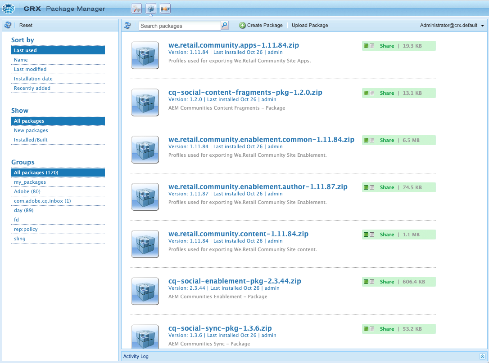
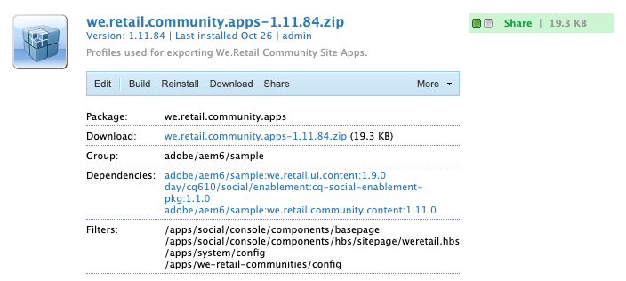
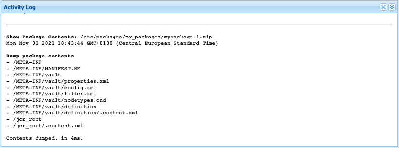

# 패키지 관리자 {#working-with-packages}

패키지를 사용하면 저장소 콘텐츠를 가져오고 내보낼 수 있습니다. 패키지를 사용하여 새 콘텐츠를 설치하고 새 기능을 설치하고 인스턴스 간에 콘텐츠를 전송하고 저장소 콘텐츠를 백업할 수 있습니다.

패키지 관리자를 사용하면 개발 목적으로 AEM 인스턴스와 로컬 파일 시스템 간에 패키지를 전송할 수 있습니다.

## 패키지란 무엇입니까? {#what-are-packages}

패키지는 파일 시스템 직렬화 형식의 저장소 콘텐츠를 포함하는 zip 파일로, 저장소 직렬화라고 하며, 파일 및 폴더를 사용하기 쉽고 편집하기 쉬운 표현입니다. 패키지에 포함된 콘텐츠는 필터를 사용하여 정의됩니다.

패키지에는 필터 정의 및 가져오기 구성 정보를 포함한 저장소 메타 정보도 포함됩니다. 설명, 시각적 이미지 또는 아이콘과 같이 패키지 추출에 사용되지 않는 추가 콘텐츠 속성을 패키지에 포함할 수 있습니다. 이러한 추가 콘텐츠 속성은 콘텐츠 패키지 소비자를 위한 것이며 정보 제공 목적으로만 사용됩니다.

>[!NOTE]
>
>패키지는 패키지가 빌드되는 시점의 현재 콘텐츠 버전을 나타냅니다. 저장소에 AEM이 보관하는 이전 버전의 컨텐츠는 포함되지 않습니다.

## 패키지 관리자 {#package-manager}

패키지 관리자는 AEM 설치에서 패키지를 관리합니다. [필요한 권한을 할당](#permissions-needed-for-using-the-package-manager)한 후에는 패키지 구성, 빌드, 다운로드 및 설치를 포함한 다양한 작업에 패키지 관리자를 사용할 수 있습니다.

### 필수 권한 {#required-permissions}

패키지를 생성, 수정, 업로드 및 설치하려면 사용자에게 다음 노드에 대한 적절한 권한이 있어야 합니다.

* `/etc/packages`에서 삭제를 제외한 모든 권한
* 패키지 콘텐츠가 포함된 노드

>[!CAUTION]
>
>패키지에 대한 권한을 부여하면 민감한 정보가 공개되고 데이터가 손실될 수 있습니다.
>
>이러한 위험을 제한하려면 전용 하위 트리에 대해서만 특정 그룹 권한을 부여하는 것이 좋습니다.

### 패키지 관리자 액세스 {#accessing}

다음 세 가지 방법으로 패키지 관리자에 액세스할 수 있습니다.

1. AEM 기본 메뉴에서 > **도구** > **배포** > **패키지**
1. 상단 전환기 표시줄을 사용하여 [CRXDE Lite](/help/sites-developing/developing-with-crxde-lite.md)에서
1. `http://<host>:<port>/crx/packmgr/`에 액세스하여 직접

### 패키지 관리자 UI {#ui}

Package Manager 는 네 가지 주요 기능 영역으로 나뉩니다.

* **왼쪽 탐색 패널** - 이 패널을 사용하면 패키지 목록을 필터링하고 정렬할 수 있습니다.
* **패키지 목록** - 왼쪽 탐색 패널의 선택 항목별로 필터링되고 정렬된 인스턴스의 패키지 목록입니다.
* **활동 로그** - 이 패널은 처음에는 최소화되며 패키지 빌드 또는 설치 시기와 같은 패키지 관리자의 활동을 자세히 설명하도록 확장됩니다. [작업 로그] 탭에는 다음과 같은 추가 버튼이 있습니다.
   * **로그 지우기**
   * **표시/숨기기**
* **도구 모음** - 도구 모음에는 왼쪽 탐색 패널 및 패키지 목록에 대한 새로 고침 단추와 패키지를 검색, 생성 및 업로드하기 위한 단추가 포함되어 있습니다.



왼쪽 탐색 패널에서 옵션을 클릭하면 패키지 목록이 즉시 필터링됩니다.

패키지 이름을 클릭하면 패키지 목록의 항목이 확장되어 패키지에 대한 세부 정보가 표시됩니다.



패키지 세부 사항을 확장할 때 사용할 수 있는 도구 모음 버튼을 통해 패키지에서 수행할 수 있는 여러 작업이 있습니다.

* [편집](#edit-package)
* [빌드](#building-a-package)
* [다시 설치](#reinstalling-packages)
* [다운로드](#downloading-packages-to-your-file-system)
* [공유](#share)

추가 작업은 **자세히** 단추 아래에서 사용할 수 있습니다.

* [삭제](#deleting-packages)
* [범위](#package-coverage)
* [내용](#viewing-package-contents-and-testing-installation)
* [다시 래핑](#rewrapping-a-package)
* [기타 버전](#other-versions)
* [제거](#uninstalling-packages)
* [설치 테스트](#viewing-package-contents-and-testing-installation)
* [유효성 검사](#validating-packages)
* [복제](#replicating-packages)

### 패키지 상태 {#package-status}

패키지 목록의 각 항목에는 패키지의 상태를 한 눈에 알 수 있도록 상태 표시기가 있습니다. 상태를 마우스로 가리키면 상태의 세부 정보와 함께 도구 설명이 표시됩니다.


패키지를 변경했거나 빌드한 적이 없는 경우 상태는 패키지를 다시 빌드하거나 설치하기 위해 빠른 조치를 취하는 링크로 표시됩니다.

## 패키지 설정 {#package-settings}

패키지는 기본적으로 필터 세트이며 이러한 필터를 기반으로 하는 저장소 데이터입니다. 패키지 관리자 UI를 사용하여 패키지를 클릭한 다음 **편집** 단추를 클릭하여 다음 설정을 포함한 패키지의 세부 정보를 볼 수 있습니다.

* [일반 설정](#general-settings)
* [패키지 필터](#package-filters)
* [패키지 종속성](#package-dependencies)
* [고급 설정](#advanced-settings)
* [패키지 스크린샷](#package-screenshots)

### 일반 설정 {#general-settings}

다양한 패키지 설정을 편집하여 패키지 설명, 종속성 및 공급자 세부 사항과 같은 정보를 정의할 수 있습니다.

**패키지 설정** 대화 상자는 패키지를 [만들기](#creating-a-new-package) 또는 [편집](#viewing-and-editing-package-information)할 때 **편집** 단추를 통해 사용할 수 있습니다. 변경 사항이 있으면 **저장**&#x200B;을 클릭하세요.


| 필드 | 설명 |
|---|---|
| 이름 | 패키지 이름 |
| 그룹 | 패키지를 구성하는 경우 새 그룹의 이름을 입력하거나 기존 그룹을 선택할 수 있습니다 |
| 버전 | 버전에 사용할 텍스트 |
| 설명 | HTML 마크업의 서식을 허용하는 패키지에 대한 간단한 설명 |
| 썸네일 | 패키지 목록과 함께 표시되는 아이콘 |

#### 패키지 썸네일 {#thumbnails}

썸네일은 패키지에 포함된 내용에 대한 빠른 참조 시각적 표현을 제공합니다. 그런 다음 패키지 목록에 표시되며 패키지 또는 패키지 클래스를 쉽게 식별할 수 있습니다.

다음은 공식 패키지에 사용되는 규칙의 예입니다.

공식 핫픽스


확장의 공식 AEM 설치


공식 서비스 팩


패키지에 고유한 아이콘을 사용합니다. Adobe에서 사용하는 아이콘을 재사용하지 마십시오.

### 패키지 필터 {#package-filters}

필터는 패키지에 포함할 저장소 노드를 식별합니다. **필터 정의**&#x200B;는 다음 정보를 지정합니다.

* 포함할 콘텐츠의 **루트 경로**
* 루트 경로 아래에 특정 노드를 포함하거나 제외하는 **규칙**

**+** 단추를 사용하여 규칙을 추가합니다. **-** 단추를 사용하여 규칙을 제거합니다.

규칙은 순서에 따라 적용되므로 **위쪽** 및 **아래쪽** 화살표 단추를 사용하여 필요에 따라 배치합니다.

필터에는 0개 이상의 규칙이 포함될 수 있습니다. 규칙이 정의되지 않으면 패키지에는 루트 경로 아래의 모든 콘텐츠가 포함됩니다.

패키지에 대해 하나 이상의 필터 정의를 정의할 수 있습니다. 여러 루트 경로의 콘텐츠를 포함하려면 두 개 이상의 필터를 사용하십시오.


규칙을 생성할 때 정규 표현식(regex, regexp 또는 rational expression이라고도 함)을 정의하여 포함 또는 제외할 모든 노드를 지정합니다.

| 규칙 유형 | 설명 |
|---|---|
| include | 포함 은 정규 표현식과 일치하는 지정된 디렉터리의 모든 파일 및 폴더를 포함합니다. **포함**&#x200B;은(는) 지정한 루트 경로 아래에 있는 다른 파일이나 폴더를 포함하지 않습니다. |
| 제외 | 제외를 선택하면 정규 표현식과 일치하는 모든 파일 및 폴더가 제외됩니다. |

패키지 필터는 처음 [패키지를 만들 때 가장 자주 정의됩니다.](#creating-a-new-package) 그러나 나중에 편집할 수도 있습니다. 그런 다음 새 필터 정의를 기반으로 콘텐츠를 업데이트하도록 패키지를 다시 빌드해야 합니다.

>[!TIP]
>
>하나의 패키지에 여러 필터 정의가 포함될 수 있으므로 서로 다른 위치의 노드를 하나의 패키지로 쉽게 결합할 수 있습니다.

>[!TIP]
>
>배경 정보는 [Apache Jackrabbit - Workspace Filter](https://jackrabbit.apache.org/filevault/filter.html) 설명서를 참조하십시오.

### 종속성 {#dependencies}


| 필드 | 설명 | 예제/세부 정보 |
|---|---|---|
| 테스트 대상 | 이 패키지가 타겟팅되거나 호환되는 제품 이름 및 버전입니다. | `6.5` |
| 해결된 문제 | 이 패키지로 수정된 버그의 세부 사항을 나열할 수 있는 텍스트 필드로, 한 줄에 하나의 버그가 있습니다. | - |
| 종속 대상 | 설치 시 현재 패키지가 예상대로 실행되도록 필요한 다른 패키지를 나열합니다. | `groupId:name:version` |
| 바꾸기 | 이 패키지가 대체하는 더 이상 사용되지 않는 패키지 목록 | `groupId:name:version` |

### 고급 설정 {#advanced-settings}


| 필드 | 설명 | 예제/세부 정보 |
|---|---|---|
| 이름 | 패키지 공급자의 이름 | `WKND Media Group` |
| URL | 공급자의 URL | `https://wknd.site` |
| 링크 | 공급자 페이지에 대한 패키지별 링크 | `https://wknd.site/package/` |
| 필수 항목 | 패키지 설치 시 제한 사항이 있는지 정의합니다. | **관리자** - 패키지를 관리자 권한으로만 설치해야 함&#x200B;<br>**다시 시작** - 패키지를 설치한 후 AEM을 다시 시작해야 함 |
| AC 처리 | 패키지를 가져올 때 패키지에 정의된 액세스 제어 정보가 처리되는 방식을 지정합니다 | **무시** - 저장소의 ACL 유지&#x200B;<br>**덮어쓰기** - 저장소의 ACL 덮어쓰기&#x200B;<br>**병합** - 두 ACL 집합 병합&#x200B;<br>**병합** - 콘텐츠에 없는 보안 주체의 액세스 제어 항목을 추가하여 패키지와 함께 제공된 액세스 제어를 콘텐츠에 병합&#x200B;<br>**지우기** - ACL 지우기 |

### 패키지 스크린샷 {#package-screenshots}

패키지에 여러 스크린샷을 연결하여 콘텐츠가 표시되는 방식을 시각적으로 나타낼 수 있습니다.


## 패키지 작업 {#package-actions}

패키지에서 수행할 수 있는 작업은 여러 가지가 있습니다.

### 패키지 만들기 {#creating-a-new-package}

1. [패키지 관리자에 액세스합니다.](#accessing)

1. **패키지 만들기**&#x200B;를 클릭합니다.

   >[!TIP]
   >
   >인스턴스에 많은 패키지가 있는 경우 폴더 구조가 있을 수 있습니다. 이러한 경우 새 패키지를 만들기 전에 필요한 대상 폴더로 이동하는 것이 더 쉽습니다.

1. **새 패키지** 대화 상자에서 다음 필드를 입력하십시오.

   

   * **패키지 이름** - 다른 사용자가 패키지 내용을 쉽게 식별할 수 있도록 설명하는 이름을 선택합니다.

   * **버전** - 버전을 나타내는 텍스트 필드입니다. zip 파일의 이름을 형성하기 위해 패키지 이름에 추가됩니다.

   * **그룹** - 대상 그룹(또는 폴더) 이름입니다. 그룹을 사용하면 패키지를 구성할 수 있습니다. 폴더가 없는 경우 그룹에 대해 폴더가 만들어집니다. 그룹 이름을 비워 두면 기본 패키지 목록에 패키지가 만들어집니다.

1. 패키지를 만들려면 **확인**&#x200B;을 클릭합니다.

1. AEM은 패키지 목록 맨 위에 새 패키지를 나열합니다.

   

1. **편집**&#x200B;을 클릭하여 [패키지 콘텐츠를 정의합니다.](#package-contents) 설정 편집을 마친 후 **저장**&#x200B;을(를) 클릭합니다.

1. 이제 패키지를 [빌드](#building-a-package)할 수 있습니다.

패키지를 생성한 후 즉시 패키지를 빌드해야 하는 것은 아닙니다. 빌드되지 않은 패키지는 콘텐츠를 포함하지 않고 패키지의 필터 데이터와 기타 메타데이터로만 구성됩니다.

### 패키지 빌드 {#building-a-package}

패키지는 종종 [패키지를 만들기](#creating-a-new-package)와 동시에 빌드되지만 나중에 다시 돌아와 패키지를 빌드하거나 다시 빌드할 수 있습니다. 이 기능은 저장소 내의 콘텐츠가 변경되었거나 패키지 필터가 변경된 경우에 유용합니다.

1. [패키지 관리자에 액세스합니다.](#accessing)

1. 패키지 이름을 클릭하여 패키지 목록에서 패키지 세부 정보를 엽니다.

1. **빌드**&#x200B;를 클릭합니다. 대화 상자에 기존 패키지 콘텐츠를 덮어쓰게 되므로 패키지를 빌드할 것인지 확인하는 메시지가 표시됩니다.

1. **확인**&#x200B;을 클릭합니다. AEM은 패키지를 빌드하여 활동 목록에서와 같이 패키지에 추가된 모든 컨텐츠를 나열합니다. 완료 시 AEM에 패키지가 작성되었다는 확인이 표시되고 대화 상자를 닫을 때 패키지 목록 정보가 업데이트됩니다.

### 패키지 편집 {#edit-package}

패키지가 AEM에 업로드되면 설정을 수정할 수 있습니다.

1. [패키지 관리자에 액세스합니다.](#accessing)

1. 패키지 이름을 클릭하여 패키지 목록에서 패키지 세부 정보를 엽니다.

1. **편집**&#x200B;을 클릭하고 필요에 따라 **[패키지 설정](#package-settings)**&#x200B;을(를) 업데이트합니다.

1. 저장하려면 **저장**&#x200B;을 클릭하세요.

변경 내용을 기반으로 콘텐츠를 업데이트하려면 [패키지를 다시 빌드](#building-a-package)해야 할 수 있습니다.

### 패키지 다시 래핑 {#rewrapping-a-package}

패키지가 빌드되면 다시 래핑할 수 있습니다. 다시 래핑하면 패키지 내용을 변경하지 않고 썸네일, 설명 등과 같은 패키지 정보를 변경하지 않습니다.

1. [패키지 관리자에 액세스합니다.](#accessing)

1. 패키지 이름을 클릭하여 패키지 목록에서 패키지 세부 정보를 엽니다.

1. **편집**&#x200B;을 클릭하고 필요에 따라 **[패키지 설정](#package-settings)**&#x200B;을(를) 업데이트합니다.

1. 저장하려면 **저장**&#x200B;을 클릭하세요.

1. **자세히** > **다시 래핑**&#x200B;을 클릭하면 대화 상자에서 확인을 요청합니다.

### 다른 패키지 버전 보기 {#other-versions}

패키지의 모든 버전은 다른 패키지와 마찬가지로 목록에 표시되므로 패키지 관리자는 선택한 패키지의 다른 버전을 찾을 수 있습니다.

1. [패키지 관리자에 액세스합니다.](#accessing)

1. 패키지 이름을 클릭하여 패키지 목록에서 패키지 세부 정보를 엽니다.

1. **자세히** > **다른 버전**&#x200B;을 클릭하면 상태 정보가 포함된 동일한 패키지의 다른 버전 목록이 포함된 대화 상자가 열립니다.

### 패키지 내용 보기 및 설치 테스트 {#viewing-package-contents-and-testing-installation}

패키지가 빌드되면 콘텐츠를 볼 수 있습니다.

1. [패키지 관리자에 액세스합니다.](#accessing)

1. 패키지 이름을 클릭하여 패키지 목록에서 패키지 세부 정보를 엽니다.

1. 콘텐츠를 보려면 **자세히** > **콘텐츠**&#x200B;를 클릭하면 패키지 관리자가 작업 로그에 패키지의 전체 콘텐츠를 나열합니다.

   

1. 설치를 시험 실행하려면 **자세히** > **설치 테스트**&#x200B;를 클릭하고 패키지 관리자 보고서는 설치가 수행된 것처럼 작업 로그에 결과를 보고합니다.

   

### 파일 시스템에 패키지 다운로드 {#downloading-packages-to-your-file-system}

1. [패키지 관리자에 액세스합니다.](#accessing)

1. 패키지 이름을 클릭하여 패키지 목록에서 패키지 세부 정보를 엽니다.

1. 패키지 세부 정보 영역에서 패키지의 **다운로드** 단추 또는 연결된 파일 이름을 클릭합니다.

1. AEM은 패키지를 컴퓨터에 다운로드합니다.

### 패키지 공유 {#share}

패키지 공유는 콘텐츠 패키지를 배포하기 위한 중앙 집중식 공개 서비스였습니다. 패키지 공유가 [소프트웨어 배포](#software-distribution)로 대체되었으며 이 단추는 더 이상 작동하지 않습니다.

### 파일 시스템에서 패키지 업로드 {#uploading-packages-from-your-file-system}

1. [패키지 관리자에 액세스합니다.](#accessing)

1. 패키지를 업로드할 그룹 폴더를 선택합니다.

1. **패키지 업로드** 단추를 클릭합니다.

1. 업로드한 패키지에 대해 필요한 정보를 제공합니다.

   

   * **패키지** - **찾아보기...** 단추를 사용하여 로컬 파일 시스템에서 필요한 패키지를 선택합니다.
   * **강제 업로드** - 이 이름의 패키지가 이미 있는 경우 이 옵션을 사용하여 업로드를 강제 수행하고 기존 패키지를 덮어씁니다.

1. **확인**&#x200B;을 클릭하면 선택한 패키지가 업로드되고 그에 따라 패키지 목록이 업데이트됩니다.

이제 패키지 콘텐츠가 AEM에 있지만 콘텐츠를 사용할 수 있도록 하려면 [패키지를 설치](#installing-packages)하십시오.

### 패키지 확인 {#validating-packages}

패키지는 기존 콘텐츠를 수정할 수 있으므로 설치하기 전에 이러한 변경 사항의 유효성을 검사하는 것이 유용한 경우가 많습니다.

#### 유효성 검사 옵션 {#validation-options}

패키지 관리자는 다음 유효성 검사를 수행할 수 있습니다.

* [OSGi 패키지 가져오기](#osgi-package-imports)
* [오버레이](#overlays)
* [ACL](#acls)

##### OSGi 패키지 가져오기 유효성 검사 {#osgi-package-imports}

**확인된 항목**

이 유효성 검사는 모든 JAR 파일(OSGi 번들)에 대한 패키지를 검사하고 해당 `manifest.xml`(해당 OSGi 번들이 의존하는 버전화된 종속성을 포함)을 추출하며 AEM 인스턴스가 해당 종속성을 올바른 버전과 내보내는지 확인합니다.

**보고 방법**

AEM 인스턴스가 충족할 수 없는 버전 종속 항목은 패키지 관리자의 작업 로그에 나열됩니다.

**오류 상태**

종속성이 충족되지 않으면 해당 종속성이 있는 패키지의 OSGi 번들이 시작되지 않습니다. 따라서 시작되지 않은 OSGi 번들에 의존하는 모든 것이 결국 제대로 작동하지 않아 애플리케이션 배포가 중단됩니다.

**오류 해결**

충족되지 않은 OSGi 번들로 인한 오류를 해결하려면 충족되지 않은 가져오기가 포함된 번들의 종속성 버전을 조정해야 합니다.

##### 오버레이 유효성 검사 {#overlays}

**확인된 항목**

이 유효성 검사는 설치 중인 패키지에 대상 AEM 인스턴스에 이미 오버레이된 파일이 포함되어 있는지 확인합니다.

예를 들어 `/apps/sling/servlet/errorhandler/404.jsp`에 기존 오버레이가 있는 경우 `/libs/sling/servlet/errorhandler/404.jsp`이(가) 포함된 패키지가 `/libs/sling/servlet/errorhandler/404.jsp`에 있는 기존 파일을 변경하게 됩니다.

**보고 방법**

이러한 모든 오버레이는 패키지 관리자의 작업 로그에 설명되어 있습니다.

**오류 상태**

오류 상태는 패키지가 이미 오버레이된 파일을 배포하려고 시도하고 있음을 의미하므로 패키지의 변경 사항이 오버레이에 의해 재정의되고(따라서 &quot;숨김&quot;) 적용되지 않습니다.

**오류 해결**

이 문제를 해결하려면 `/apps`의 오버레이 파일 유지 관리자가 `/libs`에서 오버레이된 파일의 변경 사항을 검토하고 필요에 따라 변경 사항을 오버레이( `/apps`)에 통합한 다음 오버레이된 파일을 다시 배포해야 합니다.

>[!NOTE]
>
>유효성 검사 메커니즘은 오버레이된 콘텐츠가 오버레이 파일에 적절하게 통합되었다면 조정할 수 있는 방법이 없다. 따라서 이 유효성 검사는 필요한 변경이 수행된 후에도 충돌을 계속 보고합니다.

##### ACL 유효성 검사 {#acls}

**확인된 항목**

이 유효성 검사는 추가되는 권한, 처리 방법(병합/바꾸기) 및 현재 권한에 영향을 주는지 확인합니다.

**보고 방법**

권한은 패키지 관리자의 작업 로그에 설명되어 있습니다.

**오류 상태**

명시적 오류를 제공할 수 없습니다. 유효성 검사는 새 ACL 권한이 패키지 설치에 의해 추가되거나 영향을 받는지 여부만 표시합니다.

**오류 해결**

유효성 검사에서 제공한 정보를 사용하여 영향을 받는 노드를 CRXDE에서 검토하고 필요에 따라 ACL을 패키지에서 조정할 수 있습니다.

>[!CAUTION]
>
>예기치 않은 동작이 발생할 수 있으므로 AEM에서 제공한 ACL에 패키지가 영향을 주지 않는 것이 좋습니다.

#### 유효성 검사 수행 {#performing-validation}

패키지의 유효성 검사는 다음 두 가지 방법으로 수행할 수 있습니다.

* [패키지 관리자 UI 사용](#via-package-manager)
* [cURL과 같은 HTTP POST 요청을 통해](#via-post-request)

패키지를 업로드한 후 설치하기 전에 항상 유효성 검사가 수행되어야 합니다.

##### 패키지 관리자를 통한 패키지 유효성 검사 {#via-package-manager}

1. [패키지 관리자에 액세스합니다.](#accessing)

1. 패키지 이름을 클릭하여 패키지 목록에서 패키지 세부 정보를 엽니다.

1. 패키지의 유효성을 검사하려면 **자세히** > **유효성 검사**,

1. 모달 대화 상자가 나타나면 확인란을 사용하여 유효성 검사 유형을 선택하고 **유효성 검사**&#x200B;를 클릭하여 유효성 검사를 시작합니다.

1. 그런 다음 선택한 유효성 검사가 실행되고 결과가 패키지 관리자의 작업 로그에 표시됩니다.

##### HTTP POST 요청을 통한 패키지 유효성 검사 {#via-post-request}

POST 요청은 다음 양식을 사용합니다.

```
https://<host>:<port>/crx/packmgr/service.jsp?cmd=validate&type=osgiPackageImports,overlays,acls
```

`type` 매개 변수는 쉼표로 구분된 다음 무순서 목록일 수 있습니다.

* `osgiPackageImports`
* `overlays`
* `acls`

명시적으로 전달되지 않은 경우 `type`의 값은 기본적으로 `osgiPackageImports`입니다.

cURL을 사용할 때 다음과 유사한 문을 실행합니다.

```shell
curl -v -X POST --user admin:admin -F file=@/Users/SomeGuy/Desktop/core.wcm.components.all-1.1.0.zip 'http://localhost:4502/crx/packmgr/service.jsp?cmd=validate&type=osgiPackageImports,overlays,acls'
```

POST 요청을 통해 유효성을 검사할 때 응답은 JSON 개체로 다시 전송됩니다.

### 패키지 범위 보기 {#package-coverage}

패키지는 해당 필터에 의해 정의됩니다. 패키지 관리자에서 기존 저장소 콘텐츠에 패키지 필터를 적용하여 패키지의 필터 정의에 포함되는 저장소 콘텐츠를 표시하도록 할 수 있습니다.

1. [패키지 관리자에 액세스합니다.](#accessing)

1. 패키지 이름을 클릭하여 패키지 목록에서 패키지 세부 정보를 엽니다.

1. **자세히** > **적용 범위**&#x200B;를 클릭합니다.

1. 적용 범위 세부 사항은 작업 로그에 나열됩니다.

### 패키지 설치 {#installing-packages}

패키지를 업로드하면 패키지 콘텐츠가 저장소에만 추가되지만 액세스할 수 없습니다. 업로드된 패키지를 설치하여 패키지의 콘텐츠를 사용합니다.

>[!CAUTION]
>
>패키지를 설치하면 기존 콘텐츠를 덮어쓰거나 삭제할 수 있습니다. 필요한 콘텐츠를 삭제하거나 덮어쓰지 않는 경우에만 패키지를 업로드하십시오.

패키지를 설치하기 전에 패키지 관리자에서 덮어쓸 콘텐츠가 포함된 스냅샷 패키지를 자동으로 만듭니다. 패키지를 제거하면 이 스냅샷이 다시 설치됩니다.

>[!CAUTION]
>
>* 디지털 자산을 설치하는 경우 다음을 수행해야 합니다.
>  먼저 WorkflowLauncher를 비활성화합니다.
>  OSGi 콘솔의 구성 요소 메뉴 옵션을 사용하여 을 비활성화합니다
>  `com.day.cq.workflow.launcher.impl.WorkflowLauncherImpl.`
>* 그런 다음 설치가 완료되면 WorkflowLauncher를 다시 활성화합니다.
>
>WorkflowLauncher를 비활성화하면 Assets importer 프레임워크가 설치 시 자산을 의도하지 않게 조작하지 않을 수 있습니다.

1. [패키지 관리자에 액세스합니다.](#accessing)

1. 패키지 이름을 클릭하여 패키지 목록에서 설치할 패키지의 패키지 세부 정보를 엽니다.

1. 항목 세부 정보에서 **설치** 단추를 클릭하거나 패키지 상태에서 **설치** 링크를 클릭합니다.

1. 대화 상자에서 확인을 요청하고 추가 옵션을 지정할 수 있습니다.

   * **추출 전용** - 스냅숏이 만들어지지 않도록 패키지만 추출하므로 제거할 수 없습니다.
   * **임계값 저장** - 자동 저장이 트리거될 때까지 임시 노드 수(동시 수정 예외가 발생하면 증가)
   * **하위 패키지 추출** - 하위 패키지의 자동 추출 사용
   * **액세스 제어 처리** - 패키지가 설치될 때 패키지에 정의된 액세스 제어 정보가 처리되는 방식을 지정합니다([고급 패키지 설정](#advanced-settings)과 옵션 동일).
   * **종속성 처리** - 설치하는 동안 종속성이 처리되는 방법을 지정하십시오.

1. **설치**&#x200B;를 클릭합니다.

1. 작업 로그에는 설치 진행률이 자세히 설명되어 있습니다.

설치가 완료되고 성공하면 패키지 목록이 업데이트되고 패키지 상태에 **설치됨**&#x200B;이라는 단어가 나타납니다.

### 패키지 재설치 {#reinstalling-packages}

패키지를 다시 설치하면 [처음 패키지를 설치할 때 처리된 이미 설치된 패키지에서 동일한 단계를 수행합니다.](#installing-packages)

### 파일 시스템 기반 업로드 및 설치 {#file-system-based-upload-and-installation}

패키지를 설치할 때 패키지 관리자를 모두 포기할 수 있습니다. AEM은 호스트 시스템의 로컬 파일 시스템에서 특정 위치에 배치된 패키지를 감지하여 자동으로 업로드 및 설치할 수 있습니다.

1. AEM 설치 폴더 아래에 jar 및 `license.properties` 파일과 함께 `crx-quicksart` 폴더가 있습니다. `crx-quickstart` 아래에 `install` 폴더를 만들어 `<aem-home>/crx-quickstart/install` 경로를 만듭니다.

1. 이 폴더에서 패키지를 추가합니다. 인스턴스는 자동으로 업로드되고 설치됩니다.

1. 업로드 및 설치가 완료되면 패키지 관리자 UI를 사용하여 패키지를 설치한 것처럼 패키지 관리자에서 패키지를 볼 수 있습니다.

인스턴스가 실행 중인 경우 패키지를 `install` 폴더에 추가하면 즉시 업로드 및 설치가 시작됩니다

인스턴스가 실행되고 있지 않으면 `install` 폴더에 배치된 패키지가 시작 시 알파벳 순서로 설치됩니다.

### 패키지 제거 {#uninstalling-packages}

패키지를 제거하면 저장소의 내용이 설치 전에 패키지 관리자에서 자동으로 만든 스냅샷으로 되돌아갑니다.

1. [패키지 관리자에 액세스합니다.](#accessing)

1. 패키지 이름을 클릭하여 패키지 목록에서 제거할 패키지의 패키지 세부 정보를 엽니다.

1. 저장소에서 이 패키지의 내용을 제거하려면 **자세히** > **제거**&#x200B;를 클릭하십시오.

1. 대화 상자에서 확인을 요청하고 모든 변경 사항을 나열합니다.

1. 패키지가 제거되고 스냅샷이 적용됩니다. 프로세스 진행 상황이 작업 로그에 표시됩니다.

### 패키지 삭제 {#deleting-packages}

패키지를 삭제하면 패키지 관리자에서 세부 사항만 삭제됩니다. 이 패키지가 이미 설치된 경우 설치된 콘텐츠는 삭제되지 않습니다.

1. [패키지 관리자에 액세스합니다.](#accessing)

1. 패키지 이름을 클릭하여 패키지 목록에서 삭제하려는 패키지의 패키지 세부 정보를 엽니다.

1. 패키지 관리자에서 패키지를 삭제할 것인지 확인하는 메시지가 표시됩니다. **확인**&#x200B;을 클릭하여 삭제를 확인합니다.

1. 패키지 정보가 삭제되고 자세한 내용은 활동 로그에 보고됩니다.

### 패키지 복제 {#replicating-packages}

패키지의 콘텐츠를 복제하여 게시 인스턴스에 설치합니다.

1. [패키지 관리자에 액세스합니다.](#accessing)

1. 패키지 이름을 클릭하여 패키지 목록에서 복제할 패키지의 패키지 세부 정보를 엽니다.

1. **자세히** > **복제**&#x200B;를 클릭합니다.

1. 패키지가 복제되고 세부 사항이 작업 로그에 보고됩니다.

## 소프트웨어 배포 {#software-distribution}

AEM 패키지를 사용하여 AEM 환경에서 콘텐츠를 만들고 공유할 수 있습니다.

[Software Distribution](https://downloads.experiencecloud.adobe.com)은(는) AEM 패키지의 검색 및 다운로드를 간소화하기 위해 고안된 중앙 집중식 서비스입니다.

자세한 내용은 [소프트웨어 배포 설명서를 참조하십시오.](https://experienceleague.adobe.com/docs/experience-cloud/software-distribution/home.html)

>[!NOTE]
>
>Package Manager는 이전 Package Share 서비스와 마찬가지로 현재 Software Distribution과 통합되지 않았습니다. 따라서 패키지 관리자 내의 패키지 공유에 대한 공유 버튼과 기타 링크가 더 이상 작동하지 않습니다. 해결 방법은 로컬 디스크에 패키지를 다운로드하는 것입니다.
