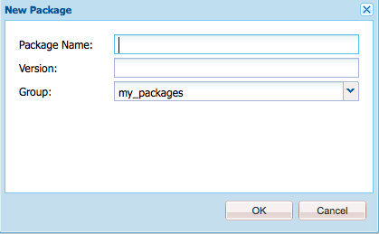

# 패키지 사용 방법{#how-to-work-with-packages}

패키지를 사용하면 저장소 컨텐츠를 가져오고 내보낼 수 있습니다. 예를 들어 패키지를 사용하여 새 기능을 설치하고 인스턴스 간에 컨텐츠를 전송하며 저장소 컨텐츠를 백업할 수 있습니다.

패키지는 다음 페이지에서 액세스 및/또는 유지 관리할 수 있습니다.

* [로컬 AEM](#package-manager) 인스턴스에서 패키지를 관리하는 데 사용하는 패키지 관리자.

* [소프트웨어 배포](#software-distribution) - 공개적으로 사용 가능한 패키지와 회사 내 개인 패키지를 모두 포함하는 중앙 서버. 공개 패키지에는 핫픽스, 새 기능, 설명서 등이 포함될 수 있습니다.

패키지 관리자, 소프트웨어 배포 및 파일 시스템 간에 패키지를 전송할 수 있습니다.

## 패키지란?{#what-are-packages}

패키지는 파일 시스템 직렬화(&quot;저장소&quot; 직렬화라고 함)의 형태로 저장소 컨텐츠를 포함하는 zip 파일입니다. 파일 및 폴더를 쉽게 사용하고 편집할 수 있습니다.

패키지에는 필터를 사용하여 선택한 컨텐츠, 페이지 컨텐츠 및 프로젝트 관련 컨텐츠가 모두 포함됩니다.

또한 패키지에는 필터 정의 및 가져오기 구성 정보를 포함한 저장소 메타 정보가 들어 있습니다. 설명, 시각적 이미지 또는 아이콘과 같은 추가 컨텐츠 속성(패키지 추출에 사용되지 않음)을 패키지에 포함할 수 있습니다.이러한 속성은 컨텐츠 패키지 소비자에 사용되며 정보 제공용으로만 사용됩니다.

>[!NOTE]
>
>패키지는 패키지가 빌드될 때 현재 버전의 콘텐츠를 나타냅니다. AEM이 저장소에 보관하는 내용의 이전 버전은 포함되지 않습니다.

패키지에서 또는 패키지로 다음 작업을 수행할 수 있습니다.

* 새 패키지 만들기;필요에 따라 패키지 설정 및 필터 정의
* 패키지 내용 미리 보기(빌드 전)
* 패키지 빌드
* 패키지 정보 보기
* 패키지 내용 보기(빌드 후)
* 기존 패키지에 대한 정의 수정
* 기존 패키지 다시 작성
* 패키지 다시 래핑
* AEM에서 파일 시스템으로 패키지 다운로드
* 파일 시스템의 패키지를 로컬 AEM 인스턴스로 업로드
* 설치 전에 패키지 내용의 유효성 확인
* 연습 설치 수행
* 패키지 설치(AEM은 업로드 후 패키지를 자동으로 설치하지 않음)
* 패키지 삭제
* 소프트웨어 배포 라이브러리에서 핫픽스와 같은 패키지 다운로드
* 소프트웨어 배포 라이브러리의 회사 내부 섹션에 패키지 업로드

## 패키지 정보 {#package-information}

패키지 정의는 다양한 유형의 정보로 구성됩니다.

* [패키지 설정](#package-settings)
* [패키지 필터](#package-filters)
* [스크린샷 패키지](#package-screenshots)
* [패키지 아이콘](#package-icons)

### 패키지 설정 {#package-settings}

패키지 설정을 편집하여 패키지 설명, 관련 버그, 종속성 및 공급자 정보 등의 측면을 정의할 수 있습니다.

[패키지를 생성](#creating-a-new-package) 또는 [편집](#viewing-and-editing-package-information)할 때 **패키지 설정** 대화 상자는 **편집** 단추를 통해 사용할 수 있으며 구성을 위한 세 개의 탭을 제공합니다. 변경 사항이 발생하면 **확인**&#x200B;을 클릭하여 저장합니다.


| **필드** | **설명** |
|---|---|
| 이름 | 패키지의 이름입니다. |
| 그룹 | 패키지를 구성하기 위해 패키지를 추가할 그룹의 이름입니다. 새 그룹의 이름을 입력하거나 기존 그룹을 선택합니다. |
| 버전 | 사용자 정의 버전에 사용할 텍스트입니다. |
| 설명 | 패키지에 대한 간단한 설명입니다. 서식에 HTML 마크업을 사용할 수 있습니다. |
| 썸네일 | 패키지 목록에 나타나는 아이콘입니다. 찾아보기를 클릭하여 로컬 파일을 선택합니다. |


<table>
 <tbody>
  <tr>
   <th><strong>필드</strong></th>
   <th><strong>설명</strong></th>
   <th><strong>형식/예</strong></th>
  </tr>
  <tr>
   <td>이름</td>
   <td>공급자의 이름입니다.</td>
   <td><em>AEM Geometrixx<br /> </em></td>
  </tr>
  <tr>
   <td>URL</td>
   <td>공급자의 URL.</td>
   <td><em>https://www.aem-geometrixx.com</em></td>
  </tr>
  <tr>
   <td>링크</td>
   <td>공급자 페이지에 대한 패키지별 링크.</td>
   <td><em>https://www.aem-geometrixx.com/mypackage.html</em></td>
  </tr>
  <tr>
   <td>필수 항목<br /> </td>
   <td>
    <ul>
     <li>관리자:관리 권한이 있는 계정에서만 패키지를 설치할 수 있는 시기를 선택합니다.</li>
     <li>다시 시작:패키지를 설치한 후 서버를 다시 시작해야 하는 경우를 선택합니다.</li>
    </ul> </td>
   <td> </td>
  </tr>
  <tr>
   <td>AC 처리</td>
   <td><p>패키지를 가져올 때 패키지에 정의된 액세스 제어 정보가 처리되는 방식을 지정합니다.</p>
    <ul>
     <li><strong>무시</strong></li>
     <li><strong>덮어쓰기</strong></li>
     <li><strong>병합</strong></li>
     <li><strong>지우기</strong></li>
     <li><strong>MergePreserve</strong></li>
    </ul> <p>기본값은 <strong>Ignore</strong>입니다.</p> </td>
   <td>
    <ul>
     <li><strong>무시</strong>  - 저장소의 ACL 보존</li>
     <li><strong>덮어쓰기</strong>  - 저장소의 ACL 덮어쓰기</li>
     <li><strong>병합</strong>  - 두 ACL 세트 모두 병합</li>
     <li><strong>ACL 지우기</strong>  - 지우기</li>
     <li><strong>병합보존</strong>  - 컨텐츠에 없는 주도자의 액세스 제어 항목을 추가하여 컨텐츠에 있는 액세스 제어 컨트롤을 패키지와 함께 제공된 제어 컨텐츠와 병합합니다</li>
    </ul> </td>
  </tr>
 </tbody>
</table>


| **필드** | **설명** | **형식/예** |
|---|---|---|
| 테스트 대상 | 이 패키지가 대상 또는 호환되는 제품 이름 및 버전. | *AEM 6* |
| 해결된 버그/문제 | 이 패키지에서 수정된 버그의 세부 사항을 나열할 수 있는 텍스트 필드입니다. 각 버그를 별도의 줄에 나열하십시오. | 버그 참조 요약 |
| 종속 대상 | 현재 패키지를 예상대로 실행할 수 있도록 다른 패키지가 필요할 때마다 존중해야 하는 종속성 정보를 나열합니다. 이 필드는 핫픽스를 사용할 때 중요합니다. | groupId:name:version |
| 바꾸기 | 이 패키지가 대체할 가치가 없는 패키지 목록입니다. 설치하기 전에 콘텐츠를 덮어쓰지 않도록 이 패키지에 오래된 패키지의 모든 필수 콘텐트가 포함되어 있는지 확인하십시오. | groupId:name:version |

### 패키지 필터 {#package-filters}

필터는 패키지에 포함할 저장소 노드를 식별합니다. **필터 정의**&#x200B;는 다음 정보를 지정합니다.

* 포함할 컨텐츠의 **루트 경로**.
* **루트** 경로 아래에 특정 노드를 포함하거나 제외하는 규칙입니다.

필터에는 0개 이상의 규칙이 포함될 수 있습니다. 규칙을 정의하지 않으면 패키지에 루트 경로 아래의 모든 컨텐츠가 포함됩니다.

패키지에 대해 하나 이상의 필터 정의를 정의할 수 있습니다. 여러 루트 패스의 컨텐츠를 포함하려면 두 개 이상의 필터를 사용합니다.


다음 표에서는 이러한 규칙에 대해 설명하고 예제를 제공합니다.

<table>
 <tbody>
  <tr>
   <th> 규칙 유형</th>
   <th>설명 </th>
   <th>예 </th>
  </tr>
  <tr>
   <td> 포함</td>
   <td>경로를 정의하거나 정규 표현식을 사용하여 포함할 노드를 모두 지정할 수 있습니다.<br /> <br /> 디렉토리를 포함하면 다음과 같습니다.
    <ul>
     <li><i>및</i> 해당 디렉토리의 모든 파일 및 폴더(전체 하위 트리) 포함</li>
     <li><strong>지정된 루트 경로 아래의 다른 파일 또는 폴더 </strong> 포함 안 함</li>
    </ul> </td>
   <td>/libs/sling/install(/)*) </td>
  </tr>
  <tr>
   <td> 제외</td>
   <td>경로를 지정하거나 일반 표현식을 사용하여 제외할 모든 노드를 지정할 수 있습니다.<br /> <br /> 디렉토리를 제외하면 해당 디렉토리 <i></i> 와 해당 디렉토리의 모든 파일 및 폴더(전체 하위 트리)가 제외됩니다.<br /> </td>
   <td>/libs/wcm/foundation/components(/)*)</td>
  </tr>
 </tbody>
</table>

>[!NOTE]
>
>하나의 패키지에 여러 필터 정의가 포함될 수 있으므로 다른 위치의 노드를 하나의 패키지로 쉽게 결합할 수 있습니다.

패키지 필터는 처음 [패키지](#creating-a-new-package)를 만들 때 가장 많이 정의되지만 나중에 편집할 수도 있습니다(패키지를 다시 빌드해야 함).

### 패키지 스크린샷 {#package-screenshots}

스크린샷을 패키지에 연결하여 컨텐츠가 어떻게 생겼는지 시각적으로 표시할 수 있습니다.예를 들어 새로운 기능의 스크린샷을 제공합니다.

### 패키지 아이콘 {#package-icons}

패키지에 포함된 내용을 신속하게 참조할 수 있도록 아이콘을 패키지에 첨부할 수도 있습니다. 그러면 패키지 목록에 표시되며 패키지 또는 패키지 클래스를 쉽게 식별할 수 있습니다.

패키지에는 아이콘이 포함될 수 있으므로 공식 패키지에는 다음 규칙이 사용됩니다.

>[!NOTE]
>
>혼동을 방지하려면 패키지에 대해 설명형 아이콘을 사용하고 공식 아이콘 중 하나를 사용하지 마십시오.

공식 핫픽스 패키지:


공식 AEM 설치 또는 확장 패키지:

공식 기능 팩:


## 설치할 수 있습니다 {#package-manager}

패키지 관리자는 로컬 AEM 설치에서 패키지를 관리합니다. [에 필요한 권한](#permissions-needed-for-using-the-package-manager)을 할당했으면 패키지 관리자를 사용하여 패키지 구성, 빌드, 다운로드 및 설치를 포함한 다양한 작업을 수행할 수 있습니다. 구성할 주요 요소는 다음과 같습니다.

* [패키지 설정](#package-settings)
* [패키지 필터](#package-filters)

### 패키지 관리자 {#permissions-needed-for-using-the-package-manager} 사용에 필요한 권한

사용자에게 패키지를 생성, 수정, 업로드 및 설치할 권한을 부여하려면 다음 위치에서 해당 권한을 사용자에게 제공해야 합니다.

* **/etc/packages** (삭제 제외 전체 권한)
* 패키지 내용을 포함하는 노드

권한 변경에 대한 지침은 [권한 설정](/help/sites-administering/security.md#setting-page-permissions)을 참조하십시오.

### 새 패키지 만들기 {#creating-a-new-package}

새 패키지 정의를 만들려면:

1. AEM 시작 화면에서 **패키지**(또는 **도구** 콘솔에서 **패키지**&#x200B;를 두 번 클릭합니다.)

1. 그런 다음 **패키지 관리자**&#x200B;를 선택합니다.
1. **패키지 만들기**&#x200B;를 클릭합니다.

   >[!NOTE]
   >
   >인스턴스에 많은 패키지가 있는 경우 폴더 구조가 있을 수 있으므로 새 패키지를 만들기 전에 필요한 대상 폴더로 이동할 수 있습니다.

1. 대화 상자에서 다음을 수행합니다.

   

   다음을 입력합니다.

   * **그룹 이름**

      대상 그룹(또는 폴더) 이름입니다. 그룹은 패키지를 정리하는 데 사용됩니다.

      아직 존재하지 않는 그룹에 대해 폴더가 생성됩니다. 그룹 이름을 비워 두면 기본 패키지 목록(홈 > 패키지)에 패키지가 생성됩니다.

   * **패키지 이름**

      새 패키지의 이름입니다. 패키지 내용을 쉽게 식별할 수 있도록 설명형 이름을 선택합니다.

   * **버전**

      버전을 나타내는 텍스트 필드입니다. 이 ZIP 파일이 zip 파일의 이름을 형성하도록 패키지 이름에 추가됩니다.
   패키지를 만들려면 **확인**&#x200B;을 클릭합니다.

1. AEM은 해당 그룹 폴더에 있는 새 패키지를 나열합니다.

   

   열려면 아이콘 또는 패키지 이름을 클릭합니다.

   

   >[!NOTE]
   >
   >필요한 경우 나중에 이 페이지로 돌아갈 수 있습니다.

1. **편집**&#x200B;을 클릭하여 [패키지 설정](#package-settings)을 편집합니다.

   여기에서 정보를 추가하고 특정 설정을 정의할 수 있습니다.예를 들어 설명, [아이콘](#package-icons), 관련 버그 및 공급자 세부 사항 추가가 포함됩니다.

   설정 편집을 마친 후 **확인**&#x200B;을 클릭합니다.

1. 필요에 따라 패키지에 **[스크린샷](#package-screenshots)**&#x200B;을 추가합니다. 패키지가 생성되면 하나의 인스턴스를 사용할 수 있습니다. 사이드 킥의 **패키지 스크린샷**&#x200B;을 사용하여 필요한 경우 더 추가합니다.

   **스크린샷** 영역에서 이미지 구성 요소를 두 번 클릭하고 이미지를 추가하고 **확인**&#x200B;을 클릭하여 실제 이미지를 추가합니다.

1. 사이드 킥에서 **[필터 정의](#package-filters)**&#x200B;의 인스턴스를 드래그한 다음, 두 번 클릭하여 편집을 위해 엽니다.****

   

   지정:

   * **루트**
경로패키지할 컨텐츠;하위 트리의 루트가 될 수 있습니다.
   * **규칙**
은 선택 사항이고,단순 패키지 정의에 대해서는 포함 또는 제외 규칙을 지정할 필요가 없습니다.

      필요한 경우 [**Include** 또는 **Exclude** 규칙](#package-filters)을 정의하여 패키지 내용을 정확하게 정의할 수 있습니다.

      **+** 기호를 사용하여 규칙을 추가하고, 또는 **-** 기호를 사용하여 규칙을 제거합니다. 규칙은 주문에 따라 적용되므로 **Up** 및 **Down** 단추를 사용하여 필요에 따라 배치합니다.
   그런 다음 **확인**&#x200B;을 클릭하여 필터를 저장합니다.

   >[!NOTE]
   >
   >필터 정의를 필요한 만큼 사용할 수 있지만, 필터 정의가 충돌하지 않도록 주의해야 합니다. **미리 보기**&#x200B;를 사용하여 패키지 컨텐츠가 무엇일지 확인합니다.

1. 패키지의 저장 내용을 확인하려면 **미리 보기**&#x200B;를 사용할 수 있습니다. 이렇게 하면 빌드 프로세스의 연습 실행을 수행하고 실제로 빌드될 때 패키지에 추가될 모든 항목을 나열합니다.
1. 이제 [패키지를 빌드](#building-a-package)할 수 있습니다.

   >[!NOTE]
   >
   >이 시점에서 패키지를 빌드하는 것은 의무적인 것이 아니며, 나중에 수행할 수 있습니다.

### 패키지 {#building-a-package} 만들기

패키지는 [패키지 정의](#creating-a-new-package)을 만들 때와 동시에 빌드되는 경우가 많지만, 나중에 돌아와서 패키지를 빌드하거나 다시 빌드할 수 있습니다. 저장소 내의 컨텐츠가 변경된 경우 이 기능을 사용할 수 있습니다.

>[!NOTE]
>
>패키지를 빌드하기 전에 패키지의 내용을 미리 보는 것이 유용합니다. 이렇게 하려면 **미리 보기**&#x200B;를 클릭합니다.

1. **패키지 관리자**&#x200B;에서 패키지 정의를 엽니다(패키지 아이콘 또는 이름을 클릭).

1. **빌드**&#x200B;를 클릭합니다. 패키지를 빌드할 것인지 확인하는 대화 상자가 표시됩니다.

   >[!NOTE]
   >
   >패키지 내용을 덮어쓸 때 패키지를 다시 빌드할 때 특히 중요합니다.

1. **확인**&#x200B;을 클릭합니다. AEM은 패키지에 추가된 모든 컨텐츠를 나열하는 패키지를 작성합니다. 전체 AEM에 패키지가 빌드되었다는 확인이 표시되고(대화 상자를 닫을 때) 패키지 목록 정보가 업데이트됩니다.

### 패키지 {#rewrapping-a-package} 리래핑

패키지가 빌드되면 필요한 경우 다시 래핑할 수 있습니다.

리래핑은 패키지 내용을 변경하지 않고 *패키지 정보를 변경합니다.* 패키지 정보는 축소판, 설명 등을 의미합니다. 즉, **패키지 설정** 대화 상자에서 편집할 수 있습니다(이 대화 상자를 열려면 **편집**).

패키지를 준비할 때는 재랩의 주요 사용 사례입니다. 예를 들어 기존 패키지가 있고 다른 사람과 패키지를 공유할 수 있습니다. 축소판을 추가하고 설명을 추가할 수 있습니다. 모든 기능을 사용하여 전체 패키지를 다시 만드는 대신(시간이 좀 걸릴 수 있고 패키지가 원본과 더 이상 동일하지 않을 위험이 있음) 축소판과 설명을 다시 추가할 수 있습니다.

1. **패키지 관리자**&#x200B;에서 패키지 정의를 엽니다(패키지 아이콘 또는 이름을 클릭).

1. **편집**&#x200B;을 클릭하고 필요에 따라 **[패키지 설정](#package-settings)**&#x200B;을 업데이트합니다. **확인**&#x200B;을 클릭하여 저장합니다.

1. **리래핑**&#x200B;을 클릭하면 확인 대화 상자가 표시됩니다.

### 패키지 정보 보기 및 편집 {#viewing-and-editing-package-information}

패키지 정의에 대한 정보를 보거나 편집하려면:

1. 패키지 관리자에서 보려는 패키지로 이동합니다.
1. 보려는 패키지의 패키지 아이콘을 클릭합니다. 그러면 패키지 정의에 대한 정보가 나열된 패키지 페이지가 열립니다.

   

   >[!NOTE]
   >
   >이 페이지에서 패키지에 대해 특정 작업을 편집하고 수행할 수도 있습니다.
   >
   >사용 가능한 단추는 패키지가 이미 빌드되었는지 여부에 따라 달라집니다.

1. 패키지가 이미 빌드된 경우 **콘텐츠**&#x200B;를 클릭하면 창이 열리고 패키지의 전체 내용이 나열됩니다.

### 패키지 내용 보기 및 설치 테스트 {#viewing-package-contents-and-testing-installation}

패키지가 빌드되면 내용을 볼 수 있습니다.

1. 패키지 관리자에서 보려는 패키지로 이동합니다.
1. 보려는 패키지의 패키지 아이콘을 클릭합니다. 그러면 패키지 정의에 대한 정보가 나열된 패키지 페이지가 열립니다.

1. 내용을 보려면 **내용**&#x200B;을 클릭하십시오. 창이 열리고 패키지의 전체 내용이 나열됩니다.

   

1. 설치를 연습 실행하려면 **설치 테스트**&#x200B;를 클릭합니다. 작업을 확인한 후 창이 열리고 설치가 수행된 것처럼 결과가 나열됩니다.

   

### 파일 시스템 {#downloading-packages-to-your-file-system}에 패키지 다운로드

이 섹션에서는 **패키지 관리자**&#x200B;를 사용하여 AEM에서 파일 시스템으로 패키지를 다운로드하는 방법을 설명합니다.

1. AEM 시작 화면에서 **패키지**&#x200B;를 클릭한 다음 **패키지 관리자**&#x200B;를 선택합니다.
1. 다운로드할 패키지로 이동합니다.

   

1. 다운로드할 패키지의 zip 파일(밑줄 표시) 이름으로 만든 링크를 클릭합니다.예: `export-for-offline.zip`.

   AEM은 패키지를 컴퓨터로 다운로드합니다(표준 브라우저 다운로드 대화 상자 사용).

### 파일 시스템 {#uploading-packages-from-your-file-system}에서 패키지 업로드

패키지 업로드를 사용하면 파일 시스템의 패키지를 AEM 패키지 관리자로 업로드할 수 있습니다.
패키지를 업로드하려면:

1. **패키지 관리자**&#x200B;로 이동합니다. 그런 다음 패키지를 업로드할 그룹 폴더로 이동합니다.

   

1. **패키지 업로드**&#x200B;를 클릭합니다.

   

   * **파일**

      파일 이름을 직접 입력하거나 **찾아보기...를 사용할 수 있습니다.** 대화 상자를 클릭하여 로컬 파일 시스템에서 필요한 패키지를 선택합니다(선택 후 **확인** 클릭).

   * **강제 업로드**

      이 이름의 패키지가 이미 있는 경우 이 아이콘을 클릭하여 강제로 업로드할 수 있습니다(그리고 기존 패키지를 덮어씁니다).
   새 패키지가 업로드되고 [패키지 관리자] 목록에 나열되도록 **확인**&#x200B;을 클릭합니다.

   >[!NOTE]
   >
   >AEM에서 내용을 사용할 수 있도록 하려면 [패키지](#installing-packages)를 설치하십시오.

### 패키지 {#validating-packages} 유효성 확인

패키지를 설치하기 전에 해당 컨텐츠를 확인할 수 있습니다. 패키지는 `/apps` 아래의 오버레이된 파일을 수정 및/또는 ACL을 추가, 수정 및 제거할 수 있으므로 설치하기 전에 이러한 변경 사항을 확인하는 데 유용합니다.

#### 유효성 검사 옵션 {#validation-options}

유효성 검사 메커니즘은 패키지의 다음 특성을 확인할 수 있습니다.

* OSGi 패키지 가져오기
* 오버레이
* ACL

이러한 옵션은 아래에 자세히 설명되어 있습니다.

* **OSGi 패키지 가져오기 유효성 검사**

   **확인 사항**

   이 유효성 검사는 모든 JAR 파일(OSGi 번들)에 대해 패키지를 검사하고, 해당 `manifest.xml`(OSGi 번들에 의존하는 버전 방식의 종속성을 포함)을 추출하고, AEM 인스턴스 내보내기에서 올바른 버전과 종속성을 확인하는지 확인합니다.

   **보고 방법**

   AEM 인스턴스에서 만족시킬 수 없는 버전 관리 종속성은 패키지 관리자의 **활동 로그**&#x200B;에 나열됩니다.

   **오류 상태**

   종속성이 충족되지 않으면 해당 종속성이 포함된 패키지의 OSGi 번들이 시작되지 않습니다. 이렇게 하면 시작하지 않은 OSGi 번들에 의존하는 모든 것이 제대로 작동하지 않으므로 애플리케이션 배포가 중단됩니다.

   **오류 해결**

   충족되지 않은 OSGi 번들로 인한 오류를 해결하려면 충족되지 않은 가져오기가 있는 번들의 종속성 버전을 조정해야 합니다.

* **오버레이 유효성 검사**

   **확인 사항**

   이 유효성 검사는 설치 중인 패키지에 대상 AEM 인스턴스에 이미 오버레이된 파일이 포함되어 있는지 확인합니다.

   예를 들어 `/apps/sling/servlet/errorhandler/404.jsp`에 기존 오버레이가 있는 경우 `/libs/sling/servlet/errorhandler/404.jsp`이 포함된 패키지로 기존 파일을 `/libs/sling/servlet/errorhandler/404.jsp`에 변경합니다.

   **보고 방법**

   이러한 오버레이는 패키지 관리자의 **활동 로그**&#x200B;에 설명되어 있습니다.

   **오류 상태**

   오류 상태는 패키지가 이미 오버레이된 파일을 배포하려고 하므로 패키지의 변경 내용이 오버레이에 의해 재정의되고 &quot;숨김&quot;(이하 &quot;숨김&quot;)되며 적용되지 않음을 의미합니다.

   **오류 해결**

   이 문제를 해결하려면 `/apps`에 있는 오버레이 파일의 유지 관리자가 `/libs`에 있는 오버레이 파일의 변경 내용을 검토하고 필요에 따라 변경 내용을 오버레이( `/apps`)에 통합하고 오버레이된 파일을 다시 배포해야 합니다.

   >[!NOTE]
   >
   >오버레이된 내용이 오버레이 파일에 제대로 포함되어 있으면 유효성 검사 메커니즘에서 조정할 수 없습니다. 따라서 이 유효성 검사는 필요한 변경 사항이 있는 경우에도 충돌을 계속 보고합니다.

* **ACL 유효성 검사**

   **확인 사항**

   이 유효성 검사는 추가할 권한, 권한 처리 방법(병합/바꾸기) 및 현재 권한에 영향을 줄 것인지 확인합니다.

   **보고 방법**

   권한은 패키지 관리자의 **활동 로그**&#x200B;에 설명되어 있습니다.

   **오류 상태**

   명시적 오류는 제공할 수 없습니다. 유효성 검사는 단순히 새 ACL 권한이 추가될지 또는 패키지 설치로 인해 영향을 받는지를 나타냅니다.

   **오류 해결**

   유효성 검사에서 제공하는 정보를 사용하여 영향을 받는 노드를 CRXDE에서 검토할 수 있으며 필요한 경우 패키지에서 ACL을 조정할 수 있습니다.

   >[!CAUTION]
   >
   >이 경우 예기치 않은 제품 비헤이비어가 발생할 수 있으므로 패키지는 AEM 제공 ACL에 영향을 주지 않는 것이 좋습니다.

#### 유효성 검사 수행 중 {#performing-validation}

패키지의 인증은 다음 두 가지 방법으로 수행할 수 있습니다.

* 패키지 관리자 UI 사용
* cURL과 같은 HTTP POST 요청을 통해

>[!NOTE]
>
>패키지를 업로드한 후 설치하기 전에 항상 유효성 검사가 수행되어야 합니다.

**패키지 관리자를 통한 패키지 유효성 검사**

1. `https://<server>:<port>/crx/packmgr`에서 패키지 관리자를 엽니다.
1. 목록에서 패키지를 선택한 다음 머리글에서 **자세히** 드롭다운을 선택한 다음 드롭다운 메뉴에서 **유효성 검사**&#x200B;을 선택합니다.

   >[!NOTE]
   >
   >이 작업은 콘텐츠 패키지를 업로드한 후에 패키지를 설치하기 전에 수행해야 합니다.

1. 그런 다음 표시되는 양식 대화 상자에서 확인란을 사용하여 유효성 검사 유형을 선택하고 **유효성 검사**&#x200B;를 클릭하여 유효성 검사를 시작합니다. 또는 **취소**&#x200B;를 클릭합니다.

1. 선택한 유효성 검사가 실행 중입니다. 결과는 패키지 관리자의 활동 로그에 표시됩니다.

**HTTP POST 요청을 통한 패키지 유효성 검사**

POST 요청은 다음 양식을 사용합니다.

```
https://<host>:<port>/crx/packmgr/service.jsp?cmd=validate&type=osgiPackageImports,overlays,acls
```

>[!NOTE]
>
>`type` 매개 변수는 다음과 같이 구성된 쉼표로 구분된 비순차 목록일 수 있습니다.
>
>* `osgiPackageImports`
>* `overlays`
>* `acls`

>
>
전달되지 않은 경우 `type` 값은 기본적으로 `osgiPackageImports`로 설정됩니다.

다음은 cURL을 사용하여 패키지 유효성 검사를 실행하는 예입니다.

1. cURL을 사용하는 경우 다음과 유사한 문을 실행합니다.

   ```shell
   curl -v -X POST --user admin:admin -F file=@/Users/SomeGuy/Desktop/core.wcm.components.all-1.1.0.zip 'http://localhost:4502/crx/packmgr/service.jsp?cmd=validate&type=osgiPackageImports,overlays,acls'
   ```

1. 요청한 유효성 검사가 실행되며 응답은 JSON 개체로 다시 전송됩니다.

>[!NOTE]
>
>유효성 검사 HTTP POST 요청에 대한 응답은 유효성 검사 결과가 포함된 JSON 개체가 됩니다.

### 패키지 {#installing-packages} 설치

패키지를 업로드한 후 콘텐트를 설치해야 합니다. 패키지 컨텐츠를 설치하고 사용하려면 두 가지 모두를 사용해야 합니다.

* aem에 로드됨(사용자의 파일 시스템[에서 업로드되거나 ](#uploading-packages-from-your-file-system)소프트웨어 배포[에서 다운로드됨)](#software-distribution)

* 설치됩니다

>[!CAUTION]
>
>패키지를 설치하면 기존 컨텐츠를 덮어쓰거나 삭제할 수 있습니다. 필요한 콘텐트를 삭제하거나 덮어쓰지 않는 경우에만 패키지를 업로드하십시오.
>
>패키지의 내용 또는 효과를 보려면 다음을 수행합니다.
>
>* 컨텐츠를 수정하지 않고 패키지의 테스트 설치를 수행합니다.
   >  패키지를 열고(패키지 아이콘 또는 이름을 클릭) **설치 테스트**&#x200B;를 클릭합니다.
   >
   >
* 패키지 내용 목록을 참조하십시오.
   >  패키지를 열고 **콘텐츠**&#x200B;를 클릭합니다.

>


>[!NOTE]
>
>패키지를 설치하기 직전에 덮어쓸 컨텐츠를 포함하도록 스냅샷 패키지가 생성됩니다.
>
>패키지를 제거하는 경우/는 이 스냅샷을 다시 설치합니다.

>[!CAUTION]
>
>디지털 자산을 설치하는 경우 다음을 수행해야 합니다.
>
>* 먼저 WorkflowLauncher를 비활성화합니다.
   >  OSGi 콘솔의 구성 요소 메뉴 옵션을 사용하여 `com.day.cq.workflow.launcher.impl.WorkflowLauncherImpl`을(를) 비활성화합니다.
   >
   >
* 설치가 완료되면 WorkflowLauncher를 다시 활성화합니다.
>
>
WorkflowLauncher를 비활성화하면 Assets Importer 프레임워크가 설치 시 에셋을 (의도치 않게) 조작하지 않습니다.

1. 패키지 관리자에서 설치할 패키지를 탐색합니다.

   아직 설치되지 않은 패키지의 측면에 **설치** 단추가 표시됩니다.

   >[!NOTE]
   >
   >또는 해당 아이콘을 클릭하여 패키지를 열고 해당 **설치** 단추를 액세스할 수 있습니다.

1. **설치**&#x200B;를 클릭하여 설치를 시작합니다. 대화 상자가 확인을 요청하고 모든 변경 사항을 나열합니다. 완료되면 대화 상자에서 **닫기**&#x200B;를 클릭합니다.

   설치 후 패키지 옆에 **Installed**&#x200B;라는 단어가 나타납니다.

### 파일 시스템 기반 업로드 및 설치 {#file-system-based-upload-and-installation}

인스턴스에 패키지를 업로드하고 설치하는 다른 방법이 있습니다. 파일 시스템에 jar 및 `license.properties` 파일과 함께 `crx-quicksart` 폴더가 있습니다. `crx-quickstart` 아래에 `install`이라는 폴더를 만들어야 합니다. 그러면 다음과 같은 것이 있습니다.`<aem_home>/crx-quickstart/install`

이 설치 폴더에서 패키지를 직접 추가할 수 있습니다. 자동으로 업로드되고 인스턴스에 설치됩니다. 완료되면 패키지 관리자에서 패키지를 볼 수 있습니다.

인스턴스가 실행 중인 경우 `install` 폴더에 패키지를 추가하면 업로드와 인스턴스의 설치가 직접 시작됩니다. 인스턴스가 실행되고 있지 않으면 `install` 폴더에 넣은 패키지가 시작 시 알파벳순으로 설치됩니다.

>[!NOTE]
>
>인스턴스를 처음으로 시작하기 전에 이 작업을 수행할 수도 있습니다. 이렇게 하려면 `crx-quickstart` 폴더를 수동으로 만들고 그 폴더 아래에 `install` 폴더를 만들고 여기에 배치해야 합니다. 그런 다음 인스턴스를 처음으로 실행하면 패키지는 사전순으로 설치됩니다.

### 패키지 제거 중 {#uninstalling-packages}

AEM에서 패키지를 제거할 수 있습니다. 이 작업은 패키지 설치 바로 전에 만든 스냅숏에 영향을 받는 저장소의 컨텐츠를 되돌립니다.

>[!NOTE]
>
>설치 시 덮어쓸 컨텐츠가 포함된 스냅샷 패키지가 생성됩니다.
>
>패키지를 제거하면 이 패키지가 다시 설치됩니다.

1. 패키지 관리자에서 제거할 패키지를 탐색합니다.
1. 제거할 패키지의 패키지 아이콘을 클릭합니다.
1. 저장소에서 이 패키지의 내용을 제거하려면 **제거**&#x200B;를 클릭합니다. 대화 상자가 확인을 요청하고 모든 변경 사항을 나열합니다. 완료되면 대화 상자에서 **닫기**&#x200B;를 클릭합니다.

### {#deleting-packages} 패키지 삭제 중

패키지 관리자 목록에서 패키지를 삭제하려면 다음을 수행합니다.

>[!NOTE]
>
>패키지의 설치된 파일/노드는 **삭제되지 않음**&#x200B;입니다.

1. **도구** 콘솔에서 **패키지** 폴더를 확장하여 오른쪽 창에 패키지를 표시합니다.

1. 삭제할 패키지를 클릭하여 강조 표시된 다음 다음 중 하나를 수행합니다.

   * 도구 모음 메뉴에서 **삭제**&#x200B;를 클릭합니다.
   * 마우스 오른쪽 단추를 클릭하고 **삭제**&#x200B;를 선택합니다.

   

1. AEM에서 패키지를 삭제할 것인지 확인하는 메시지가 표시됩니다. **확인**&#x200B;을 클릭하여 삭제를 확인합니다.

>[!CAUTION]
>
>이 패키지가 이미 설치되어 있는 경우 *설치된* 콘텐츠는 **이(가) 삭제되지 않습니다.**

### 패키지 복제 중 {#replicating-packages}

패키지의 컨텐츠를 복제하여 게시 인스턴스에 설치:

1. **패키지 관리자**&#x200B;에서 복제할 패키지로 이동합니다.

1. 복제할 패키지의 아이콘 또는 이름을 클릭하여 확장합니다.
1. 도구 모음의 **자세히** 드롭다운 메뉴에서 **복제**&#x200B;를 선택합니다.

## 패키지 공유 {#package-share}

패키지 공유는 컨텐츠 패키지를 공유하는 데 공개적으로 사용할 수 있는 중앙 서버였습니다.

[소프트웨어 배포](#software-distribution)로 대체되었습니다.

## 소프트웨어 배포 {#software-distribution}

[소프트웨어 ](https://downloads.experiencecloud.adobe.com) 배포는 AEM 패키지의 검색 및 다운로드를 간소화하기 위해 고안된 새로운 사용자 인터페이스입니다.

자세한 내용은 [소프트웨어 배포 설명서](https://experienceleague.adobe.com/docs/experience-cloud/software-distribution/home.html)를 참조하십시오.

>[!CAUTION]
>
>AEM 패키지 관리자를 현재 소프트웨어 배포에서 사용할 수 없습니다. 로컬 디스크에 패키지를 다운로드합니다.

