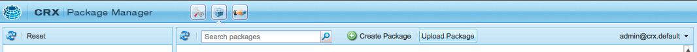

# How to Work With Packages{#how-to-work-with-packages}

패키지를 사용하면 저장소 컨텐츠를 가져오고 내보낼 수 있습니다. 예를 들어 패키지를 사용하여 새 기능을 설치하고 인스턴스 간에 컨텐츠를 전송하며 저장소 컨텐츠를 백업할 수 있습니다.

패키지는 다음 페이지에서 액세스 및/또는 유지 관리할 수 있습니다.

* [패키지](#package-manager)관리자를 참조하십시오.

* [패키지 공유](#package-share)- 공개적으로 사용 가능한 패키지와 회사에 개인 패키지를 모두 보관하는 중앙 서버 공개 패키지에는 핫픽스, 새로운 기능, 설명서 등이 포함될 수 있습니다.

패키지 관리자, 패키지 공유 및 파일 시스템 간에 패키지를 전송할 수 있습니다.

## 패키지 소개 {#what-are-packages}

패키지는 파일 시스템 직렬화(&quot;저장소&quot; 직렬화라고 함)의 형식으로 저장소 컨텐츠를 저장하는 zip 파일입니다. 이렇게 하면 파일 및 폴더를 쉽게 편집하고 표현할 수 있습니다.

패키지에는 필터를 사용하여 선택한 컨텐츠, 페이지 컨텐츠 및 프로젝트 관련 컨텐츠가 모두 포함됩니다.

또한 패키지에는 필터 정의 및 가져오기 구성 정보를 포함한 저장소 메타 정보도 포함되어 있습니다. 추가 컨텐츠 속성(패키지 추출에 사용되지 않음)은 설명, 시각적 이미지 또는 아이콘과 같은 패키지에 포함될 수 있습니다.이러한 속성은 컨텐츠 패키지 소비자에 사용되며 정보 제공용으로만 사용됩니다.

>[!NOTE]
>
>패키지는 패키지가 빌드될 때 컨텐츠의 현재 버전을 나타냅니다. AEM이 저장소에 보관하는 컨텐츠의 이전 버전은 포함되지 않습니다.

패키지에 대해 또는 패키지로 다음 작업을 수행할 수 있습니다.

* 새 패키지 생성;필요에 따라 패키지 설정 및 필터 정의
* 패키지 내용 미리 보기(빌드 전)
* 패키지 빌드
* 패키지 정보 보기
* 패키지 내용 보기(빌드 후)
* 기존 패키지의 정의 수정
* 기존 패키지 다시 작성
* 패키지 다시 래핑
* AEM에서 파일 시스템으로 패키지 다운로드
* 파일 시스템의 패키지를 로컬 AEM 인스턴스로 업로드
* 설치 전에 패키지 컨텐츠 유효성 확인
* 연습 설치 수행
* 패키지 설치(AEM은 업로드 후 패키지를 자동으로 설치하지 않음)
* 패키지 삭제
* 패키지 공유 라이브러리에서 핫픽스와 같은 패키지 다운로드
* 패키지 공유 라이브러리의 회사 내부 섹션에 패키지 업로드

## 패키지 정보 {#package-information}

패키지 정의는 다음과 같은 다양한 유형의 정보로 구성됩니다.

* [패키지 설정](#package-settings)
* [패키지 필터](#package-filters)
* [스크린샷 패키지](#package-screenshots)
* [패키지 아이콘](#package-icons)

### 패키지 설정 {#package-settings}

다양한 패키지 설정을 편집하여 패키지 설명, 관련 버그, 종속성 및 공급자 정보와 같은 측면을 정의할 수 있습니다.

패키지 **설정** 대화 **상자는** 패키지를 [만들거나](#creating-a-new-package) [편집할 때](#viewing-and-editing-package-information) 편집버튼을 통해 사용할 수 있으며 구성을 위한 세 개의 탭을 제공합니다. 변경 사항이 발생하면 확인을 **클릭하여** 저장합니다.


| **필드** | **설명** |
|---|---|
| 이름 | 패키지의 이름입니다. |
| 그룹 | 패키지를 구성하기 위해 패키지를 추가할 그룹의 이름입니다. 새 그룹의 이름을 입력하거나 기존 그룹을 선택합니다. |
| 버전 | 사용자 정의 버전에 사용할 텍스트입니다. |
| 설명 | 패키지에 대한 간단한 설명입니다. 서식에 HTML 마크업을 사용할 수 있습니다. |
| 축소판 | 패키지 목록에 표시되는 아이콘입니다. 찾아보기를 클릭하여 로컬 파일을 선택합니다. |


<table>
 <tbody>
  <tr>
   <th><strong>필드</strong></th>
   <th><strong>설명</strong></th>
   <th><strong>형식/예</strong></th>
  </tr>
  <tr>
   <td>이름</td>
   <td>공급자의 이름입니다.</td>
   <td><em>AEM Geometrixx<br /> </em></td>
  </tr>
  <tr>
   <td>URL</td>
   <td>공급자의 URL입니다.</td>
   <td><em>https://www.aem-geometrixx.com</em></td>
  </tr>
  <tr>
   <td>링크</td>
   <td>공급자 페이지에 대한 패키지별 링크.</td>
   <td><em>https://www.aem-geometrixx.com/mypackage.html</em></td>
  </tr>
  <tr>
   <td>필수 항목<br /> </td>
   <td>
    <ul>
     <li>관리:관리 권한이 있는 계정에서만 패키지를 설치할 수 있는 시기를 선택합니다.</li>
     <li>다시 시작:패키지를 설치한 후 서버를 다시 시작해야 하는 경우를 선택합니다.</li>
    </ul> </td>
   <td> </td>
  </tr>
  <tr>
   <td>AC 처리</td>
   <td><p>패키지를 가져올 때 패키지에 정의된 액세스 제어 정보를 처리하는 방법을 지정합니다.</p>
    <ul>
     <li><strong>무시</strong></li>
     <li><strong>덮어쓰기</strong></li>
     <li><strong>병합</strong></li>
     <li><strong>지우기</strong></li>
     <li><strong>MergePreserve</strong></li>
    </ul> <p>기본값은 <strong>무시입니다</strong>.</p> </td>
   <td>
    <ul>
     <li><strong>무시</strong> - 저장소의 ACL 유지</li>
     <li><strong>덮어쓰기</strong> - 저장소의 ACL 덮어쓰기</li>
     <li><strong>병합</strong> - 두 ACL 집합 모두 병합</li>
     <li><strong>지우기</strong> - ACL 지우기</li>
     <li><strong>병합보존</strong> - 컨텐츠에 없는 주도자의 액세스 제어 항목을 추가하여 컨텐츠에 있는 액세스 제어 항목을 패키지와 함께 제공된 컨트롤과 병합</li>
    </ul> </td>
  </tr>
 </tbody>
</table>


| **필드** | **설명** | **형식/예** |
|---|---|---|
| 테스트 대상 | 이 패키지가 타깃팅되었거나 호환되는 제품 이름 및 버전입니다. | *AEM6* |
| 해결된 버그/문제 | 이 패키지에서 수정된 버그의 세부 사항을 나열할 수 있는 텍스트 필드입니다. 각 버그를 별도의 줄에 나열합니다. | bug-nr 요약 |
| 종속 대상 | 현재 패키지가 예상대로 실행되도록 하기 위해 다른 패키지가 필요할 때마다 따라야 하는 종속성 정보를 나열합니다. 이 필드는 핫픽스를 사용할 때 중요합니다. | groupId:name:version |
| 바꾸기 | 이 패키지가 대체하는 사용되지 않는 패키지 목록입니다. 설치하기 전에 이 패키지에 콘텐츠를 덮어쓰지 않도록 오래된 패키지의 모든 필수 콘텐트가 포함되어 있는지 확인하십시오. | groupId:name:version |

### 패키지 필터 {#package-filters}

필터는 패키지에 포함할 저장소 노드를 식별합니다. 필터 **정의는** 다음 정보를 지정합니다.

* 포함할 **컨텐츠의** 루트 경로입니다.
* **루트 경로 아래에 특정 노드를 포함하거나 제외하는 규칙입니다** .

필터에는 0개 이상의 규칙이 포함될 수 있습니다. 정의된 규칙이 없으면 패키지에 루트 경로 아래의 모든 컨텐츠가 포함됩니다.

패키지에 대해 하나 이상의 필터 정의를 정의할 수 있습니다. 둘 이상의 필터를 사용하여 여러 루트 경로의 컨텐츠를 포함할 수 있습니다.


다음 표에서는 이러한 규칙에 대해 설명하고 예제를 제공합니다.

<table>
 <tbody>
  <tr>
   <th> 규칙 유형</th>
   <th>설명 </th>
   <th>예 </th>
  </tr>
  <tr>
   <td> 포함</td>
   <td>경로를 정의하거나 정규 표현식을 사용하여 포함할 모든 노드를 지정할 수 있습니다.<br /> 디렉토리를 <br /> 포함하면 다음과 같습니다.
    <ul>
     <li>해당 디렉토리 <i>및</i> 해당 디렉토리의 모든 파일 및 폴더 포함(전체 하위 트리)</li>
     <li><strong>지정된 루트 경로 아래의 다른 파일 또는 폴더를 포함하지</strong> 않음</li>
    </ul> </td>
   <td>/libs/sling/install(/.*)? </td>
  </tr>
  <tr>
   <td> 제외</td>
   <td>경로를 지정하거나 정규 표현식을 사용하여 제외할 모든 노드를 지정할 수 있습니다.<br /> 디렉토리를 <br /> 제외하면 해당 디렉토리 <i>및</i> 해당 디렉토리의 모든 파일 및 폴더(즉, 전체 하위 트리)가 제외됩니다.<br /> </td>
   <td>/libs/wcm/foundation/components(/)*)?</td>
  </tr>
 </tbody>
</table>

>[!NOTE]
>
>하나의 패키지에 여러 필터 정의가 포함될 수 있으므로 다른 위치의 노드를 하나의 패키지로 손쉽게 결합할 수 있습니다.

패키지 필터는 처음 패키지를 [만들 때](#creating-a-new-package)정의되지만, 나중에 편집할 수도 있습니다(패키지 재구축 후).

### 스크린샷 패키지 {#package-screenshots}

스크린샷을 패키지에 첨부하여 컨텐츠의 모양을 시각적으로 표시할 수 있습니다.예를 들어 새로운 기능의 스크린샷을 제공합니다.

### 패키지 아이콘 {#package-icons}

패키지에 포함된 내용을 빠르게 참조할 수 있도록 아이콘을 패키지에 첨부할 수도 있습니다. 그러면 패키지 목록에 표시되고 패키지 또는 패키지 클래스를 쉽게 식별할 수 있습니다.

패키지에 아이콘이 포함될 수 있으므로 공식 패키지에는 다음 규칙이 사용됩니다.

>[!NOTE]
>
>혼동을 방지하려면 패키지에 대해 설명 아이콘을 사용하고 공식 아이콘 중 하나를 사용하지 마십시오.

공식 핫픽스 패키지:


공식 AEM 설치 또는 확장 패키지:

공식 기능 팩:


## 패키지 관리자 {#package-manager}

패키지 관리자는 로컬 AEM 설치에서 패키지를 관리합니다. 필요한 권한을 [할당한](#permissions-needed-for-using-the-package-manager) 후 패키지 관리자를 사용하여 패키지를 구성, 빌드, 다운로드 및 설치하는 등 다양한 작업을 수행할 수 있습니다. 구성할 주요 요소는 다음과 같습니다.

* [패키지 설정](#package-settings)
* [패키지 필터](#package-filters)

### 패키지 관리자 사용에 필요한 권한 {#permissions-needed-for-using-the-package-manager}

사용자에게 패키지를 생성, 수정, 업로드 및 설치할 수 있는 권한을 부여하려면 다음 위치에서 적절한 권한을 제공해야 합니다.

* **/etc/packages** (삭제 제외 전체 권한)
* 패키지 컨텐츠를 포함하는 노드

권한 [변경에 대한 지침은 권한](/help/sites-administering/security.md#setting-page-permissions) 설정을 참조하십시오.

### 새 패키지 생성 {#creating-a-new-package}

새 패키지 정의를 만들려면:

1. AEM 시작 화면에서 **패키지를** 클릭하거나 도구 **콘솔에서** **패키지를**&#x200B;두 번클릭합니다.

1. 그런 다음 **패키지 관리자를 선택합니다**.
1. 패키지 **만들기를 클릭합니다**.

   >[!NOTE]
   >
   >인스턴스에 패키지가 많으면 폴더 구조가 있을 수 있으므로 새 패키지를 생성하기 전에 필요한 대상 폴더로 이동할 수 있습니다.

1. 대화 상자에서 다음을 수행합니다.

   

   다음을 입력합니다.

   * **그룹 이름**

      대상 그룹(또는 폴더) 이름입니다. 그룹은 패키지를 구성하는 데 사용됩니다.

      폴더가 없는 경우 해당 그룹에 대해 폴더가 생성됩니다. 그룹 이름을 비워 두면 기본 패키지 목록(홈 > 패키지)에 패키지가 생성됩니다.

   * **패키지 이름**

      새 패키지의 이름입니다. 설명형 이름을 선택하여 패키지 컨텐츠를 쉽게 식별할 수 있습니다.

   * **버전**

      버전을 나타내는 텍스트 필드입니다. zip 파일의 이름을 형성하기 위해 패키지 이름에 추가됩니다.
   확인을 **클릭하여** 패키지를 생성합니다.

1. AEM은 해당 그룹 폴더에 새 패키지를 나열합니다.

   

   아이콘을 클릭하거나 패키지 이름을 클릭하여 엽니다.

   

   >[!NOTE]
   >
   >필요한 경우 나중에 이 페이지로 돌아갈 수 있습니다.

1. 편집을 **클릭하여** [패키지 설정을](#package-settings)편집합니다.

   여기에서 정보를 추가하고 특정 설정을 정의할 수 있습니다.예를 들어 설명, [아이콘](#package-icons), 관련 버그 및 공급자 세부 사항 추가가 포함됩니다.

   설정 **편집을** 완료한 후 확인을 클릭합니다.

1. 필요에 **[따라](#package-screenshots)**패키지에 스크린샷을 추가합니다. 패키지가 만들어지면 하나의 인스턴스를 사용할 수 있습니다. 사이드 킥의 스크린샷 패키지를 사용하여 필요한 경우&#x200B;**더**추가합니다.

   스크린샷 영역에서 이미지 구성 요소를 두 번 클릭하고 이미지를 **추가한** 다음 확인을 클릭하여 실제 이미지를 **추가합니다**.

1. 사이드 **[킥에서 필터 정의](#package-filters)**인스턴스를 드래그한 다음&#x200B;**두 번 클릭하여**열어서패키지 필터를 정의합니다.

   

   지정:

   * **루트**&#x200B;경로패키지할 컨텐츠;이것은 하위 트리의 루트일 수 있습니다.
   * **규칙**&#x200B;은 선택 사항입니다.단순 패키지 정의의 경우 포함 또는 제외 규칙을 지정할 필요가 없습니다.

      필요한 경우 포함 또는 제외 [**규칙을&#x200B;**정의하여****패키지](#package-filters)컨텐츠를정확하게 정의할 수 있습니다.

      &#x200B;+ 기호를 사용하여 규칙을 **추가하고** , 또는 **기호를 사용하여 규칙을 제거합니다** . 규칙은 순서에 따라 적용되므로 [위로] 및 [아래로] 단추를 사용하여 필요에 따라 **규칙을** 배치할 **수** 있습니다.
   그런 다음 **확인을** 클릭하여 필터를 저장합니다.

   >[!NOTE]
   >
   >필터 정의를 필요한 만큼 사용할 수 있지만 필터 정의가 충돌하지 않도록 주의해야 합니다. 미리 **보기를** 사용하여 패키지 컨텐츠의 내용을 확인합니다.

1. 패키지에 포함할 내용을 확인하려면 미리 보기를 사용할 수 **있습니다**. 이렇게 하면 빌드 프로세스의 연습 실행을 수행하고 실제로 빌드될 때 패키지에 추가될 모든 것을 나열합니다.
1. 이제 패키지를 [빌드할](#building-a-package) 수 있습니다.

   >[!NOTE]
   >
   >이 시점에서 패키지를 빌드하는 것은 필수가 아닙니다. 나중에 수행할 수 있습니다.

### 패키지 작성 {#building-a-package}

패키지 정의는 [](#creating-a-new-package)만들 때와 동시에 패키지가 빌드되는 경우가 많습니다. 그러나 나중에 패키지를 빌드하거나 다시 빌드할 때 다시 돌아올 수 있습니다. 이 기능은 저장소 내의 컨텐츠가 변경된 경우에 유용합니다.

>[!NOTE]
>
>패키지를 빌드하기 전에 패키지의 내용을 미리 보는 것이 유용할 수 있습니다. 이렇게 하려면 미리 보기를 **클릭합니다**.

1. 패키지 관리자에서 패키지 정의를 **엽니다** (패키지 아이콘 또는 이름을 클릭).

1. 빌드를 **클릭합니다**. 패키지를 빌드할 것인지 확인하는 대화 상자가 나타납니다.

   >[!NOTE]
   >
   >패키지 컨텐츠를 덮어쓸 때 패키지를 다시 빌드할 때 특히 중요합니다.

1. **확인**&#x200B;을 클릭합니다. AEM은 패키지에 추가된 모든 컨텐츠를 나열하는 패키지를 작성합니다. 전체 AEM에 패키지가 작성되었음을 확인하는 메시지가 표시되고(대화 상자를 닫을 때) 패키지 목록 정보가 업데이트됩니다.

### 패키지 리래핑 {#rewrapping-a-package}

패키지가 만들어지면 필요한 경우 다시 래핑할 수 있습니다.

리래핑하면 패키지 컨텐츠가 변경되지 *않고* 패키지 정보가 변경됩니다. 패키지 정보는 축소판, 설명 등을 의미합니다. 즉, 패키지 설정 대화 상자에서 편집할 수 있는 모든 **기능을** 사용할 수 **있습니다**.

패키지 공유에 대한 패키지를 준비할 때는 재랩의 주요 사용 사례입니다. 예를 들어 기존 패키지가 있고 다른 사람과 이 패키지를 공유하기로 결정할 수 있습니다. 축소판을 추가하고 설명을 추가할 수 있습니다. 전체 패키지를 모든 기능으로 다시 만드는 대신(시간이 오래 걸리고 패키지가 원본과 더 이상 동일하지 않을 위험이 있음) 다시 래핑하고 축소판과 설명을 추가할 수 있습니다.

1. 패키지 관리자에서 패키지 정의를 **엽니다** (패키지 아이콘 또는 이름을 클릭).

1. 편집을 **클릭하고** 필요에 따라 패키지 **[설정을](#package-settings)**업데이트합니다.**확인**을 클릭하여 저장합니다.

1. 다시 **래핑을**&#x200B;클릭하면 확인 대화 상자가 표시됩니다.

### 패키지 정보 보기 및 편집 {#viewing-and-editing-package-information}

패키지 정의에 대한 정보를 보거나 편집하려면:

1. 패키지 관리자에서 보려는 패키지로 이동합니다.
1. 보려는 패키지의 패키지 아이콘을 클릭합니다. 그러면 패키지 정의에 대한 정보가 나열된 패키지 페이지가 열립니다.

   

   >[!NOTE]
   >
   >이 페이지에서 패키지에 대해 특정 작업을 편집하고 수행할 수도 있습니다.
   >
   >사용 가능한 단추는 패키지가 이미 빌드되었는지 여부에 따라 달라집니다.

1. 패키지가 이미 빌드된 경우 **내용을**&#x200B;클릭하면 창이 열리고 패키지의 전체 내용이 나열됩니다.

### 패키지 내용 보기 및 테스트 설치 {#viewing-package-contents-and-testing-installation}

패키지가 빌드된 후 컨텐츠를 볼 수 있습니다.

1. 패키지 관리자에서 보려는 패키지로 이동합니다.
1. 보려는 패키지의 패키지 아이콘을 클릭합니다. 그러면 패키지 정의에 대한 정보가 나열된 패키지 페이지가 열립니다.

1. 컨텐츠를 보려면 **컨텐츠를**&#x200B;클릭합니다. 창이 열리고 패키지의 전체 컨텐츠가 나열됩니다.

   

1. 설치를 드라이 실행하려면 설치 테스트를 **클릭합니다**. 작업을 확인한 후 창이 열리고 설치가 수행된 것처럼 결과가 나열됩니다.

   

### 파일 시스템에 패키지 다운로드 {#downloading-packages-to-your-file-system}

이 섹션에서는 패키지 관리자를 사용하여 AEM에서 파일 시스템으로 패키지를 다운로드하는 방법을 **설명합니다**.

>[!NOTE]
>
>공개 [영역과](#package-share) 귀사의 패키지 공유 내부 영역에서 핫픽스, 기능 팩 및 패키지를 다운로드하는 방법에 대한 자세한 내용은 패키지 공유를 참조하십시오.
>
>패키지 공유에서 다음을 수행할 수 있습니다.
>
>* 패키지 공유에서 [로컬 AEM 인스턴스로](#downloading-and-installing-packages-from-package-share)직접 패키지를 다운로드합니다.
   >  다운로드하면 패키지를 저장소로 가져오면 패키지 관리자를 사용하여 로컬 인스턴스에 즉시 설치할 수 **있습니다**. 이러한 패키지에는 핫픽스 및 기타 공유 패키지가 포함되어 있습니다.
   >
   >
* 패키지 공유에서 [파일 시스템으로](#downloading-packages-to-your-file-system-from-package-share)패키지를 다운로드합니다.
>


1. AEM 시작 화면에서 패키지를 클릭한 **다음**&#x200B;패키지 **관리자를 선택합니다**.
1. 다운로드할 패키지로 이동합니다.

   

1. 다운로드할 패키지의 zip 파일(밑줄 표시) 이름으로 구성된 링크를 클릭합니다.예를 `export-for-offline.zip`들면 다음과 같습니다.

   AEM은 표준 브라우저 다운로드 대화 상자를 사용하여 패키지를 컴퓨터에 다운로드합니다.

### 파일 시스템에서 패키지 업로드 {#uploading-packages-from-your-file-system}

패키지 업로드를 사용하면 파일 시스템의 패키지를 AEM 패키지 관리자로 업로드할 수 있습니다.

>[!NOTE]
>
>회사 [내부 패키지 공유에](#uploading-packages-to-the-company-internal-package-share) 패키지 업로드를 참조하여 회사의 개인 영역 패키지 공유를 참조하십시오.

패키지를 업로드하려면

1. 패키지 **관리자로 이동합니다**. 그런 다음 패키지를 업로드할 그룹 폴더로 이동합니다.

   

1. 패키지 **업로드를 클릭합니다**.

   

   * **파일**

      **파일 이름을 직접 입력하거나 찾아보기...를 사용할**&#x200B;수 있습니다.대화 상자를 클릭하여 로컬 파일 시스템에서 필요한 패키지를 선택합니다(선택 후 확인 **클릭**).

   * **강제 업로드**

      이 이름의 패키지가 이미 있는 경우 이 패키지를 클릭하여 강제로 업로드(그리고 기존 패키지를 덮어쓰기)할 수 있습니다.
   [ **확인** ]을 클릭하여 새 패키지가 업로드되고 [패키지 관리자] 목록에 나열됩니다.

   >[!NOTE]
   >
   >AEM에서 컨텐츠를 사용할 수 있도록 하려면 패키지를 [](#installing-packages)반드시 설치해야 합니다.

### 패키지 유효성 확인 {#validating-packages}

패키지를 설치하기 전에 해당 컨텐츠를 확인할 수 있습니다. 패키지는 `/apps` 및/또는 ACL에서 오버레이된 파일을 수정할 수 있으므로 설치하기 전에 이러한 변경 사항을 확인하는 데 유용합니다.

#### 유효성 검사 옵션 {#validation-options}

유효성 검사 메커니즘은 패키지의 다음 특성을 확인할 수 있습니다.

* OSGi 패키지 가져오기
* 오버레이
* ACL

이러한 옵션은 아래에 자세히 설명되어 있습니다.

* **OSGi 패키지 가져오기 유효성 검사**

   **확인 사항**

   이 유효성 검사는 모든 JAR 파일(OSGi 번들)에 대한 패키지를 검사하고, OSGi 번들에 의존하는 버전 `manifest.xml` 있는 종속성을 추출하고, AEM 인스턴스 내보내기에서 올바른 버전에 대한 종속성을 확인합니다.

   **보고 방법**

   AEM 인스턴스에서 만족시킬 수 없는 버전 종속성은 패키지 **관리자의** 활동 로그에 나열됩니다.

   **오류 상태**

   종속성이 충족되지 않으면 해당 종속성이 있는 패키지의 OSGi 번들이 시작되지 않습니다. 이렇게 하면 시작되지 않은 OSGi 번들에 의존하는 모든 것이 제대로 작동하지 않으므로 애플리케이션 배포가 중단됩니다.

   **오류 해결**

   충족되지 않은 OSGi 번들로 인한 오류를 해결하려면, 충족되지 않은 가져오기가 있는 번들의 종속성 버전을 조정해야 합니다.

* **오버레이 유효성 검사**

   **확인 사항**

   이 유효성 검사는 설치되는 패키지에 대상 AEM 인스턴스에 이미 오버레이된 파일이 포함되어 있는지 여부를 결정합니다.

   예를 들어 에 기존 오버레이가 `/apps/sling/servlet/errorhandler/404.jsp`있는 경우 에 있는 기존 파일을 변경할 `/libs/sling/servlet/errorhandler/404.jsp`수 있는 패키지가 `/libs/sling/servlet/errorhandler/404.jsp`있습니다.

   **보고 방법**

   이러한 오버레이는 패키지 관리자의 **활동** 로그에 설명되어 있습니다.

   **오류 상태**

   오류 상태는 패키지가 이미 오버레이된 파일을 배포하려고 하는 것이므로 패키지의 변경 사항은 오버레이에 의해 무시되고, 따라서 &quot;숨김&quot; 상태가 적용되지 않음을 의미합니다.

   **오류 해결**

   이 문제를 해결하려면 오버레이 파일의 유지 관리자가 오버레이 파일의 변경 내용을 검토하고 필요에 따라 변경 내용을 오버레이( `/apps` )에 `/libs` `/apps`통합하고 오버레이 파일을 다시 배포해야 합니다.

   >[!NOTE]
   >
   >오버레이 파일에 오버레이된 컨텐츠가 제대로 포함되어 있는 경우 유효성 검사 메커니즘은 조정할 수 없습니다. 따라서 이 유효성 검사는 필요한 변경 사항이 있는 후에도 충돌을 계속 보고합니다.

* **ACL 유효성 검사**

   **확인 사항**

   이 유효성 검사는 추가되는 권한, 어떻게 처리할지(병합/바꾸기) 및 현재 권한에 영향을 주는지 확인합니다.

   **보고 방법**

   권한은 패키지 관리자의 **활동** 로그에 설명되어 있습니다.

   **오류 상태**

   명시적 오류는 제공할 수 없습니다. 유효성 확인은 패키지 설치 시 새로운 ACL 권한이 추가되거나 영향을 받는지를 나타냅니다.

   **오류 해결**

   유효성 검사로 제공된 정보를 사용하여 영향을 받는 노드를 CRXDE에서 검토할 수 있으며 ACL은 필요에 따라 패키지에서 조정할 수 있습니다.

   >[!CAUTION]
   >
   >AEM 제공 ACL에는 예기치 않은 제품 동작이 발생할 수 있으므로 패키지가 영향을 주지 않는 것이 좋습니다.

#### 유효성 검사 수행 {#performing-validation}

패키지의 유효성 검사는 다음 두 가지 방법으로 수행할 수 있습니다.

* 패키지 관리자 UI 사용
* cURL과 같은 HTTP POST 요청을 통해

>[!NOTE]
>
>패키지를 업로드한 후에 설치하기 전에 항상 유효성 검사가 수행되어야 합니다.

**패키지 관리자를 통한 패키지 유효성 검사**

1. 패키지 관리자를 엽니다. `https://<server>:<port>/crx/packmgr`
1. 목록에서 패키지를 선택한 다음 **머리글에서 자세히** 드롭다운을 선택한 다음 **드롭다운 메뉴에서 유효성** 검사를선택합니다.

   >[!NOTE]
   >
   >이 작업은 컨텐츠 패키지를 업로드한 후에 패키지를 설치하기 전에 수행해야 합니다.

1. 그런 다음 표시되는 모달 대화 상자에서 확인란을 사용하여 유효성 검사 유형을 선택하고 유효성 확인을 클릭하여 유효성 검사를 **시작합니다**. 또는 취소를 **클릭합니다**.

1. 그런 다음 선택한 유효성 검사를 실행합니다. 결과는 패키지 관리자의 작업 로그에 표시됩니다.

**HTTP POST 요청을 통한 패키지 유효성 검사**

POST 요청은 다음 양식을 사용합니다.

```
https://<host>:<port>/crx/packmgr/service.jsp?cmd=validate&type=osgiPackageImports,overlays,acls
```

>[!NOTE]
>
>매개 `type` 변수는 쉼표로 구분되는 순서가 없는 목록으로 구성될 수 있습니다.
>
>* `osgiPackageImports`
>* `overlays`
>* `acls`
>
>
이 값이 전달되지 않으면 `type` 기본값이 `osgiPackageImports` 됩니다.

다음은 cURL을 사용하여 패키지 유효성 검사를 실행하는 예입니다.

1. cURL을 사용하는 경우 다음과 유사한 문을 실행합니다.

   ```shell
   curl -v -X POST --user admin:admin -F file=@/Users/SomeGuy/Desktop/core.wcm.components.all-1.1.0.zip 'http://localhost:4502/crx/packmgr/service.jsp?cmd=validate&type=osgiPackageImports,overlays,acls'
   ```

1. 요청한 유효성 검사가 실행되며 응답은 JSON 개체로 다시 전송됩니다.

>[!NOTE]
>
>유효성 검사 HTTP POST 요청에 대한 응답은 유효성 검사 결과가 포함된 JSON 개체가 됩니다.

### 패키지 설치 {#installing-packages}

패키지를 업로드한 후 컨텐츠를 설치해야 합니다. 패키지 컨텐츠를 설치하고 작동하려면 두 가지 모두를 갖추어야 합니다.

* aem에 로드됨(파일 시스템에서 [업로드되거나 패키지 공유에서](#uploading-packages-from-your-file-system) [다운로드됨](#downloading-and-installing-packages-from-package-share))

* 설치됩니다

>[!CAUTION]
>
>패키지를 설치하면 기존 컨텐츠를 덮어쓰거나 삭제할 수 있습니다. 필요한 콘텐트를 삭제하거나 덮어쓰지 않는 경우에만 패키지를 업로드하십시오.
>
>패키지의 내용 또는 효과를 보려면 다음을 수행할 수 있습니다.
>
>* 컨텐츠를 수정하지 않고 패키지의 테스트 설치를 수행합니다.
   >  패키지를 열고(패키지 아이콘 또는 이름을 클릭) 설치 테스트를 **클릭합니다**.
   >
   >
* 패키지 컨텐츠 목록을 참조하십시오.
   >  패키지를 열고 컨텐츠를 **클릭합니다**.
>


>[!NOTE]
>
>패키지를 설치하기 직전에 덮어쓸 컨텐츠를 포함하도록 스냅샷 패키지가 생성됩니다.
>
>패키지를 제거하는 경우/에 이 스냅샷이 다시 설치됩니다.

>[!CAUTION]
>
>디지털 자산을 설치하는 경우 다음을 수행해야 합니다.
>
>* 먼저 WorkflowLauncher를 비활성화합니다.
   >  OSGi 콘솔의 구성 요소 메뉴 옵션을 사용하여 비활성화합니다 `com.day.cq.workflow.launcher.impl.WorkflowLauncherImpl`.
   >
   >
* 설치가 완료되면 WorkflowLauncher를 다시 활성화합니다.
>
>
WorkflowLauncher를 비활성화하면 Assets Importer 프레임워크가 설치 시 에셋을 의도적으로 조작하지 않습니다.

1. 패키지 관리자에서 설치할 패키지를 탐색합니다.

   아직 **설치되지** 않은 패키지 측면에 설치 버튼이 표시됩니다.

   >[!NOTE]
   >
   >또는 해당 아이콘을 클릭하여 패키지를 열어 설치 **버튼을 이용할 수** 있습니다.

1. 설치를 **클릭하여** 설치를 시작합니다. 대화 상자가 확인을 요청하고 모든 변경 사항을 나열합니다. 완료되면 대화 **상자에서** 닫기를 클릭합니다.

   패키지가 **설치되면** 패키지 옆에 설치됨이라는 단어가 표시됩니다.

### 파일 시스템 기반 업로드 및 설치 {#file-system-based-upload-and-installation}

인스턴스에 패키지를 업로드하고 설치하는 다른 방법이 있습니다. 파일 시스템에는 jar 및 파일과 함께 `crx-quicksart` 폴더가 `license.properties` 있습니다. 아래에 `install` 명명된 폴더를 만들어야 합니다 `crx-quickstart`. 그러면 다음과 같은 것이 있습니다. `<aem_home>/crx-quickstart/install`

이 설치 폴더에서 패키지를 직접 추가할 수 있습니다. 이 구성 요소는 자동으로 업로드되고 인스턴스에 설치됩니다. 완료되면 패키지 관리자에서 패키지를 볼 수 있습니다.

인스턴스가 실행 중인 경우 폴더에 패키지를 추가하면 업로드와 인스턴스의 설치가 직접 시작됩니다. `install` 인스턴스가 실행되고 있지 않으면 `install` 폴더에 넣은 패키지는 시작 시 알파벳 순서로 설치됩니다.

>[!NOTE]
>
>인스턴스를 처음으로 시작하기 전에 이 작업을 수행할 수도 있습니다. 이렇게 하려면 `crx-quickstart` 폴더를 수동으로 만들고 그 아래에 `install` 폴더를 만들고 거기에 패키지를 배치해야 합니다. 그런 다음 인스턴스를 처음 실행하면 패키지는 사전순으로 설치됩니다.

### 패키지 제거 {#uninstalling-packages}

AEM에서는 패키지를 제거할 수 있습니다. 이 작업은 패키지 설치 바로 전에 생성된 스냅샷에 영향을 미치는 저장소의 컨텐츠를 되돌립니다.

>[!NOTE]
>
>설치 시 덮어쓸 컨텐츠가 포함된 스냅샷 패키지가 생성됩니다.
>
>패키지를 제거하면 이 패키지가 다시 설치됩니다.

1. 패키지 관리자에서 제거할 패키지로 이동합니다.
1. 제거할 패키지의 패키지 아이콘을 클릭합니다.
1. 저장소에서 **이** 패키지의 컨텐츠를 제거하려면 제거를 클릭합니다. 대화 상자가 확인을 요청하고 모든 변경 사항을 나열합니다. 완료되면 대화 **상자에서** 닫기를 클릭합니다.

### 패키지 삭제 {#deleting-packages}

패키지 관리자 목록에서 패키지를 삭제하려면

>[!NOTE]
>
>패키지에서 설치된 파일/노드는 **삭제되지 않습니다** .

1. 도구 **콘솔에서** 패키지 **폴더를** 확장하여 오른쪽 창에 패키지를 표시합니다.

1. 삭제하려는 패키지를 클릭하여 강조 표시한 다음 다음 중 하나를 선택합니다.

   * 도구 **모음** 메뉴에서 삭제를 클릭합니다.
   * 마우스 오른쪽 버튼을 클릭하고 삭제를 **선택합니다**.
   

1. AEM 파섹 Click **OK** to confirm the deletion.

>[!CAUTION]
>
>이 패키지가 이미 설치되어 있는 경우 *설치된* 컨텐츠는 **삭제되지** 않습니다.

### 패키지 복제 {#replicating-packages}

패키지의 컨텐츠를 복제하여 게시 인스턴스에 설치합니다.

1. 패키지 **관리자에서**&#x200B;복제할 패키지로 이동합니다.

1. 복제할 패키지의 아이콘 또는 이름을 클릭하여 확장합니다.
1. 도구 **모음의 자세히** 드롭다운 메뉴에서 복제를 **선택합니다**.

## 패키지 공유 {#package-share}

패키지 공유는 컨텐츠 패키지를 공유하기 위해 공개적으로 사용 가능한 중앙 서버입니다.

패키지 공유를 사용하면 이러한 패키지를 다운로드할 수 있습니다. 이 패키지에는 공식 핫픽스, 기능 세트, 업데이트 또는 다른 사용자가 생성한 샘플 컨텐츠가 포함되어 있습니다.

회사 내에서 패키지를 업로드하고 공유할 수도 있습니다.

### 패키지 공유 액세스 {#access-to-package-share}

패키지 공유에 대한 익명의 액세스 권한이 없습니다.즉, 등록된 사용자만 패키지를 보고, 다운로드하고, 업로드할 수 있습니다.

Adobe 파트너 및 고객이 패키지 공유에 액세스할 수 있습니다. 액세스 권한을 할당하려면 등록 세부 사항을 제출해야 합니다.

패키지 공유에 액세스하려면

* 로그인 [페이지 사용](#signing-in-to-package-share)
* 로그인 페이지를 처음 사용할 때는 다음을 수행해야 합니다.

   * [Adobe ID 등록](#registering-for-package-share) 및/또는 기존 Adobe ID [확인](#validating-your-adobe-id)
   * 패키지 [공유 계정을](#package-share-account) 만들 수 있도록

>[!NOTE]
>
>고객에게 할당되지 않은 패키지 공유 사용자는 커뮤니티에 참여하여 패키지 공유 로그인 옆에 있는 **가입을** 클릭하여 해당 리소스를 확인해야 합니다.

#### 패키지 공유에 로그인 {#signing-in-to-package-share}

1. AEM 시작 화면에서 도구를 **클릭합니다**.
1. 그런 다음 패키지 **공유를 선택합니다**. 다음 중 하나를 수행해야 합니다.

   * adobe ID로 로그인
   * [Adobe ID 만들기](#registering-for-package-share)
   >[!NOTE]
   >
   >처음 Adobe ID로 로그인하면 이메일 주소 [확인을 완료해야 합니다](#validating-your-adobe-id).

   >[!NOTE]
   >
   >암호를 잊은 경우 도움말 페이지 [](https://enterprise-dev.adobe.com/content/edev/en/registration/account.html) 링크(로그인 대화 상자에서도)를 사용하십시오.

#### Adobe ID 유효성 확인 {#validating-your-adobe-id}

Adobe ID로 패키지 공유에 처음 로그인하면 이메일 주소가 확인됩니다.

1. 링크가 포함된 이메일을 수신하게 됩니다.
1. 이 링크를 클릭해야 합니다.
1. 웹 페이지가 열립니다.

   이 웹 페이지를 여는 작업은 유효성 검사로 수행됩니다.

1. 로그인하면 계속 됩니다.

1. 링크가 포함된 이메일을 수신하게 됩니다.
1. 이 링크를 클릭해야 합니다.
1. 웹 페이지가 열립니다. 이 웹 페이지를 여는 작업은 유효성 검사로 수행됩니다.
1. 로그인하면 계속 됩니다.

#### 패키지 공유 등록 {#registering-for-package-share}

패키지 공유에 액세스하려면 Adobe ID를 등록해야 합니다.

* 패키지 [공유 로그인 페이지에는](#signing-in-to-package-share) Adobe ID 등록을 위한 링크가 있습니다.
* 특정 Adobe 데스크탑 소프트웨어에서 Adobe ID를 등록할 수 있습니다.
* 또는 Adobe 로그인 페이지에서 [](https://www.adobe.com/cfusion/membership/index.cfm?nf=1&nl=1)온라인으로 등록할 수 있습니다.

Adobe ID는 다음을 제공하여 만들 수 있습니다.

* 이메일 주소
* 원하는 암호
* 귀하의 성명, 거주 국가 등과 같은 일부 추가 정보

#### 패키지 공유 계정 {#package-share-account}

응용 프로그램의 유효성은 다음에 앞서 확인됩니다.

* 사용자 계정은 필수/허용된 권한으로 만들어집니다.
* 계정이 회사의 그룹에 추가됩니다.

>[!NOTE]
>
>파트너 회사 중 한 명의 사용자가 고객 그룹의 구성원이 될 수도 있습니다.

#### 네트워크 고려 사항 {#network-considerations}

**IPv6**

순수 IPv6 환경에서 패키지 공유에 액세스하려고 할 때 문제가 발생할 수 있습니다.

이는 패키지 공유가 서버에서 호스팅되는 서비스이기 때문에 인터넷 상의 다양한 네트워크를 통해 연결됩니다. 모든 연결 네트워크가 IPv6를 지원하는지 확인할 수 없습니다.if not the connection might fail.

이 문제를 방지하려면 IPv4 네트워크에서 패키지 공유에 액세스하여 패키지를 다운로드한 다음 IPv6 환경에 업로드할 수 있습니다.

**HTTP 프록시**

회사에서 인증이 필요한 http 프록시를 실행하는 경우 현재 패키지 공유를 사용할 수 없습니다.

패키지 공유는 AEM 서버에서 인증이 필요 없는 인터넷에 액세스할 수 있는 경우에만 사용할 수 있습니다. http 클라이언트(패키지 공유 포함)를 사용하는 모든 서비스에 대한 프록시를 구성하려면 Day Commons HTTP Client 3.1 번들의 [OSGi 구성을 사용합니다](/help/sites-deploying/osgi-configuration-settings.md).

### 인사이드 패키지 공유 {#inside-package-share}

패키지 공유 패키지는 트리 하위 트리에서 정리됩니다.

* Adobe에서 제공하는 Adobe 패키지.
* 다른 회사가 제공하고 Adobe에서 공개한 공유 패키지.
* 비공개 회사 패키지입니다.


### 패키지 검색 및 필터링 {#searching-and-filtering-packages}

패키지 공유는 특정 키워드 또는/및 태그를 검색하는 데 사용할 수 있는 검색 막대를 제공합니다. 키워드와 태그는 모두 여러 값을 지원합니다.

* 여러 키워드를 검색하려면 각 키워드를 공백으로 구분해야 합니다.
* 여러 태그를 검색하려면 패키지 트리에서 각 태그를 선택해야 합니다.

필터 요약 막대의 오른쪽에 있는 조건 연산자를 OR에서 AND로 변경할 수도 있습니다.

### 패키지 공유에서 패키지 다운로드 및 설치 {#downloading-and-installing-packages-from-package-share}

패키지 공유에서 패키지를 다운로드하고 로컬 인스턴스에 설치하려면 AEM 인스턴스에서 패키지 공유에 쉽게 액세스할 수 있습니다. 그러면 패키지가 다운로드되고 즉시 패키지 관리자에서 패키지를 설치할 수 있습니다.

1. AEM 시작 화면에서 도구를 클릭한 **다음**&#x200B;패키지 공유를 **선택하여** 패키지 공유 페이지를 엽니다.
1. 계정 세부 사항을 사용하여 패키지 공유에 로그인합니다. 랜딩 페이지가 표시되고 Adobe 폴더, 공유 폴더 및 회사 특정 폴더가 나열됩니다.

   >[!NOTE]
   >
   >패키지 공유에서 패키지를 다운로드하기 전에 [필요한 액세스 권한이](#access-to-package-share)있는지 확인하십시오.

1. 다운로드할 패키지로 이동하고 다운로드를 **클릭합니다**.

1. 되돌아가거나 AEM 인스턴스의 **패키지** 관리자로 이동합니다. 그런 다음 다운로드한 패키지로 이동합니다.

   >[!NOTE]
   >
   >다운로드한 패키지를 찾으려면 패키지 공유와 동일한 경로를 따르십시오. 예를 들어 패키지 공유의 다음 경로에서 패키지를 다운로드한 경우:
   >
   >**패키지** > **공개** > **핫픽스**
   그런 다음 로컬 인스턴스의 패키지 관리자에서 패키지가 다음과 같이 표시됩니다.
   **패키지** > **공개** > **핫픽스**

1. 설치를 **클릭하여** 로컬 AEM 설치에 패키지를 설치합니다.

   >[!NOTE]
   패키지가 인스턴스에 이미 설치되어 있는 경우 **설치** 단추 대신 패키지 옆에 설치된 표시기가 **나타납니다** .

   >[!CAUTION]
   패키지를 설치하면 저장소의 기존 컨텐츠를 덮어쓸 수 있습니다. 따라서 먼저 테스트 설치를 **수행하는 것이 좋습니다** . 이렇게 하면 패키지에 포함된 컨텐츠가 기존 컨텐츠와 충돌하는지 여부를 검사할 수 있습니다.

### 패키지 공유에서 파일 시스템에 패키지 다운로드 {#downloading-packages-to-your-file-system-from-package-share}

[다운로드 및 설치가](#downloading-and-installing-packages-from-package-share) 매우 편리하지만 필요한 경우 패키지를 다운로드하여 로컬 파일 시스템에 저장할 수도 있습니다.

1. 패키지 공유에서 패키지 아이콘 또는 이름을 클릭합니다.
1. Click the **Assets** tab.
1. 디스크에 **다운로드를 클릭합니다**.

### 패키지 업로드 {#uploading-a-package}

패키지 공유를 사용하면 패키지를 회사 내부 패키지 공유 영역에 업로드할 수 있습니다. 이렇게 하면 회사 내에서 공유할 수 있습니다.

이러한 패키지는 일반 AEM 커뮤니티에서는 사용할 수 *없지만* 회사에 등록된 모든 사용자가 사용할 수 있습니다.

회사 내부 패키지 공유를 업로드하려면

>[!CAUTION]
패키지를 패키지 공유에 업로드하려면 먼저 로컬 패키지 관리자에서 회사 이름을 딴 그룹 폴더를 만들어야 합니다. 예: geometrixx. 공유를 위해 업로드할 모든 패키지를 이 그룹 폴더에 저장해야 합니다.
패키지 관리자 홈 목록 또는 다른 폴더에 있는 패키지는 공유할 수 없습니다.

1. 패키지 **관리자를** 열고 업로드하려는 패키지로 이동합니다.

1. 패키지 아이콘을 클릭하여 엽니다.
1. [ **공유** ]를 클릭하여 패키지를 [패키지 공유]에 업로드하기 위한 대화 상자를 엽니다.
1. 아직 패키지 공유에 로그인하지 않은 경우 로그인 자격 증명을 입력해야 합니다.

   로그인하면 AEM 파섹

   

1. 공유를 **클릭하여** 회사의 내부 패키지 공유에 패키지를 업로드합니다.

   AEM에 상태 및 패키지 업로드가 완료된 시기를 표시합니다. 그러면 **x** (오른쪽 위 모서리)를 클릭하여 패키지 공유 **창을 종료할 수** 있습니다.

1. 업로드가 완료되면 회사의 내부 폴더로 이동하여 방금 공유한 패키지를 볼 수 있습니다.

>[!NOTE]
패키지 공유에서 사용할 수 있는 패키지를 수정하려면 패키지를 다운로드하고 다시 빌드한 다음 다시 패키지 공유에 업로드해야 합니다.

### 패키지 삭제 {#deleting-a-package}

계속 진행하여 업로드한 패키지만 삭제할 수 있습니다.

1. 회사 트리에서 패키지가 들어 있는 패키지 그룹을 확인합니다.
1. 패키지를 클릭합니다.
1. 삭제 단추를 클릭합니다.

   

1. [ **삭제** ]를 클릭하여 패키지 삭제를 확인합니다.

### 패키지 반비공개 만들기 {#making-packages-semi-private}

조직 외부로 패키지를 공유할 수 있지만 공개적으로 공유할 수는 없습니다. 이러한 패키지는 반사적인 패키지로 간주됩니다. 이러한 반비공개 패키지를 공유하려면 Adobe 지원 센터에서 도움이 필요합니다. 이렇게 하려면 조직 외부에서 사용할 수 있는 패키지를 요청하는 Adobe 지원 센터에서 티켓을 여십시오. 패키지에 대한 액세스 권한을 부여할 Adobe ID 목록을 요청합니다.

## 소프트웨어 배포(베타) {#software-distribution-beta}

[소프트웨어](https://downloads.experiencecloud.adobe.com) 배포는 AEM 패키지의 검색 및 다운로드를 간소화하기 위해 고안된 새로운 사용자 인터페이스입니다. 현재 베타 상태에 있으며 Adobe Managed Services 및 AEM은 클라우드 서비스 고객뿐만 아니라 Adobe 직원만 이용할 수 있습니다.

>[!NOTE]
* [패키지](#package-share) 공유는 모든 고객이 소프트웨어 배포를 액세스할 수 있을 때까지 계속 작동합니다.
* 모든 패키지는 패키지 공유 및 소프트웨어 배포 모두에서 사용할 수 있습니다.


>[!CAUTION]
현재 AEM 패키지 관리자를 소프트웨어 배포에서 사용할 수 없습니다. 패키지를 로컬 디스크에 다운로드합니다.

