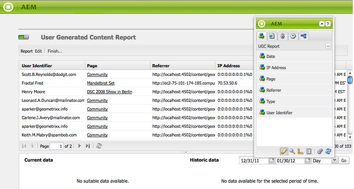
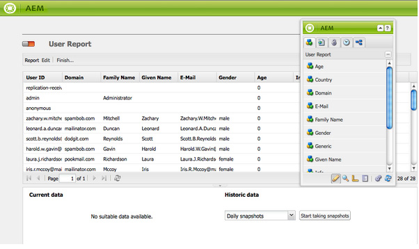
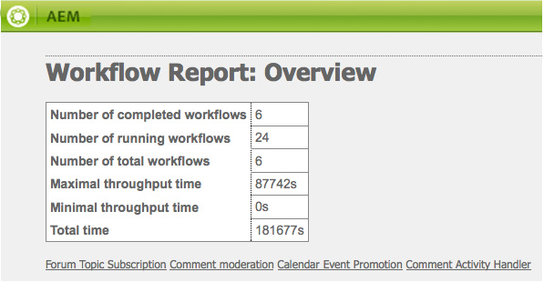

# 보고 {#reporting}

인스턴스 상태를 모니터링하고 분석하는 데 도움이 되도록 AEM에서는 개별 요구 사항에 맞게 구성할 수 있는 기본 보고서 선택을 제공합니다.

* [구성 요소 보고서](#component-report)
* [디스크 사용량](#disk-usage)
* [상태 검사](#health-check)
* [페이지 활동 보고서](#page-activity-report)
* [사용자 생성 콘텐츠 보고서](#user-generated-content-report)
* [사용자 보고서](#user-report)
* [워크플로우 상속 보고서](#workflow-instance-report)
* [워크플로우 보고서](#workflow-report)

>[!NOTE]
>
>이러한 보고서는 클래식 UI에서만 사용할 수 있습니다. 최신 UI의 시스템 모니터링 및 보고에 대해서는 [작업 대시보드.](/help/sites-administering/operations-dashboard.md)

모든 보고서는 **도구** 콘솔. 선택 **보고서** 왼쪽 창에서 오른쪽 창에서 필요한 보고서를 두 번 클릭하여 보기 및/또는 구성에 맞게 엽니다.

보고서의 새 인스턴스는 **도구** 콘솔. 선택 **보고서** 왼쪽 창에서 다음을 수행합니다 **새로 만들기...** 을 클릭합니다. 정의 **제목** 및 **이름**&#x200B;필요한 보고서 유형을 선택하고 **만들기**. 새 보고서 인스턴스가 목록에 나타납니다. 더블 클릭하여 연 다음, 사이드 킥에서 구성 요소를 드래그하여 첫 번째 열을 만들고 보고서 정의를 시작합니다.

>[!NOTE]
>
>기본 제공되는 표준 AEM 보고서 외에도 다음과 같은 작업을 수행할 수 있습니다 [완전히 새로운 보고서 개발](/help/sites-developing/dev-reports.md).

## 보고서 사용자 지정의 기본 사항 {#the-basics-of-report-customization}

다양한 형식의 보고서를 사용할 수 있습니다. 다음 보고서는 다음 섹션에 설명된 대로 사용자 정의할 수 있는 열을 모두 사용합니다.

* [구성 요소 보고서](#component-report)
* [페이지 활동 보고서](#page-activity-report)
* [사용자 생성 콘텐츠 보고서](#user-generated-content-report)
* [사용자 보고서](#user-report)
* [워크플로우 상속 보고서](#workflow-instance-report)

>[!NOTE]
>
>다음 보고서는 각각 고유한 형식과 사용자 지정을 가지고 있습니다.
>
>
>* [상태 검사](#health-check) 선택 필드를 사용하여 보고할 데이터를 지정합니다.
>* [디스크 사용](#disk-usage) 는 링크를 사용하여 저장소 구조를 드릴다운합니다.
>* [워크플로우 보고서](/help/sites-administering/reporting.md#workflow-report) 는 인스턴스에서 실행되는 워크플로에 대한 개요를 제공합니다.
>
>따라서 열 구성에 대한 다음 절차는 적절하지 않습니다. 자세한 내용은 개별 보고서 설명을 참조하십시오.

### 데이터 열 선택 및 위치 지정 {#selecting-and-positioning-the-data-columns}

열은 표준 또는 사용자 정의된 모든 보고서에 추가하거나, 보고서에서 위치를 변경하거나, 보고서에서 제거할 수 있습니다.

다음 **구성 요소** 보고서 페이지에서 사용할 수 있는 사이드 킥의 탭에는 열로 선택할 수 있는 데이터의 모든 카테고리가 나열됩니다.

데이터 선택 사항을 변경하려면:

* 새 열을 추가하려면 사이드 킥에서 필요한 구성 요소를 드래그하여 원하는 위치에 놓습니다

   * 녹색 틱 마크는 위치가 유효한 시기를 나타내고 화살표 쌍은 위치가 배치될 위치를 정확하게 나타냅니다
   * 빨간색 no go 기호는 위치가 유효하지 않은 경우를 나타냅니다.

* 열을 이동하려면 헤더를 클릭하고 누른 채로 새 위치로 드래그합니다
* 열을 제거하려면 열 제목을 클릭하고 을 누른 채 보고서 헤더 영역으로 끌어옵니다(빨간색 빼기 기호는 위치가 유효하지 않음을 나타냄). 마우스 단추를 놓으면 구성 요소 삭제 대화 상자에 열을 삭제할 것인지 확인하는 메시지가 표시됩니다.

### 열 드롭다운 메뉴 {#column-drop-down-menu}

보고서의 각 열에는 드롭다운 메뉴가 있습니다. 마우스 커서가 열 제목 셀 위로 이동하면 표시됩니다.

제목 셀의 오른쪽 끝에 화살표 헤드가 나타납니다. 제목 텍스트 바로 오른쪽에 있는 화살표 헤드와 혼동하지 마십시오. [현재 정렬 메커니즘](#sorting-the-data)).

메뉴에서 사용할 수 있는 옵션은 열 구성에 따라 달라집니다(프로젝트 개발 중 생성). 잘못된 모든 옵션은 회색으로 표시됩니다.

### 데이터 정렬 {#sorting-the-data}

데이터는 다음 중 하나를 수행하여 특정 열에 따라 정렬할 수 있습니다.

* 해당 열 헤더를 클릭하면 정렬이 오름차순과 내림차순 간을 전환하며 제목 텍스트 바로 옆에 화살표 머리글이 표시됩니다.
* 사용 [열의 드롭다운 메뉴](#column-drop-down-menu) 다음 중 하나를 구체적으로 선택하려면 **오름차순 정렬** 또는 **내림차순 정렬**; 다시 제목 텍스트 바로 옆에 화살표 헤드가 표시됩니다

### 그룹 및 현재 데이터 차트 {#groups-and-the-current-data-chart}

해당 열에서 다음을 선택할 수 있습니다. **이 열로 그룹화** 다음에서 [열의 드롭다운 메뉴](#column-drop-down-menu). 이렇게 하면 해당 열 내의 각 고유 값에 따라 데이터가 그룹화됩니다. 그룹화할 열을 두 개 이상 선택할 수 있습니다. 이 옵션은 열의 데이터가 부적절할 때 회색으로 표시됩니다. 즉, 사용자 보고서의 사용자 ID 열과 같이 모든 항목이 서로 구별되고 고유하여 그룹을 만들 수 없습니다.

하나 이상의 열이 파이 차트로 그룹화되었습니다. **현재 데이터** 이 그룹화를 기반으로 생성됩니다. 여러 열을 그룹화하면 차트에도 표시됩니다.

커서를 파이 차트 위로 이동하면 해당 세그먼트에 대한 집계된 값이 표시됩니다. 열에 대해 현재 정의된 집계(예: count, minimum, average)를 사용합니다.

### 필터 및 집계 {#filters-and-aggregates}

해당 열에서 다음을 구성할 수도 있습니다. **필터 설정** 및/또는 **집계** 다음에서 [열의 드롭다운 메뉴](#column-drop-down-menu).

#### 필터 {#filters}

필터 설정을 사용하여 표시할 항목에 대한 기준을 지정할 수 있습니다. 사용 가능한 연산자는 다음과 같습니다.

* `contains`
* `equals`

필터를 설정하려면 다음을 수행하십시오.

1. 드롭다운 목록에서 원하는 연산자를 선택합니다.
1. 필터링할 텍스트를 입력합니다.
1. **적용**&#x200B;을 클릭합니다.

필터를 비활성화하려면 다음을 수행하십시오.

1. 필터 텍스트를 제거합니다.
1. **적용**&#x200B;을 클릭합니다.

#### 집계 {#aggregates}

합계 방법을 선택할 수도 있습니다(선택된 열에 따라 달라질 수 있음).

### 열 속성 {#column-properties}

이 옵션은 다음 경우에만 사용할 수 있습니다. [일반 열](#generic-column) 다음에서 사용됨: [사용자 보고서](#user-report).

### 내역 데이터 {#historic-data}

시간 경과에 따른 데이터 변경 사항 차트는 아래에 표시됩니다. **내역 데이터**. 이는 일정한 간격으로 찍은 스냅샷에서 파생됩니다.

데이터는 다음과 같습니다.

* 첫 번째로 정렬된 열(사용 가능한 경우)에 의해 수집되고, 그렇지 않은 경우 첫 번째(그룹화되지 않은) 열에 의해 수집됩니다
* 해당 열로 그룹화됨

보고서를 생성할 수 있는 기능은 다음과 같습니다.

1. 설정 **그룹화** 을 클릭합니다.
1. **편집** 스냅샷이 만들어지는 빈도를 정의하는 구성입니다(시간별 또는 일별).
1. **완료...** 스냅샷 수집을 시작하는 정의.

   왼쪽 상단의 빨간색/녹색 슬라이더 버튼은 스냅샷이 수집되는 시기를 나타냅니다.

오른쪽 하단에 결과 차트가 표시됩니다.

데이터 수집이 시작되면 다음을 선택할 수 있습니다.

* **기간**

  보고서 데이터를 표시할 시작 날짜와 종료 날짜를 선택할 수 있습니다.

* **간격**

  보고서의 규모와 합계를 위해 월, 주, 일, 시간을 선택할 수 있습니다.

  예를 들어 2011년 2월에 일별 스냅샷을 사용할 수 있는 경우:

   * 간격이 로 설정된 경우 `Day`각 스냅샷은 차트에 단일 값으로 표시됩니다.
   * 간격이 로 설정된 경우 `Month`, 2월의 모든 스냅샷은 단일 값으로 집계됩니다(차트에 단일 &quot;점&quot;으로 표시됨).

요구 사항을 선택한 다음 **이동** 보고서에 적용합니다. 추가 스냅샷을 만든 후 디스플레이를 업데이트하려면 **이동** 다시.

스냅샷을 수집할 때 다음을 수행할 수 있습니다.

* 사용 **완료...** 다시 클릭하여 컬렉션을 다시 초기화하십시오.

  **완료** 보고서 구조(즉, 보고서에 할당되고 그룹화, 정렬, 필터링 등이 수행되는 열)를 &quot;고정&quot;합니다. 스냅샷 만들기를 시작합니다.

* 를 엽니다. **편집** 선택할 대화 상자 **데이터 스냅샷 없음** 필요할 때까지 컬렉션을 종료합니다.

  **편집** 스냅샷 촬영만 켜거나 끕니다. 스냅샷 작성이 다시 켜져 있는 경우 추가 스냅샷 작성이 마지막으로 완료된 보고서의 상태를 사용합니다.

>[!NOTE]
>
>스냅샷은 아래에 저장됩니다. `/var/reports/...` 여기서 경로의 나머지 부분은 보고서가 완료되었을 때 생성된 각 보고서 및 ID의 경로를 미러링합니다.
>
>
>더 이상 해당 인스턴스가 필요하지 않은 경우 이전 스냅샷을 수동으로 제거할 수 있습니다.

>[!NOTE]
>
>사전 구성된 보고서는 성능을 많이 소모하지는 않지만 프로덕션 환경에서는 일별 스냅샷을 사용하는 것이 좋습니다. 가능한 경우 웹 사이트에 많은 활동이 없는 시간에 이러한 일별 스냅샷을 실행합니다. 이 스냅샷은 다음을 통해 정의할 수 있습니다. `Daily snapshots (repconf.hourofday)` 매개 변수 **일별 CQ 보고 구성**; 참조 [OSGI 구성](/help/sites-deploying/configuring-osgi.md) 을(를) 구성하는 방법에 대한 자세한 내용은 을(를) 참조하십시오.

#### 제한 표시 {#display-limits}

선택한 기간에 대한 결과 수에 따라 설정할 수 있는 제한으로 인해 내역 데이터 보고서의 모양이 약간 변경될 수도 있습니다.

각 가로선을 시리즈라고 하며 (차트 범례의 항목에 해당), 점의 각 세로열은 집계된 스냅샷을 나타냅니다.

더 긴 기간 동안 차트를 깔끔하게 유지하기 위해 설정할 수 있는 제한이 있습니다. 표준 보고서의 경우 다음과 같습니다.

* 수평 시리즈 - 기본값과 시스템 최대값 모두 `9`

* 수직 합산 스냅샷 - 기본값은 입니다. `35` (수평 시리즈당)

따라서 (적절한) 제한이 초과되면:

* 점이 표시되지 않습니다.
* 이전 데이터 차트의 범례는 현재 데이터 차트와 다른 수의 항목을 보여 줄 수 있습니다

사용자 지정된 보고서에는 **합계** 모든 시리즈에 대한 값입니다. 이는 시리즈(범례의 가로 선 및 항목)로 표시됩니다.

>[!NOTE]
>
>사용자 지정된 보고서의 경우 한도를 다르게 설정할 수 있습니다.

### 편집(보고서) {#edit-report}

다음 **편집** 버튼을 클릭하면 **보고서 편집** 대화 상자.

이 위치에 대한 스냅샷을 수집하는 기간이 있습니다. [내역 데이터](#historic-data) 가 정의되어 있지만 다른 다양한 설정도 정의할 수 있습니다.

* **제목**

  고유한 제목을 정의할 수 있습니다.

* **설명**

  자신만의 설명을 정의할 수 있습니다.

* **루트 경로** (*특정 보고서에 대해서만 활성화됨*)

  보고서를 저장소의 (하위) 섹션으로 제한하려면 이 옵션을 사용합니다.

* **보고서 처리**

   * **자동으로 데이터 새로 고침**

     보고서 정의를 업데이트할 때마다 보고서 데이터가 새로 고쳐집니다.

   * **수동으로 데이터 새로 고침**

     이 옵션은 데이터 양이 많을 때 자동 새로 고침 작업으로 인해 지연되는 것을 방지하는 데 사용할 수 있습니다.

     이 옵션을 선택하면 보고서 구성의 모든 측면이 변경된 경우 보고서 데이터를 수동으로 새로 고쳐야 합니다. 또한 구성의 모든 측면을 변경하는 즉시 보고서 테이블이 공백으로 표시됩니다.

     이 옵션을 선택하면 **[데이터 로드](#load-data)** 버튼이 표시됩니다(다음). **편집** (보고서에서). **데이터 로드** 이 데이터를 로드하고 표시된 보고서 데이터를 새로 고칩니다.

* **스냅샷**
스냅샷을 생성할 빈도를 정의할 수 있습니다(일별, 시간별 또는 전혀 아님).

### 데이터 로드 {#load-data}

다음 **데이터 로드** 단추는 다음과 같은 경우에만 표시됩니다. **수동으로 데이터 새로 고침** 다음에서 선택됨: **[편집](#edit-report)**.

클릭 중 **데이터 로드** 는 데이터를 다시 로드하고 표시되는 보고서를 업데이트합니다.

수동으로 데이터를 새로 고치도록 선택하면 다음과 같은 결과가 발생합니다.

1. 보고서 구성을 변경하는 즉시 보고서 데이터 테이블이 비어 있게 됩니다.

   예를 들어 열의 정렬 메커니즘을 변경하면 데이터가 표시되지 않습니다.

1. 보고서 데이터를 다시 표시하려면 을(를) 클릭해야 합니다 **데이터 로드** 데이터를 다시 로드합니다.

### 완료(보고서) {#finish-report}

다음을 수행하는 경우 **완료** 보고서:

* 보고서 정의 *그 시점에서* 스냅샷 촬영에 사용됩니다. 그런 다음 스냅샷과 별도로 보고서 정의 작업을 계속할 수 있습니다.
* 기존의 모든 스냅샷이 제거됩니다.
* 다음에 대한 새 스냅샷이 수집됩니다 [내역 데이터](#historic-data).

이 대화 상자를 통해 결과 보고서에 대한 고유한 제목과 설명을 정의하거나 업데이트할 수 있습니다.

## 보고서 유형 {#report-types}

### 구성 요소 보고서 {#component-report}

구성 요소 보고서는 웹 사이트에서 구성 요소를 사용하는 방법에 대한 정보를 제공합니다.

[정보 열](#selecting-and-positioning-the-data-columns) 정보:

* 작성자
* 구성 요소 경로
* 구성 요소 유형
* 마지막 수정 날짜
* 페이지

예를 들어 다음을 볼 수 있음을 의미합니다.

* 어디에 사용되는지 구성 요소입니다.

  예를 들어 테스트할 때 유용합니다.

* 특정 구성 요소의 인스턴스가 배포되는 방식입니다.

  특정 페이지(즉, &quot;대량 페이지&quot;)에 성능 문제가 발생하는 경우 재미있을 수 있습니다.

* 자주/자주 변경하지 않는 사이트 부분을 식별합니다.
* 시간이 지남에 따라 페이지 콘텐츠가 어떻게 개발되는지 확인하십시오.

제품 표준 및 프로젝트별로 모든 구성 요소가 포함됩니다. 사용 **편집** 사용자가 설정할 수 있는 대화상자 **루트 경로** 보고서의 시작점을 정의하는 역할을 합니다. 해당 루트 아래의 모든 구성 요소는 보고서에 대해 고려됩니다.

 

### 디스크 사용량 {#disk-usage}

디스크 사용량 보고서는 저장소 내에 저장된 데이터에 대한 정보를 보여줍니다.

보고서는 저장소의 루트( / )에서 시작합니다. 특정 분기를 클릭하면 저장소 내에서 드릴다운할 수 있습니다(현재 경로가 보고서 제목에 반영됨).

### 상태 검사 {#health-check}

이 보고서는 현재 요청 로그를 분석합니다.

`<cq-installation-dir>/crx-quickstart/logs/request.log`
지정된 기간 내에 가장 비싼 요청을 식별하는 데 도움이 됩니다.

보고서를 생성하려면 다음을 지정할 수 있습니다.

* **기간(시간)**

  분석할 시간(과거)입니다.

  기본값: `24`

* **최대. 결과**

  최대 출력 라인 수.

  기본값: `50`

* **최대. 요청**

  분석할 최대 요청 수.

  기본값: `-1` (모두)

* **이메일 주소**

  결과를 이메일 주소로 보냅니다.

  선택 사항, 기본값: 비어 있음

* **매일 (hh:mm)에 실행**

  매일 보고서를 자동으로 실행할 시간을 지정합니다.

  선택 사항, 기본값: 비어 있음

### 페이지 활동 보고서 {#page-activity-report}

페이지 활동 보고서에는 페이지와 페이지에 대해 수행된 작업이 나열됩니다.

[정보 열](#selecting-and-positioning-the-data-columns) 정보:

* 페이지
* 시간
* 유형
* 사용자

다음을 모니터링할 수 있음을 의미합니다.

* 최신 수정 사항.
* 특정 페이지에서 작업 중인 작성자입니다.
* 최근에 수정되지 않았으므로 조치가 필요한 페이지입니다.
* 가장/가장 자주 변경되지 않는 페이지입니다.
* 대부분의/가장 적은 활성 사용자.

페이지 활동 보고서는 감사 로그에서 모든 정보를 가져옵니다. 기본적으로 루트 경로는 다음 위치에 대한 감사 로그로 구성됩니다. `/var/audit/com.day.cq.wcm.core.page`.

### 사용자 생성 콘텐츠 보고서 {#user-generated-content-report}

이 보고서는 댓글, 등급 또는 포럼 등 사용자가 생성한 콘텐츠에 대한 정보를 제공합니다.

[정보 열](#selecting-and-positioning-the-data-columns) 날짜:

* 날짜
* IP 주소
* 페이지
* 레퍼러
* 유형
* 사용자 ID

다음 작업을 수행할 수 있습니다.

* 댓글이 가장 많이 접수된 페이지를 확인합니다.
* 문제가 관련이 있을 수 있으므로 특정 사이트 방문자가 떠나는 모든 댓글에 대한 개요를 살펴보십시오.
* 페이지에서 댓글이 작성될 때 모니터링하여 새로운 콘텐츠가 댓글을 작성하는지 여부를 판단합니다.

### 사용자 보고서 {#user-report}

이 보고서는 계정 및/또는 프로필을 등록한 모든 사용자에 대한 정보를 제공합니다. 여기에는 조직 내 작성자와 외부 방문자가 모두 포함될 수 있습니다.

[정보 열](#selecting-and-positioning-the-data-columns) (가능한 경우) 정보:

* 나이
* 국가
* 도메인
* 이메일
* 성
* 성별
* [범용](#generic-column)
* 이름
* 정보
* 관심
* 언어
* NTLM 해시 코드
* 사용자 ID

다음 작업을 수행할 수 있습니다.

* 사용자의 인구 통계학적 확산을 확인합니다.
* 프로필에 추가한 사용자 정의 필드에 대해 보고합니다.

#### 일반 열 {#generic-column}

다음 **일반** 열은 사용자 보고서에서 사용할 수 있으므로 일반적으로 [사용자 프로필](/help/sites-administering/identity-management.md#profiles-and-user-accounts); 예, [프로필 정의에 필드 추가에 자세히 설명된 대로 즐겨 찾는 색상](/help/sites-administering/identity-management.md#adding-fields-to-the-profile-definition).

다음 중 하나를 선택하면 일반 열 대화 상자가 열립니다.

* 사이드 킥에서 일반 구성 요소를 보고서로 드래그합니다.
* 기존 원본 열에 대한 열 등록 정보를 선택합니다.

다음에서 **정의** 탭을 사용하여 다음을 정의할 수 있습니다.

* **제목**

  일반 열에 대한 고유한 제목입니다.

* **속성**

  저장소에 저장되는 등록 정보 이름으로, 일반적으로 사용자 프로필 내에 있습니다.

* **경로**

  일반적으로 속성은 다음에서 가져옵니다. `profile`.

* **유형**

  다음에서 필드 유형 선택 `String`, `Number`, `Integer`, `Date`.

* **기본 집계**

  하나 이상의 그룹화된 열이 있는 보고서에서 열이 그룹 해제된 경우 기본적으로 사용되는 합계를 정의합니다. 다음에서 필요한 합계를 선택합니다. `Count`, `Minimum`, `Average`, `Maximum`, `Sum`.

  예를 들어, *카운트* 용 `String` 필드는 고유한 수를 의미합니다. `String` 집계된 상태의 열에 대한 값이 표시됩니다.

다음에서 **확장됨** 탭 사용 가능한 합계 및 필터를 정의할 수도 있습니다.

### 워크플로우 상속 보고서 {#workflow-instance-report}

이렇게 하면 실행 중인 워크플로우와 완료된 워크플로우의 개별 인스턴스에 대한 정보를 제공하는 간결한 개요를 제공합니다.

[정보 열](#selecting-and-positioning-the-data-columns) 정보:

* 완료됨
* 지속 시간
* 개시자
* 모델
* 페이로드
* 시작됨
* 상태

다음을 수행할 수 있습니다.

* 워크플로우의 평균 지속 시간을 모니터링합니다. 정기적으로 발생하는 경우 워크플로우의 문제를 강조 표시할 수 있습니다.

### 워크플로우 보고서 {#workflow-report}

인스턴스에서 실행되는 워크플로우에 대한 주요 통계를 제공합니다.

## 게시 환경에서 보고서 사용 {#using-reports-in-a-publish-environment}

특정 요구 사항에 맞게 보고서를 구성한 경우 보고서를 활성화하여 구성을 게시 환경에 전송할 수 있습니다.

>[!CAUTION]
>
>원한다면 **내역 데이터** 게시 환경의 경우 **완료** 페이지를 활성화하기 전에 작성 환경에 대한 보고서입니다.

그런 다음 아래에서 해당 보고서에 액세스할 수 있습니다.

`/etc/reports`

예를 들어 사용자 생성 컨텐츠 보고서는 다음 위치에서 찾을 수 있습니다.

`http://localhost:4503/etc/reports/ugcreport.html`

이제 게시 환경에서 수집된 데이터에 대해 보고합니다.

게시 환경에서 보고서 구성이 허용되지 않으므로 **편집** 및 **완료** 단추를 사용할 수 없습니다. 그러나 다음을 선택할 수 있습니다. **기간** 및 **간격** 대상: **내역 데이터** 스냅샷이 수집되고 있는지 보고합니다.

>[!CAUTION]
>
>이러한 보고서에 대한 액세스는 보안 문제일 수 있습니다. 따라서 Adobe은 다음과 같이 Dispatcher를 구성하는 것을 권장합니다. `/etc/reports` 은 외부 방문자가 사용할 수 없습니다. 다음을 참조하십시오. [보안 검사 목록](security-checklist.md) 을 참조하십시오.

## 보고서 실행에 필요한 권한 {#permissions-needed-for-running-reports}

필요한 권한은 다음 작업에 따라 다릅니다.

* 보고서 데이터는 기본적으로 현재 사용자의 권한을 사용하여 수집됩니다.
* 내역 데이터는 보고서를 완료한 사용자의 권한을 사용하여 수집됩니다.

표준 AEM 설치에서 보고서에 대해 다음 권한이 미리 설정되어 있습니다.

* **사용자 보고서**

  `user administrators` - 읽기 및 쓰기

* **페이지 활동 보고서**

  `contributors` - 읽기 및 쓰기

* **구성 요소 보고서**

  `contributors` - 읽기 및 쓰기

* **사용자 생성 콘텐츠 보고서**

  `contributors` - 읽기 및 쓰기

* **워크플로우 상속 보고서**

  `workflow-users` - 읽기 및 쓰기

의 모든 멤버 `administrators` 그룹에는 새 보고서를 만드는 데 필요한 권한이 있습니다.
