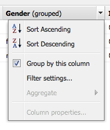

# 보고 {#reporting}

인스턴스의 상태를 모니터링하고 분석하는 데 도움이 되도록 AEM에서는 개별 요구 사항에 대해 구성할 수 있는 기본 보고서 선택을 제공합니다.

* [구성 요소 보고서](#component-report)
* [디스크 사용량](#disk-usage)
* [상태 검사](#health-check)
* [페이지 활동 보고서](#page-activity-report)
* [사용자 생성 콘텐츠 보고서](#user-generated-content-report)
* [사용자 보고서](#user-report)
* [워크플로우 상속 보고서](#workflow-instance-report)
* [워크플로우 보고서](#workflow-report)

>[!NOTE]
>
>이러한 보고서는 클래식 UI에서만 사용할 수 있습니다. 최신 UI의 시스템 모니터링 및 보고에 대해서는 [작업 대시보드.](/help/sites-administering/operations-dashboard.md)

모든 보고서는 **도구** 콘솔. 선택 **보고서** 왼쪽 창에서 오른쪽 창에서 필요한 보고서를 두 번 클릭하여 보기 및/또는 구성을 위해 엽니다.

보고서의 새 인스턴스는 **도구** 콘솔. 선택 **보고서** 왼쪽 창에서 **새로 만들기...** 를 클릭합니다. 정의 **제목** 및 **이름**&#x200B;필요한 보고서 유형을 선택한 다음 **만들기**. 새 보고서 인스턴스가 목록에 나타납니다. 이 아이콘을 두 번 클릭하여 연 다음, 사이드 킥에서 구성 요소를 드래그하여 첫 번째 열을 만들고 보고서 정의를 시작합니다.

>[!NOTE]
>
>즉시 사용 가능한 표준 AEM 보고서 외에도 다음을 수행할 수 있습니다 [완전히 새로운 보고서 개발](/help/sites-developing/dev-reports.md).

## 보고서 사용자 지정 기본 사항 {#the-basics-of-report-customization}

사용할 수 있는 보고서에는 다양한 형식이 있습니다. 다음 보고서는 다음 섹션에서 자세히 사용자 정의할 수 있는 열을 모두 사용합니다.

* [구성 요소 보고서](#component-report)
* [페이지 활동 보고서](#page-activity-report)
* [사용자 생성 콘텐츠 보고서](#user-generated-content-report)
* [사용자 보고서](#user-report)
* [워크플로우 상속 보고서](#workflow-instance-report)

>[!NOTE]
>
>다음 보고서에는 각각 고유한 형식 및 사용자 지정이 있습니다.
>
>
>* [상태 검사](#health-check) 선택 필드를 사용하여 보고할 데이터를 지정합니다.
>* [디스크 사용](#disk-usage) 링크를 사용하여 저장소 구조를 드릴다운합니다.
>* [워크플로우 보고서](/help/sites-administering/reporting.md#workflow-report) 인스턴스에서 실행되는 워크플로우에 대한 개요를 제공합니다.
>
>따라서 열 구성에 대한 다음 절차는 적절하지 않습니다. 자세한 내용은 개별 보고서 설명을 참조하십시오.

### 데이터 열 선택 및 위치 지정 {#selecting-and-positioning-the-data-columns}

표준 또는 사용자 지정된 보고서에 열을 추가, 위치 변경 또는 보고서에서 제거할 수 있습니다.

다음 **구성 요소** 사이드 킥의 탭(보고서 페이지에서 사용할 수 있음)에는 열로 선택할 수 있는 모든 데이터 카테고리가 나열됩니다.

데이터 선택을 변경하려면:

* 새 열을 추가하려면 사이드 킥에서 필요한 구성 요소를 드래그하여 원하는 위치에 놓습니다

   * 녹색 확인 표시는 위치가 유효한 시점을 나타내며 화살표 쌍은 위치가 정확히 지정되는 위치를 나타냅니다
   * 빨간색 no-go 기호는 위치가 유효하지 않은 시기를 나타냅니다

* 열을 이동하려면 헤더를 클릭하고 을 누른 채 새 위치로 드래그합니다
* 열을 제거하려면 열 제목을 클릭하고, 를 누른 채로 보고서 머리글 영역으로 끌어서 놓습니다. 빨간색 빼기 기호는 위치가 유효하지 않음을 나타냅니다. 마우스 버튼을 놓으면 구성 요소 삭제 대화 상자가 열을 실제로 삭제할지 확인을 요청합니다.

### 열 드롭다운 메뉴 {#column-drop-down-menu}

보고서의 각 열에는 드롭다운 메뉴가 있습니다. 이렇게 하면 마우스 커서가 열 제목 셀 위로 이동하면 표시됩니다.

제목 셀의 맨 오른쪽에 화살표 머리가 나타납니다(제목 텍스트 오른쪽의 화살표 헤드와 혼동하지 않도록). [전류 정렬 메커니즘](#sorting-the-data)).

메뉴에서 사용할 수 있는 옵션은 열 구성에 따라(프로젝트 개발 중에 수행) 잘못된 옵션이 회색으로 표시됩니다.

### 데이터 정렬 {#sorting-the-data}

데이터는 다음 방법 중 하나로 특정 열에 따라 정렬할 수 있습니다.

* 적절한 열 헤더를 클릭합니다. 정렬은 제목 텍스트 바로 옆에 화살표 헤드로 표시되는 오름차순과 내림차순 간에 전환됩니다
* 사용 [열 드롭다운 메뉴](#column-drop-down-menu) 구체적으로 다음 중 하나를 선택합니다. **오름차순 정렬** 또는 **내림차순 정렬**; 제목 텍스트 바로 옆에 화살표 머리가 표시됩니다

### 그룹 및 현재 데이터 차트 {#groups-and-the-current-data-chart}

적절한 열에서 선택할 수 있습니다 **이 열별로 그룹화** 에서 [열 드롭다운 메뉴](#column-drop-down-menu). 이렇게 하면 해당 열 내의 개별 값에 따라 데이터가 그룹화됩니다. 그룹화할 열을 두 개 이상 선택할 수 있습니다. 열의 데이터가 올바르지 않으면 옵션이 회색으로 표시됩니다. 즉, 모든 항목은 구별되고 고유하므로 사용자 보고서의 사용자 ID 열과 같이 그룹을 생성할 수 없습니다.

하나 이상의 열이 파이 차트를 그룹화한 후 **현재 데이터** 은 이 그룹을 기반으로 생성됩니다. 여러 열을 그룹화하면 차트에도 표시됩니다.

파이 차트 위로 커서를 이동하면 해당 세그먼트에 대한 합계된 값이 표시됩니다. 열에 현재 정의된 합계를 사용합니다. 예를 들어, count, minimum, average 등이 있습니다.

### 필터 및 집계 {#filters-and-aggregates}

적절한 열에서 다음을 구성할 수도 있습니다 **필터 설정** 및/또는 **합계** 에서 [열 드롭다운 메뉴](#column-drop-down-menu).

#### 필터 {#filters}

필터 설정 을 사용하면 항목을 표시할 기준을 지정할 수 있습니다. 사용할 수 있는 연산자는 다음과 같습니다.

* `contains`
* `equals`

필터를 설정하려면 다음을 수행하십시오.

1. 드롭다운 목록에서 원하는 연산자를 선택합니다.
1. 필터링할 텍스트를 입력합니다.
1. 클릭 **적용**.

필터를 비활성화하려면 다음을 수행하십시오.

1. 필터 텍스트를 제거합니다.
1. 클릭 **적용**.

#### 합계 {#aggregates}

합계 방법을 선택할 수도 있습니다(선택한 열에 따라 달라질 수 있음).

### 열 속성 {#column-properties}

이 옵션은 [일반 열](#generic-column) 이 [사용자 보고서](#user-report).

### 내역 데이터 {#historic-data}

시간에 따른 데이터의 변경 차트가 아래에 표시됩니다 **내역 데이터**. 일정 간격으로 촬영한 스냅샷에서 파생됩니다.

데이터는 다음과 같습니다.

* 사용할 수 있는 경우 첫 번째로 정렬된 열, 그렇지 않은 경우 첫 번째(그룹화되지 않은) 열별로 수집됩니다
* 해당 열별로 그룹화됨

보고서를 생성할 수 있습니다.

1. 설정 **그룹화** 추가 콘텐츠만 볼 수 있습니다.
1. **편집** 스냅샷 생성 빈도를 정의하는 구성 시간별 또는 일별
1. **완료...** 스냅샷 수집을 시작하는 정의입니다.

   왼쪽 상단의 빨간색/녹색 슬라이더 단추는 스냅샷이 수집되는 시점을 나타냅니다.

결과 차트는 오른쪽 하단에 표시됩니다.

데이터 수집이 시작되면 다음을 선택할 수 있습니다.

* **기간**

   보고서 데이터를 표시할 시작 날짜와 종료 날짜를 선택할 수 있습니다.

* **간격**

   보고서의 비율 및 집계에 대해 월, 주, 일, 시간을 선택할 수 있습니다.

   예를 들어 2011년 2월에 매일 스냅샷을 사용할 수 있는 경우

   * 간격이 `Day`로 설정되면 각 스냅샷이 차트에 단일 값으로 표시됩니다.
   * 간격이 `Month`2월의 모든 스냅샷은 단일 값으로 집계됩니다(차트에 단일 &quot;점&quot;으로 표시됨).

요구 사항을 선택한 다음 를 클릭합니다 **이동** 보고서 세트에 적용했습니다. 추가 스냅샷을 생성한 후 디스플레이를 업데이트하려면 **이동** 다시 한 번

스냅샷을 수집하는 경우 다음을 수행할 수 있습니다.

* 사용 **완료...** 컬렉션을 다시 초기화합니다.

   **완료** 보고서의 구조를 &quot;동결&quot;합니다(즉, 보고서에 지정된 열이며 그룹화, 정렬, 필터링된 열). 스냅샷 생성을 시작합니다.

* 를 엽니다. **편집** 선택할 수 있는 대화 상자 **데이터 스냅샷 없음** 필요한 때까지 컬렉션을 종료하려면 다음을 수행하십시오.

   **편집** 스냅샷의 촬영만 켜거나 끕니다. 스냅샷 취기가 다시 켜진 경우 추가 스냅샷을 생성하기 위해 마지막으로 완료된 보고서의 상태를 사용합니다.

>[!NOTE]
>
>스냅샷은 아래에 저장됩니다. `/var/reports/...` 여기서 나머지 경로 는 보고서가 끝날 때 생성되는 각 보고서의 경로와 ID를 미러링합니다.
>
>
>해당 인스턴스가 더 이상 필요하지 않다고 완전히 확신하는 경우 이전 스냅샷을 수동으로 삭제할 수 있습니다.

>[!NOTE]
>
>사전 구성된 보고서는 성능이 높지 않지만 프로덕션 환경에서 일별 스냅샷을 사용하는 것이 좋습니다. 웹 사이트에 많은 작업이 없는 시간에 가능한 경우 이러한 일일 스냅샷을 실행할 수 있습니다. 다음을 사용하여 정의할 수 있습니다. `Daily snapshots (repconf.hourofday)` 매개 변수 **일 CQ 보고 구성**; 참조 [OSGI 구성](/help/sites-deploying/configuring-osgi.md) 를 구성하는 방법에 대한 자세한 내용을 살펴보십시오.

#### 표시 제한 {#display-limits}

선택한 기간의 결과 수에 따라 설정할 수 있는 제한으로 인해 내역 데이터 보고서가 약간 변경될 수도 있습니다.

각 가로 선은 시리즈라고 하며(차트 범례에 있는 항목에 해당), 각 세로 점 열은 집계된 스냅샷을 나타냅니다.

오랜 시간 동안 차트를 정리하기 위해 설정할 수 있는 제한이 있습니다. 표준 보고서의 경우

* 수평 시리즈 - 기본값과 시스템 최대값 모두 `9`

* 수직 집계 스냅샷 - 기본값 `35` (수평 시리즈당)

따라서 (적절한) 제한을 초과하는 경우:

* 점은 표시되지 않습니다
* 이전 데이터 차트의 범례는 현재 데이터 차트의 항목 수에 다른 수를 표시할 수 있습니다

사용자 지정된 보고서는 **합계** 모든 시리즈의 값입니다. 일련의 숫자(가로 행 및 범례의 항목)로 표시됩니다.

>[!NOTE]
>
>사용자 지정된 보고서의 경우 제한을 다르게 설정할 수 있습니다.

### 편집(보고서) {#edit-report}

다음 **편집** 버튼을 클릭하여 열기 **보고서 편집** 대화 상자.

이 위치는 스냅샷의 수집 기간이 되는 한 위치입니다 [내역 데이터](#historic-data) 가 정의되어 있지만, 다음과 같은 다양한 다른 설정을 정의할 수 있습니다.

* **제목**

   자신만의 제목을 정의할 수 있습니다.

* **설명**

   자신만의 설명을 정의할 수 있습니다.

* **루트 경로** (*특정 보고서에만 활성*)

   보고서를 저장소의 (하위) 섹션으로 제한하려면 이 방법을 사용하십시오.

* **보고서 처리**

   * **자동으로 데이터 새로 고침**

      보고서 정의를 업데이트할 때마다 보고서 데이터가 새로 고쳐집니다.

   * **수동으로 데이터 새로 고침**

      이 옵션을 사용하여 대량의 데이터가 있는 경우 자동 새로 고침 작업으로 인한 지연을 방지할 수 있습니다.

      이를 선택하면 보고서 구성의 모든 양상이 변경될 때 보고서 데이터를 수동으로 새로 고쳐야 합니다. 즉, 구성의 모든 측면을 변경하면 보고서 테이블이 공백으로 표시됩니다.

      이 옵션을 선택하면 **[데이터 로드](#load-data)** 버튼이 표시됩니다 **편집** 보고서 참조). **데이터 로드** 은(는) 데이터를 로드하고 표시된 보고서 데이터를 새로 고칩니다.

* **스냅샷**
스냅샷을 만들 빈도를 정의할 수 있습니다. 일별, 시간별 또는 전혀 사용하지 않습니다.

### 데이터 로드 {#load-data}

다음 **데이터 로드** 버튼은 **수동으로 데이터 새로 고침** 에서 을(를) 선택함 **[편집](#edit-report)**.

클릭 **데이터 로드** 은(는) 데이터를 다시 로드하고 표시되는 보고서를 업데이트합니다.

데이터를 수동으로 새로 고치도록 선택하면 다음이 수행됩니다.

1. 보고서 구성을 변경하면 보고서 데이터 표가 공백으로 표시됩니다.

   예를 들어 열에 대한 정렬 메커니즘을 변경하면 데이터가 표시되지 않습니다.

1. 보고서 데이터를 다시 표시하려면 **데이터 로드** 데이터를 다시 로드하려면 다음을 수행하십시오.

### 완료(보고서) {#finish-report}

다음 경우에 **완료** 보고서:

* 보고서 정의 *해당 시점의 기준* 스냅샷을 만드는 데 사용됩니다. 그 이후에는 보고서 정의에 대해 스냅샷(스냅샷과 분리되어 있으므로 계속 작업할 수 있음).
* 기존 스냅샷이 모두 제거됩니다.
* 새 스냅샷은 [내역 데이터](#historic-data).

이 대화 상자에서는 결과 보고서에 대한 고유한 제목과 설명을 정의하거나 업데이트할 수 있습니다.

## 보고서 유형 {#report-types}

### 구성 요소 보고서 {#component-report}

구성 요소 보고서는 웹 사이트에서 구성 요소를 사용하는 방법에 대한 정보를 제공합니다.

[정보 열](#selecting-and-positioning-the-data-columns) 정보:

* 작성자
* 구성 요소 경로
* 구성 요소 유형
* 마지막 수정 날짜
* 페이지

예를 들어, 다음을 볼 수 있음을 의미합니다.

* 어디에서 사용되는 구성 요소입니다.

   예를 들어, 테스트할 때 유용합니다.

* 특정 구성 요소의 인스턴스가 배포되는 방법입니다.

   특정 페이지(예: &quot;많은 페이지&quot;)에 성능 문제가 발생했습니다.

* 자주/덜 자주 변경되는 사이트의 일부를 식별합니다.
* 시간이 지남에 따라 페이지 컨텐츠가 어떻게 발전하는지를 참조하십시오.

제품 표준 및 프로젝트별 모든 구성 요소가 포함됩니다. 사용 **편집** 대화 상자에서 사용자가 **루트 경로** 보고서의 시작점을 정의합니다. 해당 루트 아래의 모든 구성 요소가 보고서에 대해 고려됩니다.

 

### 디스크 사용량 {#disk-usage}

디스크 사용량 보고서에는 리포지토리 내에 저장된 데이터에 대한 정보가 표시됩니다.

보고서는 저장소의 루트( / )에서 시작합니다. 특정 분기를 클릭하면 저장소 내에서 드릴다운할 수 있습니다(현재 경로가 보고서 제목에 반영됨).

### 상태 검사 {#health-check}

이 보고서는 현재 요청 로그를 분석합니다.

`<cq-installation-dir>/crx-quickstart/logs/request.log`
를 사용하면 지정된 기간 내에 가장 비용이 많이 드는 요청을 식별할 수 있습니다.

보고서를 생성하려면 다음을 지정할 수 있습니다.

* **기간(시간)**

   분석할 시간(지난)입니다.

   기본값: `24`

* **최대. 결과**

   최대 출력 선 수.

   기본값: `50`

* **최대. 요청**

   분석할 최대 요청 수입니다.

   기본값: `-1` (모두)

* **이메일 주소**

   결과를 이메일 주소로 보냅니다.

   선택 사항입니다. 기본값: 공백

* **매일(hh:mm) 실행**

   보고서를 매일 자동으로 실행할 시간을 지정합니다.

   선택 사항입니다. 기본값: 공백

### 페이지 활동 보고서 {#page-activity-report}

페이지 활동 보고서에는 페이지와 해당 페이지에 대한 작업이 나열됩니다.

[정보 열](#selecting-and-positioning-the-data-columns) 정보:

* 페이지
* 시간
* 유형
* 사용자

모니터링할 수 있는 방법은 다음과 같습니다.

* 최신 수정 사항.
* 특정 페이지에서 작업하는 작성자.
* 최근에 수정되지 않았으므로 작업이 필요할 수 있는 페이지입니다.
* 가장 자주/가장 자주 변경되는 페이지.
* 대부분의/최소 활성 사용자.

페이지 활동 보고서는 감사 로그에서 모든 정보를 가져옵니다. 기본적으로 루트 경로는 감사 로그로 구성됩니다. `/var/audit/com.day.cq.wcm.core.page`.

### 사용자 생성 콘텐츠 보고서 {#user-generated-content-report}

이 보고서는 사용자가 생성한 컨텐츠에 대한 정보를 제공합니다. 해당 댓글, 등급 또는 포럼이 됩니다.

[정보 열](#selecting-and-positioning-the-data-columns) 설정:

* 날짜
* IP 주소
* 페이지
* 레퍼러
* 유형
* 사용자 ID

다음을 수행할 수 있습니다.

* 가장 많은 댓글을 받는 페이지를 확인합니다.
* 특정 사이트 방문자가 사이트를 떠나고 있는 모든 댓글에 대한 개요를 살펴보십시오. 아마도 문제가 관련되어 있을 것입니다.
* 새로운 컨텐츠가 페이지에서 주석이 만들어지는 시점을 모니터링하여 댓글을 달는지 여부를 판단합니다.

### 사용자 보고서 {#user-report}

이 보고서는 계정 및/또는 프로필을 등록한 모든 사용자에 대한 정보를 제공합니다. 여기에는 조직 내의 작성자와 외부 방문자가 모두 포함될 수 있습니다.

[정보 열](#selecting-and-positioning-the-data-columns) (사용 가능한 경우) 정보:

* 연령
* 국가
* 도메인
* 이메일
* 성
* 성별
* [일반](#generic-column)
* 이름
* 정보
* 관심
* 언어
* NTLM 해시 코드
* 사용자 ID

다음을 수행할 수 있습니다.

* 사용자의 인구 통계 스프레드를 참조하십시오.
* 프로필에 추가한 사용자 정의 필드에 대해 보고합니다.

#### 일반 열 {#generic-column}

다음 **일반** 열은 사용자 보고서에서 사용할 수 있으므로 일반적으로 [사용자 프로필](/help/sites-administering/identity-management.md#profiles-and-user-accounts); 예 [프로필 정의에 필드 추가 아래에 자세히 설명된 즐겨찾기 색상](/help/sites-administering/identity-management.md#adding-fields-to-the-profile-definition).

다음 중 하나를 수행하면 일반 열 대화 상자가 열립니다.

* 사이드 킥의 일반 구성 요소를 보고서로 드래그합니다.
* 기존 일반 열에 대한 열 등록 정보를 선택합니다.

에서 **정의** 탭에서 다음을 정의할 수 있습니다.

* **제목**

   일반 열에 대한 고유한 제목입니다.

* **속성**

   일반적으로 사용자의 프로필 내에 저장소에 저장된 속성 이름입니다.

* **경로**

   일반적으로 속성은 `profile`.

* **유형**

   필드 유형을 선택합니다 `String`, `Number`, `Integer`, `Date`.

* **기본 합계**

   하나 이상의 그룹화된 열이 있는 보고서에서 열을 그룹 해제할 경우 기본적으로 사용되는 합계를 정의합니다. 필요한 집계를 선택합니다 `Count`, `Minimum`, `Average`, `Maximum`, `Sum`.

   예, *카운트* 대상 `String` 필드는 고유 수의 `String` 합계 상태의 열에 대한 값이 표시됩니다.

에서 **확장** 탭에서 사용할 수 있는 합계 및 필터를 정의할 수도 있습니다.

### 워크플로우 상속 보고서 {#workflow-instance-report}

이를 통해 실행 및 완료된 워크플로우의 개별 인스턴스에 대한 정보를 제공하는 간결한 개요를 알 수 있습니다.

[정보 열](#selecting-and-positioning-the-data-columns) 정보:

* 완료됨
* 기간
* 개시자
* 모델
* 페이로드
* 시작됨
* 상태

다음을 수행할 수 있습니다.

* 워크플로우의 평균 지속 시간 모니터링 이러한 문제가 정기적으로 발생하면 워크플로우의 문제를 강조 표시할 수 있습니다.

### 워크플로우 보고서 {#workflow-report}

이 확장은 인스턴스에서 실행되는 워크플로우에 대한 주요 통계를 제공합니다.

## 게시 환경에서 보고서 사용 {#using-reports-in-a-publish-environment}

보고서를 특정 요구 사항에 맞게 구성했으면 이 보고서를 활성화하여 구성을 게시 환경에 전송할 수 있습니다.

>[!CAUTION]
>
>원한다면 **내역 데이터** 게시 환경의 경우 **완료** 페이지를 활성화하기 전에 작성 환경에 대한 보고서입니다.

그런 다음 아래에서 적절한 보고서에 액세스할 수 있습니다

`/etc/reports`

예를 들어 사용자 생성 컨텐츠 보고서는 다음 위치에서 찾을 수 있습니다.

`http://localhost:4503/etc/reports/ugcreport.html`

이제 게시 환경에서 수집된 데이터에 대해 보고합니다.

게시 환경에서는 보고서 구성이 허용되지 않으므로 **편집** 및 **완료** 단추를 사용할 수 없습니다. 그러나 **기간** 및 **간격** 대상 **내역 데이터** 스냅샷이 수집되고 있는지 보고합니다.

>[!CAUTION]
>
>이러한 보고서에 액세스하는 것은 보안 문제가 될 수 있습니다. 따라서 다음과 같이 Dispatcher를 구성하는 것이 좋습니다 `/etc/reports` 외부 방문자가 사용할 수 없습니다. 자세한 내용은 [Security 검사 목록](security-checklist.md) 자세한 내용

## 보고서 실행에 필요한 권한 {#permissions-needed-for-running-reports}

필요한 권한은 작업에 따라 다릅니다.

* 보고서 데이터는 기본적으로 현재 사용자의 권한을 사용하여 수집됩니다.
* 내역 데이터는 보고서를 완료한 사용자의 권한을 사용하여 수집됩니다.

표준 AEM 설치에서는 보고서에 대해 다음 권한이 사전 설정되어 있습니다.

* **사용자 보고서**

   `user administrators` - 읽기 및 쓰기

* **페이지 활동 보고서**

   `contributors` - 읽기 및 쓰기

* **구성 요소 보고서**

   `contributors` - 읽기 및 쓰기

* **사용자 생성 콘텐츠 보고서**

   `contributors` - 읽기 및 쓰기

* **워크플로우 상속 보고서**

   `workflow-users` - 읽기 및 쓰기

의 모든 구성원 `administrators` 그룹에는 새 보고서를 만드는 데 필요한 권한이 있습니다.
