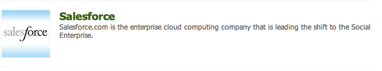

# Salesforce와 통합 {#integrating-with-salesforce}

Salesforce를 Adobe Experience Manager(AEM)와 통합하면 리드 관리 기능이 제공되고 Salesforce에서 즉시 제공하는 기존 기능을 사용할 수 있습니다. AEM에서 Salesforce로 가드를 게시하고 Salesforce에서 직접 데이터에 액세스하는 구성 요소를 만들 수 있습니다.

AEM과 Salesforce 간의 양방향 확장 가능한 통합을 통해 다음과 같은 이점을 얻을 수 있습니다.

* 조직은 고객 경험을 개선하기 위해 데이터를 완전히 사용하고 수정해야 합니다.
* 마케팅에서 영업 활동까지 참여.
* Salesforce 데이터 저장소에서 데이터를 자동으로 전송하고 수신할 조직입니다.

이 문서에서는 다음 사항에 대해 설명합니다.

* salesforce Cloud Service 구성 방법(Salesforce와 통합하도록 AEM 구성).
* Client Context 및 개인화에 Salesforce 리드/연락처 정보를 사용하는 방법.
* salesforce 워크플로 모델을 사용하여 AEM 사용자를 Salesforce에 대한 리드로 게시하는 방법.
* salesforce의 데이터를 표시하는 구성 요소를 만드는 방법

## Salesforce와 통합하도록 AEM 구성 {#configuring-aem-to-integrate-with-salesforce}

AEM을 Salesforce와 통합하도록 구성하려면 먼저 Salesforce에서 원격 액세스 애플리케이션을 구성해야 합니다. 그런 다음 이 원격 액세스 애플리케이션을 가리키도록 Salesforce 클라우드 서비스를 구성합니다.

>[!NOTE]
>
>Salesforce에서 무료 개발자 계정을 만들 수 있습니다.

Salesforce와 통합하도록 AEM을 구성하려면 다음을 수행하십시오.

>[!CAUTION]
>
>설치 [Salesforce API](https://experience.adobe.com/#/downloads/content/software-distribution/en/aem.html?fulltext=salesforce*&amp;orderby=%40jcr%3Acontent%2Fjcr%3AlastModified&amp;orderby.sort=desc&amp;layout=list&amp;p.offset=0&amp;p.limit=2&amp;package=%2Fcontent%2Fsoftware-distribution%2Fen%2Fdetails.html%2Fcontent%2Fdam%2Faem%2Fpublic%2Fadobe%2Fpackages%2Fcq650%2Ffeaturepack%2Fcom.adobe.cq.mcm.salesforce.content-1.0.4.zip) 통합 패키지 를 선택한 다음 절차를 계속합니다. 패키지를 사용하여 작업하는 방법에 대한 자세한 내용은 [패키지를 사용하여 작업하는 방법](/help/sites-administering/package-manager.md#package-share) 페이지를 가리키도록 업데이트하는 중입니다.

1. AEM에서 다음 위치로 이동합니다. **Cloud Service**. 서드파티 서비스에서 **지금 구성** 위치: **Salesforce**.

   

1. 예를 들어 구성을 만듭니다. **개발자**.

   >[!NOTE]
   >
   >새 구성은 새 페이지로 리디렉션됩니다. **http://localhost:4502/etc/cloudservices/salesforce/developer.html**. 이 값은 Salesforce에서 원격 액세스 응용 프로그램을 만드는 동안 콜백 URL에 지정해야 하는 값과 정확히 동일합니다. 이 값은 일치해야 합니다.

1. Salesforce 계정에 로그인하거나 계정이 없는 경우 다음 위치에 만듭니다. [https://developer.salesforce.com](https://developer.salesforce.com).)
1. Salesforce에서 **만들기** > **앱** 에 도달하려면 **연결된 앱** (이전 버전의 Salesforce에서 워크플로는 **배포** > **원격 액세스**).
1. 클릭 **신규** 따라서 AEM을 Salesforce와 연결할 수 있습니다.

   

1. 다음을 입력합니다. **연결된 앱 이름**, **API 이름**, 및 **연락처 전자 메일**. 다음 항목 선택 **OAuth 설정 활성화** 확인란을 선택하고 **콜백 URL** 및 OAuth 범위를 추가합니다(예: 전체 액세스). 콜백 URL은 다음과 유사합니다. `http://localhost:4502/etc/cloudservices/salesforce/developer.html`

   구성과 일치하도록 서버 이름/포트 번호 및 페이지 이름을 변경합니다.

   

1. 클릭 **저장** 을 클릭하여 Salesforce 구성을 저장합니다. Salesforce가 다음을 생성합니다. **소비자 키** 및 **소비자 비밀** AEM 구성에 필요한 옵션입니다.

   

   >[!NOTE]
   >
   >Salesforce의 원격 액세스 응용 프로그램이 활성화될 때까지 몇 분(최대 15분) 동안 기다립니다.

1. AEM에서 다음 위치로 이동합니다. **Cloud Service** 앞에서 만든 Salesforce 구성으로 이동합니다(예: **개발자**). 클릭 **편집** salesforce.com에서 고객 키 및 고객 암호를 입력합니다.

   

   | 로그인 URL | Salesforce 인증 종단점입니다. 이 값은 미리 채워져 있으며 대부분의 경우 사용됩니다. |
   |---|---|
   | 고객 키 | salesforce.com의 Remote Access 응용 프로그램 등록 페이지에서 가져온 값을 입력하십시오. |
   | 고객 비밀 | salesforce.com의 Remote Access 응용 프로그램 등록 페이지에서 가져온 값을 입력하십시오. |

1. 클릭 **Salesforce에 연결** 연결합니다. Salesforce가 구성을 Salesforce에 연결할 수 있도록 요청합니다.

   

   AEM에서 성공적으로 연결되었음을 알려주는 확인 대화 상자가 열립니다.

1. 웹 사이트의 루트 페이지로 이동하여 **페이지 속성**. 그런 다음 을 선택합니다 **Cloud Service** 및 추가 **Salesforce** 올바른 구성을 선택합니다(예: **개발자**).

   

   이제 워크플로우 모델을 사용하여 Salesforce로 잠재 고객을 게시하고 Salesforce의 데이터에 액세스하는 구성 요소를 만들 수 있습니다.

## AEM 사용자를 Salesforce 리드로 내보내기 {#exporting-aem-users-as-salesforce-leads}

AEM 사용자를 Salesforce 잠재 고객으로 내보내려면 잠재 고객을 Salesforce로 게시하도록 워크플로우를 구성하십시오.

AEM 사용자를 Salesforce 리드로 내보내려면 다음을 수행하십시오.

1. 다음 위치에서 Salesforce 워크플로우로 이동합니다. `http://localhost:4502/workflow` 워크플로를 마우스 오른쪽 단추로 클릭 **Salesforce.com 내보내기** 및 클릭 **시작**.

   

1. 잠재 고객으로 생성할 AEM 사용자를 선택합니다. **페이로드** (홈 > 사용자). 사용자의 프로필 노드에 다음과 같은 정보가 포함되어 있으므로 선택해야 합니다 **givenName**, 및  **familyName**: Salesforce 잠재 고객에 매핑됩니다. **이름** 및 **성** 필드.

   

   >[!NOTE]
   >
   >이 워크플로우를 시작하기 전에 Salesforce에 게시하기 전에 AEM의 리드 노드에 포함해야 하는 특정 필수 필드가 있습니다. 이는 다음과 같습니다 **givenName**, **familyName**, **회사**, 및 **이메일**. AEM 사용자와 Salesforce 리드 간의 전체 매핑 목록을 보려면 다음을 참조하십시오. [AEM 사용자와 Salesforce 리드 간의 매핑 구성.](#mapping-configuration-between-aem-user-and-salesforce-lead)

1. 클릭 **확인**. 사용자 정보는 salesforce.com으로 내보내집니다. salesforce.com에서 확인할 수 있습니다.

   >[!NOTE]
   >
   >오류 로그는 잠재 고객 가져오기 여부를 보여 줍니다. 자세한 내용은 오류 로그를 확인하십시오.

### Salesforce.com 내보내기 워크플로우 구성 {#configuring-the-salesforce-com-export-workflow}

필요한 경우 Salesforce.com 내보내기 워크플로우를 구성하여 올바른 Salesforce.com 구성과 일치시키거나 기타 변경합니다.

Salesforce.com 내보내기 워크플로우를 구성하려면 다음 작업을 수행하십시오.

1. 다음으로 이동 `http://localhost:4502/cf#/etc/workflow/models/salesforce-com-export.html.`

   

1. Salesforce.com 내보내기 단계를 열고 **인수** 탭을 클릭하고 올바른 구성을 선택한 다음 를 클릭합니다. **확인**. 또한 워크플로우가 Salesforce에서 삭제된 리드를 다시 만들도록 하려면 확인란을 선택합니다.

   

1. 클릭 **저장** 변경 사항을 저장합니다.

   

### AEM 사용자와 Salesforce 리드 간의 매핑 구성 {#mapping-configuration-between-aem-user-and-salesforce-lead}

AEM 사용자와 Salesforce 리드 간의 현재 매핑 구성을 보거나 편집하려면 구성 관리자를 엽니다. `https://<hostname>:<port>/system/console/configMgr` 및 검색 **Salesforce 잠재 고객 매핑 구성**.

1. 구성 관리자를 엽니다. **웹 콘솔** 또는 로 바로 이동 `https://<hostname>:<port>/system/console/configMgr.`
1. 검색 대상 **Salesforce 잠재 고객 매핑 구성**.

   

1. 필요에 따라 매핑을 변경합니다. 기본 매핑은 패턴을 따릅니다 **aemUserAttribute=sfLeadAttribute**. 클릭 **저장** 변경 사항을 저장합니다.

## Salesforce 클라이언트 컨텍스트 저장소 구성 {#configuring-salesforce-client-context-store}

Salesforce 클라이언트 컨텍스트 저장소에는 AEM 내에서 이미 사용할 수 있는 정보보다 현재 로그인한 사용자에 대한 추가 정보가 표시됩니다. 사용자의 Salesforce 연결에 따라 Salesforce에서 이 추가 정보를 가져옵니다.

이렇게 하려면 다음을 구성합니다.

1. Salesforce 연결 구성 요소를 통해 AEM 사용자를 Salesforce ID에 연결합니다.
1. 보려는 속성을 구성할 수 있도록 Salesforce 프로필 데이터를 클라이언트 컨텍스트 페이지에 추가합니다.
1. (선택 사항) Salesforce 클라이언트 컨텍스트 저장소의 데이터를 사용하는 세그먼트를 만듭니다.

### AEM 사용자를 Salesforce ID와 연결 {#linking-an-aem-user-with-a-salesforce-id}

AEM 사용자를 Salesforce ID에 매핑하여 클라이언트 컨텍스트에서 로드할 수 있도록 합니다. 실제 시나리오에서는 유효성 검사가 있는 알려진 사용자 데이터를 기반으로 연결합니다. 데모 목적으로 이 절차에서는 **Salesforce 연결** 구성 요소.

1. AEM에서 웹 사이트로 이동하여 로그인한 다음 **Salesforce 연결** 사이드 킥의 구성 요소입니다.

   >[!NOTE]
   >
   >다음과 같은 경우 **Salesforce 연결** 구성 요소를 사용할 수 없습니다. **디자인** 에서 사용할 수 있도록 보기 및 선택 **편집** 보기.

   

   구성 요소를 페이지로 드래그하면 표시됩니다 **Salesforce=Off에 연결**.

   

   >[!NOTE]
   >
   >이 구성 요소는 데모용으로만 사용됩니다. 실제 시나리오의 경우 사용자를 리드와 연결/일치시키는 다른 프로세스가 있을 수 있습니다.

1. 페이지에서 구성 요소를 드래그한 후 구성 요소를 열어 구성합니다. 구성, 연락처 유형 및 Salesforce 리드 또는 연락처를 선택하고 **확인**.

   

   AEM은 사용자를 Salesforce 연락처 또는 잠재 고객과 연결합니다.

   

### Client Context에 Salesforce 데이터 추가 {#adding-salesforce-data-to-client-context}

Client Context의 Salesforce에서 사용자 데이터를 로드하여 개인화에 사용할 수 있습니다.

1. 확장하려는 클라이언트 컨텍스트를 열고 다음 예를 들어 `http://localhost:4502/etc/clientcontext/default/content.html.`

   

1. 드래그 **Salesforce 프로필 데이터** 구성 요소를 클라이언트 컨텍스트에 추가합니다.

   

1. 구성 요소를 두 번 클릭하여 엽니다. 선택 **항목 추가** 드롭다운 목록에서 속성을 선택합니다. 원하는 만큼 속성을 추가하고 을(를) 선택합니다. **확인**.

   

1. 이제 클라이언트 컨텍스트에 Salesforce의 Salesforce 관련 속성이 표시됩니다.

   

### Salesforce Client Context Store의 데이터를 사용하여 세그먼트 작성 {#building-a-segment-using-data-from-salesforce-client-context-store}

Salesforce 클라이언트 컨텍스트 저장소의 데이터를 사용하는 세그먼트를 만들 수 있습니다. 이를 위해 진행되는 작업:

1. 다음 위치로 이동하여 AEM의 세그멘테이션으로 이동합니다. **도구** > **세분화** 또는 다음으로 이동 [http://localhost:4502/miscadmin#/etc/segmentation](http://localhost:4502/miscadmin#/etc/segmentation).
1. Salesforce의 데이터를 포함하도록 세그먼트를 만들거나 업데이트합니다. 자세한 내용은 [세분화](/help/sites-administering/campaign-segmentation.md).

## 리드 검색 {#searching-leads}

AEM에는 주어진 기준에 따라 Salesforce에서 잠재 고객을 검색하는 샘플 검색 구성 요소가 제공됩니다. 이 구성 요소는 Salesforce REST API를 사용하여 Salesforce 개체를 검색하는 방법을 보여 줍니다. salesforce.com 호출을 트리거하려면 페이지를 Salesforce 구성과 연결합니다.

>[!NOTE]
>
>Salesforce REST API를 사용하여 Salesforce 개체를 쿼리하는 방법을 보여 주는 샘플 구성 요소입니다. 필요에 따라 더 복잡한 구성 요소를 만들려면 예를 들어 사용하십시오.

이 구성 요소를 사용하려면:

1. 이 구성을 사용할 페이지로 이동합니다. 페이지 속성을 열고 을(를) 선택합니다 **Cloud Service.** 클릭 **서비스 추가** 및 선택 **Salesforce** 적절한 구성을 선택하고 **확인**.

   

1. Salesforce 검색 구성 요소가 활성화된 경우 해당 구성 요소를 페이지로 드래그합니다. 활성화하려면 디자인 모드로 이동하여 해당 영역에 추가합니다.

   

1. 검색 구성 요소를 열고 검색 매개 변수를 지정하고 **좋아.**

   

1. AEM은 지정된 기준과 일치하는 검색 구성 요소에 지정된 리드를 표시합니다.

   
