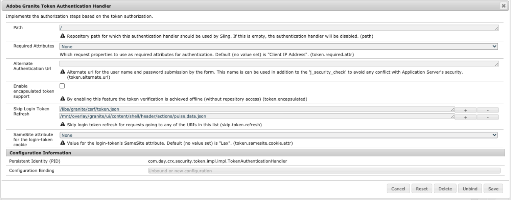

# AEM 6.5에 대한 동일한 사이트 쿠키 지원 {#same-site-cookie-support-for-aem-65}

버전 80, Chrome 및 Safari 이후 에서는 쿠키 보안을 위한 새로운 모델이 도입되었습니다. 이 모드는 `SameSite` 설정을 통해 타사 사이트에 대한 쿠키 가용성에 대한 보안 컨트롤을 도입하도록 설계되었습니다. 자세한 내용은 이 [article](https://web.dev/samesite-cookies-explained/)을 참조하십시오.

이 설정의 기본값(`SameSite=Lax`)으로 인해 AEM 인스턴스 또는 서비스 간 인증이 작동하지 않을 수 있습니다. 이것은 이러한 서비스의 도메인 또는 URL 구조가 이 쿠키 정책의 제한 사항에 해당하지 않을 수 있기 때문입니다.

이 문제를 해결하려면 로그인 토큰에 대해 SameSite 쿠키 속성을 `None`으로 설정해야 합니다.

아래 절차에 따라 이 작업을 수행할 수 있습니다.

1. `http://serveraddress:serverport/system/console/configMgr`의 웹 콘솔로 이동합니다.
1. **Granite 토큰 인증 핸들러를 검색하고 클릭합니다**
1. 아래 그림과 같이 로그인 토큰 쿠키&#x200B;**에 대한** SameSite 속성을 `None`로 설정합니다
   
1. 저장을 클릭합니다
1. 이 설정이 업데이트되고 사용자가 로그아웃되고 다시 로그인되면 `login-token` 쿠키에는 `None` 속성이 설정되며 사이트 간 요청에 포함됩니다.
