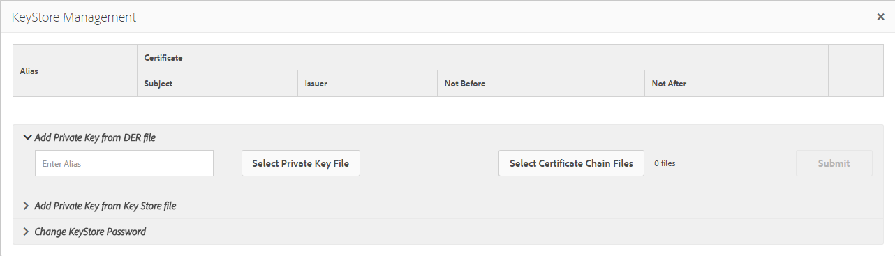

# SAML 2.0 인증 처리기{#saml-authentication-handler}

AEM은 [SAML](http://saml.xml.org/saml-specifications) 인증 핸들러와 함께 제공됩니다. 이 핸들러는 `HTTP POST` 바인딩을 사용하여 [SAML](http://saml.xml.org/saml-specifications) 2.0 인증 요청 프로토콜(Web-SSO 프로필)에 대한 지원을 제공합니다.

지원되는 기능:

* 메시지 서명 및 암호화
* 자동 사용자 생성
* 그룹 동기화를 AEM에서 기존 그룹 동기화
* 서비스 공급자 및 ID 공급자가 인증을 시작했습니다.

이 처리기는 암호화된 SAML 응답 메시지를 사용자 노드( `usernode/samlResponse`)에 저장하여 타사 서비스 공급자와의 통신을 용이하게 합니다.

>[!NOTE]
>
>AEM 및 SAML 통합 [ 데모를 참조하십시오.](https://helpx.adobe.com/experience-manager/kb/simple-saml-demo.html)
>
>최종 커뮤니티 아티클을 읽으려면 다음을 클릭합니다.[Adobe Experience Manager](https://helpx.adobe.com/experience-manager/using/aem63_saml.html)와 SAML 통합

## SAML 2.0 인증 처리기 구성 {#configuring-the-saml-authentication-handler}

[웹 콘솔](/help/sites-deploying/configuring-osgi.md)에서는 **Adobe Granite SAML 2.0 인증 핸들러**&#x200B;라는 [SAML](http://saml.xml.org/saml-specifications) 2.0 인증 핸들러 구성에 대한 액세스를 제공합니다. 다음 속성을 설정할 수 있습니다.

>[!NOTE]
>
>SAML 2.0 인증 핸들러는 기본적으로 비활성화됩니다. 핸들러를 활성화하려면 다음 속성 중 적어도 하나를 설정해야 합니다.
>
>* ID 공급자 POST URL.
>* 서비스 공급자 엔티티 ID.

>

>[!NOTE]
>
>SAML 어설션은 서명되며 필요에 따라 암호화될 수 있습니다. 이 작업을 수행하려면 TrustStore에서 Indentity Provider의 공개 인증서를 제공해야 합니다. 자세한 내용은 [TrustStore](/help/sites-administering/saml-2-0-authenticationhandler.md#add-the-idp-certificate-to-the-aem-truststore) 섹션에 IdP 인증서 추가를 참조하십시오.

**Sling** 에서 이 인증 처리기를 사용해야 하는 경로 저장소 경로입니다. 비어 있으면 인증 핸들러가 비활성화됩니다.

**서비스** 등급 OSGi 프레임워크 서비스 등급 값으로 이 서비스를 호출할 순서를 나타냅니다. 높은 값이 높은 우선 순위를 지정하는 정수 값입니다.

**IDP 인증서** 별칭글로벌 truststore에 있는 IdP 인증서의 별칭입니다. 이 속성이 비어 있으면 인증 핸들러가 비활성화됩니다. 설정 방법은 아래의 &quot;AEM TrustStore에 IdP 인증서 추가&quot; 장을 참조하십시오.

**SAML** 인증 요청을 보내야 하는 IDP의 ID 공급자 URL. 이 속성이 비어 있으면 인증 핸들러가 비활성화됩니다.

>[!CAUTION]
>
>ID 공급자 호스트 이름은 **Apache Sling 레퍼러 필터** OSGi 구성에 추가해야 합니다. 자세한 내용은 [웹 콘솔](/help/sites-deploying/configuring-osgi.md) 섹션을 참조하십시오.

**ID 공급자** 로 이 서비스 공급자를 고유하게 식별하는 서비스 공급자 엔티티 ID. 이 속성이 비어 있으면 인증 핸들러가 비활성화됩니다.

**기본** 리디렉션이 성공한 후 리디렉션할 기본 위치입니다.

>[!NOTE]
>
>이 위치는 `request-path` 쿠키가 설정되지 않은 경우에만 사용됩니다. 유효한 로그인 토큰이 없는 구성된 경로 아래의 페이지를 요청하면 요청된 경로가 쿠키에 저장됩니다
>인증이 완료되면 브라우저가 이 위치로 다시 리디렉션됩니다.

**사용자 ID** 속성CRX 저장소에서 사용자를 인증하고 만드는 데 사용되는 사용자 ID가 포함된 속성의 이름입니다.

>[!NOTE]
>
>사용자 ID는 SAML 어설션의 `saml:Subject` 노드에서 가져오지 않고 이 `saml:Attribute`에서 가져옵니다.

**암호화** 사용 이 인증 핸들러는 암호화된 SAML 어설션을 사용해야 하는지 여부를 결정합니다.

**CRX 사용자** 자동 만들기인증 성공 후 저장소에 존재하지 않는 사용자를 자동으로 만들지 여부를 나타냅니다.

>[!CAUTION]
>
>CRX 사용자를 자동으로 만들 수 없는 경우 사용자를 수동으로 만들어야 합니다.

**그룹에** 추가인증 성공 후 사용자를 CRX 그룹에 자동으로 추가할지 여부를 나타냅니다.

**그룹** 멤버십이 사용자가 추가되어야 하는 CRX 그룹 목록이 포함된 saml:Attribute의 이름입니다.

## AEM TrustStore {#add-the-idp-certificate-to-the-aem-truststore}에 IdP 인증서 추가

SAML 어설션은 서명되며 필요에 따라 암호화될 수 있습니다. 이 작업을 수행하려면 저장소에서 IdP의 공용 인증서를 제공해야 합니다. 이렇게 하려면 다음을 수행해야 합니다.

1. *http:/serveraddress:serverport/libs/granite/security/content/truststore.html*&#x200B;로 이동
1. **[!UICONTROL Create TrustStore 링크]**&#x200B;를 누릅니다.
1. TrustStore의 암호를 입력하고 **[!UICONTROL Save]**&#x200B;를 누릅니다.
1. **[!UICONTROL TrustStore 관리]**&#x200B;를 클릭합니다.
1. IdP 인증서를 업로드합니다.
1. 인증서 별칭을 메모합니다. 별칭은 아래 예에서 **[!UICONTROL admin#1436172864930]**&#x200B;입니다.

   

## AEM 키 저장소 {#add-the-service-provider-key-and-certificate-chain-to-the-aem-keystore}에 서비스 공급자 키와 인증서 체인을 추가합니다.

>[!NOTE]
>
>아래 단계는 필수입니다. 그렇지 않으면 다음 예외가 발생합니다.`com.adobe.granite.keystore.KeyStoreNotInitialisedException: Uninitialised system trust store`

1. 이동:[http://localhost:4502/libs/granite/security/content/useradmin.html](http://localhost:4502/libs/granite/security/content/useradmin.html)
1. `authentication-service` 사용자를 편집합니다.
1. **계정 설정**&#x200B;에서 **키 저장소 만들기**&#x200B;를 클릭하여 키 저장소를 만듭니다.

>[!NOTE]
>
>아래 단계는 핸들러가 메시지를 서명하거나 해독할 수 있어야 하는 경우에만 필요합니다.

1. **개인 키 파일 선택**&#x200B;을 클릭하여 개인 키 파일을 업로드합니다. 키는 DER 인코딩이 있는 PKCS#8 형식이어야 합니다.
1. **인증서 체인 파일 선택**&#x200B;을 클릭하여 인증서 파일을 업로드합니다.
1. 아래와 같이 별칭을 지정합니다.

   

## SAML {#configure-a-logger-for-saml}에 대한 로거 구성

SAML 구성 오류로 인해 발생할 수 있는 모든 문제를 디버깅하려면 로거를 설정할 수 있습니다. 다음을 통해 이 작업을 수행할 수 있습니다.

1. 웹 콘솔로 이동(*http://localhost:4502/system/console/configMgr*)
1. **Apache Sling 로깅 로거 구성** 항목을 검색하고 클릭합니다.
1. 다음 구성으로 로거를 만듭니다.

   * **로그 수준:** 디버그
   * **로그 파일:** logs/saml.log
   * **Logger:** com.adobe.granite.auth.saml

