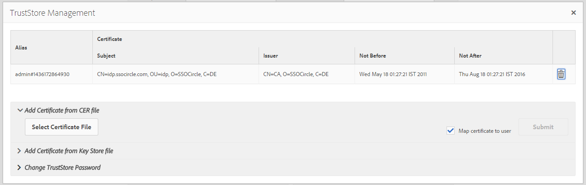

# SAML 2.0 인증 핸들러{#saml-authentication-handler}

AEM이 [SAML](https://saml.xml.org/saml-specifications) 인증 처리기입니다. 이 처리기는 [SAML](https://saml.xml.org/saml-specifications) 2.0 Authentication Request Protocol(Web-SSO Profile)은 `HTTP POST` 바인딩.

다음을 지원합니다.

* 메시지 서명 및 암호화
* 사용자 자동 생성
* 그룹을 AEM의 기존 그룹에 동기화
* 서비스 공급자 및 ID 공급자가 인증을 시작했습니다.

이 처리기는 사용자 노드( `usernode/samlResponse`)을 사용하여 타사 서비스 공급자와의 통신을 용이하게 할 수 있습니다.

>[!NOTE]
>
>자세한 내용은 [AEM 및 SAML 통합 데모](https://experienceleague.adobe.com/docs/experience-cloud-kcs/kbarticles/KA-17481.html).
>
>최종 커뮤니티 문서를 읽으려면 다음을 클릭합니다. [SAML과 Adobe Experience Manager 통합](https://helpx.adobe.com/experience-manager/using/aem63_saml.html).

## SAML 2.0 인증 핸들러 구성 {#configuring-the-saml-authentication-handler}

다음 [웹 콘솔](/help/sites-deploying/configuring-osgi.md) 에 대한 액세스 권한 제공 [SAML](https://saml.xml.org/saml-specifications) 2.0 인증 처리기 구성이 호출되었습니다. **Adobe Granite SAML 2.0 인증 핸들러**. 다음 속성을 설정할 수 있습니다.

>[!NOTE]
>
>SAML 2.0 인증 핸들러는 기본적으로 비활성화되어 있습니다. 핸들러를 사용하려면 다음 속성 중 하나 이상을 설정해야 합니다.
>
>* ID 공급자 POST URL 또는 IDP URL입니다.
>* 서비스 공급자 엔티티 ID입니다.
>

>[!NOTE]
>
>SAML 어설션은 서명되며 선택적으로 암호화할 수 있습니다. 이 작업을 수행하려면 TrustStore에서 ID 공급자의 공개 인증서를 제공해야 합니다. 자세한 내용은 [TrustStore에 IdP 인증서 추가](/help/sites-administering/saml-2-0-authenticationhandler.md#add-the-idp-certificate-to-the-aem-truststore) 섹션을 참조하십시오.

**경로** Sling에서 이 인증 핸들러를 사용해야 하는 저장소 경로입니다. 이 값이 비어 있으면 인증 처리기가 비활성화됩니다.

**서비스 등급** OSGi 프레임워크 서비스 등급 값에서 이 서비스를 호출할 순서를 나타냅니다. 높은 값이 높은 우선 순위를 지정하는 정수 값입니다.

**IDP 인증서 별칭** 글로벌 truststore에서 IdP 인증서의 별칭. 이 속성이 비어 있으면 인증 처리기가 비활성화됩니다. 설정 방법에 대해서는 아래의 &quot;AEM TrustStore에 IdP 인증서 추가&quot; 장을 참조하십시오.

**IDP URL** SAML 인증 요청을 전송해야 하는 IDP의 URL입니다. 이 속성이 비어 있으면 인증 처리기가 비활성화됩니다.

>[!CAUTION]
>
>ID 공급자 호스트 이름을 **Apache Sling 레퍼러 필터** OSGi 구성. 자세한 내용은 [웹 콘솔](/help/sites-deploying/configuring-osgi.md) 섹션을 참조하십시오.

**서비스 공급자 엔터티 ID** ID 공급자에서 이 서비스 공급자를 고유하게 식별하는 ID입니다. 이 속성이 비어 있으면 인증 처리기가 비활성화됩니다.

**기본 리디렉션** 인증 성공 후 로 리디렉션할 기본 위치입니다.

>[!NOTE]
>
>이 위치는 `request-path` 쿠키가 설정되지 않았습니다. 유효한 로그인 토큰 없이 구성된 경로 아래의 페이지를 요청하면 요청된 경로가 쿠키에 저장됩니다
>그리고 인증 성공 후 브라우저가 이 위치로 다시 리디렉션됩니다.

**User-ID 속성** CRX 저장소에서 사용자를 인증하고 만드는 데 사용되는 사용자 ID가 포함된 속성의 이름입니다.

>[!NOTE]
>
>사용자 ID는 `saml:Subject` SAML 어설션의 노드(그러나 이 노드에서 제외) `saml:Attribute`.

**암호화 사용** 이 인증 처리기에 암호화된 SAML 어설션이 필요한지 여부.

**CRX 사용자 자동 만들기** 인증 성공 후 저장소에서 존재하지 않는 사용자를 자동으로 만들지 여부를 선택합니다.

>[!CAUTION]
>
>CRX 사용자를 자동으로 만들 수 없게 설정된 경우 사용자를 수동으로 만들어야 합니다.

**그룹에 추가** 인증 성공 후 사용자를 CRX 그룹에 자동으로 추가할지 여부를 지정합니다.

**그룹 멤버십** 이 사용자가 추가되어야 하는 CRX 그룹 목록이 포함된 saml:Attribute의 이름입니다.

## AEM TrustStore에 IdP 인증서 추가 {#add-the-idp-certificate-to-the-aem-truststore}

SAML 어설션은 서명되며 선택적으로 암호화할 수 있습니다. 이를 수행하려면 저장소에 IdP의 공개 인증서를 제공해야 합니다. 이를 수행하려면 다음을 수행해야 합니다.

1. 이동 *http:/serveraddress:serverport/libs/granite/security/content/truststore.html*
1. 누르기 **[!UICONTROL TrustStore 링크 만들기]**
1. TrustStore의 암호를 입력하고 키를 누릅니다 **[!UICONTROL 저장]**.
1. 클릭 **[!UICONTROL TrustStore 관리]**.
1. IdP 인증서를 업로드합니다.
1. 인증서 별칭을 확인합니다. 별칭은 **[!UICONTROL admin#1436172864930]** 아래의 예에서 를 참조하십시오.

   

## AEM 키 저장소에 서비스 공급자 키 및 인증서 체인을 추가합니다 {#add-the-service-provider-key-and-certificate-chain-to-the-aem-keystore}

>[!NOTE]
>
>아래 단계는 필수입니다. 그렇지 않으면 다음 예외가 발생합니다. `com.adobe.granite.keystore.KeyStoreNotInitialisedException: Uninitialised system trust store`

1. 이동 위치: [http://localhost:4502/libs/granite/security/content/useradmin.html](http://localhost:4502/libs/granite/security/content/useradmin.html)
1. 편집 `authentication-service` 사용자.
1. 를 클릭하여 키 저장소 만들기 **키 저장소 만들기** 아래에 **계정 설정**.

>[!NOTE]
>
>아래 단계는 처리기가 메시지를 서명하거나 해독할 수 있어야 하는 경우에만 필요합니다.

1. 을 클릭하여 개인 키 파일을 업로드합니다. **개인 키 파일 선택**. 키는 DER 인코딩이 있는 PKCS#8 형식이어야 합니다.
1. 을 클릭하여 인증서 파일을 업로드합니다. **인증서 체인 파일 선택**.
1. 아래와 같이 별칭을 할당합니다.

   

## SAML용 로거 구성 {#configure-a-logger-for-saml}

SAML을 잘못 구성하여 발생할 수 있는 문제를 디버깅하기 위해 로거를 설정할 수 있습니다. 다음을 통해 이 작업을 수행할 수 있습니다.

1. 웹 콘솔, *http://localhost:4502/system/console/configMgr*
1. 을(를) 검색하고 이라는 항목을 클릭합니다. **Apache Sling 로깅 로거 구성**
1. 다음 구성으로 로거를 만듭니다.

   * **로그 수준:** 디버그
   * **로그 파일:** logs/saml.log
   * **로거:** com.adobe.granite.auth.saml
