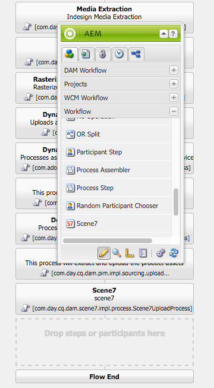
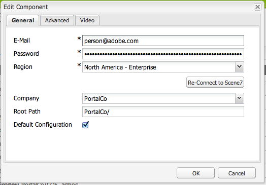

# Dynamic Media Classic {#integrating-with-dynamic-media-classic-scene}과 통합

Adobe Dynamic Media Classic은 리치 미디어 에셋을 관리, 향상, 게시 및 웹, 모바일, 이메일 및 인터넷에 연결된 디스플레이와 인쇄물로 전달하는 호스팅된 솔루션입니다.

Dynamic Media Classic을 사용하려면 Dynamic Media Classic 및 Adobe Experience Manager Assets가 서로 상호 작용할 수 있도록 클라우드 구성을 구성해야 합니다. 이 문서에서는 Experience Manager 및 Dynamic Media Classic을 구성하는 방법에 대해 설명합니다.

페이지에서 모든 Dynamic Media Classic 구성 요소를 사용하고 비디오를 사용한 작업에 대한 자세한 내용은 [Dynamic Media Classic 사용](../assets/scene7.md)을 참조하십시오.

>[!NOTE]
>
>* Dynamic Media Classic의 DHTML 뷰어 플랫폼은 2014년 1월 31일에 공식적으로 사용 종료되었다. 자세한 내용은 [DHTML 뷰어 사용 종료 FAQ](../sites-administering/dhtml-viewer-endoflifefaqs.md)를 참조하십시오.
>* Experience Manager에서 작동하도록 Dynamic Media Classic을 구성하기 전에 Experience Manager과 Dynamic Media Classic을 통합하려면 [우수 사례](#best-practices-for-integrating-scene-with-aem)를 참조하십시오.
>* 사용자 지정 프록시 구성과 함께 Dynamic Media Classic을 사용하는 경우 일부 Experience Manager 기능에서 3.x API를 사용하고 다른 기능에서는 4.x API를 사용하기 때문에 HTTP 클라이언트 프록시 구성을 모두 구성해야 합니다. 3.x는 [http://localhost:4502/system/console/configMgr/com.day.commons.httpclient](http://localhost:4502/system/console/configMgr/com.day.commons.httpclient)로 구성되며 4.x는 [http://localhost:4502/system/console/configMgr/org.apache.http.proxyconfigurator](http://localhost:4502/system/console/configMgr/org.apache.http.proxyconfigurator)로 구성됩니다.

>

## Experience Manager/Dynamic Media Classic 통합 대 Dynamic Media {#aem-scene-integration-versus-dynamic-media}

Experience Manager 사용자는 Dynamic Media에서 작업할 두 가지 솔루션 중에서 선택할 수 있습니다. 다음 중 하나를 사용할 수 있습니다.

* Experience Manager 인스턴스를 Dynamic Media Classic과 통합합니다.
* Experience Manager에 통합된 Dynamic Media 사용

다음 기준을 사용하여 선택할 솔루션을 결정합니다.

* 게시 및 전달을 위해 Dynamic Media Classic에 리치 미디어 에셋이 있는 **기존** Dynamic Media Classic 고객이지만 해당 에셋을 WCM(Sites) 작성 및/또는 관리를 위해 Experience Manager 에셋과 통합하려면 이 문서에 설명된 [Experience Manager/Dynamic Media Classic 지점 간 통합](#aem-scene-point-to-point-integration)을 사용하십시오.

* 리치 미디어 전달 요구 사항이 있는 **new** Experience Manager 고객인 경우 [Dynamic Media 옵션](#aem-dynamic-media)을 선택합니다. 이 옵션은 기존 S7 계정과 해당 시스템에 저장된 많은 자산이 없는 경우에 가장 적합합니다.

* 경우에 따라 두 솔루션을 모두 사용합니다. [이중 사용 시나리오](/help/sites-administering/scene7.md#dual-use-scenario)에서는 해당 시나리오를 설명합니다.

### Experience Manager/Dynamic Media Classic 지점 간 통합 {#aem-scene-point-to-point-integration}

이 솔루션에서 자산을 사용하여 작업하는 경우 다음 중 하나를 수행합니다.

* 에셋을 Dynamic Media Classic에 직접 업로드한 다음 페이지 작성을 위해 **Dynamic Media Classic** 내용 브라우저를 통해 액세스하거나
* Experience Manager 자산에 업로드한 다음 Dynamic Media Classic에 자동 게시 기능을 활성화합니다.페이지 작성을 위해 **자산** 컨텐츠 브라우저를 통해 액세스합니다.

이 통합에 사용하는 구성 요소는 [디자인 모드의 **Dynamic Media Classic** 구성 요소 영역에 있습니다.](/help/sites-authoring/author-environment-tools.md#page-modes)

### Experience Manager Dynamic Media {#aem-dynamic-media}

Experience Manager Dynamic Media은 Experience Manager 플랫폼 내에서 바로 Dynamic Media Classic 기능을 통합하는 것입니다.

이 솔루션에서 자산을 사용하여 작업하는 경우 다음 작업 과정을 따릅니다.

1. 단일 이미지 및 비디오 에셋을 Experience Manager에 바로 업로드할 수 있습니다.
1. Experience Manager 내에서 바로 비디오를 인코딩할 수 있습니다.
1. Experience Manager 내에서 바로 이미지 기반의 세트를 만들 수 있습니다.
1. 해당하는 경우 이미지 또는 비디오에 인터랙티브한 요소를 추가합니다.

Dynamic Media에 사용하는 구성 요소는 [디자인 모드](/help/sites-authoring/author-environment-tools.md#page-modes)의 **[!UICONTROL Dynamic Media]** 구성 요소 영역에서 찾을 수 있습니다. 여기에는 다음이 포함됩니다.

* **[!UICONTROL Dynamic Media]** -  **[!UICONTROL 동적]** 미디어 구성 요소는 편리하게도 이미지를 추가하는지 아니면 비디오를 추가하는지에 따라 다양한 옵션이 제공됩니다. 이 구성 요소는 이미지 사전 설정, 이미지 세트와 같은 이미지 기반 뷰어, 스핀 세트, 혼합 미디어 세트 및 비디오를 지원합니다. 또한 뷰어는 응답형으로 작동하므로 화면 크기가 화면 크기에 따라 자동으로 변경됩니다. 모든 뷰어는 HTML5 뷰어입니다.

* **[!UICONTROL 대화형 미디어]**  -  **[!UICONTROL 대화형]** 미디어 구성 요소는 캐러셀 배너, 대화형 이미지 및 대화형 비디오와 같은 자산을 위한 것입니다. 이러한 자산은 핫스팟이나 이미지 맵과 같은 상호 작용이 있습니다. 이 구성 요소는 스마트합니다. 즉, 이미지를 추가하는지 아니면 비디오를 추가하는지에 따라 다양한 옵션이 제공됩니다. 또한 뷰어는 응답형으로 작동하므로 화면 크기가 화면 크기에 따라 자동으로 변경됩니다. 모든 뷰어는 HTML5 뷰어입니다.

### 이중 사용 시나리오 {#dual-use-scenario}

Experience Manager의 Dynamic Media 및 Dynamic Media Classic 통합 기능을 동시에 사용할 수 있습니다. 다음 사용 사례 표에서는 특정 영역을 켜거나 끌 때 설명합니다.

Dynamic Media 및 Dynamic Media Classic을 동시에 사용하려면:

1. Cloud Services에서 [Dynamic Media Classic](#creating-a-cloud-configuration-for-scene)을 구성합니다.
1. 사용 사례와 관련된 특정 지침을 따르십시오.

   <table>
    <tbody>
    <tr>
    <td> </td>
    <td> </td>
    <td><strong>다이내믹 미디어</strong></td>
    <td> </td>
    <td><strong>Dynamic Media Classic 통합</strong></td>
    <td> </td>
    </tr>
    <tr>
    <td><strong>만약 ...</strong></td>
    <td><strong>사용 사례 워크플로우</strong></td>
    <td><strong>이미징/비디오</strong></td>
    <td><strong>Dynamic Media 구성 요소</strong></td>
    <td><strong>S7 컨텐츠 브라우저 및 구성 요소</strong></td>
    <td><strong>자산에서 S7으로 자동 업로드</strong></td>
    </tr>
    <tr>
    <td>사이트 및 Dynamic Media의 새로운 기능</td>
    <td>Experience Manager에 자산을 업로드하고 Experience Manager Dynamic Media 구성 요소를 사용하여 사이트 페이지에서 자산을 작성합니다.</td>
    <td>
사용
 
(3단계 참조)
 </td>
    <td><a href="/help/assets/adding-dynamic-media-assets-to-pages.md">사용</a></td>
    <td>끔</td>
    <td>끔</td>
    </tr>
    <tr>
    <td>소매 제품 및 사이트 및 Dynamic Media의 새로운 기능</td>
    <td>관리 및 전달을 위해 비제품 자산을 Experience Manager에 업로드합니다. Dynamic Media Classic에 PRODUCT 에셋을 업로드하고 Experience Manager 및 구성 요소의 Dynamic Media Classic 컨텐츠 브라우저를 사용하여 사이트에서 제품 세부 사항 페이지를 작성합니다.</td>
    <td>
사용
 
(3단계 참조)
 </td>
    <td><a href="/help/assets/adding-dynamic-media-assets-to-pages.md">사용</a></td>
    <td><a href="/help/assets/scene7.md#scene-content-browser">사용</a></td>
    <td>끔</td>
    </tr>
    <tr>
    <td>자산 및 Dynamic Media의 새로운 기능</td>
    <td>Experience Manager 자산에 자산 업로드 및 Dynamic Media의 게시된 URL/포함 코드 사용</td>
    <td>
사용
 
(3단계 참조)
 </td>
    <td>끔</td>
    <td>끔</td>
    <td>끔</td>
    </tr>
    <tr>
    <td>Dynamic Media 및 템플릿 설정의 새로운 기능</td>
    <td>이미징 및 비디오에 Dynamic Media 사용 Dynamic Media Classic에서 이미지 템플릿을 작성하고 Dynamic Media Classic 컨텐츠 파인더를 사용하여 사이트 페이지에 템플릿을 포함할 수 있습니다.</td>
    <td>
사용
 
(3단계 참조)
 </td>
    <td><a href="/help/assets/adding-dynamic-media-assets-to-pages.md">사용</a></td>
    <td><a href="/help/assets/scene7.md#scene-content-browser">사용</a></td>
    <td>끔</td>
    </tr>
    <tr>
    <td>기존 Dynamic Media Classic 고객 및 사이트를 처음 사용하는 고객</td>
    <td>Dynamic Media Classic에 에셋을 업로드하고 Experience Manager Dynamic Media Classic 컨텐츠 브라우저를 사용하여 사이트 페이지에서 에셋을 검색하고 제작합니다.</td>
    <td>끔</td>
    <td>끔</td>
    <td><a href="/help/assets/scene7.md#scene-content-browser">사용</a></td>
    <td>끔</td>
    </tr>
    <tr>
    <td>사이트 및 자산을 처음 사용하는 기존 Dynamic Media Classic 고객</td>
    <td>DAM에 에셋을 업로드하고 Dynamic Media Classic에 자동으로 게시하여 전달할 수 있습니다. Experience Manager Dynamic Media Classic 컨텐츠 브라우저를 사용하여 사이트 페이지에서 자산을 검색하고 작성합니다.</td>
    <td>끔</td>
    <td>끔</td>
    <td><a href="/help/assets/scene7.md#scene-content-browser">사용</a></td>
    <td>
<a href="#configuringautouploadingfromaemassets">사용</a>
 
(4단계 참조)
 </td>
    </tr>
    <tr>
    <td>기존 Dynamic Media Classic 고객 및 새로운 에셋</td>
    <td>
Experience Manager에 자산을 업로드하고 Dynamic Media을 사용하여 다운로드/공유를 위한 변환을 생성합니다. 전달을 위해 Experience Manager 에셋을 Dynamic Media Classic에 자동으로 게시합니다.
 
<strong>중요: 중복 </strong> 처리를 발생시키고 Experience Manager에서 생성된 변환이 Dynamic Media Classic에 동기화되지 않았습니다.
 </td>
    <td>
사용
 
(3단계 참조)
 </td>
    <td>끔</td>
    <td>끔</td>
    <td>
<a href="#configuringautouploadingfromaemassets">사용</a>
 
(4단계 참조)
 </td>
    </tr>
    </tbody>
    </table>

1. (선택 사항;사용 사례 표 참조) - [Dynamic Media 클라우드 구성](/help/assets/config-dynamic.md) 및 [Dynamic Media 서버](/help/assets/config-dynamic.md)를 사용하도록 설정합니다.
1. (선택 사항;사용 사례 표 참조) - Dynamic Media Classic에 자산에서 자동 업로드를 사용하도록 선택한 경우 다음을 추가해야 합니다.

   1. Dynamic Media Classic에 자동 업로드를 설정합니다.
   1. ***Dam 자산 업데이트**워크플로( `https://<server>:<host>/cf#/etc/workflow/models/dam/update_asset.html)`)의 끝에서 모든 Dynamic Media 워크플로우 단계*&#x200B;의 다음 **Dynamic Media Classic 업로드** 단계를 추가합니다.
   1. (선택 사항) Dynamic Media Classic 에셋 업로드를 [https://&lt;server>:&lt;port>/system/console/configMgr/com.day.cq.dam.scene7.impl.Scene7AssetMimeTypeServiceImpl](http://localhost:4502/system/console/configMgr/com.day.cq.dam.scene7.impl.Scene7AssetMimeTypeServiceImpl)에서 MIME 유형별로 제한합니다. 이 목록에 없는 자산 MIME 유형은 Dynamic Media Classic 서버에 업로드되지 않습니다.
   1. (선택 사항) Dynamic Media Classic 구성에서 비디오를 설정합니다. Dynamic Media 및 Dynamic Media Classic 중 하나 또는 둘 다에 대해 비디오 인코딩을 동시에 활성화할 수 있습니다. 동적 변환은 Experience Manager 인스턴스에서 로컬로 미리 보고 재생하는 데 사용되는 반면 Dynamic Media Classic 비디오 변환은 Dynamic Media Classic 서버에 생성되고 저장됩니다. Dynamic Media 및 Dynamic Media Classic 모두에 대해 비디오 인코딩 서비스를 설정할 때 Dynamic Media Classic 에셋 폴더에 [비디오 처리 프로필](/help/assets/video-profiles.md)을 적용합니다.
   1. (선택 사항) [Dynamic Media Classic에서 보안 미리 보기 구성](/help/sites-administering/scene7.md#configuring-the-state-published-unpublished-of-assets-pushed-to-scene).

#### 제한 사항 {#limitations}

Dynamic Media Classic과 Dynamic Media을 모두 활성화한 경우 다음과 같은 제한 사항이 있습니다.

* 자산을 선택하고 Experience Manager 페이지의 Dynamic Media Classic 구성 요소로 드래그하여 Dynamic Media Classic에 수동으로 업로드하는 것은 작동하지 않습니다.
* 에셋을 에셋에서 편집할 때 Experience Manager-Dynamic Media Classic의 동기화된 에셋이 Dynamic Media Classic으로 자동으로 업데이트되지만 롤백 작업에서는 새 업로드를 트리거하지 않습니다. 따라서 Dynamic Media Classic은 롤백 후 즉시 최신 버전을 가져오지 않습니다. 롤백을 완료한 후 다시 편집하는 것이 해결 방법입니다.
* Dynamic Media 에셋이 Dynamic Media Classic 시스템과 상호 작용하지 않도록 한 사용 케이스에 Dynamic Media을 사용하고 다른 사용 케이스에 Dynamic Media Classic 통합을 사용해야 하는 경우에는 Dynamic Media Classic 구성을 Dynamic Media 폴더에 적용하지 마십시오. 또한 Dynamic Media 구성(처리 프로필)을 Dynamic Media Classic 폴더에 적용하지 마십시오.

## Dynamic Media Classic을 Experience Manager {#best-practices-for-integrating-scene-with-aem}과(와) 통합하는 우수 사례

Dynamic Media Classic을 Experience Manager과 통합할 때 다음 영역에서 준수해야 하는 몇 가지 중요한 우수 사례가 있습니다.

* 통합 테스트
* 특정 시나리오의 경우 Dynamic Media Classic에서 바로 자산 업로드 권장

[알려진 제한 사항](#known-limitations-and-design-implications)을 참조하십시오.

### 통합 테스트 주도 {#test-driving-your-integration}

Adobe에서는 전체 회사가 아닌 하위 폴더를 가리키도록 루트 폴더를 지정하여 통합을 테스트해 보는 것이 좋습니다.

>[!CAUTION]
>
>기존 Dynamic Media Classic 회사 계정에서 에셋을 가져오는 데 Experience Manager에 표시되는 데 시간이 오래 걸릴 수 있습니다. 에셋이 너무 많지 않은 폴더를 Dynamic Media Classic에서 지정해야 합니다(예: 루트 폴더에 에셋이 너무 많아서 시스템에 충돌이 발생할 수 있음).

### Experience Manager 자산과 Dynamic Media Classic의 자산 업로드 비교 {#uploading-assets-from-aem-assets-versus-from-scene}

에셋(디지털 에셋 관리) 기능을 사용하거나 Dynamic Media Classic 컨텐츠 브라우저를 통해 Experience Manager에서 직접 Dynamic Media Classic에 액세스하여 에셋을 업로드할 수 있습니다. 다음 요인에 따라 선택할 수 있습니다.

* Experience Manager Assets에서 아직 지원하지 않는 Dynamic Media Classic 에셋 유형을 Dynamic Media Classic 컨텐츠 브라우저를 통해 Dynamic Media Classic에서 직접 Experience Manager 웹 사이트에 추가해야 합니다. 예: 이미지 템플릿.
* Experience Manager 자산 및 Dynamic Media Classic 모두에서 지원되는 자산 유형의 경우 업로드 방법을 결정하는 방법은 다음 사항에 따라 다릅니다.

   * 현재 자산이 있는 위치 및
   * 공통 저장소에서 관리하는 것이 얼마나 중요합니까?

에셋이 이미 Dynamic Media Classic에 있고 일반 저장소에서 에셋을 관리하는 것이 중요하지 않은 경우 Experience Manager 에셋으로 내보내 Dynamic Media Classic으로 동기화하여 전달하면 불필요한 양방향 탐색이 됩니다. 그렇지 않으면 단일 저장소에 에셋을 유지하고 전달만을 위해 Dynamic Media Classic에 동기화하는 것이 좋습니다.

## Dynamic Media Classic 통합 구성 {#configuring-scene-integration}

Dynamic Media Classic에 자산을 업로드하도록 Experience Manager을 구성할 수 있습니다. CQ 대상 폴더의 자산은 Experience Manager에서 Dynamic Media Classic 회사 계정으로 업로드(자동 또는 수동으로)할 수 있습니다.

>[!NOTE]
>
>Adobe에서는 Dynamic Media Classic 에셋을 가져오는 데 지정된 대상 폴더만 사용하는 것이 좋습니다. 대상 폴더 외부에 있는 디지털 자산은 Dynamic Media Classic 구성이 활성화된 페이지의 Dynamic Media Classic 구성 요소에만 사용할 수 있습니다. 또한 Dynamic Media Classic의 임시 폴더에 배치됩니다. 임시 폴더는 Experience Manager과 동기화되지 않지만 Dynamic Media Classic 컨텐츠 브라우저에서 에셋을 검색할 수 있습니다.

Experience Manager과 통합되도록 Dynamic Media Classic을 구성하려면 다음 단계를 완료해야 합니다.

1. [클라우드 구성](#creating-a-cloud-configuration-for-scene)  정의 - Dynamic Media Classic 폴더와 에셋 폴더 간의 매핑을 정의합니다. 단방향(Dynamic Media Classic에 자산 Experience Manager)만 동기화하려는 경우에도 이 단계를 완료하십시오.
1. [Adobe CQ  **s7dam 수신기 사용**](#enabling-the-adobe-cq-scene-dam-listener)  - OSGiconsole에서   완료
1. Experience Manager 에셋을 Dynamic Media Classic에 자동으로 업로드하려면 해당 옵션을 켜고 Dynamic Media Classic을 [!UICONTROL DAM 에셋 업데이트] 작업 과정에 추가해야 합니다. 자산을 수동으로 업로드할 수도 있습니다.
1. 사이드 킥에 Dynamic Media Classic 구성 요소 추가. 이 기능을 사용하면 사용자가 Experience Manager 페이지에서 Dynamic Media Classic 구성 요소를 사용할 수 있습니다.
1. [Experience Manager의 페이지에 구성 매핑](#enabling-scene-for-wcm)  - Dynamic Media Classic에서 만든 비디오 사전 설정을 보려면 이 단계가 필요합니다. CQ 대상 폴더 외부에서 Dynamic Media Classic으로 자산을 게시해야 하는 경우에도 필요합니다.

이 섹션에서는 이러한 모든 단계를 수행하는 방법에 대해 설명하고 중요한 제한 사항을 나열합니다.

### Dynamic Media Classic 및 Experience Manager 자산 간의 동기화가 작동하는 방식 {#how-synchronization-between-scene-and-aem-assets-works}

Experience Manager 자산 및 Dynamic Media Classic 동기화를 설정하는 경우 다음을 이해하는 것이 중요합니다.

#### Experience Manager 자산 {#uploading-to-scene-from-aem-assets}에서 Dynamic Media Classic에 업로드

* Dynamic Media Classic 업로드를 위한 Experience Manager에 지정된 동기화 폴더가 있습니다.
* 디지털 자산을 지정된 동기화 폴더에 배치하는 경우 Dynamic Media Classic에 대한 업로드를 자동화할 수 있습니다.
* Experience Manager의 폴더 및 하위 폴더 구조는 Dynamic Media Classic에서 복제됩니다.

>[!NOTE]
>
>Experience Manager은 Dynamic Media Classic에 업로드하기 전에 모든 메타데이터를 XMP으로 포함하므로 메타데이터 노드의 모든 속성을 XMP으로 Dynamic Media Classic에서 사용할 수 있습니다.

#### 알려진 제한 사항 및 디자인은 {#known-limitations-and-design-implications}

Experience Manager Assets와 Dynamic Media Classic 간의 동기화를 통해 현재 다음과 같은 제한 사항/디자인 관련 사항이 있습니다.

<table>
 <tbody>
  <tr>
   <td><strong>제한/디자인 함축</strong></td>
   <td><strong>설명</strong></td>
  </tr>
  <tr>
   <td>지정된 동기화(대상) 폴더 1개</td>
   <td>Dynamic Media Classic 업로드를 위해 Experience Manager에 회사당 하나의 지정된 폴더만 있을 수 있습니다. Dynamic Media Classic에서 두 개 이상의 회사 계정에 액세스해야 하는 경우 여러 구성을 만들 수 있습니다.</td>
  </tr>
  <tr>
   <td>폴더 구조</td>
   <td>동기화된 폴더를 에셋과 함께 삭제하면 모든 Dynamic Media Classic 원격 에셋이 삭제되지만 폴더는 그대로 유지됩니다.</td>
  </tr>
  <tr>
   <td>임시 폴더</td>
   <td>WCM에서 Dynamic Media Classic으로 수동으로 업로드된 대상 폴더 외부에 있는 자산은 Dynamic Media Classic의 별도의 임시 폴더에 자동으로 배치됩니다. Experience Manager의 클라우드 구성에서 이 폴더를 구성합니다.</td>
  </tr>
  <tr>
   <td>혼합 미디어</td>
   <td>혼합 미디어 세트는 Experience Manager에서 지원되지 않지만 Experience Manager에 표시됩니다.</td>
  </tr>
  <tr>
   <td>PDF</td>
   <td>Dynamic Media Classic의 eCatalogs에서 생성된 PDF를 CQ 대상 폴더로 가져옵니다.</td>
  </tr>
  <tr>
   <td>UI 새로 고침</td>
   <td>Experience Manager과 Dynamic Media Classic 간에 동기화할 때는 사용자 인터페이스를 새로 고쳐서 변경 사항을 확인하십시오. </td>
  </tr>
  <tr>
   <td>비디오 축소판</td>
   <td>Dynamic Media Classic을 통해 인코딩할 Experience Manager 에셋에 비디오를 업로드하는 경우 비디오 처리 시간에 따라 비디오 축소판과 인코딩된 비디오를 Experience Manager 에셋에서 사용할 수 있는 데 시간이 걸릴 수 있습니다.</td>
  </tr>
  <tr>
   <td>Target 하위 폴더</td>
   <td>
대상 폴더 내의 하위 폴더를 사용하는 경우 위치에 관계없이 각 자산에 대해 고유 이름을 사용하거나 설정 영역에 있는 Dynamic Media Classic을 구성하여 위치에 관계없이 에셋을 덮어쓰지 않도록 하십시오.
 
그렇지 않으면 Dynamic Media Classic 대상 하위 폴더에 업로드된 동일한 이름의 에셋이 업로드되지만 대상 폴더에 있는 동일한 이름의 에셋이 삭제됩니다. 
 </td>
  </tr>
 </tbody>
</table>

### Dynamic Media Classic 서버 구성 {#configuring-scene-servers}

프록시 뒤에서 Experience Manager을 실행하거나 특수 방화벽 설정을 사용하는 경우 다른 영역의 호스트를 명시적으로 활성화해야 합니다. 서버는 `/etc/cloudservices/scene7/endpoints`의 컨텐츠에서 관리되며 필요에 따라 사용자 정의할 수 있습니다. 필요한 경우 URL을 누른 다음 편집하여 URL을 변경합니다. 이전 버전의 Experience Manager에서는 이러한 값이 하드 코딩되었습니다.

`/etc/cloudservices/scene7/endpoints.html`으로 이동하면 나열된 서버가 표시됩니다(URL을 탭하여 편집할 수 있음).

### Dynamic Media Classic {#creating-a-cloud-configuration-for-scene}에 대한 클라우드 구성 만들기

클라우드 구성은 Dynamic Media Classic 폴더와 Experience Manager 에셋 폴더 간의 매핑을 정의합니다. Experience Manager 에셋을 Dynamic Media Classic과 동기화하도록 구성해야 합니다. 자세한 내용은 동기화 작동 방식을 참조하십시오.

>[!CAUTION]
>
>기존 Dynamic Media Classic 회사 계정에서 에셋을 가져오는 데 Experience Manager에 표시되는 데 시간이 오래 걸릴 수 있습니다. 에셋이 너무 많지 않은 폴더를 Dynamic Media Classic에서 지정해야 합니다. 예를 들어 루트 폴더에 자산이 너무 많은 경우가 많습니다.
>
>통합을 테스트하려면 전체 회사 대신 루트 폴더 지점을 하위 폴더에만 둡니다.

>[!NOTE]
>
>다음과 같이 여러 구성을 사용할 수 있습니다.하나의 클라우드 구성은 Dynamic Media Classic 회사의 한 사용자를 나타냅니다. 다른 Dynamic Media Classic 회사 또는 사용자에게 액세스하려면 여러 구성을 만들어야 합니다.

Dynamic Media Classic에 자산을 게시할 수 있도록 Experience Manager을 구성하려면:

1. Experience Manager 아이콘을 누르고 **[!UICONTROL 배포 > Cloud Services]**&#x200B;로 이동하여 Adobe Dynamic Media Classic에 액세스합니다.

1. **[!UICONTROL 지금 구성]**&#x200B;을 누릅니다.

   

1. **[!UICONTROL 제목]** 필드에 필요한 경우 **[!UICONTROL 이름]** 필드에 적절한 정보를 입력합니다. **[!UICONTROL 만들기]**&#x200B;를 누릅니다.

   >[!NOTE]
   >
   >추가 구성을 만들 때 **[!UICONTROL 상위 구성]** 필드가 표시됩니다.
   >
   >상위 구성을 변경하지 **마십시오**&#x200B;는 상위 구성을 변경하지 마십시오. 상위 구성을 변경하면 통합이 중단될 수 있습니다.

1. Dynamic Media Classic 계정의 이메일 주소, 암호 및 영역을 입력하고 **[!UICONTROL Dynamic Media Classic에 연결]**&#x200B;을 탭합니다. Dynamic Media Classic 서버에 연결되고 대화 상자가 더 많은 옵션으로 확장됩니다.

1. **[!UICONTROL 회사]** 이름과 **[!UICONTROL 루트 경로]**&#x200B;를 입력합니다. 이 정보는 지정할 경로와 함께 게시된 서버 이름입니다. 게시된 서버 이름을 모를 경우 Dynamic Media Classic에서 **[!UICONTROL 설정 > 응용 프로그램 설정]**)으로 이동합니다.

   >[!NOTE]
   >
   >Dynamic Media Classic 루트 경로는 연결된 Dynamic Media Classic 폴더 Experience Manager입니다. 특정 폴더로 축소할 수 있습니다.

   >[!CAUTION]
   >
   >Dynamic Media Classic 폴더의 크기에 따라 루트 폴더를 가져오는 데 시간이 오래 걸릴 수 있습니다. 또한 Dynamic Media Classic 데이터는 Experience Manager 저장소를 초과할 수 있습니다. 올바른 폴더를 가져오는지 확인합니다. 너무 많은 데이터를 가져오면 시스템이 중단될 수 있습니다.

   

1. **[!UICONTROL 확인]**&#x200B;을 클릭합니다. Experience Manager은 구성을 저장합니다.

>[!NOTE]
>
>다시 연결하는 경우:
>
>* 게시 시 Dynamic Media Classic에 다시 연결할 때 게시 또는 다시 연결할 때 암호를 재설정해도 작동하지 않습니다(작성자 인스턴스의 문제가 아님).
>* 지역, 회사 이름과 같은 값을 수정하는 경우 Dynamic Media Classic에 다시 연결해야 합니다. 구성 옵션이 수정되었지만 저장되지 않은 경우 Experience Manager은 구성이 유효하다는 것을 잘못 표시합니다. 다시 연결해야 합니다.

>

### Adobe CQ Dynamic Media Classic Dam 리스너 활성화 {#enabling-the-adobe-cq-scene-dam-listener}

기본적으로 비활성화된 Adobe CQ Dynamic Media Classic Dam 리스너를 활성화합니다.

Adobe CQ Dynamic Media Classic Dam 리스너를 활성화하려면:

1. [!UICONTROL 도구] 아이콘을 누른 다음 **[!UICONTROL 작업 > 웹 콘솔]**&#x200B;으로 이동합니다. 웹 콘솔이 열립니다.
1. **[!UICONTROL Adobe CQ Dynamic Media Classic Dam 수신기]**&#x200B;로 이동하고 **[!UICONTROL 활성화됨]** 확인란을 선택합니다.

   

1. **[!UICONTROL 저장]**&#x200B;을 누릅니다.

### Dynamic Media Classic 업로드 작업 과정에 구성 가능한 시간 초과를 추가하는 중 {#adding-configurable-timeout-to-scene-upload-workflow}

Experience Manager 인스턴스가 Dynamic Media Classic을 통해 비디오 인코딩을 처리하도록 구성된 경우 기본적으로 업로드 작업에 대해 35분 시간 초과가 있습니다. 잠재적으로 더 오래 실행되는 비디오 인코딩 작업을 수용하려면 다음 설정을 구성할 수 있습니다.

1. **http://localhost:4502/system/console/configMgr/com.day.cq.dam.scene7.impl.Scene7UploadServiceImpl**&#x200B;로 이동합니다.

   

1. **[!UICONTROL 활성 작업 시간 초과]** 필드에서 원하는 대로 숫자를 변경합니다. 음수가 아닌 숫자는 측정 단위로 몇 초 내에 허용됩니다. 기본적으로 이 숫자는 2100으로 설정됩니다.

   >[!NOTE]
   >
   >모범 사례:대부분의 에셋은 몇 분 내에(예: 이미지) 수집됩니다. 하지만 특정 경우(예: 큰 비디오) 긴 처리 시간을 수용하기 위해 시간 초과 값을 7200초(2시간)로 증가시킵니다. 그렇지 않으면 이 Dynamic Media Classic 업로드 작업은 JCR 메타데이터에서 **[!UICONTROL UploadFailed]**&#x200B;로 표시됩니다.

1. **[!UICONTROL 저장]**&#x200B;을 누릅니다.

### Experience Manager 자산에서 자동 업로드 {#autouploading-from-aem-assets}

Experience Manager 6.3.2부터 Experience Manager 자산이 CQ 대상 폴더에 있는 경우 자산 관리자에 업로드된 모든 디지털 자산이 Dynamic Media Classic으로 업데이트되도록 구성됩니다.

에셋이 Experience Manager 에셋에 추가되면 자동으로 업로드되고 Dynamic Media Classic에 게시됩니다.

>[!NOTE]
>
>Experience Manager Assets에서 Dynamic Media Classic으로 자동 업로드하기 위한 최대 파일 크기는 500MB입니다.

Experience Manager 자산에서 자동 로드를 구성하려면:

1. Experience Manager 아이콘을 탭하고 **[!UICONTROL 배포 > Cloud Services]**&#x200B;로 이동한 다음, Dynamic Media 머리글 아래의 사용 가능한 구성에서 **[!UICONTROL dms7(Dynamic Media]**)을 탭합니다.
1. **[!UICONTROL 고급]** 탭을 누르고 **[!UICONTROL 자동 업로드 활성화]** 확인란을 선택한 다음 **[!UICONTROL 확인]**&#x200B;을 누릅니다. 이제 Dynamic Media Classic에 대한 업로드를 포함하도록 DAM 자산 워크플로우를 구성해야 합니다.

   >[!NOTE]
   >
   >게시 취소된 상태로 자산을 Dynamic Media Classic으로 푸시하는 방법에 대한 자세한 내용은 [Dynamic Media Classic에 푸시된 자산의 상태(게시/게시 취소) 구성을 참조하십시오.](#configuring-the-state-published-unpublished-of-assets-pushed-to-scene)

   

1. Experience Manager 시작 페이지로 돌아가서 **[!UICONTROL 워크플로]**&#x200B;를 탭합니다. **DAM 자산 업데이트** 작업 과정을 두 번 클릭하여 엽니다.
1. 사이드 킥에서 **[!UICONTROL Workflow]** 구성 요소로 이동하고 **[!UICONTROL Dynamic Media Classic]**&#x200B;을 선택합니다. **[!UICONTROL Dynamic Media Classic]**&#x200B;을(를) 워크플로우로 드래그하고 **[!UICONTROL 저장]**&#x200B;을(를) 탭합니다. 대상 폴더의 Experience Manager 자산에 추가된 자산은 자동으로 Dynamic Media Classic에 업로드됩니다.

   

   >[!NOTE]
   >
   >* 에셋을 자동화 후 추가할 때 CQ 대상 폴더에 배치되지 않으면 Dynamic Media Classic에 업로드되지 않습니다.
   >* Experience Manager은 Dynamic Media Classic에 업로드하기 전에 모든 메타데이터를 XMP으로 포함하므로 메타데이터 노드의 모든 속성을 XMP으로 Dynamic Media Classic에서 사용할 수 있습니다.

### Dynamic Media Classic {#configuring-the-state-published-unpublished-of-assets-pushed-to-scene}에 푸시된 자산의 상태(게시/게시 취소) 구성

Experience Manager Assets에서 Dynamic Media Classic으로 에셋을 푸시하는 경우 자동으로(기본 동작) 게시하거나 게시 취소된 상태로 Dynamic Media Classic으로 푸시할 수 있습니다.

라이브하기 전에 스테이징 환경에서 자산을 테스트하려는 경우 Dynamic Media Classic에 자산을 즉시 게시하지 않을 수 있습니다. Dynamic Media Classic의 보안 테스트 환경에서 Experience Manager을 사용하여 게시 취소된 상태에서 에셋을 Dynamic Media Classic으로 직접 푸시할 수 있습니다.

Dynamic Media Classic 에셋은 보안 미리 보기를 통해 계속 사용할 수 있습니다. Experience Manager 내에 에셋이 게시된 경우에만 Dynamic Media Classic 에셋도 프로덕션에서 라이브됩니다.

Dynamic Media Classic으로 자산을 푸시할 때 즉시 자산을 게시하려면 옵션을 구성할 필요가 없습니다. 이 기능은 기본 동작입니다.

그러나 Dynamic Media Classic으로 푸시된 에셋이 자동으로 게시되지 않도록 하려면 이 섹션에서는 이 기능을 수행하도록 Experience Manager 및 Dynamic Media Classic을 구성하는 방법에 대해 설명합니다.

#### Dynamic Media Classic에 자산을 푸시하기 위한 사전 요구 사항 게시 취소된 {#prerequisites-to-push-assets-to-scene-unpublished}

자산을 게시하지 않고 Dynamic Media Classic으로 푸시하려면 먼저 다음을 설정해야 합니다.

1. [Admin Console을 사용하여 지원 사례를 만듭니다.](https://helpx.adobe.com/enterprise/admin-guide.html/enterprise/using/support-for-experience-cloud.ug.html) 지원 사례에서 Dynamic Media Classic 계정에 대한 보안 미리 보기 활성화를 요청합니다.
1. Dynamic Media Classic 계정에 대해 [보안 미리 보기 설정 지침을 따릅니다.](https://help.adobe.com/en_US/scene7/using/WSd968ca97bf00cf72-5eeee3a113268dc80f5-8000.html)

이러한 단계는 Dynamic Media Classic에서 보안 테스트 설정을 만들기 위해 수행하는 단계와 동일합니다.

>[!NOTE]
>
>설치 환경이 UNIX® 64비트 운영 체제인 경우 설정해야 하는 다른 구성 옵션에 대해서는 [https://helpx.adobe.com/experience-manager/kb/enable-xmp-write-back-64-bit-redhat.html](https://helpx.adobe.com/experience-manager/kb/enable-xmp-write-back-64-bit-redhat.html)을 참조하십시오.

#### 게시 취소된 상태 {#known-limitations-for-pushing-assets-in-unpublished-state}의 자산 푸시에 대한 알려진 제한 사항

이 기능을 사용하는 경우 다음 제한 사항을 참고하십시오.

* 버전 제어가 지원되지 않습니다.
* 에셋이 이미 Experience Manager에 게시되어 후속 버전이 생성된 경우 해당 새 버전이 즉시 프로덕션에 실시간으로 게시됩니다. 활성화 시 게시는 자산의 초기 게시에만 작동합니다.

>[!NOTE]
>
>자산을 즉시 게시하려면 **[!UICONTROL 보안 미리 보기 활성화]**&#x200B;를 **[!UICONTROL 즉시]**&#x200B;로 설정하고 **[!UICONTROL 자동 업로드 활성화]** 기능을 사용하는 것이 좋습니다.

### Dynamic Media Classic에 푸시된 자산의 상태 설정 게시 취소 {#setting-the-state-of-assets-pushed-to-scene-as-unpublished}

>[!NOTE]
>
>사용자가 Experience Manager에 자산을 게시하면 S7 자산이 프로덕션/라이브 자산에 자동으로 트리거됩니다(자산은 더 이상 보안 미리 보기/게시 취소된 상태가 아님).

Dynamic Media Classic에 푸시된 자산의 상태를 게시 취소됨으로 설정하려면:

1. Experience Manager 아이콘을 누르고 **[!UICONTROL 배포 > Cloud Services]**&#x200B;로 이동하고 **[!UICONTROL Dynamic Media Classic]**&#x200B;을 누른 다음 Dynamic Media Classic에서 구성을 선택합니다.
1. **[!UICONTROL 고급]** 탭을 누릅니다. **[!UICONTROL 보안 보기 활성화]** 드롭다운 메뉴에서 **[!UICONTROL AEM 게시 활성화 시]**&#x200B;를 선택하여 자산을 게시하지 않고 Dynamic Media Classic으로 푸시합니다. 기본적으로 이 값은 **[!UICONTROL 즉시]**&#x200B;로 설정되며 여기서 Dynamic Media Classic 에셋이 즉시 게시됩니다.

   자산을 공개하기 전에 자산 테스트에 대한 자세한 내용은 [Dynamic Media Classic 문서](https://help.adobe.com/en_US/scene7/using/WSd968ca97bf00cf72-5eeee3a113268dc80f5-8000.html)를 참조하십시오.

   

1. **[!UICONTROL OK]**&#x200B;을 누릅니다.

보안 미리 보기를 활성화하면 에셋이 게시 취소된 보안 미리 보기 서버로 푸시됩니다.

보안 미리 보기가 활성화되어 있는지 확인하려면 Experience Manager의 페이지에서 Dynamic Media Classic 구성 요소로 이동합니다. **[!UICONTROL 편집]**&#x200B;을 누릅니다. 자산에 URL에 나열된 보안 미리 보기 서버가 있습니다. Experience Manager에 게시하면 파일 참조의 서버 도메인이 미리 보기 URL에서 프로덕션 URL로 업데이트됩니다.

### WCM {#enabling-scene-for-wcm}에 대해 Dynamic Media Classic 사용

다음 두 가지 이유로 WCM에 대해 Dynamic Media Classic을 활성화해야 합니다.

* 페이지 작성을 위한 범용 비디오 프로필 드롭다운 목록을 활성화합니다. 이 목록이 없으면 **[!UICONTROL 유니버설 비디오 사전 설정]** 드롭다운이 비어 있으므로 설정할 수 없습니다.
* 디지털 자산이 대상 폴더에 없는 경우 페이지 속성에서 해당 페이지에 대해 Dynamic Media Classic을 활성화하면 에셋을 Dynamic Media Classic에 업로드할 수 있습니다. 그런 다음 자산을 Dynamic Media Classic 구성 요소에 드래그하여 놓습니다. 일반적인 상속 규칙이 적용됩니다(하위 페이지가 상위 페이지에서 구성을 상속함을 의미합니다).

다른 구성과 마찬가지로 WCM에 대해 Dynamic Media Classic을 활성화하면 상속 규칙이 적용됩니다. 터치에 적합한 사용자 인터페이스 또는 클래식 사용자 인터페이스에서 WCM에 대해 Dynamic Media Classic을 활성화할 수 있습니다.

#### 터치에 적합한 사용자 인터페이스에서 WCM에 대해 Dynamic Media Classic 활성화 {#enabling-scene-for-wcm-in-the-touch-optimized-user-interface}

터치에 적합한 UI에서 WCM에 대해 Dynamic Media Classic을 활성화하려면:

1. Experience Manager 아이콘을 누르고 **[!UICONTROL 사이트]**&#x200B;로 이동한 다음 웹 사이트의 루트 페이지(언어별로 지정되지 않음)로 이동합니다.

1. 도구 모음에서 [!UICONTROL 설정] 아이콘을 선택하고 **[!UICONTROL 속성 열기]**&#x200B;를 누릅니다.

1. **[!UICONTROL Cloud Services]**&#x200B;을 누르고 **[!UICONTROL 구성 추가]**&#x200B;를 누르고 **[!UICONTROL Dynamic Media Classic]**&#x200B;을 선택합니다.
1. **[!UICONTROL Adobe Dynamic Media Classic]** 드롭다운 목록에서 원하는 구성을 선택하고 **[!UICONTROL 확인]**&#x200B;을 탭합니다.

   

   Dynamic Media Classic 구성의 비디오 사전 설정은 해당 페이지 및 하위 페이지에서 Dynamic Media Classic 비디오 구성 요소와 함께 Experience Manager에서 사용할 수 있습니다.

#### 클래식 사용자 인터페이스에서 WCM에 대해 Dynamic Media Classic 사용 {#enabling-scene-for-wcm-in-the-classic-user-interface}

클래식 UI에서 WCM에 대해 Dynamic Media Classic을 활성화하려면:

1. Experience Manager에서 **[!UICONTROL 웹 사이트]**&#x200B;를 탭하고 웹 사이트의 루트 페이지(언어별로 지정되지 않음)로 이동합니다.

1. 사이드 킥에서 **[!UICONTROL 페이지]** 아이콘을 누르고 **[!UICONTROL 페이지 속성]**&#x200B;을 탭합니다.

1. **[!UICONTROL Cloud Services > 서비스 추가 > Dynamic Media Classic]**&#x200B;을 탭합니다.
1. **[!UICONTROL Adobe Dynamic Media Classic]** 드롭다운 목록에서 원하는 구성을 선택하고 **[!UICONTROL 확인]**&#x200B;을 탭합니다.

   Dynamic Media Classic 구성의 비디오 사전 설정은 해당 페이지 및 하위 페이지에서 Dynamic Media Classic 비디오 구성 요소와 함께 Experience Manager에서 사용할 수 있습니다.

### 기본 구성 {#configuring-a-default-configuration} 구성

여러 개의 Dynamic Media Classic 구성이 있는 경우, 이 구성 중 하나를 Dynamic Media Classic 컨텐츠 브라우저의 기본값으로 지정할 수 있습니다.

지정된 순간에 하나의 Dynamic Media Classic 구성만 기본값으로 표시할 수 있습니다. 기본 구성은 Dynamic Media Classic 컨텐츠 브라우저에 기본적으로 표시되는 회사 자산입니다.

기본 구성을 구성하려면:

1. Experience Manager 아이콘을 누르고 **[!UICONTROL 배포 > Cloud Services]**&#x200B;로 이동하고 **[!UICONTROL Dynamic Media Classic]**&#x200B;을 누른 다음 Dynamic Media Classic에서 구성을 선택합니다.
1. 구성을 열려면 **[!UICONTROL 편집]**&#x200B;을 탭합니다.

1. **[!UICONTROL 일반]** 탭에서 **[!UICONTROL 기본 구성]** 확인란을 선택하여 Dynamic Media Classic 컨텐츠 브라우저에 표시되는 기본 회사 및 루트 경로로 만듭니다.

   

   >[!NOTE]
   >
   >구성이 하나만 있는 경우 **[!UICONTROL 기본 구성]** 확인란을 선택하면 아무런 효과가 없습니다.

### 임시 폴더 구성 중 {#configuring-the-ad-hoc-folder}

자산이 CQ 대상 폴더에 없을 때 Dynamic Media Classic에 업로드되는 폴더를 구성할 수 있습니다. CQ 대상 폴더 외부에서 자산 게시를 참조하십시오.

임시 폴더를 구성하려면:

1. Experience Manager 아이콘을 누르고 **[!UICONTROL 배포 > Cloud Services]**&#x200B;로 이동하고 **[!UICONTROL Dynamic Media Classic]**&#x200B;을 누른 다음 Dynamic Media Classic에서 구성을 선택합니다.
1. 구성을 열려면 **[!UICONTROL 편집]**&#x200B;을 탭합니다.

1. **[!UICONTROL 고급]** 탭을 누릅니다. **[!UICONTROL 애드혹 폴더]** 필드에서 **애드혹** 폴더를 수정할 수 있습니다. 기본적으로 **name_of_the_company/CQ5_adhoc**&#x200B;입니다.

   

### 범용 사전 설정 구성 {#configuring-universal-presets}

비디오 구성 요소에 대한 범용 사전 설정을 구성하려면 [비디오](/help/assets/s7-video.md)를 참조하십시오.

## MIME 유형 기반 Assets/Dynamic Media Classic 업로드 작업 매개 변수 지원 활성화 {#enabling-mime-type-based-assets-scene-upload-job-parameter-support}

Digital Asset Manager/Dynamic Media Classic 자산의 동기화에 의해 트리거되는 구성 가능한 Dynamic Media Classic 업로드 작업 매개 변수를 활성화할 수 있습니다.

특히 Experience Manager 웹 콘솔 구성 패널의 OSGi(Open Service Gateway Initiative) 영역에서 허용되는 파일 형식을 MIME 유형별로 구성합니다. 그런 다음 JCR(Java™ Content Repository)의 각 MIME 유형에 사용되는 개별 업로드 작업 매개 변수를 사용자 정의할 수 있습니다.

**MIME 유형 기반 자산을 활성화하려면:**

1. Experience Manager 아이콘을 누르고 **[!UICONTROL 도구 > 작업 > 웹 콘솔]**&#x200B;로 이동합니다.
1. Adobe Experience Manager 웹 콘솔 구성 패널의 **[!UICONTROL OSGi]** 메뉴에서 **[!UICONTROL 구성]**&#x200B;을 탭합니다.
1. 이름 열에서 **[!UICONTROL Adobe CQ Dynamic Media Classic Asset MIME 유형 서비스]**&#x200B;를 찾아 탭하여 구성을 편집합니다.
1. MIME 유형 매핑 영역에서 더하기 기호(+)를 눌러 MIME 유형을 추가합니다.

   [지원되는 MIME 유형](/help/assets/assets-formats.md#supported-mime-types)을 참조하십시오.

1. 텍스트 필드에 새 MIME 유형 이름을 입력합니다.

   예를 들어 `EPS=application/postscript` 또는 `PSD=image/vnd.adobe.photoshop`에 `<file_extension>=<mime_type>`을 입력합니다.

1. 구성 창의 오른쪽 아래에서 **[!UICONTROL 저장]**&#x200B;을 탭합니다.
1. Experience Manager으로 돌아가서 왼쪽 레일에서 CRXDE Lite을 누릅니다.
1. CRXDE Lite 페이지의 왼쪽 레일에서 `/etc/cloudservices/scene7/<environment>`(실제 이름의 경우 `<environment>` 대체)으로 이동합니다.
1. `<environment>`(실제 이름으로 `<environment>` 대체)을 확장하여 `mimeTypes` 노드를 표시합니다.
1. 방금 추가한 mimeType을 누릅니다.

   예: `mimeTypes > application_postscript` 또는 `mimeTypes > image_vnd.adobe.photoshop`.

1. CRXDE Lite 페이지의 오른쪽에서 **[!UICONTROL 속성]** 탭을 누릅니다.
1. **[!UICONTROL jobParam]** 값 필드에 Dynamic Media Classic 업로드 작업 매개 변수를 지정합니다.

   예, `psprocess="rasterize"&psresolution=120` .

   사용할 수 있는 업로드 작업 매개 변수에 대한 자세한 내용은 [Adobe Dynamic Media Classic Image Production System API](https://experienceleague.adobe.com/docs/dynamic-media-developer-resources/image-production-api/c-overview.html)을 참조하십시오.

   >[!NOTE]
   >
   >PSD 파일을 업로드하고 레이어 추출이 있는 템플릿으로 처리하려는 경우 **[!UICONTROL jobParam]** 값 필드에 다음을 입력합니다.
   >
   >`process=MaintainLayers&layerNaming=AppendName&createTemplate=true`
   >
   >PSD 파일에 &quot;레이어&quot;가 있는지 확인합니다. 하나의 이미지나 마스크가 있는 이미지라면 처리할 레이어가 없으므로 이미지로 처리됩니다.

1. CRXDE Lite 페이지의 왼쪽 위 모서리에서 **[!UICONTROL 모두 저장]**&#x200B;을 탭합니다.

## Dynamic Media Classic 및 Experience Manager 통합 문제 해결 {#troubleshooting-scene-and-aem-integration}

Experience Manager을 Dynamic Media Classic과 통합하는 데 문제가 있는 경우, 솔루션에 대한 다음 시나리오를 참조하십시오.

**디지털 에셋을 Dynamic Media Classic에 게시하지 못한 경우:**

* 업로드하는 자산이 **[!UICONTROL CQ 대상]** 폴더에 있는지 확인합니다(Dynamic Media Classic 클라우드 구성에서 이 폴더를 지정합니다).
* 그렇지 않은 경우 **[!UICONTROL CQ 애드혹]** 폴더에 업로드할 수 있도록 해당 페이지에 대한 **[!UICONTROL 페이지 속성]**&#x200B;에서 클라우드 구성을 구성해야 합니다.

* 로그에서 자세한 내용을 확인하십시오.

**비디오 사전 설정이 나타나지 않는 경우:**

* **[!UICONTROL 페이지 속성]**&#x200B;을 통해 해당 페이지의 클라우드 구성을 구성했는지 확인합니다. 비디오 사전 설정은 Dynamic Media Classic 비디오 구성 요소에서 사용할 수 있습니다.

**비디오 에셋이 Experience Manager에서 재생되지 않는 경우:**

* 올바른 비디오 구성 요소를 사용했는지 확인합니다. Dynamic Media Classic 비디오 구성 요소는 기본 비디오 구성 요소와 다릅니다. [기본 비디오 구성 요소와 Dynamic Media 클래식 비디오 구성 요소](/help/assets/s7-video.md)를 참조하십시오.

**Experience Manager의 새 자산이나 수정된 자산이 Dynamic Media Classic에 자동으로 업로드되지 않는 경우:**

* 자산이 CQ 대상 폴더에 있는지 확인합니다. CQ 대상 폴더에 있는 자산만 자동으로 업데이트됩니다(자산을 자동으로 업로드하도록 Experience Manager 자산을 구성한 경우).
* 자동 업로드를 사용하도록 Cloud Services 구성을 구성했으며 Dynamic Media Classic 업로드를 포함하도록 DAM 자산 워크플로우를 업데이트 및 저장했는지 확인합니다.
* Dynamic Media Classic 대상 폴더의 하위 폴더에 이미지를 업로드할 때 다음 중 하나를 수행해야 합니다.

   * 위치에 관계없이 모든 자산의 이름이 고유해야 합니다. 그렇지 않으면 기본 대상 폴더의 자산이 삭제되고 하위 폴더에 있는 자산만 유지됩니다.
   * Dynamic Media Classic이 Dynamic Media Classic 계정의 설정 영역에서 자산을 덮어쓰는 방식을 변경합니다. 하위 폴더에 동일한 이름의 에셋을 사용하는 경우 위치에 관계없이 에셋을 덮어쓰도록 Dynamic Media Classic을 설정하지 마십시오.

**삭제된 에셋 또는 폴더가 Dynamic Media Classic과 Experience Manager 간에 동기화되지 않은 경우:**

* Experience Manager 자산에서 삭제된 자산 및 폴더는 Dynamic Media Classic의 동기화된 폴더에 계속 표시됩니다. 수동으로 삭제합니다.

**비디오 업로드가 실패한 경우**

* 비디오 업로드가 실패하고 Experience Manager을 사용하여 Dynamic Media Classic 통합을 통해 비디오를 인코딩하는 경우, [Dynamic Media Classic 업로드 작업 과정에 구성 가능한 시간 초과 추가](#adding-configurable-timeout-to-scene-upload-workflow)를 참조하십시오.

>[!CAUTION]
>
>기존 Dynamic Media Classic 회사 계정에서 에셋을 가져오는 데 Experience Manager에 표시되는 데 시간이 오래 걸릴 수 있습니다. 에셋이 너무 많지 않은 폴더를 Dynamic Media Classic에서 지정해야 합니다. 예를 들어 루트 폴더에 자산이 너무 많은 경우가 많습니다.
>
>통합을 테스트하려면 전체 회사 대신 루트 폴더 지점을 하위 폴더에만 둡니다.

