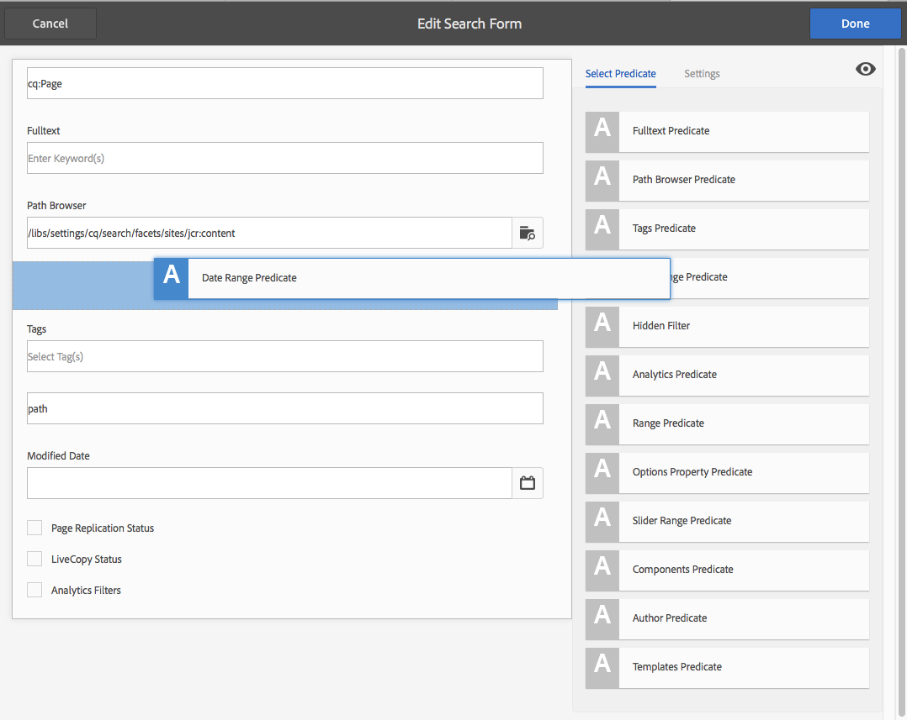

# 검색 양식 구성{#configuring-search-forms}

다양한 AEM 콘솔 및/또는 작성 환경의 패널에서 사용할 수 있는 검색 패널에 사용된 검색 예측자를 선택하려면 **Forms 검색**&#x200B;을 사용합니다. 이러한 패널을 사용자 정의하면 특정 요구 사항에 따라 검색 기능을 사용할 수 있습니다.

[조건자 범위](#predicates-and-their-settings)는 기본적으로 사용할 수 있습니다. 전체 텍스트 검색에 대한 전체 텍스트 설명, 속성 설명, 사용자가 지정한 단일 속성과 일치하는 자산을 검색하도록 속성 설명, 특정 속성에 대해 지정한 하나 이상의 값과 일치하는 자산을 검색하도록 옵션 조건자를 포함하여 여러 개의 조건자를 추가할 수 있습니다.

[다양한 콘솔 및 자산 브라우저(페이지를 편집할 때)에서 사용되는 검색 양식](#configuring-your-search-forms)을 구성할 수 있습니다. 이러한 양식을 구성하기 위한 [대화 상자는 다음을 통해 액세스할 수 있습니다.](#configuring-your-search-forms)

* **도구**

   * **일반**

      * **검색 양식**

이 콘솔에 처음 액세스하면 모든 구성에 자물쇠 기호가 있음을 확인할 수 있습니다. 이는 해당 구성이 기본(즉시 사용) 구성이며 삭제할 수 없음을 나타냅니다. 구성을 사용자 지정했으면 잠금이 사라집니다. [사용자 지정된 구성](#deleting-a-configuration-to-reinstate-the-default)을 삭제하지 않으면 기본(및 자물쇠 표시기)이 복원됩니다.

## 구성 {#configurations}

사용할 수 있는 기본 구성은 다음과 같습니다.

* **페이지 편집기(문서 검색):**

   이 구성은 자산 브라우저에서 문서를 검색할 때(페이지를 편집할 때) 사용할 수 있는 옵션을 정의합니다.

* **페이지 편집기(이미지 검색):**

   이 구성은 자산 브라우저에서 이미지를 검색할 때(페이지를 편집할 때) 사용할 수 있는 옵션을 정의합니다.

* **페이지 편집기(원고 검색):**

   이 구성은 자산 브라우저에서 원고를 검색할 때(페이지를 편집할 때) 사용할 수 있는 옵션을 정의합니다.

* **페이지 편집기(페이지 검색):**

   이 구성은 자산 브라우저에서 페이지를 검색할 때(페이지를 편집할 때) 사용할 수 있는 옵션을 정의합니다.

* **페이지 편집기(단락 검색):**

   이 구성은 자산 브라우저에서 단락을 검색할 때(페이지를 편집할 때) 사용할 수 있는 옵션을 정의합니다.

* **페이지 편집기(제품 검색):**

   이 구성은 자산 브라우저에서 제품을 검색할 때(페이지를 편집할 때) 사용할 수 있는 옵션을 정의합니다.

* **페이지 편집기(Dynamic Media Classic  [이전 Scene7] 검색)**:

   이 구성은 자산 브라우저에서 Scene7 리소스를 검색할 때(페이지를 편집할 때) 사용할 수 있는 옵션을 정의합니다.

* **사이트 관리자 검색 레일**:

   이 구성은 사이트 콘솔의 검색 레일을 사용할 때 사용자가 사용할 수 있는 검색 옵션을 정의합니다.

* **페이지 편집기(비디오 검색):**

   이 구성은 자산 브라우저에서 비디오를 검색할 때(페이지를 편집할 때) 사용할 수 있는 옵션을 정의합니다.

* **자산 관리자 검색 레일:**

   이 구성은 사용자가 자산 콘솔을 사용할 때 사용할 수 있는 검색 옵션을 정의합니다.

* **카탈로그 관리자 검색 레일:**

   이 구성은 사용자가 상거래 카탈로그를 검색할 때 사용할 수 있는 검색 옵션을 정의합니다.

* **주문 관리자 검색 레일:**

   이 구성은 사용자가 상거래 주문을 검색할 때 사용할 수 있는 검색 옵션을 정의합니다.

* **제품 컬렉션 관리자 검색 레일:**

   이 구성은 사용자가 상거래 제품 컬렉션을 검색할 때 사용할 수 있는 검색 옵션을 정의합니다.

* **제품 관리자 검색 레일:**

   이 구성은 사용자가 상거래 제품을 검색할 때 사용할 수 있는 검색 옵션을 정의합니다.

* **프로젝트 관리자 검색 레일:**

   이 구성은 프로젝트를 검색할 때 사용자가 사용할 수 있는 검색 옵션을 정의합니다.

## 예측 및 설정 {#predicates-and-their-settings}

### {#predicates} 예측

구성에 따라 다음 설명을 사용할 수 있습니다.

<table>
 <tbody>
  <tr>
   <th>조건자</th>
   <th>목적</th>
   <th>설정</th>
  </tr>
  <tr>
   <td>분석 </td>
   <td>분석 제공 데이터를 표시할 때 사이트 브라우저의 검색/필터 기능입니다. 분석 검색 필터는 매핑된 사용자 지정 분석 열과 일치하도록 로드됩니다.</td>
   <td>
    <ul>
     <li>필드 레이블</li>
     <li>설명</li>
    </ul> </td>
  </tr>
  <tr>
   <td>마지막으로 수정된 자산 </td>
   <td>자산을 마지막으로 수정한 날짜입니다.  </td>
   <td>날짜 조건자를 기반으로 하는 사용자 지정된 조건자.</td>
  </tr>
  <tr>
   <td>구성 요소 </td>
   <td>작성자가 특정 구성 요소가 있는 페이지를 검색/필터링할 수 있습니다. 예: 이미지 갤러리.  </td>
   <td>
    <ul>
     <li>필드 레이블</li>
     <li>자리 표시자</li>
     <li>속성 이름*</li>
     <li>속성 깊이</li>
     <li>설명</li>
    </ul> </td>
  </tr>
  <tr>
   <td>날짜 </td>
   <td>날짜 속성을 기반으로 한 에셋의 슬라이더 기반 검색.</td>
   <td>
    <ul>
     <li>필드 레이블</li>
     <li>속성 이름*</li>
     <li>설명</li>
    </ul> </td>
  </tr>
  <tr>
   <td>날짜 범위 </td>
   <td>날짜 속성에 대해 지정된 범위 내에서 만들어진 자산을 검색합니다. 검색 패널에서 시작 날짜와 종료 날짜를 지정할 수 있습니다.</td>
   <td>
    <ul>
     <li>필드 레이블</li>
     <li>자리 표시자</li>
     <li>속성 이름*</li>
     <li>범위 텍스트(시작)*</li>
     <li>범위 텍스트(끝)*</li>
     <li>설명</li>
    </ul> </td>
  </tr>
  <tr>
   <td>만료 상태 </td>
   <td>만료 상태를 기반으로 자산을 검색합니다.</td>
   <td>
    <ul>
     <li>필드 레이블</li>
     <li>속성 이름*</li>
     <li>설명</li>
    </ul> </td>
  </tr>
  <tr>
   <td>파일 크기 </td>
   <td>크기를 기반으로 에셋을 검색합니다.</td>
   <td>
    <ul>
     <li>필드 레이블</li>
     <li>속성 이름*</li>
     <li>옵션 경로</li>
     <li>설명</li>
    </ul> </td>
  </tr>
  <tr>
   <td>전체 텍스트 </td>
   <td>전체 텍스트 검색에 대한 검색 조건입니다.</td>
   <td>
    <ul>
     <li>필드 레이블</li>
     <li>자리 표시자</li>
     <li>속성 이름</li>
     <li>설명</li>
    </ul> </td>
  </tr>
  <tr>
   <td>숨겨진 필터</td>
   <td>사용자가 볼 수 없는 속성 및 값에 대한 필터입니다.</td>
   <td>
    <ul>
     <li>속성 이름</li>
     <li>속성 값</li>
     <li>설명</li>
    </ul> </td>
  </tr>
  <tr>
   <td>옵션 </td>
   <td>
옵션은 사용자가 만든 컨텐츠 노드입니다.
 
자세한 내용은 <a href="#addinganoptionspredicate">옵션 설명</a> 추가를 참조하십시오.
 </td>
   <td>
    <ul>
     <li>필드 레이블</li>
     <li>JSON 경로</li>
     <li>속성 이름*</li>
     <li>단일 선택</li>
     <li>옵션 경로</li>
     <li>설명</li>
    </ul> </td>
  </tr>
  <tr>
   <td>옵션 속성 </td>
   <td>옵션 속성을 검색합니다.</td>
   <td>
    <ul>
     <li>필드 레이블</li>
     <li>속성 이름*</li>
     <li>옵션 노드 경로  </li>
     <li>단일 선택</li>
     <li>설명</li>
    </ul> </td>
  </tr>
  <tr>
   <td>페이지 상태 </td>
   <td>상태에 따라 페이지를 검색합니다.</td>
   <td>
    <ul>
     <li>필드 레이블</li>
     <li>속성 이름 게시</li>
     <li>LiveCopy 속성 이름</li>
     <li>설명</li>
    </ul> </td>
  </tr>
  <tr>
   <td>경로 </td>
   <td>특정 경로 아래에 있는 자산을 검색합니다.</td>
   <td>
    <ul>
     <li>필드 레이블</li>
     <li>검색 경로 추가</li>
     <li>설명</li>
    </ul> </td>
  </tr>
  <tr>
   <td>속성 </td>
   <td>지정된 속성을 검색합니다.</td>
   <td>없음</td>
  </tr>
  <tr>
   <td>게시 상태 </td>
   <td>게시 상태를 기반으로 자산 검색</td>
   <td>
    <ul>
     <li>필드 레이블</li>
     <li>속성 이름*</li>
     <li>설명</li>
    </ul> </td>
  </tr>
  <tr>
   <td>범위 </td>
   <td>지정된 범위 내에 있는 리소스를 검색합니다. [검색] 패널에서 범위에 대한 최소 및 최대 값을 지정할 수 있습니다.</td>
   <td>
    <ul>
     <li>필드 레이블</li>
     <li>속성 이름</li>
     <li>설명</li>
    </ul> </td>
  </tr>
  <tr>
   <td>범위 옵션 </td>
   <td>자산에 대한 특정 검색 조건자와 일반적인 슬라이더 조건자와 동일합니다. 이전 호환성 문제로 인해 계속 사용할 수 있습니다.</td>
   <td>
    <ul>
     <li>필드 레이블</li>
     <li>속성 이름*</li>
     <li>옵션 경로</li>
     <li>설명</li>
    </ul> </td>
  </tr>
  <tr>
   <td>등급 </td>
   <td>등급에 따라 자산을 검색합니다.  </td>
   <td>
    <ul>
     <li>필드 레이블</li>
     <li>속성 이름*</li>
     <li>옵션 경로</li>
     <li>설명</li>
    </ul> </td>
  </tr>
  <tr>
   <td>상대적 날짜 </td>
   <td>만든 날짜 기준 자산 검색  </td>
   <td>
    <ul>
     <li>필드 레이블</li>
     <li>속성 이름*</li>
     <li>상대적 날짜</li>
     <li>설명</li>
    </ul> </td>
  </tr>
  <tr>
   <td>슬라이더 범위 </td>
   <td>범위 조건자를 슬라이더 기능으로 확장하는 일반적인 검색 조건자입니다. 검색된 속성의 값은 슬라이더 한도 사이여야 합니다.</td>
   <td>
    <ul>
     <li>필드 레이블</li>
     <li>속성 이름*</li>
     <li>설명</li>
    </ul> </td>
  </tr>
  <tr>
   <td>태그 </td>
   <td>태그를 기반으로 자산 검색 [태그] 목록에서 다양한 태그를 채우도록 경로 속성을 구성할 수 있습니다.</td>
   <td>
    <ul>
     <li>필드 레이블</li>
     <li>속성 이름*</li>
     <li>옵션 경로</li>
     <li>설명</li>
    </ul> </td>
  </tr>
  <tr>
   <td>태그 </td>
   <td>태그를 기반으로 검색</td>
   <td>
    <ul>
     <li>자리 표시자</li>
     <li>속성 이름*</li>
     <li>설명</li>
    </ul> </td>
  </tr>
 </tbody>
</table>

>[!NOTE]
>
>* 일반적인 검색 예측자는 다음과 같이 정의됩니다.
   >  `/libs/cq/gui/components/common/admin/customsearch/searchpredicates`
   >
   >
   >

* siteadmin(클래식 UI)과 관련된 검색 예측자는 다음 위치에 있습니다.
   > `/libs/cq/gui/components/siteadmin/admin/searchpanel/searchpredicates`
   >   * 이러한 이미지는 사용되지 않으며 이전 버전과의 호환성에만 사용할 수 있습니다.

>
>
이 정보는 참조용이므로 `/libs`을 변경할 수 없습니다.

### 설명 설정 {#predicate-settings}

조건자에 따라 선택한 설정을 구성에 사용할 수 있습니다.

* **필드 레이블**

   축소 가능한 헤더 또는 조건자의 필드 레이블로 표시되는 레이블입니다.

* **설명**

   사용자에 대한 설명 세부 사항.

* **자리 표시자**

   필터링 텍스트를 입력하지 않은 경우 빈 텍스트 또는 조건자의 자리 표시자입니다.

* **속성 이름**

   검색할 속성입니다. 상대 경로를 사용하고 와일드카드 `*/*/*`는 `jcr:content` 노드를 기준으로 속성의 깊이를 지정합니다(각 별표는 하나의 노드 수준을 나타냅니다).

   `jcr:content` 노드에 `x` 속성이 있는 리소스의 첫 번째 수준 하위 노드에서만 검색하려면 `*/jcr:content/x`

* **속성 깊이**

   리소스 내에서 해당 속성을 검색할 최대 깊이입니다. 따라서 하위 수준이 지정된 깊이와 같을 때까지 리소스 및 재귀적 자식에 대해 해당 속성을 검색할 수 있습니다.

* **속성 값**

   속성 값을 절대 문자열 또는 표현식 언어로 사용합니다.예를 들어 `cq:Page` 또는

   `${empty requestPathInfo.suffix ? "/content" : requestPathInfo.suffix}`.

* **범위 텍스트**

   **날짜 범위** 조건자에 있는 범위 필드의 레이블입니다.

* **옵션 경로**

   조건자 설정 탭에서 경로 브라우저를 사용하여 경로를 선택할 수 있습니다. **+** 아이콘을 선택한 후 선택 항목을 유효한 옵션 목록에 추가합니다(필요한 경우 제거할 **-** 아이콘).

   옵션은 다음 구조를 갖는 사용자가 만든 컨텐츠 노드입니다.

   `(jcr:primaryType = nt:unstructured, value (String), jcr:title (String))`

* **옵션 노드**
경로 
**옵션 경로**. 공통 설명 필드에만 있고 다른 설명 필드는 자산에 따라 다릅니다.

* **단일**
선택이 확인란을 선택하면 옵션이 하나의 선택만 허용하는 확인란으로 렌더링됩니다. 실수로 선택한 경우 확인란을 선택 취소할 수 있습니다.

* **게시 및 Live Copy 속성 이름**
사이트 특정 술어에 대한 게시 및 Live Copy 확인란의 레이블입니다.

* 승_The &amp;ast;**설정** 탭의 필드 레이블에는 필드가 필수이며 비워 두면 오류 메시지가 표시됩니다.

## 검색 Forms {#configuring-your-search-forms} 구성

### 사용자 지정된 구성 {#creating-opening-a-customized-configuration} 만들기/열기

1. **도구**, **작업**, **Forms 검색**&#x200B;으로 이동합니다.

1. 사용자 정의할 구성을 선택합니다.
1. **편집** 아이콘을 사용하여 업데이트를 위한 구성을 엽니다.
1. 새 사용자 지정이 필요한 경우 [새 설명 필드를 추가하고 설정](#add-edit-a-predicate-field-and-define-field-settings)을 필요에 따라 정의할 수 있습니다. 기존 사용자 지정이 있는 경우 기존 필드를 선택하고 [설정](#add-edit-a-predicate-field-and-define-field-settings)을 업데이트할 수 있습니다.
1. **완료**&#x200B;를 선택하여 구성을 저장합니다.

   >[!NOTE]
   >
   >사용자 지정된 구성은 다음 아래에(적절히) 저장됩니다.
   >
   >* `/apps/cq/gui/content/facets/<option>`
   >* `/apps/commerce/gui/content/facets/<option>`

### 설명 필드 추가/편집 및 필드 설정 정의 {#add-edit-a-predicate-field-and-define-field-settings}

필드를 추가하거나 편집하고 설정을 정의/업데이트할 수 있습니다.

1. [업데이트할 사용자 지정된 ](#creating-opening-a-customized-configuration) 구성을 엽니다.
1. 새 필드를 추가하려면 **설명 선택** 탭을 열고 필요한 조건자를 필요한 위치로 드래그합니다. 예를 들어 **날짜 범위 설명**:

   

1. 다음 항목에 따라 달라집니다.

   * 새 필드를 추가하고 있습니다.

      조건자를 추가하면 **설정** 탭이 열리고 정의할 수 있는 속성이 표시됩니다.

   * 기존 조건자를 업데이트하려는 경우:

      오른쪽에 있는 설명 필드를 선택한 다음 **설정** 탭을 엽니다.
   예를 들어 **날짜 범위 설명**&#x200B;에 대한 설정:

   

1. 필요에 따라 변경하고 **완료**&#x200B;로 확인합니다.

### 검색 구성 미리 보기 {#previewing-the-search-configuration}

1. 미리 보기 아이콘을 선택합니다.

   

1. 그러면 해당 콘솔의 검색 열에 표시될 검색 양식이 표시됩니다(완전히 확장됨).

   

1. **미리** 보기를 닫아서 구성을 다시 시작하고 완료합니다.

### 설명 필드 삭제 {#deleting-a-predicate-field}

1. [업데이트할 사용자 지정된 ](#creating-opening-a-customized-configuration) 구성을 엽니다.
1. 설명 필드(오른쪽)를 선택하고 **설정** 탭을 연 다음 **삭제** 아이콘(왼쪽 아래)을 선택합니다.

   

1. 대화 상자가 삭제 작업의 확인을 요청합니다.

1. **Done**&#x200B;으로 이 내용과 다른 변경 사항을 확인합니다.

### 구성 삭제(기본값 복원) {#deleting-a-configuration-to-reinstate-the-default}

구성을 사용자 지정했으면 기본값이 무시됩니다. 사용자 지정된 구성을 삭제하여 기본 구성을 다시 지정할 수 있습니다.

>[!NOTE]
>
>기본 구성 중 하나를 삭제할 수 없습니다.

사용자 지정된 구성 삭제는 콘솔에서 수행됩니다.

1. 필요한 구성(예: **페이지 편집기(단락 검색)**)을 선택한 다음 도구 모음에서 **삭제** 아이콘을 선택합니다.

   

1. 사용자 지정된 구성이 삭제되고 기본 복원됩니다(콘솔에서 자물쇠 기호가 다시 표시되는 경우).

### 옵션 추가 시 {#adding-options-predicates} 예측

옵션 설명(옵션, 옵션 속성)을 사용하여 검색할 항목을 구성할 수 있습니다. 일반적으로 페이지에서 바로 검색할 때 사용됩니다.예를 들어 페이지 노드의 속성입니다.

다음 예제(페이지를 만드는 데 사용된 템플릿에 따라 검색하기)에서는 관련 단계를 보여 줍니다.

1. 검색할 속성을 정의하는 노드를 만듭니다.

   사용자가 사용할 수 있도록 개별 옵션에 대한 정의를 포함하는 루트 노드가 필요합니다.

   개별 옵션에 대한 노드에는 속성이 필요합니다.

   * `jcr:title` - 검색 레일에 표시할 필드 레이블
   * `value` - 검색할 속성 값

   

   >[!NOTE]
   >
   >***은(는) `/libs` 경로에서 아무 것도 변경하지 않아야 합니다.***
   >
   >이는 다음 번에 인스턴스를 업그레이드할 때 `/libs`의 콘텐트가 덮어쓰기되기 때문입니다(핫픽스 또는 기능 팩을 적용할 때 덮어쓰여질 수 있음).
   >
   >구성 및 기타 변경 사항에 대한 권장 방법은 다음과 같습니다.
   >
   >1. 필요한 항목은 `/libs`의 `/apps` 아래에 있으므로 다시 만듭니다. 이 경우:
   >1. `/libs/cq/gui/content/common/options/predicates`
   >1. `/apps.` 내에서 변경

1. **Forms 검색** 콘솔을 열고 업데이트할 구성을 선택합니다. 예: **사이트 관리자 검색 레일**.

   그런 다음 **검색 양식 편집** 아이콘을 클릭/탭합니다.

1. 구성에 따라 구성에 **Options** 또는 **Options 속성**&#x200B;을 추가합니다.
1. 특히 필드를 업데이트합니다.

   * **속성 이름**

      대상 노드에서 검색할 노드 속성에 대해 지정합니다. 예:

      `jcr:content/cq:template`

   * **옵션 노드 경로**

      옵션을 저장할 경로를 선택합니다. 예:

      `/apps/cq/gui/content/common/options/predicates/templatetype`
   

1. **완료**&#x200B;를 선택하여 구성을 저장합니다.
1. 적절한 콘솔(이 예: **사이트**)로 이동하고 **검색** 레일을 엽니다. 새로 정의된 검색 양식과 다양한 옵션이 표시됩니다. 필요한 옵션을 선택하여 검색 결과를 확인합니다.

   

## 사용자 권한 {#user-permissions}

다음 표에는 검색 양식에 대한 편집, 삭제 및 미리 보기 작업을 수행하는 데 필요한 권한이 나와 있습니다.

<table>
 <tbody>
  <tr>
   <td><strong>작업</strong></td>
   <td><strong>권한</strong></td>
  </tr>
  <tr>
   <td>편집 </td>
   <td><code>/apps </code>노드에 대한 읽기, 쓰기 권한을 참조하십시오.</td>
  </tr>
  <tr>
   <td>삭제</td>
   <td><code>/apps</code> 노드에서 읽기, 쓰기, 삭제 권한</td>
  </tr>
  <tr>
   <td>미리 보기</td>
   <td><code>/var/dam/content</code> 노드에서 읽기, 쓰기, 삭제 권한을 참조하십시오.  노드에서 읽기, 쓰기 권한을  <code>/apps</code> 지정합니다.</td>
  </tr>
 </tbody>
</table>

