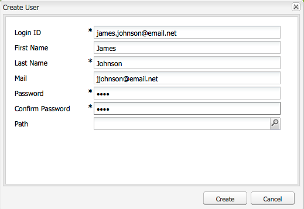
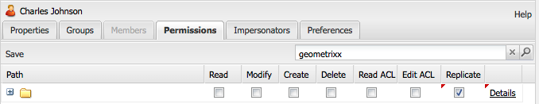

# 사용자 관리 및 보안{#user-administration-and-security}

이 장에서는 사용자 인증을 구성하고 유지 관리하는 방법에 대해 설명하고 AEM에서 인증 및 인증이 작동하는 방식에 대한 이론을 설명합니다.

## AEM의 사용자 및 그룹 {#users-and-groups-in-aem}

이 섹션에서는 사용자 관리 개념을 쉽게 유지 관리할 수 있도록 지원하기 위해 다양한 개체 및 관련 개념을 자세히 설명합니다.

### 사용자 {#users}

사용자는 자신의 계정으로 AEM에 로그인합니다. 각 사용자 계정은 고유하며 기본 계정 세부 정보와 할당된 권한을 보유합니다.

사용자는 이러한 권한 및/또는 권한에 대한 할당을 단순화하는 그룹의 구성원인 경우가 많습니다.

### 그룹 {#groups}

그룹은 사용자 및/또는 기타 그룹의 컬렉션입니다.이 모두가 그룹의 구성원이라고 합니다.

그룹의 주요 목적은 그룹의 모든 구성원에 변경 사항이 적용되므로 업데이트할 개체 수를 줄여 유지 관리 프로세스를 단순화하는 것입니다. 그룹은 종종 다음을 반영합니다.

* 애플리케이션 내 역할예를 들어, 컨텐츠를 서핑할 수 있는 사람 또는 컨텐츠를 제공할 수 있는 사람 등
* 귀하의 조직컨텐츠 트리의 다른 분기로 제한된 경우 다른 부서의 기여자를 구분하기 위해 역할을 확장할 수 있습니다.

따라서 그룹들은 안정된 상태를 유지하는 경향이 있는 반면, 사용자들은 점점 더 자주 찾아갑니다.

계획 및 깔끔한 구조를 통해 그룹을 사용하면 구조를 반영할 수 있으므로 명확한 개요와 업데이트를 위한 효율적인 메커니즘을 제공할 수 있습니다.

### Built-in Users and Groups {#built-in-users-and-groups}

AEM WCM은 많은 사용자 및 그룹을 설치합니다. 설치 후 보안 콘솔에 처음 액세스할 때 표시됩니다.

다음 표에는 각 항목이 함께 나열됩니다.

* 짧은 설명
* 필요한 변경에 대한 권장 사항

*특정 상황에서 계정 자체를 삭제하지 않는 경우 모든 기본 암호를* 변경하십시오.

<table>
 <tbody>
  <tr>
   <td>사용자 ID</td>
   <td>유형</td>
   <td>설명</td>
   <td>추천</td>
  </tr>
  <tr>
   <td>
admin
 
기본 암호:admin
 </td>
   <td>사용자</td>
   <td>
전체 액세스 권한이 있는 시스템 관리 계정
 
이 계정은 AEM WCM과 CRX 사이의 연결에 사용됩니다.
 
이 계정을 실수로 삭제하면 저장소가 다시 시작될 때(기본 설정에서) 다시 만들어집니다.
 
관리자 계정은 AEM 플랫폼의 요구 사항입니다. 따라서 이 계정은 삭제할 수 없습니다.
 </td>
   <td>
Adobe에서는 이 사용자 계정의 암호를 기본값에서 변경하는 것이 좋습니다.
 
설치 시 가능하지만 나중에 가능합니다.
 
참고:이 계정은 CQ Servlet Engine의 관리 계정과 혼동되지 않습니다.
 </td>
  </tr>
  <tr>
   <td>
익명
 
 
 </td>
   <td>사용자</td>
   <td>
인스턴스에 대한 인증되지 않은 액세스에 대한 기본 권한을 보유합니다. 기본적으로 최소 액세스 권한이 있습니다.
 
이 계정을 실수로 삭제한 경우 시작할 때 다시 만들어집니다. 영구적으로 삭제할 수는 없지만 비활성화할 수 있습니다.
 </td>
   <td>이 계정은 작성 인스턴스 기능에 부정적인 영향을 주므로 삭제 또는 비활성화하지 마십시오. 삭제를 요구하는 보안 요구 사항이 있는 경우 먼저 시스템에 미치는 영향을 제대로 테스트해야 합니다.</td>
  </tr>
  <tr>
   <td>
작성자
 
기본 암호:author
 </td>
   <td>사용자</td>
   <td>
작성자 계정은 /content에 쓸 수 있습니다. 기고자 및 서퍼 권한을 포괄합니다.
 
전체 /content 트리에 액세스할 수 있으므로 웹 마스터로 사용할 수 있습니다.
 
이 사용자는 기본 제공 사용자가 아니라 다른 geometrixx 데모 사용자입니다.
 </td>
   <td>
계정이 완전히 삭제되거나 암호가 기본값에서 변경되는 것이 좋습니다.
 
설치 시 가능하지만 나중에 가능합니다.
 </td>
  </tr>
  <tr>
   <td>관리자</td>
   <td>그룹</td>
   <td>
모든 구성원에게 관리자 권한을 부여하는 그룹입니다. 관리자만 이 그룹을 편집할 수 있습니다.
 
모든 액세스 권한이 있습니다.
 </td>
   <td>노드에 '거부-모든 사람'을 설정하는 경우 관리자는 해당 그룹에 대해 다시 활성화된 경우에만 액세스할 수 있습니다.</td>
  </tr>
  <tr>
   <td>컨텐츠 작성자</td>
   <td>그룹</td>
   <td>
컨텐츠 편집을 담당하는 그룹 읽기, 수정, 만들기 및 삭제 권한이 필요합니다.
 </td>
   <td>읽기, 수정, 만들기 및 삭제 권한을 추가하는 경우 프로젝트별 액세스 권한을 사용하여 고유한 컨텐츠 작성자 그룹을 만들 수 있습니다.</td>
  </tr>
  <tr>
   <td>contributor</td>
   <td>그룹</td>
   <td>
사용자가 컨텐츠를 작성할 수 있는 기본 권한(기능에만 해당).
 
/content 트리에 권한을 할당하지 않습니다. 이러한 권한은 개별 그룹 또는 사용자에 대해 구체적으로 할당되어야 합니다.
 </td>
   <td> </td>
  </tr>
  <tr>
   <td>dam-users</td>
   <td>그룹</td>
   <td>일반적인 AEM 자산 사용자를 위한 기본 참조 그룹입니다. 이 그룹의 구성원은 자산 및 컬렉션의 업로드/공유를 활성화할 수 있는 적절한 권한이 있습니다.</td>
   <td> </td>
  </tr>
  <tr>
   <td>everyone</td>
   <td>그룹</td>
   <td>
모든 도구에서 그룹 또는 구성원 관계가 표시되지 않을 수 있지만 AEM의 모든 사용자는 모든 그룹의 구성원입니다.
 
이 그룹은 모든 사용자, 나중에 만들 사용자에 대한 권한을 적용하는 데 사용할 수 있으므로 기본 권한으로 생각할 수 있습니다.
 </td>
   <td>
이 그룹을 수정하거나 삭제하지 마십시오.
 
이 계정을 수정하면 보안 관련 추가 사항이 있습니다.
 </td>
  </tr>
  <tr>
   <td>tag-administrators</td>
   <td>그룹</td>
   <td>태그를 편집할 수 있는 그룹입니다.</td>
   <td> </td>
  </tr>
  <tr>
   <td>사용자 관리자</td>
   <td>그룹</td>
   <td>사용자 관리, 즉 사용자 및 그룹을 만들 수 있는 권한을 부여합니다.</td>
   <td> </td>
  </tr>
  <tr>
   <td>workflow-editors</td>
   <td>그룹</td>
   <td>워크플로우 모델을 만들고 수정할 수 있는 그룹입니다.</td>
   <td> </td>
  </tr>
  <tr>
   <td>workflow-users</td>
   <td>그룹</td>
   <td>
워크플로우에 참여하는 사용자는 그룹 워크플로우 사용자의 구성원이어야 합니다. 이렇게 하면 다음과 같은 작업을 수행할 수 있습니다.워크플로우 인스턴스를 업데이트할 수 있도록 /etc/workflow/instances.
 
이 그룹은 표준 설치에 포함되어 있지만 사용자를 그룹에 수동으로 추가해야 합니다.
 </td>
  </tr>
 </tbody>
</table>

## AEM의 권한 {#permissions-in-aem}

AEM에서는 ACL을 사용하여 사용자나 그룹이 수행할 수 있는 작업과 이러한 작업을 수행할 수 있는 위치를 결정합니다.

### 권한 및 ACL {#permissions-and-acls}

권한은 자원에 대해 어떤 작업을 수행할 수 있는 사람을 정의합니다. 권한은 [액세스 제어](#access-control-lists-and-how-they-are-evaluated) 평가의 결과입니다.

개별 AEM [작업의](security.md#actions)확인란을 선택하거나 취소하여 해당 사용자에게 부여되거나 거부된 권한을 변경할 수 있습니다. 확인 표시는 작업이 허용됨을 나타냅니다. 확인 표시가 없으면 작업이 거부되었음을 나타냅니다.

그리드에 확인 표시가 있는 위치는 사용자가 AEM 내의 어떤 위치(즉, 어떤 경로)에서 어떤 권한을 가지고 있는지를 나타냅니다.

### 작업 {#actions}

페이지(리소스)에서 작업을 수행할 수 있습니다. 계층의 각 페이지에 대해 사용자가 해당 페이지에서 수행할 수 있는 작업을 지정할 수 있습니다. [권한을](#permissions-and-acls) 사용하면 작업을 허용하거나 거부할 수 있습니다.

<table>
 <tbody>
  <tr>
   <td><strong>작업 </strong></td>
   <td><strong>설명 </strong></td>
  </tr>
  <tr>
   <td>읽기</td>
   <td>사용자는 페이지와 모든 하위 페이지를 읽을 수 있습니다.</td>
  </tr>
  <tr>
   <td>수정</td>
   <td>
사용자는 다음을 수행할 수 있습니다.

    <ul>
     <li>페이지와 모든 하위 페이지에서 기존 컨텐츠를 수정합니다.</li>
     <li>페이지 또는 하위 페이지에서 새 단락을 만듭니다.</li>
    </ul> 
JCR 수준에서 사용자는 속성을 수정, 잠금, 버전 관리, nt-modification을 통해 리소스를 수정할 수 있으며, jcr:content 하위 노드(예: cq:Page, nt:file, cq:Asset)를 정의하는 노드에 대한 전체 쓰기 권한이 있습니다.
 </td>
  </tr>
  <tr>
   <td>만들기</td>
   <td>
사용자는 다음을 수행할 수 있습니다.

    <ul>
     <li>새 페이지 또는 하위 페이지를 만듭니다.</li>
    </ul> 
수정 <strong>작업이</strong> 거부되면 jcr:content 및 그 하위 노드의 만들기가 페이지 수정으로 간주되므로 아래의 하위 트리가 구체적으로 제외됩니다. jcr:content 하위 노드를 정의하는 노드에만 적용됩니다.
 </td>
  </tr>
  <tr>
   <td>삭제</td>
   <td>
사용자는 다음을 수행할 수 있습니다.

    <ul>
     <li>페이지 또는 하위 페이지에서 기존 단락을 삭제합니다.</li>
     <li>페이지 또는 하위 페이지를 삭제합니다.</li>
    </ul> 
jcr:content 아래의 하위 트리가 <strong>수정되지</strong> 않으면 jcr:content 제거로 내용이 구체적으로 제외되고 하위 노드는 페이지 수정으로 간주됩니다. jcr:content 하위 노드를 정의하는 노드에만 적용됩니다.
 </td>
  </tr>
  <tr>
   <td>ACL 읽기</td>
   <td>사용자는 페이지 또는 하위 페이지의 액세스 제어 목록을 읽을 수 있습니다.</td>
  </tr>
  <tr>
   <td>ACL 편집</td>
   <td>사용자는 페이지 또는 하위 페이지의 액세스 제어 목록을 수정할 수 있습니다.</td>
  </tr>
  <tr>
   <td>복제</td>
   <td>사용자는 컨텐츠를 다른 환경(예: 게시 환경)에 복제할 수 있습니다. 권한은 모든 하위 페이지에도 적용됩니다.</td>
  </tr>
 </tbody>
</table>

>[!NOTE]
>
>AEM은 컬렉션에서 역할 할당(소유자, 편집기, 뷰어)을 위한 사용자 그룹을 자동으로 [생성합니다](/help/assets/managing-collections-touch-ui.md). 그러나 이러한 그룹에 대해 ACL을 수동으로 추가하면 AEM 내에서 보안 취약점이 발생할 수 있습니다. ACL을 수동으로 추가하지 않는 것이 좋습니다.

### 액세스 제어 목록 및 평가 방법 {#access-control-lists-and-how-they-are-evaluated}

AEM WCM은 ACL(액세스 제어 목록)을 사용하여 다양한 페이지에 적용되는 권한을 구성합니다.

액세스 제어 목록은 개별 권한으로 구성되며 이러한 권한이 실제로 적용되는 순서를 결정하는 데 사용됩니다. 목록은 고려 중인 페이지의 계층에 따라 구성됩니다. 그런 다음 페이지에 적용할 수 있는 첫 번째 권한이 발견될 때까지 이 목록을 스캔합니다.

>[!NOTE]
>
>샘플에 포함된 ACL이 있습니다. 응용 프로그램에 적합한 항목을 검토하고 결정하는 것이 좋습니다. 포함된 ACL을 검토하려면 **CRXDE **로 이동하여 **다음 노드의 액세스 제어** 탭을 선택합니다.
>
>`/etc/cloudservices/facebookconnect/geometrixx-outdoorsfacebookapp`:누구나 읽을 수 있습니다.
>`/etc/cloudservices/twitterconnect/geometrixx-outdoors-twitter-app`:누구나 읽을 수 있습니다.
>`/home/users/geometrixx-outdoors`:모든 사용자가 `*/profile*` 및
>`*/social/relationships/following/*`.
>
>사용자 정의 응용 프로그램은 `*/social/relationships/friend/*` 또는 `*/social/relationships/pending-following/*`같은 다른 관계에 대한 액세스를 설정할 수 있습니다.
>
>커뮤니티별 ACL을 만들면 해당 커뮤니티에 참여하는 구성원에게 추가 권한이 부여될 수 있습니다. 예를 들어, 사용자가 `/content/geometrixx-outdoors/en/community/hiking` 또는 에서 커뮤니티에 가입할 때 이 경우가 `/content/geometrixx-outdoors/en/community/winter-sports`해당될 수 있습니다.

### 권한 상태 {#permission-states}

>[!NOTE]
>
>CQ 5.3 사용자의 경우:
>
>이전 CQ 버전과 달리 사용자가 페이지를 수정해야 하는 경우 **만들기** 및 **삭제를** 더 이상 부여하지 않습니다. 대신, 사용자가 기존 페이지에서 구성 요소를 생성, 수정 또는 삭제할 수 있도록 하려는 경우에만 **수정** 작업을 부여합니다.
>
>이전 버전과의 호환성을 위해 작업 테스트는 **jcr:content** 정의 노드에 대한 특별한 처리를 고려하지 않습니다.

| **작업** | **설명** |
|---|---|
| 허용(확인 표시) | AEM WCM을 사용하면 이 페이지 또는 하위 페이지에서 작업을 수행할 수 있습니다. |
| 거부(확인 표시 없음) | AEM WCM에서는 사용자가 이 페이지나 하위 페이지에서 작업을 수행할 수 없습니다. |

권한은 모든 하위 페이지에도 적용됩니다.

사용 권한이 부모 노드에서 상속되지 않지만 하나 이상의 로컬 항목이 있는 경우 다음 기호가 체크 상자에 추가됩니다. 로컬 항목은 CRX 2.2 인터페이스에서 생성된 항목입니다(와일드카드 ACL은 현재 CRX에서만 만들 수 있습니다.)

지정된 경로에서 작업을 하려면:

<table>
 <tbody>
  <tr>
   <td>* (별표)</td>
   <td>하나 이상의 로컬 항목이 있습니다(효과적이거나 비효과적). 이러한 와일드카드 ACL은 CRX에 정의되어 있습니다.</td>
  </tr>
  <tr>
   <td>! (느낌표)</td>
   <td>현재 효과가 없는 항목이 하나 이상 있습니다.</td>
  </tr>
 </tbody>
</table>

별표 또는 느낌표 위로 마우스를 가져가면 선언된 항목에 대한 자세한 내용이 도구 설명에 표시됩니다. 도구 설명은 다음 두 부분으로 분할됩니다.

<table>
 <tbody>
  <tr>
   <td>윗부분</td>
   <td>
유효 입력사항을 나열합니다.
 </td>
  </tr>
  <tr>
   <td>하단 부분</td>
   <td>트리의 다른 위치에 영향을 줄 수 있는 비유효 항목을 나열합니다(해당 ACE가 항목 범위를 제한하는 특수 속성으로 표시됨). 또는 해당 경로 또는 조상 노드에 정의된 다른 항목에 의해 효과가 취소된 항목입니다.</td>
  </tr>
 </tbody>
</table>

>[!NOTE]
>
>페이지에 대한 권한이 정의되지 않은 경우 모든 작업이 거부됩니다.

다음은 액세스 제어 목록 관리에 대한 권장 사항입니다.

* 사용자에게 직접 권한을 할당하지 마십시오. 그룹에만 할당합니다.

   이렇게 하면 그룹 수가 사용자 수보다 훨씬 작고 불안정성이 덜하므로 유지 관리가 간소화됩니다.

* 그룹/사용자가 페이지를 수정할 수만 있도록 하려면, 페이지 만들기 또는 거부 권한을 부여하지 마십시오. 수정 및 읽기 권한만 부여합니다.
* [거부]를 간단하게 사용하십시오. 가능한 한 허용만 사용하십시오.

   [거부]를 사용하면 권한이 예상한 순서와 다른 순서로 적용되는 경우 예기치 않은 결과가 발생할 수 있습니다. 사용자가 둘 이상의 그룹에 속한 경우 한 그룹의 Deny 문이 다른 그룹의 Allow 문을 취소하거나 그 반대로 취소할 수 있습니다. 이러한 경우 개요를 유지하는 것이 어렵고 예기치 않은 결과가 발생할 수 있지만 할당 허용으로 인해 이러한 충돌이 발생하지 않습니다.

   Adobe에서는 우수 사례를 거부하기 보다는 허용으로 작업하는 것이 [좋습니다](#best-practices).

사용 권한을 수정하기 전에 사용 방법과 상호 관계를 이해해야 합니다. AEM WCM이 액세스 권한 [및 액세스 제어 목록 설정에 대한 예제를](/help/sites-administering/user-group-ac-admin.md#how-access-rights-are-evaluated) 평가하는 방법을 설명하는 CRX 설명서를 참조하십시오.

### 권한 {#permissions}

권한은 사용자와 그룹이 AEM 페이지의 AEM 기능에 액세스할 수 있도록 합니다.

노드를 확장/축소하여 경로별로 권한을 탐색하고 권한 상속을 루트 노드까지 추적할 수 있습니다.

적절한 확인란을 선택하거나 취소하여 권한을 허용하거나 거부합니다.

### 자세한 권한 정보 보기 {#viewing-detailed-permission-information}

격자 보기와 함께 AEM에서는 지정된 경로에서 선택한 사용자/그룹에 대한 권한에 대한 자세한 보기를 제공합니다. 세부 사항 보기에서는 추가 정보를 제공합니다.

정보를 보는 것 외에도, 현재 사용자나 그룹을 그룹에서 포함하거나 제외할 수도 있습니다. 권한 [추가 시 사용자 또는 그룹 추가를 참조하십시오](#adding-users-or-groups-while-adding-permissions). 여기에서 변경한 내용은 세부 보기의 상단 부분에 즉시 반영됩니다.

세부 사항 보기에 액세스하려면 권한 **탭에서** 선택한 **그룹** /사용자 및 경로에 대한 세부정보를 클릭합니다.

세부 사항은 다음 두 부분으로 분할됩니다.

<table>
 <tbody>
  <tr>
   <td>윗부분</td>
   <td>
트리 격자에 표시되는 정보를 반복합니다. 각 작업에 대해 작업이 허용되는지 또는 거부되는지 여부를 나타내는 아이콘이 표시됩니다.

    <ul>
     <li>아이콘 = 선언된 항목 없음</li>
     <li>(tick) = 선언된 작업(허용)</li>
     <li>(-) = 선언된 작업(거부)</li>
    </ul> </td>
  </tr>
  <tr>
   <td>하단 부분</td>
   <td>
다음을 수행하는 사용자 및 그룹 그리드를 표시합니다.

    <ul>
     <li>지정된 경로 AND에 대한 항목을 선언합니다.</li>
     <li>지정된 승인 가능 OR이 그룹입니까?</li>
    </ul> </td>
  </tr>
 </tbody>
</table>

### 다른 사용자 사칭 {#impersonating-another-user}

With the [Impersonate functionality](/help/sites-authoring/user-properties.md#user-settings) a user can work on behalf of another user.

즉, 사용자 계정은 자신의 계정으로 작동할 수 있는 다른 계정을 지정할 수 있습니다. 즉, user-B가 user-A를 가장할 수 있는 경우 user-B는 사용자-A의 전체 계정 세부 정보를 사용하여 작업을 수행할 수 있습니다.

이렇게 하면 가장하는 계정을 사용하는 것처럼 가장자 계정이 작업을 완료할 수 있습니다.예를 들어, 부재 중 또는 과도한 로드 단기간 동안 공유하는 경우

>[!NOTE]
>
>관리자가 아닌 사용자에 대해 가장하여 작업하려면, 가장자(위의 경우 user-B)가 `/home/users` 경로에 READ 권한이 있어야 합니다.
>
>이를 수행하는 방법에 대한 자세한 내용은 AEM의 [권한을 참조하십시오](/help/sites-administering/security.md#permissions-in-aem).

>[!CAUTION]
>
>한 계정이 다른 계정으로 가장하는 경우 보기가 매우 어렵습니다. 가장이 시작되고 종료될 때 감사 로그에 항목이 생성되지만 액세스 로그와 같은 다른 로그 파일에는 이벤트에서 가장이 발생했다는 사실에 대한 정보가 없습니다. 따라서 사용자-B가 사용자-A를 가장하는 경우 모든 이벤트는 사용자-A가 개인적으로 수행한 것처럼 보입니다.

>[!CAUTION]
>
>사용자를 가장할 때 페이지 잠금이 수행될 수 있습니다. 그러나 이 방법으로 잠긴 페이지는 가장된 사용자나 관리자 권한이 있는 사용자만 잠금을 해제할 수 있습니다.
>
>페이지를 잠근 사용자를 가장하는 것으로는 페이지 잠금을 해제할 수 없습니다.

### 우수 사례 {#best-practices}

다음은 권한 및 권한을 사용하여 작업할 때의 우수 사례에 대해 설명합니다.

| 규칙 | 이유 |
|--- |--- |
| *그룹 사용* | 사용자별로 액세스 권한을 할당하지 마십시오. 다음과 같은 몇 가지 이유가 있습니다.<ul><li>그룹보다 사용자가 많으므로 그룹은 구조를 단순화합니다.</li><li>그룹은 모든 계정에 대한 개요를 제공합니다.</li> <li>그룹은 상속이 간단합니다.</li><li>사용자가 어디에서나 그룹은 장기적입니다.</li></ul> |
| *Be Positive* | 항상 Allow 문을 사용하여 그룹의 권한을 지정합니다(가능한 경우). Deny 문을 사용하지 마십시오. 그룹은 순서대로 평가되며, 순서는 사용자별로 다르게 정의될 수 있습니다. 즉,명령문이 구현되고 평가되는 순서를 거의 제어할 수 없습니다. Allow 문만 사용하는 경우 주문은 문제가 되지 않습니다. |
| *간편한 관리* | 새 설치를 구성할 때 시간과 비용을 투자하면 충분한 보상을 받을 수 있을 것입니다. 명확한 구조를 적용하면 지속적인 유지 관리 및 관리를 간소화할 수 있으므로 현 동료 및/또는 미래의 후계자가 구현 중인 내용을 쉽게 이해할 수 있습니다. |
| *테스트* | 테스트 설치를 사용하여 여러 사용자와 그룹 간의 관계를 파악하고 이를 실행할 수 있습니다. |
| *기본 사용자/그룹* | 보안 문제를 방지하기 위해 항상 설치 즉시 기본 사용자 및 그룹을 업데이트하십시오. |

## Managing Users and Groups {#managing-users-and-groups}

사용자는 시스템에 대한 요청을 수행하는 시스템과 외부 시스템을 사용하는 사람을 포함합니다.

그룹은 사용자 세트입니다.

둘 다 보안 콘솔 내에서 사용자 관리 기능을 사용하여 구성할 수 있습니다.

### 보안 콘솔을 사용하여 사용자 관리 액세스 {#accessing-user-administration-with-the-security-console}

보안 콘솔을 사용하여 모든 사용자, 그룹 및 연관된 권한에 액세스합니다. 이 섹션에 설명된 모든 절차는 이 창에서 수행됩니다.

AEM WCM 보안에 액세스하려면 다음 중 하나를 수행합니다.

* AEM의 시작 화면 또는 다양한 위치에서 보안 아이콘을 클릭합니다.

* 로 바로 `https://<server>:<port>/useradmin`이동합니다. AEM에 관리자로 로그인해야 합니다.

다음 창이 표시됩니다.

왼쪽 트리에는 현재 시스템에 있는 모든 사용자 및 그룹이 나열됩니다. 표시할 열을 선택하고 열의 내용을 정렬하며 열 머리글을 새 위치로 드래그하여 열 표시 순서를 변경할 수도 있습니다.

탭에서는 다양한 구성에 액세스할 수 있습니다.

<!-- ??? in table below. -->

| 탭 | 설명 |
|--- |--- |
| 필터 상자 | 나열된 사용자 및/또는 그룹을 필터링하는 메커니즘입니다. 사용자 [및 그룹 필터링을 참조하십시오](#filtering-users-and-groups). |
| 사용자 숨김 | 나열된 모든 사용자를 숨겨 그룹만 남기는 전환 스위치입니다. 사용자 [및 그룹 숨기기를 참조하십시오](#hiding-users-and-groups). |
| 그룹 숨기기 | 나열된 모든 그룹을 숨겨 사용자만 남게 하는 전환 스위치입니다. 사용자 [및 그룹 숨기기를 참조하십시오](#hiding-users-and-groups). |
| 편집 | 사용자 또는 그룹을 만들고 삭제할 수 있는 메뉴입니다. 사용자 [및 그룹 만들기](#creating-users-and-groups) 및 사용자 및 [그룹 삭제를 참조하십시오](#deleting-users-and-groups). |
| 속성 | 이메일 정보, 설명 및 이름 정보를 포함할 수 있는 사용자 또는 그룹에 대한 정보를 나열합니다. 사용자의 암호를 변경할 수도 있습니다. 사용자 [및 그룹](#creating-users-and-groups)만들기, [사용자 및 그룹 속성](#modifying-user-and-group-properties) 수정 [및 사용자](#changing-a-user-password)암호 변경을 참조하십시오. |
| 그룹 | 선택한 사용자나 그룹이 속한 모든 그룹을 나열합니다. 선택한 사용자나 그룹을 추가 그룹에 할당하거나 그룹에서 제거할 수 있습니다. 그룹을 [참조하십시오](#adding-users-or-groups-to-a-group). |
| 구성원 | 그룹에만 사용할 수 있습니다. 특정 그룹의 구성원을 나열합니다. 구성원을 [참조하십시오](#members-adding-users-or-groups-to-a-group). |
| 권한 | 사용자 또는 그룹에 권한을 할당할 수 있습니다. 다음을 제어할 수 있습니다.<ul><li>특정 페이지/노드와 관련된 권한 권한 [설정을 참조하십시오](#setting-permissions). </li><li>페이지 만들기 및 삭제 및 계층 수정과 관련된 권한?페이지를 만들고 삭제할 수 있는 계층 수정과 같은 권한을 [할당할](#settingprivileges)수 있도록 해줍니다.</li><li>경로에 따라 [복제 권한](#setting-replication-privileges) (일반적으로 작성자에서 게시까지)과 관련된 권한</li></ul> |
| 가장한 사람 | 다른 사용자가 계정을 가장할 수 있습니다. 사용자가 다른 사용자를 대신하여 작업해야 할 때 유용합니다. 사용자 [가장하기를 참조하십시오](#impersonating-another-user). |
| 환경 설정 | 그룹 또는 사용자의 [환경 설정을 지정합니다](#setting-user-and-group-preferences). 예를 들어, 언어 환경 설정 |

### Filtering Users and Groups {#filtering-users-and-groups}

표현식과 일치하지 않는 모든 사용자와 그룹을 숨기는 필터 표현식을 입력하여 목록을 필터링할 수 있습니다. [사용자 숨기기] 및 [그룹 숨기기] [단추를 사용하여 사용자와 그룹을 숨길 수도](#hiding-users-and-groups) 있습니다.

사용자 또는 그룹을 필터링하려면:

1. 왼쪽 트리 목록에서 제공된 공간에 필터 표현식을 입력합니다. 예를 들어 **관리자를** 입력하면 이 문자열을 포함하는 모든 사용자와 그룹이 표시됩니다.
1. 목록을 필터링하려면 확대경을 클릭합니다.

   

1. 모든 필터를 제거하려면 **x** 키를 클릭합니다.

### Hiding Users and Groups {#hiding-users-and-groups}

사용자 또는 그룹 숨기기는 시스템의 모든 사용자 및 그룹 목록을 필터링하는 또 다른 방법입니다. 두 가지 전환 메커니즘이 있습니다. [사용자 숨기기]를 클릭하면 모든 사용자가 표시되지 않고 [그룹 숨기기]를 클릭하면 모든 그룹이 보기에서 숨겨집니다. 사용자와 그룹을 동시에 숨길 수 없습니다. 필터 표현식을 사용하여 목록을 필터링하려면 사용자 및 그룹 [필터링을](#filtering-users-and-groups)참조하십시오.

사용자 및 그룹을 숨기려면:

1. 보안 **콘솔에서 사용자** 숨기기 **또는 그룹** 숨기기를 **클릭합니다**. 선택한 단추가 강조 표시됩니다.

   

1. 사용자나 그룹을 다시 표시하려면 해당 단추를 다시 클릭합니다.

### Creating Users and Groups {#creating-users-and-groups}

새 사용자 또는 그룹을 만들려면:

1. 보안 **콘솔** 트리 목록에서 편집을 클릭한 **다음** 사용자 **만들기** 또는 그룹 **만들기**&#x200B;트리를클릭합니다.

   

1. 사용자를 만들지 그룹을 만들지 여부에 따라 필요한 세부 정보를 입력합니다.

   * [사용자 **만들기]를** 선택하는 경우 로그인 ID, 이름과 성, 이메일 주소 및 암호를 입력합니다. 기본적으로 AEM에서는 성의 첫 번째 문자를 기준으로 경로를 생성하지만 다른 경로를 선택할 수 있습니다.
   

   * 그룹 만들기를 **선택하는**&#x200B;경우 그룹 ID와 선택적 설명을 입력합니다.
   

1. **만들기**&#x200B;를 클릭합니다. 만든 사용자 또는 그룹이 트리 목록에 나타납니다.

### Deleting Users and Groups {#deleting-users-and-groups}

사용자 또는 그룹을 삭제하려면

1. 보안 **콘솔에서** 삭제할 사용자나 그룹을 선택합니다. 여러 항목을 삭제하려면 Shift 키를 누른 채 클릭하거나 Ctrl 키를 누른 채 항목을 클릭하여 선택합니다.
1. 편집을 **클릭한** 다음 삭제를 선택합니다. AEM WCM에서 사용자 또는 그룹을 삭제할 것인지 묻습니다.
1. 확인을 **클릭하여** 확인하거나 취소를 클릭하여 작업을 취소합니다.

### 사용자 및 그룹 속성 수정 {#modifying-user-and-group-properties}

사용자 및 그룹 속성을 수정하려면:

1. 보안 **콘솔에서** 수정할 사용자 또는 그룹 이름을 두 번 클릭합니다.

1. 속성 **탭을** 클릭하고 필요한 변경 사항을 적용한 다음 저장을 **클릭합니다**.

   

>[!NOTE]
>
>사용자 속성의 아래쪽에 사용자 경로가 표시됩니다. 수정할 수 없습니다.

### 사용자 암호 변경 {#changing-a-user-password}

다음 절차를 사용하여 사용자 암호를 수정합니다.

>[!NOTE]
>
>보안 콘솔을 사용하여 관리 암호를 변경할 수 없습니다. 관리자 계정의 암호를 변경하려면 [Granite Operations]에서 [제공하는 [사용자] 콘솔을](/help/sites-administering/granite-user-group-admin.md#changing-the-password-for-an-existing-user) 사용합니다.

1. 보안 **콘솔에서** 암호를 변경할 사용자 이름을 두 번 클릭합니다.
1. 속성 **탭을 클릭합니다** (아직 활성화되지 않은 경우).

1. 암호 **설정을 클릭합니다**. 암호를 변경할 수 있는 암호 설정 창이 열립니다.

   

1. 새 암호를 두 번 입력하십시오.명확한 텍스트로 표시되지 않으므로 이것이 확인용이므로 일치하지 않으면 오류가 표시됩니다.
1. 설정을 **클릭하여** 계정의 새 암호를 활성화합니다.

### 그룹에 사용자 또는 그룹 추가 {#adding-users-or-groups-to-a-group}

AEM 파섹

* 그룹에 있으면 구성원(사용자 또는 그룹)을 추가할 수 있습니다.
* 멤버인 경우 그룹에 구성원을 추가할 수 있습니다.
* 권한 작업을 할 때 그룹에 구성원을 추가할 수 있습니다.

### 그룹 - 그룹에 사용자 또는 그룹 추가 {#groups-adding-users-or-groups-to-a-group}

그룹 **탭에는** 현재 계정이 속하는 그룹이 표시됩니다. 선택한 계정을 그룹에 추가하는 데 사용할 수 있습니다.

1. 그룹에 할당할 계정(사용자 또는 그룹)의 이름을 두 번 클릭합니다.
1. Click the **Groups** tab. 계정이 이미 속해 있는 그룹 목록이 표시됩니다.
1. 트리 목록에서 계정에 추가할 그룹 이름을 클릭하고 그룹 **창으로 끕니다** . 여러 사용자를 추가하려면 Shift 키를 누른 채 클릭하거나 Ctrl 키를 누른 채 해당 이름을 클릭하고 드래그합니다.

   

1. Click **Save** to save your changes.

### 구성원 - 그룹에 사용자 또는 그룹 추가 {#members-adding-users-or-groups-to-a-group}

[ **구성원** ] 탭은 그룹에만 적용되며 현재 그룹에 속한 사용자와 그룹을 보여줍니다. 이 기능을 사용하여 그룹에 계정을 추가할 수 있습니다.

1. 구성원을 추가할 그룹의 이름을 두 번 클릭합니다.
1. Click the **Members** tab. 이 그룹에 이미 속한 구성원 목록이 표시됩니다.
1. 트리 목록에서 그룹에 추가할 구성원의 이름을 클릭하고 [구성원] **창으로 드래그합니다** . 여러 사용자를 추가하려면 Shift 키를 누른 채 클릭하거나 Ctrl 키를 누른 채 해당 이름을 클릭하고 드래그합니다.

   

1. Click **Save** to save your changes.

### 권한을 추가하는 동안 사용자 또는 그룹 추가 {#adding-users-or-groups-while-adding-permissions}

특정 경로에서 그룹에 구성원을 추가하려면:

1. 사용자를 추가할 그룹 또는 사용자의 이름을 두 번 클릭합니다.

1. Click the **Permissions** tab.

1. 권한을 추가할 경로로 이동하고 세부 정보를 **클릭합니다**. 세부 정보 창의 하단에는 해당 페이지에 대한 권한이 있는 사용자에 대한 정보가 표시됩니다.

   

1. 해당 경로에 대한 **권한을** 부여할 구성원의 [멤버] 열에서 확인란을 선택합니다. 권한을 제거할 구성원의 확인란을 선택 취소합니다. 변경한 셀에 빨간색 삼각형이 나타납니다.
1. **확인**&#x200B;을 클릭하여 변경 사항을 저장합니다.

### 그룹에서 사용자 또는 그룹 제거 {#removing-users-or-groups-from-groups}

AEM에서는 그룹에서 사용자 또는 그룹을 제거하는 세 가지 방법을 제공합니다.

* 그룹 프로필에 있으면 구성원(사용자 또는 그룹)을 제거할 수 있습니다.
* 구성원 프로필에 있는 경우 그룹에서 구성원을 제거할 수 있습니다.
* 권한 작업을 할 때 그룹에서 구성원을 제거할 수 있습니다.

### 그룹 - 그룹에서 사용자 또는 그룹 제거 {#groups-removing-users-or-groups-from-groups}

그룹에서 사용자 또는 그룹 계정을 제거하려면:

1. 그룹에서 제거할 그룹 또는 사용자 계정의 이름을 두 번 클릭합니다.
1. Click the **Groups** tab. 선택한 계정이 속한 그룹을 볼 수 있습니다.
1. 그룹 **창에서** 그룹에서 제거할 사용자나 그룹의 이름을 클릭하고 제거를 **클릭합니다**. 여러 계정을 제거하려면 Shift 키를 누른 채 해당 이름을 클릭하거나 Ctrl 키를 누른 채 [제거]를 **클릭합니다**.

   

1. Click **Save** to save your changes.

### 구성원 - 그룹에서 사용자 또는 그룹 제거 {#members-removing-users-or-groups-from-groups}

그룹에서 계정을 제거하려면 다음을 수행합니다.

1. 구성원을 제거할 그룹의 이름을 두 번 클릭합니다.
1. Click the **Members** tab. 이 그룹에 이미 속한 구성원 목록이 표시됩니다.
1. [ **구성원** ] 창에서 그룹에서 제거할 구성원의 이름을 클릭하고 [제거]를 **클릭합니다**. 여러 사용자를 제거하려면 Shift 키를 누른 채 해당 이름을 클릭하거나 Ctrl 키를 누른 채 클릭하고 제거를 **클릭합니다**.

   

1. Click **Save** to save your changes.

### 권한을 추가하는 동안 사용자 또는 그룹 제거 {#removing-users-or-groups-while-adding-permissions}

특정 경로의 그룹에서 구성원을 제거하려면 다음을 수행합니다.

1. 사용자를 제거할 그룹 또는 사용자의 이름을 두 번 클릭합니다.

1. Click the **Permissions** tab.

1. 권한을 제거할 경로로 이동하고 세부 정보를 **클릭합니다**. 세부 정보 창의 하단에는 해당 페이지에 대한 권한이 있는 사용자에 대한 정보가 표시됩니다.

   

1. 해당 경로에 대한 **권한을** 부여할 구성원의 [멤버] 열에서 확인란을 선택합니다. 권한을 제거할 구성원의 확인란을 선택 취소합니다. 변경한 셀에 빨간색 삼각형이 나타납니다.
1. **확인**&#x200B;을 클릭하여 변경 사항을 저장합니다.

### 사용자 동기화 {#user-synchronization}

배포가 [게시 팜인](/help/sites-deploying/recommended-deploys.md#tarmk-farm)경우 모든 게시 노드 간에 사용자와 그룹을 동기화해야 합니다.

사용자 동기화 및 활성화 방법에 대한 자세한 내용은 사용자 동기화를 [참조하십시오](/help/sites-administering/sync.md).

## 권한 관리 {#managing-permissions}

>[!NOTE]
>
>Adobe는 권한 관리에 대한 새로운 터치 UI 기반 기본 보기를 도입했습니다. 사용 방법에 대한 자세한 내용은 [이 페이지를](/help/sites-administering/touch-ui-principal-view.md)참조하십시오.

이 섹션에서는 복제 권한을 포함하여 권한을 설정하는 방법에 대해 설명합니다.

### 권한 설정 {#setting-permissions}

권한을 사용하면 특정 경로에서 리소스에 대해 특정 작업을 수행할 수 있습니다. 페이지를 만들거나 삭제하는 기능도 포함되어 있습니다.

권한을 추가, 수정 또는 삭제하려면 다음을 수행하십시오.

1. 보안 **콘솔에서** 노드에 대한 권한을 설정하거나 [검색할 사용자 또는 그룹의 이름을 두 번 클릭합니다](#searching-for-nodes).

1. Click the **Permissions** tab.

   

1. 트리 그리드에서 확인란을 선택하여 선택한 사용자나 그룹이 작업을 수행할 수 있도록 허용하거나 확인란을 선택 취소하여 선택한 사용자나 그룹이 작업을 수행할 수 없도록 합니다. 자세한 내용을 보려면 [세부 사항]을 **클릭하십시오**.

1. When finished, click **Save**.

### 복제 권한 설정 {#setting-replication-privileges}

복제 권한은 컨텐츠를 게시할 수 있는 권한이며 그룹 및 사용자에 대해 설정할 수 있습니다.

>[!NOTE]
>
>* 그룹에 적용된 모든 복제 권한은 해당 그룹의 모든 사용자에게 적용됩니다.
>* 사용자의 복제 권한은 그룹의 복제 권한에 우선합니다.
>* 복제 허용 권한이 거부 복제 권한보다 우선합니다. 자세한 [내용은 AEM의](#permissions-in-aem) 권한을 참조하십시오.
>

복제 권한을 설정하려면

1. 목록에서 사용자 또는 그룹을 선택하고 두 번 클릭하여 연 다음 권한을 **클릭합니다**.
1. 그리드에서 사용자에게 복제 권한을 부여하거나 노드를 [검색할 경로로 이동합니다.](#searching-for-nodes)

1. 선택한 **경로의 복제** 열에서 확인란을 선택하여 해당 사용자나 그룹에 대한 복제 권한을 추가하거나 확인란을 선택 취소하여 복제 권한을 제거합니다. AEM은 아직 저장되지 않은 변경 사항을 수행한 모든 위치에 빨간색 삼각형을 표시합니다.

   

1. Click **Save** to save your changes.

### 노드 검색 {#searching-for-nodes}

권한을 추가하거나 제거할 때 노드를 찾거나 검색할 수 있습니다.

두 가지 유형의 경로 검색이 있습니다.

* 경로 검색 - 검색 문자열이 &quot;/&quot;로 시작하는 경우 검색은 지정된 경로의 직접 하위 노드를 검색합니다.

검색 상자에서 다음을 수행할 수 있습니다.

| 작업 | 기능 |
|--- |--- |
| 오른쪽 화살표 키 | 검색 결과에서 하위 노드를 선택합니다. |
| 아래쪽 화살표 키 | 검색을 다시 시작합니다. |
| Enter(Return) 키 | 하위 노드를 선택하고 트리 목록에 로드합니다. |

* FullText 검색 - 검색 문자열이 &quot;/&quot;로 시작하지 않으면 전체 텍스트 검색이 경로 &quot;/content&quot; 아래의 모든 노드에서 실행됩니다.

경로 또는 전체 텍스트에서 검색을 수행하려면:

1. 보안 콘솔에서 사용자 또는 그룹을 선택한 다음 권한 **탭을 클릭합니다** .

1. 검색 상자에 검색할 용어를 입력합니다.

### 사용자 사칭 {#impersonating-users}

현재 사용자를 가장할 수 있는 사용자를 하나 이상 지정할 수 있습니다. 즉, 계정 설정을 현재 사용자의 설정으로 전환하고 이 사용자를 대신하여 작업할 수 있습니다.

이 함수를 사용하면 사용자가 자신의 사용자가 수행할 수 없는 작업을 수행할 수 있으므로 주의하십시오. 사용자를 가장하면 사용자로 로그인하지 않았다는 알림이 표시됩니다.

다음과 같은 다양한 시나리오가 있습니다.

* 사무실 밖 외부에 있는 경우 다른 사람이 없는 동안 가장 보이게 할 수 있습니다. 이 기능을 사용하면 다른 사람이 액세스 권한을 가지고 있는지 확인하고 사용자 프로필을 수정하거나 암호를 부여할 필요가 없습니다.
* 디버깅용으로 사용할 수 있습니다. 예를 들어 웹 사이트에서 액세스 권한이 제한된 사용자를 찾는 방법을 확인하십시오. 또한 사용자가 기술 문제에 대해 불평하는 경우 해당 사용자를 가장하여 문제를 진단하고 수정할 수 있습니다.

기존 사용자를 가장하려면:

1. 트리 목록에서 다른 사용자를 가장할 사람의 이름을 선택합니다. 두 번 클릭하여 엽니다.
1. Click the **Impersonators** tab.
1. 선택한 사용자를 가장할 수 있는 사용자를 클릭합니다. 목록에서 가장 대상 사용자(가장 대상)를 가장 창으로 끕니다. 이름이 목록에 나타납니다.

   

1. **저장**&#x200B;을 클릭합니다.

### 사용자 및 그룹 환경 설정 지정 {#setting-user-and-group-preferences}

언어, 창 관리 및 도구 모음 환경 설정을 포함하여 사용자 및 그룹 환경 설정을 설정하려면 다음을 수행합니다.

1. 왼쪽 트리에서 기본 설정을 변경할 사용자나 그룹을 선택합니다. 여러 사용자 또는 그룹을 선택하려면 Ctrl 키 또는 Shift 키를 누른 상태에서 선택 항목을 클릭합니다.
1. Click the **Preferences** tab.

   

1. 그룹 또는 사용자 환경 설정을 필요에 따라 변경하고 완료되면 **저장을** 클릭합니다.

### 다른 사용자를 관리할 권한이 있는 사용자 또는 관리자 설정 {#setting-users-or-administrators-to-have-the-privilege-to-manage-other-users}

사용자 또는 관리자가 다른 사용자를 삭제/활성화/비활성화할 수 있는 권한을 갖도록 설정하려면

1. 다른 사용자를 관리자 그룹에 관리하고 변경 내용을 저장할 수 있는 권한을 부여할 사용자를 추가합니다.

   

1. 사용자의 권한 **탭에서** &quot;/&quot;로 이동하고 복제 열에서 &quot;/&quot;에서 복제를 허용하는 확인란을 선택하고 저장을 **클릭합니다**.

   

   선택한 사용자는 이제 사용자를 비활성화, 활성화, 삭제 및 만들 수 있습니다.

### 프로젝트 수준에 대한 권한 확장 {#extending-privileges-on-a-project-level}

애플리케이션별 권한을 구현할 계획인 경우, 다음 정보는 사용자 정의 권한을 구현하기 위해 알아야 하는 내용과 CQ 전체에서 권한을 적용하는 방법에 대해 설명합니다.

계층 수정 권한은 jcr-권한의 조합으로 다룹니다. 복제 권한 이름은 **crx:replicate** 로 지정되며, 저장/평가된 파일은 jcr 저장소에 대한 다른 권한과 함께 저장됩니다. 그러나 jcr 수준에는 적용되지 않습니다.

사용자 정의 권한의 정의 및 등록은 버전 2.4 [부터 공식적으로](https://jackrabbit.apache.org/api/2.8/org/apache/jackrabbit/api/security/authorization/PrivilegeManager.html) Jackrabbit API에 [포함됩니다(JCR-2887](https://issues.apache.org/jira/browse/JCR-2887)참조). 추가 사용에는 JSR 283(제16조)에 정의된 것과 같은 [JCR](https://jcp.org/en/jsr/detail?id=283) 액세스 제어 관리가 포함됩니다. 또한 Jackrabbit API는 두 개의 확장을 정의합니다.

권한 등록 메커니즘은 저장소 구성 아래의 UI에 반영됩니다 ****.

새(사용자 정의) 권한 등록은 저장소 수준(JCR:ac mgt api에서 &#39;absPath&#39; 매개 변수로 &#39;null&#39;을 전달하면 자세한 내용은 jsr 333을 참조하십시오.) 기본적으로 **관리자** 및 모든 관리자 구성원은 해당 권한을 부여받습니다.

>[!NOTE]
>
>구현은 사용자 지정 권한의 유효성 확인 및 평가를 담당하지만, 기본 제공 권한을 집계하지 않는 한 적용할 수 없습니다.
