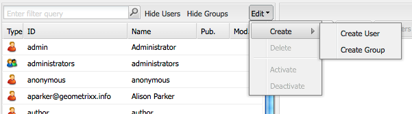

# 사용자 관리 및 보안{#user-administration-and-security}

이 장에서는 사용자 인증을 구성하고 유지 관리하는 방법과 AEM에서 인증 및 권한 부여가 작동하는 원리에 대한 이론도 설명합니다.

## AEM의 사용자 및 그룹 {#users-and-groups-in-aem}

이 섹션에서는 유지 관리하기 쉬운 사용자 관리 개념을 구성하는 데 도움이 되는 다양한 엔티티 및 관련 개념을 자세히 설명합니다.

### 사용자 {#users}

사용자가 계정으로 AEM에 로그온합니다. 각 사용자 계정은 고유하며 할당된 권한과 함께 기본 계정 세부 정보를 보유합니다.

사용자는 이러한 권한 및/또는 권한 할당을 간소화하는 그룹의 멤버인 경우가 많습니다.

### 그룹 {#groups}

그룹은 사용자의 컬렉션이거나 다른 그룹 또는 둘 다입니다. 이러한 컬렉션은 모두 그룹의 구성원이라고 합니다.

그룹의 변경 사항이 그룹의 모든 멤버에 적용되므로 업데이트할 엔티티 수를 줄여 유지 관리 프로세스를 단순화하는 것이 주요 목적입니다. 그룹은 종종 다음을 반영합니다.

* 애플리케이션 내의 역할(예: 콘텐츠 서핑이 허용된 사람 또는 콘텐츠 제공이 허용된 사람)입니다.
* 자체 조직. 콘텐츠 트리에서 기여자가 다른 분기로 제한된 경우 다른 부서의 기여자를 구별하도록 역할을 확장할 수 있습니다.

따라서 그룹은 안정적으로 유지되는 반면, 사용자는 자주 오고갑니다.

계획 및 깔끔한 구조를 통해 그룹을 사용하면 구조를 반영할 수 있으므로 업데이트에 대한 명확한 개요 및 효율적인 메커니즘을 제공할 수 있습니다.

### 내장 사용자 및 그룹 {#built-in-users-and-groups}

AEM WCM은 여러 사용자와 그룹을 설치합니다. 이러한 컬렉션은 설치 후 보안 콘솔에 처음 액세스하면 표시됩니다.

다음 표에는 각 항목이 함께 나열되어 있습니다.

* 간단한 설명
* 필요한 변경에 대한 권장 사항

*모든 기본 암호 변경* (특정 상황에서 계정 자체를 삭제하지 않는 경우).

<table>
 <tbody>
  <tr>
   <td>사용자 ID</td>
   <td>유형</td>
   <td>설명</td>
   <td>추천</td>
  </tr>
  <tr>
   <td>
admin
 
기본 암호: admin
 </td>
   <td>사용자</td>
   <td>
전체 액세스 권한이 있는 시스템 관리 계정입니다.
 
이 계정은 AEM WCM과 CRX 간 연결에 사용됩니다.
 
실수로 이 계정을 삭제한 경우 기본 설정에서 저장소를 다시 시작할 때 다시 만들어집니다.
 
관리자 계정은 AEM 플랫폼의 요구 사항입니다. 따라서 이 계정은 삭제할 수 없습니다.
 </td>
   <td>
Adobe은 이 사용자 계정의 기본 암호를 변경할 것을 권장합니다.
 
설치 시 선호되지만 나중에 수행할 수 있습니다.
 
참고: 이 계정을 CQ 서블릿 엔진의 관리자 계정과 혼동하지 마십시오.
 </td>
  </tr>
  <tr>
   <td>
익명
 
 
 </td>
   <td>사용자</td>
   <td>
인스턴스에 대한 인증되지 않은 액세스에 대한 기본 권한을 보유합니다. 기본적으로 이 계정은 최소 액세스 권한을 보유합니다.
 
실수로 이 계정을 삭제하면 시작 시 다시 만들어집니다. 영구적으로 삭제할 수는 없지만 비활성화할 수는 있습니다.
 </td>
   <td>이 계정은 작성자 인스턴스의 기능에 부정적인 영향을 주므로 삭제하거나 비활성화하지 마십시오. 삭제해야 하는 보안 요구 사항이 있는 경우 먼저 시스템에 미치는 영향을 제대로 테스트해야 합니다.</td>
  </tr>
  <tr>
   <td>
작성자
 
기본 암호: 작성자
 </td>
   <td>사용자</td>
   <td>
/content에 쓸 수 있는 작성자 계정. 기여자 및 서퍼 권한을 포함합니다.
 
전체 /content 트리에 액세스할 수 있으므로 웹 마스터로 사용할 수 있습니다.
 
이 계정은 기본 제공 사용자가 아니지만 다른 Geometrixx 데모 사용자입니다
 </td>
   <td>
Adobe은 계정을 완전히 삭제하거나 기본 암호를 변경할 것을 권장합니다.
 
설치 시 선호되지만 나중에 수행할 수 있습니다.
 </td>
  </tr>
  <tr>
   <td>관리자</td>
   <td>그룹</td>
   <td>
모든 구성원에게 관리자 권한을 부여하는 그룹입니다. 책임자만 이 그룹을 편집할 수 있습니다.
 
전체 액세스 권한이 있습니다.
 </td>
   <td>노드에 'deny-everyone'을 설정하더라도 관리자는 노드에 액세스할 수 있습니다</td>
  </tr>
  <tr>
   <td>content-authors</td>
   <td>그룹</td>
   <td>
콘텐츠 편집을 담당하는 그룹입니다. 읽기, 수정, 만들기 및 삭제 권한이 필요합니다.
 </td>
   <td>읽기, 수정, 만들기 및 삭제 권한을 추가하는 경우 프로젝트별 액세스 권한을 사용하여 고유한 콘텐츠 작성자 그룹을 만들 수 있습니다.</td>
  </tr>
  <tr>
   <td>참여자</td>
   <td>그룹</td>
   <td>
사용자가 콘텐츠를 작성할 수 있는 기본 권한(예: 기능만 해당).
 
/content 트리에 권한을 할당하지 않습니다. 개별 그룹 또는 사용자에 대해 할당해야 합니다.
 </td>
   <td> </td>
  </tr>
  <tr>
   <td>dam-users</td>
   <td>그룹</td>
   <td>일반적인 AEM Assets 사용자에 대한 기본 참조 그룹입니다. 이 그룹의 구성원은 에셋 및 컬렉션의 업로드/공유를 활성화할 수 있는 적절한 권한이 있습니다.</td>
   <td> </td>
  </tr>
  <tr>
   <td>모든 사용자</td>
   <td>그룹</td>
   <td>
모든 도구에서 그룹 또는 멤버십 관계를 볼 수 없어도 AEM의 모든 사용자는 모든 사용자 그룹의 멤버입니다.
 
이 그룹은 모든 사람(향후 만들어질 사용자도)에 대한 권한을 적용하는 데 사용할 수 있으므로 기본 권한으로 간주할 수 있습니다.
 </td>
   <td>
이 그룹을 수정하거나 삭제하지 마십시오.
 
이 계정을 수정하면 추가 보안 문제가 발생합니다.
 </td>
  </tr>
  <tr>
   <td>태그 관리자</td>
   <td>그룹</td>
   <td>태그를 편집할 수 있는 그룹입니다.</td>
   <td> </td>
  </tr>
  <tr>
   <td>user-administrators</td>
   <td>그룹</td>
   <td>사용자 관리, 즉 사용자 및 그룹을 만들 수 있는 권한을 부여합니다.</td>
   <td> </td>
  </tr>
  <tr>
   <td>워크플로우 편집기</td>
   <td>그룹</td>
   <td>워크플로 모델을 만들고 수정할 수 있는 그룹입니다.</td>
   <td> </td>
  </tr>
  <tr>
   <td>워크플로 사용자</td>
   <td>그룹</td>
   <td>
워크플로우에 참여하는 사용자는 워크플로우 사용자 그룹의 멤버여야 합니다. 사용자에게 워크플로 인스턴스를 업데이트할 수 있도록 /etc/workflow/instances에 대한 전체 액세스 권한을 부여합니다.
 
그룹은 표준 설치에 포함되지만 사용자를 그룹에 수동으로 추가해야 합니다.
 </td>
  </tr>
 </tbody>
</table>

## AEM의 권한 {#permissions-in-aem}

AEM은 ACL을 사용하여 사용자 또는 그룹이 수행할 수 있는 작업과 이러한 작업을 수행할 수 있는 위치를 결정합니다.

### 권한 및 ACL {#permissions-and-acls}

권한은 리소스에 대한 작업을 수행할 수 있는 사용자를 정의합니다. 권한은 다음의 결과입니다. [액세스 제어](#access-control-lists-and-how-they-are-evaluated) 평가.

개별 AEM에 대한 확인란을 선택하거나 선택 취소하여 주어진 사용자에게 부여되거나 거부되는 권한을 변경할 수 있습니다 [작업](security.md#actions). 선택 표시는 작업이 허용됨을 나타냅니다. 확인 표시가 없으면 작업이 거부됩니다.

눈금에 확인 표시가 있는 위치는 사용자가 AEM 내에서 어떤 위치에 있는지(즉, 어떤 경로)도 나타냅니다.

### 작업 {#actions}

작업은 페이지(리소스)에서 수행할 수 있습니다. 계층의 각 페이지에 대해 사용자가 해당 페이지에서 수행할 수 있는 작업을 지정할 수 있습니다. [권한](#permissions-and-acls) 작업을 허용하거나 거부할 수 있습니다.

<table>
 <tbody>
  <tr>
   <td><strong>작업 </strong></td>
   <td><strong>설명 </strong></td>
  </tr>
  <tr>
   <td>읽기</td>
   <td>사용자는 페이지 및 모든 하위 페이지를 읽을 수 있습니다.</td>
  </tr>
  <tr>
   <td>수정</td>
   <td>
사용자는 다음과 같은 작업을 수행할 수 있습니다.

    <ul>
     <li>페이지 및 하위 페이지의 기존 콘텐츠를 수정합니다.</li>
     <li>페이지 또는 하위 페이지에 단락을 만듭니다.</li>
    </ul> 
JCR 수준에서 사용자는 등록 정보 편집, 잠금, 버전 관리, nt-modifications를 통해 리소스를 편집할 수 있으며 jcr:content 하위 노드를 정의하는 노드에 대한 완전한 쓰기 권한이 있습니다. 예: cq:Page, nt:file, cq:Asset
 </td>
  </tr>
  <tr>
   <td>만들기</td>
   <td>
사용자는 다음과 같은 작업을 수행할 수 있습니다.

    <ul>
     <li>페이지 또는 하위 페이지를 만듭니다.</li>
    </ul> 
If <strong>수정</strong> 가 거부되면 jcr:content 및 그 하위 노드의 생성이 페이지 수정으로 간주되므로 jcr:content 아래의 하위 트리가 제외됩니다. 이 규칙은 jcr:content 하위 노드를 정의하는 노드에만 적용됩니다.
 </td>
  </tr>
  <tr>
   <td>삭제</td>
   <td>
사용자는 다음과 같은 작업을 수행할 수 있습니다.

    <ul>
     <li>페이지 또는 하위 페이지에서 기존 단락을 삭제합니다.</li>
     <li>페이지 또는 하위 페이지를 삭제합니다.</li>
    </ul> 
If <strong>수정</strong> jcr:content 아래의 모든 하위 트리는 jcr:content를 제거하여 제외되며 해당 하위 노드는 페이지 수정으로 간주됩니다. 이 규칙은 jcr:content 하위 노드를 정의하는 노드에만 적용됩니다.
 </td>
  </tr>
  <tr>
   <td>ACL 읽기</td>
   <td>사용자는 페이지 또는 하위 페이지의 액세스 제어 목록을 읽을 수 있습니다.</td>
  </tr>
  <tr>
   <td>ACL 편집</td>
   <td>사용자는 페이지 또는 모든 하위 페이지의 액세스 제어 목록을 수정할 수 있습니다.</td>
  </tr>
  <tr>
   <td>복제</td>
   <td>사용자는 콘텐츠를 다른 환경(예: 게시 환경)에 복제할 수 있습니다. 권한은 모든 하위 페이지에도 적용됩니다.</td>
  </tr>
 </tbody>
</table>

>[!NOTE]
>
>AEM은에서 역할 할당(소유자, 편집자, 뷰어)을 위한 사용자 그룹을 자동으로 생성합니다. [컬렉션](/help/assets/manage-collections.md). 그러나 이러한 그룹에 대해 ACL을 수동으로 추가하면 AEM 내에 보안 취약점이 발생할 수 있습니다. Adobe은 ACL을 수동으로 추가하지 않는 것을 권장합니다.

### 액세스 제어 목록 및 평가 방법 {#access-control-lists-and-how-they-are-evaluated}

AEM WCM은 ACL(액세스 제어 목록)을 사용하여 다양한 페이지에 적용되는 권한을 구성합니다.

액세스 제어 목록은 개별 권한으로 구성되며 이러한 권한이 적용되는 순서를 결정하는 데 사용됩니다. 목록은 고려 중인 페이지의 계층 구조에 따라 구성됩니다. 그런 다음 이 목록은 페이지에 적용할 첫 번째 적절한 권한이 발견될 때까지 거꾸로 스캔됩니다.

>[!NOTE]
>
>샘플에는 ACL이 포함되어 있습니다. 애플리케이션에 적합한 사항을 검토하고 결정하는 것이 좋습니다. 포함된 ACL을 검토하려면 **CRXDE** 및 선택 **액세스 제어** 다음 노드의 탭:
>
>* `/etc/cloudservices`
>* `/home/users/we-retail`
>
>사용자 정의 애플리케이션은 다음과 같은 다른 관계에 대한 액세스를 설정할 수 있습니다.
>
>* `*/social/relationships/friend/*`
>* 또는 `*/social/relationships/pending-following/*`.
>
>커뮤니티별 ACL을 만들 때 해당 커뮤니티에 가입하는 구성원에게 추가 권한이 부여될 수 있습니다. 예를 들어 사용자가 다음 위치에 커뮤니티에 가입하면: `/content/we-retail/us/en/community`

### 권한 상태 {#permission-states}

>[!NOTE]
>
>CQ 5.3 사용자의 경우:
>
>이전 CQ 버전과 달리 **만들기** 및 **삭제** 는 사용자가 페이지만 수정해야 하는 경우 더 이상 부여해서는 안 됩니다. 대신, **수정** 사용자가 기존 페이지에서 구성 요소를 생성, 수정 또는 삭제할 수 있도록 하려는 경우에만 작업을 수행하십시오.
>
>이전 버전과의 호환성을 위해 작업에 대한 테스트에서는 노드를 정의하는 특수 처리가 수행되지 않습니다 **jcr:content** 고려하십시오.

| **작업** | **설명** |
|---|---|
| 허용(확인 표시) | AEM WCM을 사용하면 사용자가 이 페이지 또는 모든 하위 페이지에서 작업을 수행할 수 있습니다. |
| 거부(확인 표시 없음) | AEM WCM에서는 사용자가 이 페이지나 하위 페이지에서 작업을 수행할 수 없습니다. |

권한은 하위 페이지에도 적용됩니다.

상위 노드에서 상속되지 않은 사용 권한이지만 사용 권한에 대한 로컬 항목이 하나 이상 있는 경우 확인란에 다음 기호가 추가됩니다. 로컬 항목은 CRX 2.2 인터페이스에서 만든 항목입니다(현재 와일드카드 ACL은 CRX에서만 만들 수 있음).

주어진 경로에서 작업:

<table>
 <tbody>
  <tr>
   <td>*(별표)</td>
   <td>하나 이상의 로컬 항목이 있습니다(유효 또는 무효). 이러한 와일드카드 ACL은 CRX에서 정의됩니다.</td>
  </tr>
  <tr>
   <td>! (느낌표)</td>
   <td>현재 효과가 없는 항목이 하나 이상 있습니다.</td>
  </tr>
 </tbody>
</table>

별표나 느낌표 위에 마우스를 가져다 대면 도구 설명에 선언된 항목에 대한 세부 정보가 표시됩니다. 툴팁은 두 부분으로 분할됩니다.

<table>
 <tbody>
  <tr>
   <td>상부</td>
   <td>
유효 입력사항을 나열합니다.
 </td>
  </tr>
  <tr>
   <td>아래 부분</td>
   <td>트리의 다른 곳에 영향을 줄 수 있는 유효하지 않은 항목을 나열합니다(항목의 범위를 제한하는 해당 ACE와 함께 있는 특수 속성으로 표시됨). 또는 해당 경로나 상위 노드에서 정의된 다른 항목에 의해 효과가 취소된 항목입니다.</td>
  </tr>
 </tbody>
</table>

>[!NOTE]
>
>페이지에 대한 권한이 정의되지 않으면 모든 작업이 거부됩니다.

다음은 액세스 제어 목록 관리에 대한 권장 사항입니다.

* 사용자에게 직접 권한을 할당하지 마십시오. 그룹에만 할당하십시오.

   이렇게 하면 그룹 수가 사용자 수보다 훨씬 적으므로 유지 관리가 단순해지고 휘발성도 줄어듭니다.

* 그룹/사용자가 페이지만 수정할 수 있도록 하려면 생성 또는 거부 권한을 부여하지 마십시오. 수정 및 읽기 권한만 부여합니다.
* Deny는 제한적으로 사용합니다. 가능한 한 허용만 사용하십시오.

   권한이 필요한 순서와 다른 순서로 적용되는 경우, deny를 사용하면 예기치 않은 효과가 발생할 수 있습니다. 사용자가 둘 이상의 그룹에 속한 경우 한 그룹의 Deny 문이 다른 그룹의 Allow 문을 취소하거나 반대로 취소할 수 있습니다. 과제 허용이 이런 갈등을 빚지 않는 이상 이런 일이 벌어져 예상치 못한 결과를 쉽게 초래할 수 있는 경우, 개요를 지키는 것은 어렵다.

   Adobe은 거부가 아니라 허용으로 작업할 것을 권장합니다. [우수 사례](#best-practices).

두 권한 중 하나를 수정하기 전에 권한 작동 방식을 이해하고 상호 연관성을 파악해야 합니다. AEM WCM 방법을 보여 주는 CRX 설명서 를 참조하십시오 [액세스 권한 평가](/help/sites-administering/user-group-ac-admin.md#how-access-rights-are-evaluated)및 액세스 제어 목록 설정에 대한 예

### 권한 {#permissions}

권한은 사용자 및 그룹에 AEM 페이지의 AEM 기능에 대한 액세스 권한을 부여합니다.

노드를 확장/축소하여 경로별로 권한을 탐색하고 루트 노드까지 권한 상속을 추적할 수 있습니다.

해당 확인란을 선택하거나 선택 취소하여 권한을 허용하거나 거부합니다.

### 자세한 권한 정보 보기 {#viewing-detailed-permission-information}

그리드 보기와 함께 AEM에서는 지정된 경로에 있는 선택한 사용자/그룹에 대한 권한에 대한 세부 보기를 제공합니다. 세부 사항 보기는 추가 정보를 제공합니다.

정보를 보는 것 외에도 현재 사용자 또는 그룹을 그룹에서 포함하거나 제외할 수 있습니다. 다음을 참조하십시오 [권한을 추가하는 동안 사용자 또는 그룹 추가](#adding-users-or-groups-while-adding-permissions). 여기서 변경한 내용은 상세 보기의 위쪽 부분에 즉시 반영됩니다.

세부 사항 보기에 액세스하려면 **권한** 탭을 클릭하고 **세부 사항** 선택한 그룹/사용자 및 경로에 대해 해당됩니다.

세부 사항은 두 부분으로 나뉩니다.

<table>
 <tbody>
  <tr>
   <td>상부</td>
   <td>
트리 격자에 표시되는 정보를 반복합니다. 각 작업에 대해 아이콘이 작업의 허용 또는 거부 여부를 보여 줍니다.

    <ul>
     <li>no icon = 선언된 항목 없음</li>
     <li>(틱) = 선언된 작업(허용)</li>
     <li>(-) = 선언된 작업(거부)</li>
    </ul> </td>
  </tr>
  <tr>
   <td>아래 부분</td>
   <td>
다음을 수행하는 사용자 및 그룹 그리드를 표시합니다.

    <ul>
     <li>지정된 경로에 대한 항목을 선언하고</li>
     <li>주어진 승인 가능 OR이 그룹인지 여부</li>
    </ul> </td>
  </tr>
 </tbody>
</table>

### 다른 사용자 가장 {#impersonating-another-user}

포함 [가장 기능](/help/sites-authoring/user-properties.md#user-settings), 사용자는 다른 사용자를 대신하여 작업할 수 있습니다.

즉, 사용자 계정은 자신의 계정으로 동작할 수 있는 다른 계정을 특정할 수 있다. 예를 들어 user-B가 user-A를 가장하도록 허용되면 user-B는 user-A의 전체 계정 세부 정보를 사용하여 작업할 수 있습니다.

이 기능을 사용하면 가장하는 계정이 가장하는 계정을 사용하는 것처럼 작업을 완료할 수 있습니다. 예를 들어, 부재 중 또는 과도한 부하를 단기적으로 공유합니다.

>[!NOTE]
>
>관리자가 아닌 사용자가 작동하도록 가장하려면 가장자(위의 경우 user-B)는에서 읽기 권한이 있어야 합니다. `/home/users` 경로.
>
>다음을 참조하십시오 [AEM의 권한](/help/sites-administering/security.md#permissions-in-aem).

>[!CAUTION]
>
>한 계정이 다른 계정을 가장하는 경우 보기가 어렵습니다. 가장이 시작되고 종료될 때 감사 로그에 항목이 작성되지만 다른 로그 파일(예: 액세스 로그)에는 이벤트에 가장이 발생했다는 정보가 없습니다. 따라서 user-B가 user-A를 가장하는 경우 모든 이벤트는 user-A가 수행한 것처럼 보입니다.

>[!CAUTION]
>
>사용자를 가장할 때 페이지 잠금이 수행될 수 있습니다. 그러나 이 방법으로 잠긴 페이지는 가장한 사용자나 관리자 권한이 있는 사용자만 잠금 해제할 수 있습니다.
>
>페이지를 잠근 사용자를 가장하는 것으로는 페이지 잠금을 해제할 수 없습니다.

### 모범 사례 {#best-practices}

다음은 권한 및 권한을 사용하여 작업할 때의 모범 사례에 대해 설명합니다.

| 규칙 | 원인 |
|--- |--- |
| *그룹 사용* | 사용자별로 액세스 권한을 할당하지 마십시오. 이 조언에는 다음과 같은 몇 가지 이유가 있습니다.<ul><li>그룹보다 사용자가 많으므로 그룹이 구조를 단순화합니다.</li><li>그룹 은 모든 계정에 대한 개요를 제공합니다.</li> <li>그룹을 사용하면 상속이 더 간단합니다.</li><li>사용자가 왔다 갔다 합니다. 그룹은 장기적입니다.</li></ul> |
| *긍정적이* | 항상 Allow 문을 사용하여 그룹의 권한을 지정합니다(가능한 경우). Deny 문을 사용하지 마십시오. 그룹은 순서대로 평가되며, 그 순서는 사용자마다 다르게 정의될 수 있다. 즉, 명령문이 구현되고 평가되는 순서를 거의 제어할 수 없습니다. Allow 문만 사용하는 경우에는 순서가 중요하지 않습니다. |
| *단순하게 유지* | 새 설치를 구성할 때 시간과 생각을 투자하는 것은 가치가 있습니다. 명확한 구조를 적용하면 지속적인 유지 관리 작업이 간소화되어 현재 동료와 미래의 후임자 모두 구현된 내용을 쉽게 이해할 수 있습니다. |
| *테스트* | 테스트 설치를 사용하여 다양한 사용자와 그룹 간의 관계를 연습하고 이해합니다. |
| *기본 사용자/그룹* | 설치 후 항상 기본 사용자 및 그룹을 업데이트하여 보안 문제를 방지하십시오. |

## 사용자 및 그룹 관리 {#managing-users-and-groups}

사용자에는 시스템을 사용하는 사람과 시스템에 요청을 하는 외국 시스템이 포함됩니다.

그룹은 사용자 집합입니다.

둘 다 보안 콘솔 내의 사용자 관리 기능을 사용하여 구성할 수 있습니다.

### Security Console을 사용하여 사용자 관리 액세스 {#accessing-user-administration-with-the-security-console}

보안 콘솔을 사용하여 모든 사용자, 그룹 및 관련 권한에 액세스할 수 있습니다. 이 섹션에서 설명하는 모든 절차는 이 창에서 수행됩니다.

AEM WCM 보안에 액세스하려면 다음 중 하나를 수행하십시오.

* 시작 화면 또는 AEM의 다양한 위치에서 보안 아이콘을 클릭합니다.

* 다음으로 직접 이동 `https://<server>:<port>/useradmin`. AEM에 관리자로 로그인해야 합니다.

다음 창이 표시됩니다.

왼쪽 트리에는 현재 시스템에 있는 모든 사용자와 그룹이 나열됩니다. 표시할 열을 선택하고 열의 내용을 정렬하며 열 머리글을 새 위치로 끌어 열이 표시되는 순서를 변경할 수도 있습니다.

탭에서는 다양한 구성에 액세스할 수 있습니다.

<!-- ??? in table below. -->

| 탭 | 설명 |
|--- |--- |
| 필터 상자 | 나열된 사용자, 그룹 또는 둘 모두를 필터링하는 메커니즘. 다음을 참조하십시오 [사용자 및 그룹 필터링](#filtering-users-and-groups). |
| 사용자 숨김 | 나열된 모든 사용자를 숨기고 그룹만 남기는 전환 스위치입니다. 다음을 참조하십시오 [사용자 및 그룹 숨기기](#hiding-users-and-groups). |
| 그룹 숨기기 | 나열된 모든 그룹을 숨기고 사용자만 남기는 전환 스위치입니다. 다음을 참조하십시오 [사용자 및 그룹 숨기기](#hiding-users-and-groups). |
| 편집 | 사용자 또는 그룹을 활성화 및 비활성화하고 생성 및 삭제할 수 있는 메뉴입니다. 다음을 참조하십시오 [사용자 및 그룹 만들기](#creating-users-and-groups) 및 [사용자 및 그룹 삭제](#deleting-users-and-groups). |
| 속성 | 전자 메일 정보, 설명 및 이름 정보를 포함할 수 있는 사용자 또는 그룹에 대한 정보를 나열합니다. 사용자의 암호를 변경할 수도 있습니다. 다음을 참조하십시오 [사용자 및 그룹 만들기](#creating-users-and-groups), [사용자 및 그룹 속성 수정](#modifying-user-and-group-properties) 및 [사용자 암호 변경](#changing-a-user-password). |
| 그룹 | 선택한 사용자 또는 그룹이 속한 모든 그룹을 나열합니다. 선택한 사용자를 추가 그룹에 할당하거나 그룹에서 제거할 수 있습니다. 다음을 참조하십시오 [그룹](#adding-users-or-groups-to-a-group). |
| 구성원 | 그룹에만 사용할 수 있습니다. 특정 그룹의 멤버를 나열합니다. 다음을 참조하십시오 [구성원](#members-adding-users-or-groups-to-a-group). |
| 권한 | 사용자 또는 그룹에 권한을 할당할 수 있습니다. 다음을 제어할 수 있습니다.<ul><li>특정 페이지/노드와 관련된 권한. 다음을 참조하십시오 [권한 설정](#setting-permissions). </li><li>페이지 작성 및 삭제, 계층 수정 관련 권한. ???을 통해 다음 작업을 수행할 수 있습니다. [할당 권한](#settingprivileges)페이지를 만들고 삭제할 수 있도록 해주는 계층 수정,</li><li>관련 권한 [복제 권한](#setting-replication-privileges) (일반적으로 작성자에서 게시로) 경로에 따라 다릅니다.</li></ul> |
| 가장한 사람 | 다른 사용자가 계정을 가장할 수 있습니다. 다른 사용자를 대신하여 활동할 사용자가 필요한 경우 유용합니다. 다음을 참조하십시오 [사용자 가장](#impersonating-another-user). |
| 환경 설정 | 세트 [그룹 또는 사용자에 대한 환경 설정](#setting-user-and-group-preferences). 예: 언어 환경 설정. |

### 사용자 및 그룹 필터링 {#filtering-users-and-groups}

표현식과 일치하지 않는 모든 사용자 및 그룹을 숨기는 필터 표현식을 입력하여 목록을 필터링할 수 있습니다. 를 사용하여 사용자 및 그룹을 숨길 수도 있습니다. [사용자 숨기기 및 그룹 숨기기](#hiding-users-and-groups) 단추.

사용자 또는 그룹을 필터링하려면 다음을 수행합니다.

1. 왼쪽 트리 목록에서 제공된 공간에 필터 표현식을 입력합니다. 예: **admin** 이 문자열을 포함하는 모든 사용자 및 그룹을 표시합니다.
1. 돋보기를 클릭하여 목록을 필터링합니다.

   

1. 다음을 클릭합니다. **x** 모든 필터를 제거하려는 경우.

### 사용자 및 그룹 숨기기 {#hiding-users-and-groups}

사용자 또는 그룹을 숨기는 것은 시스템의 모든 사용자 및 그룹 목록을 필터링하는 또 다른 방법입니다. 두 가지 토글 메커니즘이 있습니다. 사용자 숨기기를 누르면 모든 사용자가 보기에서 숨겨지고, 그룹 숨기기를 누르면 모든 그룹이 보기에서 숨겨집니다(사용자와 그룹을 동시에 숨길 수는 없음). 필터 표현식을 사용하여 목록을 필터링하려면 다음을 참조하십시오. [사용자 및 그룹 필터링](#filtering-users-and-groups).

사용자 및 그룹을 숨기려면:

1. 다음에서 **보안** 콘솔, 클릭 **사용자 숨기기** 또는 **그룹 숨기기**. 선택한 버튼이 강조 표시됩니다.

   

1. 사용자 또는 그룹이 다시 나타나도록 하려면 해당 단추를 다시 클릭합니다.

### 사용자 및 그룹 만들기 {#creating-users-and-groups}

사용자 또는 그룹을 만들려면 다음 작업을 수행하십시오.

1. 다음에서 **보안** 콘솔 트리 목록에서 **편집** 다음 중 하나 **사용자 만들기** 또는 **그룹 만들기**.

   

1. 사용자 또는 그룹 생성 여부에 따라 필요한 세부 정보를 입력합니다.

   * 다음을 선택하는 경우 **사용자 만들기,** 로그인 ID, 이름과 성, 이메일 주소 및 암호를 입력합니다. 기본적으로 AEM은 이름의 첫 번째 문자를 기반으로 경로를 만들지만 다른 경로를 선택할 수 있습니다.

   

   * 다음을 선택하는 경우 **그룹 만들기**&#x200B;그룹 ID와 설명(선택 사항)을 입력합니다.

   

1. **만들기**&#x200B;를 클릭합니다. 생성한 사용자나 그룹이 트리 목록에 나타납니다.

### 사용자 및 그룹 삭제 {#deleting-users-and-groups}

사용자 또는 그룹을 삭제하려면 다음을 수행합니다.

1. 다음에서 **보안** 콘솔에서 삭제할 사용자 또는 그룹을 선택합니다. 여러 항목을 삭제하려면 Shift 키를 누른 상태에서 클릭하거나 Ctrl 키를 누른 상태에서 클릭하여 선택합니다.
1. 클릭 **편집,** 그런 다음 삭제를 선택합니다. AEM WCM이 사용자 또는 그룹 삭제 여부를 묻습니다.
1. 클릭 **확인** 확인 또는 취소.

### 사용자 및 그룹 속성 수정 {#modifying-user-and-group-properties}

사용자 및 그룹 등록 정보를 수정하려면 다음을 수행합니다.

1. 다음에서 **보안** 콘솔에서 수정할 사용자 또는 그룹 이름을 두 번 클릭합니다.

1. 다음을 클릭합니다. **속성** 탭을 클릭하고 필요한 변경 내용을 적용한 다음 **저장**.

   

>[!NOTE]
>
>사용자 속성 하단에 사용자의 경로가 표시됩니다. 수정할 수 없습니다.

### 사용자 암호 변경 {#changing-a-user-password}

사용자 암호를 수정하려면 다음 절차를 따르십시오.

>[!NOTE]
>
>보안 콘솔을 사용하여 관리자 암호를 변경할 수 없습니다. 관리자 계정의 암호를 변경하려면 [사용자 콘솔](/help/sites-administering/granite-user-group-admin.md#changing-the-password-for-an-existing-user) Granite Operations가 제공하는 기능입니다.
>
>JEE에서 AEM Forms을 사용하는 경우 아래 지침에 따라 암호를 변경하지 말고 JEE Admin Console에서 AEM Forms(/adminui)를 사용하여 암호를 변경하십시오.

1. 다음에서 **보안** 콘솔에서 암호를 변경할 사용자 이름을 두 번 클릭합니다.
1. 다음을 클릭합니다. **속성** 탭(아직 활성화되지 않은 경우)
1. 클릭 **암호 설정**. 암호를 변경할 수 있는 암호 설정 창이 열립니다.

   

1. 새 암호를 두 번 입력합니다. 일반 텍스트로 표시되지 않으므로 이 작업은 확인을 위한 것입니다. 일치하지 않으면 시스템에 오류가 표시됩니다.
1. 클릭 **설정** 을 클릭하여 계정에 대한 새 암호를 활성화합니다.

### 그룹에 사용자 또는 그룹 추가 {#adding-users-or-groups-to-a-group}

AEM은 기존 그룹에 사용자 또는 그룹을 추가하는 세 가지 방법을 제공합니다.

* 그룹에 있으면 구성원(사용자 또는 그룹)을 추가할 수 있습니다.
* 구성원에 있으면 그룹에 구성원을 추가할 수 있습니다.
* 사용 권한에 대해 작업할 때 구성원을 그룹에 추가할 수 있습니다.

### 그룹 - 그룹에 사용자 또는 그룹 추가 {#groups-adding-users-or-groups-to-a-group}

다음 **그룹** 탭에는 현재 계정이 속한 그룹이 표시됩니다. 이 옵션을 사용하여 선택한 계정을 그룹에 추가할 수 있습니다.

1. 그룹에 지정할 계정(사용자 또는 그룹)의 이름을 두 번 클릭합니다.
1. 다음을 클릭합니다. **그룹** 탭. 계정이 이미 속한 그룹 목록이 표시됩니다.
1. 트리 목록에서 계정에 추가할 그룹의 이름을 클릭하여 **그룹** 창. (여러 사용자를 추가하려면 Shift 키를 누른 상태로 해당 이름을 클릭하거나 Ctrl 키를 누른 상태로 클릭하고 드래그합니다.)

   

1. 클릭 **저장** 변경 사항을 저장합니다.

### 구성원 - 그룹에 사용자 또는 그룹 추가 {#members-adding-users-or-groups-to-a-group}

다음 **구성원** 탭은 그룹에 대해서만 작동하며 현재 그룹에 속한 사용자와 그룹을 보여 줍니다. 이를 사용하여 그룹에 계정을 추가할 수 있습니다.

1. 구성원을 추가할 그룹 이름을 두 번 클릭합니다.
1. 다음을 클릭합니다. **구성원** 탭. 이미 이 그룹에 속한 구성원 목록이 표시됩니다.
1. 트리 목록에서 그룹에 추가할 멤버의 이름을 클릭하고 **구성원** 창. (여러 사용자를 추가하려면 Shift 키를 누른 상태로 해당 이름을 클릭하거나 Ctrl 키를 누른 상태로 클릭하고 드래그합니다.)

   

1. 클릭 **저장** 변경 사항을 저장합니다.

### 권한을 추가하는 동안 사용자 또는 그룹 추가 {#adding-users-or-groups-while-adding-permissions}

특정 경로의 그룹에 멤버를 추가하려면 다음을 수행합니다.

1. 사용자를 추가할 그룹 또는 사용자의 이름을 두 번 클릭합니다.

1. 다음을 클릭합니다. **권한** 탭.

1. 권한을 추가할 경로로 이동한 다음 **세부 사항**. 세부 정보 창의 아래쪽에는 해당 페이지에 대한 권한이 있는 사용자에 대한 정보가 제공됩니다.

   

1. 에서 확인란을 선택합니다. **멤버** 해당 경로에 대한 권한을 보유할 멤버에 대한 열입니다. 권한을 제거할 구성원에 대한 확인란의 선택을 취소합니다. 변경한 셀에 빨간색 삼각형이 나타납니다.
1. 클릭 **확인** 변경 사항을 저장합니다.

### 그룹에서 사용자 또는 그룹 제거 {#removing-users-or-groups-from-groups}

AEM은 그룹에서 사용자 또는 그룹을 제거하는 세 가지 방법을 제공합니다.

* 그룹 프로필에 있는 경우 구성원(사용자 또는 그룹)을 제거할 수 있습니다.
* 구성원 프로필에 있을 때 그룹에서 구성원을 제거할 수 있습니다.
* 권한으로 작업하는 경우 그룹에서 구성원을 제거할 수 있습니다.

### 그룹 - 그룹에서 사용자 또는 그룹 제거 {#groups-removing-users-or-groups-from-groups}

그룹에서 사용자 또는 그룹 계정을 제거하려면 다음 작업을 수행하십시오.

1. 그룹에서 제거할 그룹 또는 사용자 계정의 이름을 두 번 클릭합니다.
1. 다음을 클릭합니다. **그룹** 탭. 선택한 계정이 속한 그룹을 확인합니다.
1. 다음에서 **그룹** 창에서 그룹에서 제거할 사용자 또는 그룹의 이름을 클릭하고 **제거**. (여러 계정을 제거하려면 Shift 키를 누른 상태에서 클릭하거나 Ctrl 키를 누른 상태에서 해당 이름을 클릭하고 **제거**.)

   

1. 클릭 **저장** 변경 사항을 저장합니다.

### 구성원 - 그룹에서 사용자 또는 그룹 제거 {#members-removing-users-or-groups-from-groups}

그룹에서 계정을 제거하려면 다음 작업을 수행하십시오.

1. 구성원을 제거할 그룹의 이름을 두 번 클릭합니다.
1. 다음을 클릭합니다. **구성원** 탭. 이미 이 그룹에 속한 구성원 목록이 표시됩니다.
1. 다음에서 **구성원** 창에서 그룹에서 제거할 멤버의 이름을 클릭하고 **제거**. (여러 사용자를 제거하려면 Shift 키를 누른 상태로 해당 이름을 클릭하거나 Ctrl 키를 누른 상태로 클릭하고 **제거**.)

   

1. 클릭 **저장** 변경 사항을 저장합니다.

### 권한을 추가하는 동안 사용자 또는 그룹 제거 {#removing-users-or-groups-while-adding-permissions}

특정 경로에 있는 그룹에서 멤버를 제거하려면 다음을 수행합니다.

1. 사용자를 제거할 그룹 또는 사용자의 이름을 두 번 클릭합니다.

1. 다음을 클릭합니다. **권한** 탭.

1. 권한을 제거할 경로로 이동한 다음 **세부 사항**. 세부 정보 창의 아래쪽에는 해당 페이지에 대한 권한이 있는 사용자에 대한 정보가 제공됩니다.

   

1. 에서 확인란을 선택합니다. **멤버** 해당 경로에 대한 권한을 보유할 멤버에 대한 열입니다. 권한을 제거할 구성원에 대한 확인란의 선택을 취소합니다. 변경한 셀에 빨간색 삼각형이 나타납니다.
1. 클릭 **확인** 변경 사항을 저장합니다.

### 사용자 동기화 {#user-synchronization}

배포가 인 경우 [팜 게시](/help/sites-deploying/recommended-deploys.md#tarmk-farm), 모든 게시 노드 간에 사용자 및 그룹을 동기화해야 합니다.

사용자 동기화 및 활성화 방법에 대한 자세한 내용은 [사용자 동기화](/help/sites-administering/sync.md).

## 권한 관리 {#managing-permissions}

>[!NOTE]
>
>Adobe은 권한 관리를 위한 새로운 Touch UI 기반 사용자 보기를 도입했습니다. 사용 방법에 대한 자세한 내용은 [이 페이지](/help/sites-administering/touch-ui-principal-view.md).

이 섹션에서는 복제 권한을 포함한 권한을 설정하는 방법에 대해 설명합니다.

### 권한 설정 {#setting-permissions}

사용 권한을 사용하면 특정 경로의 리소스에 대해 특정 작업을 수행할 수 있습니다. 또한 페이지를 만들거나 삭제하는 기능도 포함됩니다.

권한을 추가, 수정 또는 삭제하려면 다음을 수행합니다.

1. 다음에서 **보안** 콘솔에서 또는 의 권한을 설정할 사용자 또는 그룹의 이름을 두 번 클릭합니다 [노드 검색](#searching-for-nodes).

1. 다음을 클릭합니다. **권한** 탭.

   

1. 트리 그리드에서 선택한 사용자 또는 그룹이 작업을 수행할 수 있도록 하려면 확인란을 선택하고 선택한 사용자 또는 그룹이 작업을 수행할 수 없도록 하려면 확인란을 선택 취소합니다. 자세한 내용을 보려면 **세부 사항**.

1. 완료되면 다음을 클릭하십시오. **저장**.

### 복제 권한 설정 {#setting-replication-privileges}

복제 권한은 콘텐츠를 게시할 수 있는 권한이며 그룹 및 사용자에 대해 설정할 수 있습니다.

>[!NOTE]
>
>* 그룹에 적용된 모든 복제 권한은 해당 그룹의 모든 사용자에게 적용됩니다.
>* 사용자의 복제 권한이 그룹의 복제 권한보다 우선합니다.
>* 복제 허용 권한은 복제 거부 권한보다 우선 순위가 높습니다. 다음을 참조하십시오 [AEM의 권한](#permissions-in-aem) 추가 정보.
>

복제 권한을 설정하려면 다음을 수행하십시오.

1. 목록에서 사용자 또는 그룹을 선택하고 두 번 클릭하여 연 다음 **권한**.
1. 그리드에서 사용자에게 복제 권한이 부여될 경로 또는 [노드를 검색합니다.](#searching-for-nodes)

1. 다음에서 **복제** 선택한 경로의 열에서 확인란을 선택하여 해당 사용자 또는 그룹에 대한 복제 권한을 추가하거나 확인란의 선택을 취소하여 복제 권한을 제거합니다. AEM은 아직 저장되지 않은 변경 사항을 적용한 모든 위치에 빨간색 삼각형을 표시합니다.

   

1. 클릭 **저장** 변경 사항을 저장합니다.

### 노드 검색 {#searching-for-nodes}

권한을 추가하거나 제거할 때 노드를 찾아보거나 검색할 수 있습니다.

경로 검색에는 두 가지 유형이 있습니다.

* 경로 검색 - 검색 문자열이 &quot;/&quot;로 시작하면 지정된 경로의 직접 하위 노드를 검색합니다.

검색 상자에서 다음 작업을 수행할 수 있습니다.

| 작업 | 설명 |
|--- |--- |
| 오른쪽 화살표 키 | 검색 결과에서 하위 노드 선택 |
| 아래쪽 화살표 키 | 검색을 다시 시작합니다. |
| (반환) 키 입력 | 하위 노드를 선택하여 트리 격자에 로드합니다. |

* 전체 텍스트 검색 - 검색 문자열이 &quot;/&quot;로 시작되지 않으면 &quot;/content&quot; 경로 아래의 모든 노드에서 전체 텍스트 검색이 실행됩니다.

경로 또는 전체 텍스트 검색을 수행하려면 다음을 수행합니다.

1. 보안 콘솔에서 사용자 또는 그룹을 선택한 다음 **권한** 탭.

1. 검색 상자에 검색할 용어를 입력합니다.

### 사용자 가장 {#impersonating-users}

현재 사용자를 가장할 수 있는 사용자를 한 명 이상 지정할 수 있습니다. 이 기능은 계정 설정을 현재 사용자의 설정으로 전환하고 이 사용자를 대신하여 활동할 수 있음을 의미합니다.

이 기능은 사용자가 자신의 사용자가 수행할 수 없는 작업을 수행할 수 있으므로 주의하여 사용하십시오. 사용자를 가장할 때 사용자로 로그인되지 않았다는 알림이 표시됩니다.

이 기능을 사용할 수 있는 시나리오는 다음과 같습니다.

* 부재 중인 경우 부재 중 다른 사람이 사용자를 사칭하도록 할 수 있습니다. 이 기능을 사용하면 다른 사람이 사용자의 액세스 권한을 가지고 있는지 그리고 사용자 프로필을 수정하거나 암호를 제공할 필요가 없는지 확인할 수 있습니다.
* 디버깅을 위해 사용할 수 있습니다. 예를 들어, 웹 사이트에서 제한된 액세스 권한이 있는 사용자를 찾는 방법을 확인할 수 있습니다. 또한 사용자가 기술적인 문제에 대해 불만을 제기하는 경우 해당 사용자를 가장하여 문제를 진단하고 해결할 수 있습니다.

기존 사용자를 가장하려면 다음 작업을 수행하십시오.

1. 트리 목록에서 다른 사용자를 가장할 사용자의 이름을 선택합니다. 더블 클릭하여 엽니다.
1. 다음을 클릭합니다. **가장한 사람** 탭.
1. 선택한 사용자를 가장할 수 있는 사용자를 클릭합니다. 사용자(가장자)를 목록에서 가장 창으로 드래그합니다. 이름이 목록에 나타납니다.

   

1. **저장**&#x200B;을 클릭합니다.

### 사용자 및 그룹 환경 설정 지정 {#setting-user-and-group-preferences}

언어, 창 관리 및 도구 모음 환경 설정을 포함하여 사용자 및 그룹 환경 설정을 지정하려면 다음과 같이 하십시오.

1. 왼쪽 트리에서 기본 설정을 변경할 사용자 또는 그룹을 선택합니다. 여러 사용자 또는 그룹을 선택하려면 Ctrl+클릭 또는 Shift+클릭 선택 항목을 선택합니다.
1. 다음을 클릭합니다. **환경 설정** 탭.

   

1. 필요에 따라 그룹 또는 사용자 환경 설정을 변경하고 **저장** 완료 시.

### 다른 사용자를 관리할 수 있는 권한을 갖도록 사용자 또는 관리자 설정 {#setting-users-or-administrators-to-have-the-privilege-to-manage-other-users}

다른 사용자를 삭제/활성화/비활성화할 수 있는 권한을 갖도록 사용자 또는 관리자를 설정하려면 다음과 같이 하십시오.

1. 다른 사용자를 관리하는 권한을 부여할 사용자를 관리자 그룹에 추가하고 변경 사항을 저장합니다.

   

1. 사용자의 **권한** 탭을 클릭하고 &quot;/&quot;로 이동한 다음 복제 열에서 &quot;/&quot;에서 복제를 허용하는 확인란을 선택하고 **저장**.

   

   이제 선택한 사용자가 사용자를 비활성화, 활성화, 삭제 및 만들 수 있습니다.

### 프로젝트 수준에 대한 권한 확장 {#extending-privileges-on-a-project-level}

애플리케이션별 권한을 구현할 계획인 경우 다음 정보는 사용자 지정 권한을 구현하기 위해 알아야 할 사항과 CQ 전체에 권한을 적용하는 방법을 설명합니다.

계층 수정 권한은 jcr-권한의 조합으로 다룹니다. 복제 권한 이름은 다음과 같습니다 **crx:replicate** jcr 저장소에 대한 다른 권한과 함께 저장/평가됩니다. 그러나 jcr 수준에서는 적용되지 않습니다.

사용자 정의 권한의 정의 및 등록은 공식적으로 [Jackrabbit API](https://jackrabbit.apache.org/oak/docs/security/privilege.html) 버전 2.4 기준( 참조) [JCR-2887](https://issues.apache.org/jira/browse/JCR-2887)). 추가 사용에는 정의자와 같은 JCR 액세스 제어 관리가 포함됩니다. [JSR](https://jcp.org/en/jsr/detail?id=283) (16절) 또한 Jackrabbit API는 두 가지 확장을 정의합니다.

권한 등록 메커니즘은 아래의 UI에 반영됩니다. **저장소 구성**.

새(사용자 지정) 권한의 등록은 저장소 수준에서 부여해야 하는 기본 제공 권한에 의해 그 자체가 보호됩니다. JCR에서: ac mgt api의 &#39;absPath&#39; 매개 변수로 &#39;null&#39;을 전달합니다. 자세한 내용은 jsr 333을 참조하십시오. 기본적으로, **admin** 그리고 관리자의 모든 구성원에게는 해당 권한이 부여됩니다.

>[!NOTE]
>
>구현은 사용자 지정 권한의 유효성 검사와 평가를 처리하지만 기본 제공 권한의 집계인 경우가 아니면 이를 적용할 수 없습니다.
