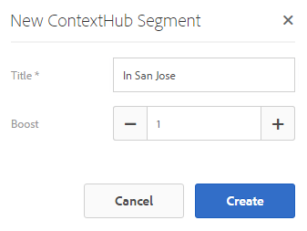
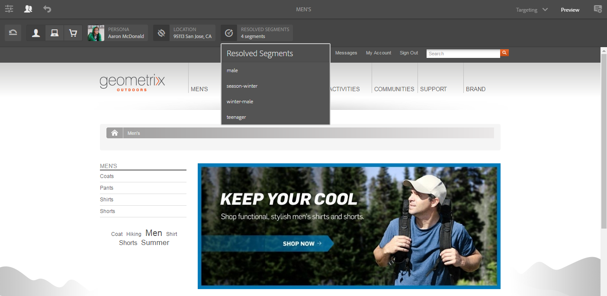

# ContextHub을 사용하여 세그멘테이션 구성{#configuring-segmentation-with-contexthub}

>[!NOTE]
>
>이 섹션에서는 ContextHub 사용 시 세그멘테이션 구성에 대해 설명합니다. 클라이언트 컨텍스트 기능을 사용하는 경우 클라이언트 컨텍스트에 대한 세그멘테이션을 [구성하기 위한 관련 설명서를 참조하십시오](/help/sites-administering/campaign-segmentation.md).


세그먼테이션은 캠페인을 만들 때 중요하게 고려해야 하는 사항입니다. 세그멘테이션의 [작동](/help/sites-authoring/managing-audiences.md) 방식 및 주요 용어에 대한 자세한 내용은 대상 관리를 참조하십시오.

사이트 방문자에 대해 이미 수집한 정보와 달성하고자 하는 목표에 따라 타깃팅된 컨텐츠에 필요한 세그먼트와 전략을 정의해야 합니다.

이러한 세그먼트는 방문자에게 특정 타깃팅된 컨텐츠를 제공하는 데 사용됩니다. 이 컨텐츠는 웹 사이트의 [개인화](/help/sites-authoring/personalization.md) 섹션에서 유지 관리됩니다. [여기에 정의된 활동은](/help/sites-authoring/activitylib.md) 모든 페이지에 포함될 수 있으며 전문 컨텐츠가 적용할 수 있는 방문자 세그먼트를 정의할 수 있습니다.

AEM을 사용하면 사용자의 경험을 손쉽게 개인화할 수 있습니다. 또한 세그먼트 정의의 결과를 확인할 수 있습니다.

## 세그먼트 액세스 {#accessing-segments}

대상 [콘솔은](/help/sites-authoring/managing-audiences.md) ContextHub 또는 Client Context용 세그먼트와 Adobe Target 계정의 대상을 관리하는 데 사용됩니다. 이 설명서에서는 ContextHub용 세그먼트 관리에 대해 설명합니다. 클라이언트 [컨텍스트 세그먼트](/help/sites-administering/campaign-segmentation.md) 및 Adobe Target 세그먼트의 경우 관련 설명서를 참조하십시오.

세그먼트에 액세스하려면 글로벌 탐색에서 탐색 > 개인화 **> 대상을 선택합니다**.


## 세그먼트 편집기 {#segment-editor}

세그먼트 **편집기를** 사용하면 세그먼트를 쉽게 수정할 수 있습니다. 세그먼트를 편집하려면 세그먼트 [목록에서](/help/sites-administering/segmentation.md#accessing-segments) 세그먼트를 선택하고 편집 **단추를 클릭합니다** .


구성 요소 브라우저를 사용하여 AND 및 **OR** 컨테이너를 **추가하여** 세그먼트 논리를 정의한 다음 추가 구성 요소를 추가하여 속성과 값을 비교하거나 스크립트 및 기타 세그먼트를 참조하고 선택 기준을 정의할 수 있습니다(새 세그먼트 [만들기 참조](#creating-a-new-segment)). 세그먼트를 선택할 수 있는 정확한 시나리오를 정의합니다.

전체 문이 true로 평가되면 세그먼트가 해결됩니다. 여러 세그먼트를 적용할 수 있는 경우 증폭 **계수도** 사용됩니다. [증폭 인자에 대한 자세한 내용은](#creating-a-new-segment) 새 [세그먼트 만들기를 참조하십시오.](/help/sites-administering/campaign-segmentation.md#boost-factor)

>[!CAUTION]
>
>세그먼트 편집기는 순환 참조를 확인하지 않습니다. 예를 들어 세그먼트 A는 다른 세그먼트 B를 참조하고, 이 세그먼트 A를 차례로 참조합니다.세그먼트에 순환 참조가 포함되어 있지 않아야 합니다.

### 컨테이너 {#containers}

다음 컨테이너는 기본적으로 사용할 수 있으며 부울 평가를 위해 비교와 참조를 그룹화할 수 있습니다. 구성 요소 브라우저에서 편집기로 끌 수 있습니다. 자세한 내용은 AND [및 OR 컨테이너](/help/sites-administering/segmentation.md#using-and-and-or-containers) 사용을 참조하십시오.

<table>
 <tbody>
  <tr>
   <td>컨테이너 AND<br /> </td>
   <td>부울 AND 연산자<br /> </td>
  </tr>
  <tr>
   <td>컨테이너 OR<br /> </td>
   <td>부울 OR 연산자</td>
  </tr>
 </tbody>
</table>

### 비교 {#comparisons}

즉시 사용할 수 있는 세그먼트 비교를 통해 세그먼트 속성을 평가할 수 있습니다. 구성 요소 브라우저에서 편집기로 끌 수 있습니다.

<table>
 <tbody>
  <tr>
   <td>속성-값<br /> </td>
   <td>저장소 속성을 정의된 값과 비교합니다.<br /> </td>
  </tr>
  <tr>
   <td>속성</td>
   <td>스토어의 한 속성을 다른 속성과 비교합니다.<br /> </td>
  </tr>
  <tr>
   <td>속성-세그먼트 참조</td>
   <td>스토어의 속성을 다른 참조된 세그먼트와 비교합니다.<br /> </td>
  </tr>
  <tr>
   <td>속성-스크립트 참조</td>
   <td>스토어의 속성을 스크립트 결과와 비교합니다.<br /> </td>
  </tr>
  <tr>
   <td>세그먼트 참조-스크립트 참조</td>
   <td>참조된 세그먼트를 스크립트 결과와 비교합니다.<br /> </td>
  </tr>
 </tbody>
</table>

>[!NOTE]
>
>값을 비교할 때 비교 데이터 유형이 설정되지 않은 경우(즉, 자동 검색으로 설정) ContextHub의 세그멘테이션 엔진은 값을 javascript와 비교하기만 합니다. 예상 유형에 값을 캐스팅하지 않으므로 잘못된 결과가 발생할 수 있습니다. 예:
>
>`null < 30 // will return true`
>
>따라서 세그먼트를 [만들](/help/sites-administering/segmentation.md#creating-a-new-segment)때 비교 값 유형이 알려질 때마다 **데이터 유형을** 선택해야 합니다. 예:
>
>속성을 비교할 `profile/age`때 비교 유형이 **숫자임을**&#x200B;이미 알고 있으므로 이 값이 `profile/age` 설정되어 있지 않더라도 `profile/age` 30보다 작으면 예상한 대로 **false**&#x200B;를 반환합니다.

### 참조 {#references}

곧바로 사용할 수 있는 다음 참조는 스크립트 또는 다른 세그먼트에 직접 연결할 수 있습니다. 구성 요소 브라우저에서 편집기로 끌 수 있습니다.

<table>
 <tbody>
  <tr>
   <td>세그먼트 참조<br /> </td>
   <td>참조된 세그먼트 평가</td>
  </tr>
  <tr>
   <td>스크립트 참조</td>
   <td>참조된 스크립트를 평가합니다. 자세한 내용은 스크립트 참조 <a href="/help/sites-administering/segmentation.md#using-script-references">사용을</a> 참조하십시오.</td>
  </tr>
 </tbody>
</table>

## 새 세그먼트 만들기 {#creating-a-new-segment}

새 세그먼트를 정의하려면

1. 세그먼트에 [액세스한](/help/sites-administering/segmentation.md#accessing-segments)후 만들기 단추를 클릭하거나 탭하고 ContextHub 세그먼트 **만들기를 선택합니다**.

   

1. 새 **ContextHub**&#x200B;세그먼트에서 세그먼트 제목과 필요한 경우 증폭 값을 입력한 다음 만들기를 탭하거나 **클릭합니다**.

   

   각 세그먼트에는 가중치로 사용되는 증폭 매개 변수가 있습니다. 숫자가 클수록 세그먼트가 여러 세그먼트가 유효한 인스턴스에서 숫자가 낮은 세그먼트에 대해 선호에서 선택됨을 나타냅니다.

   * Minimum value: `0`
   * Maximum value: `1000000`

1. 비교 또는 참조를 세그먼트 편집기에 드래그하여 기본 AND 컨테이너에 표시합니다.
1. 새 참조나 세그먼트의 구성 옵션을 두 번 클릭하거나 탭하여 특정 매개 변수를 편집합니다. 이 예에서는 San Jose의 사용자를 대상으로 테스트를 실시하고 있습니다.

   

   가능한 **경우 데이터 유형을** 항상 설정하여 비교가 제대로 평가되는지 확인합니다. 자세한 [내용은](/help/sites-administering/segmentation.md#comparisons) 비교를 참조하십시오.

1. Click **OK** to save your definition:
1. 필요에 따라 구성 요소를 더 추가합니다. AND 및 OR 비교용 컨테이너 구성 요소를 사용하여 부울 표현식을 만들 수 있습니다(아래 AND 및 컨테이너 [사용 참조](/help/sites-administering/segmentation.md#using-and-and-or-containers) ). 세그먼트 편집기를 사용하여 더 이상 필요하지 않은 구성 요소를 삭제하거나 문 내의 새 위치로 드래그할 수 있습니다.

### AND 및 OR 컨테이너 사용 {#using-and-and-or-containers}

AND 및 OR 컨테이너 구성 요소를 사용하여 AEM에서 복잡한 세그먼트를 구성할 수 있습니다. 이를 수행할 때 몇 가지 기본 사항을 파악하는 데 도움이 됩니다.

* 정의의 최상위 수준은 항상 처음에 만들어진 AND 컨테이너입니다. 이 값은 변경할 수 없지만 나머지 세그먼트 정의에 영향을 주지 않습니다.
* 컨테이너의 중첩이 적절한지 확인합니다. 컨테이너는 부울 표현식의 괄호로 볼 수 있습니다.

다음 예제는 당사의 주요 연령 그룹에서 고려되는 방문자를 선택하는 데 사용됩니다.

30세에서 59세 사이의 남자

또는

30세에서 59세 사이의 여성

기본 AND 컨테이너 내에 OR 컨테이너 구성 요소를 배치하여 시작합니다. OR 컨테이너 내에 두 개의 AND 컨테이너를 추가하고 두 개의 컨테이너 내에 속성 또는 참조 구성 요소를 추가할 수 있습니다.


### 스크립트 참조 사용 {#using-script-references}

스크립트 참조 구성 요소를 사용하여 세그먼트 속성의 평가를 외부 스크립트에 위임할 수 있습니다. 스크립트가 제대로 구성되면 세그먼트 조건의 다른 구성 요소로 사용할 수 있습니다.

#### 참조할 스크립트 정의 {#defining-a-script-to-reference}

1. clientlib에 파일을 `contexthub.segment-engine.scripts` 추가합니다.
1. 값을 반환하는 함수를 구현합니다. 예:

   ```
   ContextHub.console.log(ContextHub.Shared.timestamp(), '[loading] contexthub.segment-engine.scripts - script.profile-info.js');
   
   (function() {
       'use strict';
   
       /**
        * Sample script returning profile information. Returns user info if data is available, false otherwise.
        *
        * @returns {Boolean}
        */
       var getProfileInfo = function() {
           /* let the SegmentEngine know when script should be re-run */
           this.dependOn(ContextHub.SegmentEngine.Property('profile/age'));
           this.dependOn(ContextHub.SegmentEngine.Property('profile/givenName'));
   
           /* variables */
           var name = ContextHub.get('profile/givenName');
           var age = ContextHub.get('profile/age');
   
           return name === 'Joe' && age === 123;
       };
   
       /* register function */
       ContextHub.SegmentEngine.ScriptManager.register('getProfileInfo', getProfileInfo);
   
   })();
   ```

1. 스크립트를 다음으로 `ContextHub.SegmentEngine.ScriptManager.register`등록합니다.

스크립트가 추가 속성에 의존하는 경우 스크립트가 호출해야 `this.dependOn()`합니다. 예를 들어, 스크립트가 다음 경우에 따라 `profile/age`달라집니다.

```
this.dependOn(ContextHub.SegmentEngine.Property('profile/age'));
```

#### 스크립트 참조 {#referencing-a-script}

1. ContextHub 세그먼트를 만듭니다.
1. 원하는 **세그먼트** 위치에 스크립트 참조 구성 요소를 추가합니다.
1. 스크립트 참조 구성 요소의 편집 **대화 상자를** 엽니다. 올바르게 구성된 [경우 스크립트 이름](/help/sites-administering/segmentation.md#defining-a-script-to-reference)드롭다운에서 스크립트를 사용할 수 있어야 **** 합니다.

## 세그먼트 애플리케이션 테스트 {#testing-the-application-of-a-segment}

세그먼트가 정의되면 ContextHub의 도움으로 잠재적 결과를 테스트할 수 **[있습니다](/help/sites-authoring/ch-previewing.md).**

1. 페이지 미리 보기
1. ContextHub 아이콘을 클릭하여 ContextHub 도구 모음을 표시합니다.
1. 만든 세그먼트와 일치하는 페르소나 선택
1. ContextHub에서 선택한 가상 사용자에 대해 해당 세그먼트를 확인합니다.

예를 들어 주요 연령 그룹에서 사용자를 식별하기 위한 간단한 세그먼트 정의는 사용자의 연령 및 성별을 기반으로 합니다. 해당 기준과 일치하는 특정 모습을 로드하면 세그먼트가 성공적으로 해결되었는지 여부가 표시됩니다.


또는 해결되지 않은 경우:


>[!NOTE]
>
>모든 트레이트는 즉시 해결되지만, 대부분의 트레이트는 페이지 다시 로드에서만 변경됩니다.

이러한 테스트는 컨텐츠 페이지에서, 타깃팅된 컨텐츠 및 관련 활동 및 경험과 함께 수행할 **수** **있습니다**.

위의 주요 연령 그룹 세그먼트 예를 사용하여 활동 및 경험을 설정한 경우, 활동을 사용하여 세그먼트를 쉽게 테스트할 수 있습니다. 활동 설정에 대한 자세한 내용은 타깃팅된 컨텐츠 [작성에 대한 관련](/help/sites-authoring/content-targeting-touch.md)설명서를 참조하십시오.

1. 타깃팅된 컨텐츠를 설정한 페이지의 편집 모드에서 컨텐츠의 화살표 아이콘을 통해 컨텐츠가 타깃팅되었음을 확인할 수 있습니다.

   

1. 미리 보기 모드로 전환하고 컨텍스트 허브를 사용하여 경험에 대해 구성된 세그먼테이션과 일치하지 않는 가상 사용자로 전환합니다.

   

1. 경험에 대해 구성된 세그멘테이션과 일치하는 가상 사용자로 전환하고 그에 따라 경험이 변경되는지 확인합니다.

   

## 세그먼트 사용 {#using-your-segment}

세그먼트는 특정 타겟 고객이 보는 실제 컨텐츠를 유도하는 데 사용됩니다. 대상 [및 세그먼트에](/help/sites-authoring/managing-audiences.md) 대한 자세한 내용 및 타겟 [및 세그먼트를 사용하여 컨텐츠를](/help/sites-authoring/content-targeting-touch.md) 타깃팅하는 방법에 대한 자세한 내용은 대상 관리를 참조하십시오.
