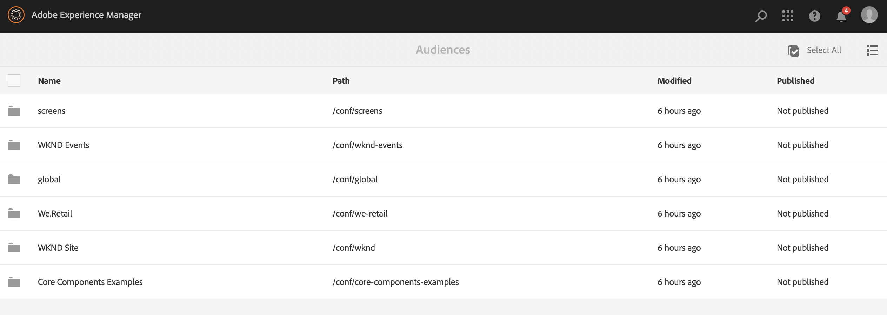

# ContextHub를 사용하여 세분화 구성{#configuring-segmentation-with-contexthub}

>[!NOTE]
>
>이 섹션에서는 ContextHub 사용 시 세그먼테이션을 구성하는 방법에 대해 설명합니다. Client Context 기능을 사용 중이라면 관련 설명서를 참조하십시오. [Client Context에 대한 세그먼테이션 구성](/help/sites-administering/campaign-segmentation.md).
>

세그먼테이션은 캠페인을 만들 때 중요하게 고려해야 하는 사항입니다. 다음을 참조하십시오 [대상자 관리](/help/sites-authoring/managing-audiences.md) 세그먼테이션의 작동 방식 및 주요 용어에 대한 정보입니다.

사이트 방문자 및 달성하고자 하는 목표에 대해 이미 수집한 정보에 따라 타겟팅된 콘텐츠에 필요한 세그먼트 및 전략을 정의해야 합니다.

그런 다음 이러한 세그먼트를 사용하여 방문자에게 특별히 타겟팅된 콘텐츠를 제공할 수 있습니다. 이 콘텐츠는 다음에서 유지됩니다. [개인화](/help/sites-authoring/personalization.md) 섹션을 참조하십시오. 여기에 정의된 [활동](/help/sites-authoring/activitylib.md)은 모든 페이지에 포함될 수 있으며 특정 콘텐츠가 적용될 수 있는 방문자 세그먼트를 정의할 수 있습니다.

AEM을 사용하면 사용자의 경험을 손쉽게 개인화할 수 있습니다. 또한 세그먼트 정의의 결과를 확인할 수도 있습니다.

## 세그먼트 할당 {#accessing-segments}

다음 [대상](/help/sites-authoring/managing-audiences.md) 콘솔을 사용하여 ContextHub 또는 Client Context용 세그먼트와 Adobe Target 계정의 대상을 관리할 수 있습니다. 이 설명서에서는 ContextHub용 세그먼트 관리에 대해 다룹니다. 대상 [Client Context 세그먼트](/help/sites-administering/campaign-segmentation.md) 및 Adobe Target 세그먼트는 관련 설명서를 참조하십시오.

세그먼트에 액세스하려면 구성을 선택해야 합니다. 전역 탐색에서 을 선택합니다. **탐색 > 개인화 > 대상자**. 사용 가능한 구성이 표시됩니다.



세그먼트를 보려면 구성을 선택하십시오(예: WKND 사이트).


## 세그먼트 편집기 {#segment-editor}

**세그먼트 편집기**&#x200B;를 사용하여 손쉽게 세그먼트를 수정할 수 있습니다. 세그먼트를 편집하려면 [세그먼트 목록](/help/sites-administering/segmentation.md#accessing-segments) 을(를) 클릭하고 **편집** 단추를 클릭합니다.


구성 요소 브라우저를 사용하여 **AND** 및 **OR** 컨테이너를 추가하여 세그먼트 논리를 정의한 다음, 추가 구성 요소를 추가하여 속성 및 값을 비교하거나 스크립트 및 기타 세그먼트를 참조하여 선택 기준을 정의하고([새 세그먼트 작성](#creating-a-new-segment) 참조), 이를 통해 세그먼트 선택을 위한 정확한 시나리오를 정의할 수 있습니다.

전체 구문이 true로 평가되면 세그먼트가 결정됩니다. 적용 가능한 세그먼트가 여러 개 있는 경우 **증폭** 인자도 사용됩니다. 다음을 참조하십시오 [새 세그먼트 만들기](#creating-a-new-segment) 에 대한 자세한 내용은 [부스트 요소.](/help/sites-administering/campaign-segmentation.md#boost-factor)

>[!CAUTION]
>
>세그먼트 편집기는 순환 참조를 확인하지 않습니다. 예를 들어 세그먼트 A는 다른 세그먼트 B를 참조하고, 이는 다시 세그먼트 A를 참조합니다. 세그먼트가 순환 참조를 포함하지 않는지 확인하십시오.

### 컨테이너 {#containers}

다음 컨테이너는 즉시 사용할 수 있으며 이를 통해 비교 및 참조를 함께 그룹화하여 부울 평가를 수행할 수 있습니다. 구성 요소 브라우저에서 편집기로 드래그할 수 있습니다. 자세한 내용은 다음 [AND 및 OR 컨테이너 사용](/help/sites-administering/segmentation.md#using-and-and-or-containers) 섹션을 참조하십시오.

<table>
 <tbody>
  <tr>
   <td>컨테이너 AND<br /> </td>
   <td>부울 AND 연산자<br /> </td>
  </tr>
  <tr>
   <td>컨테이너 OR<br /> </td>
   <td>부울 OR 연산자</td>
  </tr>
 </tbody>
</table>

### 비교 {#comparisons}

다음과 같은 세그먼트 비교를 즉시 사용하여 세그먼트 속성을 평가할 수 있습니다. 구성 요소 브라우저에서 편집기로 드래그할 수 있습니다.

<table>
 <tbody>
  <tr>
   <td>Property-Value<br /> </td>
   <td>저장소 속성을 정의된 값과 비교<br /> </td>
  </tr>
  <tr>
   <td>속성-속성</td>
   <td>저장소의 한 속성을 다른 속성과 비교<br /> </td>
  </tr>
  <tr>
   <td>속성-세그먼트 참조</td>
   <td>저장소 속성을 다른 참조된 세그먼트와 비교<br /> </td>
  </tr>
  <tr>
   <td>속성-스크립트 참조</td>
   <td>저장소 속성을 스크립트 결과와 비교<br /> </td>
  </tr>
  <tr>
   <td>세그먼트 참조-스크립트 참조</td>
   <td>참조된 세그먼트를 스크립트 결과와 비교<br /> </td>
  </tr>
 </tbody>
</table>

>[!NOTE]
>
>값 비교 시 비교의 데이터 유형이 설정되지 않은 경우(예: 자동 감지로 설정된 경우) ContextHub의 세분화 엔진은 JavaScript와 같이 단순히 값을 비교합니다. 이는 예상되는 유형에 값을 전달하지 않으므로 오해의 소지가 있는 결과가 발생할 수 있습니다. 예:
>
>`null < 30 // will return true`
>
>따라서 [세그먼트를 작성](/help/sites-administering/segmentation.md#creating-a-new-segment)할 때 비교되는 값의 유형을 알 때마다 **데이터 유형**&#x200B;을 선택해야 합니다. 예:
>
>속성 `profile/age`를 비교할 때, 귀하는 이미 비교되는 유형이 **숫자**&#x200B;임을 알고 있으므로 `profile/age`가 설정되지 않았더라도 30 이하의 비교 `profile/age`는 예상대로 **false**&#x200B;를 반환하게 됩니다.

### 참조 {#references}

다음과 같은 참조를 즉시 사용하여 스크립트 또는 다른 세그먼트로 바로 연결할 수 있습니다. 구성 요소 브라우저에서 편집기로 드래그할 수 있습니다.

<table>
 <tbody>
  <tr>
   <td>세그먼트 참조<br /> </td>
   <td>참조된 세그먼트를 평가합니다.</td>
  </tr>
  <tr>
   <td>스크립트 참조</td>
   <td>참조된 스크립트를 평가합니다. 자세한 내용은 다음 <a href="/help/sites-administering/segmentation.md#using-script-references">스크립트 참조 사용</a> 섹션을 참조하십시오.</td>
  </tr>
 </tbody>
</table>

## 새 세그먼트 작성 {#creating-a-new-segment}

새 세그먼트를 정의하려면 다음 작업을 수행하십시오.

1. [세그먼트에 액세스](/help/sites-administering/segmentation.md#accessing-segments)한 후 세그먼트를 만들고자 하는 [폴더로 이동](#organizing-segments)합니다.

1. 만들기 버튼을 클릭하고 다음을 선택합니다. **ContextHub 세그먼트 만들기**.

   

1. 다음에서 **새 ContextHub 세그먼트**, 세그먼트 제목 및 필요한 경우 부스트 값 을 입력한 다음 을 클릭합니다. **만들기**.

   

   각 세그먼트에는 가중치 요소로 사용되는 부스트 매개변수가 있습니다. 여러 세그먼트가 유효한 경우 세그먼트의 숫자가 클수록 작은 수의 세그먼트에 우선하여 선택됩니다.

   * 최솟값: `0`
   * 최댓값: `1000000`

1. 비교 또는 참조를 세그먼트 편집기로 드래그하면 기본 AND 컨테이너에 표시됩니다.
1. 새 참조 또는 세그먼트의 구성 옵션을 두 번 클릭하여 특정 매개 변수를 편집합니다. 이 예에서는 산호세의 사람들을 테스트하고 있습니다.

   

   비교가 올바르게 평가되도록 가능한 경우 항상 **데이터 유형**&#x200B;을 설정하십시오. 자세한 내용은 [비교](/help/sites-administering/segmentation.md#comparisons)를 참조하십시오.

1. 클릭 **확인** 정의를 저장하려면:
1. 필요에 따라 구성 요소를 더 추가합니다. AND 및 OR 비교에 대한 컨테이너 구성 요소를 사용하여 부울 표현식을 만들 수 있습니다(아래 [AND 및 OR 컨테이너 사용](/help/sites-administering/segmentation.md#using-and-and-or-containers) 참조). 세그먼트 편집기를 사용하여 더 이상 필요하지 않은 구성 요소를 삭제하거나 구문 내의 새 위치로 드래그할 수 있습니다.

### AND 및 OR 컨테이너 사용 {#using-and-and-or-containers}

AND 및 OR 컨테이너 구성 요소를 사용하여 AEM에서 복잡한 세그먼트를 구성할 수 있습니다. 이렇게 하면 몇 가지 기본 사항을 알아가는 데 도움이 됩니다.

* 정의의 최상위 수준은 항상 처음에 생성되는 AND 컨테이너입니다. 이를 변경할 수 없지만 나머지 세그먼트 정의에는 영향을 미치지 않습니다.
* 컨테이너의 중첩이 적절한지 확인하십시오. 컨테이너는 부울 표현식의 괄호로 확인할 수 있습니다.

다음 예제를 사용하여 황금기 그룹으로 간주되는 방문자를 선택합니다.

남성 및 30~59세 사이

또는

30~59세 여성

먼저 OR 컨테이너 구성 요소를 기본 AND 컨테이너 내에 배치합니다. OR 컨테이너 내에 두 개의 AND 컨테이너를 추가하고 두 컨테이너 모두 내에 속성이나 참조 구성 요소를 추가할 수 있습니다.


### 스크립트 참조 사용 {#using-script-references}

스크립트 참조 구성 요소를 사용하여 세그먼트 속성의 평가를 외부 스크립트에 위임할 수 있습니다. 스크립트가 올바르게 구성되면 세그먼트 조건의 다른 구성 요소로 사용할 수 있습니다.

#### 참조할 스크립트 정의 {#defining-a-script-to-reference}

1. 파일을 `contexthub.segment-engine.scripts` clientlib에 추가합니다.
1. 값을 반환하는 함수를 구현합니다. 예:

   ```
   ContextHub.console.log(ContextHub.Shared.timestamp(), '[loading] contexthub.segment-engine.scripts - script.profile-info.js');
   
   (function() {
       'use strict';
   
       /**
        * Sample script returning profile information. Returns user info if data is available, false otherwise.
        *
        * @returns {Boolean}
        */
       var getProfileInfo = function() {
           /* let the SegmentEngine know when script should be re-run */
           this.dependOn(ContextHub.SegmentEngine.Property('profile/age'));
           this.dependOn(ContextHub.SegmentEngine.Property('profile/givenName'));
   
           /* variables */
           var name = ContextHub.get('profile/givenName');
           var age = ContextHub.get('profile/age');
   
           return name === 'Joe' && age === 123;
       };
   
       /* register function */
       ContextHub.SegmentEngine.ScriptManager.register('getProfileInfo', getProfileInfo);
   
   })();
   ```

1. `ContextHub.SegmentEngine.ScriptManager.register`로 스크립트를 등록합니다.

스크립트가 추가 속성에 따라 달라지는 경우 해당 스크립트는 `this.dependOn()`을 호출해야 합니다. 예를 들어 스크립트가 `profile/age`에 따라 달라지는 경우:

```
this.dependOn(ContextHub.SegmentEngine.Property('profile/age'));
```

#### 스크립트 참조 {#referencing-a-script}

1. ContextHub 세그먼트를 작성합니다.
1. 원하는 세그먼트 위치에 **스크립트 참조**&#x200B;를 추가합니다.
1. **스크립트 참조** 구성 요소의 편집 대화 상자를 엽니다. [올바르게 구성](/help/sites-administering/segmentation.md#defining-a-script-to-reference)된 경우 **스크립트 이름** 드롭다운에서 해당 스크립트를 사용할 수 있습니다.

## 세그먼트 구성 {#organizing-segments}

세그먼트가 많으면 이를 플랫 목록으로 관리하기 어려워질 수 있습니다. 이러한 경우 폴더를 만들어 세그먼트를 관리하는 것이 좋습니다.

### 새 폴더 만들기 {#create-folder}

1. 다음 이후 [세그먼트 액세스](#accessing-segments)를 클릭하고 **만들기** 단추 및 선택 **폴더**.

   

1. 폴더의 **제목** 및 **이름**&#x200B;을 입력합니다.
   * **제목**&#x200B;은 설명적이어야 합니다.
   * **이름**&#x200B;은 저장소의 노드 이름이 됩니다.
      * 제목을 기반으로 자동으로 생성되고 [AEM 명명 규칙](/help/sites-developing/naming-conventions.md)에 따라 조정됩니다.
      * 필요한 경우 조정할 수 있습니다.

   

1. **만들기**&#x200B;를 클릭합니다.

   

1. 폴더가 세그먼트 목록에 나타납니다.
   * 열 정렬 방식은 목록 내에 새 폴더가 나타나는 위치에 영향을 미칩니다.
   * 열 머리글을 클릭하여 정렬을 조정할 수 있습니다.
     

### 기존 폴더 수정 {#modify-folders}

1. 다음 이후 [세그먼트 액세스](#accessing-segments)을 클릭하고 수정할 폴더를 클릭하여 선택합니다.

   

1. 클릭 **이름 바꾸기** 을 클릭하여 폴더의 이름을 변경합니다.

1. 새 항목 제공 **폴더 제목** 및 클릭 **저장**.

   

>[!NOTE]
>
>폴더의 이름을 변경할 때는 제목만 변경할 수 있습니다. 이름은 변경할 수 없습니다.

### 폴더 삭제

1. 다음 이후 [세그먼트 액세스](#accessing-segments)을 클릭하고 수정할 폴더를 클릭하여 선택합니다.

   

1. 클릭 **삭제** 을 클릭하여 폴더를 삭제합니다.

1. 대화 상자에 삭제하기 위해 선택한 폴더 목록이 표시됩니다.

   

   * 클릭 **삭제** 확인할 수 있습니다.
   * 클릭 **취소** 중단합니다.

1. 선택한 폴더에 하위 폴더 또는 세그먼트가 포함되어 있는 경우 해당 하위 폴더 또는 세그먼트의 삭제도 별도로 확인해야 합니다.

   

   * 클릭 **강제 삭제** 확인할 수 있습니다.
   * 클릭 **취소** 중단합니다.

>[!NOTE]
>
>한 폴더에서 다른 폴더로 세그먼트를 이동할 수 없습니다.

## 세그먼트 애플리케이션 테스트 {#testing-the-application-of-a-segment}

세그먼트를 정의하고 나면 **[ContextHub](/help/sites-authoring/ch-previewing.md)를 사용하여 잠재적인 결과를 테스트할 수 있습니다.**

1. 페이지 미리보기
1. ContextHub 아이콘을 클릭하여 ContextHub 도구 모음을 표시합니다.
1. 작성한 세그먼트와 일치하는 담당자를 선택합니다.
1. ContextHub는 선택한 담당자에게 적합한 세그먼트를 결정합니다.

예를 들어, 주요 연령 그룹의 사용자를 식별하기 위한 간단한 세그먼트 정의는 사용자의 연령 및 성별을 기반으로 하는 간단한 세그먼트 정의입니다. 이러한 기준에 부합하는 특정 담당자를 로드하면 해당 세그먼트가 정상적으로 배정된 경우 다음과 같이 표시됩니다.


또는 세그먼트가 정상적으로 배정되지 않은 경우 다음과 같이 표시됩니다.


>[!NOTE]
>
>모든 트레이트는 즉시 결정되지만 대부분의 경우 페이지를 다시 로드할 때만 변경됩니다.

이러한 테스트는 페이지 콘텐츠에서 타겟팅된 콘텐츠 및 관련 **활동** 및 **경험**&#x200B;과 함께 수행할 수도 잇습니다.

위의 프라임 연령 그룹 세그먼트 예제를 사용하여 활동 및 경험을 설정한 경우 활동을 사용하여 세그먼트를 쉽게 테스트할 수 있습니다. 활동 설정에 대한 자세한 내용은 관련 항목을 참조하십시오 [타깃팅된 콘텐츠 작성에 대한 설명서](/help/sites-authoring/content-targeting-touch.md).

1. 타겟팅된 콘텐츠를 설정한 페이지의 편집 모드에서 콘텐츠의 화살표 아이콘을 통해 해당 콘텐츠가 타겟팅되었음을 확인할 수 있습니다.

   

1. 미리보기 모드로 전환하고 ContextHub를 사용하여 경험에 대해 구성된 세그먼테이션과 일치하지 않는 담당자로 전환합니다.

   

1. 경험에 대해 구성된 세그먼테이션과 일치하는 담당자로 전환한 다음 그에 따라 경험이 변경되는지 확인합니다.

   

## 세그먼트 사용 {#using-your-segment}

세그먼트는 특정 타겟 대상자에게 표시되는 실제 콘텐츠를 제어하는 데 사용됩니다. 대상자 및 세그먼트에 대한 자세한 내용은 [대상자 관리](/help/sites-authoring/managing-audiences.md)를, 콘텐츠를 타겟팅할 대상자 및 세그먼트 사용에 대한 자세한 내용은 [타겟팅된 콘텐츠 작성](/help/sites-authoring/content-targeting-touch.md)을 참조하십시오.
