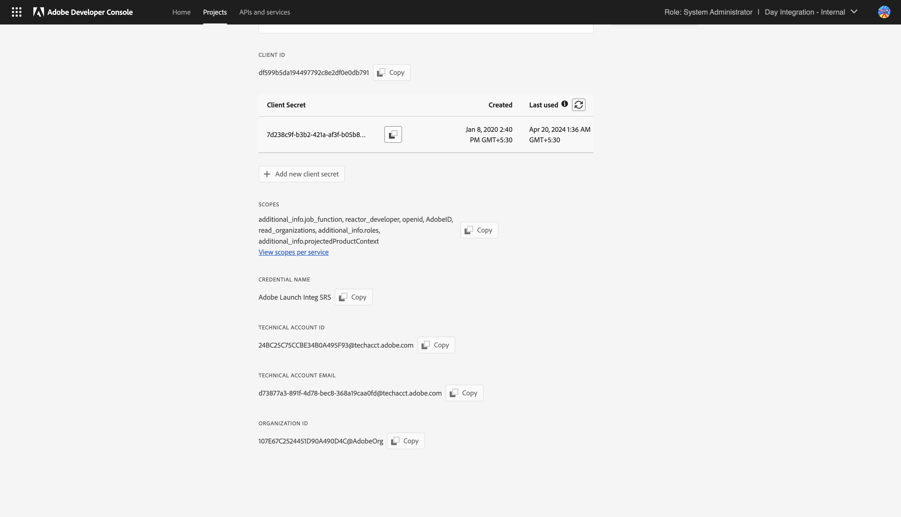

# AEM용 IMS 통합 설정 {#setting-up-ims-integrations-for-aem}

>[!NOTE]
>
>Adobe 고객은 [Adobe Developer 콘솔](https://developer.adobe.com/console) 다양한 API에 액세스할 수 있는 자격 증명을 생성할 수 있습니다. 고객은 OAuth 서버 간 자격 증명에서 단일 페이지 앱에 이르기까지 다양한 자격 증명 유형 중에서 선택합니다. 이제 JWT(자격 증명 유형 서비스 계정)는 더 이상 사용되지 않으며, 서비스 팩 20의 OAuth 서버 간 자격 증명이 제공됩니다. 이 변경 사항은 다운로드할 수 있는 핫픽스를 사용하여 서비스 팩 11부터 서비스 팩 20까지 이전 서비스 팩으로 다시 포팅할 수 있습니다 [여기](https://experience.adobe.com/#/downloads/content/software-distribution/en/aem.html?package=/content/software-distribution/en/details.html/content/dam/aem/public/adobe/packages/cq650/hotfix/ims-jwt-compatibility-package-6.5-1.0.zip).

Adobe Experience Manager(AEM)는 다른 많은 Adobe 솔루션과 통합할 수 있습니다. 예를 들어 Adobe Target, Adobe Analytics 등이 있습니다.

통합은 S2S OAuth로 구성된 IMS 통합을 사용합니다.

* 을(를) 만든 후:

   * [Developer Console의 자격 증명](#credentials-in-the-developer-console)

* 이후에 다음과 같은 작업을 수행할 수 있습니다.

   * (신규) [OAuth 구성](#creating-oauth-configuration) 만들기

   * [기존 JWT 구성을 OAuth 구성으로 마이그레이션](#migrating-existing-JWT-configuration-to-oauth)

>[!CAUTION]
>
>이전에는 구성을 만들 때 [JWT 자격 증명을 사용했지만 이는 현재 Adobe Developer Console에서 더 이상 사용되지 않습니다](/help/sites-administering/jwt-credentials-deprecation-in-adobe-developer-console.md).
>
>이러한 구성은 더 이상 만들거나 업데이트할 수 없지만 OAuth 구성으로 마이그레이션할 수 있습니다.

## Developer Console의 자격 증명 {#credentials-in-the-developer-console}

첫 번째 단계로 Adobe Developer 콘솔에서 OAuth 자격 증명을 구성해야 합니다.

이 구성을 수행하는 방법에 대한 자세한 내용은 요구 사항에 따라 Developer Console 설명서를 참조하십시오.

* 개요:

   * [서버 간 인증](https://developer.adobe.com/developer-console/docs/guides/authentication/ServerToServerAuthentication/)

* 새 OAuth 자격 증명 만들기:

   * [OAuth 서버 간 자격 증명 구현 안내서](https://developer.adobe.com/developer-console/docs/guides/authentication/ServerToServerAuthentication/implementation/)

* 기존 JWT 자격 증명을 OAuth 자격 증명으로 마이그레이션:

   * [서비스 계정(JWT) 자격 증명에서 OAuth 서버 간 자격 증명으로 마이그레이션](https://developer.adobe.com/developer-console/docs/guides/authentication/ServerToServerAuthentication/migration/)

예:

## OAuth 구성 만들기 {#creating-oauth-configuration}

OAuth를 사용하여 새로운 Adobe IMS 통합을 만들려면 다음 작업을 수행하십시오.

1. AEM에서 **도구**, **보안**, **Adobe IMS 통합**&#x200B;으로 이동합니다.

1. **만들기**&#x200B;를 선택합니다.

1. [Developer Console](https://developer.adobe.com/developer-console/docs/guides/authentication/ServerToServerAuthentication/implementation/)의 세부 정보에 따라 구성을 완료합니다. 예:

   

1. 변경 사항을 **저장**&#x200B;합니다.

## 기존 JWT 구성을 OAuth 구성으로 마이그레이션 {#migrating-existing-JWT-configuration-to-oauth}

JWT 자격 증명을 기반으로 기존 Adobe IMS 통합을 마이그레이션하려면 다음 작업을 수행하십시오.

>[!NOTE]
>
>이 예에서는 실행 IMS 구성을 보여 줍니다.

1. AEM에서 **도구**, **보안**, **Adobe IMS 통합**&#x200B;으로 이동합니다.

1. 마이그레이션해야 하는 JWT 구성을 선택합니다. JWT 구성에는 **JWT 자격 증명(사용 안 함)**&#x200B;이라는 경고가 표시됩니다.

1. **속성**&#x200B;을 선택합니다.

   

1. 구성이 읽기 전용으로 열립니다.

   

1. **인증 유형** 드롭다운에서 **OAuth**&#x200B;를 선택합니다.

   

1. 사용 가능한 속성이 업데이트됩니다. Developer Console의 세부 정보를 사용하여 작성합니다.

   

1. **저장 믿 닫기**를 사용하여 업데이트 내용을 유지합니다.
콘솔로 돌아가면 **JWT 자격 증명(더 이상 사용되지 않음)** 경고가 사라졌습니다.
