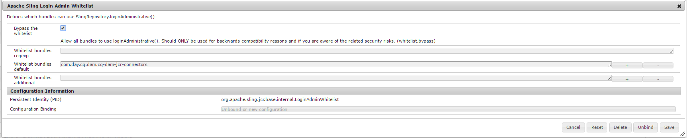

# SharePoint 커넥터{#sharepoint-connector}

이 문서에는 Microsoft SharePoint 2010 및 Microsoft SharePoint 2013 버전 4.0 Adobe JCR Connector에 대한 세부 사항이 포함되어 있습니다.

SharePoint 커넥터는 다음과 같은 기본 기능을 지원합니다.

* SharePoint에서 컨텐츠 및 메타데이터를 읽는 중입니다.
* 기본 SharePoint 인증 및 승인을 적용하여 액세스한 컨텐츠에 대한 SharePoint 보안 설정 확인
* Content Finder를 사용한 컨텐츠 통합
* 외부 리소스와 같은 AEM 구성 요소를 사용하여 SharePoint 이미지 및 비디오 표시
* SharePoint과 AEM Assets 동기화

모든 기능은 SharePoint 컨텐츠 및 서비스의 인터페이스로 기본 SharePoint 웹 서비스를 사용하여 구현됩니다.

>[!NOTE]
>
>SharePoint 커넥터는 AEM 6.1 서비스 팩 2에서도 지원됩니다. 커넥터가 더 이상 가상 저장소 마운트를 지원하지 않으므로 마운트할 수 없습니다. Java API를 사용하여 Sharepoint 리포지토리에 액세스하려면 프로젝트에서 Sharepoint 커넥터의 JCR 저장소 구현을 사용하십시오.
>
>SharePoint 서버 및 관련 IT 인프라의 설치, 구성, 관리 및 IT 작업은 이 문서의 범위를 벗어납니다. 에 대한 자세한 내용은 공급업체 설명서 를 참조하십시오. [SharePoint](https://www.microsoft.com/sharepoint) 를 참조하십시오. 커넥터를 사용하려면 인프라의 이러한 부분을 적절하게 설치, 구성 및 작동해야 합니다.

## 시작하기 {#getting-started}

커넥터를 시작하려면 다음을 수행하십시오.

* Java 7 이상이 설치되어 있는지 확인합니다.
* 소프트웨어 배포에서 커넥터 패키지 배포 파일을 다운로드합니다.
* 올바른 복사 *license.properties* 파일이 들어 있는 디렉토리에 대한 파일 *cq-quickstart-6.4.0.jar* 파일.

* .jar 파일을 두 번 클릭/탭하여 AEM을 시작하거나 명령줄에서 시작합니다.
* 패키지 관리자에서 커넥터 패키지를 설치합니다.
* 커넥터 옵션을 구성합니다.

## SharePoint 커넥터 설치 {#installing-sharepoint-connector}

커넥터는 설치가 용이한 컨텐츠 패키지입니다. 패키지 관리자를 사용하여 패키지를 설치한 다음 SharePoint 서버 URL 및 기타 구성 옵션을 설정합니다. SharePoint 컨텐츠는 AEM 저장소에서 사용할 수 있습니다.

### 설치 요구 사항 {#installation-requirements}

커넥터에는 다음이 필요합니다.

* Java Runtime Environment 1.7 이상
* 네트워크를 통해 사용 가능한 SharePoint 웹 서비스
* SharePoint 서버 URL
* CRX 및 SharePoint 리포지토리의 사용자 자격 증명 및 권한
* [지원되는 플랫폼](#supported-platforms)

SharePoint 커넥터를 [소프트웨어 배포](https://experience.adobe.com/#/downloads/content/software-distribution/en/aem.html?package=/content/software-distribution/en/details.html/content/dam/aem/public/adobe/packages/cq630/featurepack/cq-6.3.0-featurepack-17673).

### 지원되는 플랫폼 {#supported-platforms}

커넥터는 다음을 지원합니다.

* AEM 버전:

   * AEM 6.4, 6.3

* Microsoft SharePoint 버전:

   * Microsoft Office SharePoint 서버(MOSS) 2010
   * Microsoft Office SharePoint 서버(MOSS) 2013

* 커넥터(OEM, 특별 요구 사항, 사용자 정의 인증 방법)의 사용자 정의 배포에 대한 지원이 필요한 경우 해당 지역의 Adobe 사무소에 문의하십시오.

>[!NOTE]
>
>커넥터는 Microsoft에서 공식적으로 지원하는 구성만 지원합니다. 자세한 내용은 [모스 2010](https://technet.microsoft.com/en-us/library/cc262485(office.14).aspx) 및 [모스 2013](https://technet.microsoft.com/en-us/library/cc262485.aspx) 시스템 요구 사항.

### 표준 설치 {#standard-installation}

소프트웨어 배포는 제품 기능, 예 및 핫픽스를 배포하는 데 사용됩니다. 자세한 내용은 [소프트웨어 배포 설명서](https://experienceleague.adobe.com/docs/experience-cloud/software-distribution/home.html#software-distribution).


#### AEM과 통합 {#integrating-with-aem}

커넥터 컨텐츠 패키지를 설치하려면 다음을 수행하십시오.

1. Adobe 지원 티켓을 열어 커넥터 기능 확인을 요청합니다.
1. 사용 가능한 경우 패키지를 다운로드한 다음 AEM 인스턴스에 대해 패키지 관리자를 엽니다.
1. 탭/클릭 **설치** 패키지 설명 페이지에서 을 참조하십시오.
1. 에서 **패키지 설치** 대화 상자, 탭/클릭 **설치**.

   **참고**: 관리자로 로그인했는지 확인합니다.

1. 패키지가 설치되면 탭/클릭합니다 **닫기**.

## SharePoint 커넥터 구성 {#configuring-sharepoint-connector}

SharePoint 커넥터를 설치한 후 커넥터에 대한 애플리케이션 및 SharePoint 레이어를 구성합니다.

SharePoint 저장소 JCR을 준수하도록 SharePoint 서버 URL을 설정합니다. SharePoint 서버와의 연결을 구성하는 추가 매개 변수를 설정할 수 있습니다. 또한 SharePoint 커넥터를 사용하여 인증을 구성합니다.

### SharePoint 서버와의 연결 구성 {#configuring-the-connection-with-the-sharepoint-server}

SharePoint 서버의 URL 및 고급 옵션을 설정하려면 다음 단계를 수행하십시오.

1. OSGi 관리 콘솔로 이동합니다. [http://localhost:4502/system/console/configMgr](http://localhost:4502/system/console/configMgr).
1. 을 검색합니다. **Microsoft Sharepoint용 일 JCR 커넥터** 번들입니다.
1. 구성 값을 편집합니다.
1. SharePoint 서버 URL을 다음 값으로 설정합니다. **작업 공간**.
1. 탭/클릭 **저장**.


&#39;작업 공간&#39; 및 &#39;기본 작업 공간 이름&#39; 매개 변수:

기본적으로 커넥터는 단일 JCR 작업 공간을 표시합니다. 이 작업 영역에 의해 노출된 SharePoint 서버는 &#39;Sharepoint Server URL&#39; 구성 매개 변수를 통해 설정됩니다.

커넥터를 여러 작업 공간에 대해 구성할 수도 있습니다. 이 경우, 각 작업 공간은 작업 공간을 통해 노출되는 각 SharePoint 서버의 URL과 연결됩니다. 작업 공간을 추가하려면 작업 공간 매개 변수에 작업 공간 정의를 추가하십시오. 작업 공간 정의에는 다음 형식이 있습니다.
`<name>`= `<url>` 여기서
`<name>` 는 JCR 작업 공간 및
`<url>` 는 해당 작업 공간에 대한 SharePoint 서버의 URL입니다.

AEM에서 위의 구성 단계와 한 단계 더 떨어져 있습니다. &#39; 허용 목록&#x200B;**com.day.cq.dam.cq-dam-jcr-connectors**&#39; 번들.

AEM에서 번들을 허용 목록 하려면 다음 단계를 수행하십시오.

1. OSGi 관리 콘솔로 이동합니다. http://localhost:4502/system/console/configMgr
1. Apache Sling 로그인 관리자 허용 목록 서비스를 검색합니다.
1. 선택 **허용 목록 무시**.
1. 추가 `com.day.cq.dam.cq-dam-jcr-connectors` 허용 목록 번들 기본
1. 저장을 클릭합니다.



>[!NOTE]
>
>여러 작업 공간을 구성하는 경우 기본 작업 공간 이름 매개 변수에서 기본 작업 공간의 이름을 지정합니다.

인증 관련 매개 변수에 대한 자세한 내용은 [인증](/help/sites-administering/sharepoint-connector.md#configuring-authentication).

### Sharepoint 설정을 확인하는 중 {#verifying-the-sharepoint-setup}

커넥터를 구성한 후 다음을 확인합니다.

* SharePoint 서버가 실행되고 웹 서비스는 커넥터 인스턴스에 액세스할 수 있습니다
* SharePoint 사용자 자격 증명이 유효하며 사용자에게 필요한 SharePoint 권한이 있습니다.
* 커넥터가 제대로 설치 및 구성되었습니다

### SharePoint 서버와 DAM 동기화 구성 {#configuring-dam-sync-with-the-sharepoint-server}

SharePoint Assets를 AEM과 동기화하려면 다음 단계를 수행하십시오.

1. OSGi 관리 콘솔로 이동합니다. [http://localhost:4502/system/console/configMgr](http://localhost:4502/system/console/configMgr).
1. 기본 DMAssetSynchronization 서비스를 검색합니다.
1. 구성 값을 편집합니다.
1. SharePoint 사이트에서 액세스할 수 있는 사용자의 사용자 이름과 해당 암호를 설정합니다.
1. 저장을 클릭합니다.

기본적으로 비활성화된 DAM 동기화 서비스를 활성화합니다.

1. OSGi 웹 콘솔 구성 요소로 이동합니다. [http://localhost:4502/system/console/components](http://localhost:4502/system/console/components)
1. com.day.cq.dam.jcrconnectors.impl.AssetSynchronizationService를 검색합니다.
1. 활성화 를 클릭합니다.

선택적으로, 서로 다른 동기화 주기 간에 동기화 지연을 구성할 수 있습니다.

1. OSGi 관리 콘솔로 이동합니다. [http://localhost:4502/system/console/configMgr](http://localhost:4502/system/console/configMgr)
1. &quot;DAY CQ DAM JCR 커넥터 자산 동기화 서비스&quot;를 검색합니다.
1. 구성 값을 편집합니다.
1. 동기화 기간(초)의 값을 설정합니다.
1. 저장을 클릭합니다.

### 인증 구성 {#configuring-authentication}

Sharepoint에는 다음과 같은 인증 유형을 지원하는 Classic 및 Claims Based 인증 방법이 포함되어 있습니다.

* 기본
* Forms 기반

특히 다음 유형의 인증을 사용할 수 있습니다.

* Classic-Basic
* 클래식 Forms 기반
* Claims-Basic
* 클레임 기반 Forms

Microsoft SharePoint 2010용 AEM JCR Connector 및 Microsoft SharePoint 2013, 버전 4.0 은 다음 모드에서 작동하는 클레임 기반 인증(Microsoft에서 권장함)을 지원합니다.

* **기본/NTLM 인증**: 커넥터는 먼저 기본 인증을 사용하여 연결을 시도합니다. 사용할 수 없는 경우 NTLM 기반 인증으로 전환합니다.
* **Forms 기반 인증**: Sharepoint는 사용자가 로그인 양식(일반적으로 웹 페이지)에 입력하는 자격 증명을 기반으로 사용자를 확인합니다. 시스템은 후속 요청에 대한 ID를 다시 설정하기 위한 키가 포함된 인증된 요청에 대한 토큰을 발급합니다.

**Forms 기반 인증 구성**

이동 위치: [http://localhost:4502/system/console/bundles](http://localhost:4502/system/console/bundles)

1. OSGI -> 구성 을 클릭합니다.
1. &quot;Day JCR Connector for Microsoft Sharepoint&quot; 검색
1. &quot;구성 값 편집&quot;을 클릭합니다
1. &#39;Sharepoint Connection Factory&#39; 값을 &#39;com.day.crx.spi.sharepoint.security.FormsBasedAuthenticationConnectionFactory&#39;로 설정합니다.
1. **저장**&#x200B;을 클릭합니다.

**기본 인증 구성(Windows)**

1. [토큰 인증 비활성화](#disable-token-authentication).
1. 이동 [http://localhost:4502/system/console/bundles](http://localhost:4502/system/console/bundles).
1. OSGI > 구성 을 클릭합니다.
1. 검색 대상 **Microsoft Sharepoint용 일 JCR 커넥터**.
1. 클릭 `Edit the configuration values`.
1. Sharepoint 연결 팩토리의 값을 로 설정합니다. `com.day.crx.spi.sharepoint.security.WindowsAuthenticationConnectionFactory`.
1. **저장**&#x200B;을 클릭합니다.

AEM 및 SharePoint 모두에서 인증된 사용자만 커넥터를 통해 SharePoint 컨텐츠에 액세스할 수 있습니다.

인증에 커넥터 확장을 사용하여 사용자 지정 인증 모듈을 만들 수도 있습니다. 이 모듈은 AEM 사용자의 액세스를 특정 SharePoint 사용자에게 매핑합니다. SharePoint 사용자(사용자 이름 및 암호가 일치해야 함)에 해당하는 AEM 사용자를 만들어 커넥터 인스턴스에 매핑된 SharePoint 컨텐츠를 볼 수 있습니다.

AEM에서 사용자를 만들려면:

1. 관리자 사용자 http://localhost:9502/with에 로그인합니다.
1. 도구 를 클릭합니다.
1. 보안을 클릭합니다.
1. 사용자를 클릭합니다.
1. 클릭 **사용자 만들기**.
1. 사용자 ID(SharePoint에 액세스할 수 있는 사용자 이름)를 제공합니다.
1. 해당 암호를 입력합니다.
1. 녹색 확인 표시 기호를 클릭하여 사용자를 생성합니다.

관리 그룹에서 사용자를 추가하려면:

1. 그룹 관리로 이동합니다.
1. &#39;a&#39; 노드를 클릭합니다.
1. &#39;관리자&#39;를 클릭합니다.
1. 앞에 텍스트 상자에 위에 만든 사용자 ID를 입력합니다 **찾아보기** 버튼을 클릭합니다.
1. 녹색 확인 표시 기호를 클릭하여 사용자를 관리 그룹에 추가합니다.

### 토큰 인증 비활성화 {#disable-token-authentication}

1. 패키지 다운로드 및 설치 `basic auth`. `zip` 소프트웨어 배포

1. 빠른 시작을 닫습니다.
1. 파일을 엽니다. *\crx-quickstart\repository\repository.xml*.
1. 태그 찾기 `<LoginModule class="com.day.crx.core.CRXLoginModule"> ... </LoginModule>.`
1. 태그 삽입 `<param name="disableTokenAuth" value="true"/>` 4단계에서 언급한 태그 내에 있어야 합니다.
1. xml 파일을 저장하고 닫습니다.
1. QuickStart를 다시 시작하고 자격 증명으로 로그인합니다.

#### SharePoint 서버의 다른 인증 방법 지원 {#supporting-different-authentication-methods-of-the-sharepoint-server}

표준 버전에서는 커넥터가 표준 IIS를 지원합니다 **Windows** 인증(기본) 및 Forms 기반 인증(토큰 기반)입니다. 다음 [기타 인증 방법](https://technet.microsoft.com/en-us/library/cc262350.aspx#section2) 확장성 메커니즘을 통해 지원할 수 있습니다.

다음 단계에서는 SharePoint 서버의 다양한 인증 방법을 지원하기 위해 표준 인증을 확장하는 것과 관련된 지침을 제공합니다.

1. 구현 `com.day.crx.spi.sharepoint.security.SharepointConnectionFactory` 를 입력하여 특정 인증 프로세스의 클라이언트 측을 처리하게 됩니다.
1. 설치 `SharepointConnectionFactory` 조각 호스트를 사용하여 조각 번들로 구현 `com.day.crx.spi.crx2sharepoint-bundle`.

   Maven을 사용하는 경우 `maven-bundle-plugin` 프로젝트의 요구 사항에 맞게 다음을 수행하십시오.

   ```xml
              <plugin>
                  <groupId>org.apache.felix</groupId>
                  <artifactId>maven-bundle-plugin</artifactId>
                  <extensions>true</extensions>
                  <configuration>
                      <instructions>
                          <Export-Package />
                          <Private-Package>
                              <!-- your private package here -->
                          </Private-Package>
                          <Fragment-Host>
                              com.day.crx.spi.crx2sharepoint-bundle
                          </Fragment-Host>
                       </instructions>
                  </configuration>
              </plugin>
   ```

1. 등록 `SharepointConnectionFactory` 커넥터 구성에서 구현. 커넥터의 구성 창에서 **고급 옵션**. 에서 **Sharepoint 연결 팩토리** 필드에서 구현의 이름을 지정합니다 `com.day.crx.spi.sharepoint.auth.CustomConnectionFactory`.

1. 커넥터를 다시 시작합니다.
