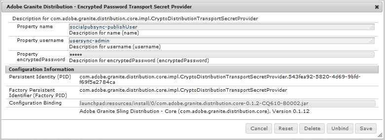

# 사용자 동기화{#user-synchronization}

## 소개 {#introduction}

배포가 [팜 게시](/help/sites-deploying/recommended-deploys.md#tarmk-farm)를 입력하면 구성원이 모든 게시 노드에서 로그인하여 해당 데이터를 볼 수 있어야 합니다.

작성 환경에서는 게시 환경에 생성된 사용자 및 사용자 그룹(사용자 데이터)이 필요하지 않습니다.

작성 환경에서 생성된 대부분의 사용자 데이터는 작성 환경에 유지되기 위한 것이며 게시 인스턴스에 복사되지 않습니다.

동일한 사용자 데이터에 액세스할 수 있도록 하나의 게시 인스턴스에서 수행한 등록 및 수정 사항을 다른 게시 인스턴스와 동기화해야 합니다.

AEM 6.1부터 사용자 동기화가 활성화되면 사용자 데이터가 팜의 게시 인스턴스 간에 자동으로 동기화되고 작성자에 대해서는 생성되지 않습니다.

## Sling 배포 {#sling-distribution}

사용자 데이터와 해당 [ACL](/help/sites-administering/security.md)에 저장됩니다. [Oak 코어](/help/sites-deploying/platform.md), Oak JCR 아래의 레이어이며 [Oak API](https://helpx.adobe.com/experience-manager/6-5/sites/developing/using/reference-materials/javadoc/org/apache/jackrabbit/oak/api/package-tree.html). 자주 업데이트되는 경우 사용자 데이터를 [Sling 컨텐츠 배포](https://github.com/apache/sling/blob/trunk/contrib/extensions/distribution/README.md) (Sling 배포).

기존 복제와 비교하여 Sling 배포를 사용한 사용자 동기화를 통해 얻을 수 있는 이점은 다음과 같습니다.

* *사용자*, *사용자 프로필* 및 *사용자 그룹* 게시에서 작성자가 작성되지 않음

* Sling 배포 는 jcr 이벤트에 속성을 설정하여 무한 복제 루프에 대한 걱정 없이 게시 측 이벤트 리스너 내에서 작업할 수 있습니다
* Sling 배포는 사용자 데이터를 비원래 게시 인스턴스로만 전송하므로 불필요한 트래픽이 제거됩니다
* [ACL](/help/sites-administering/security.md) 사용자 노드에 설정된 는 동기화에 포함됩니다

>[!NOTE]
>
>세션이 필요한 경우 SSO 솔루션을 사용하거나 고정 세션을 사용하고, 고객이 다른 게시자로 전환되면 로그인하도록 하는 것이 좋습니다.

>[!CAUTION]
>
>의 동기화 ***관리자*** 사용자 동기화가 활성화되어 있어도 그룹은 지원되지 않습니다. 대신 &#39;diff 가져오기&#39;에 대한 오류가 오류 로그에 기록됩니다.
>
>따라서 배포가 게시 팜인 경우 *에서 사용자를 추가하거나 제거할 경우&#x200B;**관리자** 그룹, 각 게시 인스턴스에서 수동으로 수정해야 합니다.

## 사용자 동기화 활성화 {#enable-user-sync}

>[!NOTE]
>
>기본적으로 사용자 동기화는 `disabled`.
>
>사용자 동기화 활성화에는 수정 작업이 포함됩니다 *기존* OSGi 구성.
>
>사용자 동기화를 활성화한 결과로 새 구성을 추가할 필요가 없습니다.

사용자 동기화는 사용자 데이터가 작성자에 대해 만들어지지 않더라도 작성 환경을 사용하여 사용자 데이터 배포를 관리합니다. 구성 대부분이 작성 환경에서 발생하지만, 전부는 아닙니다. 각 단계는 작성 환경에서 수행되는지 아니면 게시에서 수행되는지를 명확하게 식별합니다.

다음은 사용자 동기화를 활성화하는 데 필요한 단계이며 [문제 해결](#troubleshooting) 섹션:

### 사전 요구 사항 {#prerequisites}

1. 사용자 및 사용자 그룹이 이미 하나의 게시자에서 생성된 경우 [수동 동기화](#manually-syncing-users-and-user-groups) 사용자 동기화를 구성 및 활성화하기 전에 모든 게시자에게 사용자 데이터를 제공합니다.

사용자 동기화가 활성화되면 새로 만든 사용자와 그룹만 동기화됩니다.

1. 최신 코드가 설치되어 있는지 확인합니다.

* [AEM 플랫폼 업데이트](https://helpx.adobe.com/kr/experience-manager/kb/aem62-available-hotfixes.html)
* [AEM Communities 업데이트](/help/communities/deploy-communities.md#latestfeaturepack)

### 1. Apache Sling Distribution Agent - Sync Agent Factory {#apache-sling-distribution-agent-sync-agents-factory}

**사용자 동기화 사용**

* **작성자**

   * 관리자 권한으로 로그인
   * 액세스 [웹 콘솔](/help/sites-deploying/configuring-osgi.md)

      * 예 [https://localhost:4502/system/console/configMgr](https://localhost:4502/system/console/configMgr)
   * 찾기 `Apache Sling Distribution Agent - Sync Agents Factory`

      * 편집할 기존 구성을 선택합니다(연필 아이콘). `name`: **`socialpubsync`**

      * 선택 `Enabled` 확인란
      * 선택 `Save`


### 2. 인증된 사용자 만들기 {#createauthuser}

**권한 구성**
이 승인된 사용자는 3단계에서 작성자에 대한 Sling 배포를 구성하는 데 사용됩니다.

* **각 게시 인스턴스**

   * 관리자 권한으로 로그인
   * 액세스 [보안 콘솔](/help/sites-administering/security.md)

      * 예 [https://localhost:4503/useradmin](https://localhost:4503/useradmin)
   * 새 사용자 만들기

      * 예, `usersync-admin`
   * 이 사용자를 **`administrators`** 사용자 그룹
   * [/home에 이 사용자에 대한 ACL 추가](#howtoaddacl)

      * `Allow jcr:all` 제한 `rep:glob=*/activities/*`


>[!CAUTION]
>
>새 사용자를 만들어야 합니다.
>
>* 할당된 기본 사용자는 **`admin`**.
>* 사용 안 함 `communities-user-admin user.`
>


#### ACL 추가 방법 {#addacls}

* 액세스 CRXDE Lite

   * 예 [https://localhost:4503/crx/de](https://localhost:4503/crx/de)

* 선택 `/home` 노드
* 오른쪽 창에서 `Access Control` 탭
* 선택 `+` ACL 항목 추가 단추

   * **주체**: *사용자 동기화를 위해 만든 사용자 검색*
   * **유형**: `Allow`
   * **권한**: `jcr:all`
   * **제한 사항** rep:glob: `*/activities/*`
   * 선택 **확인**

* 선택 **모두 저장**


참고 항목

* [액세스 권한 관리](/help/sites-administering/user-group-ac-admin.md#access-right-management)
* 문제 해결 섹션 [응답 처리 중 작업 예외 수정](#modify-operation-exception-during-response-processing).

### 3. Adobe Granite 배포 - 암호화된 암호 전송 암호 공급자 {#adobegraniteencpasswrd}

**권한 구성**

권한이 부여된 사용자가 되면 **`administrators`**모든 게시 인스턴스에 사용자 그룹이 생성되었으며, 이 권한이 있는 사용자는 작성자에서 게시로 사용자 데이터를 동기화할 수 있는 권한이 있는 작성자에서 식별되어야 합니다.

* **작성자**

   * 관리자 권한으로 로그인
   * 액세스 [웹 콘솔](/help/sites-deploying/configuring-osgi.md)

      * 예 [https://localhost:4502/system/console/configMgr](https://localhost:4502/system/console/configMgr)
   * 찾기 `com.adobe.granite.distribution.core.impl.CryptoDistributionTransportSecretProvider.name`
   * 편집할 기존 구성을 선택합니다(연필 아이콘). `property name`: **`socialpubsync-publishUser`**

   * 사용자 이름과 암호를 [인증된 사용자](#createauthuser) 2단계에서 게시 시 생성됨

      * 예, `usersync-admin`




### 4. Apache Sling Distribution Agent - Queue Agent Factory {#apache-sling-distribution-agent-queue-agents-factory}

**사용자 동기화 사용**

* **게시**:

   * 관리자 권한으로 로그인
   * 액세스 [웹 콘솔](/help/sites-deploying/configuring-osgi.md)

      * 예 [https://localhost:4503/system/console/configMgr](https://localhost:4503/system/console/configMgr)
   * 찾기 `Apache Sling Distribution Agent - Queue Agents Factory`

      * 편집할 기존 구성을 선택합니다(연필 아이콘). `Name`: `socialpubsync-reverse`

      * 선택 `Enabled` 확인란
      * 선택 `Save`
   * **각 게시 인스턴스에 대해 **를 반복합니다


### 5. Adobe Social 동기화 - Diff Observer Factory {#diffobserver}

**그룹 동기화 사용**

* **각 게시 인스턴스**:

   * 관리자 권한으로 로그인
   * 액세스 [웹 콘솔](/help/sites-deploying/configuring-osgi.md)

      * 예 [https://localhost:4503/system/console/configMgr](https://localhost:4503/system/console/configMgr)
   * 찾기 **`Adobe Social Sync - Diff Observer Factory`**

      * 편집할 기존 구성을 선택합니다(연필 아이콘).

         확인 `agent name`: `socialpubsync-reverse`

      * 선택 `Enabled` 확인란
      * 선택 `Save`


### 6. Apache Sling 배포 트리거 - 예약된 트리거 공장 {#apache-sling-distribution-trigger-scheduled-triggers-factory}

**(선택 사항) 폴링 간격을 수정합니다**

기본적으로 작성자는 30초마다 변경 사항을 폴링합니다. 이 간격을 변경하려면

* **작성자**

   * 관리자 권한으로 로그인
   * 액세스 [웹 콘솔](/help/sites-deploying/configuring-osgi.md)

      * 예 [https://localhost:4502/system/console/configMgr](https://localhost:4502/system/console/configMgr)
   * 찾기 `Apache Sling Distribution Trigger - Scheduled Triggers Factory`

      * 편집할 기존 구성을 선택합니다(연필 아이콘).

         * 확인 `Name`: `socialpubsync-scheduled-trigger`
      * 설정 `Interval in Seconds` 원하는 간격으로 이동
      * 선택 `Save`


## 여러 게시 인스턴스에 대한 구성 {#configure-for-multiple-publish-instances}

기본 구성은 단일 게시 인스턴스에 대한 것입니다. 사용자 동기화를 활성화하는 이유는 게시 팜과 같이 여러 게시 인스턴스를 동기화하기 위한 것이므로 추가 게시 인스턴스를 동기화 에이전트 팩토리에 추가해야 합니다.

### 7. Apache Sling Distribution Agent - Sync Agent Factory {#apache-sling-distribution-agent-sync-agents-factory-1}

**게시 인스턴스 추가:**

* **작성자**

   * 관리자 권한으로 로그인
   * 액세스 [웹 콘솔](/help/sites-deploying/configuring-osgi.md)

      * 예 [https://localhost:4502/system/console/configMgr](https://localhost:4502/system/console/configMgr)
   * 찾기 `Apache Sling Distribution Agent - Sync Agents Factory`

      * 편집할 기존 구성을 선택합니다(연필 아이콘). `Name`: `socialpubsync`


* **내보내기 끝점**
각 게시자에 대한 내보내기 끝점이 있어야 합니다. 예를 들어 두 개의 게시자인 localhost:4503 및 4504가 있는 경우 두 개의 항목이 있어야 합니다.

   * `https://localhost:4503/libs/sling/distribution/services/exporters/socialpubsync-reverse`
   * `https://localhost:4504/libs/sling/distribution/services/exporters/socialpubsync-reverse`

* **가져오기 끝점**
각 게시자에 대한 가져오기 끝점이 있어야 합니다. 예를 들어 두 개의 게시자인 localhost:4503 및 4504가 있는 경우 두 개의 항목이 있어야 합니다.

   * `https://localhost:4503/libs/sling/distribution/services/importers/socialpubsync`
   * `https://localhost:4504/libs/sling/distribution/services/importers/socialpubsync`

* 선택 `Save`

### 8. AEM Communities 사용자 동기화 수신기 {#aem-communities-user-sync-listener}

**(선택 사항) 추가 JCR 노드 동기화**

여러 게시 인스턴스 간에 동기화하려는 사용자 지정 데이터가 있는 경우:

* **각 게시 인스턴스**:

   * 관리자 권한으로 로그인
   * 액세스 [웹 콘솔](/help/sites-deploying/configuring-osgi.md)

      * 예, `https://localhost:4503/system/console/configMgr`
   * 찾기 `AEM Communities User Sync Listener`
   * 편집할 기존 구성을 선택합니다(연필 아이콘). `Name`: `socialpubsync-scheduled-trigger`


* **노드 유형**
동기화할 노드 유형 목록입니다. sling:Folder 이외의 노드 유형은 여기에 나열해야 합니다(sling:folder는 별도로 처리됨).
동기화할 노드 유형의 기본 목록:

   * rep:User
   * nt:unstructured
   * nt:resource

* **Ignorable 속성**
변경 사항이 감지되면 무시됩니다. 이러한 속성에 대한 변경 사항은 다른 변경 사항의 부작용으로 동기화될 수 있지만(동기화는 항상 노드 수준에 있으므로) 이러한 속성을 변경해도 동기화를 트리거하지 않습니다.
무시할 기본 속성:

   * cq:lastModified

* **Ignorable 노드**
동기화 중에 완전히 무시됩니다. 이러한 하위 경로 아래에 있는 어떤 것도 항상 동기화되지 않습니다.
무시할 기본 노드:

   * .tokens
   * system

* **분산 폴더**
동기화가 필요하지 않으므로 대부분의 sling:Folders는 무시됩니다. 여기에 몇 가지 예외가 나열됩니다.
동기화할 기본 폴더

   * 세그먼트/점수 책정
   * 소셜/관계
   * 활동

### 9. 고유 Sling ID {#unique-sling-id}

>[!CAUTION]
>
>Sling ID가 둘 이상의 게시 인스턴스 간에 일치하는 경우 사용자 그룹 동기화가 실패합니다.

Sling ID가 게시 팜의 여러 게시 인스턴스에 대해 동일하면 사용자 그룹이 동기화되지 않습니다.

모든 Sling ID 값이 다른지 확인하려면 각 게시 인스턴스에서 다음을 수행하십시오.

1. 찾아보기 `http://<host>:<port>/system/console/status-slingsettings`
1. 다음 값 확인 **Sling ID**


게시 인스턴스의 Sling ID가 다른 게시 인스턴스의 Sling ID와 일치하는 경우 다음을 수행합니다.

1. 일치하는 Sling ID가 있는 게시 인스턴스 중 하나를 중지합니다
1. crx-quickstart/launchpad/felix 디렉터리에서

   * 라는 파일을 검색하고 삭제합니다. *sling.id.file*

      * 예를 들어, Linux 시스템에서
         `rm -i $(find . -type f -name sling.id.file)`

      * 예를 들어, Windows 시스템에서
         `use windows explorer and search for *sling.id.file*`

1. 게시 인스턴스 시작

   * 시작할 때 새 Sling ID가 할당됩니다.

1. 유효성 검사 **Sling ID** 이제 고유함

모든 게시 인스턴스에 고유한 Sling ID가 있을 때까지 이 단계를 반복합니다.

## 저장소 패키지 빌더 팩토리 {#vault-package-builder-factory}

업데이트가 제대로 동기화되려면 사용자 동기화를 위해 자격 증명 모음 패키지 빌더를 수정해야 합니다.

* 각 AEM 게시 인스턴스
* 액세스 [웹 콘솔](/help/sites-deploying/configuring-osgi.md)

   * 예 [https://localhost:4503/system/console/configMgr](https://localhost:4503/system/console/configMgr)

* 위치 `Apache Sling Distribution Packaging - Vault Package Builder Factory`

   * `Builder name: socialpubsync-vlt`

* 편집 아이콘 선택
* 두 개 추가 `Package Node Filters`:

   * `/home/users|-.*/.tokens`
   * `/home/users|-.*/rep:cache`

* 정책 처리:

   * 기존 rep:policy 노드를 새 노드로 덮어쓰려면 세 번째 패키지 필터를 추가합니다.

      * `/home/users|+.*/rep:policy`
   * 정책이 배포되지 않도록

      * `Acl Handling:` `IGNORE`


## 다음의 경우에 발생하는 작업.. {#what-happens-when}

### 사용자가 게시할 때 프로필을 직접 등록하거나 편집합니다 {#user-self-registers-or-edits-profile-on-publish}

디자인적으로 게시 환경(자체 등록)에서 만든 사용자 및 프로필은 작성 환경에 표시되지 않습니다.

토폴로지가 [팜 게시](/help/sites-deploying/recommended-deploys.md#tarmk-farm) 및 사용자 동기화가 올바르게 구성되었습니다. *사용자 *와 *사용자 프로필* 는 Sling 배포를 사용하여 게시 팜 간에 동기화됩니다.

### 사용자 또는 사용자 그룹은 보안 콘솔을 사용하여 만들어집니다 {#users-or-user-groups-are-created-using-security-console}

디자인에서 게시 환경에서 만든 사용자 데이터는 작성 환경에 나타나지 않고 그 반대의 경우도 마찬가지입니다.

이 [사용자 관리 및 보안](/help/sites-administering/security.md) 콘솔은 게시 환경에서 새 사용자를 추가하는 데 사용됩니다. 필요한 경우 사용자 동기화는 새 사용자와 해당 그룹 구성원을 다른 게시 인스턴스와 동기화합니다. 사용자 동기화는 보안 콘솔을 통해 생성된 사용자 그룹도 동기화합니다.

## 문제 해결 {#troubleshooting}

### 사용자 동기화를 오프라인으로 전환하는 방법 {#how-to-take-user-sync-offline}

사용자 동기화를 오프라인으로 전환하려면 다음을 수행하십시오. [게시자 제거](#how-to-remove-a-publisher) 또는 [데이터 수동 동기화](#manually-syncing-users-and-user-groups): 배포 큐가 비어 있고 조용해야 합니다.

분배 큐의 상태를 확인하려면:

* 작성자:

   * 사용 [CRXDE Lite](/help/sites-developing/developing-with-crxde-lite.md)

      * 의 항목 찾기 `/var/sling/distribution/packages`

         * 패턴으로 이름이 지정된 폴더 노드 `distrpackage_*`
   * 사용 [패키지 관리자](/help/sites-administering/package-manager.md)

      * 보류 중인 패키지(아직 설치되지 않음)를 찾습니다.

         * 패턴으로 이름이 지정됨 `socialpubsync-vlt*`
         * 작성자 `communities-user-admin`


배포 큐가 비어 있으면 사용자 동기화를 사용하지 않습니다.

* 작성자

   * *의 선택을 취소합니다. `Enabled` 확인란 [Apache Sling Distribution Agent - Sync Agent Factory](#apache-sling-distribution-agent-sync-agents-factory)

작업이 완료되면 사용자 동기화를 다시 활성화하려면 다음을 수행합니다.

* 작성자

   * 확인 `Enabled` 확인란 [Apache Sling Distribution Agent - Sync Agent Factory](#apache-sling-distribution-agent-sync-agents-factory)

### 사용자 동기화 진단 {#user-sync-diagnostics}

User Sync Diagnostics 는 구성을 확인하고 문제를 식별하는 도구입니다.

작성자의 경우 다음을 통해 기본 콘솔에서 탐색하면 됩니다. **도구, 작업, 진단, 사용자 동기화 진단**

User Sync Diagnostics 콘솔을 입력하면 결과가 표시됩니다.

사용자 동기화가 활성화되지 않은 경우 다음과 같이 표시됩니다.


#### 게시자에 대한 진단 실행 방법 {#how-to-run-diagnostics-for-publishers}

작성 환경에서 진단 프로그램이 실행되면 전달/실패 결과에 [정보] 확인을 위해 구성된 게시 인스턴스 목록을 표시하는 섹션을 참조하십시오.

목록에 해당 인스턴스에 대한 진단을 실행하는 각 게시 인스턴스의 URL이 포함되어 있습니다. url 매개 변수 `syncUser` 이(가) 진단 URL에 추가되고 해당 값이 *권한 있는 동기화 사용자* 에서 생성됨 [2단계](#createauthuser).

**참고**: url을 시작하기 전에 *권한 있는 동기화 사용자* 해당 게시 인스턴스에 이미 로그인해야 합니다.


### 구성이 잘못 추가됨 {#configuration-improperly-added}

사용자 동기화가 작동하지 않을 때 가장 일반적인 문제는 추가 구성이 *추가됨*. 대신, 기존 *기본 구성은 다음과 같습니다. *편집됨*.

다음은 편집된 기본 구성이 웹 콘솔에 표시되는 방식에 대한 보기입니다. 두 개 이상의 인스턴스가 나타나면 추가된 구성을 제거해야 합니다.

#### (작성자) Apache Sling Distribution Agent 1개 - Sync Agent Factory {#author-one-apache-sling-distribution-agent-sync-agents-factory}


#### (작성자) 하나의 Apache Sling Distribution Transport Credentials - DistributionTransportSecretProvider 기반의 사용자 자격 증명 {#author-one-apache-sling-distribution-transport-credentials-user-credentials-based-distributiontransportsecretprovider}


#### (게시) 하나의 Apache Sling Distribution Agent - Queue Agent Factory {#publish-one-apache-sling-distribution-agent-queue-agents-factory}


#### (게시) 하나의 Adobe Social 동기화 - Diff Observer Factory {#publish-one-adobe-social-sync-diff-observer-factory}


#### (작성자) 하나의 Apache Sling 배포 트리거 - 예약된 트리거 출하 시 {#author-one-apache-sling-distribution-trigger-scheduled-triggers-factory}


### 응답 처리 중 작업 예외 수정 {#modify-operation-exception-during-response-processing}

로그에 다음 내용이 표시되는 경우:

`org.apache.sling.servlets.post.impl.operations.ModifyOperation Exception during response processing.`

`java.lang.IllegalStateException: This tree does not exist`

그런 다음 섹션이 [2. 인증된 사용자 만들기](#createauthuser) 제대로 수행되었습니다.

이 섹션에서는 모든 게시 인스턴스에 있는 인증된 사용자를 만들고 이를 작성자의 &#39;비밀 공급자&#39; OSGi 구성에서 식별하는 방법에 대해 설명합니다. 기본적으로 사용자는 `admin`.

인증된 사용자는 **`administrators`** 해당 그룹에 대한 사용자 그룹 및 권한은 변경할 수 없습니다.

승인된 사용자는 모든 게시 인스턴스에 대해 다음 권한과 제한을 명시적으로 가져야 합니다.

| **경로** | **jcr:all** | **rep:glob** |
|---|---|---|
| /home | X | &#42;/활동/&#42; |
| /home/users | X | &#42;/활동/&#42; |
| /home/groups | X | &#42;/활동/&#42; |

의 구성원으로서 `administrators` 그룹에서는 권한이 있는 사용자에게 모든 게시 인스턴스에 대해 다음 권한이 있어야 합니다.

| **경로** | **jcr:all** | **jcr:read** | **rep:write** |
|---|---|---|---|
| /etc/packages/sling/distribution |  |  | X |
| /libs/sling/distribution |  | X |  |
| /var |  |  | X |
| /var/eventing |  | X | X |
| /var/sling/distribution |  | X | X |

### 사용자 그룹 동기화 실패 {#user-group-sync-failed}

Sling ID가 둘 이상의 게시 인스턴스 간에 일치하는 경우 사용자 그룹 동기화가 실패합니다.

섹션을 참조하십시오. [9. 고유 Sling ID](#unique-sling-id)

### 사용자 및 사용자 그룹 수동 동기화 {#manually-syncing-users-and-user-groups}

* 사용자 및 사용자 그룹이 있는 게시자에서:

   * [활성화되어 있으면 사용자 동기화를 사용하지 않습니다.](#how-to-take-user-sync-offline)
   * [패키지 만들기](/help/sites-administering/package-manager.md#creating-a-new-package) 의 `/home`

      * 패키지 편집 시

         * 필터 탭: 필터 추가: 루트 경로: `/home`
         * 고급 탭: AC 처리: `Overwrite`
   * [패키지 내보내기](/help/sites-administering/package-manager.md#downloading-packages-to-your-file-system)


* 다른 게시 인스턴스에서 다음을 수행합니다.

   * [패키지 가져오기](/help/sites-administering/package-manager.md#installing-packages)

사용자 동기화를 구성하거나 활성화하려면 1단계로 이동하십시오. [Apache Sling Distribution Agent - Sync Agent Factory](#apache-sling-distribution-agent-sync-agents-factory)

### 게시자를 사용할 수 없게 되는 경우 {#when-a-publisher-becomes-unavailable}

게시 인스턴스를 사용할 수 없게 되면 나중에 다시 온라인으로 전환될 경우 해당 인스턴스를 제거하지 않아야 합니다. 변경 사항이 게시자에 대해 대기열에 추가되고, 다시 온라인 상태가 되면 변경 사항이 처리됩니다.

게시 인스턴스가 온라인 상태가 되지 않을 경우, 오프라인 상태가 영구적으로 되면 큐 증가로 인해 작성 환경에서 눈에 띄는 디스크 공간 사용이 발생하므로 이 인스턴스를 제거해야 합니다.

게시자가 다운되면 작성자 로그에는 다음과 유사한 예외가 발생합니다.

```
28.01.2016 15:57:48.475 ERROR
 [pool-12-thread-34-org_apache_sling_distribution_queue_socialpubsync_endpoint1
 (org/apache/sling/distribution/queue/socialpubsync/endpoint1)]
 org.apache.sling.distribution.agent.impl.SimpleDistributionAgent [agent][socialpubsync] could not deliver package distrpackage_1454014575838_a2b45ec8-0400-42f3-bed8-ae09b66381cb
 org.apache.sling.distribution.packaging.DistributionPackageImportException: failed in importing package ...
```

### 게시자 제거 방법 {#how-to-remove-a-publisher}

게시자를 [Apache Sling Distribution Agent - Sync Agent Factory](#apache-sling-distribution-agent-sync-agents-factory): 배포 큐가 비어 있고 조용해야 합니다.

* 작성자:

   * [사용자 동기화를 오프라인으로 전환](#how-to-take-user-sync-offline)
   * 팔로우 [7단계](#apache-sling-distribution-agent-sync-agents-factory) 두 서버 목록에서 게시자를 제거하려면

      * `Exporter Endpoints`
      * `Importer Endpoints`
   * 사용자 동기화 다시 활성화

      * 확인 `Enabled` 확인란 [Apache Sling Distribution Agent - Sync Agent Factory](#apache-sling-distribution-agent-sync-agents-factory)
