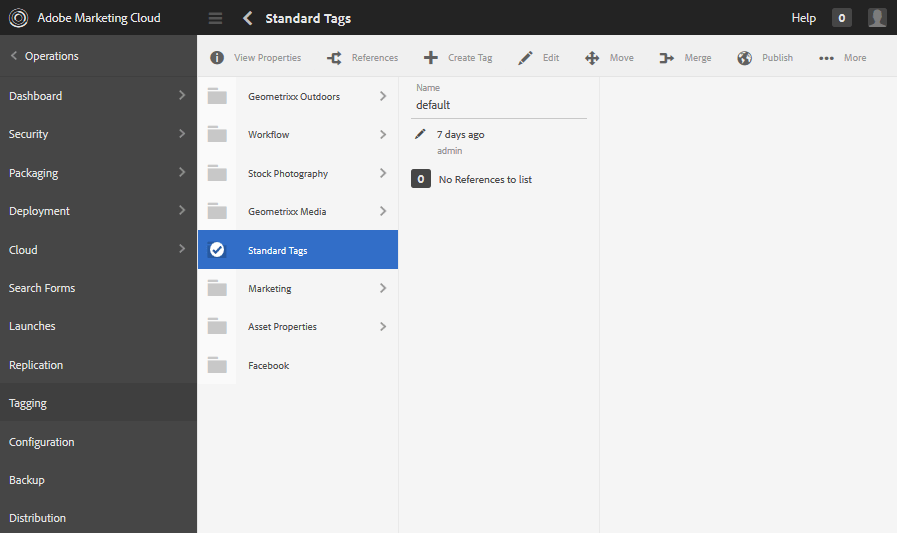
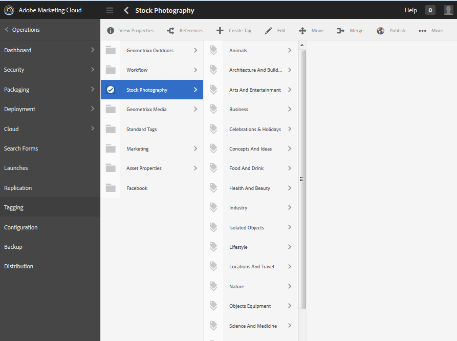

# 태그 관리 {#administering-tags}

태그는 웹 사이트에 포함된 컨텐츠를 빠르고 손쉽게 분류할 수 있는 방법입니다. 검색 결과로 컨텐츠를 보다 신속하게 찾을 수 있도록 해주는 키워드 또는 레이블(메타데이터)으로 생각할 수 있습니다.

Adobe Experience Manager(AEM)에서 태그는

* 페이지에 대한 컨텐트 노드([태그 사용](/help/sites-authoring/tags.md) 참조)

* 자산에 대한 메타데이터 노드(디지털 자산에 대한 메타데이터 관리[ 참조)](/help/assets/metadata.md)

페이지 및 자산 외에도 태그는 AEM Communities 기능에 사용됩니다.

* 사용자가 생성한 콘텐츠([UGC 태그 지정 참조)](/help/communities/tag-ugc.md)

* 지원 리소스([Tagging 지원 리소스](/help/communities/functions.md#catalog-function) 참조)

## 태그 기능 {#tag-features}

AEM에 포함된 태그의 일부 기능은 다음과 같습니다.

* 태그를 다양한 네임스페이스로 그룹화할 수 있습니다. 이러한 계층 구조를 통해 분류 체계를 만들 수 있습니다. 이러한 분류법은 AEM을 통해 전세계적으로 존재합니다.
* 새로 만든 태그의 주요 제한 사항은 특정 네임스페이스 내에서 고유해야 한다는 것입니다.
* 태그 제목에는 태그 경로 분판 문자가 포함되지 않아야 합니다(있는 경우 표시되지 않음).

   * 콜론 `:` - 네임스페이스 태그를 구분합니다.
   * 슬래시 `/` - 하위 태그 구분

* 태그는 작성자 및 사이트 방문자가 적용할 수 있습니다. 작성자가 누구인지에 관계없이 페이지에 지정할 때나 검색 시에 모든 형태의 태그를 선택할 수 있습니다.
* 태그를 만들고 분류법을 수정할 수 있습니다. 이 분류는 &quot;tag-administrators&quot; 그룹 구성원 및 `/content/cq:tags`에 대한 수정 권한이 있는 구성원이 수정할 수 있습니다.

   * 하위 태그가 포함된 태그를 컨테이너 태그로 부릅니다
   * 컨테이너 태그가 아닌 태그는 리프 태그라고 합니다
   * 태그 네임스페이스는 리프 태그 또는 컨테이너 태그입니다.

* 태그는 [검색 구성 요소](https://helpx.adobe.com/experience-manager/core-components/using/quick-search.html)에서 컨텐츠를 쉽게 찾을 수 있도록 사용됩니다.
* 태그는 사용자의 태그 클라우드를 모니터링하여 타깃팅된 컨텐츠를 제공하는 [Teaser 구성 요소](https://helpx.adobe.com/experience-manager/core-components/using/teaser.html)에서 사용합니다.
* 태깅이 컨텐츠의 중요한 측면인 경우

   * 태그를 사용하는 페이지와 함께 패키징해야 합니다.
   * [태그 권한](#setting-tag-permissions) 읽기 액세스 활성화

## 태깅 콘솔 {#tagging-console}

태깅 콘솔은 태그 및 해당 택소노미를 만들고 관리하는 데 사용됩니다. 한 가지 목표는 기본적으로 동일한 것과 관련하여 비슷한 태그가 많이 발생하지 않도록 하는 것입니다.예를 들어, 페이지 및 페이지 또는 신발 및 신발을 들 수 있습니다.

태그는 네임스페이스로 그룹화하거나, 새 태그를 만들기 전에 기존 태그의 사용을 검토하고, 현재 참조된 컨텐츠에서 태그를 끊지 않고 다시 구성하여 관리합니다.

태깅 콘솔에 액세스하려면:

* 작성자
* 관리자 권한으로 로그인
* 전역 탐색에서

   * **`Tools`** 선택
   * **`General`** 선택
   * **`Tagging`** 선택

### 네임스페이스 {#creating-a-namespace} 만들기

새 네임스페이스를 만들려면 **`Create Namespace`** 아이콘을 선택합니다.

네임스페이스는 자체 태그이며 하위 태그를 포함할 필요가 없습니다. 하지만 택소노미를 계속 만들려면 [create sub-tags](#creating-tags)를 사용합니다. 이 태그는 리프 태그 또는 컨테이너 태그일 수 있습니다.

 

* **제목**

   *(필수)* 네임스페이스의 표시 제목입니다.

* **이름**
   *(선택 사항)* 네임스페이스의 이름입니다. 지정하지 않으면 Title에서 유효한 노드 이름이 만들어집니다. [TagID](/help/sites-developing/framework.md#tagid)를 참조하십시오.

* **설명**

   *(선택 사항)* 네임스페이스에 대한 설명입니다.

필요한 정보가 입력되면

* **만들기** 선택

### {#operations-on-tags} 태그에 대한 작업

네임스페이스 또는 다른 태그를 선택하면 다음 작업을 사용할 수 있습니다.

* [속성 보기](#viewing-tag-properties)
* [참조](#showing-tag-references)
* [태그 만들기](#creating-tags)
* [편집](#editing-tags)
* [이동](#moving-tags)
* [병합](#merging-tags)
* [게시](#publishing-tags)
* [게시 취소](#unpublishing-tags)
* [삭제](#deleting-tags)

브라우저 창이 너무 넓어 모든 아이콘을 표시할 수 없을 때, 맨 오른쪽에 있는 아이콘은 **`... More`** 아이콘 아래에 그룹화되며 이 아이콘을 선택하면 숨겨진 작업 아이콘의 드롭다운 목록이 표시됩니다.

### 네임스페이스 태그 {#selecting-a-namespace-tag} 선택

처음 선택한 경우 네임스페이스에 태그가 없으면 속성이 오른쪽에 표시되고 그렇지 않으면 하위 태그가 표시됩니다. 선택한 각 태그는 포함된 태그나 하위 태그가 없는 경우 해당 속성을 표시합니다.

작업에 사용할 태그를 선택하고 다중 선택하려면 제목 옆에 있는 아이콘만 선택합니다. 제목을 선택하면 속성만 표시되고 태그를 열어 컨텐츠를 표시합니다.

 

### 태그 속성 보기 {#viewing-tag-properties}

네임스페이스 또는 다른 태그를 선택한 경우 **`View Properties`** 아이콘을 선택하면 `name`, 마지막 편집 시간 및 참조 수에 대한 정보가 표시됩니다. 게시되면 마지막으로 게시된 시간과 게시자 ID가 표시됩니다. 이 정보는 태그 열 왼쪽에 있는 열에 나타납니다.

### 태그 참조 표시 {#showing-tag-references}

네임스페이스 또는 다른 태그를 선택하면 **참조** 아이콘을 선택하면 태그가 적용된 콘텐츠를 식별합니다.

초기 표시는 적용된 태그 수입니다.

카운트 오른쪽에 있는 화살표를 선택하면 참조 이름이 나열됩니다.

참조 위로 마우스를 가져가면 참조 경로가 도구 팁으로 표시됩니다.

### {#creating-tags} 태그 만들기

네임스페이스 또는 다른 태그를 선택하면(제목 옆에 있는 아이콘 선택) **`Create Tag`** 아이콘을 선택하여 현재 태그에 대해 하위 태그를 만들 수 있습니다.

* **제목**
*(필수) *태그의 표시 제목입니다.

* **이름**
*(선택 사항) *태그의 이름입니다. 지정하지 않으면 Title에서 유효한 노드 이름이 만들어집니다. [TagID](/help/sites-developing/framework.md#tagid)를 참조하십시오.

* **설명**
*(선택 사항) *태그에 대한 설명입니다.

필요한 정보가 입력되면

* **만들기** 선택

### 태그 편집 {#editing-tags}

네임스페이스 또는 다른 태그를 선택하면 제목, 설명을 변경하고 **`Edit`**아이콘을 선택하여 제목 현지화를 제공할 수 있습니다.

편집을 수행한 후 **저장**&#x200B;을 선택합니다.

언어 번역 추가에 대한 자세한 내용은 [다른 언어로 태그 관리](#managing-tags-in-different-languages)의 섹션을 참조하십시오.

### 태그 이동 {#moving-tags}

네임스페이스 또는 다른 태그를 선택한 경우 **`Move`** 아이콘을 선택하면 태그 관리자 및 개발자는 태그를 새 위치로 이동하거나 이름을 변경하여 분류 체계를 정리할 수 있습니다. 선택한 태그가 컨테이너 태그이면 태그를 이동하면 모든 하위 태그도 이동합니다.

>[!NOTE]
>
>작성자는 태그를 이동하거나 이름을 변경하지 말고 [태그의 ](#editing-tags)만 편집`title`할 수 있도록 하는 것이 좋습니다.

* **경로**

   *(readonly)* 선택한 태그의 현재 경로입니다.

* **이동**
태그를 이동할 새 경로로 이동합니다.

* **이름**
바꾸기처음에 현재 
`name`의 URL을 반환합니다. 새 `name`을(를) 입력할 수 있습니다.

* **저장** 선택

### 태그 병합 {#merging-tags}

분류 체계에 중복이 있을 경우 태그 병합을 사용할 수 있습니다. 태그 A를 태그 B로 병합하면 태그 A가 적용된 모든 페이지에 태그 B가 적용되고 작성자는 태그 A를 더 이상 사용할 수 없습니다.

네임스페이스 또는 다른 태그를 선택한 경우 **병합** 아이콘을 선택하면 병합할 경로를 선택할 수 있는 패널이 열립니다.

* **경로**

   *(readonly)* 다른 태그로 병합되도록 선택한 태그의 경로입니다.

* **다음으로**
병합찾아보기를 사용하여 병합할 태그의 경로를 선택합니다.

>[!NOTE]
>
>병합 후에 원래 선택한 **경로**&#x200B;는 더 이상 존재하지 않습니다(사실상).
>
>참조된 태그가 이동 또는 병합되면 참조를 유지할 수 있도록 태그가 물리적으로 삭제되지 않습니다.

### 태그 게시 {#publishing-tags}

네임스페이스 또는 다른 태그를 선택한 경우 게시 환경에서 태그를 활성화하려면 **게시** 아이콘을 선택합니다. 페이지 컨텐츠와 유사하게 선택한 태그만 컨테이너 태그인지 여부에 관계없이 게시됩니다.

분류(네임스페이스 및 하위 태그)를 게시하려면 네임스페이스의 [package](/help/sites-administering/package-manager.md)을(를) 만드는 것이 좋습니다([분류 루트 노드](/help/sites-developing/framework.md#taxonomy-root-node) 참조). 패키지를 만들기 전에 [권한](#setting-tag-permissions)을 네임스페이스에 적용해야 합니다.

### 태그 {#unpublishing-tags} 게시 취소

네임스페이스 또는 다른 태그를 선택하면 **게시 취소** 아이콘을 선택하면 작성 환경에서 태그가 비활성화되고 게시 환경에서 해당 태그가 제거됩니다. `Delete`작업과 유사하게, 선택한 태그가 컨테이너 태그이면 모든 하위 태그가 작성 환경에서 비활성화되고 게시 환경에서 제거됩니다.

### 태그 삭제 {#deleting-tags}

네임스페이스 또는 다른 태그를 선택하면 **삭제** 아이콘을 선택하면 작성 환경에서 태그가 영구적으로 제거됩니다. 태그가 게시되면 게시 환경에서도 제거됩니다. 선택한 태그가 컨테이너 태그이면 해당 하위 태그도 모두 제거됩니다.

## 태그 권한 설정 {#setting-tag-permissions}

태그 권한은 [&#39;secure(기본적으로)&#39;](/help/sites-administering/production-ready.md);태그에 읽기 권한을 명시적으로 허용해야 하는 게시 환경에 대한 우수 사례입니다. 기본적으로 이 작업은 작성자에 대한 권한이 설정된 후에 태그 네임스페이스의 패키지를 만들고 모든 게시 인스턴스에 패키지를 설치하는 방법으로 수행됩니다.

* 작성자 인스턴스

   * 관리자 권한으로 로그인
   * [보안 콘솔](/help/sites-administering/security.md#accessing-user-administration-with-the-security-console),

      * 예를 들어 http://localhost:4502/useradmin으로 이동합니다.
   * 왼쪽 창에서 [읽기 권한](/help/sites-administering/security.md#permissions)을 부여할 그룹(또는 사용자)을 선택합니다
   * 오른쪽 창에서 태그 네임스페이스에 **Path **를 찾습니다.

      * 예, `/content/cq:tags/mycommunity`
   * **읽기** 열에서 `checkbox`을 선택합니다.
   * **저장** 선택

* 모든 게시 인스턴스에 동일한 권한이 있는지 확인

   * 작성자에 대한 네임스페이스의 [패키지](/help/sites-administering/package-manager.md#package-manager)를 만드는 한 가지 접근 방식입니다.

      * `Advanced` 탭에서 `AC Handling`에 대해 `Overwrite` 선택
   * 패키지 복제

      * 패키지 관리자에서 `Replicate` 선택

## 여러 언어로 태그 관리 {#managing-tags-in-different-languages}

태그의 `title`속성은 여러 언어로 변환할 수 있습니다. 번역 후, 사용자 언어 또는 페이지 언어에 따라 해당 태그 `title`이 표시될 수 있습니다.

### 여러 언어로 태그 제목 정의 {#defining-tag-titles-in-multiple-languages}

다음은 태그 **Animals**&#x200B;의 `title`을(를) 영어에서 독일어 및 프랑스어로 변환하는 방법을 설명합니다.

먼저 **Stock Photography** 네임스페이스 아래의 태그를 선택하고 **`Edit`**아이콘([태그 편집](#editing-tags) 섹션 참조)을 선택합니다.

태그 편집 패널에는 태그 제목을 현지화할 언어를 선택하는 기능이 있습니다.

각 언어를 선택하면 번역된 제목을 입력할 수 있는 텍스트 입력 상자가 나타납니다.

모든 번역이 입력되면 **저장**&#x200B;을 선택하여 편집 모드를 종료합니다.

일반적으로 태그에 대해 선택된 언어는 사용 가능한 경우 페이지 언어에서 가져옵니다. [ `tag` 위젯](/help/sites-developing/building.md#tagging-on-the-client-side)을(를) 다른 경우에 사용할 경우(예: 양식 또는 대화 상자) 태그 언어는 컨텍스트에 따라 다릅니다.

[태그 지정] 콘솔에서는 페이지 언어 설정을 사용하는 대신 사용자 언어 설정을 사용합니다. Tagging 콘솔의 &#39;Animals&#39; 태그에는 사용자 속성에서 언어를 프랑스어로 설정하는 사용자에 대해 &#39;Animaux&#39;가 표시됩니다.

대화 상자에 새 언어를 추가하려면 [태그 편집 대화 상자에 새 언어 추가](/help/sites-developing/building.md#adding-a-new-language-to-the-edit-tag-dialog)를 참조하십시오.

>[!NOTE]
>
>표준 페이지 구성 요소의 태그 클라우드 및 메타 키워드는 가능한 경우 페이지 언어를 기준으로 지역화된 태그 `titles`을 사용합니다.

## 리소스 {#resources}

* [개발자를 위한 태그 지정](/help/sites-developing/tags.md)

   사용자 지정 애플리케이션에서 태그를 확장 및 포함하여 태깅 프레임워크에 대한 정보입니다.

* [클래식 UI 태깅 콘솔](/help/sites-administering/classic-console.md)

