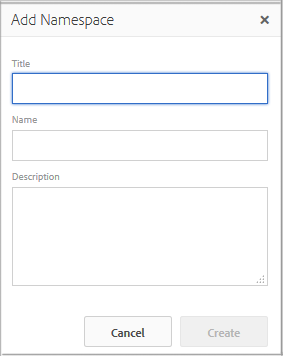

# 태그 관리 {#administering-tags}

태그는 웹 사이트에 포함된 콘텐츠를 빠르고 손쉽게 분류할 수 있는 방법입니다. 검색의 결과로 컨텐츠를 보다 빠르게 찾을 수 있는 키워드 또는 레이블(메타데이터)로 생각할 수 있습니다.

Adobe Experience Manager(AEM)에서 태그는 다음 속성일 수 있습니다.

* 페이지의 콘텐츠 노드(참조) [태그 사용](/help/sites-authoring/tags.md))

* 에셋의 메타데이터 노드(참조) [디지털 에셋용 메타데이터 관리](/help/assets/metadata.md))

AEM Communities 기능에는 페이지 및 에셋 외에도 태그가 사용됩니다

* 사용자 생성 컨텐츠(참조) [태그 지정 UGC)](/help/communities/tag-ugc.md)

* 지원 리소스(참조) [태그 지정 지원 리소스](/help/communities/functions.md#catalog-function))

## 태그 기능 {#tag-features}

AEM 내의 태그 기능 중 일부는 다음과 같습니다.

* 태그는 다양한 네임스페이스로 그룹화할 수 있습니다. 이러한 계층을 사용하면 분류법을 작성할 수 있습니다. 이러한 분류는 AEM 전체에 적용됩니다.
* 새로 만든 태그의 주요 제한 사항은 특정 네임스페이스 내에서 고유해야 한다는 것입니다.
* 태그의 제목에는 태그 경로 구분 문자가 포함되어서는 안 됩니다(존재하는 경우 표시되지도 않음)

   * 콜론 `:` - 네임스페이스 태그 구분
   * 슬래시 `/` - 하위 태그 구분

* 태그는 작성자 및 사이트 방문자가 적용할 수 있습니다. 만든 사람과 관계없이 태그를 페이지에 할당하거나 검색할 때 모든 형태의 태그를 선택할 수 있습니다.
* 태그는 &quot;태그 관리자&quot; 그룹의 구성원과 수정 권한이 있는 구성원에 의해 만들고 분류법을 수정할 수 있습니다. `/content/cq:tags`.

   * 하위 태그가 포함된 태그를 컨테이너 태그라고 합니다
   * 컨테이너 태그가 아닌 태그는 리프 태그라고 합니다
   * 태그 네임스페이스는 리프 태그 또는 컨테이너 태그입니다

* 태그는 [구성 요소 검색](https://helpx.adobe.com/experience-manager/core-components/using/quick-search.html) 컨텐츠를 쉽게 찾을 수 있습니다.
* 태그는 [티저 구성 요소](https://helpx.adobe.com/experience-manager/core-components/using/teaser.html): 사용자의 태그 클라우드를 모니터링하여 타깃팅된 컨텐츠를 제공합니다.
* 태깅이 콘텐츠의 중요한 측면인 경우

   * 태그를 사용하는 페이지로 태그를 패키징해야 합니다
   * 다음을 확인합니다. [태그 권한](#setting-tag-permissions) 읽기 액세스 활성화

## 태그 지정 콘솔 {#tagging-console}

태깅 콘솔을 사용하여 태그와 해당 분류를 만들고 관리할 수 있습니다. 한 가지 목표는 기본적으로 동일한 것과 관련된 많은 유사한 태그(예: 페이지 및 페이지 또는 신발 및 신발)를 보유하는 것을 피하는 것입니다.

태그는 네임스페이스로 그룹화하고, 새 태그를 만들기 전에 기존 태그의 사용을 검토하고, 현재 참조된 콘텐츠에서 태그의 연결을 끊지 않고 다시 구성하여 관리됩니다.

태깅 콘솔에 액세스하려면:

* 작성자
* 관리자 권한으로 로그인
* 전역 탐색에서

   * 선택 **`Tools`**
   * 선택 **`General`**
   * 선택 **`Tagging`**

### 네임스페이스 만들기 {#creating-a-namespace}

네임스페이스를 만들려면 **`Create Namespace`** 아이콘.

네임스페이스는 그 자체로 태그이며 하위 태그를 포함하지 않습니다. 그러나 분류를 계속 만들려면 다음을 수행하십시오. [하위 태그 만들기](#creating-tags): 리프 태그 또는 컨테이너 태그일 수 있습니다.

 

* **제목**
  *(필수)* 네임스페이스의 표시 제목입니다.

* **이름**
  *(선택 사항)* 네임스페이스의 이름입니다. 지정하지 않으면 제목에서 올바른 노드 이름이 만들어집니다. [TagID](/help/sites-developing/framework.md#tagid)를 참조하십시오.

* **설명**
  *(선택 사항)* 네임스페이스에 대한 설명.

필수 정보를 입력한 후

* 선택 **만들기**

### 태그 작업 {#operations-on-tags}

네임스페이스 또는 다른 태그를 선택하면 다음 작업을 사용할 수 있습니다.

* [속성 보기](#viewing-tag-properties)
* [참조](#showing-tag-references)
* [태그 만들기](#creating-tags)
* [편집](#editing-tags)
* [이동](#moving-tags)
* [병합](#merging-tags)
* [게시](#publishing-tags)
* [게시 취소](#unpublishing-tags)
* [삭제](#deleting-tags)

브라우저 창의 너비가 부족하여 모든 아이콘을 표시할 수 없는 경우 맨 오른쪽 아이콘이 **`... More`** 아이콘 - 선택한 경우 숨겨진 작업 아이콘의 드롭다운 목록을 표시합니다.

### 네임스페이스 태그 선택 {#selecting-a-namespace-tag}

처음 선택하면 네임스페이스에 태그가 없는 경우 속성이 오른쪽에 표시되고, 그렇지 않으면 하위 태그가 표시됩니다. 선택한 각 태그에는 포함된 태그 또는 하위 태그가 없는 경우 해당 속성이 표시됩니다.

작업에 대한 태그를 선택하고 다중 선택하려면 제목 옆에 있는 아이콘만 선택합니다. 제목을 선택하면 속성만 표시되거나 태그가 열려 콘텐츠가 표시됩니다.

 

### 태그 속성 보기 {#viewing-tag-properties}

네임스페이스나 다른 태그를 선택한 경우 **`View Properties`** 아이콘을 클릭하면 다음에 대한 정보가 표시됩니다. `name`, 마지막 편집 시간 및 참조 수. 게시된 경우 마지막으로 게시된 시간과 게시자 ID가 표시됩니다. 이 정보는 태그 열 왼쪽에 있는 열에 나타납니다.

### 태그 참조 표시 {#showing-tag-references}

네임스페이스나 다른 태그를 선택한 경우 **참조** 아이콘은 태그가 적용된 콘텐츠를 식별합니다.

초기 디스플레이는 적용된 태그의 수입니다.

카운트 오른쪽에 있는 화살표를 선택하면 참조 이름이 나열됩니다.

참조를 마우스로 가리키면 참조 경로가 도구 설명으로 표시됩니다.

### 태그 만들기 {#creating-tags}

네임스페이스 또는 다른 태그를 선택하면(제목 옆에 있는 아이콘을 선택하여) 현재 태그에 대해 하위 태그를 만들 수 있습니다. **`Create Tag`** 아이콘.

* **제목**
*(필수) *태그의 표시 제목입니다.

* **이름**
*(선택 사항) *태그의 이름. 지정하지 않으면 제목에서 올바른 노드 이름이 만들어집니다. [TagID](/help/sites-developing/framework.md#tagid)를 참조하십시오.

* **설명**
*(선택 사항) *태그에 대한 설명입니다.

필수 정보를 입력한 후

* 선택 **만들기**

### 태그 편집 {#editing-tags}

네임스페이스나 다른 태그를 선택한 경우 ** 항목을 선택하여 제목, 설명 을 변경하고 제목의 현지화를 제공할 수 있습니다`Edit`**아이콘.

편집한 후 선택 **저장**.

언어 번역 추가에 대한 자세한 내용은 [다양한 언어로 태그 관리](#managing-tags-in-different-languages)의 섹션을 참조하십시오.

### 태그로 이동 {#moving-tags}

네임스페이스나 다른 태그를 선택한 경우 **`Move`** 아이콘을 사용하면 태그 관리자 및 개발자가 태그를 새 위치로 이동하거나 이름을 변경하여 분류법을 정리할 수 있습니다. 선택한 태그가 컨테이너 태그인 경우 태그를 이동하면 모든 하위 태그도 이동됩니다.

>[!NOTE]
>
>작성자는 다음과 같은 작업만 수행할 수 있습니다. [편집](#editing-tags) 태그의 `title`태그를 이동하거나 이름을 변경하지 마십시오.

* **경로**
  *(읽기 전용)* 선택한 태그에 대한 현재 경로입니다.

* **이동 위치:**
태그를 이동할 새 경로를 찾습니다.

* **이름 바꾸기**
처음에 현재 표시 `name`태그 내 태그로 변경되었습니다. 새 항목 `name`을(를) 입력할 수 있습니다.

* 선택 **저장**

### 태그 병합 {#merging-tags}

분류법에 중복 태그가 있는 경우 병합 태그를 사용할 수 있습니다. 태그 A가 태그 B에 병합되면 태그 A로 태그가 지정된 모든 페이지에 태그 B로 태그가 지정되며 태그 A는 작성자가 더 이상 사용할 수 없습니다.

네임스페이스나 다른 태그를 선택한 경우 **병합** 아이콘으로 병합할 경로를 선택할 수 있는 패널이 열립니다.

* **경로**
  *(읽기 전용)* 다른 태그에 병합되도록 선택한 태그의 경로.

* **다음 항목에 병합**
병합할 태그의 경로를 찾아 선택합니다.

>[!NOTE]
>
>병합 후 **경로** 원래 선택된 항목은 (가상으로) 더 이상 존재하지 않습니다.
>
>참조된 태그를 이동하거나 병합할 때 태그가 실제로 삭제되지 않으므로 참조를 유지할 수 있습니다.

### 태그 게시 {#publishing-tags}

네임스페이스나 다른 태그를 선택한 경우 **게시** 게시 환경에서 태그를 활성화하는 아이콘입니다. 페이지 콘텐츠와 마찬가지로 컨테이너 태그인지 여부에 관계없이 선택한 태그만 게시됩니다.

분류법(네임스페이스 및 하위 태그)을 게시하는 가장 좋은 방법은 [패키지](/help/sites-administering/package-manager.md) 네임스페이스의 일부(참조) [분류 루트 노드](/help/sites-developing/framework.md#taxonomy-root-node)). 다음을 확인합니다. [권한 적용](#setting-tag-permissions) 패키지를 만들기 전에 네임스페이스에 연결합니다.

### 태그 게시 취소 {#unpublishing-tags}

네임스페이스나 다른 태그를 선택한 경우 **게시 취소** 아이콘은 작성 환경에서 태그를 비활성화하고 게시 환경에서 제거합니다. 와 유사 `Delete`작업: 선택한 태그가 컨테이너 태그인 경우 모든 하위 태그가 작성 환경에서 비활성화되고 게시 환경에서 제거됩니다.

### 태그 삭제 {#deleting-tags}

네임스페이스나 다른 태그를 선택한 경우 **삭제** 아이콘은 작성자 환경에서 태그를 영구적으로 제거합니다. 태그가 게시된 경우 게시 환경에서도 제거됩니다. 선택한 태그가 컨테이너 태그인 경우 해당 하위 태그도 모두 제거됩니다.

## 태그 권한 설정 {#setting-tag-permissions}

태그 권한: [&#39;보안(기본값)&#39;](/help/sites-administering/production-ready.md): 태그에 대해 읽기 권한을 명시적으로 허용해야 하는 게시 환경에 대한 우수 사례입니다. 기본적으로, 이 작업은 작성자에게 권한이 설정된 후에 태그 네임스페이스의 패키지를 만들고 모든 게시 인스턴스에 패키지를 설치하여 수행됩니다.

* 작성자 인스턴스에서

   * 관리자 권한으로 로그인
   * 액세스 [보안 콘솔](/help/sites-administering/security.md#accessing-user-administration-with-the-security-console),

      * 예를 들어 http://localhost:4502/useradmin으로 이동합니다.

   * 왼쪽 창에서 원하는 그룹(또는 사용자)을 선택합니다 [읽기 권한](/help/sites-administering/security.md#permissions) 은(는) 부여됩니다.
   * 오른쪽 창에서 태그 네임스페이스에 대한 **경로**를 찾습니다

      * 예를 들어, `/content/cq:tags/mycommunity`

   * 선택 `checkbox`다음에서 **읽기** 열
   * 선택 **저장**

* 모든 게시 인스턴스에 동일한 권한이 있는지 확인합니다.

   * 한 가지 접근 방법은 다음과 같습니다. [패키지 만들기](/help/sites-administering/package-manager.md#package-manager) 작성자의 네임스페이스

      * 날짜 `Advanced` 탭, `AC Handling` 선택 `Overwrite`

   * 패키지 복제

      * 선택 `Replicate` 패키지 관리자에서

## 다양한 언어로 태그 관리 {#managing-tags-in-different-languages}

다음 `title`태그의 속성은 여러 언어로 번역될 수 있습니다. 번역되면 적절한 태그 `title`사용자 언어 또는 페이지 언어에 따라 표시될 수 있습니다.

### 여러 언어로 태그 제목 정의 {#defining-tag-titles-in-multiple-languages}

다음은 를 번역하는 방법을 설명합니다. `title`/ 태그 **동물** 영어에서 독어, 불어로.

에서 태그를 선택하여 시작합니다. **스톡 사진** 네임스페이스 및 ** 선택`Edit`**아이콘(참조) [태그 편집](#editing-tags) 섹션에 있는 마지막 항목이 될 필요가 없습니다.

[태그 편집] 패널에서는 태그 제목을 현지화할 언어를 선택할 수 있습니다.

각 언어가 선택되면 번역된 제목을 입력할 수 있는 텍스트 입력 상자가 나타납니다.

모든 번역을 입력한 후 다음을 선택합니다. **저장** 편집 모드를 종료합니다.

일반적으로 태그에 대해 선택된 언어는 사용 가능한 경우 페이지 언어에서 가져옵니다. 다음의 경우 [`tag` 위젯](/help/sites-developing/building.md#tagging-on-the-client-side) 는 다른 경우(예: 양식이나 대화 상자)에 사용되며 태그 언어는 컨텍스트에 따라 다릅니다.

태깅 콘솔에서는 페이지 언어 설정 대신 사용자 언어 설정을 사용합니다. 태그 지정 콘솔에서 &#39;Animaux&#39; 태그의 경우 사용자 속성에서 언어를 프랑스어로 설정한 사용자를 위해 &#39;Animux&#39;가 표시됩니다.

대화 상자에 새 언어를 추가하려면 다음을 참조하십시오. [태그 편집 대화 상자에 새 언어 추가](/help/sites-developing/building.md#adding-a-new-language-to-the-edit-tag-dialog).

>[!NOTE]
>
>표준 페이지 구성 요소의 태그 클라우드 및 메타 키워드는 현지화된 태그를 사용합니다 `titles`페이지 언어를 기반으로 합니다(사용 가능한 경우).

## 리소스 {#resources}

* [개발자를 위한 태깅](/help/sites-developing/tags.md)

  태깅 프레임워크에 대한 정보와 사용자 지정 애플리케이션에서 태그를 확장 및 포함하는 정보입니다.

* [클래식 UI 태깅 콘솔](/help/sites-administering/classic-console.md)
