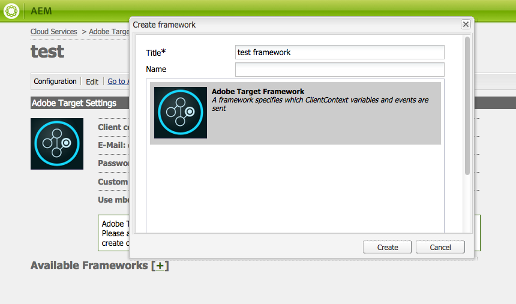

# Adobe Target과의 통합 수동 구성 {#manually-configuring-the-integration-with-adobe-target}

마법사를 사용할 때 수행한 옵트인 마법사 구성을 수정하거나 마법사를 사용하지 않고 수동으로 Adobe Target과 통합할 수 있습니다.

## 옵트인 마법사 구성 수정 {#modifying-the-opt-in-wizard-configurations}

다음 [옵트인 마법사](/help/sites-administering/opt-in.md) that [AEM과 Adobe Target 통합](/help/sites-administering/target.md) 프로비저닝된 타겟 구성 이라는 타겟 클라우드 구성을 자동으로 생성합니다. 또한 이 마법사는 프로비저닝된 타겟 프레임워크라는 클라우드 구성에 대한 타겟 프레임워크를 생성합니다. 필요한 경우 클라우드 구성 및 프레임워크의 속성을 수정할 수 있습니다.

A4T Analytics Cloud 구성을 구성하여 콘텐츠를 타깃팅할 때 Adobe Target을 보고 소스로 사용하도록 Adobe Target을 구성할 수도 있습니다.

클라우드 구성 및 프레임워크를 찾으려면 다음 위치로 이동합니다. **Cloud Service** 경유 **도구** > **배포** > **클라우드**. ([http://localhost:4502/libs/cq/core/content/tools/cloudservices.html](http://localhost:4502/libs/cq/core/content/tools/cloudservices.html)) Adobe Target 아래에서 **구성 표시**.

### 프로비저닝된 타겟 구성 속성 {#provisioned-target-configuration-properties}

다음 속성 값은 옵트인 마법사가 만드는 프로비저닝된 Target 구성 클라우드 구성에 사용됩니다.

* **클라이언트 코드:** 옵트인 마법사에 입력한 대로.
* **전자 메일:** 옵트인 마법사에 입력한 대로.
* **암호:** 옵트인 마법사에 입력한 대로.
* **API 유형:** 나머지
* **Adobe Target에서 세그먼트 동기화:** 선택됨.

* **클라이언트 라이브러리:** mbox.js.
* **DTM을 사용하여 클라이언트 라이브러리 전달:** 선택되지 않았습니다. 다음과 같은 경우 이 옵션을 선택합니다. [dtm 사용](/help/sites-administering/dtm.md) 또는 mbox.js 또는 AT.js 파일을 호스팅하는 다른 태그 관리 시스템입니다. Adobe은 AEM보다 DTM을 사용하여 라이브러리를 전달할 것을 권장합니다.

* **사용자 지정 mbox.js:** 기본 mbox.js 파일이 사용되도록 지정되지 않았습니다. 필요에 따라 사용할 사용자 지정 mbox.js 파일을 지정합니다. mbox.js를 선택한 경우에만 나타납니다.
* **사용자 지정 AT.js:** 기본 AT.js 파일이 사용되도록 지정되지 않았습니다. 필요에 따라 사용할 사용자 지정 AT.js 파일을 지정합니다. AT.js를 선택한 경우에만 나타납니다.

>[!NOTE]
>
>AEM 6.3에서 Target 라이브러리 파일을 선택하고 [AT.JS](https://developer.adobe.com/target/implement/client-side/atjs/atjs-functions/mboxcreate-atjs/): 일반적인 웹 구현과 단일 페이지 애플리케이션 둘 다에 맞게 디자인된 새로운 Adobe Target 구현 라이브러리입니다.
>
>AT.js는 mbox.js 라이브러리에 비해 몇 가지 개선점을 제공합니다.
>
>* 웹 구현에 대한 페이지 로드 시간 개선
>* 보안 개선
>* 단일 페이지 애플리케이션에 대한 구현 옵션 개선
>* AT.js에는 target.js에 포함된 구성 요소가 포함되어 있으므로 더 이상 target을 호출할 필요가 없습니다.

<!-- OLD URL WHICH IS 404 https://experienceleague.adobe.com/docs/target/using/implement-target/client-side/mbox-implement/mbox-download.html -->

### 프로비저닝된 타겟 프레임워크 속성 {#provisioned-target-framework-properties}

옵트인 마법사가 만드는 프로비저닝된 Target 프레임워크는 프로필 데이터 저장소에서 컨텍스트 데이터를 보내도록 구성됩니다. 스토어의 연령 및 성별 데이터 항목은 기본적으로 Target으로 전송됩니다. 솔루션을 사용하려면 추가 매개 변수를 전송해야 할 수 있습니다.


에 설명된 대로 추가적인 컨텍스트 정보를 Target에 보내도록 프레임워크를 구성할 수 있습니다 [Target 프레임워크 추가](/help/sites-administering/target-configuring.md#adding-a-target-framework).

### A4T Analytics Cloud 구성 {#configuring-a-t-analytics-cloud-configuration}

컨텐츠를 타깃팅할 때 Adobe Analytics을 보고 소스로 사용하도록 Adobe Target을 구성할 수 있습니다.

>[!NOTE]
>
>사용자 자격 증명 인증(기존)은 A4T(Target과 Analytics 모두에 대해)에서 작동하지 않습니다. 따라서 고객은 사용자 자격 증명 인증 대신 IMS 인증을 사용해야 합니다.

이렇게 하려면 Adobe Target 클라우드 구성을 연결할 A4T 클라우드 구성을 지정합니다.

1. 다음으로 이동 **Cloud Service** 를 통해 **AEM 로고** > **도구** > **배포** > **Cloud Service**.
1. **Adobe Target** 섹션에서 **지금 구성**&#x200B;을 클릭합니다.
1. Adobe Target 구성에 다시 연결합니다.
1. 다음에서 **A4T Analytics Cloud 구성** 드롭다운 메뉴에서 프레임워크를 선택합니다.

   >[!NOTE]
   >
   >A4T에 대해 활성화된 Analytics 구성만 사용할 수 있습니다.
   >
   >AEM으로 A4T를 구성할 때 구성 참조 누락 항목이 표시될 수 있습니다. Analytics 프레임워크를 선택하려면 다음을 수행하십시오.
   >
   >1. 다음으로 이동 **도구** > **일반** > **CRXDE Lite**.
   1. 다음 위치로 이동 [A4T 분석 구성 대화 상자](#a4t-analytics-config-dialog) (아래 참조)
   1. 속성 설정 **disable** 끝 **false**.
   1. **모두 저장**&#x200B;을 클릭합니다.

#### A4T 분석 구성 대화 상자 {#a4t-analytics-config-dialog}

```xml
/libs/cq/analytics/components/testandtargetpage/dialog/items/tabs/items/tab1_general/items/a4tAnalyticsConfig
```


클릭 **확인**. Adobe Target으로 콘텐츠를 타겟팅하면 다음 작업을 수행할 수 있습니다 [보고서 소스 선택](/help/sites-authoring/content-targeting-touch.md).

## Adobe Target과 수동 통합 {#manually-integrating-with-adobe-target}

옵트인 마법사를 사용하지 않고 Adobe Target과 수동으로 통합합니다.

>[!NOTE]
>
Target 라이브러리 파일, [AT.JS](https://developer.adobe.com/target/implement/client-side/atjs/atjs-functions/mboxcreate-atjs/)는 일반적인 웹 구현과 단일 페이지 애플리케이션 둘 다에 맞게 디자인된 새로운 Adobe Target용 구현 라이브러리입니다. mbox.js 대신 AT.js를 클라이언트 라이브러리로 사용하는 것이 좋습니다.
>
AT.js는 mbox.js 라이브러리에 비해 몇 가지 개선점을 제공합니다.
>
* 웹 구현에 대한 페이지 로드 시간 개선
* 보안 개선
* 단일 페이지 애플리케이션에 대한 구현 옵션 개선
* AT.js에는 target.js에 포함된 구성 요소도 포함되어 있으므로 더 이상 target.js를 호출할 필요가 없습니다.
>
**클라이언트 라이브러리** 드롭다운 메뉴에서 AT.js 또는 mbox.js를 선택할 수 있습니다.

<!-- OLD URL from above was 404 https://experienceleague.adobe.com/docs/target/using/implement-target/client-side/mbox-implement/mbox-download.html -->

### Target 클라우드 구성 만들기 {#creating-a-target-cloud-configuration}

Adobe Target과 상호 작용하도록 AEM을 활성화하려면 Target 클라우드 구성을 만들어야 합니다. 구성을 만들려면 Adobe Target 클라이언트 코드 및 사용자 자격 증명을 제공합니다.

Target 클라우드 구성은 여러 AEM 캠페인과 연결할 수 있으므로 한 번만 만들면 됩니다. Adobe Target 클라이언트 코드가 여러 개 있는 경우 각 클라이언트 코드에 대해 하나의 구성을 만드십시오.

Adobe Target의 세그먼트를 동기화하도록 클라우드 구성을 구성할 수 있습니다. 동기화를 활성화하면 클라우드 구성이 저장될 때 백그라운드에 있는 Target에서 세그먼트를 가져옵니다.

다음 절차를 통해 AEM에서 Target 클라우드 구성을 만드십시오.

1. 다음으로 이동 **Cloud Service** 를 통해 **AEM 로고** > **도구** > **Cloud Service** > **이전 Cloud Service**. ([http://localhost:4502/libs/cq/core/content/tools/cloudservices.html](http://localhost:4502/libs/cq/core/content/tools/cloudservices.html))

   다음 **Cloud Service** 개요 페이지가 열립니다.

1. **Adobe Target** 섹션에서 **지금 구성**&#x200B;을 클릭합니다.
1. **구성 만들기** 대화 상자에서

   1. 구성의 **제목**&#x200B;을 제공합니다.
   1. **Adobe Target 구성** 템플릿을 선택합니다.
   1. **만들기**&#x200B;를 클릭합니다.

   편집 대화 상자가 열립니다.

   

   >[!NOTE]
   >
   AEM으로 A4T를 구성할 때 구성 참조 누락 항목이 표시될 수 있습니다. Analytics 프레임워크를 선택하려면 다음을 수행하십시오.
   >
   1. 다음으로 이동 **도구** > **일반** > **CRXDE Lite**.
   1. 다음으로 이동 **/libs/cq/analytics/components/testandtargetpage/dialog/items/tab/items/tab1_general/items/a4tAnalyticsConfig**
   1. 속성 설정 **disable** 끝 **false**.
   1. **모두 저장**&#x200B;을 클릭합니다.

1. 대화 상자에서 이러한 속성의 값을 입력합니다.

   * **클라이언트 코드**: Target 계정 클라이언트 코드입니다.
   * **전자 메일**: Target 계정 이메일입니다.
   * **암호**: Target 계정 암호입니다.
   * **API 유형**: REST 또는 XML
   * **A4T Analytics Cloud 구성**: 타겟 활동 목표 및 지표에 사용되는 Analytics Cloud 구성을 선택합니다. 콘텐츠를 타깃팅할 때 보고 소스로 Adobe Analytics을 사용하는 경우 이 구성이 필요합니다. 클라우드 구성이 표시되지 않으면 의 참고 사항을 참조하십시오. [A4T Analytics Cloud 구성](#configuring-a-t-analytics-cloud-configuration).

   * **정확한 타겟팅 사용:** 기본적으로 이 확인란은 선택되어 있습니다. 이 옵션을 선택하면 클라우드 서비스 구성은 콘텐츠를 로드하기 전에 컨텍스트가 로드될 때까지 대기합니다. 다음 사항에 주의하십시오.
   * **Adobe Target에서 세그먼트 동기화:** Target에 정의된 세그먼트를 다운로드하여 AEM에서 사용할 수 있도록 하려면 이 옵션을 선택하십시오. API 유형 속성이 REST인 경우 인라인 세그먼트가 지원되지 않으므로 Target의 세그먼트를 사용해야 하므로 이 옵션을 선택합니다. (AEM 용어인 &#39;segment&#39;는 Target &#39;audience&#39;와 동일합니다.)
   * **클라이언트 라이브러리:** mbox.js 클라이언트 라이브러리를 원하는지 AT.js 클라이언트 라이브러리를 원하는지 선택합니다.
   * **DTM을 사용하여 클라이언트 라이브러리 전달** - DTM 또는 다른 태그 관리 시스템의 AT.js 또는 mbox.js를 사용하려면 이 옵션을 선택하십시오. 구성 [dtm 통합](/help/sites-administering/dtm.md) 이 옵션을 사용합니다. Adobe은 AEM보다 DTM을 사용하여 라이브러리를 전달할 것을 권장합니다.
   * **사용자 지정 mbox.js**: DTM 상자를 선택하거나 기본 mbox.js를 사용하려면 비워 둡니다. 또는 사용자 지정 mbox.js를 업로드합니다. mbox.js를 선택한 경우에만 나타납니다.
   * **사용자 정의 AT.js**: DTM 상자를 선택하거나 기본 AT.js를 사용하려면 비워 둡니다. 또는 사용자 지정 AT.js를 업로드합니다. AT.js를 선택한 경우에만 나타납니다.

   >[!NOTE]
   >
   Adobe Target 구성 마법사에 옵트인하면 정확한 타겟팅은 기본적으로 활성화되어 있습니다.
   >
   정확한 타겟팅은 클라우드 서비스 구성이 콘텐츠를 로드하기 전에 컨텍스트가 로드될 때까지 대기함을 의미합니다. 결과적으로 성능 측면에서 정확한 타겟팅을 사용하면 콘텐츠를 로드하기 전에 몇 밀리초의 지연이 발생할 수 있습니다.
   >
   작성자 인스턴스에서는 정확한 타겟팅이 항상 활성화되어 있습니다. 그러나 게시 인스턴스에서는 클라우드 서비스 구성에서 정확한 타겟팅 옆에 있는 확인 표시를 지움으로써 정확한 타겟팅을 전역적으로 끌 수도 있습니다(**http://localhost:4502/etc/cloudservices.html**). 또한 클라우드 서비스 구성의 설정에 관계없이 개별 구성 요소에 대해 정확한 타겟팅을 켜거나 끌 수 있습니다.
   >
   타겟팅된 구성 요소를 ***이미*** 만든 다음 이 설정을 변경하는 경우, 해당 변경 내용은 이들 구성 요소에 영향을 미치지 않습니다. 이러한 구성 요소를 직접 변경합니다.

1. 클릭 **Target에 연결** Target과의 연결을 초기화합니다. 정상적으로 연결되면 **연결 성공**&#x200B;이라는 메시지가 표시됩니다. 메시지에서 **확인**&#x200B;을 클릭한 다음 대화 상자에서 **확인**&#x200B;을 클릭합니다.

   Target에 연결할 수 없는 경우 [문제 해결](/help/sites-administering/target-configuring.md#troubleshooting-target-connection-problems) 섹션을 참조하십시오.

### Target 프레임워크 추가 {#adding-a-target-framework}

Target 클라우드 구성을 구성한 다음에는 Target 프레임워크를 추가할 수 있습니다. 프레임워크는 사용 가능한 항목에서 Adobe Target으로 전송되는 기본 매개변수를 식별합니다 [Client Context](/help/sites-administering/client-context.md) 또는 [컨텍스트 허브](/help/sites-developing/ch-configuring.md) 구성 요소. Target은 매개변수를 사용하여 현재 컨텍스트에 적용되는 세그먼트를 결정합니다.

단일 Target 구성에 대해 여러 프레임워크를 만들 수 있습니다. 다중 프레임워크는 웹 사이트의 여러 섹션에 대해 서로 다른 매개변수 세트를 Target에 전송해야 할 때 유용합니다. 전송하는 각 매개변수 세트에 대한 프레임워크를 만듭니다. 웹 사이트의 각 섹션을 적절한 프레임워크에 연결합니다. 웹 페이지는 한 번에 하나의 프레임워크만 사용할 수 있습니다.

1. Target 구성 페이지에서 **+** 사용 가능한 프레임워크 옆의 (더하기 기호) 를 참조하십시오.
1. 프레임워크 만들기 대화 상자에서 **제목**&#x200B;을 지정하고 **Adobe Target 프레임워크**&#x200B;를 선택한 다음 **만들기**&#x200B;를 클릭합니다.

   

   프레임워크 페이지가 열립니다. Sidekick은 [Client Context](/help/sites-administering/client-context.md) 또는 [컨텍스트 허브](/help/sites-developing/ch-configuring.md) 매핑할 수 있습니다.

   

1. 매핑에 사용하고자 하는 데이터를 나타내는 클라이언트 컨텍스트 구성 요소를 드롭 대상에 드래그합니다. 또는 을(를) 드래그합니다&#x200B;**ContextHub 저장소** 구성 요소를 프레임워크에 추가합니다.

   >[!NOTE]
   >
   매핑하면 매개변수는 간단한 문자열을 통해 mbox에 전달됩니다. ContextHub에서는 배열을 매핑할 수 없습니다.

   예를 들어, **프로필 데이터** 사이트 방문자에 대해 Target 캠페인을 제어하기 위해 을(를) **프로필 데이터** 구성 요소를 페이지에 추가합니다. Target 매개변수에 매핑할 수 있는 프로필 데이터 변수가 표시됩니다.

   

1. 적절한 열에서 **공유** 확인란을 선택하여 Adobe Target 시스템에 표시하고자 하는 변수를 선택합니다.

   

   >[!NOTE]
   >
   매개변수 동기화는 AEM에서 Adobe Target으로만 할 수 있습니다.

프레임워크가 생성됩니다. 게시 인스턴스로 프레임워크를 복제하려면 sidekick에서 **프레임워크 활성화** 옵션을 사용하십시오.

### 활동을 Target 클라우드 구성과 연결  {#associating-activities-with-the-target-cloud-configuration}

연결 [AEM 활동](/help/sites-authoring/activitylib.md) Target 클라우드 구성을 사용하여에서 활동을 미러링할 수 있습니다. [Adobe Target](https://experienceleague.adobe.com/docs/target/using/experiences/offers/manage-content.html).

>[!NOTE]
>
사용 가능한 활동 유형은 다음 방법으로 결정됩니다.
>
>
* 다음과 같은 경우 **xt_only** AEM 측에서 Adobe Target에 연결하는 데 사용되는 Adobe Target 테넌트(클라이언트 코드)에서 옵션이 활성화되어 다음을 만들 수 있습니다. **전용** AEM의 XT 활동.
>
* 다음과 같은 경우 **xt_only** 옵션은 다음과 같습니다. **아님** Adobe Target 테넌트(클라이언트 코드)에서 활성화한 다음 **모두** AEM의 XT 및 A/B 활동.
>
**추가 참고 사항:** **xt_only** 옵션은 특정 Target 테넌트(클라이언트 코드)에 적용되는 설정이며 Adobe Target에서만 직접 수정할 수 있습니다. AEM에서 이 옵션을 사용하거나 사용하지 않도록 설정할 수 없습니다.

### Target 프레임워크와 사이트 연결 {#associating-the-target-framework-with-your-site}

AEM에서 Target 프레임워크를 만든 후 웹 페이지를 프레임워크에 연결합니다. 페이지의 타겟팅된 구성 요소는 추적을 위해 프레임워크 정의 데이터를 Adobe Target으로 보냅니다. (참조: [콘텐츠 타겟팅](/help/sites-authoring/content-targeting-touch.md).)

페이지를 프레임워크와 연결하면 하위 페이지가 연결을 상속합니다.

1. 다음에서 **사이트** 콘솔에서 구성할 사이트로 이동합니다.
1. 다음 중 하나를 사용합니다. [빠른 작업](/help/sites-authoring/basic-handling.md#quick-actions) 또는 [선택 모드](/help/sites-authoring/basic-handling.md), 선택 **속성 보기.**
1. **클라우드 서비스** 탭을 선택합니다.
1. 클릭 **편집**.
1. 클릭 **구성 추가** 아래에 **Cloud Service 구성** 및 선택 **Adobe Target**.

   

1. 아래에서 원하는 프레임워크를 선택합니다 **구성 참조**.

   >[!NOTE]
   >
   다음을 선택해야 합니다. **프레임워크** 생성된 Target 클라우드 구성이 아니라 사용자가 생성한 것입니다.

1. **완료**&#x200B;를 클릭합니다.
1. 웹 사이트의 루트 페이지를 활성화하여 게시 서버에 복제합니다. (참조: [페이지를 게시하는 방법](/help/sites-authoring/publishing-pages.md).)

   >[!NOTE]
   >
   페이지에 첨부한 프레임워크가 아직 활성화되지 않은 경우 게시할 수 있는 마법사가 열립니다.

## Target 연결 문제 해결 {#troubleshooting-target-connection-problems}

Target에 연결할 때 발생하는 문제를 해결하려면 다음 작업을 수행할 수 있습니다.

* 제공한 사용자 자격 증명이 올바른지 확인하십시오.
* AEM 인스턴스가 Target 서버에 연결할 수 있는지 확인하십시오. 예를 들어 방화벽 규칙이 아웃바운드 AEM 연결을 차단하지 않는지 확인하거나 AEM이 필요한 프록시를 사용하도록 구성되어 있는지 확인하십시오.
* AEM 오류 로그에서 유용한 메시지를 찾습니다. error.log 파일이 **crx-quickstart/logs** AEM이 설치된 디렉터리입니다.
* Adobe Target에서 활동을 편집할 때 URL은 localhost를 가리킵니다. AEM 외부화를 올바른 URL로 설정하여 이 이해 문제를 해결합니다.
