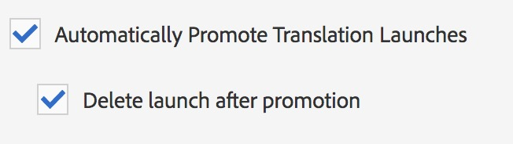

# 번역 개선 사항{#translation-enhancements}

이 페이지에서는 AEM 번역 관리 기능에 대한 증분 개선 사항 및 개선 사항을 제공합니다.

## 번역 프로젝트 자동화 {#translation-project-automation}

번역 시작 자동 홍보 및 삭제, 번역 프로젝트의 반복 실행 일정 예약 등 번역 프로젝트 관련 작업의 생산성을 향상시키는 옵션이 추가되었습니다.

1. 번역 프로젝트에서 **번역 요약** 타일 하단의 생략 부호를 클릭합니다.

   

1. **고급** 탭으로 전환합니다. 맨 아래에서 **자동으로 번역 시작 홍보**&#x200B;를 선택할 수 있습니다.

   

1. 선택적으로, 번역된 콘텐츠를 수신한 후 번역 론치를 자동으로 홍보하고 삭제해야 하는 경우 선택할 수 있습니다.

   

1. 번역 프로젝트의 반복 실행을 선택하려면 **번역 반복**&#x200B;에서 드롭다운이 있는 빈도를 선택하십시오. 반복 프로젝트 실행은 지정된 간격으로 번역 작업을 자동으로 만들고 실행합니다.

   

## 다국어 번역 프로젝트 {#multilingual-translation-projects}

생성된 전체 번역 프로젝트 수를 줄이기 위해 번역 프로젝트에서 여러 타겟 언어를 구성할 수 있습니다.

1. 번역 프로젝트에서 **번역 요약** 타일 하단에 있는 점을 클릭합니다.

   

1. **고급** 탭으로 전환합니다. **대상 언어**&#x200B;에서 여러 언어를 추가할 수 있습니다.

   

1. 또는 Sites의 참조 레일을 통해 번역을 시작하는 경우 언어를 추가하고 **다국어 번역 프로젝트 만들기**&#x200B;를 선택하십시오.

   

1. 번역 작업은 모든 타겟 언어에 대해 프로젝트에서 생성됩니다. 프로젝트 내에서 하나씩 또는 프로젝트 관리자에서 프로젝트를 전역적으로 실행하여 한 번에 시작할 수 있습니다.

   

## 번역 메모리 업데이트 {#translation-memory-updates}

번역된 콘텐츠의 수동 편집 내용을 번역 관리 시스템(TMS)과 다시 동기화하여 번역 메모리를 트레이닝할 수 있습니다.

1. 사이트 콘솔에서 번역된 페이지의 텍스트 콘텐츠를 업데이트한 후 **번역 메모리 업데이트**&#x200B;를 선택합니다.

   

1. 편집된 모든 텍스트 구성 요소에 대해 소스와 번역의 병렬 비교가 목록 보기에 표시됩니다. 번역 메모리에 동기화할 번역 업데이트를 선택하고 **메모리 업데이트**&#x200B;를 선택합니다.

   

AEM은 구성된 TMS의 번역 메모리에 기존 문자열의 번역을 업데이트합니다.

* 이 작업은 구성된 TMS의 번역 메모리에 기존 문자열의 번역을 업데이트합니다.
* 이는 새로운 번역 작업을 생성하지 않습니다.
* 이는 AEM 번역 API를 통해 TMS로 번역을 다시 전달합니다(아래 참조).

이 기능을 사용하려면 다음 작업을 수행하십시오.

* TMS를 AEM과 사용할 수 있도록 구성해야 합니다.
* 커넥터가 방법 [`storeTranslation`](https://developer.adobe.com/experience-manager/reference-materials/cloud-service/javadoc/com/adobe/granite/translation/api/TranslationService.html)를 구현해야 합니다.
   * 이 방법에 포함되는 코드는 번역 메모리 업데이트 요청에 발생하는 일을 결정합니다.
   * 이 방법의 구현을 통해 AEM 번역 프레임워크는 문자열 값 쌍(원본 번역과 업데이트된 번역)을 TMS로 다시 전달합니다.

독점 번역 메모리를 사용하는 경우 번역 메모리 업데이트가 이전되어 사용자 정의 대상으로 전달될 수 있습니다.

## 여러 수준의 언어 사본 {#language-copies-on-multiple-levels}

이제 언어 루트를 언어 사본의 루트로 인식되면서 노드 아래에 그룹화할 수 있습니다(예: 지역별).

>[!CAUTION]
>
>하나의 수준만 허용됩니다. 예를 들어 다음과 같은 경우에는 &quot;es&quot; 페이지가 언어 사본으로 확인되지 않습니다.
>
>* `/content/we-retail/language-masters/en`
>* `/content/we-retail/language-masters/americas/central-america/es`
>
>이 `es` 언어 사본은 `en` 노드와 2수준 떨어져 있으므로(아메리카/중미) 감지되지 않습니다.

>[!NOTE]
>
>언어 루트는 언어의 ISO 코드가 아닌 모든 페이지 이름을 가질 수 있습니다. AEM은 항상 경로와 이름을 먼저 확인하지만, 페이지 이름이 언어를 식별하지 않을 경우 AEM은 언어 식별을 위해 페이지의 cq:language 속성을 확인합니다.

## 번역 상태 보고 {#translation-status-reporting}

이제 사이트 목록 보기에서 속성을 선택하여 페이지가 번역되었는지, 번역 중인지 또는 아직 번역되지 않았는지 확인할 수 있습니다. 표시하려면:

1. 사이트에서 **목록 보기**(으)로 전환합니다.

   

1. **설정 보기**&#x200B;를 클릭합니다.

   

1. **번역**&#x200B;에서 **번역됨** 확인란을 선택하고 **업데이트**&#x200B;를 클릭합니다.

   

이제 페이지의 번역 상태를 표시하는 **번역됨** 열이 표시됩니다.

