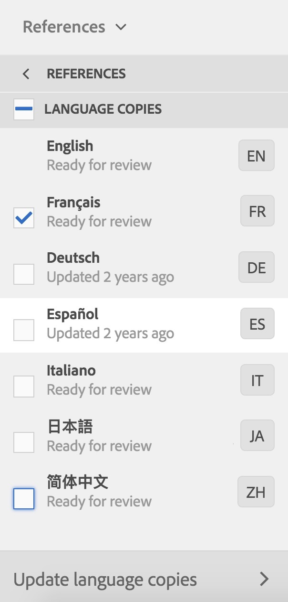
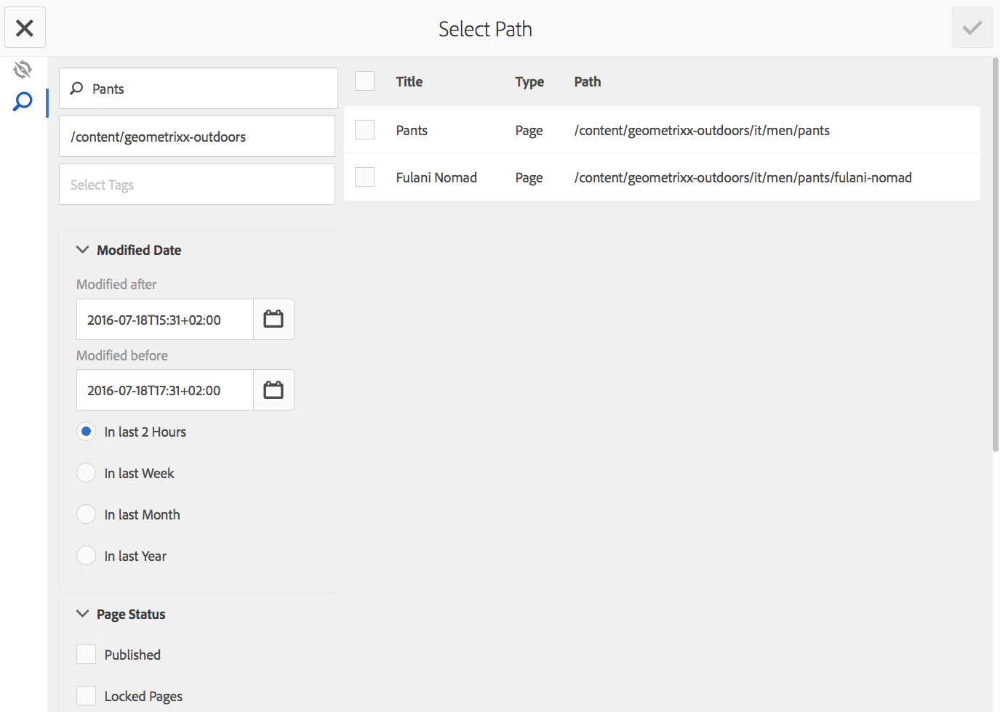
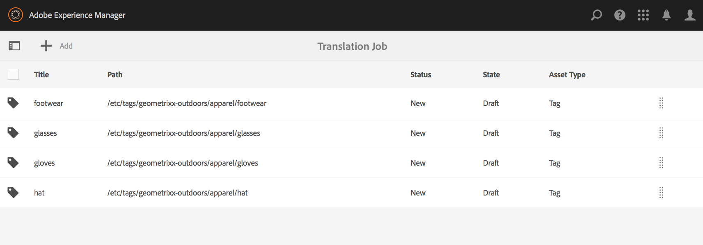
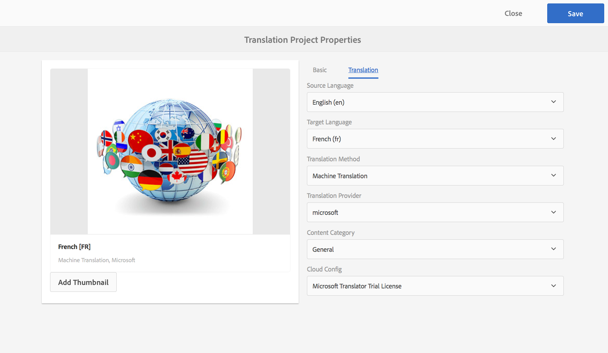

# 번역 프로젝트 관리{#managing-translation-projects}

번역 콘텐츠를 준비한 후 누락된 언어 사본을 만들어 언어 구조를 완성하고 번역 프로젝트를 만들어야 합니다.

번역 프로젝트를 사용하면 AEM 컨텐츠 번역을 관리할 수 있습니다. 번역 프로젝트는 다른 언어로 번역될 리소스를 포함하는 AEM [프로젝트](/help/sites-authoring/projects.md) 유형입니다. 이러한 리소스는 언어 마스터에서 만든 [언어 사본](/help/sites-administering/tc-prep.md)의 페이지 및 자산입니다.

번역 프로젝트에 리소스가 추가되면 번역 작업이 생성됩니다. 작업은 리소스에서 실행되는 인간 번역 및 기계 번역 워크플로우를 관리하는 데 사용하는 명령 및 상태 정보를 제공합니다.

>[!NOTE]
>
>번역 프로젝트에는 여러 번역 작업이 포함될 수 있습니다.

번역 프로젝트는 전역화를 위한 조직의 거버넌스에 맞게 언어 및 번역 방법/제공자가 정의하는 긴 실행 항목입니다. 이러한 지표는 초기 번역 또는 수동 작업 중에 한 번 시작되어야 하며 컨텐츠 및 번역 업데이트 활동 전반에서 계속 유효합니다.

번역 프로젝트 및 작업은 번역 준비 워크플로우로 만들어집니다. 이러한 워크플로우에는 초기 번역(만들기&amp;번역) 및 업데이트(번역 업데이트)에 대한 다음 세 가지 옵션이 있습니다.

1. [새 프로젝트 만들기](#creating-translation-projects-using-the-references-panel)
1. [기존 프로젝트에 추가](#adding-pages-to-a-translation-project)
1. [컨텐츠 구조만](#creating-the-structure-of-a-language-copy)

>[!NOTE]
>
>옵션 3은 번역 작업/프로젝트와 관련이 없습니다. 언어 마스터의 내용 및 구조적 변경 내용을 (번역되지 않은) 언어 복사본으로 복사할 수 있습니다. 번역 없이도 언어 마스터를 동기화할 수 있습니다.

## 초기 번역 수행 및 기존 번역 업데이트 {#performing-initial-translations-and-updating-existing-translations}

AEM에서는 컨텐츠의 초기 번역을 위해 번역 프로젝트를 만들고 있는지 아니면 이미 번역된 언어 사본을 업데이트할지 여부를 감지합니다. 페이지에 대한 번역 프로젝트를 만들고 번역하는 언어 사본을 나타낼 때 AEM은 대상 언어 사본에 소스 페이지가 이미 있는지 여부를 감지합니다.

* **언어 복사본에는 페이지가 포함되지 않습니다.** AEM에서는 이 상황을 초기 번역으로 처리합니다. 페이지가 언어 복사본으로 즉시 복사되고 프로젝트에 포함됩니다. 번역된 페이지를 AEM으로 가져오면 AEM에서 언어 복사본에 직접 복사합니다.
* **언어 사본에는 페이지가 이미 포함되어 있습니다.** AEM에서는 이 상황을 업데이트된 번역문으로 처리합니다. 론치가 생성되고 페이지의 복사본이 론치에 추가되고 프로젝트에 포함됩니다. 론치를 사용하면 언어 복사본에 커밋하기 전에 업데이트된 번역을 검토할 수 있습니다.

   * 번역된 페이지를 AEM으로 가져오면 론치에서 페이지를 덮어씁니다.
   * 번역된 페이지는 론치가 홍보될 때만 언어 사본을 덮어씁니다.

예를 들어 /content/geometrixx/fr 언어 루트는 /content/geometrixx/en 마스터 언어의 프랑스어 번역을 위해 만들어집니다. 프랑스어 복사본에는 다른 페이지가 없습니다.

* 프랑스어 언어 사본을 대상으로 하는 /content/geometrixx/en/products 페이지 및 모든 하위 페이지에 대한 번역 프로젝트가 생성됩니다. 언어 복사본에는 /content/geometrixx/fr/products 페이지가 포함되어 있지 않으므로 AEM에서는 즉시 /content/geometrixx/en/products 페이지와 모든 하위 페이지를 프랑스어 언어 복사본으로 복사합니다. 사본은 번역 프로젝트에 포함되어 있습니다.
* 프랑스어 언어 사본을 대상으로 하는 /content/geometrixx/en 페이지와 모든 하위 페이지에 대한 번역 프로젝트가 생성됩니다. 언어 복사본에는 /content/geometrixx/en 페이지(언어 루트)에 해당하는 페이지가 포함되어 있으므로 AEM에서는 /content/geometrixx/en 페이지와 모든 하위 페이지를 복사하고 론치에 추가합니다. 사본은 번역 프로젝트에 포함되어 있습니다.

## 참조 패널 {#creating-translation-projects-using-the-references-panel}을 사용하여 번역 프로젝트 만들기

번역 프로젝트를 만들어 언어 마스터의 리소스를 번역하는 워크플로우를 실행하고 관리할 수 있습니다. 프로젝트를 만들 때, 번역하려는 언어 마스터의 페이지와 번역을 수행하는 언어 사본을 지정합니다.

* 선택한 페이지와 연결된 번역 통합 프레임워크의 클라우드 구성에 따라 사용할 번역 워크플로우와 같은 번역 프로젝트의 많은 속성이 결정됩니다.
* 선택한 각 언어 사본에 대해 프로젝트가 생성됩니다.
* 선택한 페이지와 연결된 에셋의 복사본이 만들어지고 각 프로젝트에 추가됩니다. 이러한 사본은 번역용으로 번역 공급자로 나중에 전송됩니다.

선택한 페이지의 하위 페이지도 선택되도록 지정할 수 있습니다. 이 경우 하위 페이지의 복사본이 번역되도록 각 프로젝트에 추가됩니다. 하위 페이지가 다른 번역 통합 프레임워크 구성과 연결되어 있으면 AEM에서 추가 프로젝트를 만듭니다.

번역 프로젝트](#creating-a-translation-project-using-the-projects-console)를 수동으로 만들 수도 있습니다.[

>[!NOTE]
>
>프로젝트를 만들려면 계정이 `project-administrators` 그룹의 구성원이어야 합니다.

**초기 번역 및 번역 업데이트**

[참조] 패널에는 기존 언어 사본을 업데이트할지 또는 첫 번째 언어 사본을 만들지 여부를 나타냅니다. 선택한 페이지에 대한 언어 복사본이 있는 경우 프로젝트 관련 명령에 액세스할 수 있는 언어 사본 업데이트 탭이 나타납니다.

번역 후 언어 사본을 덮어쓰기 전에 [번역](#reviewing-and-promoting-updated-content)을 검토할 수 있습니다. 선택한 페이지에 대한 언어 복사본이 없는 경우 프로젝트 관련 명령에 액세스할 수 있도록 만들기 및 번역 탭이 나타납니다.

### 새 언어 복사본용 번역 프로젝트 만들기 {#create-translation-projects-for-a-new-language-copy}

1. 사이트 콘솔을 사용하여 번역 프로젝트에 추가할 페이지를 선택합니다.

   예를 들어 Geometrixx 데모 사이트의 영어 페이지를 번역하려면 Geometrixx 데모 사이트 > 영어를 선택합니다.

1. 도구 모음에서 참조를 클릭하거나 탭합니다.

   

1. [언어 사본]을 선택한 다음 소스 페이지를 변환할 언어 사본을 선택합니다.
1. 만들기 및 번역을 클릭하거나 탭한 다음 번역 작업을 구성합니다.

   * 언어 드롭다운을 사용하여 번역할 언어 사본을 선택합니다. 필요에 따라 추가 언어를 선택합니다. 목록에 나타나는 언어는 사용자가 만든 [언어 루트와 일치합니다.](/help/sites-administering/tc-prep.md#creating-a-language-root).
   * 선택한 페이지와 모든 하위 페이지를 번역하려면 모든 하위 페이지 선택을 선택합니다. 선택한 페이지만 번역할 경우 옵션을 선택 취소합니다.
   * [프로젝트]에서 새 번역 프로젝트 만들기를 선택합니다.
   * 프로젝트 이름을 입력합니다.

   

1. 만들기를 클릭하거나 탭합니다.

### 기존 언어 복사본용 번역 프로젝트 만들기 {#create-translation-projects-for-an-existing-language-copy}

1. 사이트 콘솔을 사용하여 번역 프로젝트에 추가할 페이지를 선택합니다.

   예를 들어 Geometrixx 데모 사이트의 영어 페이지를 번역하려면 Geometrixx 데모 사이트 > 영어를 선택합니다.

1. 도구 모음에서 참조를 클릭하거나 탭합니다.

   

1. [언어 사본]을 선택한 다음 소스 페이지를 변환할 언어 사본을 선택합니다.
1. 언어 사본 업데이트를 클릭하거나 탭한 다음 번역 작업을 구성합니다.

   * 선택한 페이지와 모든 하위 페이지를 번역하려면 모든 하위 페이지 선택을 선택합니다. 선택한 페이지만 번역할 경우 옵션을 선택 취소합니다.
   * [프로젝트]에서 새 번역 프로젝트 만들기를 선택합니다.
   * 프로젝트 이름을 입력합니다.

   

1. 시작을 클릭하거나 탭합니다.

## 번역 프로젝트에 페이지 추가 {#adding-pages-to-a-translation-project}

번역 프로젝트를 만든 후 리소스 창을 사용하여 프로젝트에 페이지를 추가할 수 있습니다. 페이지를 추가하는 것은 동일한 프로젝트에서 다른 분기의 페이지를 포함할 때 유용합니다.

번역 프로젝트에 페이지를 추가하면 페이지가 새 번역 작업에 포함됩니다. 기존 작업](#adding-pages-assets-to-a-translation-job)에 페이지를 추가할 수도 있습니다.[

새 프로젝트를 만들 때와 마찬가지로 페이지를 추가할 때 기존 언어 사본을 덮어쓰지 않기 위해 필요한 경우 페이지 복사본이 론치에 추가됩니다. ([기존 언어 복사본에 대한 번역 프로젝트 만들기](#performing-initial-translations-and-updating-existing-translations)를 참조하십시오.)

1. 사이트 콘솔을 사용하여 번역 프로젝트에 추가할 페이지를 선택합니다.

   예를 들어 Geometrixx 데모 사이트의 영어 페이지를 번역하려면 Geometrixx 데모 사이트 > 영어를 선택합니다.

1. 도구 모음에서 참조를 클릭하거나 탭합니다.

   

1. [언어 사본]을 선택한 다음 소스 페이지를 변환할 언어 사본을 선택합니다.

   

1. 언어 사본 업데이트를 클릭하거나 탭한 다음 속성을 구성합니다.

   * 선택한 페이지와 모든 하위 페이지를 번역하려면 모든 하위 페이지 선택을 선택합니다. 선택한 페이지만 번역할 경우 옵션을 선택 취소합니다.
   * [프로젝트]에서 [기존 번역 프로젝트에 추가]를 선택합니다.
   * 프로젝트를 선택합니다.

   >[!NOTE]
   >
   >번역 프로젝트에 설정된 대상 언어는 참조 패널에 표시된 언어 사본의 경로와 일치해야 합니다.

   

1. 시작을 클릭하거나 탭합니다.

## 번역 작업 {#adding-pages-assets-to-a-translation-job}에 페이지/자산 추가

번역 프로젝트의 번역 작업에 페이지, 자산, 태그 또는 i18n 사전을 추가할 수 있습니다. 페이지 또는 자산을 추가하려면:

1. 번역 프로젝트의 번역 작업 타일 하단에서 줄임표를 클릭하거나 탭합니다.

   

1. 추가 및 페이지/자산 추가를 클릭하거나 탭합니다.

   

1. 추가할 분기의 맨 위 항목을 선택한 다음 확인 표시 아이콘을 클릭하거나 탭합니다. 다중 선택할 수 있습니다.

   

1. 또는 검색 아이콘을 선택하여 번역 작업에 추가할 페이지 또는 자산을 쉽게 찾을 수 있습니다.

   

페이지 및/또는 자산이 번역 작업에 추가됩니다.

## 번역 작업 {#adding-i-n-dictionaries-to-a-translation-job}에 i18n 사전 추가

번역 프로젝트의 번역 작업에 페이지, 자산, 태그 또는 i18n 사전을 추가할 수 있습니다. i18n 사전을 추가하려면:

1. 번역 프로젝트의 번역 작업 타일 하단에서 줄임표를 클릭하거나 탭합니다.

   

1. 추가 및 I18N-사전을 클릭하거나 탭합니다.

   

1. 추가할 사전을 선택한 다음 추가 단추를 클릭하거나 탭합니다.

   

이제 사전이 번역 작업에 있습니다.

>[!NOTE]
>
>i18n 사전에 대한 자세한 내용은 [변환기를 사용하여 사전 관리](/help/sites-developing/i18n-translator.md)를 참조하십시오.

## 번역 작업 {#adding-tags-to-a-translation-job}에 태그 추가

번역 프로젝트의 번역 작업에 페이지, 자산, 태그 또는 i18n 사전을 추가할 수 있습니다. 태그를 추가하려면:

1. 번역 프로젝트의 번역 작업 타일 하단에서 줄임표를 클릭하거나 탭합니다.

   

1. 추가를 클릭하거나 탭한 다음, 태그를 탭합니다.

   

1. 추가할 태그를 선택한 다음 확인 표시 아이콘을 클릭하거나 탭합니다. 다중 선택할 수 있습니다.

   

이제 태그가 번역 작업에 추가됩니다.

## 번역 프로젝트 세부 사항 보기 {#seeing-translation-project-details}

번역 요약 타일에는 번역 프로젝트에 대해 구성된 속성이 포함됩니다. 일반 [프로젝트 정보](/help/sites-authoring/projects.md#project-info) 외에도 번역 탭에는 번역 관련 속성이 포함되어 있습니다.

* 소스 언어:번역되는 페이지의 언어입니다.
* Target 언어:페이지가 번역되는 언어입니다.
* 번역 방법:번역 워크플로우입니다. 인간 번역 또는 기계 번역이 지원됩니다.
* 번역 공급자:변환을 수행하는 번역 서비스 공급자입니다.
* 컨텐츠 범주:(기계 번역) 번역하는 데 사용되는 컨텐츠 카테고리입니다.
* 클라우드 구성:프로젝트에 사용되는 번역 서비스 커넥터에 대한 클라우드 구성입니다.

페이지의 [리소스] 창을 사용하여 프로젝트를 만들면 소스 페이지의 속성에 따라 이러한 속성이 자동으로 구성됩니다.

## 번역 작업 상태 모니터링 {#monitoring-the-status-of-a-translation-job}

번역 프로젝트의 번역 작업 타일은 번역 작업의 상태뿐만 아니라 작업의 페이지 및 자산 수를 제공합니다.

다음 표에서는 작업 또는 작업의 항목이 가질 수 있는 각 상태에 대해 설명합니다.

| 상태 | 설명 |
|---|---|
| 개 초안 | 번역 작업이 시작되지 않았습니다. 변환 작업이 생성되면 DRAFT 상태가 됩니다. |
| 제출함 | 번역 작업에 있는 파일은 번역 서비스로 성공적으로 전송되었을 때 이러한 상태를 갖습니다. 이 상태는 [요청 범위] 명령 또는 [시작] 명령을 실행한 후 발생할 수 있습니다. |
| 요청된 범위 | Human Translation 워크플로우의 경우, 작업 파일이 범위 조정을 위해 번역 공급업체에 제출되었습니다. 이 상태는 요청 범위 명령을 실행한 후 나타납니다. |
| 완료된 범위 | 공급업체에서 번역 작업 범위를 지정했습니다. |
| 번역 약속 | 프로젝트 소유자가 범위를 수락했습니다. 이 상태는 번역 공급업체가 작업에서 파일을 번역하기 시작했음을 나타냅니다. |
| 번역 진행 중 | 작업의 경우 작업에 있는 하나 이상의 파일의 번역이 아직 완료되지 않았습니다. 작업의 항목에 대해 항목이 번역 중입니다. |
| 번역됨 | 작업의 경우 작업에 있는 모든 파일의 번역이 완료됩니다. 작업의 항목에 대해 항목이 번역됩니다. |
| 검토 준비 | 작업의 항목이 변환되고 파일을 AEM으로 가져왔습니다. |
| 완료 | 프로젝트 소유자는 번역 계약이 완료되었음을 알렸다. |
| 취소 | 번역 공급업체가 번역 작업 작업을 중지해야 함을 나타냅니다. |
| 오류 업데이트 | AEM과 번역 서비스 간에 파일을 전송하는 동안 오류가 발생했습니다. |
| 알 수 없는 상태 | 알 수 없는 오류가 발생했습니다. |

작업에서 각 파일의 상태를 보려면 타일 맨 아래에 있는 줄임표를 클릭하거나 탭합니다.

## 번역 작업의 기한 설정 {#setting-the-due-date-of-translation-jobs}

번역 공급업체가 번역된 파일을 반환해야 하는 날짜를 지정합니다. 프로젝트 또는 특정 작업에 대한 기한을 설정할 수 있습니다.

* **프로젝트:** 프로젝트의 번역 작업은 기한을 상속합니다.
* **작업: 작업** 에 대해 설정한 마감일이 프로젝트에 대해 설정된 기한보다 우선합니다.

만기 날짜 설정은 사용 중인 번역 공급업체가 이 기능을 지원하는 경우에만 올바르게 작동합니다.

다음 절차에서는 프로젝트의 기한을 설정합니다.

1. 번역 요약 타일 맨 아래의 줄임표를 클릭하거나 탭합니다.

   

1. 기본 탭에서 기한 속성의 날짜 선택기를 사용하여 기한을 선택합니다.

   

1. 완료를 클릭하거나 탭합니다.

다음 절차에서는 번역 작업의 기한을 설정합니다.

1. 번역 작업 타일에서 명령 메뉴를 클릭하거나 탭한 다음 기한 을 클릭하거나 탭합니다.

   

1. 대화 상자에서 달력 아이콘을 클릭하거나 탭한 다음, 만기로 사용할 날짜와 시간을 선택한 다음 저장을 클릭합니다.

   

## 번역 작업 범위 지정 {#scoping-a-translation-job}

번역 서비스 공급자로부터 변환 비용을 예측할 수 있는 번역 작업 범위를 지정합니다. 작업 범위를 지정하면 텍스트가 저장된 번역 풀(번역 메모리)과 비교하는 번역 업체에 소스 파일이 제출됩니다. 일반적으로 범위는 번역해야 하는 단어 수입니다.

범위 지정 결과에 대한 자세한 내용은 번역 업체에 문의하십시오.

>[!NOTE]
>
>범위 지정은 선택 사항입니다. 범위 지정 없이 번역 작업을 시작할 수 있습니다.

번역 작업의 범위를 지정할 때 작업의 상태는 `Scope Requested`입니다. 번역 공급업체가 범위를 반환하면 상태가 `Scope Completed`으로 변경됩니다. 범위 지정이 완료되면 범위 표시 명령을 사용하여 범위 결과를 검토할 수 있습니다.

사용 중인 번역 공급업체가 이 기능을 지원하는 경우에만 범위 지정이 올바르게 작동합니다.

1. 프로젝트 콘솔에서 번역 프로젝트를 엽니다.
1. 번역 작업 타일에서 명령 메뉴를 클릭하거나 탭한 다음 요청 범위를 클릭하거나 탭합니다.

   

1. 작업 상태가 SCOPE_COMPLETED로 변경되면 번역 작업 타일에서 명령 메뉴를 클릭하거나 탭한 다음 범위 표시를 클릭하거나 탭합니다.

## 번역 작업 시작 {#starting-a-translation-job}

번역 작업을 시작하여 소스 페이지를 대상 언어로 변환합니다. 번역 작업은 번역 요약 타일의 속성 값에 따라 수행됩니다.

번역 작업을 시작한 후 번역 작업 타일에 진행 중인 번역 상태가 표시됩니다.

1. 프로젝트 콘솔에서 번역 프로젝트를 엽니다.
1. 번역 작업 타일에서 명령 메뉴를 클릭하거나 탭한 다음 시작을 클릭하거나 탭합니다.

   

1. 번역 시작을 확인하는 작업 대화 상자에서 닫기를 클릭하거나 탭합니다.

## 번역 작업 취소 중 {#canceling-a-translation-job}

번역 작업을 취소하여 번역 프로세스를 중단하고 번역 공급업체가 추가 번역을 수행하지 않도록 합니다. 작업이 `Committed For Translation` 또는 `Translation In Progress` 상태인 경우 작업을 취소할 수 있습니다.

1. 프로젝트 콘솔에서 번역 프로젝트를 엽니다.
1. 번역 작업 타일에서 명령 메뉴를 클릭하거나 탭한 다음, 취소를 클릭하거나 탭합니다.
1. 번역 취소를 확인하는 작업 대화 상자에서 확인을 클릭하거나 탭합니다.

## 워크플로우 수락/거부 {#accept-reject-workflow}

컨텐츠가 번역 후 귀국한 후 검토 준비 상태에 있으면 번역 작업으로 이동하여 컨텐츠를 수락/거부할 수 있습니다.

번역 거부를 선택하면 주석을 추가할 수 있습니다.

콘텐트를 거부하면 번역업체에 해당 코멘트를 볼 수 있는 기회가 다시 전송됩니다.

## 업데이트된 컨텐츠 검토 및 홍보 {#reviewing-and-promoting-updated-content}

컨텐츠가 기존 언어 사본으로 번역되면 번역을 검토하고 필요에 따라 변경한 다음 번역을 홍보하여 언어 사본으로 이동합니다. 번역 작업에 검토 준비 상태가 표시되면 번역된 파일을 검토할 수 있습니다.

1. 언어 마스터에서 페이지를 선택하고 참조를 클릭하거나 탭한 다음 언어 사본을 클릭하거나 탭합니다.
1. 검토할 언어 사본을 클릭하거나 탭합니다.

   

1. 론치를 클릭하거나 탭하여 론치 관련 명령을 표시합니다.

   

1. 컨텐츠를 검토하고 편집할 페이지의 론치 사본을 열려면 페이지 열기를 클릭합니다.
1. 컨텐츠를 검토하고 필요한 사항을 변경한 후 론치 카피를 홍보하려면 홍보를 클릭합니다.
1. 론치 홍보 페이지에서 홍보할 페이지를 지정한 다음 홍보를 클릭하거나 탭합니다.

## 언어 사본 비교 {#comparing-language-copies}

언어 사본을 언어와 비교하려면 기본:

1. **사이트** 콘솔에서 비교할 언어 복사본으로 이동합니다.
1. **[참조](/help/sites-authoring/basic-handling.md#references)** 패널을 엽니다.
1. **복사** 머리글 아래에서 **언어 사본**&#x200B;을 선택합니다.
1. 특정 언어 사본을 선택한 다음 **비교할 대상** 또는**이전 언어**를 클릭할 수 있습니다.

   

1. 두 페이지(론치와 소스)가 나란히 열립니다.

   이 기능의 사용에 대한 자세한 내용은 [페이지 비교](/help/sites-authoring/page-diff.md)를 참조하십시오.

## 번역 작업 완료 및 보관 {#completing-and-archiving-translation-jobs}

공급업체에서 번역한 파일을 검토한 후 번역 작업을 완료합니다. 인간 번역 워크플로우의 경우 번역을 완료하면 번역 계약이 이행되었고 번역 메모리에 번역된 내용을 저장하라는 메시지가 공급업체에게 표시됩니다.

작업을 완료한 후 작업에 완료 상태가 표시됩니다.

번역 작업이 완료된 후 보관하므로 작업 상태 세부 정보를 더 이상 볼 필요가 없습니다. 작업을 보관하면 번역 작업 타일이 프로젝트에서 제거됩니다.

## 언어 사본 구조 만들기 {#creating-the-structure-of-a-language-copy}

번역하고 있는 마스터 언어의 내용이 포함되도록 언어 사본을 채웁니다. 언어 사본을 채우기 전에 언어 사본의 언어 루트](/help/sites-administering/tc-prep.md#creating-a-language-root)를 [만들었어야 합니다.

1. 사이트 콘솔을 사용하여 소스로 사용 중인 마스터 언어의 언어 루트를 선택합니다. 예를 들어 Geometrixx 데모 사이트의 영어 페이지를 번역하려면 [콘텐트] > [Geometrixx 데모 사이트] > [영어]를 선택합니다.
1. 도구 모음에서 참조를 클릭하거나 탭합니다.

   

1. 언어 복사를 선택한 다음 채울 언어 사본을 선택합니다.

   

1. 언어 사본 업데이트를 클릭하거나 탭하여 번역 도구를 표시하고 속성을 구성합니다.

   * 모든 하위 페이지 선택 옵션을 선택합니다.
   * [프로젝트]에서 [구조만 만들기]를 선택합니다.

   

1. 시작을 클릭하거나 탭합니다.

## 프로젝트 콘솔을 사용하여 번역 프로젝트 만들기 {#creating-a-translation-project-using-the-projects-console}

프로젝트 콘솔을 사용하려면 번역 프로젝트를 수동으로 만들 수 있습니다.

>[!NOTE]
>
>프로젝트를 만들려면 계정이 `project-administrators` 그룹의 구성원이어야 합니다.

번역 프로젝트를 수동으로 만들 때는 [기본 속성](/help/sites-authoring/touch-ui-managing-projects.md#creating-a-project) 외에 다음 번역 관련 속성에 대한 값을 제공해야 합니다.

* **이름:** 프로젝트 이름.
* **소스 언어:** 소스 컨텐츠의 언어입니다.
* **Target 언어:** 컨텐츠가 번역되는 언어입니다.
* **번역 방법:** 번역이 수동으로 수행됨을 나타내려면 인간 번역을 선택합니다.

1. 프로젝트 콘솔의 도구 모음에서 만들기를 클릭하거나 탭합니다.
1. 번역 프로젝트 템플릿을 선택한 다음 다음을 클릭하거나 탭합니다.
1. 기본 속성 값을 입력합니다.
1. 고급을 클릭하거나 탭하고 번역 관련 속성의 값을 제공합니다.
1. 만들기를 클릭하거나 탭합니다. 확인 상자에서 완료를 클릭하거나 탭하여 프로젝트 콘솔로 돌아가거나 프로젝트 열기를 클릭하거나 탭하여 프로젝트를 열고 관리를 시작합니다.

## 번역 작업 내보내기 {#exporting-a-translation-job}

변환 작업의 컨텐츠를 다운로드할 수 있습니다. 예를 들어 커넥터를 통해 AEM과 통합되지 않은 번역 공급자로 보내거나 컨텐츠를 검토할 수 있습니다.

1. 번역 작업 타일의 드롭다운 메뉴에서 내보내기를 클릭하거나 탭합니다.
1. 내보내기 대화 상자에서 내보낸 파일 다운로드를 클릭하거나 탭하고 필요한 경우 웹 브라우저 대화 상자를 사용하여 파일을 저장합니다.
1. 내보내기 대화 상자에서 닫기를 클릭하거나 탭합니다.

## 번역 작업 가져오기 {#importing-a-translation-job}

번역된 컨텐츠는 AEM으로 가져올 수 있습니다. 예를 들어 번역 공급자가 커넥터를 통해 AEM과 통합되지 않으므로 이 컨텐츠는 사용자에게 전송됩니다.

1. 번역 작업 타일의 드롭다운 메뉴에서 가져오기를 클릭하거나 탭합니다.
1. 웹 브라우저의 대화 상자를 사용하여 가져올 파일을 선택합니다.
1. 가져오기 대화 상자에서 닫기를 클릭하거나 탭합니다.

