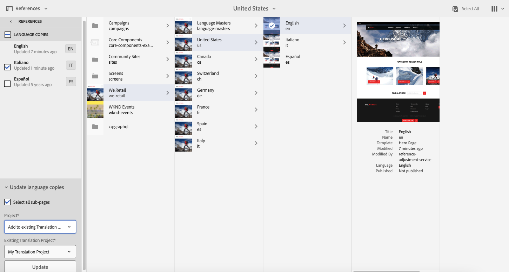

# 번역 프로젝트 관리{#managing-translation-projects}

번역을 위한 콘텐츠를 준비한 다음에는 누락된 언어 사본을 만들어 언어 구조를 완성하고 번역 프로젝트를 만들어야 합니다.

번역 프로젝트를 통해 AEM 콘텐츠의 번역을 관리할 수 있습니다. 번역 프로젝트는 다른 언어로 번역될 리소스를 포함하는 일종의 AEM [프로젝트](/help/sites-authoring/projects.md)입니다. 이러한 리소스는 언어 마스터로부터 생성되는 [언어 사본](/help/sites-administering/tc-prep.md)의 페이지 및 자산입니다.

리소스가 번역 프로젝트에 추가되면 해당 리소스에 대한 번역 작업이 생성됩니다. 작업은 리소스에서 실행되는 인간 번역 및 기계 번역 워크플로 관리에 사용하는 명령 및 상태 정보를 제공합니다.

>[!NOTE]
>
>번역 프로젝트에는 여러 번역 작업이 포함될 수 있습니다.

번역 프로젝트는 언어 및 번역 방법/공급업체에 의해 세계화를 위한 조직 거버넌스와 일치하도록 정의되는 장기 실행 항목입니다. 초기 번역 도중 또는 수동으로 한 번 시작해야 하며, 한 번 시작하면 콘텐츠 및 번역 업데이트 활동 전반에 걸쳐 계속 유효합니다.

번역 프로젝트 및 작업은 번역 준비 워크플로를 통해 생성됩니다. 이러한 워크플로에는 초기 번역(만들기 및 번역)과 업데이트(번역 업데이트) 모두를 위한 세 가지 옵션이 있습니다.

1. [새 프로젝트 만들기](#creating-translation-projects-using-the-references-panel)
1. [기존 프로젝트에 추가](#adding-pages-to-a-translation-project)
1. [콘텐츠 구조만](#creating-the-structure-of-a-language-copy)

>[!NOTE]
>
>옵션 3은 번역 작업/프로젝트와 관련이 없습니다. 언어 마스터의 콘텐츠 및 구조적 변경 내용을 (번역되지 않은) 언어 사본에 복사할 수 있습니다. 언어 사본 구조를 사용하여 번역 없이도 언어 마스터의 동기화를 유지할 수 있습니다.

## 초기 번역 수행 및 기존 번역 업데이트 {#performing-initial-translations-and-updating-existing-translations}

AEM은 번역 작업이 콘텐츠의 초기 작업을 위해 생성되는지 또는 이미 번역된 언어 사본을 업데이트하기 위해 생성되는지 여부를 감지합니다. 페이지에 대한 번역 작업을 생성하고 번역 중인 언어 사본을 표시하면 AEM은 타겟팅된 언어 사본에 소스 페이지가 이미 존재하는지 여부를 감지합니다.

* **언어 사본에 페이지가 포함되지 않음:** AEM은 이러한 상황을 초기 번역으로 취급합니다. 페이지는 즉시 언어 사본에 복사되며 프로젝트에 포함됩니다. 번역된 페이지를 AEM으로 가져오면 AEM은 이를 언어 사본에 바로 복사합니다.
* **언어 사본에 페이지가 이미 포함되어 있음:** AEM은 이러한 상황을 업데이트된 번역으로 취급합니다. 론치가 생성되며, 페이지 사본이 론치에 추가되고 프로젝트에 포함됩니다. 론치를 사용하면 업데이트된 번역을 언어 사본에 전송하기 전에 검토할 수 있습니다.

   * 번역된 페이지를 AEM으로 가져오면 AEM은 이를 론치의 페이지에 덮어씁니다.
   * 번역된 페이지는 론치가 홍보될 때만 언어 사본을 덮어씁니다.

예를 들어 /content/geometrixx/fr 언어 루트는 /content/geometrixx/en 마스터 언어의 프랑스어 번역용으로 만들어집니다. 프랑스어 사본에는 다른 페이지가 없습니다.

* 번역 프로젝트는 프랑스어 사본을 타겟팅하는 /content/geometrixx/en/products 페이지 및 모든 하위 페이지에 대해 만들어집니다. 언어 사본에 /content/geometrixx/fr/products 페이지가 없으므로 AEM은 즉시 /content/geometrixx/en/products 페이지와 모든 하위 페이지를 프랑스어 사본에 복사합니다. 복사된 항목은 번역 프로젝트에도 포함됩니다.
* 번역 프로젝트는 프랑스어 사본을 타겟팅하는 /content/geometrixx/en 페이지 및 모든 하위 페이지에 대해 만들어집니다. 언어 사본에 /content/geometrixx/en 페이지(언어 루트)에 해당하는 페이지가 포함되어 있으므로 AEM은 /content/geometrixx/en 페이지 및 모든 하위 페이지를 복사한 다음 론치에 추가합니다. 복사된 항목은 번역 프로젝트에도 포함됩니다.

## 참조 패널을 사용하여 번역 프로젝트 만들기 {#creating-translation-projects-using-the-references-panel}

번역 프로젝트를 만들어 언어 마스터 리소스를 번역하기 위한 워크플로를 실행하고 관리할 수 있습니다. 프로젝트를 만들 때 번역 중인 언어 마스터에서 페이지와 번역을 수행하고 있는 언어 사본을 지정합니다.

* 선택한 페이지와 연결된 번역 통합 프레임워크의 클라우드 구성은 사용할 번역 워크플로와 같은 번역 프로젝트의 많은 속성을 결정합니다.
* 프로젝트는 선택한 각 언어 사본에 대해 생성됩니다.
* 선택한 페이지의 사본 및 관련 자산이 추가되고 각 프로젝트에 추가됩니다. 이렇게 복사된 항목은 나중에 번역을 위해 번역 공급업체에게 전송됩니다.

선택한 페이지의 하위 페이지도 선택하도록 지정할 수 있습니다. 이 경우 하위 페이지의 사본도 번역할 수 있도록 각 프로젝트에 추가됩니다. 하위 페이지가 다른 번역 통합 프레임워크 구성과 연결되는 경우, AEM은 추가 프로젝트를 생성합니다.

[번역 프로젝트를 수동으로 생성](#creating-a-translation-project-using-the-projects-console)할 수도 있습니다.

>[!NOTE]
>
>프로젝트를 만들려면 귀하의 계정은 `project-administrators` 그룹의 멤버여야 합니다.

**초기 번역 및 번역 업데이트**

참조 패널은 사용자가 기존 언어 사본을 업데이트하는 중인지 또는 언어 사본의 첫 번째 버전을 만드는 중인지 여부를 표시합니다. 선택한 페이지에 대한 언어 사본이 존재하면 [언어 사본 업데이트] 탭이 표시되어 프로젝트 관련 명령에 대한 액세스 권한을 제공합니다.

번역 후에는 언어 사본을 번역본으로 덮어쓰기 전에 [번역을 검토](#reviewing-and-promoting-updated-content)할 수 있습니다. 선택한 페이지에 대한 언어 사본이 존재하지 않으면 [만들기 및 번역] 탭이 표시되어 프로젝트 관련 명령에 대한 액세스 권한을 제공합니다.

### 새 언어 사본에 대한 번역 프로젝트 만들기 {#create-translation-projects-for-a-new-language-copy}

1. Sites 콘솔을 사용하여 번역 프로젝트에 추가하려는 페이지를 선택합니다.

   예를 들어 Geometrixx 데모 사이트의 영어 페이지를 번역하려면 Geometrixx 데모 사이트 > 영어 를 선택합니다.

1. 도구 모음에서 참조 를 클릭합니다.

   

1. 언어 사본을 선택한 다음 소스 페이지를 번역하고 있는 언어 사본을 선택합니다.
1. 만들기 및 번역 을 클릭한 다음 번역 작업을 구성합니다.

   * 언어 드롭다운을 사용하여 번역할 언어 사본을 선택합니다. 필요에 따라 추가 언어를 선택합니다. 목록에 표시되는 언어는 [생성한 언어 루트](/help/sites-administering/tc-prep.md#creating-a-language-root)에 해당합니다.
   * 선택한 페이지 및 모든 하위 페이지를 번역하려면 모든 하위 페이지 선택을 선택합니다. 선택한 페이지만 번역하려면 이 옵션의 선택을 취소합니다.
   * [프로젝트]에서 새 번역 프로젝트 만들기 를 선택합니다.
   * 프로젝트의 이름을 입력합니다.

   

1. 만들기 를 클릭합니다.

### 기존 언어 사본에 대한 번역 프로젝트 만들기 {#create-translation-projects-for-an-existing-language-copy}

1. Sites 콘솔을 사용하여 번역 프로젝트에 추가할 페이지를 선택합니다.

   예를 들어 Geometrixx 데모 사이트의 영어 페이지를 번역하려면 Geometrixx 데모 사이트 > 영어 를 선택합니다.

1. 도구 모음에서 참조 를 클릭합니다.

   

1. 언어 사본을 선택한 다음 소스 페이지를 번역하고 있는 언어 사본을 선택합니다.
1. 언어 사본 업데이트 를 클릭한 다음 번역 작업을 구성합니다.

   * 선택한 페이지 및 모든 하위 페이지를 번역하려면 모든 하위 페이지 선택을 선택합니다. 선택한 페이지만 번역하려면 이 옵션의 선택을 취소합니다.
   * [프로젝트]에서 새 번역 프로젝트 만들기 를 선택합니다.
   * 프로젝트의 이름을 입력합니다.

   

1. 시작을 클릭합니다.

## 번역 프로젝트에 페이지 추가 {#adding-pages-to-a-translation-project}

번역 프로젝트를 만든 다음에는 리소스 창을 사용하여 프로젝트에 페이지를 추가할 수 있습니다. 페이지 추가는 동일한 프로젝트에 다른 분기의 페이지를 포함할 때 유용합니다.

번역 프로젝트에 페이지를 추가하면 해당 페이지는 새 번역 작업에 포함됩니다. [기존 작업에 페이지를 추가](#adding-pages-assets-to-a-translation-job)할 수도 있습니다.

프로젝트를 만들 때와 마찬가지로 페이지를 추가할 때도 기존 언어 사본을 덮어쓰는 것을 방지하기 위해 페이지 사본이 론치에 추가됩니다. ([기존 언어 사본에 대한 번역 프로젝트 만들기](#performing-initial-translations-and-updating-existing-translations)를 참조하십시오.)

1. Sites 콘솔을 사용하여 번역 프로젝트에 추가할 페이지를 선택합니다.

   예를 들어 Geometrixx 데모 사이트의 영어 페이지를 번역하려면 Geometrixx 데모 사이트 > 영어 를 선택합니다.

1. 도구 모음에서 참조 를 클릭합니다.

   

1. 언어 사본을 선택한 다음 소스 페이지를 번역하고 있는 언어 사본을 선택합니다.

   

1. 언어 사본 업데이트 를 클릭한 다음 속성을 구성합니다.

   * 선택한 페이지 및 모든 하위 페이지를 번역하려면 모든 하위 페이지 선택을 선택합니다. 선택한 페이지만 번역하려면 이 옵션의 선택을 취소합니다.
   * 프로젝트의 경우 기존 번역 프로젝트에 추가를 선택합니다.
   * 프로젝트를 선택합니다.

   >[!NOTE]
   >
   >번역 프로젝트의 타겟 언어 세트는 참조 패널에 표시된 언어 사본의 경로와 일치해야 합니다.

   

1. 시작을 클릭합니다.

## 번역 작업에 페이지/에셋 추가 {#adding-pages-assets-to-a-translation-job}

번역 프로젝트의 번역 작업에 페이지, 에셋, 태그 또는 i18n 사전을 추가할 수 있습니다. 페이지 또는 자산을 추가하려면 다음 작업을 수행하십시오.

1. 번역 프로젝트의 번역 작업 타일 하단에서 생략 부호를 클릭합니다.

   

1. 추가 및 페이지/에셋 을 클릭합니다.

   

1. 추가할 분기의 최상위 항목을 선택한 다음 확인 표시 아이콘을 클릭합니다. 여러 항목을 선택할 수 있습니다.

   

1. 또는 검색 아이콘을 선택하여 번역 작업에 추가하려는 페이지 또는 자산을 손쉽게 찾을 수 있습니다.

   

페이지 및/또는 에셋이 번역 작업에 추가됩니다.

## 번역 작업에 i18n 사전 추가 {#adding-i-n-dictionaries-to-a-translation-job}

번역 프로젝트의 번역 작업에 페이지, 에셋, 태그 또는 i18n 사전을 추가할 수 있습니다. i18n 사전을 추가하려면:

1. 번역 프로젝트의 번역 작업 타일 하단에서 생략 부호를 클릭합니다.

   

1. 추가 및 I18N-사전 을 클릭합니다.

   

1. 추가할 사전을 선택한 다음 추가 단추를 클릭합니다.

   

사전이 이제 번역 작업에 들어갔습니다.

>[!NOTE]
>
>i18n 사전에 대한 자세한 내용은 다음을 참조하십시오. [번역기를 사용하여 사전 관리](/help/sites-developing/i18n-translator.md).

## 번역 작업에 태그 추가 {#adding-tags-to-a-translation-job}

번역 프로젝트의 번역 작업에 페이지, 에셋, 태그 또는 i18n 사전을 추가할 수 있습니다. 태그를 추가하려면:

1. 번역 프로젝트의 번역 작업 타일 하단에서 생략 부호를 클릭합니다.

   

1. 추가 를 클릭한 다음 태그 를 클릭합니다.

   

1. 추가할 태그를 선택한 다음 확인 표시 아이콘을 클릭합니다. 여러 항목을 선택할 수 있습니다.

   

이제 태그가 번역 작업에 추가되었습니다.

## 번역 프로젝트 세부 정보 보기 {#seeing-translation-project-details}

번역 요약 타일에는 번역 프로젝트에 대해 구성된 속성이 포함되어 있습니다. 제네릭 외에 [프로젝트 정보](/help/sites-authoring/projects.md#project-info), 번역 탭에는 번역별 속성이 포함되어 있습니다.

* 소스 언어: 번역할 페이지의 언어입니다.
* 타겟 언어: 페이지를 번역할 언어입니다.
* 번역 방법: 번역 워크플로입니다. 사람 번역 또는 기계 번역이 지원됩니다.
* 번역 공급업체: 번역을 수행하는 번역 서비스 공급업체.
* 콘텐츠 범주: (기계 번역) 번역에 사용되는 콘텐츠 범주.
* 클라우드 구성: 프로젝트에 사용되는 번역 서비스 커넥터에 대한 클라우드 구성입니다.

페이지의 리소스 창을 사용하여 프로젝트를 만들면 소스 페이지의 속성에 따라 이러한 속성이 자동으로 구성됩니다.

## 번역 작업 상태 모니터링 {#monitoring-the-status-of-a-translation-job}

번역 프로젝트의 번역 작업 타일은 번역 작업의 상태와 작업 내 페이지 및 에셋의 수를 제공합니다.

다음 표는 작업 또는 작업 내 항목이 가질 수 있는 각각의 속성에 대해 설명합니다.

| 상태 | 설명 |
|---|---|
| 초안 | 번역 작업이 아직 시작되지 않았습니다. 처음 생성될 때 번역 작업은 초안 상태입니다. |
| 제출함 | 번역 작업 내 파일이 정상적으로 번역 서비스로 전송되었을 때 이 상태를 가질 수 있습니다. 이 상태는 범위 요청 명령 또는 시작 명령을 실행했을 때 나타날 수 있습니다. |
| 요청된 범위 | 사람 번역 워크플로의 경우, 작업 내의 파일이 범위 지정을 위해 번역 공급업체에 제출되었습니다. 이 상태는 범위 요청 명령을 실행했을 때 나타납니다. |
| 완료된 범위 | 공급업체에서 번역 작업의 범위를 지정했습니다. |
| 번역용으로 전송됨 | 프로젝트 소유자가 범위를 수락했습니다. 이 상태는 번역 공급업체가 작업 내 파일의 번역을 시작해야 함을 나타냅니다. |
| 번역 진행 중 | (작업의 경우) 하나 이상의 작업 내 파일의 번역이 아직 완료되지 않았습니다. (작업 내 항목의 경우) 항목이 번역되고 있습니다. |
| 번역됨 | (작업의 경우) 작업 내 모든 파일의 번역이 아직 완료되지 않았습니다. (작업 내 항목의 경우) 항목이 번역됩니다. |
| 검토 준비됨 | 작업 내 항목의 번역이 완료되어 파일을 AEM으로 가져왔습니다. |
| 완료 | 프로젝트 소유자가 번역 계약이 완료되었음을 나타냈습니다. |
| 취소 | 번역 공급업체가 번역 작업을 중단해야 함을 나타냅니다. |
| 오류 업데이트 | AEM 및 번역 서비스 간 파일을 전송하는 동안 오류가 발생했습니다. |
| 알 수 없는 상태 | 알 수 없는 오류가 발생했습니다. |

작업에 있는 각 파일의 상태를 보려면 타일 하단의 생략 부호를 클릭합니다.

## 번역 작업 만기일 설정 {#setting-the-due-date-of-translation-jobs}

번역 공급업체에서 번역된 파일을 반환해야 하는 날짜를 지정합니다. 프로젝트 또는 특정 작업에 대한 기한을 설정할 수 있습니다.

* **프로젝트:** 프로젝트의 번역 작업은 기한을 상속합니다.
* **작업:** 작업에 대해 설정한 기한은 프로젝트에 대해 설정한 기한보다 우선합니다.

사용 중인 번역 공급업체가 만기일 설정 기능을 지원하는 경우에만 이 기능이 올바르게 작동합니다.

다음 절차에서는 프로젝트의 기한을 설정합니다.

1. 번역 요약 타일 하단의 생략 부호를 클릭합니다.

   

1. 기본 탭에서 만기일 속성의 날짜 선택기를 사용하여 만기일을 선택합니다.

   

1. 완료를 클릭합니다.

다음 절차는 번역 작업의 기한을 설정합니다.

1. 번역 작업 타일에서 명령 메뉴를 클릭한 다음 기한을 클릭합니다.

   

1. 대화 상자에서 달력 아이콘을 클릭하고 기한으로 사용할 날짜와 시간을 선택한 다음 저장을 클릭합니다.

   

## 번역 작업 범위 지정 {#scoping-a-translation-job}

번역 작업의 범위를 지정하여 번역 서비스 공급업체로부터 번역료의 견적서를 받을 수 있습니다. 작업의 범위를 지정하면 텍스트와 저장된 번역 풀(번역 메모리)을 비교하는 번역 공급업체에 소스 타일이 제출됩니다. 일반적으로 범위는 번역이 필요한 단어의 수를 의미합니다.

범위 지정 결과에 대한 자세한 정보를 얻으려면 귀사의 번역 공급업체에 문의하십시오.

>[!NOTE]
>
>범위 지정은 선택 사항입니다. 범위를 지정하지 않고 번역 작업을 시작할 수 있습니다.

번역 작업의 범위를 지정할 때 해당 작업의 상태는 다음과 같습니다. `Scope Requested`. 번역 공급업체가 범위를 반환하면 이 상태로 변경됩니다. `Scope Completed`. 범위 지정이 완료되면 범위 표시 명령을 사용하여 범위 지정 결과를 검토할 수 있습니다.

사용 중인 번역 공급업체가 범위 지정 기능을 지원하는 경우에만 이 기능이 올바르게 작동합니다.

1. 프로젝트 콘솔에서 번역 프로젝트를 엽니다.
1. 번역 작업 타일에서 명령 메뉴를 클릭한 다음 범위 요청을 클릭합니다.

   

1. 작업 상태가 SCOPE_COMPLETED로 변경되면 번역 작업 타일에서 명령 메뉴를 클릭한 다음 범위 표시를 클릭합니다.

## 번역 작업 시작 {#starting-a-translation-job}

번역 작업을 시작하여 소스 페이지를 타겟 언어로 번역합니다. 번역 요약 타일의 속성 값에 따라 번역이 수행됩니다.

번역 작업을 시작하면 번역 작업 타일에 번역 진행 중 상태가 표시됩니다.

1. 프로젝트 콘솔에서 번역 프로젝트를 엽니다.
1. 번역 작업 타일에서 명령 메뉴를 클릭한 다음 시작을 클릭합니다.

   

1. 번역 시작을 확인하는 작업 대화 상자에서 닫기를 클릭합니다.

## 번역 작업 취소 {#canceling-a-translation-job}

번역 작업을 취소하여 번역 프로세스를 중지하고 번역 공급업체가 이후 번역을 수행하지 않도록 할 수 있습니다. 작업에 다음이 있는 경우 작업을 취소할 수 있습니다. `Committed For Translation` 또는 `Translation In Progress` 상태.

1. 프로젝트 콘솔에서 번역 프로젝트를 엽니다.
1. 번역 작업 타일에서 명령 메뉴를 클릭한 다음 취소를 클릭합니다.
1. 번역 취소를 확인하는 작업 대화 상자에서 확인 을 클릭합니다.

## 워크플로 수락/거부 {#accept-reject-workflow}

번역된 콘텐츠가 돌아오고 검토 준비됨 상태이면 번역 작업으로 이동하여 콘텐츠를 수락/거부할 수 있습니다.

번역 거부 를 선택하면 댓글을 추가할 수 있습니다.

콘텐츠를 거부하면 댓글을 확인할 수 있도록 해당 콘텐츠가 번역 공급업체에 다시 전송됩니다.

## 업데이트된 콘텐츠 검토 및 홍보 {#reviewing-and-promoting-updated-content}

기존 언어 사본에 대해 콘텐츠를 번역할 때, 번역본을 검토하고 필요한 경우 변경 내용을 적용한 다음 해당 번역본을 홍보하여 언어 사본으로 이동할 수 있습니다. 번역 작업에 검토 준비됨 상태가 표시되면 번역된 파일을 검토할 수 있습니다.

1. 언어 마스터에서 페이지를 선택하고 참조를 클릭한 다음 언어 복사를 클릭합니다.
1. 검토할 언어 사본을 클릭합니다.

   

1. 론치 관련 명령을 표시하려면 론치 를 클릭합니다.

   

1. 페이지의 론치 사본을 열어 콘텐츠를 검토하고 편집하려면 페이지 열기 를 클릭합니다.
1. 콘텐츠를 검토하고 필요한 변경 내용을 적용한 후 론치 사본을 홍보하려면 홍보 를 클릭합니다.
1. 론치 홍보 페이지에서 홍보할 페이지를 지정한 다음 홍보를 클릭합니다.

## 언어 사본 비교 {#comparing-language-copies}

언어 사본을 기본 언어와 비교하려면

1. 다음에서 **사이트** 콘솔에서 비교할 언어 사본으로 이동합니다.
1. 를 엽니다. **[참조](/help/sites-authoring/basic-handling.md#references)** 패널.
1. **사본** 제목에서 **언어 사본**&#x200B;을 선택합니다.
1. 특정 언어 사본을 선택하면 **기본에 비교**또는 **이전 버전에 비교**해당하는 경우)를 클릭할 수 있습니다.

   

1. 두 페이지(론치와 소스)가 나란히 열립니다.

   이 기능의 사용에 대한 자세한 내용은 [페이지 비교](/help/sites-authoring/page-diff.md)를 참조하십시오.

## 번역 작업 완료 및 보관 {#completing-and-archiving-translation-jobs}

공급업체로부터 번역된 파일을 검토한 후 번역 작업을 완료합니다. 사람 번역 워크플로의 경우 번역을 완료했다는 것은 번역 계약이 이행되었으며 공급업체는 번역본을 번역 메모리에 저장해야 함을 나타냅니다.

작업을 완료하면 작업은 완료 상태가 됩니다.

번역 작업이 완료되어 더 이상 작업 상태 세부 정보를 볼 필요가 없으면 번역 작업을 보관하십시오. 작업을 보관하면 번역 작업 타일이 프로젝트에서 제거됩니다.

## 언어 사본 구조 만들기 {#creating-the-structure-of-a-language-copy}

번역 중인 마스터 언어의 콘텐츠를 포함하도록 언어 사본을 채웁니다. 언어 사본을 채우기 전에 언어 사본의 [언어 루트](/help/sites-administering/tc-prep.md#creating-a-language-root)를 만들어야 합니다.

1. 사이트 콘솔을 사용하여 소스로 사용 중인 마스터 언어의 언어 루트를 선택합니다. 예를 들어 Geometrixx 데모 사이트의 영어 페이지를 번역하려면 컨텐츠 > Geometrixx 데모 사이트 > 영어 를 선택합니다.
1. 도구 모음에서 참조 를 클릭합니다.

   

1. 언어 사본을 선택한 다음 채우려는 언어 사본을 선택합니다.

   

1. 언어 사본 업데이트 를 클릭하여 번역 도구를 표시하고 속성을 구성합니다.

   * 모든 하위 페이지 선택 옵션을 선택합니다.
   * [프로젝트]에서 [구조만 만들기]를 선택합니다.

   

1. 시작을 클릭합니다.

## 소스 페이지 이동 또는 이름 바꾸기 {#move-source}

이미 번역된 소스 페이지가 필요한 경우 [이름이 변경되거나 이동됨](/help/sites-authoring/managing-pages.md#moving-or-renaming-a-page)이동 후 페이지를 다시 번역하면 새 페이지 이름/위치를 기반으로 언어 사본이 만들어집니다. 이전 이름/위치를 기반으로 한 이전 언어 사본은 여전히 존재합니다. 이를 방지하기 위해 이동 후 언어 복사 업데이트 기능을 사용할 수 있습니다.

1. 언어 사본이 있는 페이지를 이동합니다.
1. 언어 사본 루트를 선택합니다.
1. 를 엽니다. **참조** 패널.
1. 선택 **언어 사본**.
1. 업데이트할 타겟 언어를 선택합니다.
1. 선택 **언어 사본 업데이트**.

   

1. 클릭 **업데이트**. A [시작](/help/sites-authoring/launches-promoting.md) 이(가) 생성됩니다.
1. 필요한 언어 루트로 이동하여 선택합니다.
1. 사용 **참조** 패널, 선택 **론치**.

   

1. 생성된 론치를 클릭하고 를 클릭합니다. **출시 홍보**.

이제 소스 페이지와 관련 언어 사본이 이동되었습니다.

## 프로젝트 콘솔을 사용하여 번역 프로젝트 만들기 {#creating-a-translation-project-using-the-projects-console}

프로젝트 콘솔을 사용하려는 경우 번역 프로젝트를 수동으로 만들 수 있습니다.

>[!NOTE]
>
>프로젝트를 만들려면 귀하의 계정은 `projects-administrators` 그룹의 멤버여야 합니다.

번역 프로젝트를 수동으로 만들 때, [기본 속성](/help/sites-authoring/touch-ui-managing-projects.md#creating-a-project) 이외에도 다음 번역 관련 속성에 대한 값을 제공해야 합니다.

* **이름:** 프로젝트 이름.
* **소스 언어:** 소스 콘텐츠의 언어입니다.
* **타겟 언어:** 콘텐츠를 번역할 언어입니다.
* **번역 방법:** 번역을 수동으로 수행함을 나타내려면 사람 번역 을 선택합니다.

1. 프로젝트 콘솔의 도구 모음에서 만들기 를 클릭합니다.
1. 번역 프로젝트 템플릿을 선택하고 다음 을 클릭합니다.
1. 기본 속성에 대한 값을 입력합니다.
1. 고급 을 클릭하고 번역 관련 속성에 대한 값을 제공합니다.
1. 만들기 를 클릭합니다. 확인란에서 완료 를 클릭하여 프로젝트 콘솔로 돌아가거나 프로젝트 열기 를 클릭하여 프로젝트를 열고 관리를 시작합니다.

## 번역 작업 내보내기 {#exporting-a-translation-job}

번역 작업의 콘텐츠를 다운로드하여 커넥터를 통해 AEM과 통합되지 않은 번역 공급업체에 전송하거나 콘텐츠를 검토할 수 있습니다.

1. 번역 작업 타일의 드롭다운 메뉴에서 내보내기를 클릭합니다.
1. 내보내기 대화 상자에서 내보낸 파일 다운로드를 클릭하고 필요한 경우 웹 브라우저 대화 상자를 사용하여 파일을 저장합니다.
1. 내보내기 대화 상자에서 닫기를 클릭합니다.

## 번역 작업 가져오기 {#importing-a-translation-job}

번역된 컨텐츠는 커넥터를 통해 AEM과 통합되지 않아 번역 공급업체에서 전송한 번역된 컨텐츠를 AEM으로 가져올 수 있습니다.

1. 번역 작업 타일의 드롭다운 메뉴에서 가져오기를 클릭합니다.
1. 웹 브라우저의 대화 상자를 사용하여 내보낼 파일을 선택합니다.
1. 가져오기 대화 상자에서 닫기를 클릭합니다.
